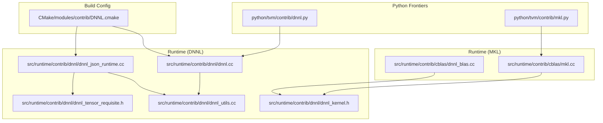
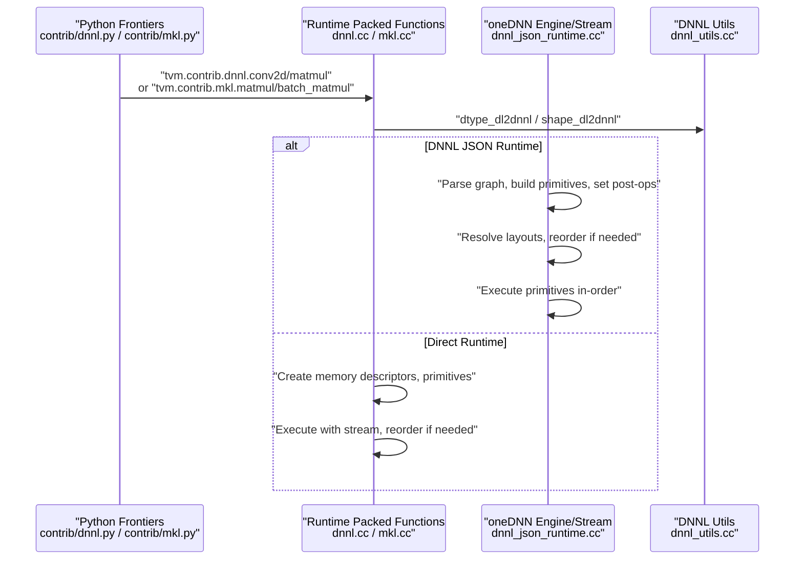
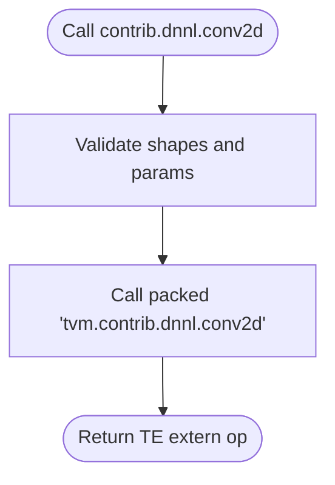
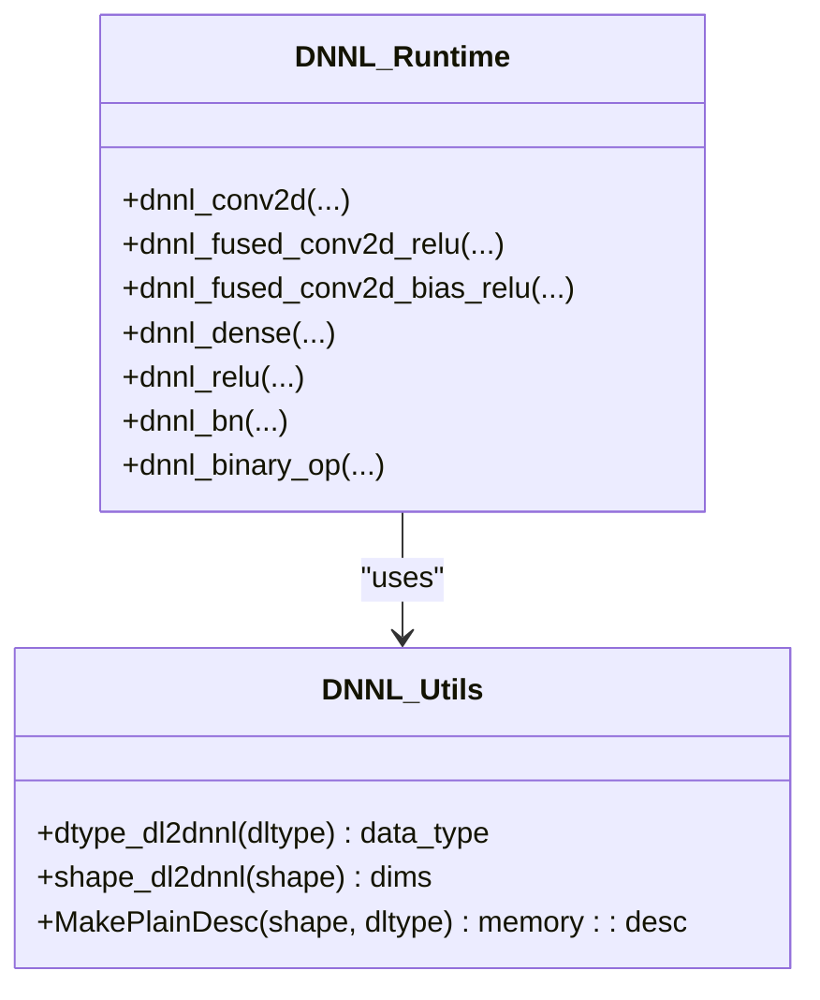
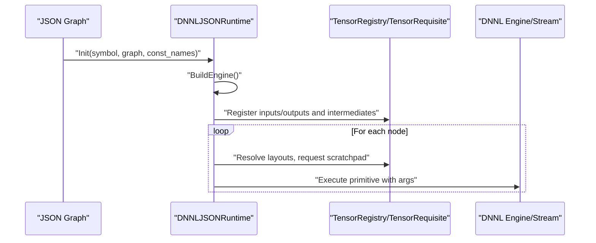
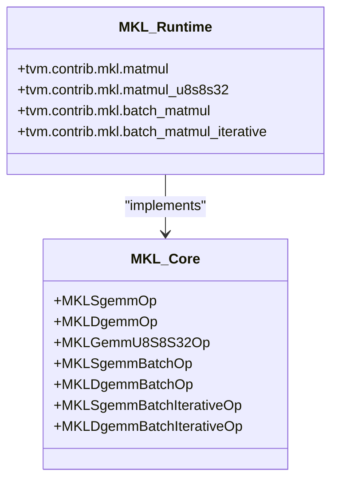
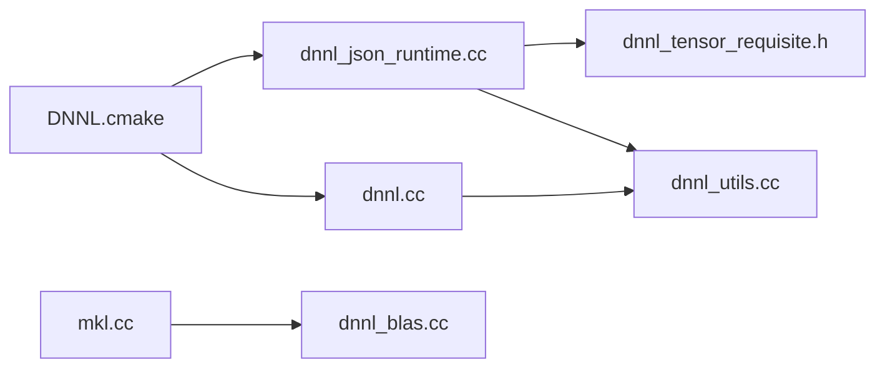

# DNNL Integration

<cite>
**Referenced Files in This Document**
- [DNNL.cmake](file://CMake/modules/contrib/DNNL.cmake)
- [dnnl.py](file://python/tvm/contrib/dnnl.py)
- [mkl.py](file://python/tvm/contrib/mkl.py)
- [dnnl.cc](file://src/runtime/contrib/dnnl/dnnl.cc)
- [dnnl_utils.cc](file://src/runtime/contrib/dnnl/dnnl_utils.cc)
- [dnnl_utils.h](file://src/runtime/contrib/dnnl/dnnl_utils.h)
- [dnnl_kernel.h](file://src/runtime/contrib/dnnl/dnnl_kernel.h)
- [dnnl_json_runtime.cc](file://src/runtime/contrib/dnnl/dnnl_json_runtime.cc)
- [dnnl_tensor_requisite.h](file://src/runtime/contrib/dnnl/dnnl_tensor_requisite.h)
- [dnnl_blas.cc](file://src/runtime/contrib/cblas/dnnl_blas.cc)
- [mkl.cc](file://src/runtime/contrib/cblas/mkl.cc)
- [test_codegen_dnnl.py](file://tests/python/relax/test_codegen_dnnl.py)
</cite>

## Table of Contents
1. [Introduction](#introduction)
2. [Project Structure](#project-structure)
3. [Core Components](#core-components)
4. [Architecture Overview](#architecture-overview)
5. [Detailed Component Analysis](#detailed-component-analysis)
6. [Dependency Analysis](#dependency-analysis)
7. [Performance Considerations](#performance-considerations)
8. [Troubleshooting Guide](#troubleshooting-guide)
9. [Conclusion](#conclusion)
10. [Appendices](#appendices)

## Introduction
This document explains how TVM integrates Intel’s oneDNN (formerly DNNL) and Intel MKL to accelerate CPU deep learning and math workloads. It covers:
- How TVM exposes DNNL-backed operations for convolution, pooling, normalization, activation, and dense layers
- How TVM integrates MKL for vector math and BLAS operations
- Practical configuration, optimization, and deployment guidance for Intel CPUs
- Supported data types, threading, and performance tuning strategies
- Integration with Intel development tools and workflows

## Project Structure
The DNNL and MKL integrations span Python frontiers, C++ runtime modules, and CMake build configuration. Key areas:
- Python APIs for DNNL and MKL external ops
- Runtime wrappers and JSON runtime for DNNL
- CMake flags to enable DNNL builds
- Tests validating offload and fusion to DNNL

**Diagram sources**
- [DNNL.cmake:18-60](file://CMake/modules/contrib/DNNL.cmake#L18-L60)
- [dnnl.py:25-165](file://python/tvm/contrib/dnnl.py#L25-L165)
- [mkl.py:23-128](file://python/tvm/contrib/mkl.py#L23-L128)
- [dnnl.cc:82-391](file://src/runtime/contrib/dnnl/dnnl.cc#L82-L391)
- [dnnl_utils.cc:32-77](file://src/runtime/contrib/dnnl/dnnl_utils.cc#L32-L77)
- [dnnl_json_runtime.cc:51-118](file://src/runtime/contrib/dnnl/dnnl_json_runtime.cc#L51-L118)
- [dnnl_tensor_requisite.h:89-498](file://src/runtime/contrib/dnnl/dnnl_tensor_requisite.h#L89-L498)
- [dnnl_kernel.h:42-74](file://src/runtime/contrib/dnnl/dnnl_kernel.h#L42-L74)
- [dnnl_blas.cc:40-60](file://src/runtime/contrib/cblas/dnnl_blas.cc#L40-L60)
- [mkl.cc:57-210](file://src/runtime/contrib/cblas/mkl.cc#L57-L210)

**Section sources**
- [DNNL.cmake:18-60](file://CMake/modules/contrib/DNNL.cmake#L18-L60)
- [dnnl.py:25-165](file://python/tvm/contrib/dnnl.py#L25-L165)
- [mkl.py:23-128](file://python/tvm/contrib/mkl.py#L23-L128)
- [dnnl.cc:82-391](file://src/runtime/contrib/dnnl/dnnl.cc#L82-L391)
- [dnnl_utils.cc:32-77](file://src/runtime/contrib/dnnl/dnnl_utils.cc#L32-L77)
- [dnnl_json_runtime.cc:51-118](file://src/runtime/contrib/dnnl/dnnl_json_runtime.cc#L51-L118)
- [dnnl_tensor_requisite.h:89-498](file://src/runtime/contrib/dnnl/dnnl_tensor_requisite.h#L89-L498)
- [dnnl_kernel.h:42-74](file://src/runtime/contrib/dnnl/dnnl_kernel.h#L42-L74)
- [dnnl_blas.cc:40-60](file://src/runtime/contrib/cblas/dnnl_blas.cc#L40-L60)
- [mkl.cc:57-210](file://src/runtime/contrib/cblas/mkl.cc#L57-L210)

## Core Components
- DNNL Python API: Exposes external ops for convolution, dense, activation, normalization, and binary ops. It constructs TE extern ops that call packed functions registered at runtime.
- DNNL Runtime Wrappers: Provide C-compatible wrappers implementing DNNL primitives for convolutions, pooling, normalization, activations, and binary ops.
- DNNL JSON Runtime: A graph executor runtime that parses a serialized graph, resolves memory layouts, applies post-ops, and executes primitives in-order with a DNNL engine/stream.
- DNNL Utilities: Mapping between TVM DLDataType and DNNL memory::data_type, shape handling, and plain memory descriptor construction.
- MKL Python API: Exposes external ops for GEMM variants (float, double, u8s8s32) and batched GEMM with optional iterative fallback.
- MKL Runtime: Implements packed functions for MKL SGEMM/DGEMM and batched variants, including offset handling for quantized GEMM.

Key capabilities:
- Convolution, pooling, normalization, activation, softmax, binary ops, dense, and matmul
- Post-op fusion (e.g., conv+relu)
- Layout inference and reorders
- Scratchpad and memory reuse
- Quantized GEMM support

**Section sources**
- [dnnl.py:25-165](file://python/tvm/contrib/dnnl.py#L25-L165)
- [dnnl.cc:82-391](file://src/runtime/contrib/dnnl/dnnl.cc#L82-L391)
- [dnnl_json_runtime.cc:244-295](file://src/runtime/contrib/dnnl/dnnl_json_runtime.cc#L244-L295)
- [dnnl_utils.cc:32-77](file://src/runtime/contrib/dnnl/dnnl_utils.cc#L32-L77)
- [mkl.py:23-128](file://python/tvm/contrib/mkl.py#L23-L128)
- [mkl.cc:57-210](file://src/runtime/contrib/cblas/mkl.cc#L57-L210)

## Architecture Overview
The integration comprises:
- Python frontiers that declare external ops and call into packed functions
- Runtime registration of packed functions that wrap DNNL or MKL primitives
- Graph-level JSON runtime for composite DNNL graphs with layout resolution and post-op fusion

**Diagram sources**
- [dnnl.py:25-165](file://python/tvm/contrib/dnnl.py#L25-L165)
- [mkl.py:23-128](file://python/tvm/contrib/mkl.py#L23-L128)
- [dnnl.cc:82-391](file://src/runtime/contrib/dnnl/dnnl.cc#L82-L391)
- [dnnl_json_runtime.cc:244-295](file://src/runtime/contrib/dnnl/dnnl_json_runtime.cc#L244-L295)
- [dnnl_utils.cc:32-77](file://src/runtime/contrib/dnnl/dnnl_utils.cc#L32-L77)

## Detailed Component Analysis

### DNNL Python API
- Provides TE extern ops for:
  - Conv2d with padding, stride, dilation, groups, channel_last, pre/post-cast flags
  - Dense (inner product)
  - ReLU, BatchNorm, Binary ops
  - Matmul via DNNL sgemm wrapper
- These ops forward to packed functions registered at runtime.

**Diagram sources**
- [dnnl.py:58-165](file://python/tvm/contrib/dnnl.py#L58-L165)

**Section sources**
- [dnnl.py:25-165](file://python/tvm/contrib/dnnl.py#L25-L165)

### DNNL Runtime Wrappers
- Implements:
  - Convolution forward (with optional bias and post-ops)
  - Fused conv+relu and conv+bias+relu
  - Dense (inner product)
  - ReLU, BatchNorm, Binary ops
- Uses DNNL engine/stream, memory descriptors, reorder primitives, and post-ops.

**Diagram sources**
- [dnnl.cc:82-391](file://src/runtime/contrib/dnnl/dnnl.cc#L82-L391)
- [dnnl_utils.cc:32-77](file://src/runtime/contrib/dnnl/dnnl_utils.cc#L32-L77)
- [dnnl_kernel.h:42-74](file://src/runtime/contrib/dnnl/dnnl_kernel.h#L42-L74)

**Section sources**
- [dnnl.cc:82-391](file://src/runtime/contrib/dnnl/dnnl.cc#L82-L391)
- [dnnl_utils.cc:32-77](file://src/runtime/contrib/dnnl/dnnl_utils.cc#L32-L77)
- [dnnl_utils.h](file://src/runtime/contrib/dnnl/dnnl_utils.h)
- [dnnl_kernel.h:42-74](file://src/runtime/contrib/dnnl/dnnl_kernel.h#L42-L74)

### DNNL JSON Runtime
- Parses a graph, builds DNNL primitives, sets post-ops (e.g., eltwise, sum fusion), and manages memory via TensorRequisite and TensorRegistry.
- Supports:
  - Convolution/deconvolution, dense, pooling, softmax, eltwise, binary, batch/layer norm, matmul
- Handles layout inference, reorders, scratchpad allocation, and inplace semantics.

**Diagram sources**
- [dnnl_json_runtime.cc:51-118](file://src/runtime/contrib/dnnl/dnnl_json_runtime.cc#L51-L118)
- [dnnl_json_runtime.cc:244-295](file://src/runtime/contrib/dnnl/dnnl_json_runtime.cc#L244-L295)
- [dnnl_tensor_requisite.h:506-740](file://src/runtime/contrib/dnnl/dnnl_tensor_requisite.h#L506-L740)

**Section sources**
- [dnnl_json_runtime.cc:51-118](file://src/runtime/contrib/dnnl/dnnl_json_runtime.cc#L51-L118)
- [dnnl_json_runtime.cc:244-295](file://src/runtime/contrib/dnnl/dnnl_json_runtime.cc#L244-L295)
- [dnnl_tensor_requisite.h:89-498](file://src/runtime/contrib/dnnl/dnnl_tensor_requisite.h#L89-L498)

### MKL Integration
- Python API:
  - Float and double GEMM
  - Quantized u8s8s32 GEMM
  - Batched GEMM (float/double) with optional iterative mode
- Runtime:
  - Packed functions dispatch to MKL CBLAS routines
  - Supports offsets for quantized GEMM

**Diagram sources**
- [mkl.py:23-128](file://python/tvm/contrib/mkl.py#L23-L128)
- [mkl.cc:57-210](file://src/runtime/contrib/cblas/mkl.cc#L57-L210)
- [dnnl_blas.cc:40-60](file://src/runtime/contrib/cblas/dnnl_blas.cc#L40-L60)

**Section sources**
- [mkl.py:23-128](file://python/tvm/contrib/mkl.py#L23-L128)
- [mkl.cc:57-210](file://src/runtime/contrib/cblas/mkl.cc#L57-L210)
- [dnnl_blas.cc:40-60](file://src/runtime/contrib/cblas/dnnl_blas.cc#L40-L60)

### Data Types and Layouts
- Supported data types include float16, float32, bfloat16, int8, and uint8 via dtype mapping helpers.
- Layouts are inferred or requested explicitly; TensorRequisite supports:
  - TreatAs(layout_string) for blocked layouts
  - Permute, Reshape, Crop, Squeeze
  - LayoutAny for DNNL to choose optimal format
- Memory descriptors are constructed with plain strides or blocked formats.

**Section sources**
- [dnnl_utils.cc:32-77](file://src/runtime/contrib/dnnl/dnnl_utils.cc#L32-L77)
- [dnnl_tensor_requisite.h:294-392](file://src/runtime/contrib/dnnl/dnnl_tensor_requisite.h#L294-L392)

### Operations Covered
- Convolution: forward, grouped, bias optional, post-ops
- Pooling: max, average (include/exclude padding)
- Normalization: batch norm, layer norm
- Activation: relu, leaky relu, tanh, sigmoid, clip, gelu, mish, swish
- Binary: add, multiply
- Dense: inner product with bias
- Matmul: via DNNL sgemm or MKL GEMM

**Section sources**
- [dnnl.cc:170-391](file://src/runtime/contrib/dnnl/dnnl.cc#L170-L391)
- [dnnl_json_runtime.cc:297-768](file://src/runtime/contrib/dnnl/dnnl_json_runtime.cc#L297-L768)
- [mkl.cc:57-210](file://src/runtime/contrib/cblas/mkl.cc#L57-L210)

## Dependency Analysis
- Build-time selection of DNNL:
  - CMake module conditionally compiles DNNL-related sources and links the DNNL library depending on USE_DNNL setting.
- Runtime dependencies:
  - DNNL JSON runtime depends on DNNL headers and utilities
  - DNNL wrappers depend on DNNL C++ API
  - MKL runtime depends on MKL CBLAS headers

**Diagram sources**
- [DNNL.cmake:18-60](file://CMake/modules/contrib/DNNL.cmake#L18-L60)
- [dnnl_json_runtime.cc:41-43](file://src/runtime/contrib/dnnl/dnnl_json_runtime.cc#L41-L43)
- [dnnl.cc:36-37](file://src/runtime/contrib/dnnl/dnnl.cc#L36-L37)
- [mkl.cc:28-32](file://src/runtime/contrib/cblas/mkl.cc#L28-L32)
- [dnnl_blas.cc:28-32](file://src/runtime/contrib/cblas/dnnl_blas.cc#L28-L32)

**Section sources**
- [DNNL.cmake:18-60](file://CMake/modules/contrib/DNNL.cmake#L18-L60)
- [dnnl_json_runtime.cc:41-43](file://src/runtime/contrib/dnnl/dnnl_json_runtime.cc#L41-L43)
- [dnnl.cc:36-37](file://src/runtime/contrib/dnnl/dnnl.cc#L36-L37)
- [mkl.cc:28-32](file://src/runtime/contrib/cblas/mkl.cc#L28-L32)
- [dnnl_blas.cc:28-32](file://src/runtime/contrib/cblas/dnnl_blas.cc#L28-L32)

## Performance Considerations
- Post-op fusion: Combine conv+relu or conv+bias+relu to reduce memory traffic.
- Layout inference: Use layout hints and TreatAs to align with DNNL preferred formats; minimize reorders.
- Scratchpad: Ensure sufficient scratchpad space; the JSON runtime allocates per-primitive scratchpad and a global one.
- Batched GEMM: Prefer vectorized batch APIs; fallback to iterative mode when needed.
- Quantized GEMM: Use u8s8s32 path for int8 accumulation where appropriate.
- Threading: Control DNNL/MKL thread counts via environment variables before runtime initialization.
- Data types: Prefer bf16/fp16 when supported by the model and acceptable precision allows.

[No sources needed since this section provides general guidance]

## Troubleshooting Guide
Common issues and remedies:
- Unsupported data type: Verify dtype mapping; unsupported combinations will log an error.
- Layout mismatches: Ensure layout strings match tensor ranks and blocked dimensions; use TreatAs to convert.
- Missing DNNL/MKL: Confirm build flags and library availability; CMake messages indicate detection.
- Post-op parsing: Ensure activation names and attributes match supported keys; otherwise defaults or errors may occur.
- Quantized GEMM offsets: Validate offset types and sizes; incorrect values cause exceptions.

**Section sources**
- [dnnl_utils.cc:52-56](file://src/runtime/contrib/dnnl/dnnl_utils.cc#L52-L56)
- [dnnl_json_runtime.cc:146-242](file://src/runtime/contrib/dnnl/dnnl_json_runtime.cc#L146-L242)
- [mkl.cc:42-53](file://src/runtime/contrib/cblas/mkl.cc#L42-L53)

## Conclusion
TVM’s DNNL and MKL integrations provide a robust, high-performance path for CPU deep learning and math workloads. The Python frontiers expose convenient ops, the runtime wraps DNNL primitives and MKL BLAS, and the JSON runtime enables efficient graph execution with layout inference and post-op fusion. By leveraging the build flags, data type mapping, and layout utilities, developers can deploy optimized models across Intel CPU architectures.

[No sources needed since this section summarizes without analyzing specific files]

## Appendices

### Practical Configuration and Deployment
- Build with DNNL:
  - Set USE_DNNL to ON, JSON, or C_SRC to include DNNL sources and link the library.
  - The build system adds DNNL runtime sources and enables JSON runtime when configured.
- Python usage:
  - Import contrib/dnnl.py or contrib/mkl.py and construct ops; compile with a CPU target.
- Relax offload:
  - Fuse patterns like conv+relu and run RunCodegen to generate a DNNL-backed module.

**Section sources**
- [DNNL.cmake:18-60](file://CMake/modules/contrib/DNNL.cmake#L18-L60)
- [test_codegen_dnnl.py:66-93](file://tests/python/relax/test_codegen_dnnl.py#L66-L93)

### Supported Data Types and Layouts
- Data types: float16, float32, bfloat16, int8, uint8
- Layouts: NCHW/NHWC, blocked layouts via layout strings; automatic inference via LayoutAny

**Section sources**
- [dnnl_utils.cc:32-56](file://src/runtime/contrib/dnnl/dnnl_utils.cc#L32-L56)
- [dnnl_tensor_requisite.h:294-392](file://src/runtime/contrib/dnnl/dnnl_tensor_requisite.h#L294-L392)

### Threading and Environment
- Control threads via environment variables before runtime initialization (e.g., OMP_NUM_THREADS, DNNL_CPU_RUNTIME).
- For MKL, configure thread pools and avoid oversubscription in multi-process scenarios.

[No sources needed since this section provides general guidance]