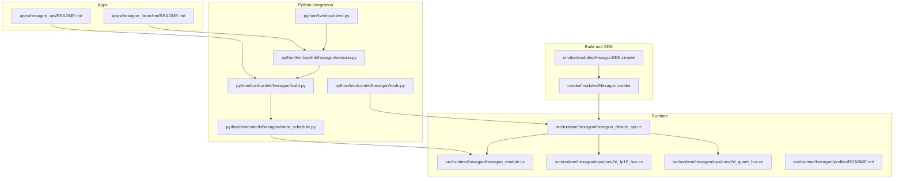
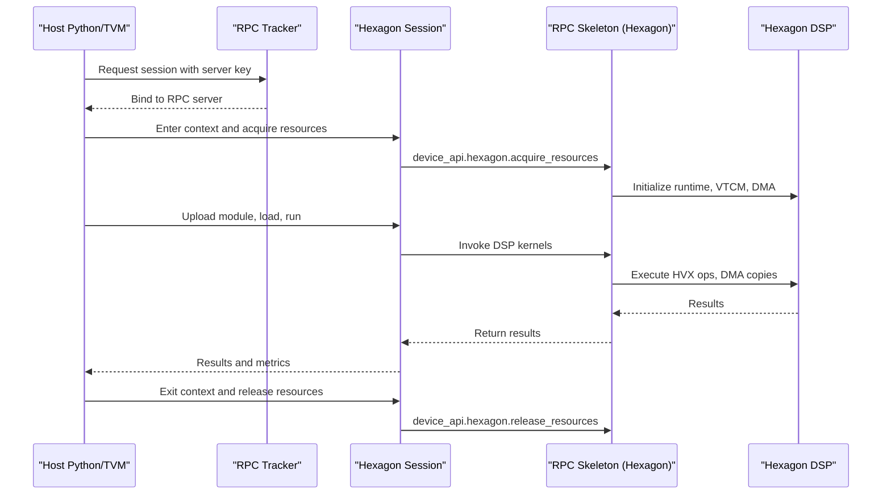
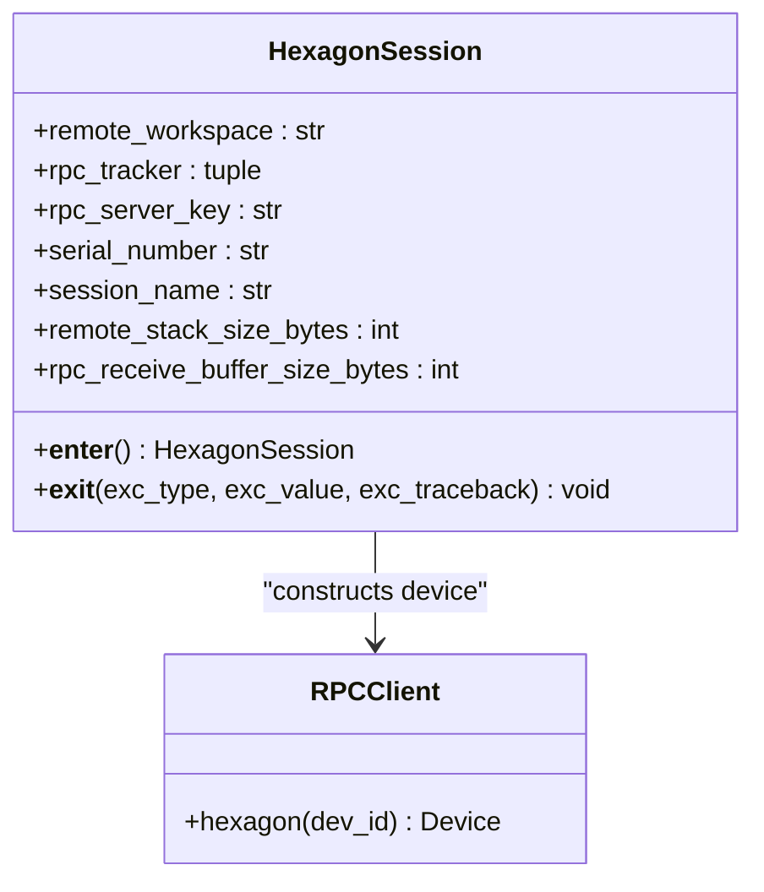
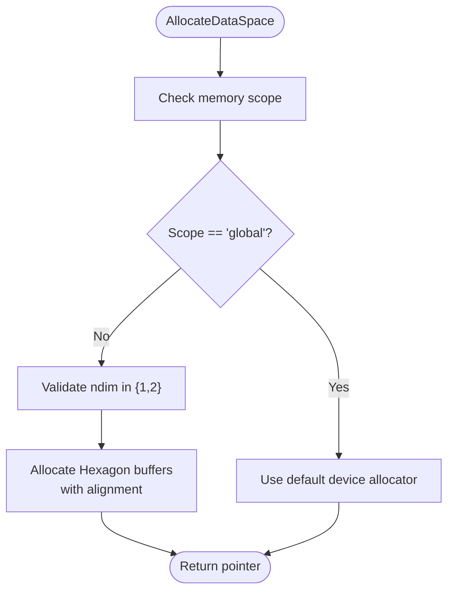
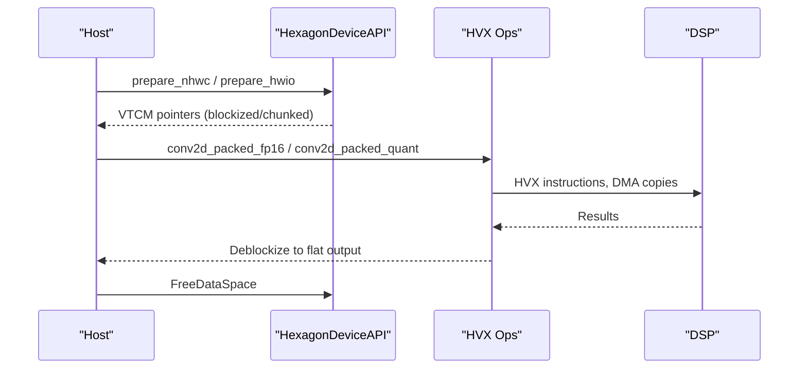
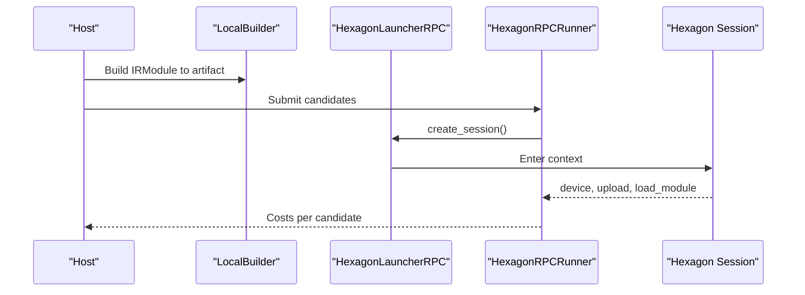
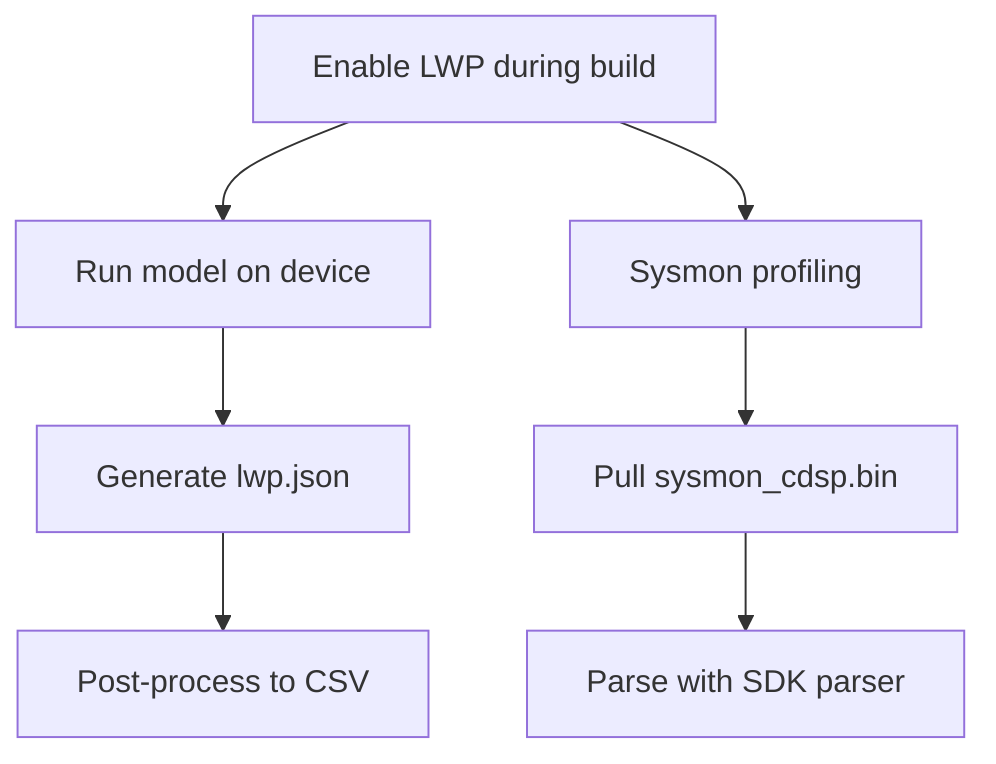
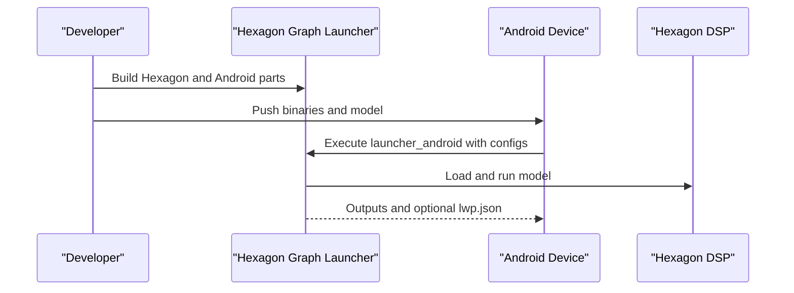
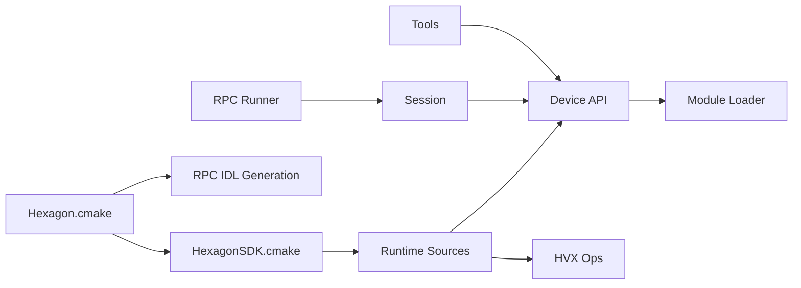

# Hexagon DSP Acceleration

<cite>
**Referenced Files in This Document**
- [apps/hexagon_api/README.md](file://apps/hexagon_api/README.md)
- [apps/hexagon_launcher/README.md](file://apps/hexagon_launcher/README.md)
- [cmake/modules/Hexagon.cmake](file://cmake/modules/Hexagon.cmake)
- [cmake/modules/HexagonSDK.cmake](file://cmake/modules/HexagonSDK.cmake)
- [python/tvm/contrib/hexagon/__init__.py](file://python/tvm/contrib/hexagon/__init__.py)
- [python/tvm/contrib/hexagon/build.py](file://python/tvm/contrib/hexagon/build.py)
- [python/tvm/contrib/hexagon/meta_schedule.py](file://python/tvm/contrib/hexagon/meta_schedule.py)
- [python/tvm/contrib/hexagon/session.py](file://python/tvm/contrib/hexagon/session.py)
- [python/tvm/contrib/hexagon/tools.py](file://python/tvm/contrib/hexagon/tools.py)
- [python/tvm/rpc/client.py](file://python/tvm/rpc/client.py)
- [src/runtime/hexagon/README.md](file://src/runtime/hexagon/README.md)
- [src/runtime/hexagon/hexagon_device_api.cc](file://src/runtime/hexagon/hexagon_device_api.cc)
- [src/runtime/hexagon/hexagon_module.cc](file://src/runtime/hexagon/hexagon_module.cc)
- [src/runtime/hexagon/ops/conv2d.h](file://src/runtime/hexagon/ops/conv2d.h)
- [src/runtime/hexagon/ops/conv2d_fp16_hvx.cc](file://src/runtime/hexagon/ops/conv2d_fp16_hvx.cc)
- [src/runtime/hexagon/ops/conv2d_quant_hvx.cc](file://src/runtime/hexagon/ops/conv2d_quant_hvx.cc)
- [src/runtime/hexagon/profiler/README.md](file://src/runtime/hexagon/profiler/README.md)
</cite>

## Table of Contents
1. [Introduction](#introduction)
2. [Project Structure](#project-structure)
3. [Core Components](#core-components)
4. [Architecture Overview](#architecture-overview)
5. [Detailed Component Analysis](#detailed-component-analysis)
6. [Dependency Analysis](#dependency-analysis)
7. [Performance Considerations](#performance-considerations)
8. [Troubleshooting Guide](#troubleshooting-guide)
9. [Conclusion](#conclusion)
10. [Appendices](#appendices)

## Introduction
This document explains how TVM integrates with Qualcomm Hexagon DSP for AI inference acceleration. It covers the Hexagon AI Neural Network SDK integration, remote session management, DSP-specific optimizations, operator fusion strategies, memory management, meta-schedule tuning, profiling, and practical deployment workflows. It also documents supported Hexagon versions, hardware compatibility, and debugging techniques.

## Project Structure
The Hexagon integration spans build configuration, runtime, Python helpers, and example applications:
- Build and SDK integration: CMake modules for Hexagon toolchain, SDK discovery, and RPC skeleton generation
- Runtime: Device API, VTCM pool, DMA, HVX ops, and module loader
- Python integration: Remote session creation, RPC runner, meta-schedule utilities, and profiling helpers
- Apps: Meta-application for building runtime artifacts and a graph launcher for execution and profiling

**Diagram sources**
- [cmake/modules/Hexagon.cmake:1-344](file://cmake/modules/Hexagon.cmake#L1-L344)
- [cmake/modules/HexagonSDK.cmake:1-206](file://cmake/modules/HexagonSDK.cmake#L1-L206)
- [src/runtime/hexagon/hexagon_device_api.cc:1-326](file://src/runtime/hexagon/hexagon_device_api.cc#L1-L326)
- [src/runtime/hexagon/hexagon_module.cc:1-101](file://src/runtime/hexagon/hexagon_module.cc#L1-L101)
- [src/runtime/hexagon/ops/conv2d_fp16_hvx.cc:1-497](file://src/runtime/hexagon/ops/conv2d_fp16_hvx.cc#L1-L497)
- [src/runtime/hexagon/ops/conv2d_quant_hvx.cc:1-329](file://src/runtime/hexagon/ops/conv2d_quant_hvx.cc#L1-L329)
- [src/runtime/hexagon/profiler/README.md:1-86](file://src/runtime/hexagon/profiler/README.md#L1-L86)
- [python/tvm/contrib/hexagon/session.py:42-122](file://python/tvm/contrib/hexagon/session.py#L42-L122)
- [python/tvm/contrib/hexagon/build.py:287-340](file://python/tvm/contrib/hexagon/build.py#L287-L340)
- [python/tvm/contrib/hexagon/meta_schedule.py:48-195](file://python/tvm/contrib/hexagon/meta_schedule.py#L48-L195)
- [python/tvm/contrib/hexagon/tools.py:404-442](file://python/tvm/contrib/hexagon/tools.py#L404-L442)
- [python/tvm/rpc/client.py:220-262](file://python/tvm/rpc/client.py#L220-L262)
- [apps/hexagon_api/README.md:1-59](file://apps/hexagon_api/README.md#L1-L59)
- [apps/hexagon_launcher/README.md:1-146](file://apps/hexagon_launcher/README.md#L1-L146)

**Section sources**
- [cmake/modules/Hexagon.cmake:1-344](file://cmake/modules/Hexagon.cmake#L1-L344)
- [cmake/modules/HexagonSDK.cmake:1-206](file://cmake/modules/HexagonSDK.cmake#L1-L206)
- [src/runtime/hexagon/README.md:18-75](file://src/runtime/hexagon/README.md#L18-L75)
- [apps/hexagon_api/README.md:18-59](file://apps/hexagon_api/README.md#L18-L59)
- [apps/hexagon_launcher/README.md:17-146](file://apps/hexagon_launcher/README.md#L17-L146)

## Core Components
- Hexagon runtime device API and memory management
  - Device allocation, workspace pools, and DMA operations
  - VTCM-aware allocation and scoped memory
- DSP-specific operators
  - HVX-accelerated convolutions for FP16 and quantized INT8
  - Layout transformations and blockization for optimal data movement
- Remote session and RPC
  - Session creation, resource acquisition/release, and device construction
  - RPC tracker-based connection and session lifecycle
- Meta-schedule integration
  - Local and RPC runners for Hexagon, builder wrapper, and evaluator configuration
- Profiling and instrumentation
  - Lightweight profiling (LWP) instrumentation and post-processing
  - Sysmon collection and parsing for CDSP metrics
- Build and SDK integration
  - Toolchain detection, SDK property discovery, and RPC IDL generation

**Section sources**
- [src/runtime/hexagon/hexagon_device_api.cc:46-166](file://src/runtime/hexagon/hexagon_device_api.cc#L46-L166)
- [src/runtime/hexagon/ops/conv2d_fp16_hvx.cc:406-497](file://src/runtime/hexagon/ops/conv2d_fp16_hvx.cc#L406-L497)
- [src/runtime/hexagon/ops/conv2d_quant_hvx.cc:233-329](file://src/runtime/hexagon/ops/conv2d_quant_hvx.cc#L233-L329)
- [python/tvm/contrib/hexagon/session.py:62-122](file://python/tvm/contrib/hexagon/session.py#L62-L122)
- [python/tvm/contrib/hexagon/meta_schedule.py:48-195](file://python/tvm/contrib/hexagon/meta_schedule.py#L48-L195)
- [src/runtime/hexagon/profiler/README.md:18-86](file://src/runtime/hexagon/profiler/README.md#L18-L86)
- [cmake/modules/Hexagon.cmake:23-44](file://cmake/modules/Hexagon.cmake#L23-L44)

## Architecture Overview
The Hexagon acceleration pipeline connects Python/TVM frontend to the DSP runtime via RPC and the Hexagon AI NN SDK.

**Diagram sources**
- [python/tvm/contrib/hexagon/session.py:83-122](file://python/tvm/contrib/hexagon/session.py#L83-L122)
- [src/runtime/hexagon/hexagon_device_api.cc:302-320](file://src/runtime/hexagon/hexagon_device_api.cc#L302-L320)
- [apps/hexagon_launcher/README.md:81-146](file://apps/hexagon_launcher/README.md#L81-L146)

## Detailed Component Analysis

### Remote Session Management
- Session creation and lifecycle
  - Establishes RPC connection via tracker, constructs a named session, and acquires DSP resources
  - Releases resources and closes RPC connection on exit
- Device construction
  - Provides a convenience method to construct a Hexagon device for subsequent allocations and kernel launches

**Diagram sources**
- [python/tvm/contrib/hexagon/session.py:62-122](file://python/tvm/contrib/hexagon/session.py#L62-L122)
- [python/tvm/rpc/client.py:248-250](file://python/tvm/rpc/client.py#L248-L250)

**Section sources**
- [python/tvm/contrib/hexagon/session.py:62-122](file://python/tvm/contrib/hexagon/session.py#L62-L122)
- [python/tvm/rpc/client.py:220-262](file://python/tvm/rpc/client.py#L220-L262)

### Memory Management and DSP Buffers
- Allocation and scoping
  - Supports "global" and "global.vtcm" scopes; VTCM allocations use 2D indirect tensors for optimal access
  - Enforces alignment and validates session initialization before allocations/free
- DMA operations
  - Exposes packed functions for DMA copy, wait, and grouping to overlap transfers and compute
- Workspace pools
  - Thread-local workspace pools for temporary allocations during execution

**Diagram sources**
- [src/runtime/hexagon/hexagon_device_api.cc:53-128](file://src/runtime/hexagon/hexagon_device_api.cc#L53-L128)

**Section sources**
- [src/runtime/hexagon/hexagon_device_api.cc:53-166](file://src/runtime/hexagon/hexagon_device_api.cc#L53-L166)

### DSP-Specific Operators and Fusion Strategies
- Convolution layouts and blockization
  - NHWC activations and HWIO weights prepared in blockized/chunked formats for HVX
  - Zero-padding and stride assumptions optimized for DSP execution
- HVX kernels
  - FP16 convolution with vectorized multiply-accumulate and lane-reduction
  - Quantized INT8 convolution with zero-point adjustments and requantization
- Operator fusion
  - Fuse patterns are typically handled by TVM passes; DSP-friendly layouts (blockized/chunked) are prepared prior to kernel invocation

**Diagram sources**
- [src/runtime/hexagon/ops/conv2d.h:287-324](file://src/runtime/hexagon/ops/conv2d.h#L287-L324)
- [src/runtime/hexagon/ops/conv2d_fp16_hvx.cc:406-497](file://src/runtime/hexagon/ops/conv2d_fp16_hvx.cc#L406-L497)
- [src/runtime/hexagon/ops/conv2d_quant_hvx.cc:233-329](file://src/runtime/hexagon/ops/conv2d_quant_hvx.cc#L233-L329)

**Section sources**
- [src/runtime/hexagon/ops/conv2d.h:165-324](file://src/runtime/hexagon/ops/conv2d.h#L165-L324)
- [src/runtime/hexagon/ops/conv2d_fp16_hvx.cc:180-401](file://src/runtime/hexagon/ops/conv2d_fp16_hvx.cc#L180-L401)
- [src/runtime/hexagon/ops/conv2d_quant_hvx.cc:87-227](file://src/runtime/hexagon/ops/conv2d_quant_hvx.cc#L87-L227)

### Meta-Schedule Integration for Hexagon
- Builders and runners
  - Local builder wraps TVM build with pass context and exports artifacts
  - RPC runner uploads modules to device, allocates arguments, and evaluates performance
- Tuning configuration
  - Evaluator settings for number/repeat/min_repeat_ms; optional CPU cache flush disabled by default

**Diagram sources**
- [python/tvm/contrib/hexagon/meta_schedule.py:132-195](file://python/tvm/contrib/hexagon/meta_schedule.py#L132-L195)
- [python/tvm/contrib/hexagon/build.py:294-340](file://python/tvm/contrib/hexagon/build.py#L294-L340)

**Section sources**
- [python/tvm/contrib/hexagon/meta_schedule.py:48-195](file://python/tvm/contrib/hexagon/meta_schedule.py#L48-L195)
- [python/tvm/contrib/hexagon/build.py:287-340](file://python/tvm/contrib/hexagon/build.py#L287-L340)

### Profiling Tools and Performance Analysis
- Lightweight profiling (LWP)
  - Instrumentation pass inserts target-specific handlers to record cycles; post-process generates CSV
- Sysmon collection
  - Launches sysMonApp on device, pulls CDSP traces, parses with SDK parser
- Debug logs
  - Captures and prints CDSP crash contexts from logcat

**Diagram sources**
- [src/runtime/hexagon/profiler/README.md:18-86](file://src/runtime/hexagon/profiler/README.md#L18-L86)
- [python/tvm/contrib/hexagon/build.py:516-610](file://python/tvm/contrib/hexagon/build.py#L516-L610)

**Section sources**
- [src/runtime/hexagon/profiler/README.md:18-86](file://src/runtime/hexagon/profiler/README.md#L18-L86)
- [python/tvm/contrib/hexagon/build.py:516-610](file://python/tvm/contrib/hexagon/build.py#L516-L610)

### Practical Deployment Examples
- Building runtime artifacts
  - Meta-app compiles TVM runtime for Android and RPC server, and builds RPC skeleton for Hexagon
- Graph launcher
  - Builds Hexagon and Android parts separately, deploys binaries, and executes with optional LWP JSON generation
- Session configuration
  - Configure tracker, server key, workspace, and buffer sizes; create session and run modules

**Diagram sources**
- [apps/hexagon_api/README.md:18-59](file://apps/hexagon_api/README.md#L18-L59)
- [apps/hexagon_launcher/README.md:17-146](file://apps/hexagon_launcher/README.md#L17-L146)

**Section sources**
- [apps/hexagon_api/README.md:18-59](file://apps/hexagon_api/README.md#L18-L59)
- [apps/hexagon_launcher/README.md:17-146](file://apps/hexagon_launcher/README.md#L17-L146)

## Dependency Analysis
- Build-time dependencies
  - Hexagon toolchain and SDK discovery; RPC IDL generation; QHL math libraries for HVX
- Runtime dependencies
  - Device API, VTCM pool, DMA, HVX ops, and module loader
- Python integration
  - Session and RPC runner depend on tracker and device API; tools expose allocation helpers

**Diagram sources**
- [cmake/modules/Hexagon.cmake:23-44](file://cmake/modules/Hexagon.cmake#L23-L44)
- [cmake/modules/HexagonSDK.cmake:89-205](file://cmake/modules/HexagonSDK.cmake#L89-L205)
- [src/runtime/hexagon/hexagon_device_api.cc:1-326](file://src/runtime/hexagon/hexagon_device_api.cc#L1-L326)
- [src/runtime/hexagon/hexagon_module.cc:1-101](file://src/runtime/hexagon/hexagon_module.cc#L1-L101)
- [python/tvm/contrib/hexagon/session.py:62-122](file://python/tvm/contrib/hexagon/session.py#L62-L122)
- [python/tvm/contrib/hexagon/meta_schedule.py:48-195](file://python/tvm/contrib/hexagon/meta_schedule.py#L48-L195)
- [python/tvm/contrib/hexagon/tools.py:404-442](file://python/tvm/contrib/hexagon/tools.py#L404-L442)

**Section sources**
- [cmake/modules/Hexagon.cmake:123-210](file://cmake/modules/Hexagon.cmake#L123-L210)
- [cmake/modules/HexagonSDK.cmake:106-191](file://cmake/modules/HexagonSDK.cmake#L106-L191)
- [src/runtime/hexagon/hexagon_device_api.cc:1-326](file://src/runtime/hexagon/hexagon_device_api.cc#L1-L326)
- [src/runtime/hexagon/hexagon_module.cc:1-101](file://src/runtime/hexagon/hexagon_module.cc#L1-L101)
- [python/tvm/contrib/hexagon/session.py:62-122](file://python/tvm/contrib/hexagon/session.py#L62-L122)
- [python/tvm/contrib/hexagon/meta_schedule.py:48-195](file://python/tvm/contrib/hexagon/meta_schedule.py#L48-L195)
- [python/tvm/contrib/hexagon/tools.py:404-442](file://python/tvm/contrib/hexagon/tools.py#L404-L442)

## Performance Considerations
- Memory layout and bandwidth
  - Use VTCM-scoped allocations and blockized/chunked layouts to maximize HVX throughput
- DMA overlap
  - Group DMA operations and interleave with compute to hide transfer latency
- Operator fusion
  - Fuse conv+activation patterns and ensure intermediate layouts remain in VTCM
- Profiling-first optimization
  - Enable LWP to identify hotspots; use sysmon for CDSP utilization; iterate with meta-schedule

[No sources needed since this section provides general guidance]

## Troubleshooting Guide
- Session acquisition failures
  - Ensure tracker is reachable and server key matches; verify acquire_resources is called before allocations
- Memory errors
  - Validate alignment and scope; avoid freeing outside a session; confirm VTCM availability
- Crashes and logs
  - Capture and parse sysmon traces; inspect CDSP crash messages from logcat
- Toolchain and SDK issues
  - Verify toolchain detection and SDK property discovery; ensure correct architecture flags

**Section sources**
- [src/runtime/hexagon/hexagon_device_api.cc:302-320](file://src/runtime/hexagon/hexagon_device_api.cc#L302-L320)
- [python/tvm/contrib/hexagon/build.py:516-610](file://python/tvm/contrib/hexagon/build.py#L516-L610)
- [cmake/modules/Hexagon.cmake:23-44](file://cmake/modules/Hexagon.cmake#L23-L44)
- [cmake/modules/HexagonSDK.cmake:106-191](file://cmake/modules/HexagonSDK.cmake#L106-L191)

## Conclusion
TVM’s Hexagon integration provides a complete pipeline from model compilation to DSP execution, with robust remote session management, DSP-aware memory and DMA, HVX-optimized operators, and powerful profiling and meta-schedule tools. Following the build and deployment workflows outlined here enables reliable and high-performance AI inference on Qualcomm Hexagon DSP.

[No sources needed since this section summarizes without analyzing specific files]

## Appendices

### Supported Hexagon Versions and Hardware Compatibility
- Supported architectures: v68, v69, v73, v75
- Minimum SDK version: 4.0.0
- Android and simulator builds supported

**Section sources**
- [cmake/modules/Hexagon.cmake:137-142](file://cmake/modules/Hexagon.cmake#L137-L142)
- [src/runtime/hexagon/README.md:23-27](file://src/runtime/hexagon/README.md#L23-L27)
- [apps/hexagon_launcher/README.md:24-32](file://apps/hexagon_launcher/README.md#L24-L32)

### Practical Deployment Scenarios
- Host cross-compilation with Hexagon SDK and LLVM
- Android runtime and RPC server for device-side execution
- Simulator mode for early development and profiling

**Section sources**
- [src/runtime/hexagon/README.md:28-75](file://src/runtime/hexagon/README.md#L28-L75)
- [apps/hexagon_api/README.md:27-59](file://apps/hexagon_api/README.md#L27-L59)
- [apps/hexagon_launcher/README.md:34-90](file://apps/hexagon_launcher/README.md#L34-L90)