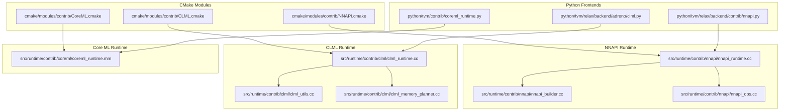
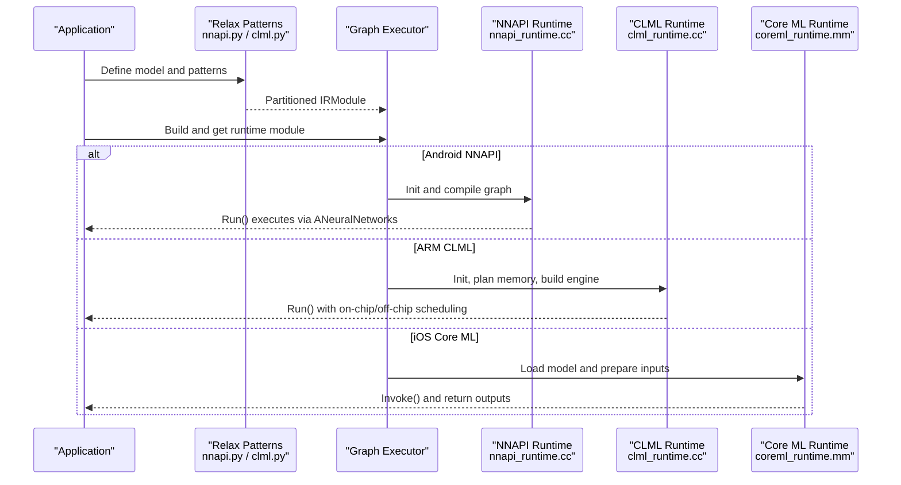
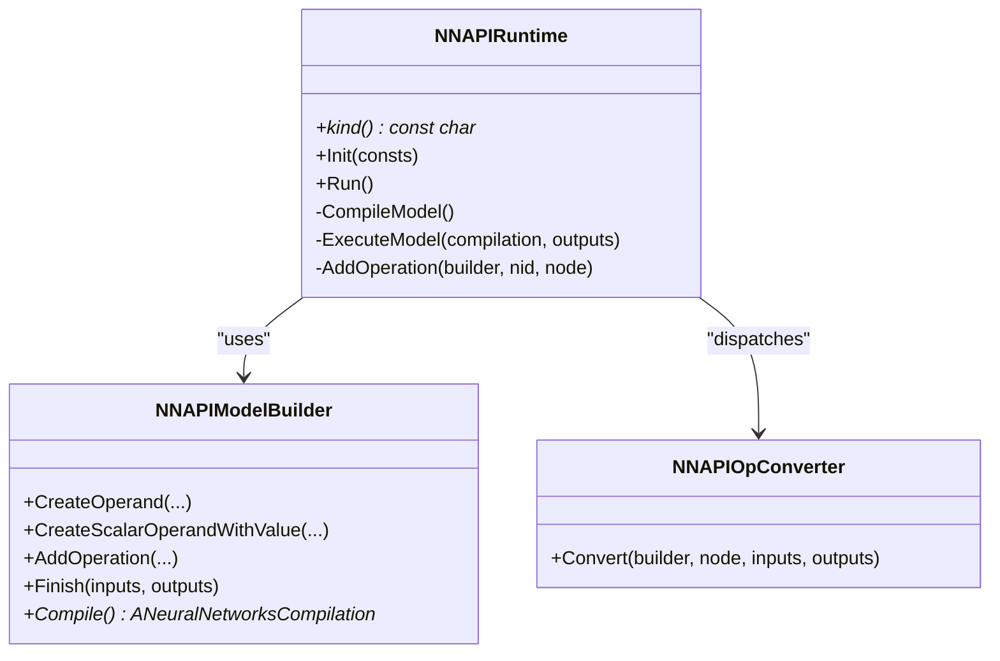
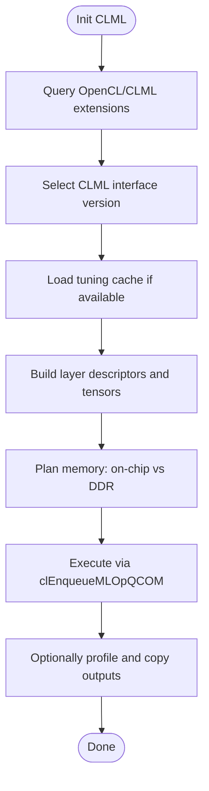
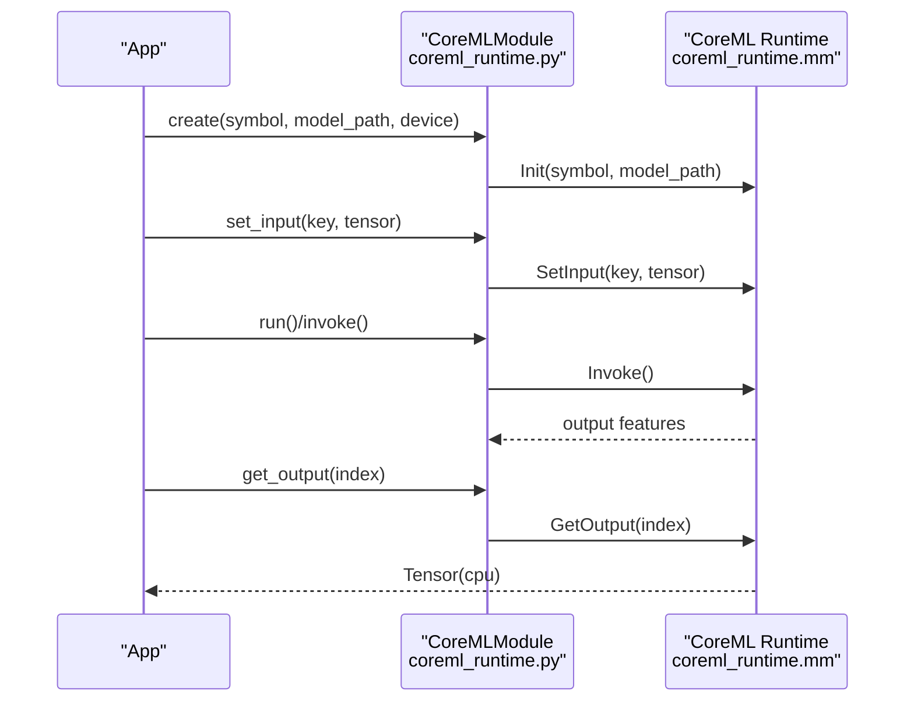
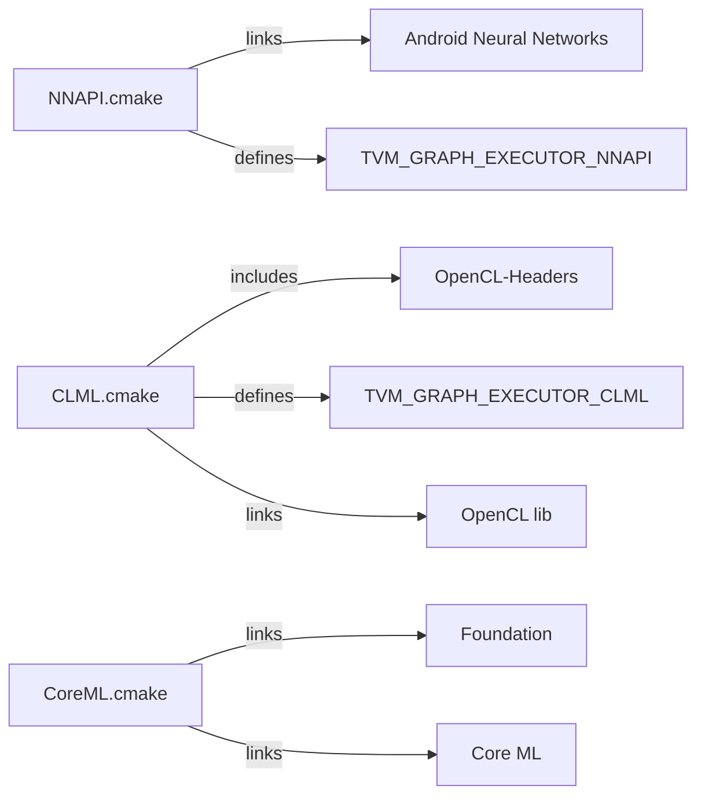

# Mobile Acceleration Libraries

<cite>
**Referenced Files in This Document**
- [NNAPI.cmake](file://cmake/modules/contrib/NNAPI.cmake)
- [CLML.cmake](file://cmake/modules/contrib/CLML.cmake)
- [CoreML.cmake](file://cmake/modules/contrib/CoreML.cmake)
- [nnapi_runtime.cc](file://src/runtime/contrib/nnapi/nnapi_runtime.cc)
- [nnapi_builder.cc](file://src/runtime/contrib/nnapi/nnapi_builder.cc)
- [nnapi_ops.cc](file://src/runtime/contrib/nnapi/nnapi_ops.cc)
- [clml_runtime.cc](file://src/runtime/contrib/clml/clml_runtime.cc)
- [clml_utils.cc](file://src/runtime/contrib/clml/clml_utils.cc)
- [clml_memory_planner.cc](file://src/runtime/contrib/clml/clml_memory_planner.cc)
- [coreml_runtime.mm](file://src/runtime/contrib/coreml/coreml_runtime.mm)
- [coreml_runtime.py](file://python/tvm/contrib/coreml_runtime.py)
- [nnapi.py](file://python/tvm/relax/backend/contrib/nnapi.py)
- [clml.py](file://python/tvm/relax/backend/adreno/clml.py)
</cite>

## Table of Contents
1. [Introduction](#introduction)
2. [Project Structure](#project-structure)
3. [Core Components](#core-components)
4. [Architecture Overview](#architecture-overview)
5. [Detailed Component Analysis](#detailed-component-analysis)
6. [Dependency Analysis](#dependency-analysis)
7. [Performance Considerations](#performance-considerations)
8. [Troubleshooting Guide](#troubleshooting-guide)
9. [Conclusion](#conclusion)
10. [Appendices](#appendices)

## Introduction
This document explains TVM’s integration with three mobile-specific acceleration libraries:
- NNAPI on Android for neural network acceleration
- CLML (Compute Library for Media and Machine Learning) on ARM-based devices
- Core ML runtime on iOS for deployment

It covers integration patterns, optimization strategies, memory management, power efficiency, and cross-platform deployment. Practical guidance is included for configuring mobile acceleration libraries, optimizing models for different platforms, benchmarking performance, and troubleshooting.

## Project Structure
TVM organizes mobile acceleration under:
- CMake modules enabling/disabling and linking external libraries
- Runtime implementations for each backend
- Python frontends for Relax patterns and runtime creation
- Tests and examples validating functionality

**Diagram sources**
- [NNAPI.cmake:18-39](file://cmake/modules/contrib/NNAPI.cmake#L18-L39)
- [CLML.cmake:18-86](file://cmake/modules/contrib/CLML.cmake#L18-L86)
- [CoreML.cmake:18-25](file://cmake/modules/contrib/CoreML.cmake#L18-L25)
- [nnapi_runtime.cc:51-242](file://src/runtime/contrib/nnapi/nnapi_runtime.cc#L51-L242)
- [nnapi_builder.cc:133-268](file://src/runtime/contrib/nnapi/nnapi_builder.cc#L133-L268)
- [nnapi_ops.cc:552-589](file://src/runtime/contrib/nnapi/nnapi_ops.cc#L552-L589)
- [clml_runtime.cc:146-702](file://src/runtime/contrib/clml/clml_runtime.cc#L146-L702)
- [clml_utils.cc:41-260](file://src/runtime/contrib/clml/clml_utils.cc#L41-L260)
- [clml_memory_planner.cc:43-263](file://src/runtime/contrib/clml/clml_memory_planner.cc#L43-L263)
- [coreml_runtime.mm:32-261](file://src/runtime/contrib/coreml/coreml_runtime.mm#L32-L261)
- [nnapi.py:301-322](file://python/tvm/relax/backend/contrib/nnapi.py#L301-L322)
- [clml.py:591-714](file://python/tvm/relax/backend/adreno/clml.py#L591-L714)
- [coreml_runtime.py:24-77](file://python/tvm/contrib/coreml_runtime.py#L24-L77)

**Section sources**
- [NNAPI.cmake:18-39](file://cmake/modules/contrib/NNAPI.cmake#L18-L39)
- [CLML.cmake:18-86](file://cmake/modules/contrib/CLML.cmake#L18-L86)
- [CoreML.cmake:18-25](file://cmake/modules/contrib/CoreML.cmake#L18-L25)

## Core Components
- NNAPI runtime compiles a graph into an ANeuralNetworks model and executes via NNAPI APIs. It maps Relax ops to NNAPI operations and manages inputs/outputs.
- CLML runtime integrates with OpenCL and Qualcomm’s CLML interface to accelerate CNNs and LLMs on Adreno GPUs, with on-chip/global memory planning and tuning caches.
- Core ML runtime loads Core ML models and exposes TVM-style functions to set inputs, run, and fetch outputs.

Key capabilities:
- NNAPI: Graph executor with NNAPI compilation and execution
- CLML: Memory-aware execution with on-chip/off-chip planning and profiling hooks
- Core ML: Native iOS model execution with shape/type metadata extraction

**Section sources**
- [nnapi_runtime.cc:51-242](file://src/runtime/contrib/nnapi/nnapi_runtime.cc#L51-L242)
- [clml_runtime.cc:146-702](file://src/runtime/contrib/clml/clml_runtime.cc#L146-L702)
- [coreml_runtime.mm:32-261](file://src/runtime/contrib/coreml/coreml_runtime.mm#L32-L261)

## Architecture Overview
The mobile acceleration architecture follows a layered approach:
- Compiler-time: Relax patterns and passes offload supported ops to backends
- Runtime-time: Backend-specific executors handle compilation, memory, and execution
- Python frontends: Provide user-friendly APIs and module creation

**Diagram sources**
- [nnapi.py:301-322](file://python/tvm/relax/backend/contrib/nnapi.py#L301-L322)
- [clml.py:591-714](file://python/tvm/relax/backend/adreno/clml.py#L591-L714)
- [nnapi_runtime.cc:73-184](file://src/runtime/contrib/nnapi/nnapi_runtime.cc#L73-L184)
- [clml_runtime.cc:209-690](file://src/runtime/contrib/clml/clml_runtime.cc#L209-L690)
- [coreml_runtime.mm:118-188](file://src/runtime/contrib/coreml/coreml_runtime.mm#L118-L188)

## Detailed Component Analysis

### NNAPI Integration (Android)
- Build integration: CMake toggles NNAPI codegen/runtime and links Android Neural Networks and log libraries.
- Runtime: Builds an ANeuralNetworks model from the graph JSON, sets inputs/outputs, compiles, and executes via ANeuralNetworks APIs.
- Op mapping: A registry maps Relax ops to NNAPI operations with attribute handling (e.g., padding, strides, fused activation).

**Diagram sources**
- [nnapi_runtime.cc:51-242](file://src/runtime/contrib/nnapi/nnapi_runtime.cc#L51-L242)
- [nnapi_builder.cc:133-268](file://src/runtime/contrib/nnapi/nnapi_builder.cc#L133-L268)
- [nnapi_ops.cc:43-589](file://src/runtime/contrib/nnapi/nnapi_ops.cc#L43-L589)

Practical configuration:
- Enable NNAPI codegen/runtime via CMake flags and build with Android NDK.
- Use Relax NNAPI patterns to partition supported subgraphs.

Optimization strategies:
- Prefer FP16 where supported for reduced memory bandwidth.
- Fuse operations to minimize intermediate allocations.
- Use appropriate NNAPI feature levels to leverage advanced ops.

**Section sources**
- [NNAPI.cmake:19-39](file://cmake/modules/contrib/NNAPI.cmake#L19-L39)
- [nnapi_runtime.cc:73-184](file://src/runtime/contrib/nnapi/nnapi_runtime.cc#L73-L184)
- [nnapi_ops.cc:552-589](file://src/runtime/contrib/nnapi/nnapi_ops.cc#L552-L589)
- [nnapi.py:301-322](file://python/tvm/relax/backend/contrib/nnapi.py#L301-L322)

### CLML Integration (ARM-based devices)
- Build integration: CMake detects CLML SDK version, optionally locates external CLML path, enables OpenCL fallback, and defines graph executor macros.
- Runtime: Initializes CLML context, queries device extensions, selects CLML interface version, and builds a layer with tuned parameters.
- Memory management: Plans allocations across on-chip global memory and DDR, with ping-pong allocation and fragmentation handling.
- Profiling: Integrates with OpenCL timers and event queues to profile CLML subgraphs.

**Diagram sources**
- [CLML.cmake:18-86](file://cmake/modules/contrib/CLML.cmake#L18-L86)
- [clml_runtime.cc:222-690](file://src/runtime/contrib/clml/clml_runtime.cc#L222-L690)
- [clml_memory_planner.cc:143-247](file://src/runtime/contrib/clml/clml_memory_planner.cc#L143-L247)

Practical configuration:
- Provide CLML SDK path or version via CMake variables.
- Use OpenCL fallback when CLML is unavailable.
- Tune via cache files and environment flags.

Optimization strategies:
- Prefer on-chip global memory for intermediates to reduce DRAM traffic.
- Use ping-pong allocation to maximize free central segments.
- Enable recordable queues for efficient replay and profiling.

**Section sources**
- [CLML.cmake:18-86](file://cmake/modules/contrib/CLML.cmake#L18-L86)
- [clml_runtime.cc:222-690](file://src/runtime/contrib/clml/clml_runtime.cc#L222-L690)
- [clml_utils.cc:41-260](file://src/runtime/contrib/clml/clml_utils.cc#L41-L260)
- [clml_memory_planner.cc:43-263](file://src/runtime/contrib/clml/clml_memory_planner.cc#L43-L263)
- [clml.py:591-714](file://python/tvm/relax/backend/adreno/clml.py#L591-L714)

### Core ML Runtime (iOS)
- Build integration: CMake locates Foundation and Core ML frameworks and compiles Objective-C++ sources.
- Runtime: Loads a Core ML model bundle, maps inputs/outputs by name, copies data into MLMultiArray, runs prediction, and returns shaped tensors.

**Diagram sources**
- [CoreML.cmake:18-25](file://cmake/modules/contrib/CoreML.cmake#L18-L25)
- [coreml_runtime.mm:118-188](file://src/runtime/contrib/coreml/coreml_runtime.mm#L118-L188)
- [coreml_runtime.py:24-77](file://python/tvm/contrib/coreml_runtime.py#L24-L77)

Practical configuration:
- Ensure the model bundle is accessible in the app bundle or via a provided path.
- Use the runtime function to create modules and manage inputs/outputs.

Optimization strategies:
- Align input shapes/types with Core ML model constraints.
- Minimize repeated conversions by passing contiguous buffers.

**Section sources**
- [CoreML.cmake:18-25](file://cmake/modules/contrib/CoreML.cmake#L18-L25)
- [coreml_runtime.mm:32-261](file://src/runtime/contrib/coreml/coreml_runtime.mm#L32-L261)
- [coreml_runtime.py:24-77](file://python/tvm/contrib/coreml_runtime.py#L24-L77)

## Dependency Analysis
- NNAPI depends on Android NDK headers and the Neural Networks library; CMake links required libs and defines graph executor macros.
- CLML depends on OpenCL and Qualcomm’s CLML headers; CMake locates SDK, sets version macros, and enables OpenCL fallback.
- Core ML depends on Apple frameworks; CMake finds Foundation and Core ML and compiles Objective-C++ sources.

**Diagram sources**
- [NNAPI.cmake:19-39](file://cmake/modules/contrib/NNAPI.cmake#L19-L39)
- [CLML.cmake:18-86](file://cmake/modules/contrib/CLML.cmake#L18-L86)
- [CoreML.cmake:18-25](file://cmake/modules/contrib/CoreML.cmake#L18-L25)

**Section sources**
- [NNAPI.cmake:19-39](file://cmake/modules/contrib/NNAPI.cmake#L19-L39)
- [CLML.cmake:18-86](file://cmake/modules/contrib/CLML.cmake#L18-L86)
- [CoreML.cmake:18-25](file://cmake/modules/contrib/CoreML.cmake#L18-L25)

## Performance Considerations
- Memory bandwidth and latency:
  - NNAPI: Prefer FP16 where supported; fuse ops to reduce intermediate tensors.
  - CLML: Use on-chip global memory for intermediates; plan allocations to avoid fragmentation.
  - Core ML: Match input shapes/types to model constraints to avoid implicit conversions.
- Power efficiency:
  - Use recordable queues in CLML to batch and replay work efficiently.
  - Profile with OpenCL timers to identify hotspots and adjust fusion.
- Throughput:
  - Batch inference where possible; align layouts to backend expectations (e.g., NCHW).
  - Leverage backend-specific tuning caches to accelerate first-run performance.

[No sources needed since this section provides general guidance]

## Troubleshooting Guide
Common issues and remedies:
- NNAPI runtime not enabled:
  - Ensure build with NNAPI runtime and graph executor flags; the runtime throws an error if disabled.
- CLML initialization failures:
  - Verify “cl_qcom_ml_ops” extension presence; check CLML SDK version compatibility; confirm tuning cache availability if used.
- Core ML input/output mismatches:
  - Confirm input keys and shapes match model metadata; ensure data types align with MLMultiArray constraints.
- Profiling and debugging:
  - CLML supports profiling via OpenCL events and timers; debug dumps require disabling recordable queues.

**Section sources**
- [nnapi_runtime.cc:232-241](file://src/runtime/contrib/nnapi/nnapi_runtime.cc#L232-L241)
- [clml_runtime.cc:75-138](file://src/runtime/contrib/clml/clml_runtime.cc#L75-L138)
- [coreml_runtime.mm:32-111](file://src/runtime/contrib/coreml/coreml_runtime.mm#L32-L111)

## Conclusion
TVM’s mobile acceleration stack integrates seamlessly with platform-specific backends:
- NNAPI delivers graph execution on Android with strong operator coverage.
- CLML leverages ARM GPUs with sophisticated memory planning and tuning.
- Core ML integrates with iOS deployment workflows.

Adopt the provided configuration patterns, optimization strategies, and troubleshooting tips to achieve robust, high-performance mobile deployments.

[No sources needed since this section summarizes without analyzing specific files]

## Appendices

### Supported Platforms and Hardware Compatibility
- Android NNAPI: Requires Android Neural Networks API; use feature-level gating to select supported ops.
- ARM CLML: Requires Qualcomm Adreno GPU with CLML-enabled OpenCL; supports on-chip global memory and tuning caches.
- iOS Core ML: Requires iOS Core ML framework; model bundles must be accessible at runtime.

[No sources needed since this section provides general guidance]

### Practical Configuration Examples
- NNAPI:
  - Enable via CMake flags and use Relax NNAPI patterns to offload supported subgraphs.
- CLML:
  - Provide CLML SDK path/version; enable graph executor; configure tuning cache environment variables.
- Core ML:
  - Create runtime module with the Core ML runtime function and manage inputs/outputs via module methods.

**Section sources**
- [NNAPI.cmake:19-39](file://cmake/modules/contrib/NNAPI.cmake#L19-L39)
- [CLML.cmake:18-86](file://cmake/modules/contrib/CLML.cmake#L18-L86)
- [CoreML.cmake:18-25](file://cmake/modules/contrib/CoreML.cmake#L18-L25)
- [nnapi.py:301-322](file://python/tvm/relax/backend/contrib/nnapi.py#L301-L322)
- [clml.py:591-714](file://python/tvm/relax/backend/adreno/clml.py#L591-L714)
- [coreml_runtime.py:24-77](file://python/tvm/contrib/coreml_runtime.py#L24-L77)