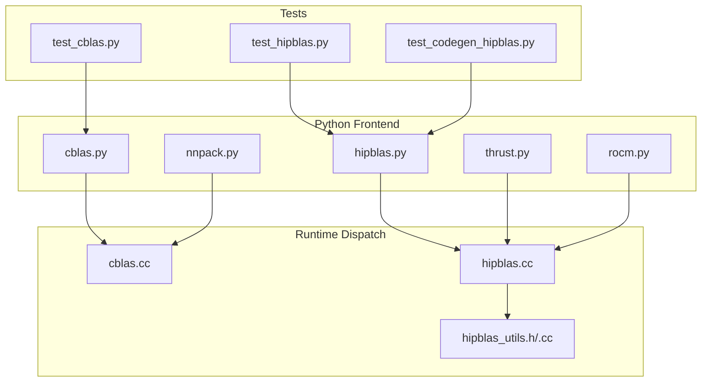
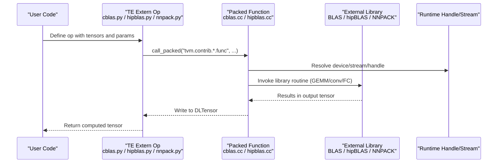
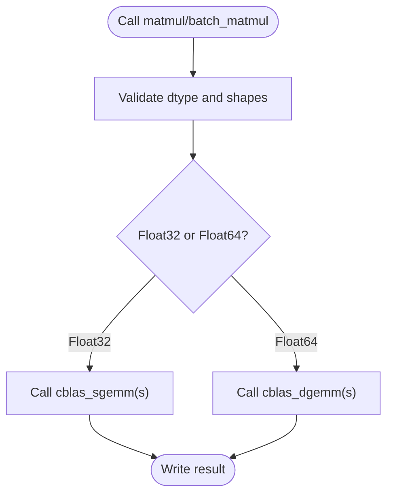
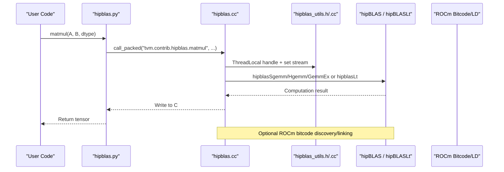
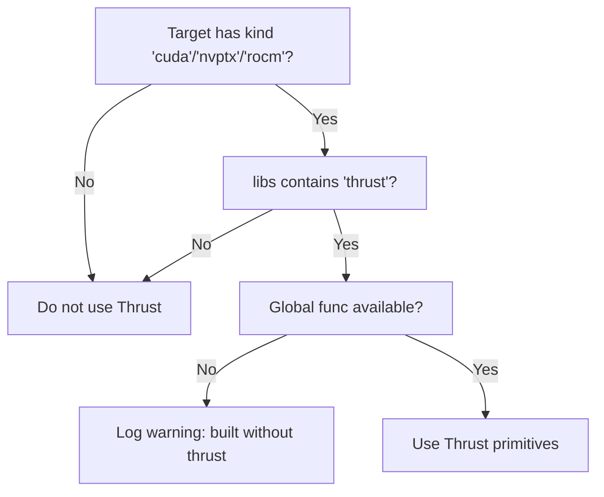
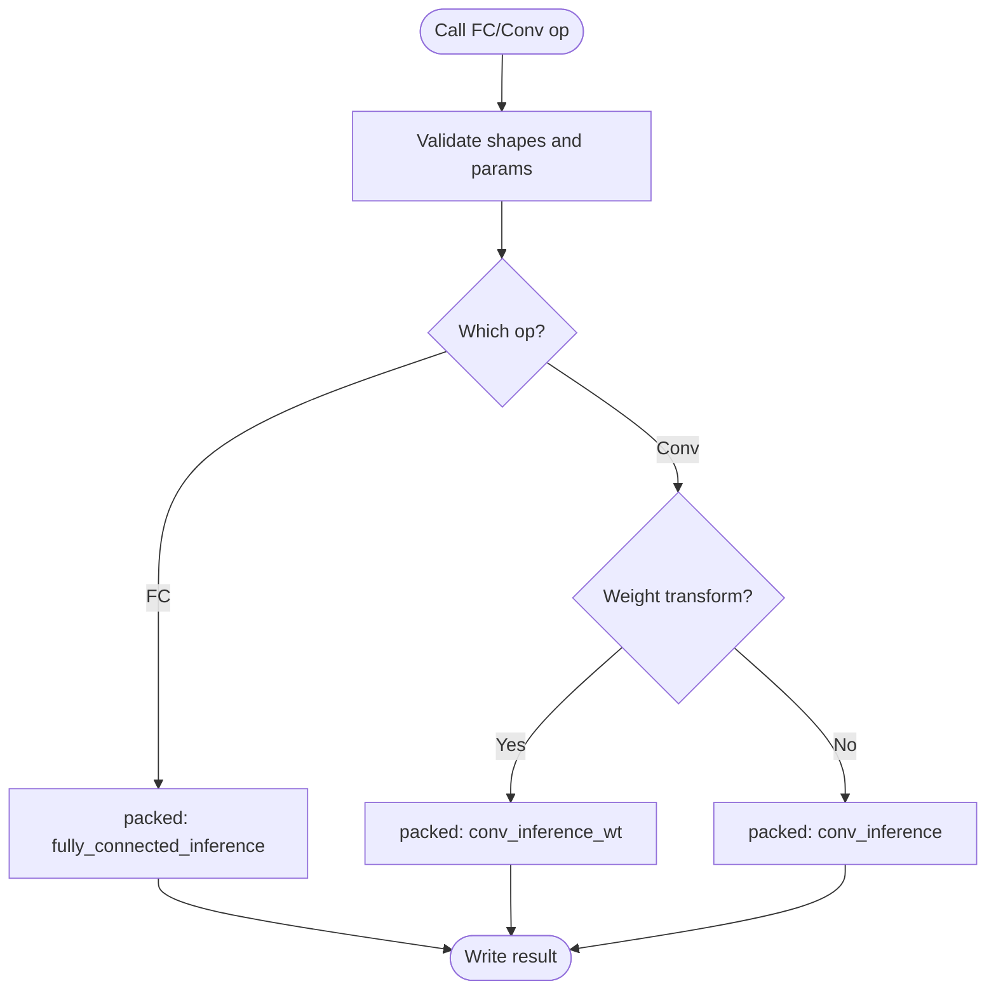
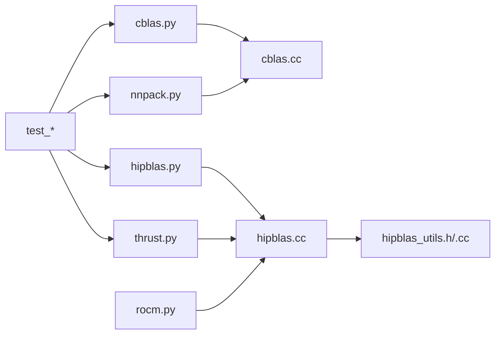

# Other Specialized Libraries

<cite>
**Referenced Files in This Document**
- [cblas.py](file://python/tvm/contrib/cblas.py)
- [hipblas.py](file://python/tvm/contrib/hipblas.py)
- [thrust.py](file://python/tvm/contrib/thrust.py)
- [nnpack.py](file://python/tvm/contrib/nnpack.py)
- [cblas.cc](file://src/runtime/contrib/cblas/cblas.cc)
- [hipblas.cc](file://src/runtime/contrib/hipblas/hipblas.cc)
- [hipblas_utils.h](file://src/runtime/contrib/hipblas/hipblas_utils.h)
- [hipblas_utils.cc](file://src/runtime/contrib/hipblas/hipblas_utils.cc)
- [rocm.py](file://python/tvm/contrib/rocm.py)
- [test_cblas.py](file://tests/python/contrib/test_cblas.py)
- [test_hipblas.py](file://tests/python/contrib/test_hipblas.py)
- [test_codegen_hipblas.py](file://tests/python/relax/test_codegen_hipblas.py)
</cite>

## Table of Contents
1. [Introduction](#introduction)
2. [Project Structure](#project-structure)
3. [Core Components](#core-components)
4. [Architecture Overview](#architecture-overview)
5. [Detailed Component Analysis](#detailed-component-analysis)
6. [Dependency Analysis](#dependency-analysis)
7. [Performance Considerations](#performance-considerations)
8. [Troubleshooting Guide](#troubleshooting-guide)
9. [Conclusion](#conclusion)
10. [Appendices](#appendices)

## Introduction
This document explains TVM’s integration with specialized acceleration libraries beyond the major ones: cBLAS for CPU BLAS operations, HIPBLAS for AMD GPU acceleration via ROCm, ROCm platform support, Thrust for GPU algorithm primitives, and NNPACK for optimized neural network operations. It covers integration patterns, performance characteristics, deployment considerations, supported platforms, hardware compatibility, optimization strategies, practical configuration examples, benchmarking guidance, and troubleshooting tips. It also describes how these integrations fit into TVM’s broader acceleration strategy.

## Project Structure
TVM organizes specialized library integrations primarily under:
- Python frontend wrappers: python/tvm/contrib/*.py
- Runtime dispatch and FFI bindings: src/runtime/contrib/<lib>/*.cc, *.h
- ROCm-specific utilities: python/tvm/contrib/rocm.py and related runtime helpers
- Tests and examples: tests/python/contrib/* and tests/python/relax/* for HIPBLAS

**Diagram sources**
- [cblas.py:1-95](file://python/tvm/contrib/cblas.py#L1-L95)
- [hipblas.py:1-88](file://python/tvm/contrib/hipblas.py#L1-L88)
- [thrust.py:1-48](file://python/tvm/contrib/thrust.py#L1-L48)
- [nnpack.py:1-239](file://python/tvm/contrib/nnpack.py#L1-L239)
- [rocm.py:1-295](file://python/tvm/contrib/rocm.py#L1-L295)
- [cblas.cc:1-165](file://src/runtime/contrib/cblas/cblas.cc#L1-L165)
- [hipblas.cc:1-462](file://src/runtime/contrib/hipblas/hipblas.cc#L1-L462)
- [hipblas_utils.h:1-157](file://src/runtime/contrib/hipblas/hipblas_utils.h#L1-L157)
- [hipblas_utils.cc:1-79](file://src/runtime/contrib/hipblas/hipblas_utils.cc#L1-L79)
- [test_cblas.py](file://tests/python/contrib/test_cblas.py)
- [test_hipblas.py](file://tests/python/contrib/test_hipblas.py)
- [test_codegen_hipblas.py](file://tests/python/relax/test_codegen_hipblas.py)

**Section sources**
- [cblas.py:1-95](file://python/tvm/contrib/cblas.py#L1-L95)
- [hipblas.py:1-88](file://python/tvm/contrib/hipblas.py#L1-L88)
- [thrust.py:1-48](file://python/tvm/contrib/thrust.py#L1-L48)
- [nnpack.py:1-239](file://python/tvm/contrib/nnpack.py#L1-L239)
- [rocm.py:1-295](file://python/tvm/contrib/rocm.py#L1-L295)
- [cblas.cc:1-165](file://src/runtime/contrib/cblas/cblas.cc#L1-L165)
- [hipblas.cc:1-462](file://src/runtime/contrib/hipblas/hipblas.cc#L1-L462)
- [hipblas_utils.h:1-157](file://src/runtime/contrib/hipblas/hipblas_utils.h#L1-L157)
- [hipblas_utils.cc:1-79](file://src/runtime/contrib/hipblas/hipblas_utils.cc#L1-L79)

## Core Components
- cBLAS integration exposes TE extern ops for matrix multiplication and batched GEMM, delegating to the system BLAS library through a packed function interface.
- HIPBLAS integration provides TE extern ops for AMD GPU GEMM and batched GEMM, with runtime dispatch to hipBLAS and optional hipBLASLt heuristics and mixed-precision support.
- ROCm platform support includes linking and bitcode discovery utilities, plus runtime callbacks for generating HSA code objects and discovering GPU ISA/arch.
- Thrust integration checks target attributes and runtime availability to conditionally enable GPU algorithm primitives.
- NNPACK integration exposes TE extern ops for fully-connected inference, convolution inference (with and without weight transforms), and algorithm selection.

**Section sources**
- [cblas.py:23-95](file://python/tvm/contrib/cblas.py#L23-L95)
- [hipblas.py:23-88](file://python/tvm/contrib/hipblas.py#L23-L88)
- [rocm.py:66-178](file://python/tvm/contrib/rocm.py#L66-L178)
- [thrust.py:24-48](file://python/tvm/contrib/thrust.py#L24-L48)
- [nnpack.py:33-239](file://python/tvm/contrib/nnpack.py#L33-L239)

## Architecture Overview
The integration architecture follows a consistent pattern:
- Python contrib modules define TE extern ops that accept tensors and call packed functions.
- Runtime modules register packed functions that validate shapes/types and dispatch to external libraries.
- For GPU libraries, runtime modules manage per-thread handles, streams, and optional advanced paths (e.g., hipBLASLt).

**Diagram sources**
- [cblas.py:23-95](file://python/tvm/contrib/cblas.py#L23-L95)
- [hipblas.py:23-88](file://python/tvm/contrib/hipblas.py#L23-L88)
- [nnpack.py:33-239](file://python/tvm/contrib/nnpack.py#L33-L239)
- [cblas.cc:127-162](file://src/runtime/contrib/cblas/cblas.cc#L127-L162)
- [hipblas.cc:411-457](file://src/runtime/contrib/hipblas/hipblas.cc#L411-L457)

## Detailed Component Analysis

### cBLAS Integration (CPU BLAS)
- Purpose: Provide fast CPU GEMM via system BLAS (e.g., OpenBLAS, Intel MKL).
- Python API:
  - matmul(lhs, rhs, transa=False, transb=False)
  - batch_matmul(lhs, rhs, transa=False, transb=False, iterative=False)
- Runtime behavior:
  - Validates dtype (float32/float64).
  - Chooses sgemm/dgemm routines.
  - Supports batched GEMM and iterative batch variants.
- Performance characteristics:
  - Highly optimized library-level kernels.
  - Tunable via environment variables and library configuration.
- Deployment considerations:
  - Ensure BLAS library is installed and discoverable by TVM at runtime.
  - Prefer column-major layouts for optimal performance.

**Diagram sources**
- [cblas.py:23-95](file://python/tvm/contrib/cblas.py#L23-L95)
- [cblas.cc:44-124](file://src/runtime/contrib/cblas/cblas.cc#L44-L124)

**Section sources**
- [cblas.py:23-95](file://python/tvm/contrib/cblas.py#L23-L95)
- [cblas.cc:127-162](file://src/runtime/contrib/cblas/cblas.cc#L127-L162)

### HIPBLAS Integration (AMD GPU via ROCm)
- Purpose: Accelerate GEMM/Batched GEMM on AMD GPUs through HIPBLAS.
- Python API:
  - matmul(lhs, rhs, transa=False, transb=False, dtype=None)
  - batch_matmul(lhs, rhs, transa=False, transb=False, dtype=None)
- Runtime behavior:
  - Validates tensor ranks and strides.
  - Supports fp16, fp32, fp64, and int8 (mixed precision) via hipblasGemmEx.
  - Uses hipblasLt for advanced epilogues and workspace-driven heuristics.
  - Manages per-thread hipblasHandle_t and sets the current stream.
- Performance characteristics:
  - Heuristic selection via hipblasLtMatmulAlgoGetHeuristic.
  - Workspace sizing and batched GEMM strided batching.
  - Mixed-precision support with appropriate leading dimension constraints.
- Deployment considerations:
  - ROCm/HIP toolchain and hipBLAS must be installed.
  - Ensure bitcode libraries are discoverable and linked via lld.
  - Use target kind “rocm” and include “libs” containing “thrust” if enabling Thrust-based primitives.

**Diagram sources**
- [hipblas.py:23-88](file://python/tvm/contrib/hipblas.py#L23-L88)
- [hipblas.cc:411-457](file://src/runtime/contrib/hipblas/hipblas.cc#L411-L457)
- [hipblas_utils.h:68-87](file://src/runtime/contrib/hipblas/hipblas_utils.h#L68-L87)
- [hipblas_utils.cc:42-74](file://src/runtime/contrib/hipblas/hipblas_utils.cc#L42-L74)
- [rocm.py:104-178](file://python/tvm/contrib/rocm.py#L104-L178)

**Section sources**
- [hipblas.py:23-88](file://python/tvm/contrib/hipblas.py#L23-L88)
- [hipblas.cc:276-457](file://src/runtime/contrib/hipblas/hipblas.cc#L276-L457)
- [hipblas_utils.h:68-150](file://src/runtime/contrib/hipblas/hipblas_utils.h#L68-L150)
- [hipblas_utils.cc:33-74](file://src/runtime/contrib/hipblas/hipblas_utils.cc#L33-L74)
- [rocm.py:66-178](file://python/tvm/contrib/rocm.py#L66-L178)

### ROCm Platform Support
- Functions:
  - find_lld(): Locate ld.lld for linking relocatable objects to shared code objects.
  - rocm_link(): Link via lld and produce HSA Code Object.
  - tvm_callback_rocm_link(): Global callback invoked during compilation to link.
  - tvm_callback_rocm_bitcode_path(): Discover ROCm device bitcode libraries.
  - get_rocm_arch(): Detect GPU ISA/arch via rocminfo or defaults.
  - find_rocm_path(): Locate ROCm installation.
- Integration:
  - Used by HIPBLAS runtime to link and load kernels.
  - Ensures correct bitcode libraries are included for device code emission.

**Section sources**
- [rocm.py:33-295](file://python/tvm/contrib/rocm.py#L33-L295)

### Thrust Integration (GPU Algorithm Primitives)
- Purpose: Enable GPU algorithm primitives when available and requested.
- Utilities:
  - can_use_thrust(target, func_name): Check target kind and presence of “thrust” in libs.
  - can_use_rocthrust(target, func_name): Similar for ROCm targets.
  - maybe_warn(target, func_name): Warn if thrust is requested but not built.
- Behavior:
  - Conditional usage based on target kind (“cuda”, “nvptx”, “rocm”) and runtime availability.

**Diagram sources**
- [thrust.py:24-48](file://python/tvm/contrib/thrust.py#L24-L48)

**Section sources**
- [thrust.py:24-48](file://python/tvm/contrib/thrust.py#L24-L48)

### NNPACK Integration (Optimized Neural Network Ops)
- Purpose: Provide optimized fully-connected and convolution inference using NNPACK.
- Python API:
  - fully_connected_inference(lhs, rhs, nthreads=1)
  - convolution_inference(data, kernel, bias, padding, stride, nthreads=1, algorithm=...)
  - convolution_inference_without_weight_transform(...)
  - convolution_inference_weight_transform(...)
  - ConvolutionAlgorithm and ConvolutionTransformStrategy enums
- Runtime behavior:
  - Exposes packed functions for inference-time ops.
  - Supports configurable threading and algorithm selection.
- Performance characteristics:
  - Optimized FFT/WT-based convolution strategies.
  - Lightweight inference path suitable for server deployments.

**Diagram sources**
- [nnpack.py:33-239](file://python/tvm/contrib/nnpack.py#L33-L239)

**Section sources**
- [nnpack.py:26-239](file://python/tvm/contrib/nnpack.py#L26-L239)

## Dependency Analysis
- Python contrib modules depend on TVM’s TE extern mechanism and packed function registry.
- Runtime modules depend on external libraries (BLAS, hipBLAS, NNPACK) and expose FFI registrations.
- HIPBLAS depends on ROCm utilities for linking and bitcode discovery.
- Thrust detection depends on target attributes and runtime availability.

**Diagram sources**
- [cblas.py:1-95](file://python/tvm/contrib/cblas.py#L1-L95)
- [hipblas.py:1-88](file://python/tvm/contrib/hipblas.py#L1-L88)
- [thrust.py:1-48](file://python/tvm/contrib/thrust.py#L1-L48)
- [nnpack.py:1-239](file://python/tvm/contrib/nnpack.py#L1-L239)
- [cblas.cc:1-165](file://src/runtime/contrib/cblas/cblas.cc#L1-L165)
- [hipblas.cc:1-462](file://src/runtime/contrib/hipblas/hipblas.cc#L1-L462)
- [hipblas_utils.h:1-157](file://src/runtime/contrib/hipblas/hipblas_utils.h#L1-L157)
- [hipblas_utils.cc:1-79](file://src/runtime/contrib/hipblas/hipblas_utils.cc#L1-L79)
- [rocm.py:1-295](file://python/tvm/contrib/rocm.py#L1-L295)
- [test_cblas.py](file://tests/python/contrib/test_cblas.py)
- [test_hipblas.py](file://tests/python/contrib/test_hipblas.py)
- [test_codegen_hipblas.py](file://tests/python/relax/test_codegen_hipblas.py)

**Section sources**
- [cblas.py:1-95](file://python/tvm/contrib/cblas.py#L1-L95)
- [hipblas.py:1-88](file://python/tvm/contrib/hipblas.py#L1-L88)
- [thrust.py:1-48](file://python/tvm/contrib/thrust.py#L1-L48)
- [nnpack.py:1-239](file://python/tvm/contrib/nnpack.py#L1-L239)
- [cblas.cc:1-165](file://src/runtime/contrib/cblas/cblas.cc#L1-L165)
- [hipblas.cc:1-462](file://src/runtime/contrib/hipblas/hipblas.cc#L1-L462)
- [hipblas_utils.h:1-157](file://src/runtime/contrib/hipblas/hipblas_utils.h#L1-L157)
- [hipblas_utils.cc:1-79](file://src/runtime/contrib/hipblas/hipblas_utils.cc#L1-L79)
- [rocm.py:1-295](file://python/tvm/contrib/rocm.py#L1-L295)

## Performance Considerations
- cBLAS
  - Prefer column-major layouts and aligned buffers.
  - Tune library-specific environment variables (e.g., OpenBLAS_NUM_THREADS).
  - Use batched GEMM when possible to amortize launch overhead.
- HIPBLAS
  - Use hipblasLt for advanced epilogues and workspace-driven algorithm selection.
  - Mixed-precision (fp16/int8) requires proper leading dimension alignment.
  - Batched GEMM strided batching reduces kernel launch overhead.
  - Ensure sufficient workspace for hipblasLt heuristics.
- NNPACK
  - Choose FFT/WT algorithms based on kernel sizes and batch counts.
  - Control threads via nthreads for CPU-bound convolution inference.
- Thrust
  - Only activate when target supports it and runtime provides the primitives.
  - Avoid unnecessary fallbacks by ensuring correct target attributes.

[No sources needed since this section provides general guidance]

## Troubleshooting Guide
- cBLAS
  - Symptom: Incorrect results or crashes.
  - Checks: Verify dtypes (float32/float64), column-major layout, and compatible shapes.
  - References: [cblas.cc:134-139](file://src/runtime/contrib/cblas/cblas.cc#L134-L139)
- HIPBLAS
  - Symptom: Linking failures or runtime errors.
  - Checks: Confirm ROCm toolchain, ld.lld availability, and bitcode discovery.
  - References: [rocm.py:33-178](file://python/tvm/contrib/rocm.py#L33-L178), [hipblas.cc:411-457](file://src/runtime/contrib/hipblas/hipblas.cc#L411-L457)
  - Symptom: Algorithm not supported or workspace insufficient.
  - Checks: Validate workspace size and algorithm feasibility for hipblasLt.
  - References: [hipblas.cc:128-274](file://src/runtime/contrib/hipblas/hipblas.cc#L128-L274)
- NNPACK
  - Symptom: Initialization failure.
  - Checks: Ensure NNPACK is available and properly initialized.
  - References: [nnpack.py:26-30](file://python/tvm/contrib/nnpack.py#L26-L30)
- Thrust
  - Symptom: Warnings about missing Thrust.
  - Checks: Ensure target kind and “libs” include “thrust”; rebuild TVM with Thrust support if needed.
  - References: [thrust.py:24-48](file://python/tvm/contrib/thrust.py#L24-L48)

**Section sources**
- [cblas.cc:134-139](file://src/runtime/contrib/cblas/cblas.cc#L134-L139)
- [rocm.py:33-178](file://python/tvm/contrib/rocm.py#L33-L178)
- [hipblas.cc:128-274](file://src/runtime/contrib/hipblas/hipblas.cc#L128-L274)
- [nnpack.py:26-30](file://python/tvm/contrib/nnpack.py#L26-L30)
- [thrust.py:24-48](file://python/tvm/contrib/thrust.py#L24-L48)

## Conclusion
TVM’s specialized library integrations provide a flexible, layered approach to acceleration:
- cBLAS enables high-performance CPU GEMM with minimal overhead.
- HIPBLAS delivers AMD GPU acceleration with advanced capabilities like hipBLASLt and mixed precision.
- ROCm utilities ensure correct linking and bitcode discovery for AMD GPU workflows.
- Thrust enables GPU algorithm primitives when available and configured.
- NNPACK accelerates inference-focused neural network ops with optimized strategies.

These integrations complement TVM’s core scheduling and lowering pipeline, allowing users to leverage best-of-breed libraries for specific operators and hardware ecosystems.

[No sources needed since this section summarizes without analyzing specific files]

## Appendices

### Practical Configuration Examples
- cBLAS
  - Use matmul/batch_matmul ops in TE extern to route to system BLAS.
  - References: [cblas.py:23-95](file://python/tvm/contrib/cblas.py#L23-L95)
- HIPBLAS
  - Target kind “rocm”, include “libs” with “thrust” if desired.
  - Use matmul/batch_matmul ops; ensure ROCm toolchain and bitcode discovery.
  - References: [hipblas.py:23-88](file://python/tvm/contrib/hipblas.py#L23-L88), [rocm.py:104-178](file://python/tvm/contrib/rocm.py#L104-L178)
- NNPACK
  - Use fully_connected_inference or convolution_inference ops; configure threading and algorithm.
  - References: [nnpack.py:33-239](file://python/tvm/contrib/nnpack.py#L33-L239)
- Thrust
  - Ensure target kind “cuda”/“nvptx”/“rocm” and “libs” contains “thrust”; check runtime availability.
  - References: [thrust.py:24-48](file://python/tvm/contrib/thrust.py#L24-L48)

### Benchmarking Performance Comparisons
- Use TVM’s Python benchmark utilities to compare:
  - cBLAS vs. TVM-generated kernels on CPU.
  - HIPBLAS vs. TVM-generated kernels on AMD GPU.
  - NNPACK vs. TVM topi convolutions for inference.
- Measure wall-clock time, throughput, and memory bandwidth utilization.
- Keep input shapes and dtypes consistent across libraries for fair comparison.

[No sources needed since this section provides general guidance]

### Deployment Considerations by Hardware Ecosystem
- CPU (Intel/AMD)
  - Install and configure OpenBLAS/MKL; ensure TVM can discover the BLAS library.
  - Reference: [cblas.cc:28-30](file://src/runtime/contrib/cblas/cblas.cc#L28-L30)
- NVIDIA CUDA
  - Use cuBLAS/cuDNN integrations alongside Thrust where applicable.
  - Reference: [thrust.py:32-38](file://python/tvm/contrib/thrust.py#L32-L38)
- AMD ROCm
  - Install ROCm stack, ensure ld.lld and bitcode libraries are present.
  - Reference: [rocm.py:33-178](file://python/tvm/contrib/rocm.py#L33-L178)
- NNPACK
  - Deploy on CPU servers where NNPACK is available; validate initialization.
  - Reference: [nnpack.py:26-30](file://python/tvm/contrib/nnpack.py#L26-L30)

**Section sources**
- [cblas.cc:28-30](file://src/runtime/contrib/cblas/cblas.cc#L28-L30)
- [thrust.py:32-47](file://python/tvm/contrib/thrust.py#L32-L47)
- [rocm.py:33-178](file://python/tvm/contrib/rocm.py#L33-L178)
- [nnpack.py:26-30](file://python/tvm/contrib/nnpack.py#L26-L30)