# Specialized Acceleration Libraries

<cite>
**Referenced Files in This Document**
- [python/tvm/contrib/cutlass/__init__.py](file://python/tvm/contrib/cutlass/__init__.py)
- [cmake/modules/contrib/CUTLASS.cmake](file://cmake/modules/contrib/CUTLASS.cmake)
- [python/tvm/contrib/cublas.py](file://python/tvm/contrib/cublas.py)
- [python/tvm/contrib/cudnn.py](file://python/tvm/contrib/cudnn.py)
- [cmake/modules/contrib/DNNL.cmake](file://cmake/modules/contrib/DNNL.cmake)
- [python/tvm/contrib/dnnl.py](file://python/tvm/contrib/dnnl.py)
- [cmake/modules/contrib/NNAPI.cmake](file://cmake/modules/contrib/NNAPI.cmake)
- [cmake/modules/contrib/CLML.cmake](file://cmake/modules/contrib/CLML.cmake)
- [cmake/modules/contrib/TensorRT.cmake](file://cmake/modules/contrib/TensorRT.cmake)
- [tests/python/relax/test_codegen_tensorrt.py](file://tests/python/relax/test_codegen_tensorrt.py)
- [tests/python/relax/test_transform_codegen_pass.py](file://tests/python/relax/test_transform_codegen_pass.py)
- [python/tvm/contrib/hexagon/__init__.py](file://python/tvm/contrib/hexagon/__init__.py)
- [python/tvm/contrib/hexagon/hexagon_unary_ops.py](file://python/tvm/contrib/hexagon/hexagon_unary_ops.py)
- [apps/hexagon_launcher/launcher_core.cc](file://apps/hexagon_launcher/launcher_core.cc)
- [python/tvm/contrib/nvcc.py](file://python/tvm/contrib/nvcc.py)
- [3rdparty/tvm-ffi/3rdparty/dlpack/include/dlpack/dlpack.h](file://3rdparty/tvm-ffi/3rdparty/dlpack/include/dlpack/dlpack.h)
</cite>

## Table of Contents
1. [Introduction](#introduction)
2. [Project Structure](#project-structure)
3. [Core Components](#core-components)
4. [Architecture Overview](#architecture-overview)
5. [Detailed Component Analysis](#detailed-component-analysis)
6. [Dependency Analysis](#dependency-analysis)
7. [Performance Considerations](#performance-considerations)
8. [Troubleshooting Guide](#troubleshooting-guide)
9. [Conclusion](#conclusion)
10. [Appendices](#appendices)

## Introduction
This document explains TVM’s integration with specialized acceleration libraries and hardware-specific backends. It covers:
- CUTLASS integration for high-performance GEMM and FP8/FP16 kernels on modern NVIDIA GPUs
- cuBLAS and cuDNN bindings for vendor-optimized GEMM and convolution
- DNNL integration for CPU-side primitives and JSON runtime
- NNAPI and CLML integration for Android/mobile inference
- TensorRT integration for NVIDIA GPU inference offloading
- Hexagon DSP acceleration for mobile AI via AOT and runtime launchers
- Extension mechanisms for adding new library integrations and custom kernels
- Practical configuration, benchmarking, and troubleshooting guidance

## Project Structure
The repository organizes vendor integrations primarily under:
- Python contrib modules for library bindings and operator wrappers
- CMake modules for build-time detection and linking of external libraries
- Runtime and compiler contributions under src/runtime and src/relax/backend/contrib
- Tests validating codegen and runtime behavior for selected backends

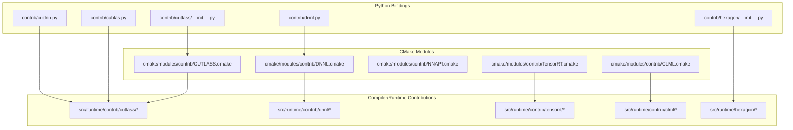

**Diagram sources**
- [python/tvm/contrib/cutlass/__init__.py:1-21](file://python/tvm/contrib/cutlass/__init__.py#L1-L21)
- [cmake/modules/contrib/CUTLASS.cmake:1-88](file://cmake/modules/contrib/CUTLASS.cmake#L1-L88)
- [python/tvm/contrib/cublas.py:1-88](file://python/tvm/contrib/cublas.py#L1-L88)
- [python/tvm/contrib/cudnn.py:1-927](file://python/tvm/contrib/cudnn.py#L1-L927)
- [python/tvm/contrib/dnnl.py:1-165](file://python/tvm/contrib/dnnl.py#L1-L165)
- [cmake/modules/contrib/DNNL.cmake:1-61](file://cmake/modules/contrib/DNNL.cmake#L1-L61)
- [cmake/modules/contrib/NNAPI.cmake:1-40](file://cmake/modules/contrib/NNAPI.cmake#L1-L40)
- [cmake/modules/contrib/CLML.cmake:1-87](file://cmake/modules/contrib/CLML.cmake#L1-L87)
- [cmake/modules/contrib/TensorRT.cmake:1-60](file://cmake/modules/contrib/TensorRT.cmake#L1-L60)
- [apps/hexagon_launcher/launcher_core.cc:1-232](file://apps/hexagon_launcher/launcher_core.cc#L1-L232)

**Section sources**
- [python/tvm/contrib/cutlass/__init__.py:1-21](file://python/tvm/contrib/cutlass/__init__.py#L1-L21)
- [cmake/modules/contrib/CUTLASS.cmake:1-88](file://cmake/modules/contrib/CUTLASS.cmake#L1-L88)
- [python/tvm/contrib/cublas.py:1-88](file://python/tvm/contrib/cublas.py#L1-L88)
- [python/tvm/contrib/cudnn.py:1-927](file://python/tvm/contrib/cudnn.py#L1-L927)
- [python/tvm/contrib/dnnl.py:1-165](file://python/tvm/contrib/dnnl.py#L1-L165)
- [cmake/modules/contrib/DNNL.cmake:1-61](file://cmake/modules/contrib/DNNL.cmake#L1-L61)
- [cmake/modules/contrib/NNAPI.cmake:1-40](file://cmake/modules/contrib/NNAPI.cmake#L1-L40)
- [cmake/modules/contrib/CLML.cmake:1-87](file://cmake/modules/contrib/CLML.cmake#L1-L87)
- [cmake/modules/contrib/TensorRT.cmake:1-60](file://cmake/modules/contrib/TensorRT.cmake#L1-L60)
- [apps/hexagon_launcher/launcher_core.cc:1-232](file://apps/hexagon_launcher/launcher_core.cc#L1-L232)

## Core Components
- CUTLASS integration: Provides BYOC codegen and runtime extensions for FP16/FP8 group GEMMs and Flash Attention on supported SMs. Exposes library detection and builds runtime objects conditionally based on CUDA architectures.
- cuBLAS bindings: Exposes extern operators for GEMM and batched GEMM, delegating to packed runtime functions for vendor-optimized kernels.
- cuDNN bindings: Offers extern operators for convolution forward/backward with algorithm selection helpers and shape utilities.
- DNNL integration: Provides extern operators for matmul and conv2d and supports JSON runtime and C-source modules.
- NNAPI integration: Enables codegen and runtime for Android NNAPI graph executor.
- CLML integration: Adds codegen and runtime for Qualcomm’s Compute Library for AI, with optional fallback to OpenCL.
- TensorRT integration: Supports codegen and runtime for NVIDIA TensorRT, enabling offloading of supported subgraphs to TensorRT engines.
- Hexagon DSP: Includes Python APIs for operator replacement and lookup-table generation, plus a C++ launcher for AOT execution on Hexagon devices.

**Section sources**
- [cmake/modules/contrib/CUTLASS.cmake:18-88](file://cmake/modules/contrib/CUTLASS.cmake#L18-L88)
- [python/tvm/contrib/cublas.py:23-88](file://python/tvm/contrib/cublas.py#L23-L88)
- [python/tvm/contrib/cudnn.py:43-927](file://python/tvm/contrib/cudnn.py#L43-L927)
- [python/tvm/contrib/dnnl.py:25-165](file://python/tvm/contrib/dnnl.py#L25-L165)
- [cmake/modules/contrib/DNNL.cmake:18-61](file://cmake/modules/contrib/DNNL.cmake#L18-L61)
- [cmake/modules/contrib/NNAPI.cmake:18-40](file://cmake/modules/contrib/NNAPI.cmake#L18-L40)
- [cmake/modules/contrib/CLML.cmake:18-87](file://cmake/modules/contrib/CLML.cmake#L18-L87)
- [cmake/modules/contrib/TensorRT.cmake:18-60](file://cmake/modules/contrib/TensorRT.cmake#L18-L60)
- [python/tvm/contrib/hexagon/__init__.py:1-20](file://python/tvm/contrib/hexagon/__init__.py#L1-L20)

## Architecture Overview
The integration architecture follows a layered approach:
- Python contrib modules define operator wrappers and expose extern functions that delegate to packed runtime functions.
- CMake modules detect and link external libraries, conditionally enabling codegen and runtime components.
- Compiler backends (under src/relax/backend/contrib) implement pattern matching and lowering to external libraries.
- Runtime backends implement device-specific execution, memory management, and profiling hooks.

```mermaid
graph TB
PY_CUBLAS["Python: contrib/cublas.py"]
PY_CUDNN["Python: contrib/cudnn.py"]
PY_DNNL["Python: contrib/dnnl.py"]
PY_HEX["Python: contrib/hexagon/*"]
CMAKE_CUTLASS["CMake: contrib/CUTLASS.cmake"]
CMAKE_DNNL["CMake: contrib/DNNL.cmake"]
CMAKE_TRT["CMake: contrib/TensorRT.cmake"]
CMAKE_CLML["CMake: contrib/CLML.cmake"]
CMAKE_NNAPI["CMake: contrib/NNAPI.cmake"]
RT_CUTLASS["Runtime: contrib/cutlass/*"]
RT_DNNL["Runtime: contrib/dnnl/*"]
RT_TRT["Runtime: contrib/tensorrt/*"]
RT_CLML["Runtime: contrib/clml/*"]
RT_HEX["Runtime: hexagon/*"]
PY_CUBLAS --> RT_CUTLASS
PY_CUDNN --> RT_CUTLASS
PY_DNNL --> RT_DNNL
PY_HEX --> RT_HEX
CMAKE_CUTLASS --> RT_CUTLASS
CMAKE_DNNL --> RT_DNNL
CMAKE_TRT --> RT_TRT
CMAKE_CLML --> RT_CLML
CMAKE_NNAPI --> RT_TRT
```

**Diagram sources**
- [python/tvm/contrib/cublas.py:1-88](file://python/tvm/contrib/cublas.py#L1-L88)
- [python/tvm/contrib/cudnn.py:1-927](file://python/tvm/contrib/cudnn.py#L1-L927)
- [python/tvm/contrib/dnnl.py:1-165](file://python/tvm/contrib/dnnl.py#L1-L165)
- [cmake/modules/contrib/CUTLASS.cmake:1-88](file://cmake/modules/contrib/CUTLASS.cmake#L1-L88)
- [cmake/modules/contrib/DNNL.cmake:1-61](file://cmake/modules/contrib/DNNL.cmake#L1-L61)
- [cmake/modules/contrib/TensorRT.cmake:1-60](file://cmake/modules/contrib/TensorRT.cmake#L1-L60)
- [cmake/modules/contrib/CLML.cmake:1-87](file://cmake/modules/contrib/CLML.cmake#L1-L87)
- [cmake/modules/contrib/NNAPI.cmake:1-40](file://cmake/modules/contrib/NNAPI.cmake#L1-L40)

## Detailed Component Analysis

### CUTLASS Integration
- Purpose: Enable BYOC codegen and runtime for high-performance GEMM and FP8/FP16 kernels on supported NVIDIA architectures.
- Build integration: Conditional object libraries are added when CUTLASS and CUDA are enabled; architecture-specific sources are included for SM90 and SM100.
- Runtime extensions: Weight preprocessing and kernel sources are linked into TVM runtime extensions.

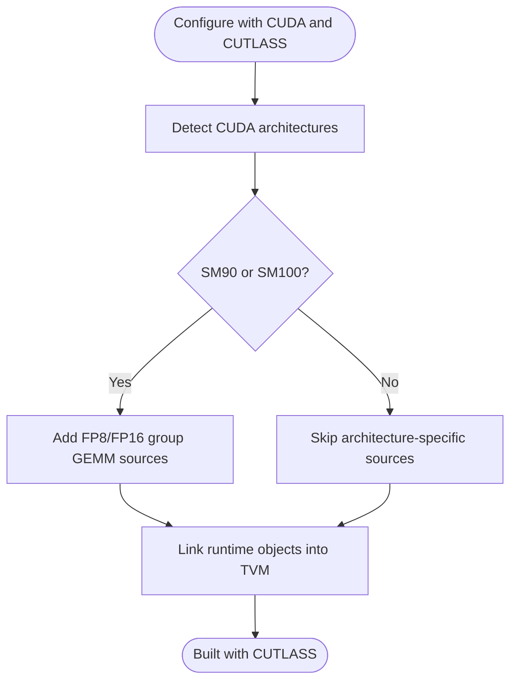

**Diagram sources**
- [cmake/modules/contrib/CUTLASS.cmake:59-81](file://cmake/modules/contrib/CUTLASS.cmake#L59-L81)

**Section sources**
- [cmake/modules/contrib/CUTLASS.cmake:18-88](file://cmake/modules/contrib/CUTLASS.cmake#L18-L88)
- [python/tvm/contrib/cutlass/__init__.py:18-21](file://python/tvm/contrib/cutlass/__init__.py#L18-L21)

### cuBLAS Integration
- Purpose: Wrap GEMM and batched GEMM operations with extern operators that call packed runtime functions.
- API: Exposes matmul and batch_matmul with transpose flags and dtype selection.
- Integration: Uses packed function names registered by the runtime to dispatch to vendor kernels.

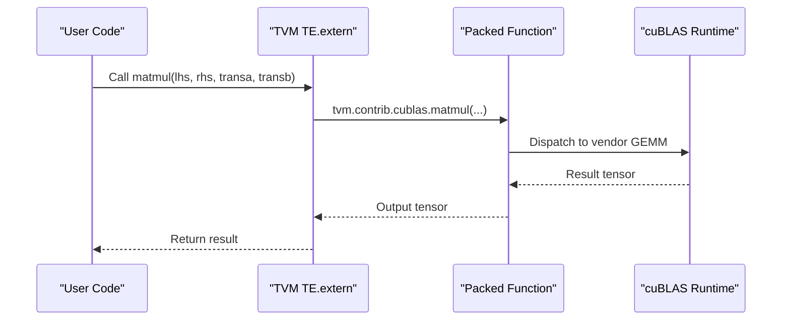

**Diagram sources**
- [python/tvm/contrib/cublas.py:23-54](file://python/tvm/contrib/cublas.py#L23-L54)

**Section sources**
- [python/tvm/contrib/cublas.py:23-88](file://python/tvm/contrib/cublas.py#L23-L88)

### cuDNN Integration
- Purpose: Provide extern operators for convolution forward/backward and helpers to select optimal algorithms.
- API: conv_forward, conv_backward_data, conv_backward_filter with algorithm selection and shape utilities.
- Integration: Uses packed functions for forward/backward passes and leverages cuDNN’s algorithm finder.

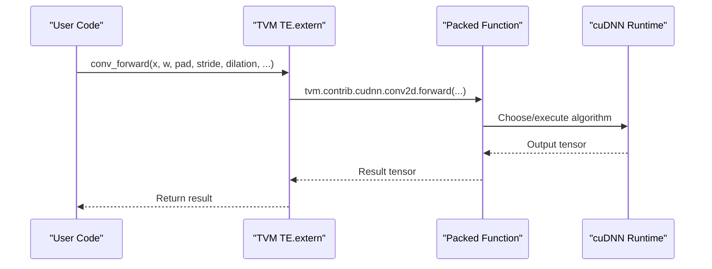

**Diagram sources**
- [python/tvm/contrib/cudnn.py:529-676](file://python/tvm/contrib/cudnn.py#L529-L676)

**Section sources**
- [python/tvm/contrib/cudnn.py:43-927](file://python/tvm/contrib/cudnn.py#L43-L927)

### DNNL Integration
- Purpose: Provide extern operators for matmul and conv2d and support JSON runtime and C-source modules.
- Build integration: CMake detects and links DNNL library; enables JSON runtime or C-source modules based on configuration.
- API: Exposes matmul and dnnl_conv2d with layout and dtype controls.

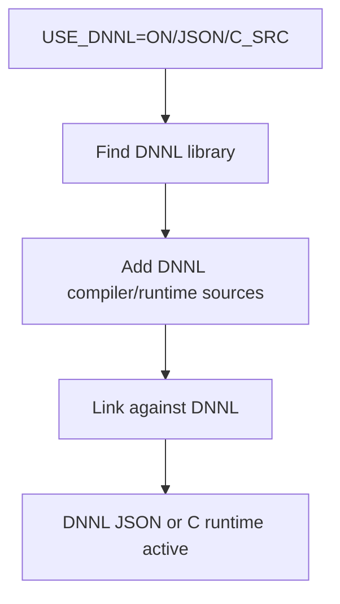

**Diagram sources**
- [cmake/modules/contrib/DNNL.cmake:18-61](file://cmake/modules/contrib/DNNL.cmake#L18-L61)
- [python/tvm/contrib/dnnl.py:25-165](file://python/tvm/contrib/dnnl.py#L25-L165)

**Section sources**
- [cmake/modules/contrib/DNNL.cmake:18-61](file://cmake/modules/contrib/DNNL.cmake#L18-L61)
- [python/tvm/contrib/dnnl.py:25-165](file://python/tvm/contrib/dnnl.py#L25-L165)

### NNAPI Integration
- Purpose: Enable codegen and runtime for Android NNAPI graph executor.
- Build integration: CMake adds NNAPI codegen and runtime sources; links required system libraries.

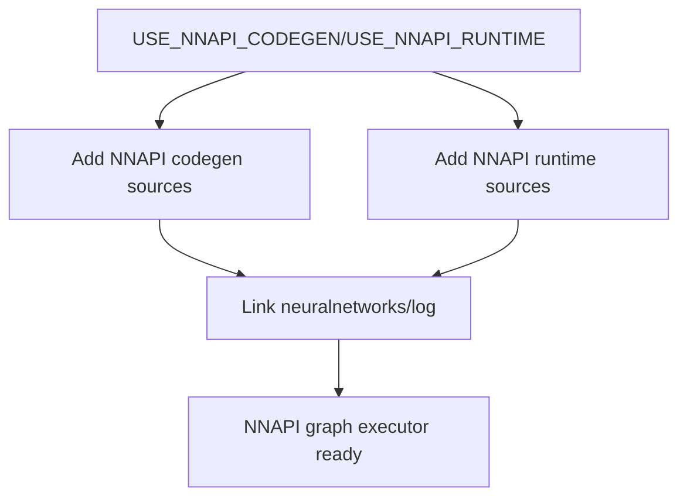

**Diagram sources**
- [cmake/modules/contrib/NNAPI.cmake:18-40](file://cmake/modules/contrib/NNAPI.cmake#L18-L40)

**Section sources**
- [cmake/modules/contrib/NNAPI.cmake:18-40](file://cmake/modules/contrib/NNAPI.cmake#L18-L40)

### CLML Integration
- Purpose: Add codegen and runtime for Qualcomm’s Compute Library for AI with optional OpenCL fallback.
- Build integration: CMake locates CLML SDK and OpenCL libraries; sets version flags and includes runtime sources.

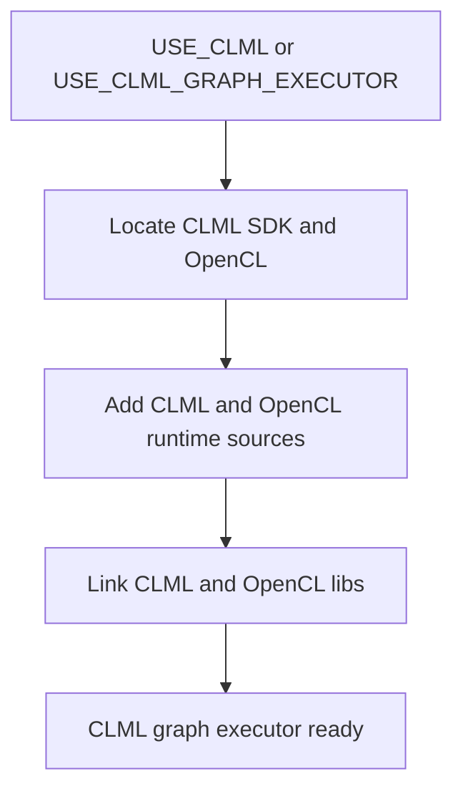

**Diagram sources**
- [cmake/modules/contrib/CLML.cmake:18-87](file://cmake/modules/contrib/CLML.cmake#L18-L87)

**Section sources**
- [cmake/modules/contrib/CLML.cmake:18-87](file://cmake/modules/contrib/CLML.cmake#L18-L87)

### TensorRT Integration
- Purpose: Offload supported subgraphs to TensorRT engines via codegen and runtime.
- Build integration: CMake finds TensorRT headers/libs and adds runtime sources; defines graph executor flags.
- Testing: Tests demonstrate pattern-based fusion and execution on CUDA targets.

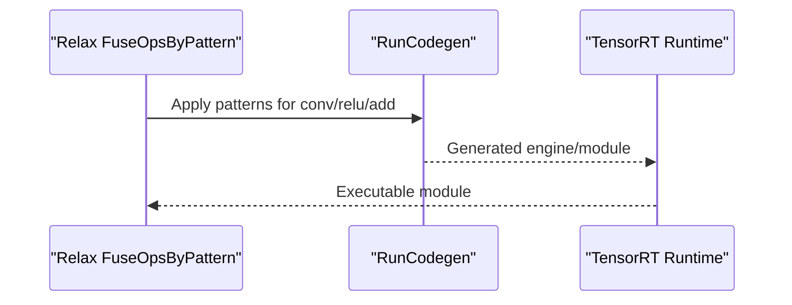

**Diagram sources**
- [tests/python/relax/test_transform_codegen_pass.py:189-213](file://tests/python/relax/test_transform_codegen_pass.py#L189-L213)
- [tests/python/relax/test_codegen_tensorrt.py:65-116](file://tests/python/relax/test_codegen_tensorrt.py#L65-L116)
- [cmake/modules/contrib/TensorRT.cmake:18-60](file://cmake/modules/contrib/TensorRT.cmake#L18-L60)

**Section sources**
- [cmake/modules/contrib/TensorRT.cmake:18-60](file://cmake/modules/contrib/TensorRT.cmake#L18-L60)
- [tests/python/relax/test_transform_codegen_pass.py:189-213](file://tests/python/relax/test_transform_codegen_pass.py#L189-L213)
- [tests/python/relax/test_codegen_tensorrt.py:65-116](file://tests/python/relax/test_codegen_tensorrt.py#L65-L116)

### Hexagon DSP Integration
- Purpose: Provide operator replacement and lookup-table generation for quantized unary ops; launch AOT executables on Hexagon devices.
- Components: Python utilities for LUT generation and operator replacement; C++ launcher for loading and executing Hexagon modules.

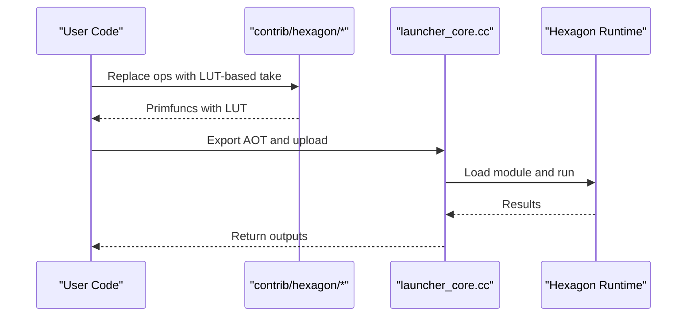

**Diagram sources**
- [python/tvm/contrib/hexagon/hexagon_unary_ops.py:86-100](file://python/tvm/contrib/hexagon/hexagon_unary_ops.py#L86-L100)
- [apps/hexagon_launcher/launcher_core.cc:181-232](file://apps/hexagon_launcher/launcher_core.cc#L181-L232)

**Section sources**
- [python/tvm/contrib/hexagon/__init__.py:1-20](file://python/tvm/contrib/hexagon/__init__.py#L1-L20)
- [python/tvm/contrib/hexagon/hexagon_unary_ops.py:1-100](file://python/tvm/contrib/hexagon/hexagon_unary_ops.py#L1-L100)
- [apps/hexagon_launcher/launcher_core.cc:1-232](file://apps/hexagon_launcher/launcher_core.cc#L1-L232)

## Dependency Analysis
- Python contrib modules depend on TVM’s TE extern mechanism and packed function registry.
- CMake modules orchestrate detection and linking of external libraries and inject runtime sources.
- Compiler backends rely on Relax transformations and pattern matching to offload subgraphs.
- Runtime backends integrate with device APIs and memory managers.

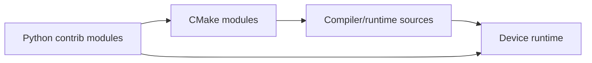

**Diagram sources**
- [python/tvm/contrib/cublas.py:1-88](file://python/tvm/contrib/cublas.py#L1-L88)
- [python/tvm/contrib/cudnn.py:1-927](file://python/tvm/contrib/cudnn.py#L1-L927)
- [cmake/modules/contrib/CUTLASS.cmake:1-88](file://cmake/modules/contrib/CUTLASS.cmake#L1-L88)
- [cmake/modules/contrib/DNNL.cmake:1-61](file://cmake/modules/contrib/DNNL.cmake#L1-L61)
- [cmake/modules/contrib/TensorRT.cmake:1-60](file://cmake/modules/contrib/TensorRT.cmake#L1-L60)
- [cmake/modules/contrib/CLML.cmake:1-87](file://cmake/modules/contrib/CLML.cmake#L1-L87)
- [cmake/modules/contrib/NNAPI.cmake:1-40](file://cmake/modules/contrib/NNAPI.cmake#L1-L40)

**Section sources**
- [python/tvm/contrib/cublas.py:1-88](file://python/tvm/contrib/cublas.py#L1-L88)
- [python/tvm/contrib/cudnn.py:1-927](file://python/tvm/contrib/cudnn.py#L1-L927)
- [cmake/modules/contrib/CUTLASS.cmake:1-88](file://cmake/modules/contrib/CUTLASS.cmake#L1-L88)
- [cmake/modules/contrib/DNNL.cmake:1-61](file://cmake/modules/contrib/DNNL.cmake#L1-L61)
- [cmake/modules/contrib/TensorRT.cmake:1-60](file://cmake/modules/contrib/TensorRT.cmake#L1-L60)
- [cmake/modules/contrib/CLML.cmake:1-87](file://cmake/modules/contrib/CLML.cmake#L1-L87)
- [cmake/modules/contrib/NNAPI.cmake:1-40](file://cmake/modules/contrib/NNAPI.cmake#L1-L40)

## Performance Considerations
- CUTLASS: Architecture-specific kernels (SM90/SM100) enable FP8/FP16 throughput; ensure correct CUDA architectures are enabled during build.
- cuBLAS/cuDNN: Use algorithm selection helpers to pick optimal convolution algorithms; leverage batched GEMM for multi-head attention.
- DNNL: Prefer JSON runtime for dynamic shapes and C-source module for minimal overhead in controlled environments.
- TensorRT: Fuse patterns aggressively and validate runtime availability; ensure TensorRT libraries are present for execution.
- Hexagon: Use LUT-based unary ops for quantized activations; profile via launcher’s profiling hooks.

[No sources needed since this section provides general guidance]

## Troubleshooting Guide
- CUDA/NVRTC compatibility: When using NVRTC, ensure host-side structures are forward-declared and standard type definitions are injected.
- TensorRT availability: Tests skip when TensorRT runtime is unavailable; confirm runtime detection and library presence.
- cuDNN algorithm selection: Some data types may trigger crashes during algorithm finding; fallback to known-safe algorithms.
- Hexagon launcher: Verify device connectivity and sysmon capture; ensure SDK paths and architecture flags are set.

**Section sources**
- [python/tvm/contrib/nvcc.py:306-348](file://python/tvm/contrib/nvcc.py#L306-L348)
- [tests/python/relax/test_codegen_tensorrt.py:46-62](file://tests/python/relax/test_codegen_tensorrt.py#L46-L62)
- [python/tvm/contrib/cudnn.py:588-626](file://python/tvm/contrib/cudnn.py#L588-L626)
- [apps/hexagon_launcher/launcher_core.cc:176-232](file://apps/hexagon_launcher/launcher_core.cc#L176-L232)

## Conclusion
TVM’s specialized acceleration integrations provide a flexible, layered approach to leveraging vendor libraries and hardware-specific runtimes. By combining Python operator wrappers, CMake-driven build integration, and compiler/runtime backends, TVM enables high-performance inference across diverse hardware targets while maintaining portability and extensibility.

[No sources needed since this section summarizes without analyzing specific files]

## Appendices

### Practical Configuration Examples
- CUTLASS: Enable CUDA and CUTLASS in CMake; architecture-specific sources are automatically included when targeting SM90/SM100.
- cuBLAS/cuDNN: Import contrib modules and use extern operators; ensure vendor libraries are installed and discoverable.
- DNNL: Set USE_DNNL to ON/JSON/C_SRC; CMake will locate and link the library accordingly.
- NNAPI/CLML: Enable codegen/runtime flags; CMake will find SDKs and libraries.
- TensorRT: Enable codegen and runtime; CMake will locate TensorRT headers/libs and add runtime sources.
- Hexagon: Use Python utilities for operator replacement and LUT generation; deploy via launcher for AOT execution.

**Section sources**
- [cmake/modules/contrib/CUTLASS.cmake:18-88](file://cmake/modules/contrib/CUTLASS.cmake#L18-L88)
- [python/tvm/contrib/cublas.py:1-88](file://python/tvm/contrib/cublas.py#L1-L88)
- [python/tvm/contrib/cudnn.py:1-927](file://python/tvm/contrib/cudnn.py#L1-L927)
- [cmake/modules/contrib/DNNL.cmake:18-61](file://cmake/modules/contrib/DNNL.cmake#L18-L61)
- [cmake/modules/contrib/NNAPI.cmake:18-40](file://cmake/modules/contrib/NNAPI.cmake#L18-L40)
- [cmake/modules/contrib/CLML.cmake:18-87](file://cmake/modules/contrib/CLML.cmake#L18-L87)
- [cmake/modules/contrib/TensorRT.cmake:18-60](file://cmake/modules/contrib/TensorRT.cmake#L18-L60)
- [python/tvm/contrib/hexagon/hexagon_unary_ops.py:1-100](file://python/tvm/contrib/hexagon/hexagon_unary_ops.py#L1-L100)

### Benchmarking and Validation
- TensorRT: Use pattern-based fusion and run codegen; compare results against baseline LLVM build.
- cuDNN: Validate algorithm selection and output correctness across formats (NCHW/NHWC).
- CUTLASS: Measure kernel performance on supported architectures; verify FP8/FP16 throughput.
- Hexagon: Profile via launcher and collect cycle/usec metrics; validate accuracy with quantized LUT ops.

**Section sources**
- [tests/python/relax/test_transform_codegen_pass.py:189-213](file://tests/python/relax/test_transform_codegen_pass.py#L189-L213)
- [tests/python/relax/test_codegen_tensorrt.py:65-116](file://tests/python/relax/test_codegen_tensorrt.py#L65-L116)
- [apps/hexagon_launcher/launcher_core.cc:115-126](file://apps/hexagon_launcher/launcher_core.cc#L115-L126)

### Extension Mechanisms
- Adding a new library:
  - Define Python operator wrappers in contrib.
  - Add CMake detection and linking logic.
  - Implement compiler backend under src/relax/backend/contrib.
  - Implement runtime under src/runtime/contrib/<lib>.
- Custom kernels:
  - Provide extern operators and packed function dispatch.
  - Integrate with device memory and profiling systems.
- Hardware-specific memory:
  - Use DLPack-compatible tensors and device APIs.
  - Ensure proper alignment and contiguity for vendor kernels.

**Section sources**
- [3rdparty/tvm-ffi/3rdparty/dlpack/include/dlpack/dlpack.h:68-136](file://3rdparty/tvm-ffi/3rdparty/dlpack/include/dlpack/dlpack.h#L68-L136)
- [cmake/modules/contrib/CUTLASS.cmake:18-88](file://cmake/modules/contrib/CUTLASS.cmake#L18-L88)
- [cmake/modules/contrib/TensorRT.cmake:18-60](file://cmake/modules/contrib/TensorRT.cmake#L18-L60)