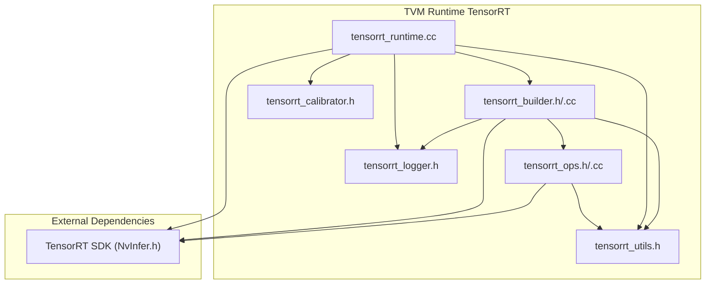
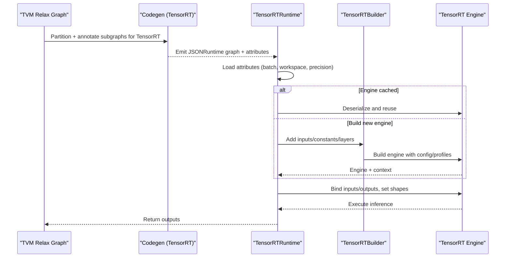
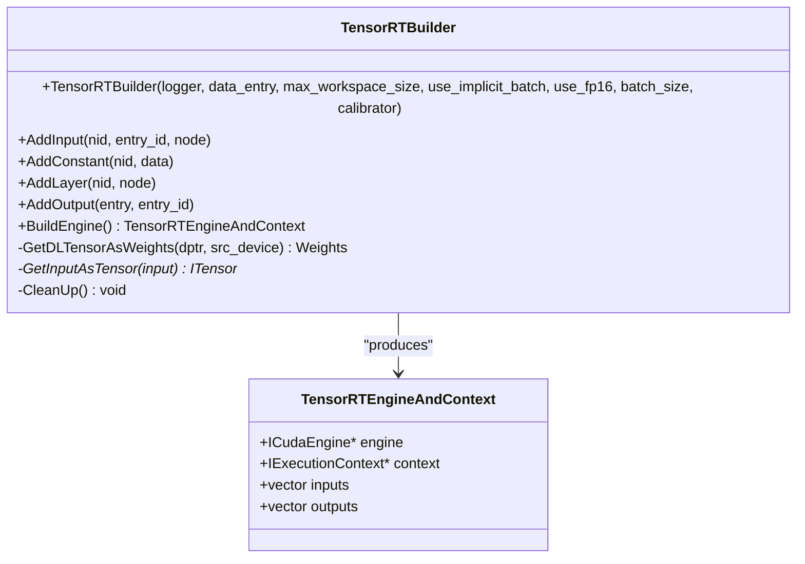
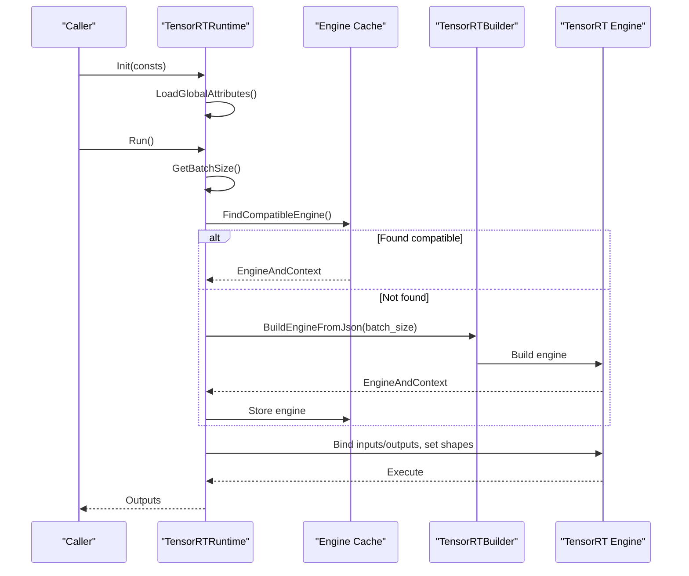
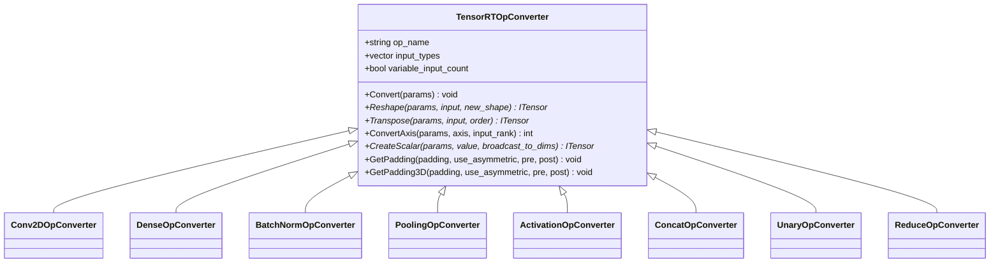
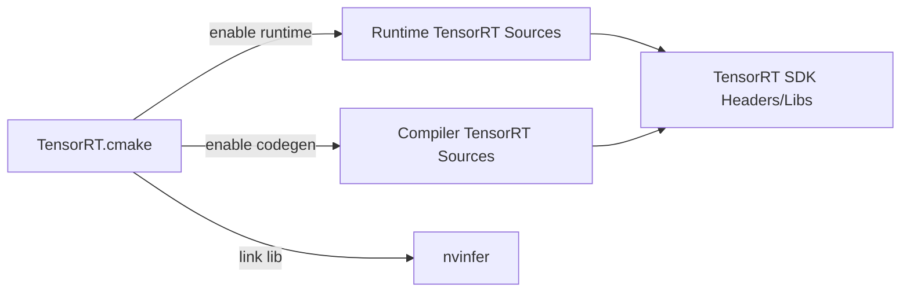

# TensorRT Integration

<cite>
**Referenced Files in This Document**
- [tensorrt_builder.h](file://src/runtime/contrib/tensorrt/tensorrt_builder.h)
- [tensorrt_builder.cc](file://src/runtime/contrib/tensorrt/tensorrt_builder.cc)
- [tensorrt_runtime.cc](file://src/runtime/contrib/tensorrt/tensorrt_runtime.cc)
- [tensorrt_ops.h](file://src/runtime/contrib/tensorrt/tensorrt_ops.h)
- [tensorrt_ops.cc](file://src/runtime/contrib/tensorrt/tensorrt_ops.cc)
- [tensorrt_calibrator.h](file://src/runtime/contrib/tensorrt/tensorrt_calibrator.h)
- [tensorrt_utils.h](file://src/runtime/contrib/tensorrt/tensorrt_utils.h)
- [tensorrt_logger.h](file://src/runtime/contrib/tensorrt/tensorrt_logger.h)
- [TensorRT.cmake](file://cmake/modules/contrib/TensorRT.cmake)
- [test_codegen_tensorrt.py](file://tests/python/relax/test_codegen_tensorrt.py)
</cite>

## Table of Contents
1. [Introduction](#introduction)
2. [Project Structure](#project-structure)
3. [Core Components](#core-components)
4. [Architecture Overview](#architecture-overview)
5. [Detailed Component Analysis](#detailed-component-analysis)
6. [Dependency Analysis](#dependency-analysis)
7. [Performance Considerations](#performance-considerations)
8. [Troubleshooting Guide](#troubleshooting-guide)
9. [Conclusion](#conclusion)
10. [Appendices](#appendices)

## Introduction
This document explains how TVM integrates with NVIDIA TensorRT to accelerate inference on NVIDIA GPUs. It covers model conversion from TVM Relax graphs to TensorRT engines, runtime execution, configuration of the TensorRT builder, plugin-style operator converters, and optimization strategies for implicit vs explicit batch modes, dynamic shapes, and mixed precision. Practical guidance is included for building engines, configuring optimization profiles, and benchmarking performance gains. Deployment considerations, supported TensorRT versions, GPU compatibility, and troubleshooting are also addressed.

## Project Structure
The TensorRT integration is implemented primarily in the runtime contribution module for TensorRT. Key files include:
- Builder: constructs TensorRT networks and builds engines
- Runtime: loads serialized engines, manages execution, and caches engines
- Operators: converter registry mapping TVM operators to TensorRT layers
- Utilities: helpers for Dims conversion, version checks, and logging
- Calibration: INT8 calibration support
- Build configuration: CMake integration for enabling TensorRT codegen/runtime

**Diagram sources**
- [tensorrt_builder.h:1-178](file://src/runtime/contrib/tensorrt/tensorrt_builder.h#L1-L178)
- [tensorrt_builder.cc:1-295](file://src/runtime/contrib/tensorrt/tensorrt_builder.cc#L1-L295)
- [tensorrt_runtime.cc:1-559](file://src/runtime/contrib/tensorrt/tensorrt_runtime.cc#L1-L559)
- [tensorrt_ops.h:1-210](file://src/runtime/contrib/tensorrt/tensorrt_ops.h#L1-L210)
- [tensorrt_ops.cc:1-1395](file://src/runtime/contrib/tensorrt/tensorrt_ops.cc#L1-L1395)
- [tensorrt_calibrator.h:1-131](file://src/runtime/contrib/tensorrt/tensorrt_calibrator.h#L1-L131)
- [tensorrt_utils.h:1-75](file://src/runtime/contrib/tensorrt/tensorrt_utils.h#L1-L75)
- [tensorrt_logger.h:1-79](file://src/runtime/contrib/tensorrt/tensorrt_logger.h#L1-L79)

**Section sources**
- [tensorrt_builder.h:1-178](file://src/runtime/contrib/tensorrt/tensorrt_builder.h#L1-L178)
- [tensorrt_runtime.cc:1-559](file://src/runtime/contrib/tensorrt/tensorrt_runtime.cc#L1-L559)
- [tensorrt_ops.h:1-210](file://src/runtime/contrib/tensorrt/tensorrt_ops.h#L1-L210)
- [tensorrt_ops.cc:1-1395](file://src/runtime/contrib/tensorrt/tensorrt_ops.cc#L1-L1395)
- [tensorrt_calibrator.h:1-131](file://src/runtime/contrib/tensorrt/tensorrt_calibrator.h#L1-L131)
- [tensorrt_utils.h:1-75](file://src/runtime/contrib/tensorrt/tensorrt_utils.h#L1-L75)
- [tensorrt_logger.h:1-79](file://src/runtime/contrib/tensorrt/tensorrt_logger.h#L1-L79)

## Core Components
- TensorRTBuilder: converts a JSONRuntime graph into a TensorRT engine and execution context. Supports implicit/explicit batch modes, FP16/INT8, and optimization profiles.
- TensorRTRuntime: deserializes engines, executes inference, manages engine caching, and supports INT8 calibration.
- TensorRTOpConverter family: registry of operator converters mapping TVM Relax operators to TensorRT layers.
- TensorRTCalibrator: INT8 calibration interface for entropy-based calibration.
- Utilities and Logger: Dims conversion helpers, version macros, and logging bridge.

**Section sources**
- [tensorrt_builder.h:64-171](file://src/runtime/contrib/tensorrt/tensorrt_builder.h#L64-L171)
- [tensorrt_builder.cc:40-220](file://src/runtime/contrib/tensorrt/tensorrt_builder.cc#L40-L220)
- [tensorrt_runtime.cc:61-541](file://src/runtime/contrib/tensorrt/tensorrt_runtime.cc#L61-L541)
- [tensorrt_ops.h:106-203](file://src/runtime/contrib/tensorrt/tensorrt_ops.h#L106-L203)
- [tensorrt_ops.cc:1312-1390](file://src/runtime/contrib/tensorrt/tensorrt_ops.cc#L1312-L1390)
- [tensorrt_calibrator.h:35-126](file://src/runtime/contrib/tensorrt/tensorrt_calibrator.h#L35-L126)
- [tensorrt_utils.h:35-75](file://src/runtime/contrib/tensorrt/tensorrt_utils.h#L35-L75)
- [tensorrt_logger.h:37-72](file://src/runtime/contrib/tensorrt/tensorrt_logger.h#L37-L72)

## Architecture Overview
End-to-end flow from TVM Relax graph to TensorRT execution:
- Graph partitioning and code generation produce subgraphs attributed for TensorRT.
- At runtime, TensorRTRuntime loads graph attributes and constants, then builds or retrieves engines.
- TensorRTBuilder constructs INetworkDefinition, adds inputs/constants/layers, sets optimization profiles, and builds ICudaEngine.
- Execution binds device buffers, sets dynamic dimensions when needed, and runs inference via IExecutionContext.

**Diagram sources**
- [tensorrt_runtime.cc:113-356](file://src/runtime/contrib/tensorrt/tensorrt_runtime.cc#L113-L356)
- [tensorrt_builder.cc:169-220](file://src/runtime/contrib/tensorrt/tensorrt_builder.cc#L169-L220)

## Detailed Component Analysis

### TensorRTBuilder
Responsibilities:
- Construct INetworkDefinition with optional explicit batch flag
- Add inputs (handling implicit batch shape stripping)
- Add constants as weights
- Convert operator nodes via registered TensorRTOpConverter
- Add outputs and mark network outputs
- Configure builder config (workspace, FP16, INT8, calibrator)
- Create optimization profiles for explicit batch dynamic shapes
- Build ICudaEngine and IExecutionContext

Key behaviors:
- Implicit vs explicit batch: removes batch dimension from shapes in implicit mode; sets max batch size accordingly.
- Mixed precision: enables FP16 or INT8 via builder config; INT8 requires a calibrator.
- Dynamic shapes: explicit batch mode creates optimization profiles from runtime shapes.
- Memory cleanup: destroys network, config, builder, and deletes allocated weight buffers.

**Diagram sources**
- [tensorrt_builder.h:46-171](file://src/runtime/contrib/tensorrt/tensorrt_builder.h#L46-L171)

**Section sources**
- [tensorrt_builder.h:64-171](file://src/runtime/contrib/tensorrt/tensorrt_builder.h#L64-L171)
- [tensorrt_builder.cc:40-220](file://src/runtime/contrib/tensorrt/tensorrt_builder.cc#L40-L220)

### TensorRTRuntime
Responsibilities:
- Deserialize subgraph JSON and constants
- Load global attributes (implicit/explicit batch, workspace, precision)
- Manage engine cache (single vs multi-engine modes)
- Build engines on demand or load from disk cache
- Execute inference with proper binding setup and dynamic shape handling
- INT8 calibration pipeline with TensorRTCalibrator

Execution flow highlights:
- Determine batch size from input shapes
- Find compatible engine in cache or build a new one
- For explicit batch, set binding dimensions per invocation
- Copy outputs back to host when needed

**Diagram sources**
- [tensorrt_runtime.cc:164-356](file://src/runtime/contrib/tensorrt/tensorrt_runtime.cc#L164-L356)

**Section sources**
- [tensorrt_runtime.cc:61-541](file://src/runtime/contrib/tensorrt/tensorrt_runtime.cc#L61-L541)

### Operator Converters (TensorRTOpConverter)
The converter registry maps TVM Relax operators to TensorRT layers. Examples include:
- Activations (relu, sigmoid, tanh, clip, leaky_relu)
- Binary elementwise ops (add, subtract, multiply, divide, power, maximum, minimum)
- Convolutions (conv1d, conv2d, conv3d), transposed convolutions
- Pooling (max_pool2d, avg_pool2d, global pooling, adaptive pooling)
- Normalizations (batch_norm, layer_norm)
- Matrix ops (dense, batch_matmul)
- Layout transforms (transpose, layout_transform)
- Reductions (sum, prod, max, min, mean)
- Others (concatenate, expand_dims, squeeze, reshape, pad, erf, etc.)

Converter behavior:
- Validate input types (tensor vs weight) and counts
- Handle implicit vs explicit batch axis conversions
- Apply padding, strides, dilations, and layout constraints
- Use helper utilities for reshaping, transposing, and axis conversion

**Diagram sources**
- [tensorrt_ops.h:106-203](file://src/runtime/contrib/tensorrt/tensorrt_ops.h#L106-L203)
- [tensorrt_ops.cc:161-1390](file://src/runtime/contrib/tensorrt/tensorrt_ops.cc#L161-L1390)

**Section sources**
- [tensorrt_ops.h:106-203](file://src/runtime/contrib/tensorrt/tensorrt_ops.h#L106-L203)
- [tensorrt_ops.cc:161-1390](file://src/runtime/contrib/tensorrt/tensorrt_ops.cc#L161-L1390)

### TensorRTCalibrator (INT8)
Purpose:
- Implements IInt8EntropyCalibrator2 to collect statistics for INT8 quantization
- Copies calibration batches from device to host, allocates device buffers, and streams data back to device during calibration

Usage:
- Created when INT8 mode is enabled
- Accumulates calibration batches and writes cache for reuse

**Section sources**
- [tensorrt_calibrator.h:35-126](file://src/runtime/contrib/tensorrt/tensorrt_calibrator.h#L35-L126)

### Utilities and Logger
- Version macro: TRT_VERSION_GE for conditional TensorRT features
- Dims helpers: VectorToTrtDims and TrtDimsToVector
- Logger: Bridges TensorRT severity levels to TVM logging

**Section sources**
- [tensorrt_utils.h:35-75](file://src/runtime/contrib/tensorrt/tensorrt_utils.h#L35-L75)
- [tensorrt_logger.h:37-72](file://src/runtime/contrib/tensorrt/tensorrt_logger.h#L37-L72)

## Dependency Analysis
Build-time integration:
- CMake toggles TensorRT codegen and runtime separately
- When runtime is enabled, finds TensorRT include/library and links the runtime sources
- Adds compile-time definitions for runtime features

**Diagram sources**
- [TensorRT.cmake:18-59](file://cmake/modules/contrib/TensorRT.cmake#L18-L59)

**Section sources**
- [TensorRT.cmake:18-59](file://cmake/modules/contrib/TensorRT.cmake#L18-L59)

## Performance Considerations
- Mixed precision
  - Enable FP16 via runtime attribute or environment variable; builder config flags are set accordingly.
  - INT8 requires a calibrator and calibration batches; ensure calibration cache is persisted for reuse.
- Workspace sizing
  - Tune max workspace size via runtime attribute or environment variable to balance speed and memory.
- Batch modes
  - Implicit batch: simpler, fixed batch size; builder sets max batch size.
  - Explicit batch: dynamic shapes supported; configure optimization profiles per input.
- Engine caching
  - Persist engines to disk and reload to avoid repeated build times.
  - Choose single-engine vs multi-engine mode based on memory budget and throughput needs.
- Operator coverage
  - Use patterns and compositing to offload supported subgraphs; unsupported ops remain on CPU.

[No sources needed since this section provides general guidance]

## Troubleshooting Guide
Common issues and resolutions:
- TensorRT runtime not enabled
  - Ensure build with runtime enabled and TensorRT SDK present.
  - Verify environment function availability for runtime checks.
- Shape mismatches
  - Implicit batch mode strips batch dimension; confirm layouts and shapes align.
  - For explicit batch, set binding dimensions per invocation.
- INT8 calibration
  - INT8 mode requires calibration batches; ensure environment variables and calibrator are configured.
  - Calibration cache can be persisted and reused.
- Memory errors
  - Adjust workspace size and monitor GPU memory; consider smaller batch sizes or disabling FP16/INT8.
- Operator not supported
  - Unsupported operators will cause conversion failures; exclude them from TensorRT offloading or preprocess to supported forms.

**Section sources**
- [tensorrt_runtime.cc:505-519](file://src/runtime/contrib/tensorrt/tensorrt_runtime.cc#L505-L519)
- [tensorrt_builder.cc:169-220](file://src/runtime/contrib/tensorrt/tensorrt_builder.cc#L169-L220)
- [tensorrt_calibrator.h:35-126](file://src/runtime/contrib/tensorrt/tensorrt_calibrator.h#L35-L126)

## Conclusion
TVM’s TensorRT integration provides a robust pathway to accelerate inference on NVIDIA GPUs. The builder constructs optimized engines from TVM Relax graphs, the runtime manages execution and caching, and the operator converter registry ensures broad operator coverage. By leveraging implicit/explicit batch modes, dynamic shapes, and mixed precision, users can achieve significant performance improvements. Proper configuration of workspace, calibration, and engine caching yields predictable and efficient deployments.

[No sources needed since this section summarizes without analyzing specific files]

## Appendices

### Practical Examples and Workflows

- Converting TVM graphs to TensorRT engines
  - Use Relax patterns and compositing to offload supported subgraphs.
  - Build and run with VirtualMachine on CUDA; engine is built at first use and cached.
  - Reference: [test_codegen_tensorrt.py:75-113](file://tests/python/relax/test_codegen_tensorrt.py#L75-L113)

- Configuring TensorRT optimization profiles
  - Explicit batch mode: optimization profiles are constructed from runtime shapes; binding dimensions are set per invocation.
  - Implicit batch mode: max batch size is set on the builder.
  - Reference: [tensorrt_builder.cc:169-220](file://src/runtime/contrib/tensorrt/tensorrt_builder.cc#L169-L220), [tensorrt_runtime.cc:164-252](file://src/runtime/contrib/tensorrt/tensorrt_runtime.cc#L164-L252)

- Benchmarking performance improvements
  - Compare execution time with and without TensorRT offloading.
  - Measure impact of FP16/INT8 and engine caching.
  - Use appropriate batch sizes and shapes aligned with your workload.

**Section sources**
- [test_codegen_tensorrt.py:65-113](file://tests/python/relax/test_codegen_tensorrt.py#L65-L113)
- [tensorrt_builder.cc:169-220](file://src/runtime/contrib/tensorrt/tensorrt_builder.cc#L169-L220)
- [tensorrt_runtime.cc:164-252](file://src/runtime/contrib/tensorrt/tensorrt_runtime.cc#L164-L252)

### Supported TensorRT Versions and GPU Compatibility
- Version checks: Conditional TensorRT features gated behind TRT_VERSION_GE macros.
- Minimum supported TensorRT versions are reflected in conditional compilation of features (e.g., 3D ops, advanced unary ops).
- GPU compatibility: Requires CUDA-capable NVIDIA GPU; TensorRT runtime must be available at build/run time.

**Section sources**
- [tensorrt_utils.h:35-38](file://src/runtime/contrib/tensorrt/tensorrt_utils.h#L35-L38)
- [tensorrt_ops.cc:353-403](file://src/runtime/contrib/tensorrt/tensorrt_ops.cc#L353-L403)
- [tensorrt_ops.cc:889-937](file://src/runtime/contrib/tensorrt/tensorrt_ops.cc#L889-L937)
- [tensorrt_ops.cc:1380-1382](file://src/runtime/contrib/tensorrt/tensorrt_ops.cc#L1380-L1382)

### Deployment Considerations
- Build configuration
  - Enable TensorRT codegen and/or runtime via CMake flags; link against TensorRT libraries.
- Environment variables
  - Workspace size, precision flags, INT8 calibration batch count, and engine cache directory.
- Engine persistence
  - Serialize and deserialize engines to/from disk to avoid repeated builds.

**Section sources**
- [TensorRT.cmake:18-59](file://cmake/modules/contrib/TensorRT.cmake#L18-L59)
- [tensorrt_runtime.cc:121-141](file://src/runtime/contrib/tensorrt/tensorrt_runtime.cc#L121-L141)
- [tensorrt_runtime.cc:362-447](file://src/runtime/contrib/tensorrt/tensorrt_runtime.cc#L362-L447)