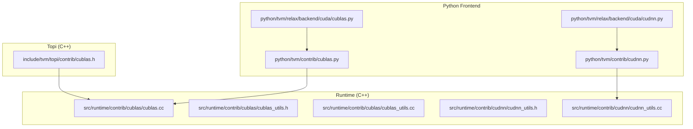
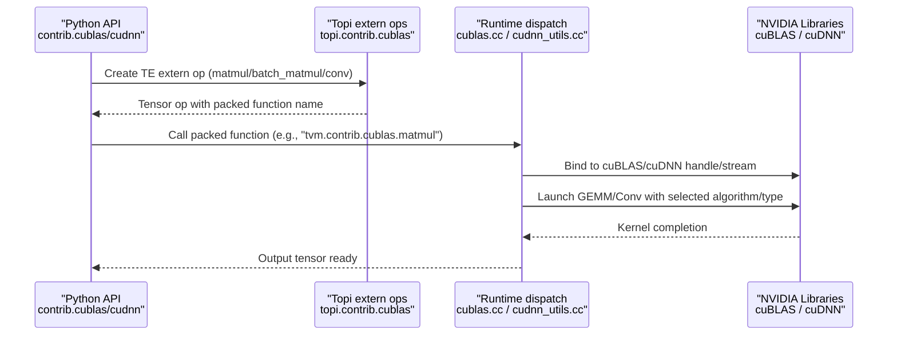
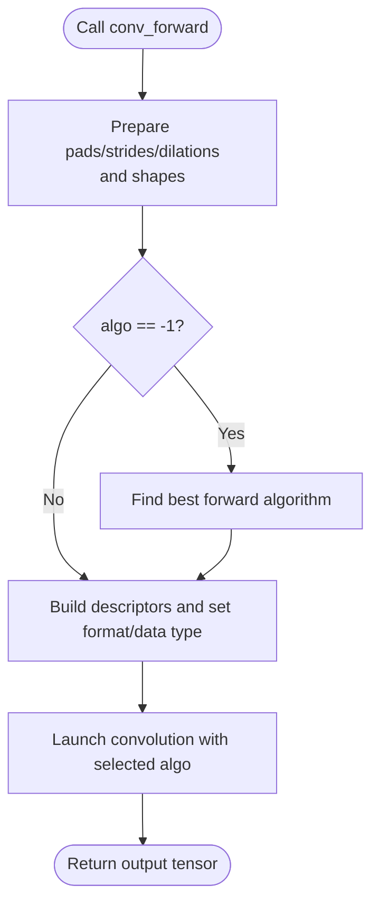
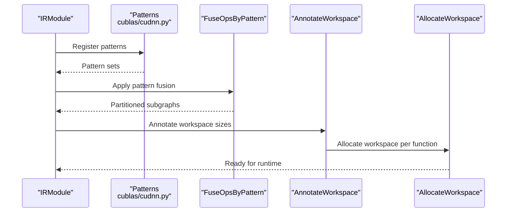
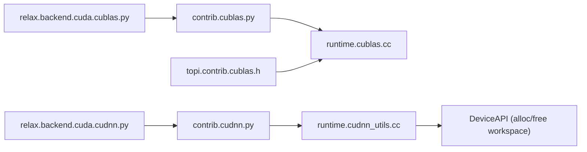

# cuBLAS/cuDNN Integration

<cite>
**Referenced Files in This Document**
- [cublas.py](file://python/tvm/contrib/cublas.py)
- [cudnn.py](file://python/tvm/contrib/cudnn.py)
- [cublas.h](file://include/tvm/topi/contrib/cublas.h)
- [cublas.cc](file://src/runtime/contrib/cublas/cublas.cc)
- [cublas_utils.h](file://src/runtime/contrib/cublas/cublas_utils.h)
- [cublas_utils.cc](file://src/runtime/contrib/cublas/cublas_utils.cc)
- [cudnn_utils.h](file://src/runtime/contrib/cudnn/cudnn_utils.h)
- [cudnn_utils.cc](file://src/runtime/contrib/cudnn/cudnn_utils.cc)
- [cublas.py](file://python/tvm/relax/backend/cuda/cublas.py)
- [cudnn.py](file://python/tvm/relax/backend/cuda/cudnn.py)
- [test_codegen_cublas.py](file://tests/python/relax/test_codegen_cublas.py)
- [test_codegen_cudnn.py](file://tests/python/relax/test_codegen_cudnn.py)
</cite>

## Table of Contents
1. [Introduction](#introduction)
2. [Project Structure](#project-structure)
3. [Core Components](#core-components)
4. [Architecture Overview](#architecture-overview)
5. [Detailed Component Analysis](#detailed-component-analysis)
6. [Dependency Analysis](#dependency-analysis)
7. [Performance Considerations](#performance-considerations)
8. [Troubleshooting Guide](#troubleshooting-guide)
9. [Conclusion](#conclusion)
10. [Appendices](#appendices)

## Introduction
This document explains how TVM integrates with NVIDIA cuBLAS and cuDNN to accelerate high-performance linear algebra and deep learning primitives on NVIDIA GPUs. It covers:
- cuBLAS integration for GEMM, batched GEMM, and related memory and algorithmic considerations
- cuDNN integration for convolution, normalization, activation, and related memory/workspace management
- Practical configuration, algorithm selection, and performance tuning
- Supported data types, layouts, and compatibility constraints
- Troubleshooting and benchmarking approaches

## Project Structure
TVM’s cuBLAS/cuDNN integration spans Python frontends, C++ runtime dispatch, and Relax backend pattern registration:
- Python APIs expose high-level operations for cuBLAS and cuDNN
- C++ runtime binds to NVIDIA libraries and manages device handles, streams, and workspace
- Relax backend registers patterns and partitions subgraphs for offloading

**Diagram sources**
- [cublas.py:23-88](file://python/tvm/contrib/cublas.py#L23-L88)
- [cudnn.py:529-676](file://python/tvm/contrib/cudnn.py#L529-L676)
- [cublas.h:46-82](file://include/tvm/topi/contrib/cublas.h#L46-L82)
- [cublas.cc:518-592](file://src/runtime/contrib/cublas/cublas.cc#L518-L592)
- [cublas_utils.h:74-140](file://src/runtime/contrib/cublas/cublas_utils.h#L74-L140)
- [cublas_utils.cc:33-79](file://src/runtime/contrib/cublas/cublas_utils.cc#L33-L79)
- [cudnn_utils.h:38-136](file://src/runtime/contrib/cudnn/cudnn_utils.h#L38-L136)
- [cudnn_utils.cc:37-135](file://src/runtime/contrib/cudnn/cudnn_utils.cc#L37-L135)

**Section sources**
- [cublas.py:23-88](file://python/tvm/contrib/cublas.py#L23-L88)
- [cudnn.py:529-676](file://python/tvm/contrib/cudnn.py#L529-L676)
- [cublas.h:46-82](file://include/tvm/topi/contrib/cublas.h#L46-L82)
- [cublas.cc:518-592](file://src/runtime/contrib/cublas/cublas.cc#L518-L592)
- [cublas_utils.h:74-140](file://src/runtime/contrib/cublas/cublas_utils.h#L74-L140)
- [cublas_utils.cc:33-79](file://src/runtime/contrib/cublas/cublas_utils.cc#L33-L79)
- [cudnn_utils.h:38-136](file://src/runtime/contrib/cudnn/cudnn_utils.h#L38-L136)
- [cudnn_utils.cc:37-135](file://src/runtime/contrib/cudnn/cudnn_utils.cc#L37-L135)

## Core Components
- cuBLAS Python API: Exposes matmul and batch_matmul via TE extern ops, delegating to packed runtime functions.
- cuDNN Python API: Provides convolution forward/backward APIs, algorithm discovery helpers, and shape inference utilities.
- Runtime dispatch: C++ code binds to cuBLAS/cuDNN, manages per-thread handles and streams, and performs type/stride checks.
- Relax backend: Registers patterns for GEMM/convolution and partitions subgraphs for offload.

Key responsibilities:
- cuBLAS: GEMM, batched GEMM, mixed-precision GEMM (GemmEx), cuBLASLt IGEMM, and Tensor Core enablement
- cuDNN: Convolution forward/backward data/filter, algorithm selection, tensor descriptors, and workspace management

**Section sources**
- [cublas.py:23-88](file://python/tvm/contrib/cublas.py#L23-L88)
- [cudnn.py:529-676](file://python/tvm/contrib/cudnn.py#L529-L676)
- [cublas.cc:518-592](file://src/runtime/contrib/cublas/cublas.cc#L518-L592)
- [cudnn_utils.cc:172-261](file://src/runtime/contrib/cudnn/cudnn_utils.cc#L172-L261)
- [cublas.py:38-141](file://python/tvm/relax/backend/cuda/cublas.py#L38-L141)
- [cudnn.py:47-66](file://python/tvm/relax/backend/cuda/cudnn.py#L47-L66)

## Architecture Overview
End-to-end flow from Python to NVIDIA libraries:

**Diagram sources**
- [cublas.py:23-88](file://python/tvm/contrib/cublas.py#L23-L88)
- [cublas.h:46-82](file://include/tvm/topi/contrib/cublas.h#L46-L82)
- [cublas.cc:518-592](file://src/runtime/contrib/cublas/cublas.cc#L518-L592)
- [cudnn_utils.cc:172-261](file://src/runtime/contrib/cudnn/cudnn_utils.cc#L172-L261)

## Detailed Component Analysis

### cuBLAS Integration
- Operations: matmul, batch_matmul
- Data types: float16, float32, float64, int8 (IGEMM), bfloat16
- Mixed precision: GEMM with different input/output types via GemmEx
- Batched GEMM: Strided batched API for 3D inputs
- cuBLASLt: IGEMM path for int8 with specialized layouts and epilogue support
- Tensor Cores: Auto-enable math mode for cuBLAS 9.0+ when supported

```mermaid
classDiagram
class CublasHgemmOp {
+operator()(ta,tb,M,N,K,alpha,A,lda,B,ldb,beta,C,ldc)
}
class CublasSgemmOp {
+operator()(ta,tb,M,N,K,alpha,A,lda,B,ldb,beta,C,ldc)
}
class CublasDgemmOp {
+operator()(ta,tb,M,N,K,alpha,A,lda,B,ldb,beta,C,ldc)
}
class CublasHgemmBatchOp {
+operator()(batch_size,ta,tb,M,N,K,alpha,A,a_stride,lda,B,b_stride,ldb,beta,C,c_stride,ldc)
}
class CublasSgemmBatchOp {
+operator()(batch_size,ta,tb,M,N,K,alpha,A,a_stride,lda,B,b_stride,ldb,beta,C,c_stride,ldc)
}
class CublasDgemmBatchOp {
+operator()(batch_size,ta,tb,M,N,K,alpha,A,a_stride,lda,B,b_stride,ldb,beta,C,c_stride,ldc)
}
class CuBlasThreadEntry {
+handle
+ThreadLocal(device)
}
class CuBlasLtThreadEntry {
+handle
+matmul_pref_desc
+workspace_ptr
+workspace_size
+ThreadLocal(device)
}
CublasHgemmOp --> CuBlasThreadEntry : "uses handle"
CublasSgemmOp --> CuBlasThreadEntry : "uses handle"
CublasDgemmOp --> CuBlasThreadEntry : "uses handle"
CublasHgemmBatchOp --> CuBlasThreadEntry : "uses handle"
CublasSgemmBatchOp --> CuBlasThreadEntry : "uses handle"
CublasDgemmBatchOp --> CuBlasThreadEntry : "uses handle"
CuBlasLtThreadEntry --> CuBlasThreadEntry : "complements"
```

**Diagram sources**
- [cublas.cc:48-123](file://src/runtime/contrib/cublas/cublas.cc#L48-L123)
- [cublas.cc:518-592](file://src/runtime/contrib/cublas/cublas.cc#L518-L592)
- [cublas_utils.h:74-93](file://src/runtime/contrib/cublas/cublas_utils.h#L74-L93)

**Section sources**
- [cublas.py:23-88](file://python/tvm/contrib/cublas.py#L23-L88)
- [cublas.h:46-82](file://include/tvm/topi/contrib/cublas.h#L46-L82)
- [cublas.cc:41-46](file://src/runtime/contrib/cublas/cublas.cc#L41-L46)
- [cublas.cc:383-439](file://src/runtime/contrib/cublas/cublas.cc#L383-L439)
- [cublas.cc:441-516](file://src/runtime/contrib/cublas/cublas.cc#L441-L516)
- [cublas_utils.h:95-126](file://src/runtime/contrib/cublas/cublas_utils.h#L95-L126)
- [cublas_utils.cc:33-49](file://src/runtime/contrib/cublas/cublas_utils.cc#L33-L49)
- [cublas_utils.cc:51-75](file://src/runtime/contrib/cublas/cublas_utils.cc#L51-L75)

### cuDNN Integration
- Operations: conv_forward, conv_backward_data, conv_backward_filter
- Algorithm selection: Helpers to discover best forward/backward algorithms
- Shapes: Utilities to compute output shapes and backward data shapes
- Descriptors: Per-thread descriptor management for convolution, filters, tensors, and activation
- Workspace: Dynamic allocation and reuse via DeviceAPI

**Diagram sources**
- [cudnn.py:529-676](file://python/tvm/contrib/cudnn.py#L529-L676)
- [cudnn_utils.cc:172-261](file://src/runtime/contrib/cudnn/cudnn_utils.cc#L172-L261)

**Section sources**
- [cudnn.py:300-400](file://python/tvm/contrib/cudnn.py#L300-L400)
- [cudnn.py:403-463](file://python/tvm/contrib/cudnn.py#L403-L463)
- [cudnn.py:529-676](file://python/tvm/contrib/cudnn.py#L529-L676)
- [cudnn_utils.h:67-89](file://src/runtime/contrib/cudnn/cudnn_utils.h#L67-L89)
- [cudnn_utils.cc:172-261](file://src/runtime/contrib/cudnn/cudnn_utils.cc#L172-L261)

### Relax Backend Patterns and Offload
- cuBLAS patterns: Matmul, transposed matmul, with optional bias and activations (ReLU/GELU), dequantize/multiply variants
- cuDNN patterns: Conv2D with NHWC/OHWI and NCHW/OIHW layouts, stacked attention variants
- Partitioning: FuseOpsByPattern with annotation and workspace allocation

**Diagram sources**
- [cublas.py:143-220](file://python/tvm/relax/backend/cuda/cublas.py#L143-L220)
- [cudnn.py:92-127](file://python/tvm/relax/backend/cuda/cudnn.py#L92-L127)
- [cudnn.py:130-153](file://python/tvm/relax/backend/cuda/cudnn.py#L130-L153)
- [cudnn.py:194-203](file://python/tvm/relax/backend/cuda/cudnn.py#L194-L203)

**Section sources**
- [cublas.py:38-141](file://python/tvm/relax/backend/cuda/cublas.py#L38-L141)
- [cublas.py:223-246](file://python/tvm/relax/backend/cuda/cublas.py#L223-L246)
- [cudnn.py:33-66](file://python/tvm/relax/backend/cuda/cudnn.py#L33-L66)
- [cudnn.py:130-153](file://python/tvm/relax/backend/cuda/cudnn.py#L130-L153)
- [cudnn.py:194-203](file://python/tvm/relax/backend/cuda/cudnn.py#L194-L203)

## Dependency Analysis
- Python contrib APIs depend on TE extern ops and packed runtime functions
- Runtime dispatch depends on per-thread cuBLAS/cuDNN handles and CUDA streams
- cuDNN runtime depends on DeviceAPI for workspace allocation and stream binding
- Relax backend depends on pattern registries and composite function attributes for workspace sizing

**Diagram sources**
- [cublas.py:23-88](file://python/tvm/contrib/cublas.py#L23-L88)
- [cudnn.py:529-676](file://python/tvm/contrib/cudnn.py#L529-L676)
- [cublas.h:46-82](file://include/tvm/topi/contrib/cublas.h#L46-L82)
- [cublas.cc:518-592](file://src/runtime/contrib/cublas/cublas.cc#L518-L592)
- [cudnn_utils.cc:103-134](file://src/runtime/contrib/cudnn/cudnn_utils.cc#L103-L134)

**Section sources**
- [cublas.py:23-88](file://python/tvm/contrib/cublas.py#L23-L88)
- [cudnn.py:529-676](file://python/tvm/contrib/cudnn.py#L529-L676)
- [cudnn_utils.cc:103-134](file://src/runtime/contrib/cudnn/cudnn_utils.cc#L103-L134)

## Performance Considerations
- Algorithm selection
  - cuBLAS: Prefer GEMM for float16/32; use GEMM for float64; leverage mixed-precision GemmEx for heterogeneous input/output types
  - cuDNN: Use algorithm discovery helpers to pick the best forward/backward algorithms; avoid unsupported combinations (e.g., INT8 forward with automatic selection in some cases)
- Data types and layouts
  - cuBLAS: float16/32/64, int8 (IGEMM), bfloat16; int8 IGEMM requires reduction dimension and row count multiples of 4; FP8 requires RHS transposition and 16-byte alignment
  - cuDNN: float16/32 supported for conv2d; NHWC/OHWI or NCHW/OIHW layouts
- Memory and workspace
  - cuDNN: Per-thread workspace allocation and reuse; annotate and allocate workspace for offloaded functions
  - cuBLASLt: Pre-allocated workspace buffer (32 MB default) for heuristics and execution
- Stream and handle
  - Per-thread cuBLAS/cuDNN handles bound to current CUDA stream for deterministic execution
- Tensor Cores
  - cuBLAS: Enable math mode for cuBLAS 9.0+ when supported

Practical tips:
- Use partition_for_cublas/partition_for_cudnn to offload supported subgraphs
- For cuBLASLt IGEMM, ensure shapes meet alignment constraints and batch conditions
- For cuDNN, pre-compute output shapes and select algorithms before launch

**Section sources**
- [cublas.cc:41-46](file://src/runtime/contrib/cublas/cublas.cc#L41-L46)
- [cublas.py:38-141](file://python/tvm/relax/backend/cuda/cublas.py#L38-L141)
- [cudnn.py:588-625](file://python/tvm/contrib/cudnn.py#L588-L625)
- [cudnn_utils.cc:157-170](file://src/runtime/contrib/cudnn/cudnn_utils.cc#L157-L170)
- [cublas_utils.cc:51-75](file://src/runtime/contrib/cublas/cublas_utils.cc#L51-L75)

## Troubleshooting Guide
Common issues and resolutions:
- cuBLAS errors
  - Unsupported data type or mismatched types: Verify dtype support and mixed-precision constraints
  - int8 IGEMM alignment: Ensure reduction dimension and row counts are multiples of 4
  - In-place transpose: Handle reversed strides for in-place transposed inputs
- cuDNN initialization
  - Handle creation failures: Existence check and fallback behavior handled in thread-local entry
  - Workspace allocation failures: Ensure sufficient GPU memory; workspace is dynamically allocated and freed
- Algorithm selection crashes
  - INT8 forward with automatic selection: Avoid relying on automatic selection for INT8; use discovered algorithm or a safe default
  - NHWC vs INT32: Certain combinations require specific algorithm choices

Validation and tests:
- Use unit tests for Relax codegen to validate partitioning and offload correctness

**Section sources**
- [cublas.cc:407-411](file://src/runtime/contrib/cublas/cublas.cc#L407-L411)
- [cublas.cc:466-469](file://src/runtime/contrib/cublas/cublas.cc#L466-L469)
- [cudnn_utils.cc:103-134](file://src/runtime/contrib/cudnn/cudnn_utils.cc#L103-L134)
- [cudnn_utils.cc:157-170](file://src/runtime/contrib/cudnn/cudnn_utils.cc#L157-L170)
- [cudnn.py:588-607](file://python/tvm/contrib/cudnn.py#L588-L607)
- [test_codegen_cublas.py](file://tests/python/relax/test_codegen_cublas.py)
- [test_codegen_cudnn.py](file://tests/python/relax/test_codegen_cudnn.py)

## Conclusion
TVM’s cuBLAS/cuDNN integration provides a robust, high-performance bridge to NVIDIA’s optimized libraries. By combining Python-friendly APIs, precise runtime dispatch, and Relax-based partitioning, TVM enables efficient execution of GEMM and convolution workloads with careful attention to data types, layouts, algorithm selection, and memory management.

## Appendices

### Supported Data Types and Layouts
- cuBLAS
  - float16, float32, float64, int8 (IGEMM), bfloat16
  - IGEMM constraints: reduction dimension and row counts multiples of 4; FP8 requires transposed RHS and 16-byte alignment
- cuDNN
  - float16, float32 for conv2d
  - Layouts: NHWC/OHWI or NCHW/OIHW

**Section sources**
- [cublas.py:38-48](file://python/tvm/relax/backend/cuda/cublas.py#L38-L48)
- [cublas.py:81-114](file://python/tvm/relax/backend/cuda/cublas.py#L81-L114)
- [cudnn.py:33-44](file://python/tvm/relax/backend/cuda/cudnn.py#L33-L44)

### Practical Configuration Examples
- cuBLAS
  - Select matmul or batch_matmul via Python API; TVM constructs TE extern ops and calls packed runtime functions
  - For mixed precision, rely on GemmEx path; ensure dtype compatibility
- cuDNN
  - Use conv_forward with explicit algo or let the helper discover the best algorithm
  - For backward passes, compute dgrad/wgrad shapes and select appropriate algorithms

**Section sources**
- [cublas.py:23-88](file://python/tvm/contrib/cublas.py#L23-L88)
- [cudnn.py:529-676](file://python/tvm/contrib/cudnn.py#L529-L676)
- [cudnn.py:300-400](file://python/tvm/contrib/cudnn.py#L300-L400)
- [cudnn.py:403-463](file://python/tvm/contrib/cudnn.py#L403-L463)

### Benchmarking Methodologies
- Use CUDA events around kernel launches to measure runtime and compute GFLOPs
- For grouped or batched workloads, synchronize device and record events before/after batched operations
- Compare algorithm choices and workspace sizes to identify bottlenecks

[No sources needed since this section provides general guidance]