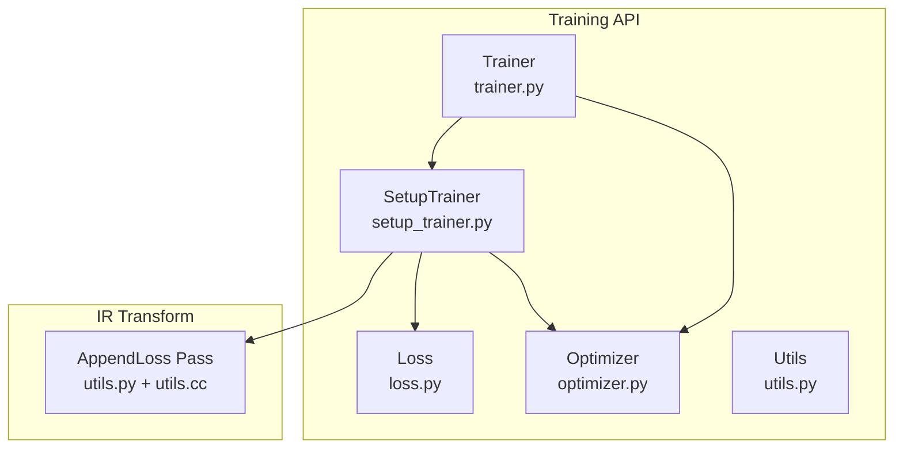
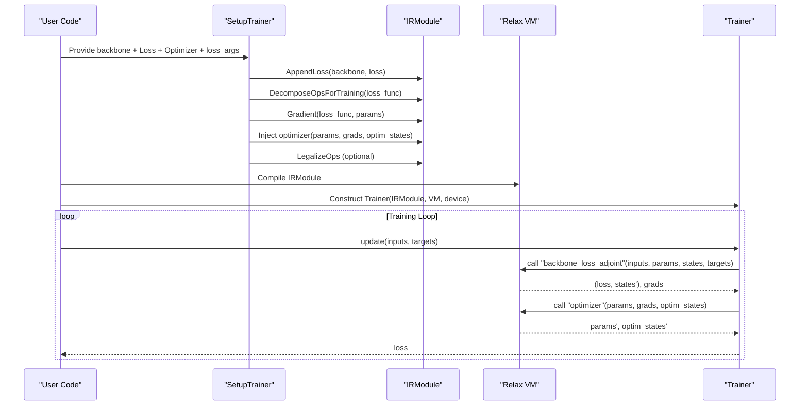
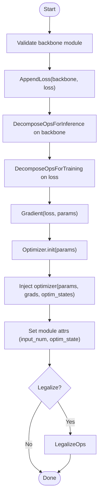
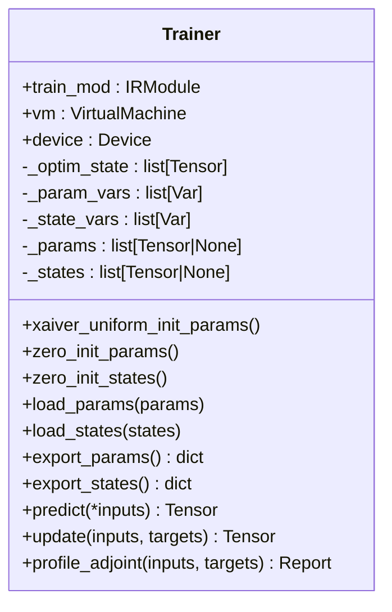
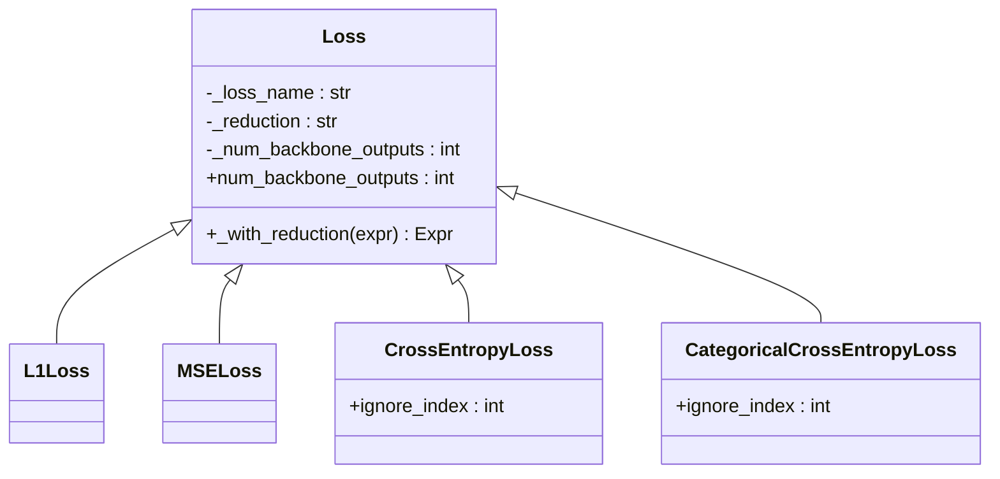
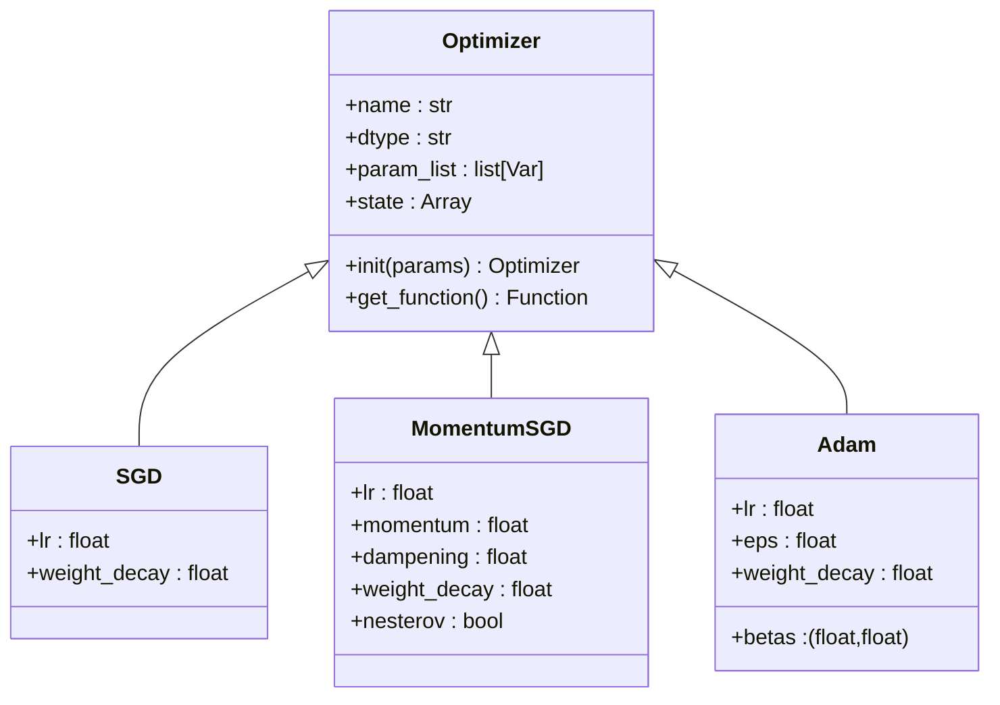
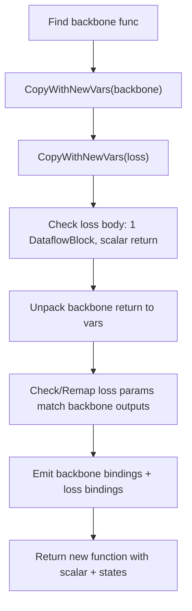
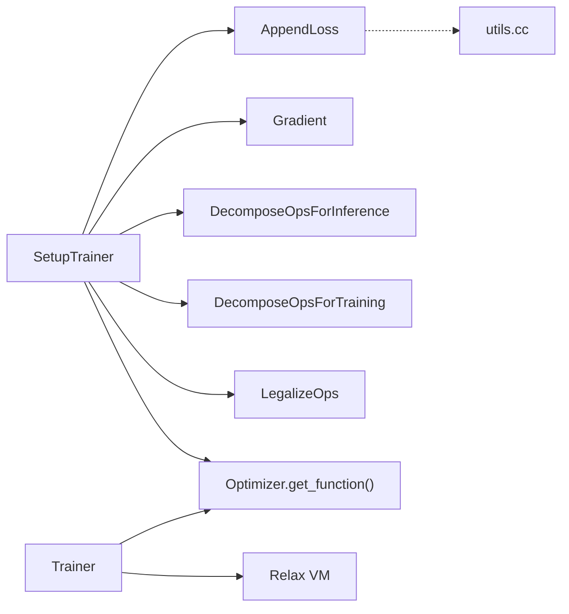

# Training Utilities and Workflows

<cite>
**Referenced Files in This Document**
- [setup_trainer.py](file://python/tvm/relax/training/setup_trainer.py)
- [trainer.py](file://python/tvm/relax/training/trainer.py)
- [loss.py](file://python/tvm/relax/training/loss.py)
- [optimizer.py](file://python/tvm/relax/training/optimizer.py)
- [utils.py](file://python/tvm/relax/training/utils.py)
- [utils.cc](file://src/relax/training/utils.cc)
- [utils.h](file://src/relax/training/utils.h)
- [test_training_setup_trainer.py](file://tests/python/relax/test_training_setup_trainer.py)
- [test_training_trainer_numeric.py](file://tests/python/relax/test_training_trainer_numeric.py)
- [test_training_append_loss.py](file://tests/python/relax/test_training_append_loss.py)
- [test_training_loss.py](file://tests/python/relax/test_training_loss.py)
- [test_training_optimizer.py](file://tests/python/relax/test_training_optimizer.py)
- [test_training_optimizer_numeric.py](file://tests/python/relax/test_training_optimizer_numeric.py)
</cite>

## Table of Contents
1. [Introduction](#introduction)
2. [Project Structure](#project-structure)
3. [Core Components](#core-components)
4. [Architecture Overview](#architecture-overview)
5. [Detailed Component Analysis](#detailed-component-analysis)
6. [Dependency Analysis](#dependency-analysis)
7. [Performance Considerations](#performance-considerations)
8. [Troubleshooting Guide](#troubleshooting-guide)
9. [Conclusion](#conclusion)
10. [Appendices](#appendices)

## Introduction
This document explains TVM’s Relax-based training utilities and end-to-end training workflows. It covers the trainer framework, optimizer integration, loss function support, training loop management, gradient computation, parameter updates, and model checkpointing. It also outlines integration points for distributed training, mixed precision training, and quantization-aware training. Practical examples, extension mechanisms, and guidance for debugging and performance optimization are included to help researchers and practitioners implement advanced training methodologies.

## Project Structure
The training subsystem resides under python/tvm/relax/training and is composed of:
- SetupTrainer: transforms a backbone module into a complete trainer module by appending loss, decomposing ops, computing gradients, and injecting an optimizer function.
- Trainer: a Python wrapper around the compiled Relax VM to manage parameters, states, and optimizer states, and to run predict/update/profile cycles.
- Loss: a library of loss functions (L1, MSE, CrossEntropy, CategoricalCrossEntropy) with reduction semantics.
- Optimizer: abstractions and concrete optimizers (SGD, MomentumSGD, Adam) generating Relax optimizer functions and maintaining states.
- Utils: passes and helpers (AppendLoss, TE gradient registration) and C++ implementation of AppendLoss.

**Diagram sources**
- [setup_trainer.py:34-213](file://python/tvm/relax/training/setup_trainer.py#L34-L213)
- [trainer.py:28-396](file://python/tvm/relax/training/trainer.py#L28-L396)
- [loss.py:43-383](file://python/tvm/relax/training/loss.py#L43-L383)
- [optimizer.py:35-716](file://python/tvm/relax/training/optimizer.py#L35-L716)
- [utils.py:32-161](file://python/tvm/relax/training/utils.py#L32-L161)
- [utils.cc:40-232](file://src/relax/training/utils.cc#L40-L232)

**Section sources**
- [setup_trainer.py:34-213](file://python/tvm/relax/training/setup_trainer.py#L34-L213)
- [trainer.py:28-396](file://python/tvm/relax/training/trainer.py#L28-L396)
- [loss.py:43-383](file://python/tvm/relax/training/loss.py#L43-L383)
- [optimizer.py:35-716](file://python/tvm/relax/training/optimizer.py#L35-L716)
- [utils.py:32-161](file://python/tvm/relax/training/utils.py#L32-L161)
- [utils.cc:40-232](file://src/relax/training/utils.cc#L40-L232)

## Core Components
- SetupTrainer: Validates backbone module structure, appends loss via AppendLoss, decomposes ops for training/inference, computes gradients, injects optimizer function, and optionally legalizes the module.
- Trainer: Manages parameters, states, and optimizer states; supports initialization, parameter/state loading/export, prediction, training update, and profiling.
- Loss: Provides callable Relax functions for common losses with configurable reductions.
- Optimizer: Generates Relax optimizer functions and manages optimizer-specific states.
- AppendLoss: A pass that merges backbone and loss into a single dataflow function.

Key responsibilities and interactions are demonstrated in the tests for setup and numeric training workflows.

**Section sources**
- [setup_trainer.py:34-213](file://python/tvm/relax/training/setup_trainer.py#L34-L213)
- [trainer.py:28-396](file://python/tvm/relax/training/trainer.py#L28-L396)
- [loss.py:43-383](file://python/tvm/relax/training/loss.py#L43-L383)
- [optimizer.py:35-716](file://python/tvm/relax/training/optimizer.py#L35-L716)
- [utils.py:32-161](file://python/tvm/relax/training/utils.py#L32-L161)
- [test_training_setup_trainer.py:31-233](file://tests/python/relax/test_training_setup_trainer.py#L31-L233)
- [test_training_trainer_numeric.py:82-171](file://tests/python/relax/test_training_trainer_numeric.py#L82-L171)

## Architecture Overview
The training workflow converts a “backbone” module into a trainer module and executes training loops through the Trainer wrapper.

**Diagram sources**
- [setup_trainer.py:172-213](file://python/tvm/relax/training/setup_trainer.py#L172-L213)
- [trainer.py:290-350](file://python/tvm/relax/training/trainer.py#L290-L350)
- [utils.py:32-161](file://python/tvm/relax/training/utils.py#L32-L161)

## Detailed Component Analysis

### SetupTrainer
- Purpose: Transform a well-formed backbone module into a trainer module by appending loss, decomposing ops, computing gradients, injecting optimizer, and optionally legalizing.
- Validation: Ensures the backbone function exists, has required attributes (param_num, state_num), and returns expected structure.
- Transformation pipeline:
  - AppendLoss: merges backbone and loss into a single dataflow function.
  - DecomposeOpsForInference/DecomposeOpsForTraining: prepares ops for inference vs. training.
  - Gradient: computes gradients wrt parameters.
  - Inject optimizer: adds optimizer function with global symbol and initial states.
  - LegalizeOps: lowers Relax ops to TIR.

**Diagram sources**
- [setup_trainer.py:172-213](file://python/tvm/relax/training/setup_trainer.py#L172-L213)

**Section sources**
- [setup_trainer.py:128-213](file://python/tvm/relax/training/setup_trainer.py#L128-L213)
- [test_training_setup_trainer.py:31-233](file://tests/python/relax/test_training_setup_trainer.py#L31-L233)

### Trainer
- Purpose: Unified Python API to run compiled trainer modules.
- Responsibilities:
  - Manage parameters, states, and optimizer states.
  - Initialize via zero/Xavier uniform or load from external arrays/dicts.
  - Export parameters/states for checkpointing.
  - Run predict and update cycles.
  - Profile the adjoint function for performance insights.

**Diagram sources**
- [trainer.py:28-396](file://python/tvm/relax/training/trainer.py#L28-L396)

**Section sources**
- [trainer.py:76-396](file://python/tvm/relax/training/trainer.py#L76-L396)
- [test_training_trainer_numeric.py:82-171](file://tests/python/relax/test_training_trainer_numeric.py#L82-L171)

### Loss Functions
- Base class supports configurable reduction (“mean”, “sum”, “none”) and exposes num_backbone_outputs.
- Provided losses:
  - L1Loss
  - MSELoss
  - CrossEntropyLoss (with optional ignore_index and weights)
  - CategoricalCrossEntropyLoss (supports one-hot targets and optional ignore_index)

**Diagram sources**
- [loss.py:43-383](file://python/tvm/relax/training/loss.py#L43-L383)

**Section sources**
- [loss.py:43-383](file://python/tvm/relax/training/loss.py#L43-L383)
- [test_training_loss.py:1-200](file://tests/python/relax/test_training_loss.py#L1-L200)

### Optimizers
- Optimizer base class defines interface for init (params, dtype, state) and get_function (returns Relax function updating params and states).
- Concrete optimizers:
  - SGD: supports learning rate and weight decay; tracks step count.
  - MomentumSGD: supports momentum, dampening, Nesterov, weight decay; tracks per-parameter velocities.
  - Adam: supports betas, epsilon, weight decay; tracks step count, beta products, first/second moments.

**Diagram sources**
- [optimizer.py:35-716](file://python/tvm/relax/training/optimizer.py#L35-L716)

**Section sources**
- [optimizer.py:113-716](file://python/tvm/relax/training/optimizer.py#L113-L716)
- [test_training_optimizer.py:1-200](file://tests/python/relax/test_training_optimizer.py#L1-L200)
- [test_training_optimizer_numeric.py:1-200](file://tests/python/relax/test_training_optimizer_numeric.py#L1-L200)

### AppendLoss Pass
- Purpose: Merge backbone and loss into a single dataflow function with strict structural checks.
- Behavior: Copies backbone and loss functions, remaps backbone outputs to loss inputs, concatenates bindings, and returns a new function with a scalar return.

**Diagram sources**
- [utils.cc:40-232](file://src/relax/training/utils.cc#L40-L232)
- [utils.py:32-161](file://python/tvm/relax/training/utils.py#L32-L161)

**Section sources**
- [utils.cc:40-232](file://src/relax/training/utils.cc#L40-L232)
- [utils.py:32-161](file://python/tvm/relax/training/utils.py#L32-L161)
- [test_training_append_loss.py:1-200](file://tests/python/relax/test_training_append_loss.py#L1-L200)

## Dependency Analysis
- SetupTrainer depends on:
  - AppendLoss (Python wrapper to C++ pass)
  - DecomposeOpsForInference/DecomposeOpsForTraining
  - Gradient transform
  - Optimizer.get_function()
  - LegalizeOps
- Trainer depends on:
  - Compiled IRModule and Relax VM
  - Optimizer function for parameter updates
- Loss and Optimizer are independent libraries used by SetupTrainer.

**Diagram sources**
- [setup_trainer.py:172-213](file://python/tvm/relax/training/setup_trainer.py#L172-L213)
- [utils.py:32-161](file://python/tvm/relax/training/utils.py#L32-L161)
- [utils.cc:209-232](file://src/relax/training/utils.cc#L209-L232)
- [trainer.py:290-350](file://python/tvm/relax/training/trainer.py#L290-L350)

**Section sources**
- [setup_trainer.py:172-213](file://python/tvm/relax/training/setup_trainer.py#L172-L213)
- [trainer.py:290-350](file://python/tvm/relax/training/trainer.py#L290-L350)

## Performance Considerations
- Mixed Precision Training:
  - Adjust dtypes of parameters and tensors to float16/float32 as supported by the optimizer and operators. Ensure operators support the chosen dtypes.
- Gradient Memory:
  - Use gradient checkpointing transforms to reduce activation memory during backward passes.
- Operator Decomposition:
  - DecomposeOpsForTraining/Inference ensures correct operator behavior during training vs. inference, potentially affecting performance.
- Legalization:
  - LegalizeOps lowers Relax ops to TIR; consider enabling only when necessary to avoid extra lowering overhead.
- Profiling:
  - Use Trainer.profile_adjoint to collect runtime reports and identify bottlenecks.

[No sources needed since this section provides general guidance]

## Troubleshooting Guide
Common issues and resolutions:
- Initialization Errors:
  - Trainer raises errors if parameters or states are uninitialized before predict/update. Initialize via zero/Xavier or load externally.
- Shape/Static Shape Requirements:
  - Parameter/state initialization requires static shapes. Ensure shapes are known at compile time.
- Module Validation:
  - SetupTrainer validates backbone module structure and attributes. Ensure backbone has param_num and state_num attributes and a function named backbone.
- Loss Argument Mismatch:
  - Ensure loss_args match the number of backbone outputs and dtypes.
- Optimizer State Consistency:
  - Ensure optimizer states are preserved across iterations and match the optimizer’s state layout.

**Section sources**
- [trainer.py:242-257](file://python/tvm/relax/training/trainer.py#L242-L257)
- [trainer.py:140-153](file://python/tvm/relax/training/trainer.py#L140-L153)
- [setup_trainer.py:128-171](file://python/tvm/relax/training/setup_trainer.py#L128-L171)
- [test_training_trainer_numeric.py:146-168](file://tests/python/relax/test_training_trainer_numeric.py#L146-L168)

## Conclusion
TVM’s Relax training utilities provide a structured, composable framework for building end-to-end training workflows. SetupTrainer automates the transformation of a backbone module into a trainer module, while Trainer offers a convenient Python interface for initialization, training, and profiling. Loss and optimizer libraries enable flexible configuration of training objectives and optimization strategies. The system integrates with Relax transformations for gradient computation and operator decomposition, and supports extension points for custom losses, optimizers, and gradient handlers.

[No sources needed since this section summarizes without analyzing specific files]

## Appendices

### Practical Examples and Recipes
- End-to-End Training Workflow:
  - Build a backbone module with param_num and state_num attributes and a backbone function.
  - Instantiate a Loss and an Optimizer.
  - Call SetupTrainer to produce a trainer module.
  - Compile with target and construct Relax VM.
  - Wrap with Trainer, initialize parameters, iterate update() with batches, and export checkpoints via export_params().
- Configuring Optimizers and Schedulers:
  - Choose SGD/MomentumSGD/Adam and set hyperparameters.
  - For warmup/scheduling, implement a custom scheduler by modifying optimizer states or by wrapping Trainer.update() to adjust hyperparameters between epochs.
- Monitoring Training Progress:
  - Use Trainer.profile_adjoint to inspect operator-level performance.
  - Track loss values returned by update() and periodically export checkpoints.

**Section sources**
- [test_training_setup_trainer.py:31-233](file://tests/python/relax/test_training_setup_trainer.py#L31-L233)
- [test_training_trainer_numeric.py:82-171](file://tests/python/relax/test_training_trainer_numeric.py#L82-L171)

### Extension Mechanisms
- Adding a Custom Loss:
  - Subclass Loss, implement __call__ to return a Relax function computing the scalar loss with reduction applied.
  - Use AppendLoss to attach it to the backbone.
- Adding a Custom Optimizer:
  - Subclass Optimizer, implement init() to set dtype and initial state, and get_function() to return a Relax function updating parameters and states.
  - Inject into the trainer module via SetupTrainer.
- Registering Custom Gradients:
  - Use register_te_gradient to bind a TE gradient function for custom TIR ops referenced by call_tir_with_grad.

**Section sources**
- [loss.py:43-121](file://python/tvm/relax/training/loss.py#L43-L121)
- [optimizer.py:107-227](file://python/tvm/relax/training/optimizer.py#L107-L227)
- [utils.py:163-207](file://python/tvm/relax/training/utils.py#L163-L207)

### Distributed, Mixed Precision, and Quantization-Aware Training
- Distributed Training:
  - Use TVM’s distributed Relax infrastructure to run compiled trainer modules across devices/nodes. Coordinate parameter synchronization and gradient reduction at the application level.
- Mixed Precision Training:
  - Select appropriate dtypes for parameters and tensors; ensure operators support the chosen dtypes. Use optimizer dtypes consistent with the parameter dtypes.
- Quantization-Aware Training:
  - Incorporate quantized operators and dequantization steps into the backbone. Use gradient checkpointing to manage memory for large quantized models.

[No sources needed since this section provides general guidance]