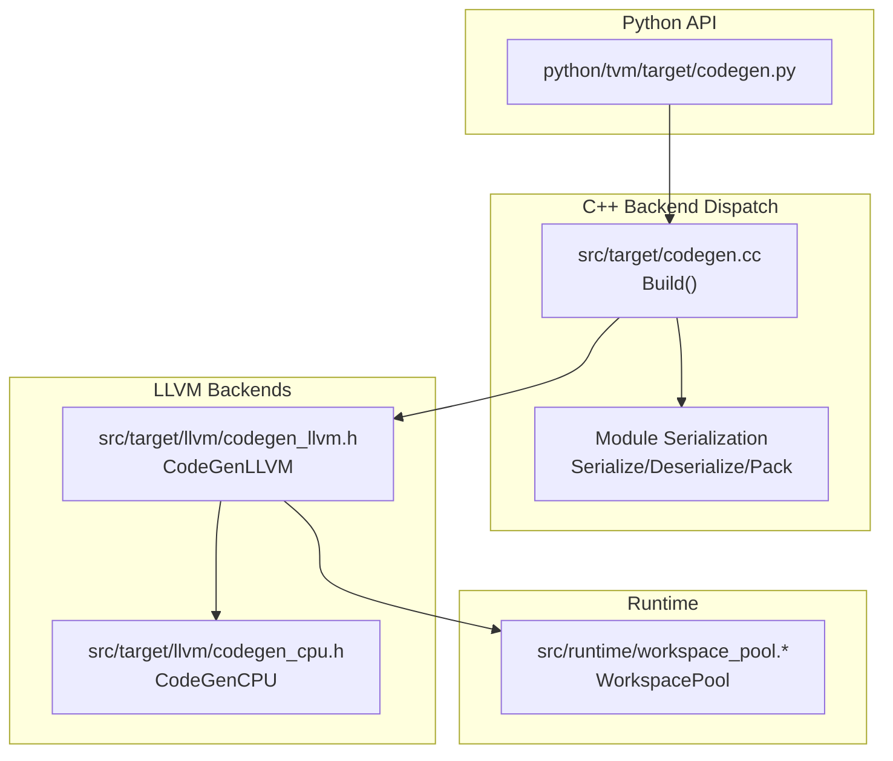
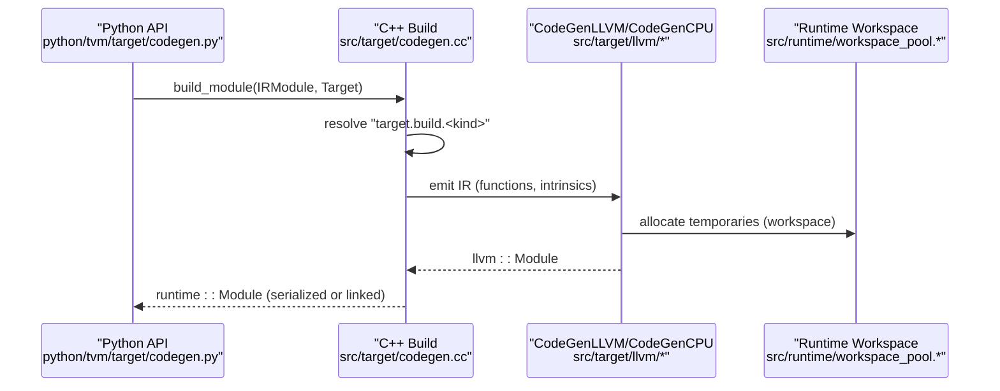
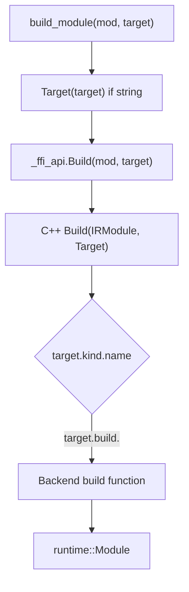
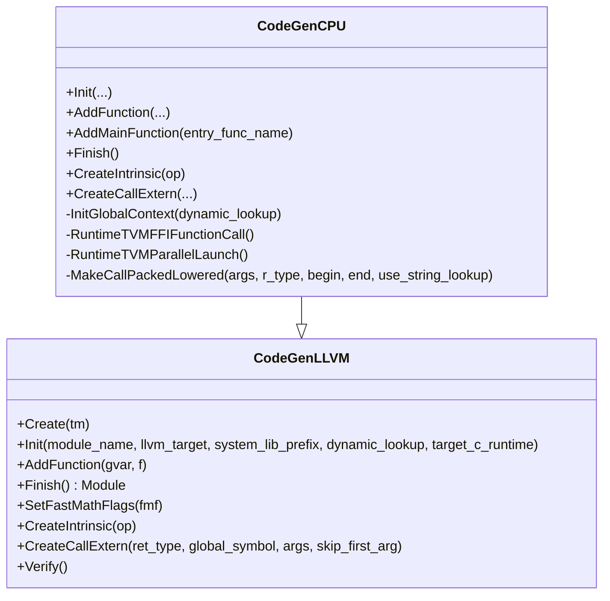
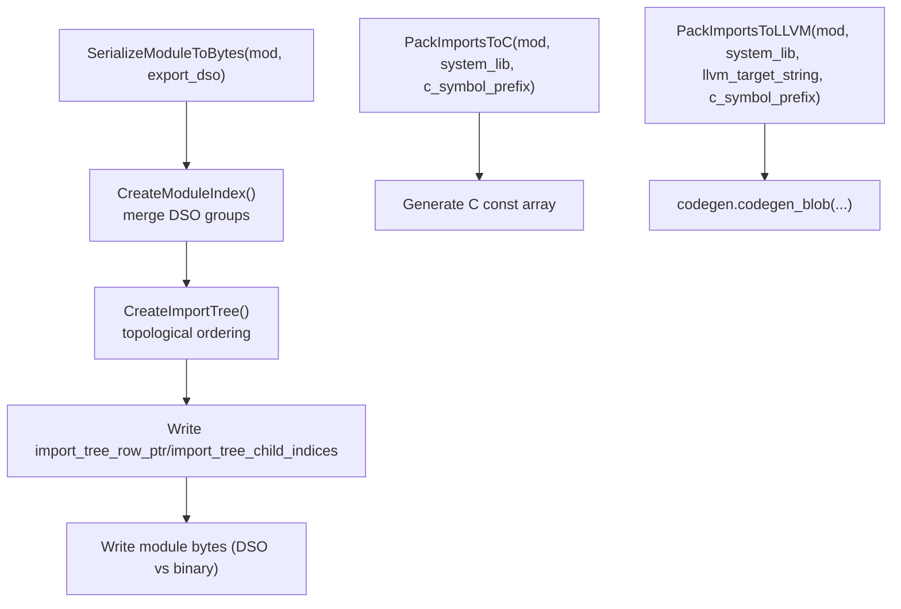
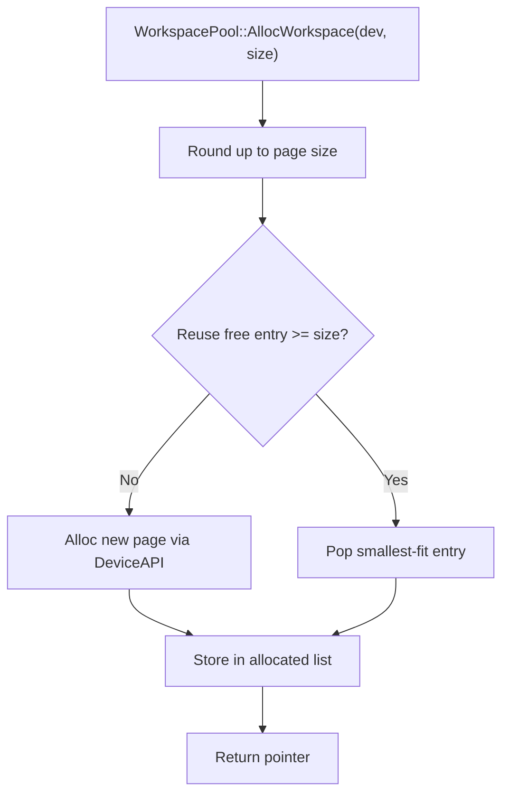
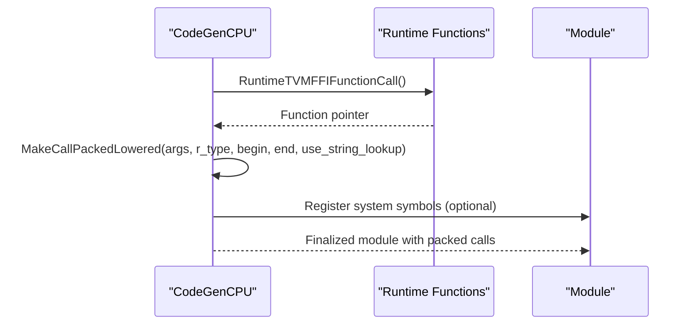
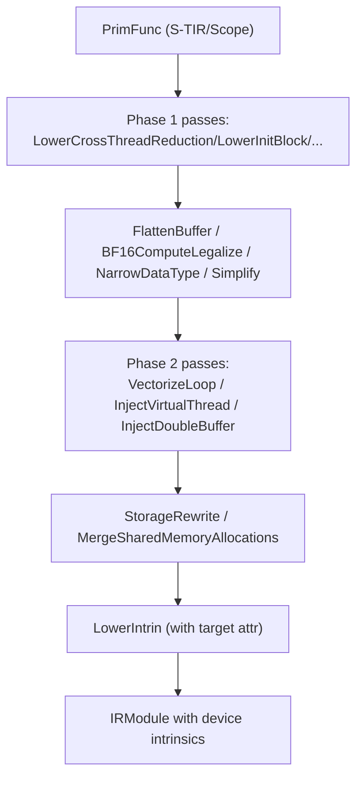
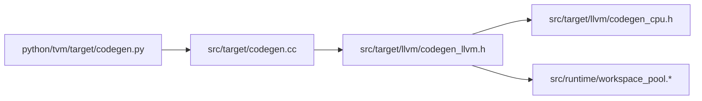

# Code Generation

<cite>
**Referenced Files in This Document**
- [src/target/codegen.cc](file://src/target/codegen.cc)
- [include/tvm/target/codegen.h](file://include/tvm/target/codegen.h)
- [python/tvm/target/codegen.py](file://python/tvm/target/codegen.py)
- [src/target/llvm/codegen_llvm.h](file://src/target/llvm/codegen_llvm.h)
- [src/target/llvm/codegen_cpu.h](file://src/target/llvm/codegen_cpu.h)
- [src/runtime/workspace_pool.h](file://src/runtime/workspace_pool.h)
- [src/runtime/workspace_pool.cc](file://src/runtime/workspace_pool.cc)
- [src/s_tir/meta_schedule/postproc/verify_gpu_code.cc](file://src/s_tir/meta_schedule/postproc/verify_gpu_code.cc)
- [tests/cpp/llvm_codegen_registry_test.cc](file://tests/cpp/llvm_codegen_registry_test.cc)
- [docs/arch/codegen.rst](file://docs/arch/codegen.rst)
</cite>

## Table of Contents
1. [Introduction](#introduction)
2. [Project Structure](#project-structure)
3. [Core Components](#core-components)
4. [Architecture Overview](#architecture-overview)
5. [Detailed Component Analysis](#detailed-component-analysis)
6. [Dependency Analysis](#dependency-analysis)
7. [Performance Considerations](#performance-considerations)
8. [Troubleshooting Guide](#troubleshooting-guide)
9. [Conclusion](#conclusion)

## Introduction
This document explains TVM’s code generation system: how high-level IR is transformed into target-specific executable code. It covers the lowering pipeline, intrinsic lowering, packed API generation, storage allocation, and memory management. It also describes how the system integrates with external code generators, how different hardware backends are supported, and how to debug and optimize generated code.

## Project Structure
At a high level, TVM’s code generation spans:
- Python API surface for building modules and inspecting target capabilities
- C++ backend dispatch and module serialization
- LLVM-based code generation for CPU/GPU-like targets
- Runtime workspace management for temporary allocations
- S-TIR passes for GPU-specific lowering and storage rewriting

**Diagram sources**
- [python/tvm/target/codegen.py:24-42](file://python/tvm/target/codegen.py#L24-L42)
- [src/target/codegen.cc:47-59](file://src/target/codegen.cc#L47-L59)
- [src/target/llvm/codegen_llvm.h:94-148](file://src/target/llvm/codegen_llvm.h#L94-L148)
- [src/target/llvm/codegen_cpu.h:62-72](file://src/target/llvm/codegen_cpu.h#L62-L72)
- [src/runtime/workspace_pool.h:45-67](file://src/runtime/workspace_pool.h#L45-L67)

**Section sources**
- [python/tvm/target/codegen.py:24-42](file://python/tvm/target/codegen.py#L24-L42)
- [src/target/codegen.cc:47-59](file://src/target/codegen.cc#L47-L59)
- [include/tvm/target/codegen.h:42-94](file://include/tvm/target/codegen.h#L42-L94)

## Core Components
- Target build entrypoint: Python calls into C++ to dispatch to the correct backend based on Target.
- Backend dispatch: The C++ Build function resolves target.kind.name to a registered “target.build.<kind>” function.
- LLVM code generation: Base classes for emitting LLVM IR, with CPU specialization for packed API and runtime integration.
- Module packaging: Serialization and packing of imports into C/LLVM for embedding or linking.
- Workspace management: Runtime pool for temporary allocations aligned to device pages.

Key responsibilities:
- Transform IRModule to backend-specific artifacts
- Lower high-level constructs to intrinsics and device-specific calls
- Generate packed function wrappers and system library registration
- Manage storage allocation and aliasing for correctness and performance

**Section sources**
- [src/target/codegen.cc:47-59](file://src/target/codegen.cc#L47-L59)
- [include/tvm/target/codegen.h:42-94](file://include/tvm/target/codegen.h#L42-L94)
- [src/target/llvm/codegen_llvm.h:94-148](file://src/target/llvm/codegen_llvm.h#L94-L148)
- [src/runtime/workspace_pool.h:45-67](file://src/runtime/workspace_pool.h#L45-L67)

## Architecture Overview
The code generation pipeline proceeds from Python to C++ and then to backend-specific generators. The Python API exposes convenience functions for building modules and querying target capabilities. The C++ Build function dispatches to the appropriate backend. For LLVM-based targets, CodeGenLLVM and CodeGenCPU emit IR and link-time optimizations. Modules can be serialized or embedded as C/LLVM.

**Diagram sources**
- [python/tvm/target/codegen.py:24-42](file://python/tvm/target/codegen.py#L24-L42)
- [src/target/codegen.cc:47-59](file://src/target/codegen.cc#L47-L59)
- [src/target/llvm/codegen_llvm.h:94-148](file://src/target/llvm/codegen_llvm.h#L94-L148)
- [src/runtime/workspace_pool.cc:46-75](file://src/runtime/workspace_pool.cc#L46-L75)

## Detailed Component Analysis

### Target Build and Dispatch
- Python build_module wraps the C++ Build function and returns a runtime::Module.
- Build resolves the target kind and calls the registered “target.build.<kind>” function.
- The Python module also exposes helpers for LLVM target introspection and vector width queries.

**Diagram sources**
- [python/tvm/target/codegen.py:24-42](file://python/tvm/target/codegen.py#L24-L42)
- [src/target/codegen.cc:47-59](file://src/target/codegen.cc#L47-L59)

**Section sources**
- [python/tvm/target/codegen.py:24-42](file://python/tvm/target/codegen.py#L24-L42)
- [src/target/codegen.cc:47-59](file://src/target/codegen.cc#L47-L59)
- [docs/arch/codegen.rst:64-83](file://docs/arch/codegen.rst#L64-L83)

### LLVM Code Generation Base Classes
- CodeGenLLVM is the base for emitting LLVM IR from TVM IR. It handles expressions, statements, intrinsics, and function emission. It supports debug info, fast math flags, and target attributes.
- CodeGenCPU extends CodeGenLLVM to integrate with TVM’s packed API, parallel launch, and system library registration. It builds runtime function signatures and manages closure packing/unpacking.

**Diagram sources**
- [src/target/llvm/codegen_llvm.h:94-148](file://src/target/llvm/codegen_llvm.h#L94-L148)
- [src/target/llvm/codegen_cpu.h:62-72](file://src/target/llvm/codegen_cpu.h#L62-L72)
- [src/target/llvm/codegen_cpu.h:140-144](file://src/target/llvm/codegen_cpu.h#L140-L144)

**Section sources**
- [src/target/llvm/codegen_llvm.h:94-148](file://src/target/llvm/codegen_llvm.h#L94-L148)
- [src/target/llvm/codegen_cpu.h:62-72](file://src/target/llvm/codegen_cpu.h#L62-L72)
- [src/target/llvm/codegen_cpu.h:115-156](file://src/target/llvm/codegen_cpu.h#L115-L156)

### Module Serialization and Embedding
- Module serialization packs the import tree and module groups, supporting DSO exportable modules and binary serialization.
- Packing to C/LLVM embeds the module blob into generated code for system libraries.

**Diagram sources**
- [src/target/codegen.cc:62-224](file://src/target/codegen.cc#L62-L224)
- [src/target/codegen.cc:283-344](file://src/target/codegen.cc#L283-L344)

**Section sources**
- [src/target/codegen.cc:62-224](file://src/target/codegen.cc#L62-L224)
- [src/target/codegen.cc:283-344](file://src/target/codegen.cc#L283-L344)

### Memory Management and Storage Allocation
- WorkspacePool manages temporary allocations aligned to device page boundaries, minimizing fragmentation and enabling reuse across runs.
- CodeGenLLVM tracks storage alignment and provides helpers for buffer access and vectorization.

**Diagram sources**
- [src/runtime/workspace_pool.cc:46-75](file://src/runtime/workspace_pool.cc#L46-L75)
- [src/runtime/workspace_pool.h:45-67](file://src/runtime/workspace_pool.h#L45-L67)

**Section sources**
- [src/runtime/workspace_pool.cc:46-75](file://src/runtime/workspace_pool.cc#L46-L75)
- [src/runtime/workspace_pool.h:45-67](file://src/runtime/workspace_pool.h#L45-L67)
- [src/target/llvm/codegen_llvm.h:452-459](file://src/target/llvm/codegen_llvm.h#L452-L459)

### Intrinsic Lowering and Packed API Generation
- CodeGenCPU integrates with TVM’s packed API by generating calls into runtime functions and managing closure data for higher-order functions.
- Tests demonstrate the availability of target-specific code generator factories and LLVM intrinsic lookups.

**Diagram sources**
- [src/target/llvm/codegen_cpu.h:115-156](file://src/target/llvm/codegen_cpu.h#L115-L156)
- [tests/cpp/llvm_codegen_registry_test.cc:34-62](file://tests/cpp/llvm_codegen_registry_test.cc#L34-L62)

**Section sources**
- [src/target/llvm/codegen_cpu.h:115-156](file://src/target/llvm/codegen_cpu.h#L115-L156)
- [tests/cpp/llvm_codegen_registry_test.cc:34-62](file://tests/cpp/llvm_codegen_registry_test.cc#L34-L62)

### GPU-Specific Lowering and Storage Rewriting
- S-TIR passes lower high-level blocks and buffers for GPU execution, including vectorization, double buffering, and shared-memory allocation merging.
- LowerIntrin is applied with the target attribute to emit device-specific intrinsics.

**Diagram sources**
- [src/s_tir/meta_schedule/postproc/verify_gpu_code.cc:148-191](file://src/s_tir/meta_schedule/postproc/verify_gpu_code.cc#L148-L191)

**Section sources**
- [src/s_tir/meta_schedule/postproc/verify_gpu_code.cc:148-191](file://src/s_tir/meta_schedule/postproc/verify_gpu_code.cc#L148-L191)

## Dependency Analysis
- Python API depends on C++ FFI bindings to call Build and serialization routines.
- Build dispatch relies on target.kind.name resolution to a backend build function.
- LLVM backends depend on LLVMTarget and runtime types; CodeGenCPU additionally depends on runtime function signatures and system library registration.
- WorkspacePool depends on DeviceAPI for allocation and alignment.

**Diagram sources**
- [python/tvm/target/codegen.py:24-42](file://python/tvm/target/codegen.py#L24-L42)
- [src/target/codegen.cc:47-59](file://src/target/codegen.cc#L47-L59)
- [src/target/llvm/codegen_llvm.h:94-148](file://src/target/llvm/codegen_llvm.h#L94-L148)
- [src/runtime/workspace_pool.h:45-67](file://src/runtime/workspace_pool.h#L45-L67)

**Section sources**
- [python/tvm/target/codegen.py:24-42](file://python/tvm/target/codegen.py#L24-L42)
- [src/target/codegen.cc:47-59](file://src/target/codegen.cc#L47-L59)
- [src/target/llvm/codegen_llvm.h:94-148](file://src/target/llvm/codegen_llvm.h#L94-L148)
- [src/runtime/workspace_pool.h:45-67](file://src/runtime/workspace_pool.h#L45-L67)

## Performance Considerations
- Vectorization and data-type narrowing reduce register pressure and improve throughput on GPUs.
- Double buffering and virtual threads increase occupancy and hide latency.
- Storage rewriting and shared-memory allocation merging reduce bandwidth and improve locality.
- Workspace pooling reduces allocation overhead and improves cache locality across runs.
- Fast math flags and target attributes enable backend-specific optimizations.

[No sources needed since this section provides general guidance]

## Troubleshooting Guide
- If a target kind lacks a build function, Build raises an error indicating the missing “target.build.<kind>”. Ensure the backend is enabled and registered.
- For LLVM-based targets, verify that the target-specific code generator factory exists and returns a valid generator instance.
- When debugging generated code, use CodeGenLLVM’s debug info emission and printf helpers to trace execution and return addresses.
- For GPU kernels, confirm that LowerIntrin is applied with the correct target attribute and that storage rewrites are performed before intrinsic lowering.

**Section sources**
- [src/target/codegen.cc:47-59](file://src/target/codegen.cc#L47-L59)
- [tests/cpp/llvm_codegen_registry_test.cc:34-62](file://tests/cpp/llvm_codegen_registry_test.cc#L34-L62)
- [src/target/llvm/codegen_llvm.h:290-307](file://src/target/llvm/codegen_llvm.h#L290-L307)

## Conclusion
TVM’s code generation system transforms high-level IR into efficient, target-specific executables through a clean separation of concerns: Python API, backend dispatch, LLVM-based IR emission, and runtime integration. The pipeline supports device-specific optimizations, packed API generation, and robust memory management. By leveraging S-TIR passes and LLVM backends, TVM enables portable and high-performance code generation across diverse hardware architectures.