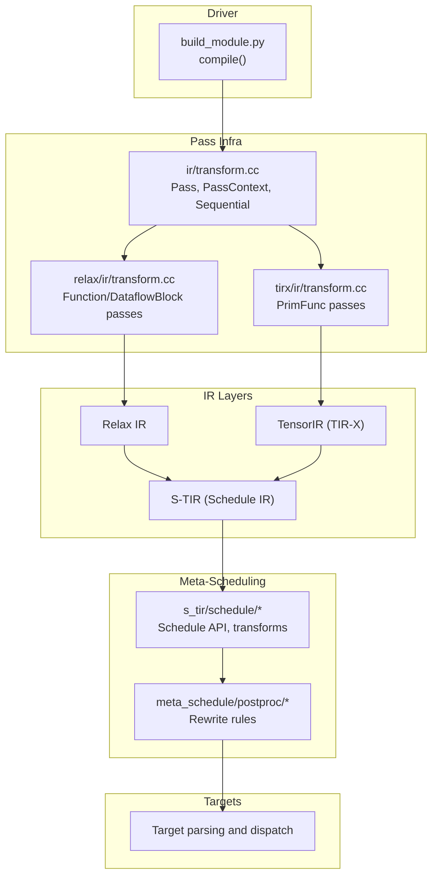
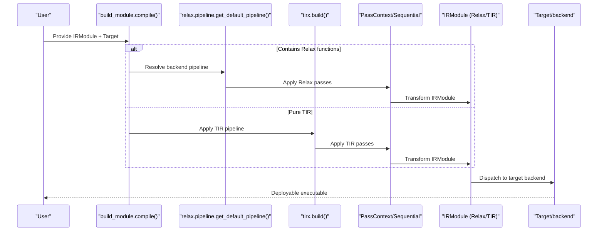
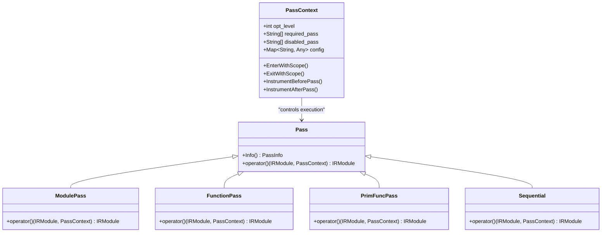
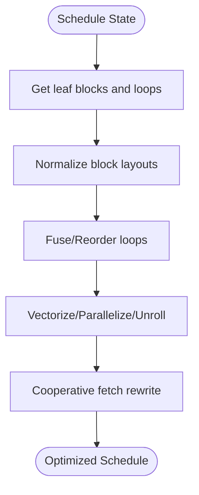
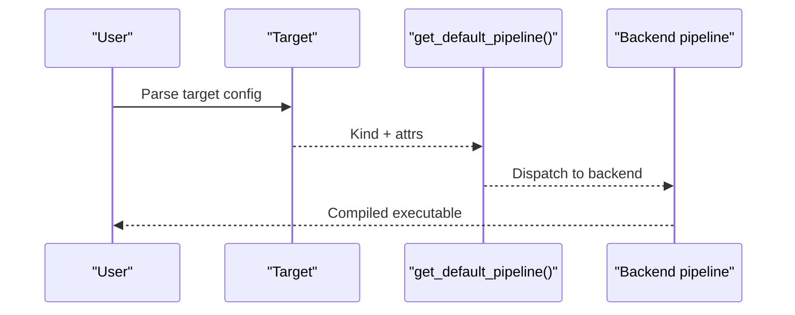
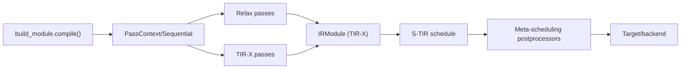

# Compilation Pipeline

<cite>
**Referenced Files in This Document**
- [build_module.py](file://python/tvm/driver/build_module.py)
- [transform.cc](file://src/ir/transform.cc)
- [transform.cc](file://src/relax/ir/transform.cc)
- [transform.cc](file://src/tirx/ir/transform.cc)
- [transform.cc](file://src/s_tir/schedule/transform.cc)
- [pass_infra.rst](file://docs/arch/pass_infra.rst)
- [pipeline.py](file://python/tvm/relax/pipeline.py)
- [import_model.py](file://docs/how_to/tutorials/import_model.py)
- [target_test.cc](file://tests/cpp/target_test.cc)
- [concrete_schedule.h](file://src/s_tir/schedule/concrete_schedule.h)
- [concrete_schedule.cc](file://src/s_tir/schedule/concrete_schedule.cc)
- [traced_schedule.h](file://src/s_tir/schedule/traced_schedule.h)
- [rewrite_parallel_vectorize_unroll.cc](file://src/s_tir/meta_schedule/postproc/rewrite_parallel_vectorize_unroll.cc)
- [rewrite_cooperative_fetch.cc](file://src/s_tir/meta_schedule/postproc/rewrite_cooperative_fetch.cc)
- [compute_inline.cc](file://src/s_tir/schedule/primitive/compute_inline.cc)
</cite>

## Table of Contents
1. [Introduction](#introduction)
2. [Project Structure](#project-structure)
3. [Core Components](#core-components)
4. [Architecture Overview](#architecture-overview)
5. [Detailed Component Analysis](#detailed-component-analysis)
6. [Dependency Analysis](#dependency-analysis)
7. [Performance Considerations](#performance-considerations)
8. [Troubleshooting Guide](#troubleshooting-guide)
9. [Conclusion](#conclusion)
10. [Appendices](#appendices)

## Introduction
This document explains TVM’s end-to-end compilation pipeline from model import through optimization to code generation and deployment. It covers:
- Model import/export frontends and IR conversion
- Optimization passes across IR layers (Relax, TensorIR, S-TIR)
- Scheduling and transformation primitives
- Target-specific code generation and deployment
- Pass infrastructure, transformation rules, and scheduling system
- Memory optimization, fusion strategies, and performance tuning
- Debugging, profiling, and troubleshooting
- Extending the pipeline with custom passes and optimizations

## Project Structure
At a high level, TVM’s compilation pipeline spans:
- Driver entry points for building executables
- Pass infrastructure for module/function-level transformations
- IR layers: Relax (high-level), TensorIR (low-level), S-TIR (schedule IR)
- Meta-scheduling and postprocessing for target-specific transformations
- Target configuration and backend dispatch

**Diagram sources**
- [build_module.py:72-113](file://python/tvm/driver/build_module.py#L72-L113)
- [transform.cc:428-488](file://src/ir/transform.cc#L428-L488)
- [transform.cc:109-138](file://src/relax/ir/transform.cc#L109-L138)
- [transform.cc:109-138](file://src/tirx/ir/transform.cc#L109-L138)
- [transform.cc:1-560](file://src/s_tir/schedule/transform.cc#L1-560)
- [rewrite_parallel_vectorize_unroll.cc:243-278](file://src/s_tir/meta_schedule/postproc/rewrite_parallel_vectorize_unroll.cc#L243-L278)
- [rewrite_cooperative_fetch.cc:183-209](file://src/s_tir/meta_schedule/postproc/rewrite_cooperative_fetch.cc#L183-L209)

**Section sources**
- [build_module.py:72-113](file://python/tvm/driver/build_module.py#L72-L113)
- [transform.cc:428-488](file://src/ir/transform.cc#L428-L488)
- [transform.cc:109-138](file://src/relax/ir/transform.cc#L109-L138)
- [transform.cc:109-138](file://src/tirx/ir/transform.cc#L109-L138)
- [transform.cc:1-560](file://src/s_tir/schedule/transform.cc#L1-560)

## Core Components
- Driver and entry points
  - Unified compile entrypoint routes to Relax or TIR pipelines depending on IR type.
- Pass infrastructure
  - Pass, PassContext, Sequential, ModulePass, FunctionPass, PrimFuncPass define the orchestration and configuration of optimizations.
- IR layers and passes
  - Relax IR: Function/DataflowBlock passes for high-level transformations.
  - TensorIR (TIR-X): PrimFunc passes for low-level IR transformations.
  - S-TIR: Schedule IR with scheduling primitives and transformations.
- Meta-scheduling and postprocessing
  - Rewrite rules for vectorization, parallelization, cooperative fetch, and layout transformations.
- Targets and backends
  - Target parsing and dispatch to backend-specific pipelines.

**Section sources**
- [build_module.py:72-113](file://python/tvm/driver/build_module.py#L72-L113)
- [transform.cc:428-488](file://src/ir/transform.cc#L428-L488)
- [transform.cc:109-138](file://src/relax/ir/transform.cc#L109-L138)
- [transform.cc:109-138](file://src/tirx/ir/transform.cc#L109-L138)
- [transform.cc:1-560](file://src/s_tir/schedule/transform.cc#L1-560)

## Architecture Overview
The pipeline begins with model import into an IRModule (Relax or TIR). The driver selects the appropriate pipeline:
- For Relax modules, the Relax pipeline is applied via backend dispatch.
- For TIR modules, TIR passes are applied directly.

Optimizations are orchestrated by the pass infrastructure, which enforces opt-level gating, required/disabled passes, and instrumentation hooks. Scheduling and meta-scheduling then transform the IR toward target-specific characteristics (parallelization, vectorization, memory access patterns). Finally, target-specific code generation produces deployable artifacts.

**Diagram sources**
- [build_module.py:72-113](file://python/tvm/driver/build_module.py#L72-L113)
- [pipeline.py:330-347](file://python/tvm/relax/pipeline.py#L330-L347)

## Detailed Component Analysis

### Model Import and Export
- Import frontends convert external model formats into TVM IRModules.
- Example: PyTorch’s exported program is imported into Relax IR, then parameters are detached for deployment.
- Export and verification workflows demonstrate end-to-end compilation and runtime comparison.

Practical guidance:
- Prefer PyTorch’s export-based importer for broad operator coverage.
- Detach parameters to separate weights from the graph for efficient runtime loading.

**Section sources**
- [import_model.py:42-407](file://docs/how_to/tutorials/import_model.py#L42-L407)

### Pass Infrastructure and Orchestration
- PassContext controls opt-level gating, required/disabled passes, instrumentation, and diagnostics.
- Sequential composes passes and resolves required prerequisites.
- ModulePass, FunctionPass, DataflowBlockPass, PrimFuncPass operate at different granularity levels.

Key behaviors:
- PassEnabled checks required/disabled lists and opt-level thresholds.
- Instrument hooks allow timing, printing, and dumping IR snapshots.
- Immutable module assertion can be enabled for testing.

**Diagram sources**
- [transform.cc:428-488](file://src/ir/transform.cc#L428-L488)
- [transform.cc:109-138](file://src/relax/ir/transform.cc#L109-L138)
- [transform.cc:109-138](file://src/tirx/ir/transform.cc#L109-L138)

**Section sources**
- [transform.cc:428-488](file://src/ir/transform.cc#L428-L488)
- [pass_infra.rst:54-491](file://docs/arch/pass_infra.rst#L54-L491)

### IR Conversion and Lowering
- Relax IR: High-level neural network computations represented as R.function with TIR calls.
- TIR-X: Low-level imperative loops and buffers; PrimFunc-level passes transform control/dataflow.
- S-TIR: Schedule IR with blocks, loops, and buffer regions; supports scheduling primitives and transformations.

Transformation highlights:
- Buffer replacement and region rewriting for memory transformations.
- Block-level normalization and layout transformations.
- TileWithTensorIntrin for tensorizing with intrinsic mappings.

**Section sources**
- [transform.cc:1-560](file://src/s_tir/schedule/transform.cc#L1-L560)
- [concrete_schedule.h:104-124](file://src/s_tir/schedule/concrete_schedule.h#L104-L124)
- [concrete_schedule.h:196-229](file://src/s_tir/schedule/concrete_schedule.h#L196-L229)
- [concrete_schedule.cc:1021-1048](file://src/s_tir/schedule/concrete_schedule.cc#L1021-L1048)
- [traced_schedule.h:46-87](file://src/s_tir/schedule/traced_schedule.h#L46-L87)

### Optimization Passes and Scheduling
- Scheduling primitives include loop fusion/split/reorder, vectorization, parallelization, bind, and cache stages.
- Transformations include layout transforms, block layout transforms, and compute inlining.
- Meta-scheduling postprocessors rewrite loops for vectorization, parallelization, and cooperative fetch strategies.

**Diagram sources**
- [transform.cc:481-551](file://src/s_tir/schedule/transform.cc#L481-L551)
- [rewrite_parallel_vectorize_unroll.cc:243-278](file://src/s_tir/meta_schedule/postproc/rewrite_parallel_vectorize_unroll.cc#L243-L278)
- [rewrite_cooperative_fetch.cc:183-209](file://src/s_tir/meta_schedule/postproc/rewrite_cooperative_fetch.cc#L183-L209)

**Section sources**
- [concrete_schedule.h:104-124](file://src/s_tir/schedule/concrete_schedule.h#L104-L124)
- [compute_inline.cc:1581-1616](file://src/s_tir/schedule/primitive/compute_inline.cc#L1581-L1616)

### Target Configuration and Deployment
- Target parsing validates kind and attributes; features are stored under “feature.” keys.
- Default pipelines dispatch to backend-specific configurations (e.g., CUDA, ROCm, Metal, CPU-generic, Adreno).
- The driver routes to Relax or TIR builds depending on IR type.

**Diagram sources**
- [target_test.cc:151-193](file://tests/cpp/target_test.cc#L151-L193)
- [pipeline.py:330-347](file://python/tvm/relax/pipeline.py#L330-L347)
- [build_module.py:72-113](file://python/tvm/driver/build_module.py#L72-L113)

**Section sources**
- [target_test.cc:151-193](file://tests/cpp/target_test.cc#L151-L193)
- [pipeline.py:330-347](file://python/tvm/relax/pipeline.py#L330-L347)
- [build_module.py:72-113](file://python/tvm/driver/build_module.py#L72-L113)

## Dependency Analysis
The compilation pipeline exhibits layered dependencies:
- Driver depends on pass infrastructure and backend dispatch.
- Pass infrastructure defines module/function/primfunc pass abstractions.
- IR layers depend on each other: Relax lowers to TIR; S-TIR schedules TIR.
- Meta-scheduling depends on S-TIR schedule state and TIR primitives.
- Targets depend on backend-specific pipelines.

**Diagram sources**
- [build_module.py:72-113](file://python/tvm/driver/build_module.py#L72-L113)
- [transform.cc:428-488](file://src/ir/transform.cc#L428-L488)
- [transform.cc:109-138](file://src/relax/ir/transform.cc#L109-L138)
- [transform.cc:109-138](file://src/tirx/ir/transform.cc#L109-L138)
- [transform.cc:1-560](file://src/s_tir/schedule/transform.cc#L1-560)

**Section sources**
- [build_module.py:72-113](file://python/tvm/driver/build_module.py#L72-L113)
- [transform.cc:428-488](file://src/ir/transform.cc#L428-L488)
- [transform.cc:109-138](file://src/relax/ir/transform.cc#L109-L138)
- [transform.cc:109-138](file://src/tirx/ir/transform.cc#L109-L138)
- [transform.cc:1-560](file://src/s_tir/schedule/transform.cc#L1-560)

## Performance Considerations
- Loop fusion and reordering reduce kernel launch overhead and improve locality.
- Vectorization and parallelization increase throughput; ensure alignment and contiguity.
- Cooperative fetch and shared-memory tiling minimize global memory bandwidth pressure.
- Compute inlining reduces temporary allocations and improves cache locality.
- Layout transformations align memory access patterns with target hardware.

[No sources needed since this section provides general guidance]

## Troubleshooting Guide
Common issues and remedies:
- Pass instrumentation
  - Use timing/printing/dump instruments to inspect IR before/after passes.
  - Override instruments on the current PassContext to attach diagnostics.
- Immutable module assertions
  - Enable immutable module checks to detect unintended mutations during passes.
- Target configuration
  - Validate target kind and attributes; missing parsers or invalid keys cause failures.
- Scheduling errors
  - Verify schedule correctness (e.g., only leaf removal constraints) and layout transform applicability.

**Section sources**
- [pass_infra.rst:513-671](file://docs/arch/pass_infra.rst#L513-L671)
- [target_test.cc:151-193](file://tests/cpp/target_test.cc#L151-L193)

## Conclusion
TVM’s compilation pipeline integrates model import, pass orchestration, IR transformations, scheduling, and target-specific code generation. The pass infrastructure provides robust control over optimization sequencing and diagnostics, while S-TIR and meta-scheduling deliver powerful primitives for performance tuning. By leveraging the documented components and patterns, users can construct custom pipelines, extend optimizations, and deploy efficiently across diverse targets.

[No sources needed since this section summarizes without analyzing specific files]

## Appendices

### Practical Examples Index
- Importing PyTorch models and detaching parameters
  - [import_model.py:42-407](file://docs/how_to/tutorials/import_model.py#L42-L407)
- Building with unified compile entrypoint
  - [build_module.py:72-113](file://python/tvm/driver/build_module.py#L72-L113)
- Default Relax pipeline selection by target
  - [pipeline.py:330-347](file://python/tvm/relax/pipeline.py#L330-L347)

### Scheduling Primitives Reference
- Loop manipulation: fuse, split, reorder, parallel/vectorize/bind/unroll
- Buffer and layout transforms: TransformLayout, TransformBlockLayout
- Compute inlining and cache stages

**Section sources**
- [concrete_schedule.h:104-124](file://src/s_tir/schedule/concrete_schedule.h#L104-L124)
- [concrete_schedule.cc:1021-1048](file://src/s_tir/schedule/concrete_schedule.cc#L1021-L1048)
- [traced_schedule.h:46-87](file://src/s_tir/schedule/traced_schedule.h#L46-L87)
- [compute_inline.cc:1581-1616](file://src/s_tir/schedule/primitive/compute_inline.cc#L1581-L1616)