# Optimization Passes

<cite>
**Referenced Files in This Document**
- [transform.h](file://include/tvm/ir/transform.h)
- [transform.cc](file://src/ir/transform.cc)
- [transform.py](file://python/tvm/ir/transform.py)
- [dead_code_elimination.cc](file://src/relax/transform/dead_code_elimination.cc)
- [fold_constant.cc](file://src/relax/transform/fold_constant.cc)
- [fuse_ops.cc](file://src/relax/transform/fuse_ops.cc)
- [storage_rewrite.cc](file://src/tirx/transform/storage_rewrite.cc)
- [vectorize_loop.cc](file://src/tirx/transform/vectorize_loop.cc)
- [pass_infra.rst](file://docs/arch/pass_infra.rst)
</cite>

## Table of Contents
1. [Introduction](#introduction)
2. [Project Structure](#project-structure)
3. [Core Components](#core-components)
4. [Architecture Overview](#architecture-overview)
5. [Detailed Component Analysis](#detailed-component-analysis)
6. [Dependency Analysis](#dependency-analysis)
7. [Performance Considerations](#performance-considerations)
8. [Troubleshooting Guide](#troubleshooting-guide)
9. [Conclusion](#conclusion)

## Introduction
This document explains TVM’s optimization pass system: how passes are modeled, orchestrated, and executed across IR variants (Relax/TensorIR/S-TIR/TIRx). It covers the pass infrastructure, pass context management, pass registration, debugging and instrumentation hooks, and demonstrates built-in passes for common transformations such as dead code elimination, constant folding, operator fusion, memory allocation reuse, and loop vectorization. Practical guidance is included for creating custom passes, composing pipelines, measuring performance, and troubleshooting failures.

## Project Structure
At a high level, the pass system consists of:
- A C++ pass infrastructure that defines pass types, execution semantics, and pass context.
- Python bindings that expose pass creation and pipeline composition to users.
- Built-in passes implemented in C++ under Relax and TIRx transforms.
- Documentation describing the pass manager philosophy and design.

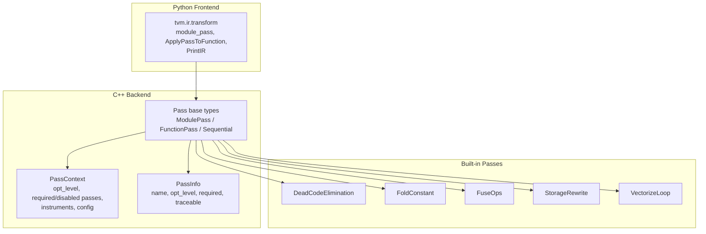

**Diagram sources**
- [transform.h:365-564](file://include/tvm/ir/transform.h#L365-L564)
- [transform.cc:333-656](file://src/ir/transform.cc#L333-L656)
- [transform.py:143-411](file://python/tvm/ir/transform.py#L143-L411)

**Section sources**
- [transform.h:20-72](file://include/tvm/ir/transform.h#L20-L72)
- [transform.cc:35-104](file://src/ir/transform.cc#L35-L104)
- [transform.py:18-53](file://python/tvm/ir/transform.py#L18-L53)
- [pass_infra.rst:54-110](file://docs/arch/pass_infra.rst#L54-L110)

## Core Components
- Pass: The base class representing a transformation from IRModule to IRModule. It carries PassInfo metadata and integrates with PassContext for execution.
- PassInfo: Metadata describing a pass’ name, minimum opt level, required dependencies, and traceability.
- PassContext: Execution context carrying opt_level, required/disabled pass lists, diagnostics, instrumentation hooks, and pass-specific configuration.
- ModulePass: A pass operating at IRModule granularity (global IPO-level).
- FunctionPass: A pass operating on individual functions (Relax/TensorIR).
- Sequential: A composite pass that runs a list of passes in order, honoring opt-level gating and required/disabled lists.

Key behaviors:
- PassEnabled evaluation considers disabled lists, required lists, and opt_level.
- Instrument hooks allow pre/post pass execution and pass-context entry/exit.
- Immutable-module mode validates that passes do not mutate their input IRModule.

**Section sources**
- [transform.h:365-564](file://include/tvm/ir/transform.h#L365-L564)
- [transform.cc:94-104](file://src/ir/transform.cc#L94-L104)
- [transform.cc:290-325](file://src/ir/transform.cc#L290-L325)
- [transform.py:143-224](file://python/tvm/ir/transform.py#L143-L224)

## Architecture Overview
The pass manager orchestrates passes with a consistent IRModule-to-IRModule interface. Passes can be composed into pipelines, gated by opt-level, and instrumented for debugging and tracing.

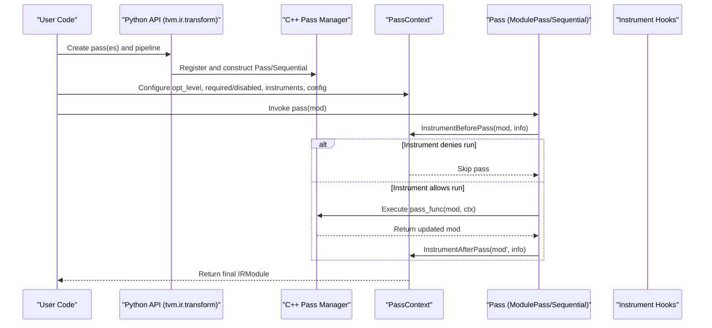

**Diagram sources**
- [transform.cc:290-325](file://src/ir/transform.cc#L290-L325)
- [transform.cc:259-288](file://src/ir/transform.cc#L259-L288)
- [transform.py:143-172](file://python/tvm/ir/transform.py#L143-L172)

## Detailed Component Analysis

### Pass Infrastructure and Execution Model
- Pass base class enforces IRModule-to-IRModule transformation and integrates with PassContext.Current().
- ModulePassNode executes a module-level transformation, sets up diagnostics, and renders diagnostics upon completion.
- SequentialNode iterates over passes, resolves required passes, and respects opt-level gating.
- PassEnabled logic prioritizes disabled vs required vs opt-level.

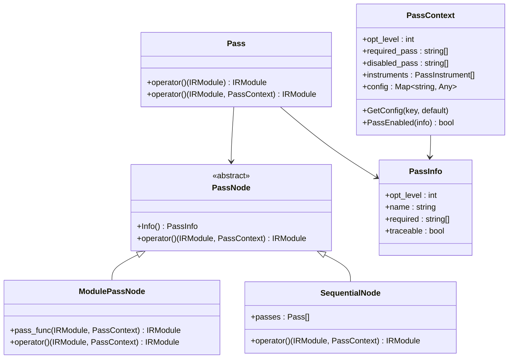

**Diagram sources**
- [transform.h:365-564](file://include/tvm/ir/transform.h#L365-L564)
- [transform.cc:333-488](file://src/ir/transform.cc#L333-L488)

**Section sources**
- [transform.h:365-564](file://include/tvm/ir/transform.h#L365-L564)
- [transform.cc:333-488](file://src/ir/transform.cc#L333-L488)

### Pass Registry, Creation, and Python API
- Python decorators and helpers create passes and wrap them into C++ objects.
- module_pass decorator constructs PassInfo and registers a ModulePass.
- ApplyPassToFunction composes a pass to run only on selected functions via regex.
- PrintIR utility pass prints IR for inspection.

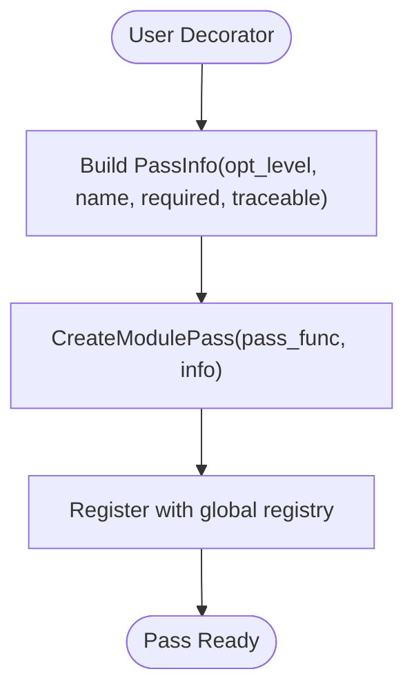

**Diagram sources**
- [transform.py:256-352](file://python/tvm/ir/transform.py#L256-L352)
- [transform.py:370-411](file://python/tvm/ir/transform.py#L370-L411)

**Section sources**
- [transform.py:256-352](file://python/tvm/ir/transform.py#L256-L352)
- [transform.py:355-368](file://python/tvm/ir/transform.py#L355-L368)

### Pass Context Management and Instrumentation
- PassContext holds opt_level, required/disabled pass lists, instruments, and config.
- Instruments receive EnterPassContext/ExitPassContext and ShouldRun/RunBeforePass/RunAfterPass callbacks.
- Immutable-module mode hashes the module before/after pass execution to detect unintended mutations.

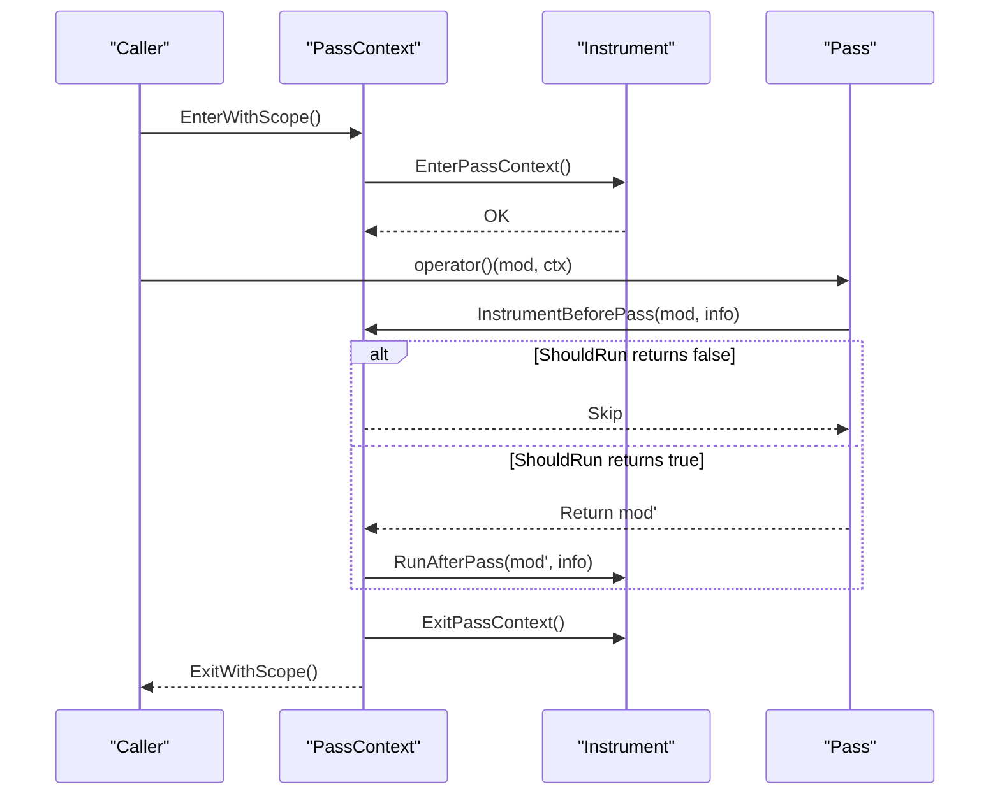

**Diagram sources**
- [transform.cc:61-84](file://src/ir/transform.cc#L61-L84)
- [transform.cc:209-288](file://src/ir/transform.cc#L209-L288)
- [transform.cc:313-325](file://src/ir/transform.cc#L313-L325)

**Section sources**
- [transform.cc:43-84](file://src/ir/transform.cc#L43-L84)
- [transform.cc:209-288](file://src/ir/transform.cc#L209-L288)
- [transform.cc:313-325](file://src/ir/transform.cc#L313-L325)

### Built-in Passes

#### Dead Code Elimination (Relax)
- Removes unused Relax functions and unused local bindings.
- Two-phase removal: remove unused functions, rewrite bodies, then remove functions again.

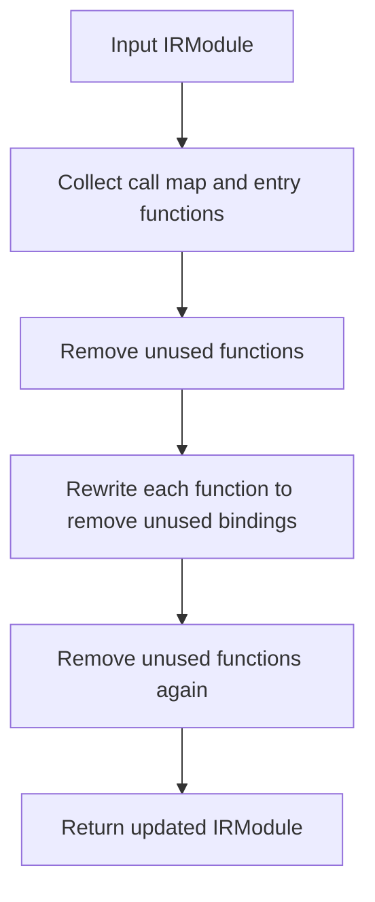

**Diagram sources**
- [dead_code_elimination.cc:47-134](file://src/relax/transform/dead_code_elimination.cc#L47-L134)

**Section sources**
- [dead_code_elimination.cc:94-143](file://src/relax/transform/dead_code_elimination.cc#L94-L143)

#### Constant Folding (Relax)
- Rewrites expressions to constants when possible, including call_tir to CPU-built functions.
- Uses structural shape/type matching and caches built functions for evaluation.

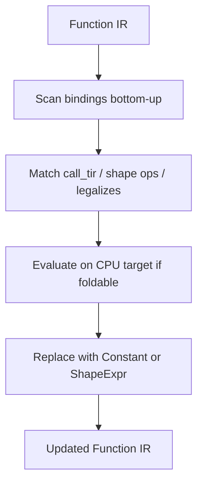

**Diagram sources**
- [fold_constant.cc:34-418](file://src/relax/transform/fold_constant.cc#L34-L418)

**Section sources**
- [fold_constant.cc:420-432](file://src/relax/transform/fold_constant.cc#L420-L432)

#### Operator Fusion (Relax)
- Partitions dataflow graph using post-dominator analysis and groups compatible bindings into new primitive Relax functions.
- Supports configurable depth and attributes propagation.

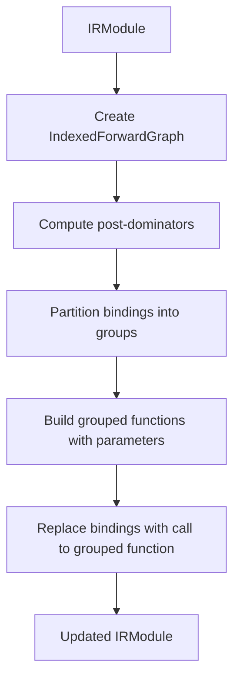

**Diagram sources**
- [fuse_ops.cc:102-374](file://src/relax/transform/fuse_ops.cc#L102-L374)

**Section sources**
- [fuse_ops.cc:51-94](file://src/relax/transform/fuse_ops.cc#L51-L94)
- [fuse_ops.cc:100-101](file://src/relax/transform/fuse_ops.cc#L100-L101)

#### Memory Allocation Reuse (TIRx)
- Performs liveness analysis and plans memory sharing across buffers.
- Merges allocations, remaps buffer indices, and hoists allocations to appropriate scopes.

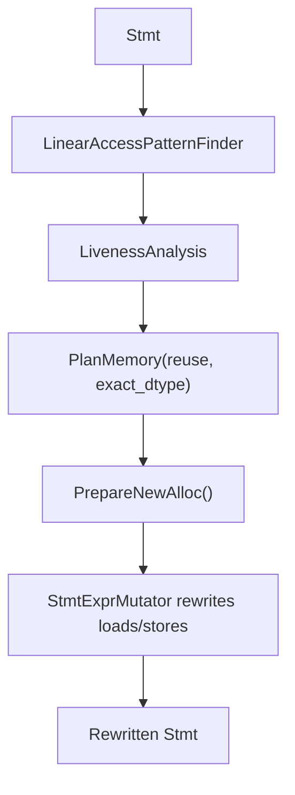

**Diagram sources**
- [storage_rewrite.cc:66-241](file://src/tirx/transform/storage_rewrite.cc#L66-L241)
- [storage_rewrite.cc:389-562](file://src/tirx/transform/storage_rewrite.cc#L389-L562)

**Section sources**
- [storage_rewrite.cc:389-562](file://src/tirx/transform/storage_rewrite.cc#L389-L562)

#### Loop Vectorization (TIRx)
- Vectorizes loops and buffer accesses, optionally using predicate-based buffer-level masking.
- Supports scalable vectorization via vscale factors and adapts to target capabilities.

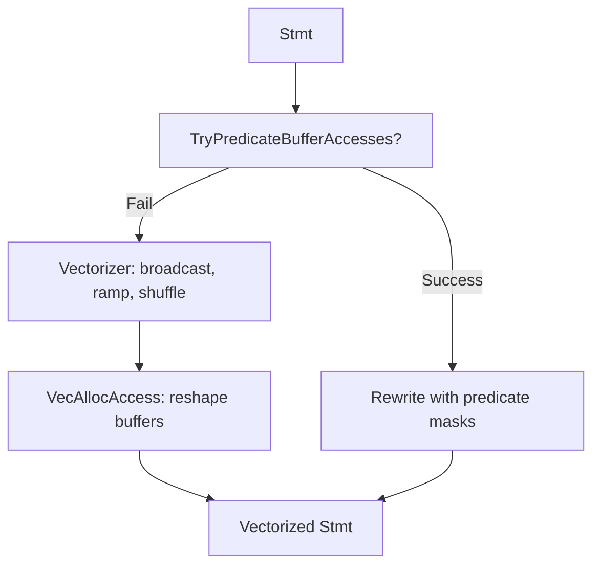

**Diagram sources**
- [vectorize_loop.cc:111-196](file://src/tirx/transform/vectorize_loop.cc#L111-L196)
- [vectorize_loop.cc:206-287](file://src/tirx/transform/vectorize_loop.cc#L206-L287)
- [vectorize_loop.cc:289-800](file://src/tirx/transform/vectorize_loop.cc#L289-L800)

**Section sources**
- [vectorize_loop.cc:78-88](file://src/tirx/transform/vectorize_loop.cc#L78-L88)
- [vectorize_loop.cc:289-800](file://src/tirx/transform/vectorize_loop.cc#L289-L800)

### Creating Custom Optimization Passes
- Module-level pass: Use the Python module_pass decorator to define a function transforming IRModule and register it with a PassInfo.
- Function-level pass: Implement a function transforming a single Relax/TensorIR function and register via CreateFunctionPass.
- Compose pipelines: Wrap a list of passes into Sequential with opt_level and required lists.
- Limit to specific functions: Use ApplyPassToFunction to restrict a pass to functions matched by a regex.

Practical steps:
- Define pass_func taking (IRModule, PassContext) -> IRModule.
- Create PassInfo with opt_level, name, required dependencies.
- Register pass globally via the static initializer block.
- Optionally integrate instrumentation and pass context configuration.

**Section sources**
- [transform.py:256-352](file://python/tvm/ir/transform.py#L256-L352)
- [transform.py:370-411](file://python/tvm/ir/transform.py#L370-L411)
- [transform.h:528-531](file://include/tvm/ir/transform.h#L528-L531)

### Pass Composition Patterns and Best Practices
- Prefer module-level passes for IPO/global effects; function-level passes for intraprocedural transformations.
- Use required lists to enforce dependencies between passes.
- Keep opt_level consistent with pass semantics; gate expensive passes at lower levels.
- Use Sequential to group related passes and maintain a clean execution order.
- Use ApplyPassToFunction to isolate kernel-level optimizations.
- Leverage PrintIR and diagnostics to inspect IR before/after passes.

**Section sources**
- [pass_infra.rst:195-351](file://docs/arch/pass_infra.rst#L195-L351)
- [transform.py:355-368](file://python/tvm/ir/transform.py#L355-L368)

## Dependency Analysis
- Pass depends on PassInfo for metadata and PassContext for runtime configuration.
- ModulePassNode depends on diagnostics and the provided pass_func.
- SequentialNode depends on the order of passes and resolves required passes before invoking each pass.
- Built-in passes depend on IR analysis utilities and IR visitors/mutators.

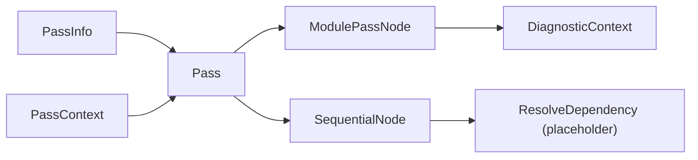

**Diagram sources**
- [transform.h:365-564](file://include/tvm/ir/transform.h#L365-L564)
- [transform.cc:447-454](file://src/ir/transform.cc#L447-L454)

**Section sources**
- [transform.cc:447-454](file://src/ir/transform.cc#L447-L454)
- [transform.h:444-488](file://include/tvm/ir/transform.h#L444-L488)

## Performance Considerations
- Gate expensive passes behind higher opt_levels to reduce compile time.
- Use ApplyPassToFunction to limit work to hotspots.
- StorageRewrite reduces memory footprint and improves locality.
- VectorizeLoop increases ILP and SIMD utilization; predicate-based masking can reduce branching overhead on supported targets.
- Immutable-module mode helps catch unintended mutations early, preventing costly rework.

[No sources needed since this section provides general guidance]

## Troubleshooting Guide
- Debugging: Use PrintIR to dump IR snapshots around problematic passes.
- Instrumentation: Implement PassInstrument callbacks to hook into pass lifecycle and selectively disable problematic passes.
- Pass gating: Temporarily disable passes via disabled_pass list or increase opt_level to bypass certain passes.
- Diagnostics: Inspect diagnostic context rendered by ModulePassNode to locate IR issues introduced by passes.
- Immutable-module mode: Enable testing.immutable_module to detect unintended mutations.

**Section sources**
- [transform.py:355-368](file://python/tvm/ir/transform.py#L355-L368)
- [transform.cc:209-288](file://src/ir/transform.cc#L209-L288)
- [transform.cc:304-325](file://src/ir/transform.cc#L304-L325)

## Conclusion
TVM’s pass system provides a robust, extensible framework for building and composing optimization pipelines across IR variants. With consistent IRModule-to-IRModule transformations, configurable pass contexts, instrumentation hooks, and a rich set of built-in passes, developers can craft efficient compilation flows tailored to their models and targets. Following the composition patterns and best practices outlined here will help ensure reliable, maintainable, and performant optimizations.