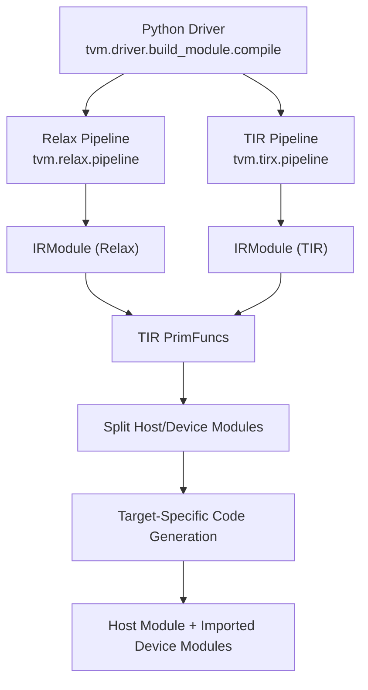
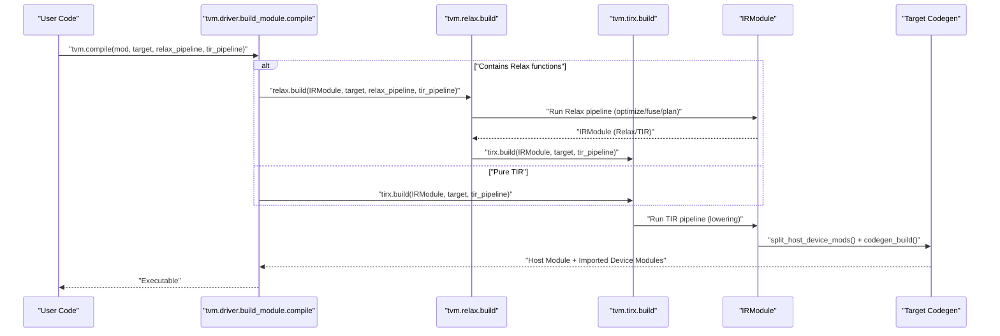
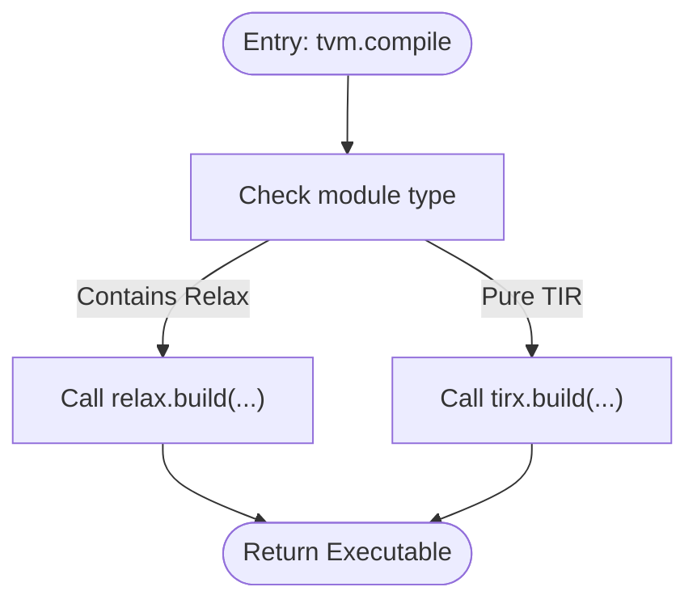
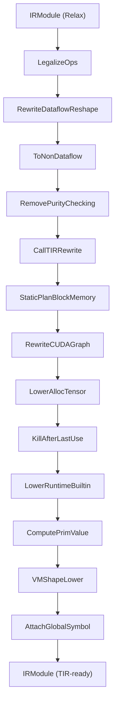
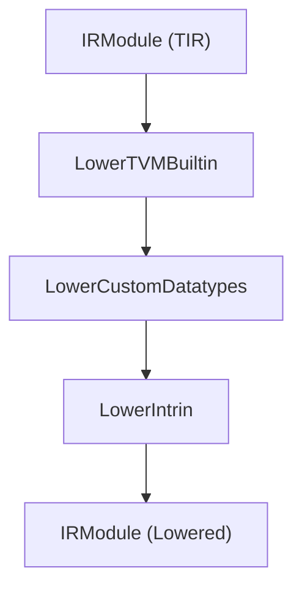
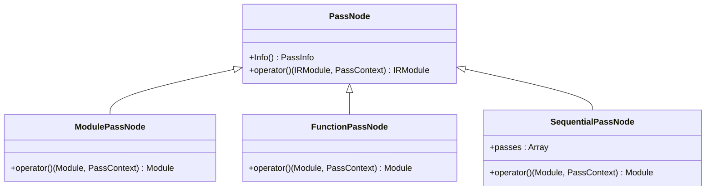
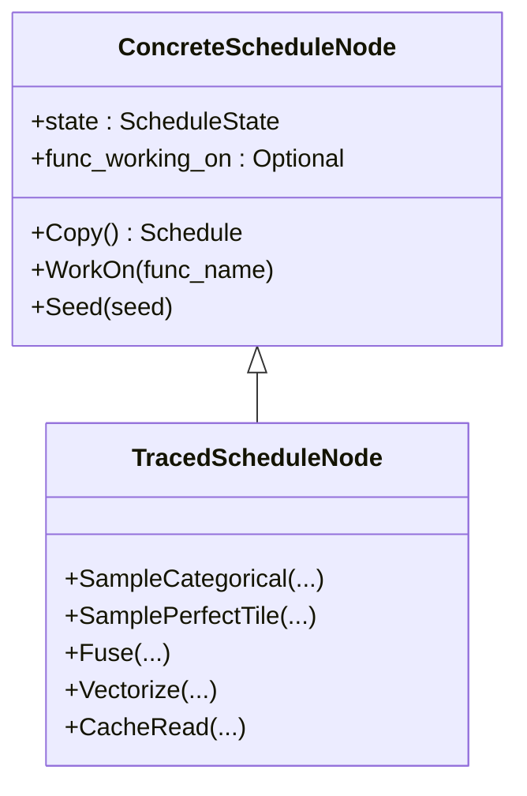
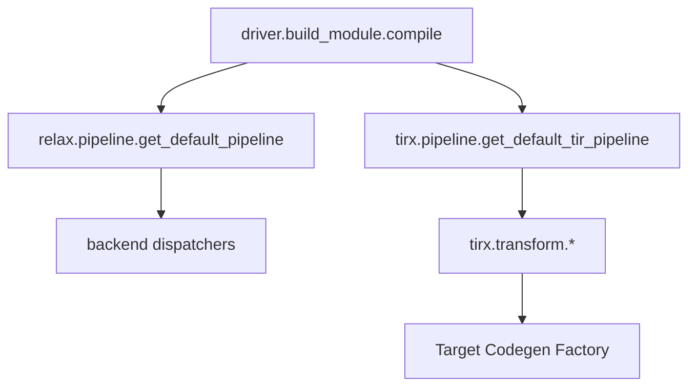

# Pipeline Stages

<cite>
**Referenced Files in This Document**
- [build_module.py](file://python/tvm/driver/build_module.py)
- [__init__.py (relax)](file://python/tvm/relax/__init__.py)
- [pipeline.py (relax)](file://python/tvm/relax/pipeline.py)
- [__init__.py (tirx)](file://python/tvm/tirx/__init__.py)
- [pipeline.py (tirx)](file://python/tvm/tirx/pipeline.py)
- [module.py (ir)](file://python/tvm/ir/module.py)
- [codegen.rst](file://docs/arch/codegen.rst)
- [pass_infra.rst](file://docs/arch/pass_infra.rst)
- [index.rst (arch)](file://docs/arch/index.rst)
- [device_target_interactions.rst](file://docs/arch/device_target_interactions.rst)
- [postproc.cc (s_tir)](file://src/s_tir/meta_schedule/postproc/postproc.cc)
- [concrete_schedule.h](file://src/s_tir/schedule/concrete_schedule.h)
- [concrete_schedule.cc](file://src/s_tir/schedule/concrete_schedule.cc)
- [traced_schedule.h](file://src/s_tir/schedule/traced_schedule.h)
- [instruction.cc](file://src/s_tir/schedule/instruction.cc)
- [llvm_codegen_registry_test.cc](file://tests/cpp/llvm_codegen_registry_test.cc)
</cite>

## Table of Contents
1. [Introduction](#introduction)
2. [Project Structure](#project-structure)
3. [Core Components](#core-components)
4. [Architecture Overview](#architecture-overview)
5. [Detailed Component Analysis](#detailed-component-analysis)
6. [Dependency Analysis](#dependency-analysis)
7. [Performance Considerations](#performance-considerations)
8. [Troubleshooting Guide](#troubleshooting-guide)
9. [Conclusion](#conclusion)
10. [Appendices](#appendices)

## Introduction
This document explains TVM’s compilation pipeline stages from initial IR input to final code generation. It covers:
- Unified compilation interface for both Relax and TIR modules
- IR conversion and optimization passes orchestrated by the pass infrastructure
- Scheduling and meta-scheduling for TIR
- Code generation and target-specific dispatch
- Practical examples of custom pipeline configuration and pass ordering

The goal is to help users understand how each stage transforms the intermediate representation and prepares it for the next, and how the unified interface routes compilation to the correct backend.

## Project Structure
At a high level, TVM exposes a unified entry point that detects module type and dispatches to either Relax or TIR compilation. The Relax pipeline lowers high-level models to TIR, while the TIR pipeline lowers TIR to native code via target-specific code generators.

**Diagram sources**
- [build_module.py:72-113](file://python/tvm/driver/build_module.py#L72-L113)
- [__init__.py (relax):93-96](file://python/tvm/relax/__init__.py#L93-L96)
- [__init__.py (tirx):121-122](file://python/tvm/tirx/__init__.py#L121-L122)
- [codegen.rst:30-65](file://docs/arch/codegen.rst#L30-L65)

**Section sources**
- [build_module.py:72-113](file://python/tvm/driver/build_module.py#L72-L113)
- [__init__.py (relax):93-96](file://python/tvm/relax/__init__.py#L93-L96)
- [__init__.py (tirx):121-122](file://python/tvm/tirx/__init__.py#L121-L122)
- [codegen.rst:30-65](file://docs/arch/codegen.rst#L30-L65)

## Core Components
- Unified compilation entry point: Detects module type and routes to Relax or TIR build.
- Relax pipeline: Graph-level optimizations, memory planning, VM shape lowering, and preparation for TIR lowering.
- TIR pipeline: Lowering passes, device/host separation, and target-specific code generation.
- Pass infrastructure: Hierarchical pass constructs (module-level, function-level, sequential) that operate on IRModule.
- Scheduling/Meta-scheduling: TIR-level scheduling primitives and post-processing for performance.

**Section sources**
- [build_module.py:63-113](file://python/tvm/driver/build_module.py#L63-L113)
- [pipeline.py (relax):80-107](file://python/tvm/relax/pipeline.py#L80-L107)
- [pipeline.py (tirx):25-76](file://python/tvm/tirx/pipeline.py#L25-L76)
- [pass_infra.rst:166-286](file://docs/arch/pass_infra.rst#L166-L286)

## Architecture Overview
The compilation flow is split into two phases:
1) Relax phase: Optimizes and fuses the model graph, lowers to VM bytecode and TIR.
2) TIR phase: Lowers TIR PrimFuncs to native code via target-specific code generators.

**Diagram sources**
- [build_module.py:72-113](file://python/tvm/driver/build_module.py#L72-L113)
- [codegen.rst:30-65](file://docs/arch/codegen.rst#L30-L65)

**Section sources**
- [build_module.py:72-113](file://python/tvm/driver/build_module.py#L72-L113)
- [codegen.rst:30-65](file://docs/arch/codegen.rst#L30-L65)

## Detailed Component Analysis

### Unified Compilation Interface
- Detects whether the input module contains Relax functions and routes accordingly.
- Provides separate parameters for Relax and TIR pipelines to fine-tune each stage independently.

**Diagram sources**
- [build_module.py:63-113](file://python/tvm/driver/build_module.py#L63-L113)

**Section sources**
- [build_module.py:63-113](file://python/tvm/driver/build_module.py#L63-L113)

### Relax Pipeline
- Pre-defined pipelines include zero, default build, and static shape tuning.
- The default build pipeline performs legalization, dataflow rewriting, memory planning, and VM shape lowering.
- Static shape tuning integrates meta-schedule tuning and database application.

**Diagram sources**
- [pipeline.py (relax):80-107](file://python/tvm/relax/pipeline.py#L80-L107)

**Section sources**
- [pipeline.py (relax):80-107](file://python/tvm/relax/pipeline.py#L80-L107)
- [pipeline.py (relax):110-209](file://python/tvm/relax/pipeline.py#L110-L209)

### TIR Pipeline and Lowering
- Finalization passes include lowering TVM builtins, custom datatypes, and intrinsics.
- Default TIR pipeline selection depends on target kind and backend.

**Diagram sources**
- [pipeline.py (tirx):25-44](file://python/tvm/tirx/pipeline.py#L25-L44)

**Section sources**
- [pipeline.py (tirx):25-76](file://python/tvm/tirx/pipeline.py#L25-L76)

### Pass Infrastructure
- Hierarchical pass constructs operate on IRModule:
  - Module-level passes transform the entire module.
  - Function-level passes operate on individual functions.
  - Sequential passes execute a list of passes in order, respecting required dependencies.

**Diagram sources**
- [pass_infra.rst:166-286](file://docs/arch/pass_infra.rst#L166-L286)

**Section sources**
- [pass_infra.rst:166-286](file://docs/arch/pass_infra.rst#L166-L286)

### Scheduling and Meta-Scheduling
- S-TIR provides scheduling primitives and traced schedules for programmatic control.
- Post-processing routines tailor GPU code generation and vectorization.

**Diagram sources**
- [concrete_schedule.h:36-68](file://src/s_tir/schedule/concrete_schedule.h#L36-L68)
- [traced_schedule.h:46-87](file://src/s_tir/schedule/traced_schedule.h#L46-L87)

**Section sources**
- [concrete_schedule.h:36-68](file://src/s_tir/schedule/concrete_schedule.h#L36-L68)
- [traced_schedule.h:46-87](file://src/s_tir/schedule/traced_schedule.h#L46-L87)
- [instruction.cc:27-35](file://src/s_tir/schedule/instruction.cc#L27-L35)

### Meta-Scheduling Post-processing
- Default post-processors for CUDA and RISC-V targets include cooperative fetch, verification, and tensorization.

**Section sources**
- [postproc.cc:73-104](file://src/s_tir/meta_schedule/postproc/postproc.cc#L73-L104)

### IR Layer Relationships
- IRModule is the central data structure holding functions.
- Relax IR contains high-level functions; TIR IR contains PrimFuncs.
- The pipeline converts between these layers: Relax → TIR → Native code.

**Section sources**
- [module.py:31-67](file://python/tvm/ir/module.py#L31-L67)
- [index.rst (arch):54-68](file://docs/arch/index.rst#L54-L68)

## Dependency Analysis
- The unified driver depends on Relax and TIR pipelines.
- Relax pipeline depends on backend dispatchers and meta-scheduling utilities.
- TIR pipeline depends on target-specific lowering passes.
- Code generation depends on target registration and factory functions.

**Diagram sources**
- [build_module.py:72-113](file://python/tvm/driver/build_module.py#L72-L113)
- [pipeline.py (relax):330-347](file://python/tvm/relax/pipeline.py#L330-L347)
- [pipeline.py (tirx):68-76](file://python/tvm/tirx/pipeline.py#L68-L76)
- [device_target_interactions.rst:218-245](file://docs/arch/device_target_interactions.rst#L218-L245)

**Section sources**
- [build_module.py:72-113](file://python/tvm/driver/build_module.py#L72-L113)
- [pipeline.py (relax):330-347](file://python/tvm/relax/pipeline.py#L330-L347)
- [pipeline.py (tirx):68-76](file://python/tvm/tirx/pipeline.py#L68-L76)
- [device_target_interactions.rst:218-245](file://docs/arch/device_target_interactions.rst#L218-L245)

## Performance Considerations
- Choose target-aware pipelines: Relax default pipelines vary by target kind; TIR default pipeline selects backend-specific strategies.
- Use meta-scheduling for device-specific optimizations; ensure post-processing matches hardware capabilities.
- Tune pass ordering to reduce redundant transformations and leverage early constant folding and dead-code elimination.

[No sources needed since this section provides general guidance]

## Troubleshooting Guide
- Target registration failures: Ensure target-specific code generator functions are registered; tests validate presence of target factories.
- Pipeline selection: If a target is unsupported by default pipelines, lower and build the IRModule manually or register a custom pipeline.
- Pass ordering issues: Use sequential passes to enforce strict order; verify required dependencies are satisfied before dependent passes.

**Section sources**
- [llvm_codegen_registry_test.cc:41-64](file://tests/cpp/llvm_codegen_registry_test.cc#L41-L64)
- [pipeline.py (relax):330-347](file://python/tvm/relax/pipeline.py#L330-L347)
- [pass_infra.rst:251-286](file://docs/arch/pass_infra.rst#L251-L286)

## Conclusion
TVM’s compilation pipeline unifies Relax and TIR workflows through a single entry point. The pass infrastructure orchestrates transformations across IR layers, while scheduling and meta-scheduling tailor performance to target hardware. Users can configure pipelines per stage and rely on target-aware defaults for robust builds.

[No sources needed since this section summarizes without analyzing specific files]

## Appendices

### Practical Examples and Best Practices
- Custom Relax pipeline: Compose a Sequential of Relax passes tailored to your workload and target.
- Custom TIR pipeline: Assemble a Sequential of TIR lowering passes and finalize with target-specific intrinsics.
- Pass ordering: Place constant folding and dead-code elimination early; reserve heavy transformations for later stages.
- Stage-specific optimizations: Use meta-scheduling post-processing for GPU kernels; leverage vectorization and memory rewrites for performance.

[No sources needed since this section provides general guidance]