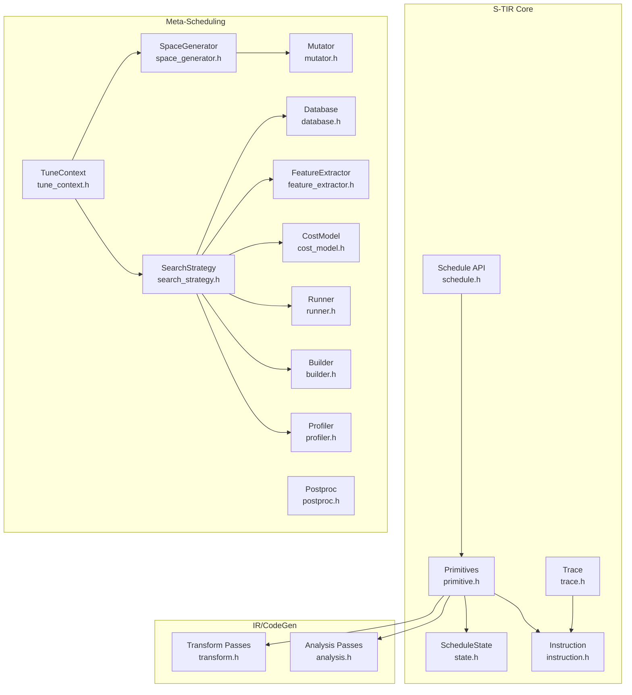
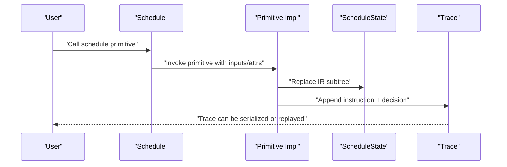
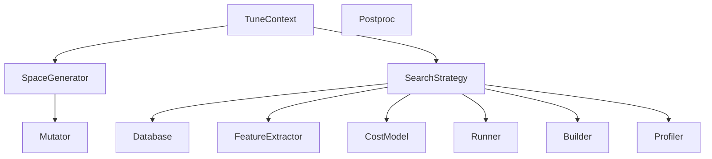
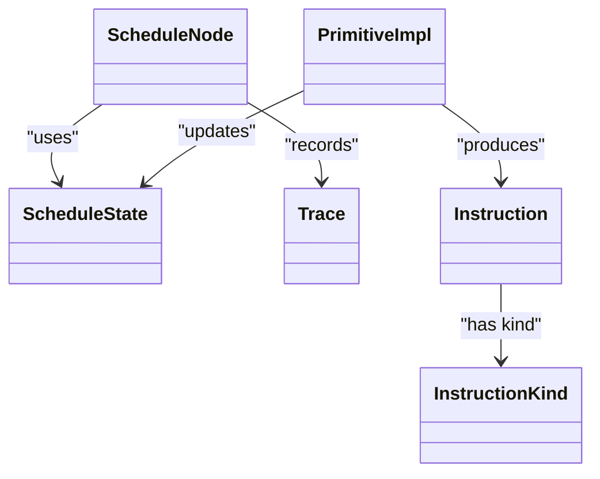

# Scheduling System

<cite>
**Referenced Files in This Document**
- [schedule.h](file://include/tvm/s_tir/schedule/schedule.h)
- [state.h](file://include/tvm/s_tir/schedule/state.h)
- [trace.h](file://include/tvm/s_tir/schedule/trace.h)
- [instruction.h](file://include/tvm/s_tir/schedule/instruction.h)
- [schedule.cc](file://src/s_tir/schedule/schedule.cc)
- [primitive.h](file://src/s_tir/schedule/primitive.h)
- [transform.h](file://src/s_tir/transform.h)
- [analysis.h](file://src/s_tir/analysis.h)
- [meta_schedule.h](file://include/tvm/s_tir/meta_schedule.h)
- [trace_apply.h](file://src/s_tir/meta_schedule/trace_apply.h)
- [trace_apply.cc](file://src/s_tir/meta_schedule/trace_apply.cc)
- [tune_context.h](file://include/tvm/s_tir/meta_schedule/tune_context.h)
- [tune_context.cc](file://src/s_tir/meta_schedule/tune_context.cc)
- [builder.h](file://include/tvm/s_tir/meta_schedule/builder.h)
- [runner.h](file://include/tvm/s_tir/meta_schedule/runner.h)
- [cost_model.h](file://include/tvm/s_tir/meta_schedule/cost_model.h)
- [mutator.h](file://include/tvm/s_tir/meta_schedule/mutator.h)
- [postproc.h](file://include/tvm/s_tir/meta_schedule/postproc.h)
- [search_strategy.h](file://include/tvm/s_tir/meta_schedule/search_strategy.h)
- [space_generator.h](file://include/tvm/s_tir/meta_schedule/space_generator.h)
- [task_scheduler.h](file://include/tvm/s_tir/meta_schedule/task_scheduler.h)
- [database.h](file://include/tvm/s_tir/meta_schedule/database.h)
- [database.cc](file://src/s_tir/meta_schedule/database.cc)
- [feature_extractor.h](file://include/tvm/s_tir/meta_schedule/feature_extractor.h)
- [measure_callback.h](file://include/tvm/s_tir/meta_schedule/measure_callback.h)
- [profiler.h](file://include/tvm/s_tir/meta_schedule/profiler.h)
- [extracted_task.h](file://include/tvm/s_tir/meta_schedule/extracted_task.h)
- [arg_info.h](file://include/tvm/s_tir/meta_schedule/arg_info.h)
- [module_equality.h](file://include/tvm/s_tir/meta_schedule/module_equality.h)
- [module_equality.cc](file://src/s_tir/meta_schedule/module_equality.cc)
</cite>

## Table of Contents
1. [Introduction](#introduction)
2. [Project Structure](#project-structure)
3. [Core Components](#core-components)
4. [Architecture Overview](#architecture-overview)
5. [Detailed Component Analysis](#detailed-component-analysis)
6. [Dependency Analysis](#dependency-analysis)
7. [Performance Considerations](#performance-considerations)
8. [Troubleshooting Guide](#troubleshooting-guide)
9. [Conclusion](#conclusion)
10. [Appendices](#appendices)

## Introduction
This document explains TVM’s Scheduling System (S-TIR), which provides a programmatic, instruction-based abstraction for controlling tensor computation transformations. S-TIR enables users to compose schedules as sequences of deterministic and probabilistic operations, track transformations via a trace, and integrate with automated search and meta-scheduling systems. It supports loop transformations, data movement, memory layouts, and reduction optimizations, and bridges to code generation and performance modeling for hardware-specific targets.

## Project Structure
S-TIR is organized around:
- Schedule API and primitives: user-facing schedule operations and their implementations
- State and trace: persistent state of the IR and a replayable trace of transformations
- Instruction model: typed, serializable operations that define schedule programs
- Meta-scheduling: automated search, tuning, and hardware-aware optimization
- Transform passes: lowering and optimization passes that finalize code generation

**Diagram sources**
- [schedule.h](file://include/tvm/s_tir/schedule/schedule.h)
- [state.h](file://include/tvm/s_tir/schedule/state.h)
- [trace.h](file://include/tvm/s_tir/schedule/trace.h)
- [instruction.h](file://include/tvm/s_tir/schedule/instruction.h)
- [primitive.h](file://src/s_tir/schedule/primitive.h)
- [transform.h](file://src/s_tir/transform.h)
- [analysis.h](file://src/s_tir/analysis.h)
- [tune_context.h](file://include/tvm/s_tir/meta_schedule/tune_context.h)
- [space_generator.h](file://include/tvm/s_tir/meta_schedule/space_generator.h)
- [search_strategy.h](file://include/tvm/s_tir/meta_schedule/search_strategy.h)
- [mutator.h](file://include/tvm/s_tir/meta_schedule/mutator.h)
- [postproc.h](file://include/tvm/s_tir/meta_schedule/postproc.h)
- [database.h](file://include/tvm/s_tir/meta_schedule/database.h)
- [feature_extractor.h](file://include/tvm/s_tir/meta_schedule/feature_extractor.h)
- [cost_model.h](file://include/tvm/s_tir/meta_schedule/cost_model.h)
- [runner.h](file://include/tvm/s_tir/meta_schedule/runner.h)
- [builder.h](file://include/tvm/s_tir/meta_schedule/builder.h)
- [profiler.h](file://include/tvm/s_tir/meta_schedule/profiler.h)

**Section sources**
- [schedule.h](file://include/tvm/s_tir/schedule/schedule.h)
- [state.h](file://include/tvm/s_tir/schedule/state.h)
- [trace.h](file://include/tvm/s_tir/schedule/trace.h)
- [instruction.h](file://include/tvm/s_tir/schedule/instruction.h)
- [primitive.h](file://src/s_tir/schedule/primitive.h)
- [transform.h](file://src/s_tir/transform.h)
- [analysis.h](file://src/s_tir/analysis.h)

## Core Components
- Schedule API: Provides user-facing methods to query blocks/loops, sample choices, and apply transformations. It exposes random variables (SBlockRV, LoopRV, ExprRV) and maintains a trace of executed instructions.
- ScheduleState: Holds the IRModule, the sref tree, per-block scope info (affine binding, region coverage, stage-pipeline), and reverse mapping from AST nodes to srefs. It offers a Replace operation to mutate the IR safely.
- Trace: Records executed instructions and decisions, supports serialization to JSON and Python syntax, and can replay transformations deterministically.
- Instruction: Encapsulates a typed operation with inputs, attributes, outputs, and functors to apply, serialize, and print. InstructionKind registers each primitive with its application semantics.
- Primitives: Implementations of schedule operations (loops, compute-at, cache stages, layout transforms, reductions, annotations, etc.) that operate on ScheduleState and produce updates.

**Section sources**
- [schedule.h](file://include/tvm/s_tir/schedule/schedule.h)
- [state.h](file://include/tvm/s_tir/schedule/state.h)
- [trace.h](file://include/tvm/s_tir/schedule/trace.h)
- [instruction.h](file://include/tvm/s_tir/schedule/instruction.h)
- [primitive.h](file://src/s_tir/schedule/primitive.h)

## Architecture Overview
S-TIR composes transformations as a sequence of instructions. Each instruction is applied to a Schedule, which updates ScheduleState and optionally records the instruction in Trace. Meta-scheduling consumes Trace to generate candidate schedules, measures performance, and evolves the search space.

**Diagram sources**
- [schedule.cc](file://src/s_tir/schedule/schedule.cc)
- [primitive.h](file://src/s_tir/schedule/primitive.h)
- [state.h](file://include/tvm/s_tir/schedule/state.h)
- [trace.h](file://include/tvm/s_tir/schedule/trace.h)

## Detailed Component Analysis

### Schedule API and Random Variables
- Exposes methods to select blocks/loops, sample categorical/perfect-tile/partitioned-tile/compute-location, and apply transformations.
- Maintains a working function context and supports copying the schedule with preserved symbol table and sref mapping.
- Provides FFI registration for Python bindings and dynamic dispatch to implementations.

**Section sources**
- [schedule.h](file://include/tvm/s_tir/schedule/schedule.h)
- [schedule.cc](file://src/s_tir/schedule/schedule.cc)

### ScheduleState and Replacement Semantics
- Stores IRModule, block_info (scope graph, affine_binding, region_cover, stage_pipeline), stmt2ref mapping, and debug flags.
- Replace performs copy-on-write when safe, supporting three allowed replacements: SBlock↔SBlock, Loop↔Loop, Loop→SBlockRealize.
- DebugVerify validates sref tree and cached flags based on bitmask.

**Section sources**
- [state.h](file://include/tvm/s_tir/schedule/state.h)

### Trace Recording and Replay
- Trace stores ordered instructions and associated decisions, supports Append/Pop, ApplyToSchedule, AsJSON, AsPython, WithDecision, and Simplified.
- ApplyToSchedule re-executes instructions, optionally mutating decisions via a provider callback and optionally skipping postprocessing.

**Section sources**
- [trace.h](file://include/tvm/s_tir/schedule/trace.h)

### Instruction Model and Registry
- InstructionKind encapsulates the name, purity, and functors to apply, serialize/deserialize attributes, and render Python syntax.
- Instruction carries inputs (SBlockRV/LoopRV/ExprRV/doubles/integers/strings/null), attrs, and outputs.
- TVM_REGISTER_INST_KIND macro registers each primitive with its application semantics.

**Section sources**
- [instruction.h](file://include/tvm/s_tir/schedule/instruction.h)

### Primitive Operations and Transformation Rules
- Loop transformations: Split, LoopPartition, Fuse, Merge, Reorder, AddUnitLoop, ReorderBlockIterVar.
- ForKind manipulations: Parallel, Vectorize, Bind, Unroll.
- Compute-at and data movement: ComputeAt, ReverseComputeAt, ReadAt, WriteAt, ComputeInline, ReverseComputeInline, FuseReductionEpilogue.
- Cache stages: CacheRead, CacheWrite, ReindexCacheRead, ReindexCacheWrite, CacheInplace, CacheIndex, ReIndex.
- Reduction: DecomposeReduction, RFactor.
- Annotations: Annotate/Unannotate, SetScope, StorageAlign, UnsafeSetDType, SetAxisSeparator.
- Blockization and tensorization: Blockize, Tensorize.
- Layout transformations: TransformLayout, TransformBlockLayout.
- Padding and buffer transforms: DecomposePadding, PadEinsum, RollingBuffer.
- Buffer access annotation: AnnotateBufferAccess.
- Unsafe operations: UnsafeHideBufferAccess.

These primitives enforce structural and semantic constraints (e.g., stage-pipeline property, affine bindings, compact dataflow) and update ScheduleState accordingly.

**Section sources**
- [primitive.h](file://src/s_tir/schedule/primitive.h)

### Relationship to Code Generation and Analysis
- Transform passes finalize IR into executable forms and apply lowering rules (e.g., thread bindings, vectorization, layout inference).
- Analysis passes compute properties like allocated memory, FLOPs, and GPU verification to support correctness and performance modeling.

**Section sources**
- [transform.h](file://src/s_tir/transform.h)
- [analysis.h](file://src/s_tir/analysis.h)

### Meta-Scheduling Integration
- TuneContext coordinates search tasks and candidate generation.
- SpaceGenerator and SearchStrategy enumerate and evolve schedules.
- Mutator perturbs schedules; Postproc enforces hardware-friendly constraints.
- Database persists measurements; FeatureExtractor encodes program characteristics; CostModel predicts latency; Runner executes trials; Builder compiles artifacts; Profiler collects metrics.
- ModuleEquality compares IR equivalence across schedules.

**Diagram sources**
- [tune_context.h](file://include/tvm/s_tir/meta_schedule/tune_context.h)
- [space_generator.h](file://include/tvm/s_tir/meta_schedule/space_generator.h)
- [search_strategy.h](file://include/tvm/s_tir/meta_schedule/search_strategy.h)
- [mutator.h](file://include/tvm/s_tir/meta_schedule/mutator.h)
- [postproc.h](file://include/tvm/s_tir/meta_schedule/postproc.h)
- [database.h](file://include/tvm/s_tir/meta_schedule/database.h)
- [feature_extractor.h](file://include/tvm/s_tir/meta_schedule/feature_extractor.h)
- [cost_model.h](file://include/tvm/s_tir/meta_schedule/cost_model.h)
- [runner.h](file://include/tvm/s_tir/meta_schedule/runner.h)
- [builder.h](file://include/tvm/s_tir/meta_schedule/builder.h)
- [profiler.h](file://include/tvm/s_tir/meta_schedule/profiler.h)

**Section sources**
- [tune_context.h](file://include/tvm/s_tir/meta_schedule/tune_context.h)
- [tune_context.cc](file://src/s_tir/meta_schedule/tune_context.cc)
- [trace_apply.h](file://src/s_tir/meta_schedule/trace_apply.h)
- [trace_apply.cc](file://src/s_tir/meta_schedule/trace_apply.cc)
- [database.h](file://include/tvm/s_tir/meta_schedule/database.h)
- [database.cc](file://src/s_tir/meta_schedule/database.cc)
- [module_equality.h](file://include/tvm/s_tir/meta_schedule/module_equality.h)
- [module_equality.cc](file://src/s_tir/meta_schedule/module_equality.cc)

## Dependency Analysis
- Schedule API depends on ScheduleState and Trace; primitives depend on ScheduleState and IndexMap/TensorIntrin.
- InstructionKind registry binds each primitive to its application semantics.
- Meta-scheduling components depend on TuneContext and share common interfaces for search, mutation, and evaluation.

**Diagram sources**
- [schedule.h](file://include/tvm/s_tir/schedule/schedule.h)
- [state.h](file://include/tvm/s_tir/schedule/state.h)
- [trace.h](file://include/tvm/s_tir/schedule/trace.h)
- [instruction.h](file://include/tvm/s_tir/schedule/instruction.h)
- [primitive.h](file://src/s_tir/schedule/primitive.h)

**Section sources**
- [schedule.h](file://include/tvm/s_tir/schedule/schedule.h)
- [state.h](file://include/tvm/s_tir/schedule/state.h)
- [trace.h](file://include/tvm/s_tir/schedule/trace.h)
- [instruction.h](file://include/tvm/s_tir/schedule/instruction.h)
- [primitive.h](file://src/s_tir/schedule/primitive.h)

## Performance Considerations
- Stage-pipeline property and affine bindings are cached in ScheduleState to accelerate feasibility checks for transformations.
- Precondition checks can be toggled via enable_check to balance safety and speed.
- DebugVerify validates sref tree and cached flags to catch IR inconsistencies early.
- Meta-scheduling leverages FeatureExtractor and CostModel to prune unpromising spaces and Runner/Builder to compile and profile candidates efficiently.

[No sources needed since this section provides general guidance]

## Troubleshooting Guide
- Use Trace.AsPython to reproduce and inspect transformations step-by-step.
- Use Trace.WithDecision to adjust sampling decisions and re-run replay.
- Enable debug_mask bits to trigger extra verification after construction and Replace calls.
- For meta-scheduling failures, inspect TuneContext configuration, Database persistence, and Runner/Builder logs.

**Section sources**
- [trace.h](file://include/tvm/s_tir/schedule/trace.h)
- [state.h](file://include/tvm/s_tir/schedule/state.h)
- [tune_context.h](file://include/tvm/s_tir/meta_schedule/tune_context.h)
- [database.h](file://include/tvm/s_tir/meta_schedule/database.h)
- [runner.h](file://include/tvm/s_tir/meta_schedule/runner.h)
- [builder.h](file://include/tvm/s_tir/meta_schedule/builder.h)

## Conclusion
S-TIR provides a robust, instruction-based framework for tensor computation scheduling. Its stateful IR manipulation, deterministic trace recording, and rich set of primitives enable both manual crafting and automated search. Integrated with meta-scheduling, S-TIR supports performance modeling and hardware-specific optimizations, while analysis and transform passes bridge to executable code generation.

[No sources needed since this section summarizes without analyzing specific files]

## Appendices

### Practical Examples and Strategies
- Custom scheduling strategies: Compose primitives to implement domain-specific transformations (e.g., cache blocking, tensorization, reduction factorization) and record the process via Trace for reproducibility.
- Meta-scheduling integration: Use TuneContext to define tasks, SpaceGenerator to enumerate candidate schedules, SearchStrategy to evolve them, and Runner/Builder to evaluate performance.
- Automated schedule search: Employ Mutator to perturb schedules, Postproc to enforce hardware-friendly constraints, Database to persist results, and CostModel to guide exploration.

[No sources needed since this section provides general guidance]

### Visualizing Schedule Traces
- Serialize Trace to JSON or Python syntax for inspection and sharing.
- Replay traces deterministically to validate transformations across environments.

**Section sources**
- [trace.h](file://include/tvm/s_tir/schedule/trace.h)

### Optimizing for Different Targets
- Use ForKind primitives (Parallel, Vectorize, Bind) to exploit CPU/GPU threading and vector units.
- Apply layout and block layout transformations to improve memory access locality and reduce bank conflicts.
- Leverage reduction primitives (DecomposeReduction, RFactor) to enable parallel accumulation and improve throughput.

**Section sources**
- [primitive.h](file://src/s_tir/schedule/primitive.h)