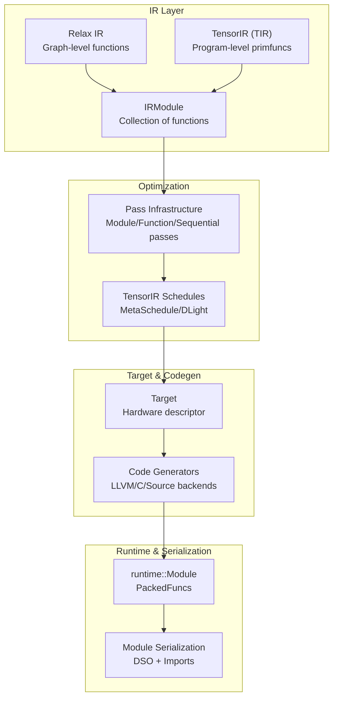
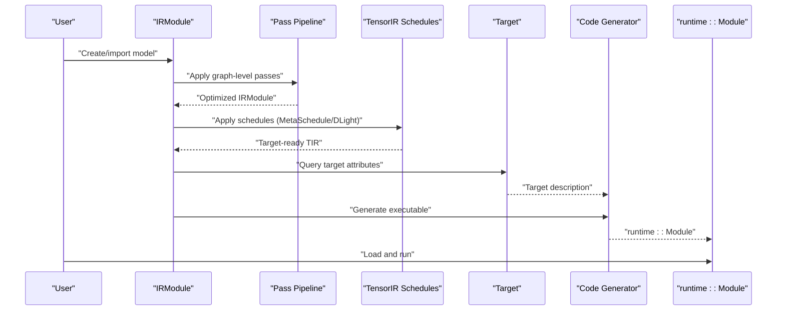
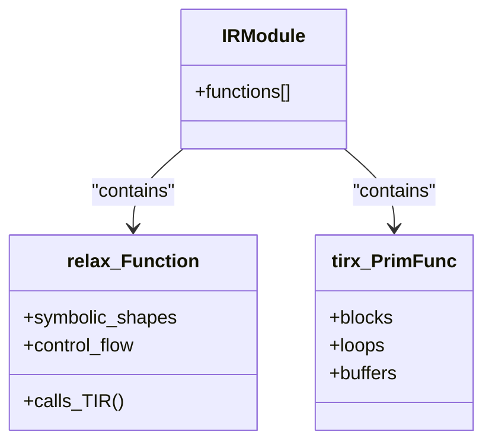
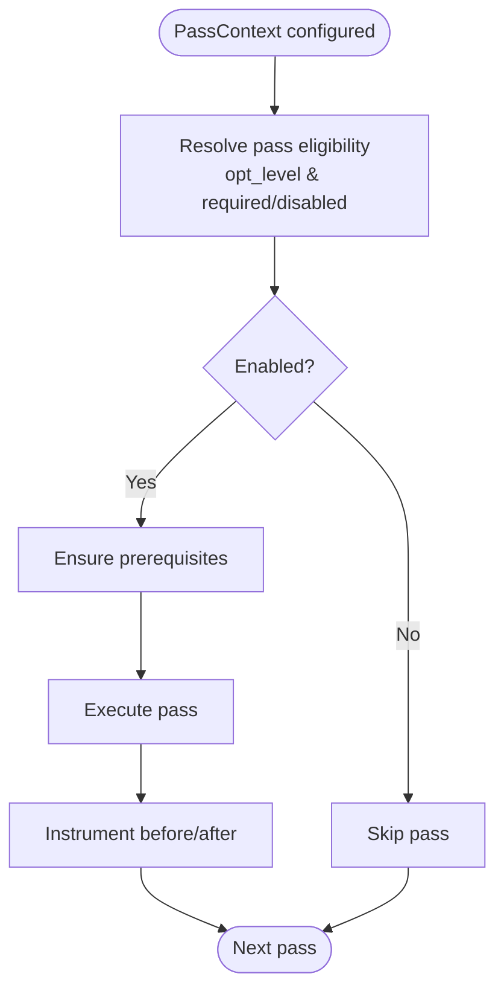
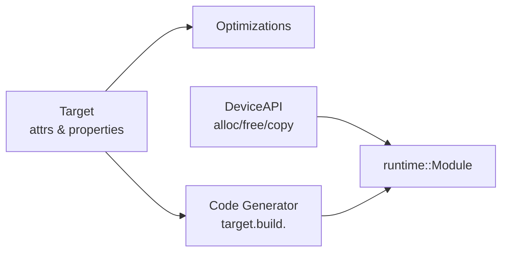
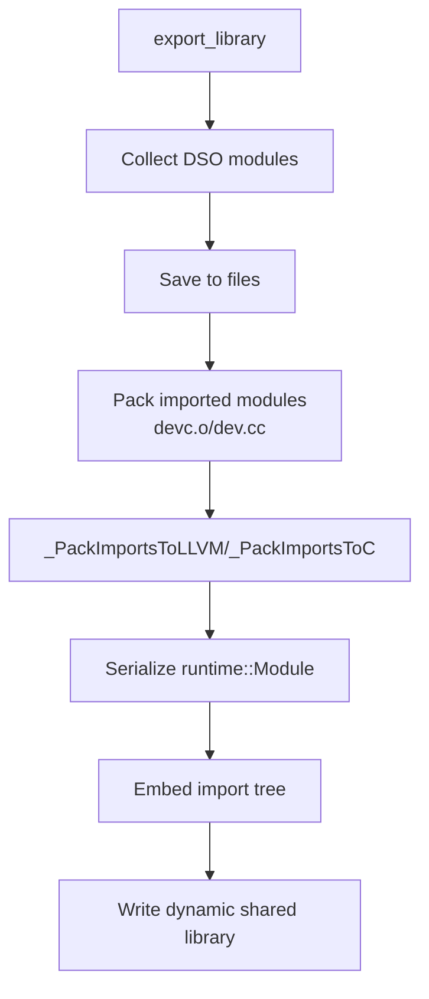
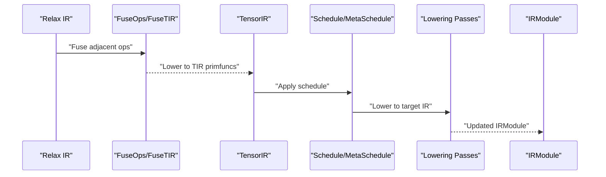
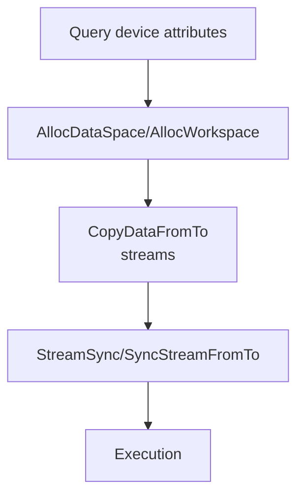
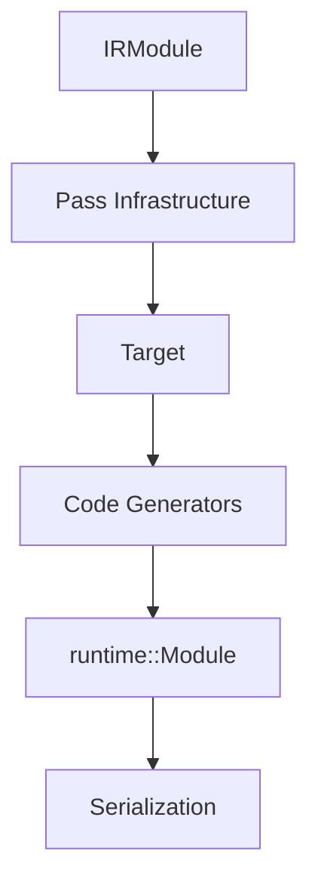

# Core Concepts

<cite>
**Referenced Files in This Document**
- [docs/arch/index.rst](file://docs/arch/index.rst)
- [docs/arch/pass_infra.rst](file://docs/arch/pass_infra.rst)
- [docs/arch/device_target_interactions.rst](file://docs/arch/device_target_interactions.rst)
- [docs/arch/introduction_to_module_serialization.rst](file://docs/arch/introduction_to_module_serialization.rst)
- [docs/arch/tvmscript.rst](file://docs/arch/tvmscript.rst)
- [docs/deep_dive/tensor_ir/abstraction.rst](file://docs/deep_dive/tensor_ir/abstraction.rst)
- [docs/deep_dive/relax/abstraction.rst](file://docs/deep_dive/relax/abstraction.rst)
- [docs/get_started/overview.rst](file://docs/get_started/overview.rst)
- [src/runtime/module.cc](file://src/runtime/module.cc)
- [src/s_tir/schedule/primitive/cache_read_write.cc](file://src/s_tir/schedule/primitive/cache_read_write.cc)
- [python/tvm/contrib/nvcc.py](file://python/tvm/contrib/nvcc.py)
- [README.md](file://README.md)
</cite>

## Table of Contents
1. [Introduction](#introduction)
2. [Project Structure](#project-structure)
3. [Core Components](#core-components)
4. [Architecture Overview](#architecture-overview)
5. [Detailed Component Analysis](#detailed-component-analysis)
6. [Dependency Analysis](#dependency-analysis)
7. [Performance Considerations](#performance-considerations)
8. [Troubleshooting Guide](#troubleshooting-guide)
9. [Conclusion](#conclusion)
10. [Appendices](#appendices)

## Introduction
This document presents TVM’s core concepts with a focus on the multi-level IR system (TensorIR, Relax, Script IR), the pass infrastructure for optimization, and the target configuration system. It explains the compilation pipeline stages, module serialization format, and the relationships between IR layers. It also covers targets and hardware backends, memory management across heterogeneous devices, and TVM’s Python-first development approach. The goal is to provide a progressive understanding suitable for beginners while offering technical depth for experienced developers.

## Project Structure
At a high level, TVM organizes its functionality around:
- A layered IR stack: Relax (graph-level) and TensorIR (program-level) coexist in an IRModule.
- A pass infrastructure that orchestrates transformations across IR layers.
- A target system that describes hardware and drives code generation.
- A runtime and serialization system that packages and deploys compiled artifacts.

**Diagram sources**
- [docs/arch/index.rst:34-141](file://docs/arch/index.rst#L34-L141)
- [docs/arch/pass_infra.rst:70-123](file://docs/arch/pass_infra.rst#L70-L123)
- [docs/arch/device_target_interactions.rst:176-246](file://docs/arch/device_target_interactions.rst#L176-L246)
- [docs/arch/introduction_to_module_serialization.rst:18-51](file://docs/arch/introduction_to_module_serialization.rst#L18-L51)

**Section sources**
- [docs/arch/index.rst:34-141](file://docs/arch/index.rst#L34-L141)
- [docs/get_started/overview.rst:18-67](file://docs/get_started/overview.rst#L18-L67)
- [README.md:25-30](file://README.md#L25-L30)

## Core Components
- IRModule: The primary data structure holding collections of functions. It accommodates both Relax functions and TensorIR primfuncs, enabling cross-level transformations.
- Relax IR: Graph-level representation supporting symbolic shapes, control flow, and complex data structures. It is optimized via graph-level passes and lowered to TensorIR.
- TensorIR (TIR): Low-level program representation with blocks, loops, and buffer semantics. It is optimized with schedules and lowered to target-specific code.
- Pass Infrastructure: Provides module-level, function-level, and sequential passes with configurable opt levels, required/disabled lists, and instrumentation.
- Target System: Describes hardware/driver capabilities and properties. It influences optimization and code generation decisions.
- Runtime and Serialization: Encapsulates compiled artifacts as runtime::Module with PackedFuncs and supports unified serialization for deployment.

**Section sources**
- [docs/arch/index.rst:54-141](file://docs/arch/index.rst#L54-L141)
- [docs/deep_dive/relax/abstraction.rst:18-74](file://docs/deep_dive/relax/abstraction.rst#L18-L74)
- [docs/deep_dive/tensor_ir/abstraction.rst:18-73](file://docs/deep_dive/tensor_ir/abstraction.rst#L18-L73)
- [docs/arch/pass_infra.rst:70-123](file://docs/arch/pass_infra.rst#L70-L123)
- [docs/arch/device_target_interactions.rst:176-246](file://docs/arch/device_target_interactions.rst#L176-L246)
- [docs/arch/introduction_to_module_serialization.rst:18-51](file://docs/arch/introduction_to_module_serialization.rst#L18-L51)

## Architecture Overview
The end-to-end flow transforms a high-level model into a deployable runtime module:
1. Model creation: Build or import an IRModule with Relax and/or TensorIR functions.
2. Transformation: Apply graph-level and tensor-level optimizations, influenced by the target.
3. Target translation: Lower to target-specific code and produce a runtime::Module.
4. Runtime execution: Load and run the module on the target runtime.

**Diagram sources**
- [docs/arch/index.rst:34-141](file://docs/arch/index.rst#L34-L141)
- [docs/arch/pass_infra.rst:70-123](file://docs/arch/pass_infra.rst#L70-L123)
- [docs/arch/device_target_interactions.rst:218-246](file://docs/arch/device_target_interactions.rst#L218-L246)

## Detailed Component Analysis

### Multi-level IR System: Relax, TensorIR, Script IR
- Relax IR: Provides a graph-level view of models with first-class symbolic shapes, control flow, and composable transformations. It lowers to TensorIR and calls into TIR primfuncs.
- TensorIR: Captures program-level details including blocks, loop nests, and buffer semantics. It supports scheduling and lowering to target code.
- Script IR (TVMScript): A Python-based DSL to author IRModules with TIR primfuncs and Relax functions. It supports roundtrip printing and parsing.

**Diagram sources**
- [docs/arch/index.rst:54-112](file://docs/arch/index.rst#L54-L112)
- [docs/arch/tvmscript.rst:20-80](file://docs/arch/tvmscript.rst#L20-L80)
- [docs/deep_dive/relax/abstraction.rst:18-74](file://docs/deep_dive/relax/abstraction.rst#L18-L74)
- [docs/deep_dive/tensor_ir/abstraction.rst:18-73](file://docs/deep_dive/tensor_ir/abstraction.rst#L18-L73)

**Section sources**
- [docs/arch/index.rst:54-112](file://docs/arch/index.rst#L54-L112)
- [docs/arch/tvmscript.rst:20-80](file://docs/arch/tvmscript.rst#L20-L80)
- [docs/deep_dive/relax/abstraction.rst:18-74](file://docs/deep_dive/relax/abstraction.rst#L18-L74)
- [docs/deep_dive/tensor_ir/abstraction.rst:18-73](file://docs/deep_dive/tensor_ir/abstraction.rst#L18-L73)

### Pass Infrastructure for Optimization
- Hierarchical design with module-level, function-level, and sequential passes.
- PassContext controls opt levels, required/disabled passes, and instrumentation.
- PassInstrument supports timing, printing, and dumping IR across passes.

**Diagram sources**
- [docs/arch/pass_infra.rst:70-123](file://docs/arch/pass_infra.rst#L70-L123)
- [docs/arch/pass_infra.rst:251-294](file://docs/arch/pass_infra.rst#L251-L294)
- [docs/arch/pass_infra.rst:392-457](file://docs/arch/pass_infra.rst#L392-L457)

**Section sources**
- [docs/arch/pass_infra.rst:70-123](file://docs/arch/pass_infra.rst#L70-L123)
- [docs/arch/pass_infra.rst:251-294](file://docs/arch/pass_infra.rst#L251-L294)
- [docs/arch/pass_infra.rst:392-457](file://docs/arch/pass_infra.rst#L392-L457)

### Target Configuration System and Hardware Backends
- Target describes device capabilities and properties. It is used during optimization and code generation.
- DeviceAPI provides a uniform interface for device attributes, memory management, and stream operations.
- Code generators register per-target build functions to produce runtime::Module.

**Diagram sources**
- [docs/arch/device_target_interactions.rst:28-47](file://docs/arch/device_target_interactions.rst#L28-L47)
- [docs/arch/device_target_interactions.rst:176-246](file://docs/arch/device_target_interactions.rst#L176-L246)
- [src/runtime/module.cc:38-69](file://src/runtime/module.cc#L38-L69)

**Section sources**
- [docs/arch/device_target_interactions.rst:28-47](file://docs/arch/device_target_interactions.rst#L28-L47)
- [docs/arch/device_target_interactions.rst:176-246](file://docs/arch/device_target_interactions.rst#L176-L246)
- [src/runtime/module.cc:38-69](file://src/runtime/module.cc#L38-L69)

### Module Serialization Format and Deployment
- The unified serialization packs DSO modules and imported device modules into a single dynamic shared library.
- Import relationships are encoded and restored at load time.

**Diagram sources**
- [docs/arch/introduction_to_module_serialization.rst:26-51](file://docs/arch/introduction_to_module_serialization.rst#L26-L51)
- [docs/arch/introduction_to_module_serialization.rst:52-134](file://docs/arch/introduction_to_module_serialization.rst#L52-L134)
- [docs/arch/introduction_to_module_serialization.rst:142-194](file://docs/arch/introduction_to_module_serialization.rst#L142-L194)

**Section sources**
- [docs/arch/introduction_to_module_serialization.rst:18-51](file://docs/arch/introduction_to_module_serialization.rst#L18-L51)
- [docs/arch/introduction_to_module_serialization.rst:52-134](file://docs/arch/introduction_to_module_serialization.rst#L52-L134)
- [docs/arch/introduction_to_module_serialization.rst:142-194](file://docs/arch/introduction_to_module_serialization.rst#L142-L194)

### Compilation Pipeline Stages and Cross-level Transformations
- Graph-level optimizations (Relax): operator fusion, layout rewrites, library dispatch.
- TensorIR optimizations: schedule application, lowering passes, intrinsic expansion.
- Cross-level transformations: lowering Relax ops to TIR primfuncs and calls.

**Diagram sources**
- [docs/arch/index.rst:73-112](file://docs/arch/index.rst#L73-L112)
- [docs/arch/index.rst:118-131](file://docs/arch/index.rst#L118-L131)

**Section sources**
- [docs/arch/index.rst:73-112](file://docs/arch/index.rst#L73-L112)
- [docs/arch/index.rst:118-131](file://docs/arch/index.rst#L118-L131)

### Memory Management Across Heterogeneous Devices
- DeviceAPI defines memory allocation, workspace allocation, and data copies across host and device.
- Streams support parallel execution and synchronization across queues.
- Target attributes influence memory-related decisions during optimization and code generation.

**Diagram sources**
- [docs/arch/device_target_interactions.rst:78-141](file://docs/arch/device_target_interactions.rst#L78-L141)

**Section sources**
- [docs/arch/device_target_interactions.rst:78-141](file://docs/arch/device_target_interactions.rst#L78-L141)

### Python-first Development Approach
- Full customization of optimization pipelines in Python.
- Composable transformations and BYOC (Bring Your Own Codegen) enable rapid experimentation and deployment.

**Section sources**
- [docs/get_started/overview.rst:26-41](file://docs/get_started/overview.rst#L26-L41)
- [README.md:25-30](file://README.md#L25-L30)

## Dependency Analysis
- IRModule is the central hub for both Relax and TensorIR functions.
- Pass infrastructure operates uniformly across IR layers via unified PassContext.
- Target influences both optimization and code generation.
- Runtime module packaging depends on target availability and imported modules.

**Diagram sources**
- [docs/arch/index.rst:54-141](file://docs/arch/index.rst#L54-L141)
- [docs/arch/pass_infra.rst:70-123](file://docs/arch/pass_infra.rst#L70-L123)
- [docs/arch/device_target_interactions.rst:176-246](file://docs/arch/device_target_interactions.rst#L176-L246)
- [docs/arch/introduction_to_module_serialization.rst:18-51](file://docs/arch/introduction_to_module_serialization.rst#L18-L51)

**Section sources**
- [docs/arch/index.rst:54-141](file://docs/arch/index.rst#L54-L141)
- [docs/arch/pass_infra.rst:70-123](file://docs/arch/pass_infra.rst#L70-L123)
- [docs/arch/device_target_interactions.rst:176-246](file://docs/arch/device_target_interactions.rst#L176-L246)
- [docs/arch/introduction_to_module_serialization.rst:18-51](file://docs/arch/introduction_to_module_serialization.rst#L18-L51)

## Performance Considerations
- Optimize early and often: leverage graph-level and tensor-level optimizations before target translation.
- Use schedules judiciously: MetaSchedule and DLight can significantly impact performance; choose appropriate search strategies.
- Minimize cross-boundary copies: align memory layouts and use device APIs efficiently.
- Tune pass configuration: adjust opt levels and pass selection to balance compilation time and runtime performance.

[No sources needed since this section provides general guidance]

## Troubleshooting Guide
- Verify target availability: ensure runtime-enabled targets are present for the desired backend.
- Inspect pass instrumentation: use built-in instruments to profile and dump IR before/after passes.
- Validate module serialization: confirm import tree and DSO packing succeeded and that the library loads correctly.

**Section sources**
- [src/runtime/module.cc:38-69](file://src/runtime/module.cc#L38-L69)
- [docs/arch/pass_infra.rst:513-537](file://docs/arch/pass_infra.rst#L513-L537)
- [docs/arch/introduction_to_module_serialization.rst:142-194](file://docs/arch/introduction_to_module_serialization.rst#L142-L194)

## Conclusion
TVM’s layered IR stack (Relax and TensorIR) combined with a robust pass infrastructure and target-aware code generation enables flexible, high-performance ML compilation. The Python-first approach and unified serialization make it practical to customize, optimize, and deploy models across diverse hardware backends. Understanding the relationships between IR layers, passes, targets, and runtime packaging is key to leveraging TVM effectively.

[No sources needed since this section summarizes without analyzing specific files]

## Appendices

### Appendix A: Example Target Utilities
- Compute capability and libdevice resolution for CUDA targets.

**Section sources**
- [python/tvm/contrib/nvcc.py:813-884](file://python/tvm/contrib/nvcc.py#L813-L884)

### Appendix B: Cache Read/Write Scheduling Primitive
- Demonstrates how schedule primitives insert cache stages and update buffer regions.

**Section sources**
- [src/s_tir/schedule/primitive/cache_read_write.cc:935-1220](file://src/s_tir/schedule/primitive/cache_read_write.cc#L935-L1220)