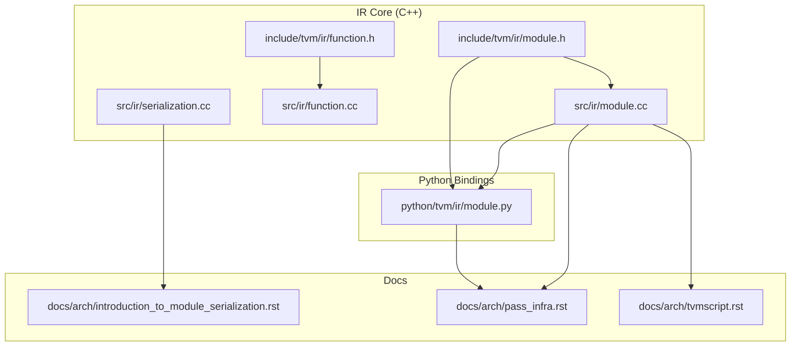
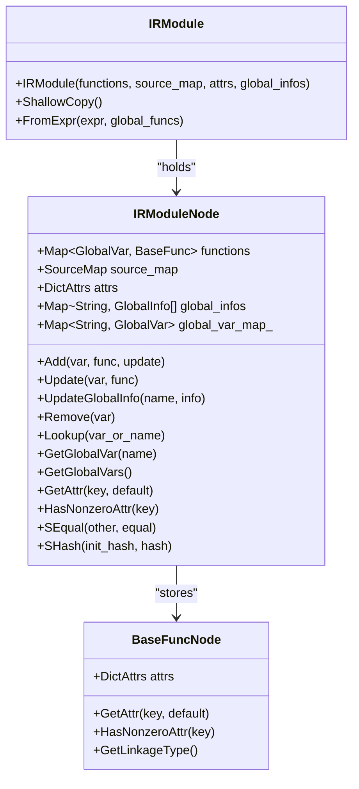
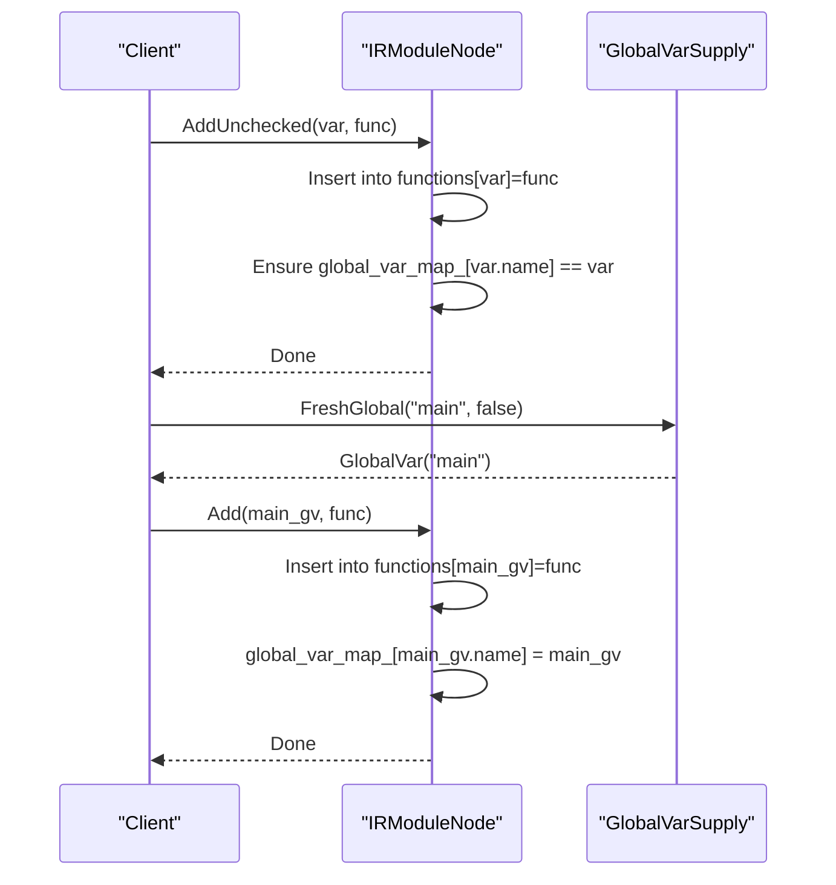
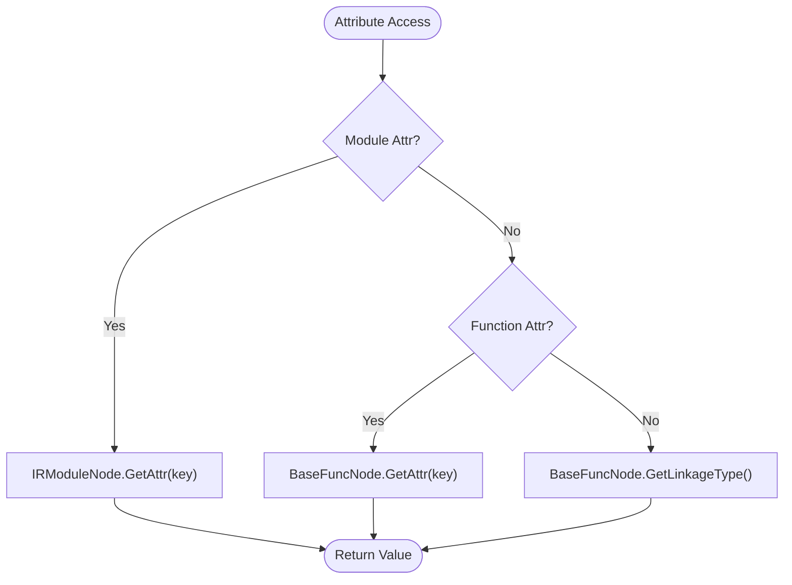
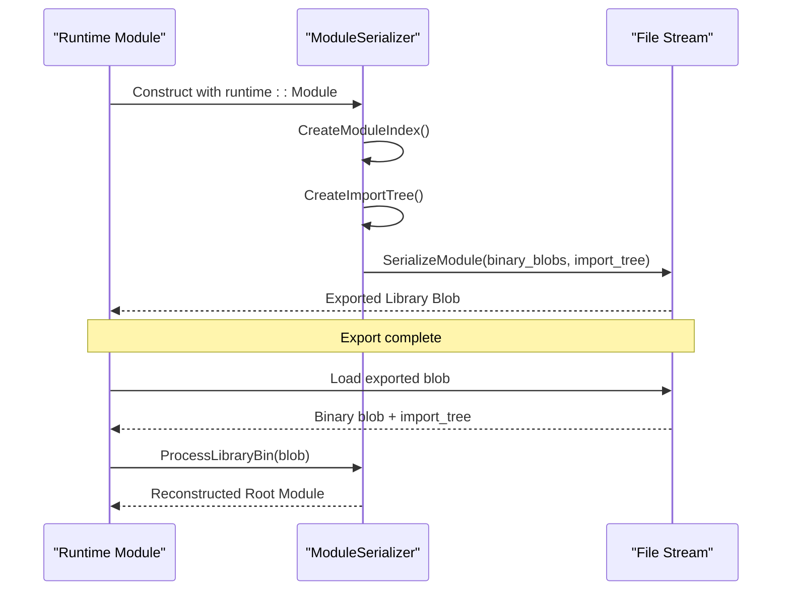
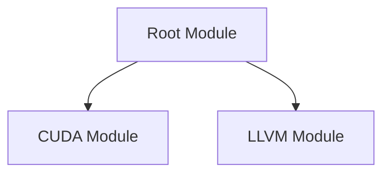
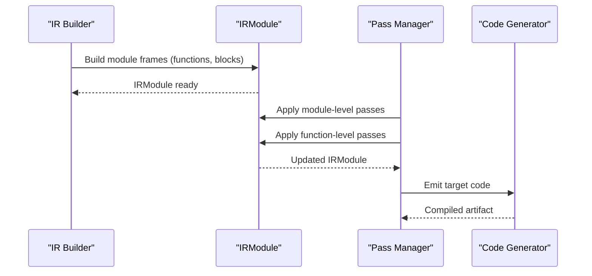
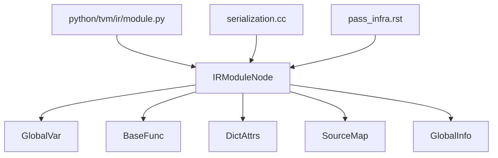

# IR Module System

<cite>
**Referenced Files in This Document**
- [module.h](file://include/tvm/ir/module.h)
- [module.cc](file://src/ir/module.cc)
- [module.py](file://python/tvm/ir/module.py)
- [function.h](file://include/tvm/ir/function.h)
- [function.cc](file://src/ir/function.cc)
- [serialization.cc](file://src/ir/serialization.cc)
- [introduction_to_module_serialization.rst](file://docs/arch/introduction_to_module_serialization.rst)
- [pass_infra.rst](file://docs/arch/pass_infra.rst)
- [tvmscript.rst](file://docs/arch/tvmscript.rst)
</cite>

## Table of Contents
1. [Introduction](#introduction)
2. [Project Structure](#project-structure)
3. [Core Components](#core-components)
4. [Architecture Overview](#architecture-overview)
5. [Detailed Component Analysis](#detailed-component-analysis)
6. [Dependency Analysis](#dependency-analysis)
7. [Performance Considerations](#performance-considerations)
8. [Troubleshooting Guide](#troubleshooting-guide)
9. [Conclusion](#conclusion)
10. [Appendices](#appendices)

## Introduction
This document explains the IR module system in TVM as the central container for organized collections of functions and global variables. It covers module construction, function registration, attribute management, serialization/deserialization, inter-module dependencies, and the module’s role in the broader compilation pipeline. Practical examples illustrate module manipulation, function extraction, and composition patterns, along with how modules coordinate with pass infrastructure and code generation phases.

## Project Structure
The IR module system spans C++ core headers and implementations, Python FFI bindings, and documentation that describes serialization and pass infrastructure. The key files are:
- C++ header and implementation for IRModule
- Python bindings for IRModule
- Function and BaseFunc attribute definitions
- Serialization utilities and module serialization documentation
- Pass infrastructure documentation
- TVMScript builder documentation that constructs IRModule frames

**Diagram sources**
- [module.h:44-307](file://include/tvm/ir/module.h#L44-L307)
- [module.cc:37-319](file://src/ir/module.cc#L37-L319)
- [function.h:36-239](file://include/tvm/ir/function.h#L36-L239)
- [function.cc:31-86](file://src/ir/function.cc#L31-L86)
- [serialization.cc:24-47](file://src/ir/serialization.cc#L24-L47)
- [module.py:31-312](file://python/tvm/ir/module.py#L31-L312)
- [introduction_to_module_serialization.rst:18-194](file://docs/arch/introduction_to_module_serialization.rst#L18-L194)
- [pass_infra.rst:18-671](file://docs/arch/pass_infra.rst#L18-L671)
- [tvmscript.rst:209-245](file://docs/arch/tvmscript.rst#L209-L245)

**Section sources**
- [module.h:44-307](file://include/tvm/ir/module.h#L44-L307)
- [module.cc:37-319](file://src/ir/module.cc#L37-L319)
- [module.py:31-312](file://python/tvm/ir/module.py#L31-L312)
- [function.h:36-239](file://include/tvm/ir/function.h#L36-L239)
- [function.cc:31-86](file://src/ir/function.cc#L31-L86)
- [serialization.cc:24-47](file://src/ir/serialization.cc#L24-L47)
- [introduction_to_module_serialization.rst:18-194](file://docs/arch/introduction_to_module_serialization.rst#L18-L194)
- [pass_infra.rst:18-671](file://docs/arch/pass_infra.rst#L18-L671)
- [tvmscript.rst:209-245](file://docs/arch/tvmscript.rst#L209-L245)

## Core Components
- IRModuleNode: The core container holding:
  - functions: a map from GlobalVar to BaseFunc
  - source_map: per-module source map
  - attrs: DictAttrs for module-level metadata
  - global_infos: arrays of global info objects keyed by string
  - global_var_map_: a map from string names to GlobalVar ensuring uniqueness
- IRModule: Managed reference to IRModuleNode with constructors, copy, and convenience methods
- BaseFunc and function attributes: BaseFuncNode stores DictAttrs and supports attribute queries and linkage type detection via attributes

Key capabilities:
- Add/Update/Remove functions
- Lookup by GlobalVar or string name
- Attribute management (get, has-nonzero, set/remove)
- Global variable management and uniqueness enforcement
- Structural equality/hash for module comparison
- Creation from expressions and shallow copying

**Section sources**
- [module.h:58-251](file://include/tvm/ir/module.h#L58-L251)
- [module.cc:41-228](file://src/ir/module.cc#L41-L228)
- [function.h:139-236](file://include/tvm/ir/function.h#L139-L236)
- [function.cc:33-83](file://src/ir/function.cc#L33-L83)

## Architecture Overview
IRModule is the foundational unit for all IR transformations across Relax and TensorIR. Passes operate on IRModule, and the module participates in serialization/deserialization to produce deployable artifacts.

**Diagram sources**
- [module.h:58-251](file://include/tvm/ir/module.h#L58-L251)
- [module.cc:41-228](file://src/ir/module.cc#L41-L228)
- [function.h:139-236](file://include/tvm/ir/function.h#L139-L236)

**Section sources**
- [module.h:58-251](file://include/tvm/ir/module.h#L58-L251)
- [module.cc:41-228](file://src/ir/module.cc#L41-L228)
- [function.h:139-236](file://include/tvm/ir/function.h#L139-L236)

## Detailed Component Analysis

### Module Construction and Function Registration
- Construction validates uniqueness of global function names and builds the global_var_map_.
- Add/AddUnchecked/Add updates the functions map and global_var_map_.
- Update replaces an existing function; Remove erases entries from both maps.
- Lookup supports both GlobalVar and string name lookups.

**Diagram sources**
- [module.cc:147-164](file://src/ir/module.cc#L147-L164)
- [module.cc:203-228](file://src/ir/module.cc#L203-L228)

**Section sources**
- [module.cc:147-164](file://src/ir/module.cc#L147-L164)
- [module.cc:203-228](file://src/ir/module.cc#L203-L228)

### Attribute Management
- Module-level attributes are stored in DictAttrs and accessed via GetAttr and HasNonzeroAttr.
- Function-level attributes are stored in BaseFuncNode.attrs and accessed similarly.
- Linkage type detection uses function attributes to determine external/internal linkage.

**Diagram sources**
- [module.h:93-130](file://include/tvm/ir/module.h#L93-L130)
- [function.h:163-218](file://include/tvm/ir/function.h#L163-L218)

**Section sources**
- [module.h:93-130](file://include/tvm/ir/module.h#L93-L130)
- [function.h:163-218](file://include/tvm/ir/function.h#L163-L218)

### Serialization and Deserialization
- Serialization utilities expose SaveJSON/LoadJSON for AST/IR objects.
- Module serialization integrates with runtime modules, packing binary blobs and import trees for export and loading.
- Deserialization reconstructs module import relationships using stored metadata.

**Diagram sources**
- [serialization.cc:31-46](file://src/ir/serialization.cc#L31-L46)
- [introduction_to_module_serialization.rst:52-194](file://docs/arch/introduction_to_module_serialization.rst#L52-L194)

**Section sources**
- [serialization.cc:31-46](file://src/ir/serialization.cc#L31-L46)
- [introduction_to_module_serialization.rst:52-194](file://docs/arch/introduction_to_module_serialization.rst#L52-L194)

### Inter-Module Dependencies
- Modules can import other modules; serialization encodes import relationships using an import tree stored in CSR-like format.
- Deserialization restores the import hierarchy to ensure symbol visibility and correct linkage.

**Diagram sources**
- [introduction_to_module_serialization.rst:76-93](file://docs/arch/introduction_to_module_serialization.rst#L76-L93)

**Section sources**
- [introduction_to_module_serialization.rst:76-93](file://docs/arch/introduction_to_module_serialization.rst#L76-L93)

### Relationship to Compilation Pipeline and Pass Infrastructure
- Passes operate on IRModule and can add/delete functions globally.
- Module-level passes coordinate IPO and global transformations; function-level passes optimize within functions.
- The pass infrastructure manages pass scheduling, dependency resolution, and instrumentation.

**Diagram sources**
- [pass_infra.rst:166-286](file://docs/arch/pass_infra.rst#L166-L286)
- [tvmscript.rst:209-245](file://docs/arch/tvmscript.rst#L209-L245)

**Section sources**
- [pass_infra.rst:166-286](file://docs/arch/pass_infra.rst#L166-L286)
- [tvmscript.rst:209-245](file://docs/arch/tvmscript.rst#L209-L245)

### Examples and Patterns

- Module manipulation (Python)
  - Constructing a module from a dictionary of functions and attributes
  - Adding/removing/updating functions
  - Getting/setting module attributes
  - Looking up functions by name or GlobalVar

- Function extraction and composition
  - Extract a function by name or GlobalVar
  - Compose modules by merging via Update
  - Replace GlobalVar references across the module using replace_global_vars

- Module composition patterns
  - Merge modules using update to combine function sets
  - Use FromExpr to wrap a Relax expression into a module with a main entrypoint

These patterns are exposed through Python bindings and backed by C++ implementations.

**Section sources**
- [module.py:43-312](file://python/tvm/ir/module.py#L43-L312)
- [module.cc:192-228](file://src/ir/module.cc#L192-L228)

## Dependency Analysis
- IRModuleNode depends on:
  - GlobalVar and BaseFunc for identity and function representation
  - DictAttrs for metadata
  - SourceMap for source location tracking
  - GlobalInfo for global static objects
- Python IRModule delegates to FFI APIs for Add/Remove/Update/Lookup/Attributes
- Serialization relies on JSON graph utilities and runtime module packaging
- Pass infrastructure orchestrates module-level transformations

**Diagram sources**
- [module.h:58-251](file://include/tvm/ir/module.h#L58-L251)
- [module.cc:41-228](file://src/ir/module.cc#L41-L228)
- [module.py:31-312](file://python/tvm/ir/module.py#L31-L312)
- [serialization.cc:24-47](file://src/ir/serialization.cc#L24-L47)
- [pass_infra.rst:166-286](file://docs/arch/pass_infra.rst#L166-L286)

**Section sources**
- [module.h:58-251](file://include/tvm/ir/module.h#L58-L251)
- [module.cc:41-228](file://src/ir/module.cc#L41-L228)
- [module.py:31-312](file://python/tvm/ir/module.py#L31-L312)
- [serialization.cc:24-47](file://src/ir/serialization.cc#L24-L47)
- [pass_infra.rst:166-286](file://docs/arch/pass_infra.rst#L166-L286)

## Performance Considerations
- Structural equality and hashing sort functions by name to ensure deterministic comparisons and hashing across modules.
- Global variable lookups are O(1) average via maps; ordering functions for iteration is supported for reproducibility.
- Serialization packs binary blobs and import trees efficiently for export and load.

[No sources needed since this section provides general guidance]

## Troubleshooting Guide
- Duplicate global function name: Construction and AddUnchecked enforce uniqueness; errors indicate conflicting names.
- Missing global variable: GetGlobalVar raises when a name is not present; the error lists candidates.
- Attribute access: Ensure correct key types and defaults when retrieving attributes.
- Pass failures: Use pass instrumentation to capture diagnostics and timing around module-level transformations.

**Section sources**
- [module.cc:50-55](file://src/ir/module.cc#L50-L55)
- [module.cc:117-134](file://src/ir/module.cc#L117-L134)
- [pass_infra.rst:390-537](file://docs/arch/pass_infra.rst#L390-L537)

## Conclusion
IRModule is the central container for organizing functions and metadata across TVM’s IR stack. It supports robust function registration, attribute management, and global variable uniqueness. Its integration with pass infrastructure enables coordinated optimization, while serialization/deserialization ensures portable deployment. The Python bindings provide ergonomic manipulation for common tasks such as module composition, function extraction, and attribute management.

[No sources needed since this section summarizes without analyzing specific files]

## Appendices

### API Surface Summary
- Module construction and mutation: Add, AddUnchecked, Update, Remove, UpdateGlobalInfo, ShallowCopy, FromExpr
- Lookup: Lookup by GlobalVar or string name, GetGlobalVar, GetGlobalVars
- Attributes: GetAttr, GetAttrs, HasNonzeroAttr, WithAttr/WithAttrs/WithoutAttr
- Python bindings: __setitem__, __getitem__, __delitem__, __contains__, update, update_func, update_global_info, replace_global_vars, get_attr, with_attr, without_attr, with_attrs

**Section sources**
- [module.h:153-241](file://include/tvm/ir/module.h#L153-L241)
- [module.cc:147-228](file://src/ir/module.cc#L147-L228)
- [module.py:84-312](file://python/tvm/ir/module.py#L84-L312)