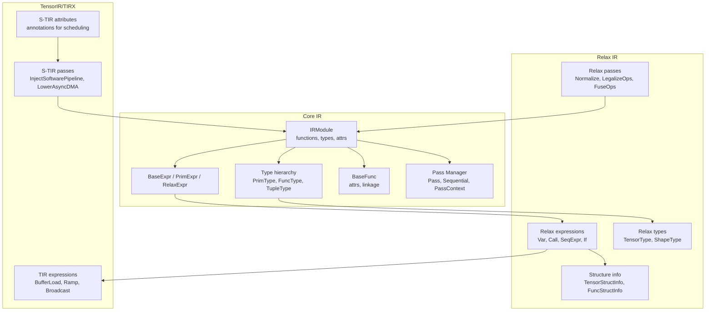
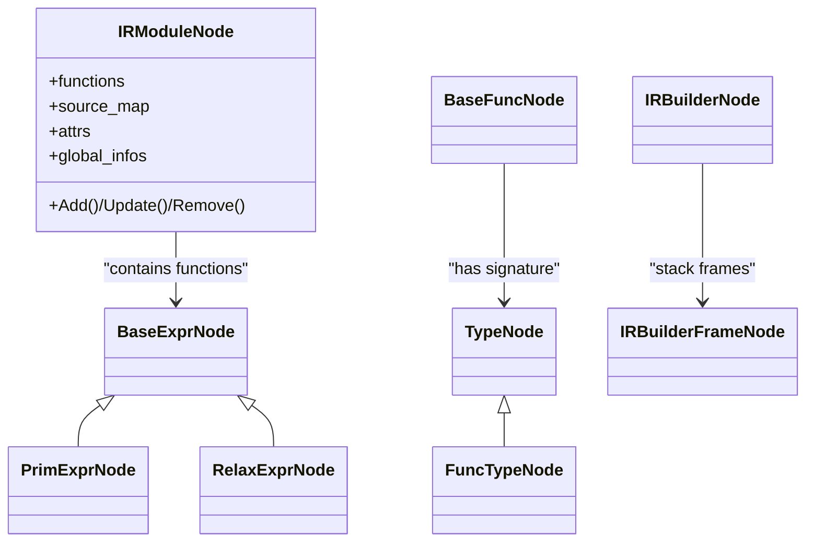
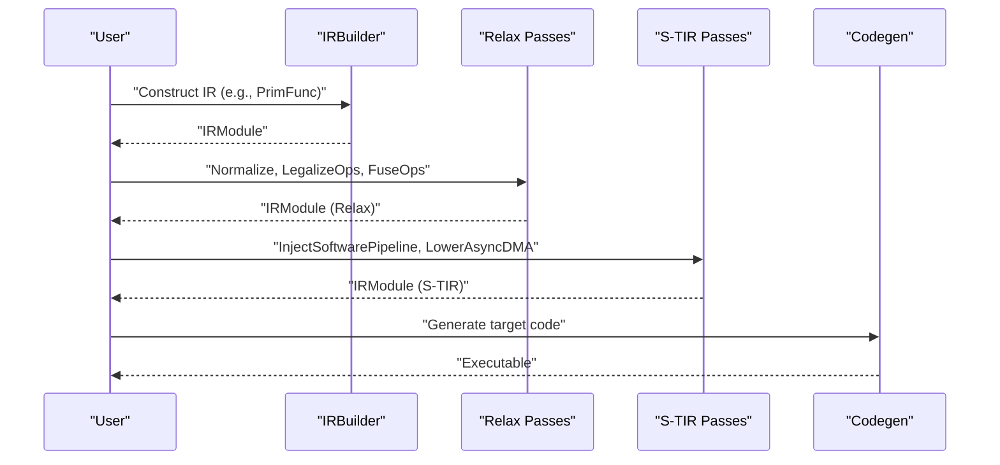
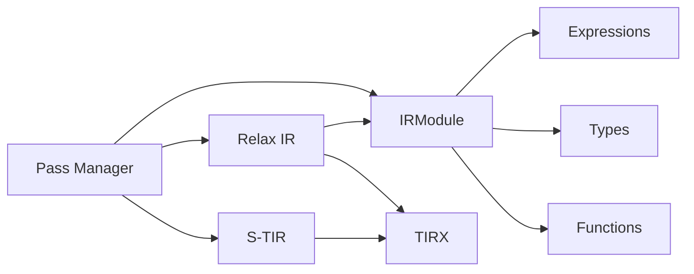

# Intermediate Representations (IR)

<cite>
**Referenced Files in This Document**
- [module.h](file://include/tvm/ir/module.h)
- [expr.h](file://include/tvm/ir/expr.h)
- [type.h](file://include/tvm/ir/type.h)
- [function.h](file://include/tvm/ir/function.h)
- [transform.h](file://include/tvm/ir/transform.h)
- [relax/expr.h](file://include/tvm/relax/expr.h)
- [relax/type.h](file://include/tvm/relax/type.h)
- [relax/struct_info.h](file://include/tvm/relax/struct_info.h)
- [relax/transform.h](file://include/tvm/relax/transform.h)
- [tirx/expr.h](file://include/tvm/tirx/expr.h)
- [s_tir/stmt.h](file://include/tvm/s_tir/stmt.h)
- [s_tir/transform.h](file://include/tvm/s_tir/transform.h)
- [script/ir_builder/base.h](file://include/tvm/script/ir_builder/base.h)
</cite>

## Table of Contents
1. [Introduction](#introduction)
2. [Project Structure](#project-structure)
3. [Core Components](#core-components)
4. [Architecture Overview](#architecture-overview)
5. [Detailed Component Analysis](#detailed-component-analysis)
6. [Dependency Analysis](#dependency-analysis)
7. [Performance Considerations](#performance-considerations)
8. [Troubleshooting Guide](#troubleshooting-guide)
9. [Conclusion](#conclusion)
10. [Appendices](#appendices)

## Introduction
This document explains TVM’s multi-level intermediate representation (IR) system and how it enables cross-level optimization. At the center is the unified IR module that hosts functions and types across dialects. Three primary IR layers are presented:
- TensorIR (low-level, TIR): Fine-grained loop nests, buffers, and scheduling annotations.
- Relax (high-level, neural networks): First-class tensors and functions, structure information, and dataflow.
- Script IR (declarative): A dialect-agnostic IR builder that constructs IR across layers.

We cover the IR module structure, expression and type systems, function definitions, and the transformation pass infrastructure. We also explain how these layers relate and how passes orchestrate cross-level transformations, including examples of construction, transformation, and serialization.

## Project Structure
The IR system is organized around a core IR module and dialect-specific extensions:
- Core IR: module, expressions, types, functions, and transformation pass manager.
- Relax IR: high-level expressions, structure information, and specialized passes.
- TensorIR/TIRX: low-level expressions, buffers, and scheduling annotations.
- S-TIR: schedulable TIR attributes and passes for GPU scheduling.
- Script IR Builder: a unified builder to construct IR across dialects.

**Diagram sources**
- [module.h:58-251](file://include/tvm/ir/module.h#L58-L251)
- [expr.h:51-800](file://include/tvm/ir/expr.h#L51-L800)
- [type.h:74-314](file://include/tvm/ir/type.h#L74-L314)
- [function.h:139-238](file://include/tvm/ir/function.h#L139-L238)
- [relax/expr.h:39-800](file://include/tvm/relax/expr.h#L39-L800)
- [relax/type.h:39-149](file://include/tvm/relax/type.h#L39-L149)
- [relax/struct_info.h:36-425](file://include/tvm/relax/struct_info.h#L36-L425)
- [tirx/expr.h:48-923](file://include/tvm/tirx/expr.h#L48-L923)
- [s_tir/stmt.h:32-244](file://include/tvm/s_tir/stmt.h#L32-L244)

**Section sources**
- [module.h:58-251](file://include/tvm/ir/module.h#L58-L251)
- [expr.h:51-800](file://include/tvm/ir/expr.h#L51-L800)
- [type.h:74-314](file://include/tvm/ir/type.h#L74-L314)
- [function.h:139-238](file://include/tvm/ir/function.h#L139-L238)
- [relax/expr.h:39-800](file://include/tvm/relax/expr.h#L39-L800)
- [relax/type.h:39-149](file://include/tvm/relax/type.h#L39-L149)
- [relax/struct_info.h:36-425](file://include/tvm/relax/struct_info.h#L36-L425)
- [tirx/expr.h:48-923](file://include/tvm/tirx/expr.h#L48-L923)
- [s_tir/stmt.h:32-244](file://include/tvm/s_tir/stmt.h#L32-L244)

## Core Components
- IRModule: central container holding global functions, source maps, attributes, and global info. Provides APIs to add/update/remove functions and to inspect module-level attributes.
- Expressions: BaseExpr (base), PrimExpr (low-level POD), RelaxExpr (high-level tensors/functions), and dialect-specific variants (e.g., tirx::Expr).
- Types: unified type system with PrimType, FuncType, TupleType, and dialect-specific types (e.g., relax::TensorType).
- Functions: BaseFunc with attributes and linkage; used across IR variants for cross-dialect calls.
- Transformation Pass Manager: Pass, Sequential, PassContext, and related utilities to orchestrate IRModule transformations.

Key capabilities:
- Cross-layer function calls via unified type system and BaseFunc.
- Attribute-driven module-level metadata and per-function attributes.
- Extensible pass infrastructure enabling cross-level optimizations.

**Section sources**
- [module.h:58-251](file://include/tvm/ir/module.h#L58-L251)
- [expr.h:51-800](file://include/tvm/ir/expr.h#L51-L800)
- [type.h:74-314](file://include/tvm/ir/type.h#L74-L314)
- [function.h:139-238](file://include/tvm/ir/function.h#L139-L238)
- [transform.h:79-568](file://include/tvm/ir/transform.h#L79-L568)

## Architecture Overview
The IR layers form a hierarchy:
- Core IR provides the foundation (IRModule, expressions, types, functions).
- Relax extends the core with high-level constructs and structure information.
- TensorIR/TIRX provides low-level constructs and scheduling annotations.
- S-TIR annotates TIR with scheduling hints and meta-schedule attributes.
- Script IR Builder offers a unified construction interface across dialects.

**Diagram sources**
- [module.h:58-251](file://include/tvm/ir/module.h#L58-L251)
- [expr.h:51-800](file://include/tvm/ir/expr.h#L51-L800)
- [type.h:74-314](file://include/tvm/ir/type.h#L74-L314)
- [function.h:139-238](file://include/tvm/ir/function.h#L139-L238)
- [script/ir_builder/base.h:159-311](file://include/tvm/script/ir_builder/base.h#L159-L311)

## Detailed Component Analysis

### IR Module and Unified Type System
- IRModuleNode maintains a map of global functions, source map, module attributes, and global info. It supports add/update/remove and lookup by GlobalVar or string name.
- BaseExprNode carries a span for source mapping; PrimExprNode adds dtype; RelaxExprNode adds struct_info_ for high-level structure.
- TypeNode hierarchy includes PrimType (primitive dtype), FuncType (argument and return types), TupleType (product types), and dialect-specific types.
- BaseFuncNode carries DictAttrs and linkage detection via attributes.

Design rationale:
- Centralized module container enables cross-level transformations and function-level passes.
- Unified type system across dialects allows cross-dialect function calls and signature compatibility.

**Section sources**
- [module.h:58-251](file://include/tvm/ir/module.h#L58-L251)
- [expr.h:51-800](file://include/tvm/ir/expr.h#L51-L800)
- [type.h:74-314](file://include/tvm/ir/type.h#L74-L314)
- [function.h:139-238](file://include/tvm/ir/function.h#L139-L238)

### Relax IR: High-Level Neural Network Operations
- Expressions: Var/DataflowVar, Constant, PrimValue, ShapeExpr, Call, SeqExpr, If, Tuple, TupleGetItem, MatchCast, and binding blocks.
- Types: TensorType (dynamic tensor), ShapeType, ObjectType, PackedFuncType.
- Structure Information: TensorStructInfo, ShapeStructInfo, TupleStructInfo, FuncStructInfo, and helpers to update and query struct info.
- Passes: Normalize, LegalizeOps, FuseOps, FuseTIR, DeadCodeElimination, StaticPlanBlockMemory, Layout conversions, and more.

Design rationale:
- First-class tensors and functions with structure information enable high-level reasoning and optimizations.
- Dataflow blocks and MatchCast support precise shape and device annotations.

**Section sources**
- [relax/expr.h:39-800](file://include/tvm/relax/expr.h#L39-L800)
- [relax/type.h:39-149](file://include/tvm/relax/type.h#L39-L149)
- [relax/struct_info.h:36-425](file://include/tvm/relax/struct_info.h#L36-L425)
- [relax/transform.h:38-688](file://include/tvm/relax/transform.h#L38-L688)

### TensorIR/TIRX: Low-Level Computations and Scheduling
- Expressions: Cast, arithmetic/logical ops, BufferLoad, ProducerLoad, Ramp, Broadcast, Let, Call, Shuffle, CommReducer, and more.
- Statement attributes (S-TIR): extensive annotations for async, double buffering, tensor core fragments, software pipeline, vectorization, warp execution, layout transforms, and meta-schedule hints.
- Passes: CanonicalizeLoop, LowerInitBlock, PlanAndUpdateBufferAllocationLocation, InjectSoftwarePipeline, LowerAsyncDMA, DefaultGPU schedules, and many others.

Design rationale:
- Low-level expressions and buffer modeling enable precise code generation and scheduling.
- S-TIR attributes provide scheduling directives and meta-schedule hints for automated tuning.

**Section sources**
- [tirx/expr.h:48-923](file://include/tvm/tirx/expr.h#L48-L923)
- [s_tir/stmt.h:32-244](file://include/tvm/s_tir/stmt.h#L32-L244)
- [s_tir/transform.h:46-375](file://include/tvm/s_tir/transform.h#L46-L375)

### Script IR Builder: Declarative Construction Across Layers
- IRBuilderNode maintains a stack of IRBuilderFrame nodes and a result object. It supports finding/getting frames and retrieving the constructed IR.
- IRBuilderFrameNode tracks callbacks and lifecycle for RAII scopes.
- The builder enables constructing IR across dialects (e.g., TIR PrimFunc frames, S-Blocks) and integrates with pass contexts.

Design rationale:
- A dialect-agnostic builder simplifies IR construction and reduces boilerplate across layers.

**Section sources**
- [script/ir_builder/base.h:159-311](file://include/tvm/script/ir_builder/base.h#L159-L311)

### Cross-Level Optimization Workflow
Typical workflow:
1. Construct IR using Script IR Builder or dialect-specific builders.
2. Apply Relax passes (e.g., LegalizeOps, FuseOps) to convert high-level ops to call_tir and fuse operators.
3. Lower to TIR and apply S-TIR passes (e.g., InjectSoftwarePipeline, LowerAsyncDMA) for scheduling.
4. Generate code via target-specific codegen.

**Diagram sources**
- [relax/transform.h:254-361](file://include/tvm/relax/transform.h#L254-L361)
- [s_tir/transform.h:205-375](file://include/tvm/s_tir/transform.h#L205-L375)
- [transform.h:444-568](file://include/tvm/ir/transform.h#L444-L568)

## Dependency Analysis
- IRModule depends on expressions, types, and functions to maintain a coherent IR graph.
- Relax IR depends on core IR for expressions/types and on TIRX for low-level constructs.
- S-TIR depends on TIRX expressions and attributes to annotate scheduling.
- Pass manager orchestrates transformations across layers.

**Diagram sources**
- [module.h:58-251](file://include/tvm/ir/module.h#L58-L251)
- [relax/expr.h:39-800](file://include/tvm/relax/expr.h#L39-L800)
- [tirx/expr.h:48-923](file://include/tvm/tirx/expr.h#L48-L923)
- [s_tir/stmt.h:32-244](file://include/tvm/s_tir/stmt.h#L32-L244)
- [transform.h:444-568](file://include/tvm/ir/transform.h#L444-L568)

**Section sources**
- [module.h:58-251](file://include/tvm/ir/module.h#L58-L251)
- [relax/expr.h:39-800](file://include/tvm/relax/expr.h#L39-L800)
- [tirx/expr.h:48-923](file://include/tvm/tirx/expr.h#L48-L923)
- [s_tir/stmt.h:32-244](file://include/tvm/s_tir/stmt.h#L32-L244)
- [transform.h:444-568](file://include/tvm/ir/transform.h#L444-L568)

## Performance Considerations
- Use structure information (Relax StructInfo) to guide optimizations and reduce runtime checks.
- Apply S-TIR passes to exploit hardware-specific features (e.g., async copies, tensor cores, warp execution).
- Canonicalize loops and compact buffer allocations to improve locality and reduce overhead.
- Leverage pass sequencing and pass context configuration to balance optimization time and quality.

## Troubleshooting Guide
- Attribute conflicts: IRModule supports module-level attributes (e.g., system library prefix). Verify attribute correctness to avoid symbol conflicts.
- Pass context configuration: Use PassContext to control optimization levels and pass enablement.
- Structural equality/hash: Ensure struct_info_ and variable identity are handled consistently across transformations.

**Section sources**
- [module.h:309-366](file://include/tvm/ir/module.h#L309-L366)
- [transform.h:79-301](file://include/tvm/ir/transform.h#L79-L301)

## Conclusion
TVM’s multi-level IR system unifies high-level neural network semantics (Relax), precise low-level computation (TensorIR/TIRX), and schedulable annotations (S-TIR), all orchestrated by a robust pass manager. The Script IR Builder simplifies construction across dialects, while the transformation infrastructure enables powerful cross-level optimizations. Together, these components provide a flexible and efficient path from high-level models to target-specific executables.

## Appendices

### Practical Examples (by reference)
- IR construction with Script IR Builder:
  - [script/ir_builder/base.h:159-311](file://include/tvm/script/ir_builder/base.h#L159-L311)
- Relax normalization and legalization:
  - [relax/transform.h:160-256](file://include/tvm/relax/transform.h#L160-L256)
- S-TIR scheduling and lowering:
  - [s_tir/transform.h:205-375](file://include/tvm/s_tir/transform.h#L205-L375)
- Pass orchestration:
  - [transform.h:444-568](file://include/tvm/ir/transform.h#L444-L568)