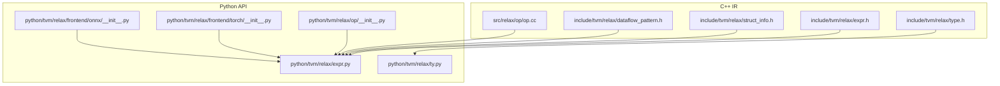
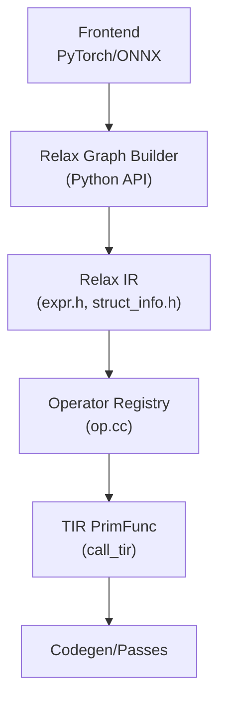
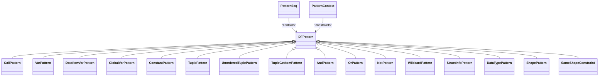
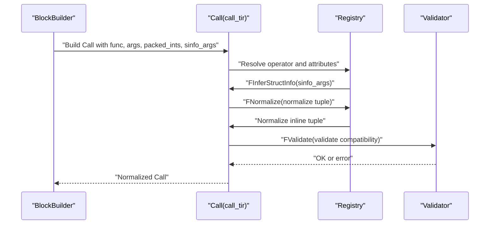
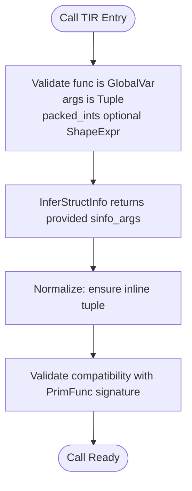
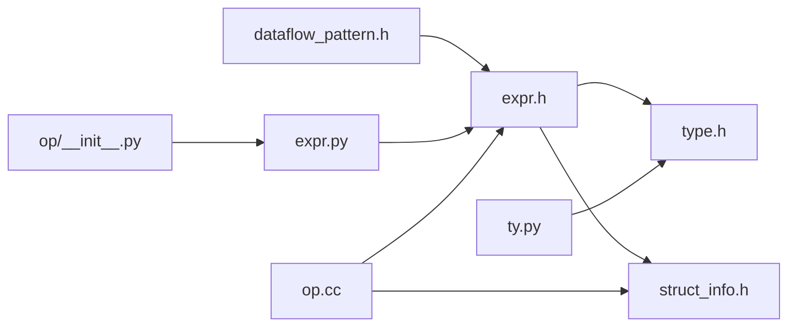

# Relax High-Level Operations

<cite>
**Referenced Files in This Document**
- [expr.h](file://include/tvm/relax/expr.h)
- [type.h](file://include/tvm/relax/type.h)
- [struct_info.h](file://include/tvm/relax/struct_info.h)
- [expr.py](file://python/tvm/relax/expr.py)
- [ty.py](file://python/tvm/relax/ty.py)
- [dataflow_pattern.h](file://include/tvm/relax/dataflow_pattern.h)
- [op.cc](file://src/relax/op/op.cc)
- [frontend/torch/__init__.py](file://python/tvm/relax/frontend/torch/__init__.py)
- [frontend/onnx/__init__.py](file://python/tvm/relax/frontend/onnx/__init__.py)
- [op/__init__.py](file://python/tvm/relax/op/__init__.py)
</cite>

## Table of Contents
1. [Introduction](#introduction)
2. [Project Structure](#project-structure)
3. [Core Components](#core-components)
4. [Architecture Overview](#architecture-overview)
5. [Detailed Component Analysis](#detailed-component-analysis)
6. [Dependency Analysis](#dependency-analysis)
7. [Performance Considerations](#performance-considerations)
8. [Troubleshooting Guide](#troubleshooting-guide)
9. [Conclusion](#conclusion)
10. [Appendices](#appendices)

## Introduction
This document explains Relax as TVM’s neural network intermediate representation (IR) for high-level operations. It covers expression types (Call, Var, Constant, Tuple, and related constructs), operator attributes, structural typing, dataflow analysis, shape inference, type checking, and the relationship between Relax expressions and their TensorIR (TIR) implementations. It also documents operator registries, custom operator development, and front-end conversions from PyTorch and ONNX.

## Project Structure
Relax spans both C++ headers and Python APIs:
- C++ IR definitions for expressions, types, structural information, and dataflow patterns
- Python wrappers and operator registries for high-level usage
- Operator implementations and normalization/validation logic
- Front-end translators for PyTorch and ONNX

**Diagram sources**
- [expr.h:141-195](file://include/tvm/relax/expr.h#L141-L195)
- [type.h:66-109](file://include/tvm/relax/type.h#L66-L109)
- [struct_info.h:144-216](file://include/tvm/relax/struct_info.h#L144-L216)
- [dataflow_pattern.h:469-501](file://include/tvm/relax/dataflow_pattern.h#L469-L501)
- [op.cc:576-620](file://src/relax/op/op.cc#L576-L620)
- [expr.py:532-584](file://python/tvm/relax/expr.py#L532-L584)
- [ty.py:28-68](file://python/tvm/relax/ty.py#L28-L68)
- [op/__init__.py:24-47](file://python/tvm/relax/op/__init__.py#L24-L47)
- [frontend/torch/__init__.py:22-25](file://python/tvm/relax/frontend/torch/__init__.py#L22-L25)
- [frontend/onnx/__init__.py:22-23](file://python/tvm/relax/frontend/onnx/__init__.py#L22-L23)

**Section sources**
- [expr.h:141-195](file://include/tvm/relax/expr.h#L141-L195)
- [type.h:66-109](file://include/tvm/relax/type.h#L66-L109)
- [struct_info.h:144-216](file://include/tvm/relax/struct_info.h#L144-L216)
- [dataflow_pattern.h:469-501](file://include/tvm/relax/dataflow_pattern.h#L469-L501)
- [op.cc:576-620](file://src/relax/op/op.cc#L576-L620)
- [expr.py:532-584](file://python/tvm/relax/expr.py#L532-L584)
- [ty.py:28-68](file://python/tvm/relax/ty.py#L28-L68)
- [op/__init__.py:24-47](file://python/tvm/relax/op/__init__.py#L24-L47)
- [frontend/torch/__init__.py:22-25](file://python/tvm/relax/frontend/torch/__init__.py#L22-L25)
- [frontend/onnx/__init__.py:22-23](file://python/tvm/relax/frontend/onnx/__init__.py#L22-L23)

## Core Components
- Expressions
  - Call: operator invocation with attributes and structure info arguments
  - Var/DataflowVar: binding variables with structural annotations
  - Constant: constant tensors
  - Tuple/TupleGetItem: grouping and projection
  - ShapeExpr: shape expressions containing PrimExpr
  - PrimValue/StringImm/DataTypeImm: POD and immediate values
  - SeqExpr/If: sequencing and conditionals
  - BindingBlock/DataflowBlock: scoping and dataflow blocks
  - MatchCast: runtime-matching and casting to a structural pattern
- Types
  - TensorType: dynamic tensor type with ndim and dtype
  - ShapeType: shape type with ndim
  - ObjectType/PackedFuncType: object and external function types
- Structural Information (StructInfo)
  - TensorStructInfo: tensor shape/dtype/vdevice/ndim
  - ShapeStructInfo: shape patterns/values/ndim
  - TupleStructInfo: tuple field struct infos
  - FuncStructInfo: function signature struct info with purity
  - ObjectStructInfo/PrimStructInfo: base and primitive struct info
- Dataflow Patterns
  - DFPattern hierarchy for matching Relax graphs and enforcing structural constraints
  - PatternSeq, OrPattern, AndPattern, NotPattern, Attr/StructInfo/Shape constraints
- Operators and Registry
  - Built-in operators (e.g., call_tir, call_pure_packed, call_inplace_packed)
  - Registration of FInferStructInfo, FNormalize, FValidate, FPurity
  - Python operator exports and make functions

**Section sources**
- [expr.h:141-195](file://include/tvm/relax/expr.h#L141-L195)
- [expr.h:210-291](file://include/tvm/relax/expr.h#L210-L291)
- [expr.h:344-458](file://include/tvm/relax/expr.h#L344-L458)
- [expr.h:465-564](file://include/tvm/relax/expr.h#L465-L564)
- [expr.h:605-795](file://include/tvm/relax/expr.h#L605-L795)
- [type.h:66-109](file://include/tvm/relax/type.h#L66-L109)
- [type.h:42-86](file://include/tvm/relax/type.h#L42-L86)
- [type.h:114-144](file://include/tvm/relax/type.h#L114-L144)
- [struct_info.h:144-216](file://include/tvm/relax/struct_info.h#L144-L216)
- [struct_info.h:97-139](file://include/tvm/relax/struct_info.h#L97-L139)
- [struct_info.h:263-357](file://include/tvm/relax/struct_info.h#L263-L357)
- [dataflow_pattern.h:469-501](file://include/tvm/relax/dataflow_pattern.h#L469-L501)
- [op.cc:576-620](file://src/relax/op/op.cc#L576-L620)

## Architecture Overview
Relax sits between high-level framework graphs (e.g., PyTorch/ONNX) and TIR. Operators defined in Relax can call into TIR PrimFuncs via call_tir, with explicit output StructInfo to guide shape inference and validation. The operator registry attaches inference, normalization, and validation logic to each operator.

**Diagram sources**
- [frontend/torch/__init__.py:22-25](file://python/tvm/relax/frontend/torch/__init__.py#L22-L25)
- [frontend/onnx/__init__.py:22-23](file://python/tvm/relax/frontend/onnx/__init__.py#L22-L23)
- [expr.py:532-584](file://python/tvm/relax/expr.py#L532-L584)
- [struct_info.h:144-216](file://include/tvm/relax/struct_info.h#L144-L216)
- [op.cc:576-620](file://src/relax/op/op.cc#L576-L620)

## Detailed Component Analysis

### Expression Types and Structural Typing
- Call
  - Fields: op, args, attrs, sinfo_args
  - Purpose: high-level operator invocation; supports intrinsic ops and ExternFuncs via sinfo_args
- Var/DataflowVar
  - Var carries a unique Id and optional StructInfo annotation
  - DataflowVar marks dataflow-bound variables
- Constant
  - Holds runtime::Tensor with optional StructInfo; scalar constants are ndim-0 tensors
- Tuple/TupleGetItem
  - Tuple groups expressions; TupleGetItem extracts fields
- ShapeExpr
  - Array of PrimExpr forming a symbolic shape
- PrimValue/StringImm/DataTypeImm
  - Represent POD and immediate values
- SeqExpr/If
  - SeqExpr introduces scoped blocks; If evaluates to the chosen branch
- MatchCast
  - Runtime-matches a value against a StructInfo pattern and populates shape/type variables

Structural typing
- StructInfo captures static type plus runtime structural information (shapes, dtypes, vdevice)
- TensorStructInfo encodes shape, dtype, ndim, and optional vdevice
- FuncStructInfo encodes parameter and return StructInfo, with optional derive_func for opaque functions

**Section sources**
- [expr.h:141-195](file://include/tvm/relax/expr.h#L141-L195)
- [expr.h:344-458](file://include/tvm/relax/expr.h#L344-L458)
- [expr.h:465-564](file://include/tvm/relax/expr.h#L465-L564)
- [expr.h:605-795](file://include/tvm/relax/expr.h#L605-L795)
- [struct_info.h:144-216](file://include/tvm/relax/struct_info.h#L144-L216)
- [struct_info.h:263-357](file://include/tvm/relax/struct_info.h#L263-L357)

### Dataflow Patterns and Matching
- DFPattern provides a typed pattern language for matching Relax graphs
- PatternSeq chains patterns with used-by semantics (^) and only-used-by (>>) constraints
- Constraints include:
  - AttrPattern: attribute presence
  - StructInfoPattern: structural type matching
  - DataTypePattern/ShapePattern: dtype/shape constraints
  - SameShapeConstraint: equality of shapes across patterns
- PatternContext manages edge constraints and validation constraints across the matched graph

**Diagram sources**
- [dataflow_pattern.h:469-501](file://include/tvm/relax/dataflow_pattern.h#L469-L501)
- [dataflow_pattern.h:342-361](file://include/tvm/relax/dataflow_pattern.h#L342-L361)
- [dataflow_pattern.h:368-420](file://include/tvm/relax/dataflow_pattern.h#L368-L420)
- [dataflow_pattern.h:426-440](file://include/tvm/relax/dataflow_pattern.h#L426-L440)
- [dataflow_pattern.h:575-594](file://include/tvm/relax/dataflow_pattern.h#L575-L594)
- [dataflow_pattern.h:629-653](file://include/tvm/relax/dataflow_pattern.h#L629-L653)
- [dataflow_pattern.h:659-709](file://include/tvm/relax/dataflow_pattern.h#L659-L709)
- [dataflow_pattern.h:712-734](file://include/tvm/relax/dataflow_pattern.h#L712-L734)
- [dataflow_pattern.h:740-768](file://include/tvm/relax/dataflow_pattern.h#L740-L768)
- [dataflow_pattern.h:774-793](file://include/tvm/relax/dataflow_pattern.h#L774-L793)

**Section sources**
- [dataflow_pattern.h:469-501](file://include/tvm/relax/dataflow_pattern.h#L469-L501)
- [dataflow_pattern.h:508-527](file://include/tvm/relax/dataflow_pattern.h#L508-L527)
- [dataflow_pattern.h:534-569](file://include/tvm/relax/dataflow_pattern.h#L534-L569)
- [dataflow_pattern.h:629-653](file://include/tvm/relax/dataflow_pattern.h#L629-L653)

### Operator Definitions, Attributes, and Registry
- call_tir
  - Purpose: call a TIR PrimFunc with explicit output StructInfo
  - Arguments: func (GlobalVar), args (Tuple), packed_ints (optional ShapeExpr)
  - Behavior: FInferStructInfo returns the provided sinfo_args; FNormalize ensures inline tuple; FValidate checks compatibility
- call_pure_packed
  - Purpose: call an opaque packed function with purity marked true
  - Attributes: none
  - Behavior: validates callee is opaque and derives return StructInfo via derive_func or ret
- call_inplace_packed
  - Purpose: call an opaque packed function with in-place outputs
  - Attributes: inplace_indices (array of indices)
  - Behavior: validates indices, uniqueness, and structural compatibility between return and in-place args

**Diagram sources**
- [op.cc:576-620](file://src/relax/op/op.cc#L576-L620)
- [op.cc:434-447](file://src/relax/op/op.cc#L434-L447)
- [op.cc:449-537](file://src/relax/op/op.cc#L449-L537)
- [op.cc:539-574](file://src/relax/op/op.cc#L539-L574)

**Section sources**
- [op.cc:576-620](file://src/relax/op/op.cc#L576-L620)
- [op.cc:89-113](file://src/relax/op/op.cc#L89-L113)
- [op.cc:140-228](file://src/relax/op/op.cc#L140-L228)

### Relationship Between Relax and TensorIR
- call_tir bridges Relax and TIR by invoking a TIR PrimFunc with explicit output StructInfo
- The operator enforces that the provided StructInfo is compatible with the PrimFunc signature
- Normalization ensures arguments are provided as an inline tuple or can be unwrapped from a variable binding

**Diagram sources**
- [op.cc:434-447](file://src/relax/op/op.cc#L434-L447)
- [op.cc:449-537](file://src/relax/op/op.cc#L449-L537)
- [op.cc:539-574](file://src/relax/op/op.cc#L539-L574)

**Section sources**
- [op.cc:434-447](file://src/relax/op/op.cc#L434-L447)
- [op.cc:449-537](file://src/relax/op/op.cc#L449-L537)
- [op.cc:539-574](file://src/relax/op/op.cc#L539-L574)

### Front-End Conversions: PyTorch and ONNX
- PyTorch
  - Exposed via frontend/torch/__init__.py: from_fx, from_exported_program, relax_dynamo, dynamo_capture_subgraphs
- ONNX
  - Exposed via frontend/onnx/__init__.py: from_onnx

These front-ends translate framework graphs into Relax expressions, leveraging Relax’s structural typing and operator registry for downstream passes and code generation.

**Section sources**
- [frontend/torch/__init__.py:22-25](file://python/tvm/relax/frontend/torch/__init__.py#L22-L25)
- [frontend/onnx/__init__.py:22-23](file://python/tvm/relax/frontend/onnx/__init__.py#L22-L23)

### Operator Registry and Custom Operator Development
- Operators are registered with:
  - FInferStructInfo: structural inference
  - FNormalize: normalization (e.g., tuple normalization)
  - FValidate: validation (e.g., compatibility checks)
  - FPurity: purity flag
- Python operator exports
  - python/tvm/relax/op/__init__.py exposes built-in operators and registers make functions
- Custom operator development
  - Define Op via TVM_REGISTER_OP
  - Attach FInferStructInfo/FNormalize/FValidate/FPurity
  - Provide Python make function and expose in op/__init__.py

**Section sources**
- [op.cc:576-620](file://src/relax/op/op.cc#L576-L620)
- [op/__init__.py:24-47](file://python/tvm/relax/op/__init__.py#L24-L47)
- [op/__init__.py:170-179](file://python/tvm/relax/op/__init__.py#L170-L179)

## Dependency Analysis
- IR dependencies
  - expr.h depends on type.h and struct_info.h for type and structural information
  - dataflow_pattern.h depends on expr.h for pattern matching
- Python API dependencies
  - expr.py and ty.py register objects and expose Python wrappers
  - op/__init__.py wires operator make functions into Python
- Operator dependencies
  - call_tir relies on StructInfo and BlockBuilder for normalization/validation
  - call_pure_packed/call_inplace_packed rely on FuncStructInfo and attribute types

**Diagram sources**
- [expr.h:141-195](file://include/tvm/relax/expr.h#L141-L195)
- [type.h:66-109](file://include/tvm/relax/type.h#L66-L109)
- [struct_info.h:144-216](file://include/tvm/relax/struct_info.h#L144-L216)
- [dataflow_pattern.h:469-501](file://include/tvm/relax/dataflow_pattern.h#L469-L501)
- [expr.py:532-584](file://python/tvm/relax/expr.py#L532-L584)
- [ty.py:28-68](file://python/tvm/relax/ty.py#L28-L68)
- [op/__init__.py:24-47](file://python/tvm/relax/op/__init__.py#L24-L47)
- [op.cc:576-620](file://src/relax/op/op.cc#L576-L620)

**Section sources**
- [expr.h:141-195](file://include/tvm/relax/expr.h#L141-L195)
- [type.h:66-109](file://include/tvm/relax/type.h#L66-L109)
- [struct_info.h:144-216](file://include/tvm/relax/struct_info.h#L144-L216)
- [dataflow_pattern.h:469-501](file://include/tvm/relax/dataflow_pattern.h#L469-L501)
- [expr.py:532-584](file://python/tvm/relax/expr.py#L532-L584)
- [ty.py:28-68](file://python/tvm/relax/ty.py#L28-L68)
- [op/__init__.py:24-47](file://python/tvm/relax/op/__init__.py#L24-L47)
- [op.cc:576-620](file://src/relax/op/op.cc#L576-L620)

## Performance Considerations
- Structural typing and inference reduce runtime checks by propagating shape/dtype information at compile-time
- call_tir normalization ensures inline tuples to minimize indirections
- Purity flags enable aggressive optimizations (e.g., dead-code elimination) when safe
- Dataflow patterns allow targeted rewriting and fusion guided by structural constraints

## Troubleshooting Guide
Common issues and resolutions:
- Shape mismatch in call_tir
  - Ensure provided sinfo_args matches the PrimFunc signature; validation compares inferred vs explicit StructInfo
- In-place mutation validation failures
  - Verify inplace_indices are unique, in-range, and that input/output shapes/dtypes match exactly
- Opaque function misuse
  - call_pure_packed/call_inplace_packed require opaque functions; otherwise, registration or usage will fail
- Attribute validation
  - For operators with attributes (e.g., inplace indices), ensure types and ranges are correct

**Section sources**
- [op.cc:539-574](file://src/relax/op/op.cc#L539-L574)
- [op.cc:676-763](file://src/relax/op/op.cc#L676-L763)
- [op.cc:89-113](file://src/relax/op/op.cc#L89-L113)

## Conclusion
Relax provides a structured, typed IR for high-level neural network operations, integrating tightly with TIR through call_tir and a robust operator registry. Its structural typing and dataflow patterns enable precise shape inference, validation, and optimization. Front-end translators from PyTorch and ONNX produce Relax graphs that leverage these capabilities for efficient deployment.

## Appendices

### Appendix A: Example Workflows
- Building a call_tir
  - Construct func (GlobalVar), args (Tuple), packed_ints (optional ShapeExpr), and sinfo_args (TensorStructInfo/TupleStructInfo)
  - The operator enforces normalization and validation before execution
- Using dataflow patterns
  - Compose DFPatterns to match subgraphs and enforce constraints (e.g., same shapes, dtype, or attribute presence)
- Developing a custom operator
  - Register Op with FInferStructInfo/FNormalize/FValidate/FPurity
  - Provide a Python make function and export it in op/__init__.py

**Section sources**
- [op.cc:576-620](file://src/relax/op/op.cc#L576-L620)
- [dataflow_pattern.h:469-501](file://include/tvm/relax/dataflow_pattern.h#L469-L501)
- [op/__init__.py:170-179](file://python/tvm/relax/op/__init__.py#L170-L179)