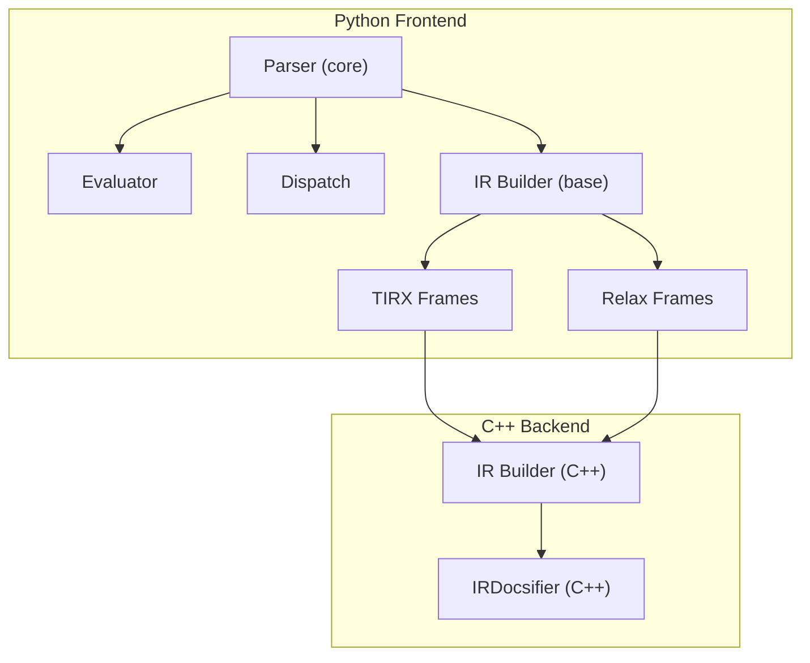
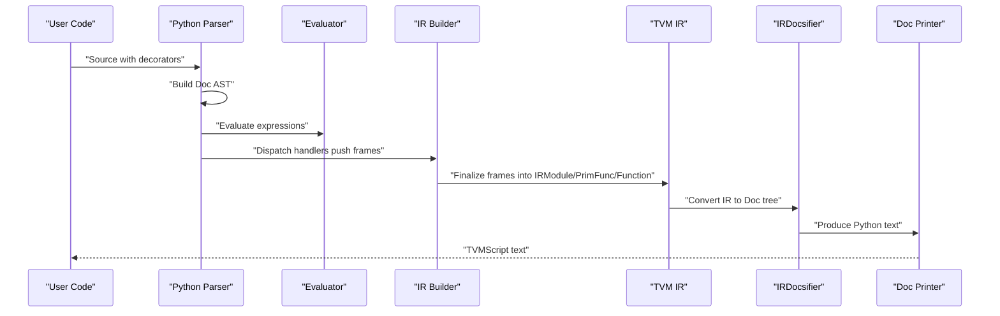
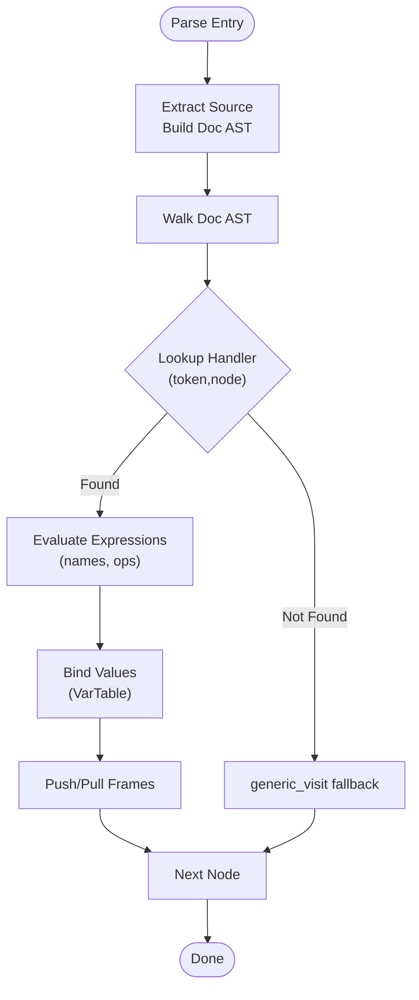
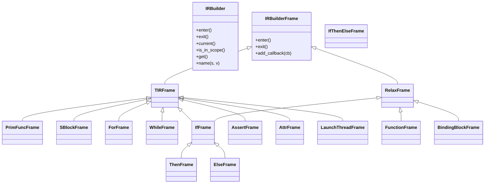
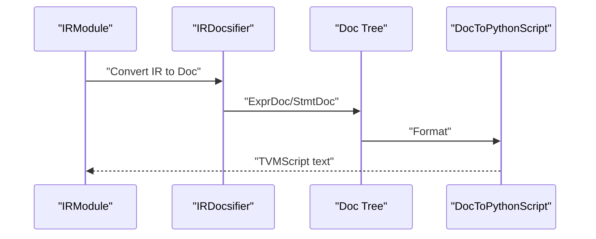
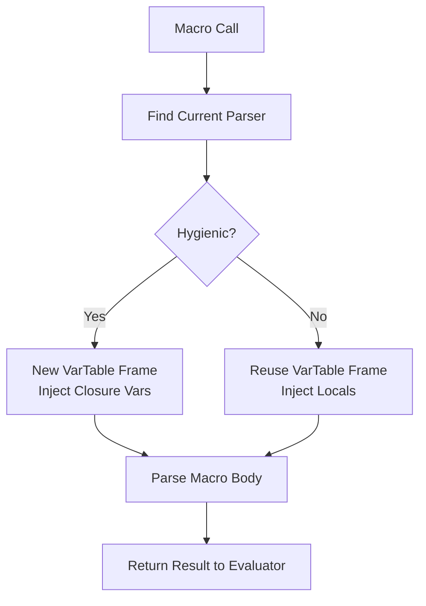
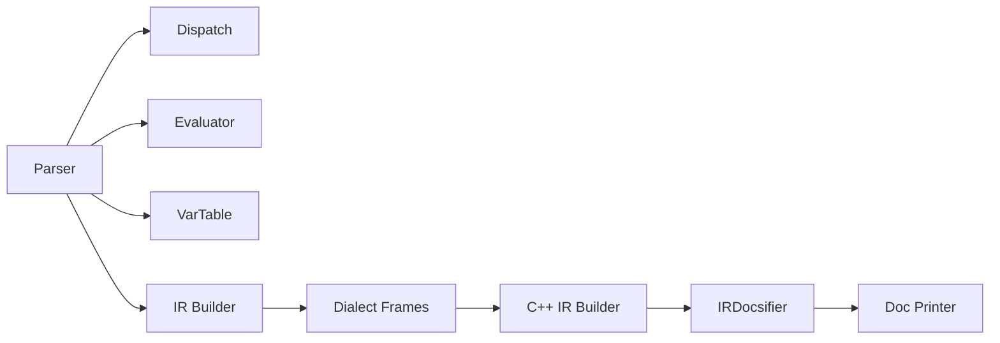

# Script IR Declarative Programming

<cite>
**Referenced Files in This Document**
- [tvmscript.rst](file://docs/arch/tvmscript.rst)
- [__init__.py](file://python/tvm/script/__init__.py)
- [parser.py](file://python/tvm/script/parser/core/parser.py)
- [dispatch.py](file://python/tvm/script/parser/core/dispatch.py)
- [evaluator.py](file://python/tvm/script/parser/core/evaluator.py)
- [base.py](file://python/tvm/script/ir_builder/base.py)
- [frame.py (TIRX)](file://python/tvm/script/ir_builder/tirx/frame.py)
- [frame.py (Relax)](file://python/tvm/script/ir_builder/relax/frame.py)
- [ir_docsifier.cc](file://src/script/printer/ir_docsifier.cc)
- [base.cc](file://src/script/ir_builder/base.cc)
- [tirx.py](file://python/tvm/script/tirx.py)
- [relax.py](file://python/tvm/script/relax.py)
</cite>

## Table of Contents
1. [Introduction](#introduction)
2. [Project Structure](#project-structure)
3. [Core Components](#core-components)
4. [Architecture Overview](#architecture-overview)
5. [Detailed Component Analysis](#detailed-component-analysis)
6. [Dependency Analysis](#dependency-analysis)
7. [Performance Considerations](#performance-considerations)
8. [Troubleshooting Guide](#troubleshooting-guide)
9. [Conclusion](#conclusion)
10. [Appendices](#appendices)

## Introduction
Script IR (TVMScript) is TVM’s declarative programming interface that enables writing tensor computations using a natural Python-like syntax. It is not executed by the Python interpreter; instead, Python decorators extract the source code, convert it into a Doc AST, and transform it into TVM IR through a parser and IR builder pipeline. TVMScript supports roundtrip serialization: every IRModule can be printed back to TVMScript and re-parsed to an equivalent module. It provides three dialects:
- IR module-level constructs
- TIR eXtended (TIRX) for low-level tensor kernels
- Relax for high-level neural network computation graphs

This document explains the IR builder system, parser implementation, and printer functionality, along with syntax extensions, macro systems, and high-level DSL features. It also covers how Script IR translates to underlying IR layers (TensorIR/Relax), demonstrates declarative programming patterns, and outlines integration with the broader TVM compilation pipeline.

## Project Structure
Script IR spans Python and C++ layers:
- Python parser and IR builder frontends
- C++ IR builder and printer backends
- Dispatch and evaluation infrastructure
- Dialect-specific frames and builders

**Diagram sources**
- [parser.py:326-800](file://python/tvm/script/parser/core/parser.py#L326-L800)
- [evaluator.py:75-601](file://python/tvm/script/parser/core/evaluator.py#L75-L601)
- [dispatch.py:28-158](file://python/tvm/script/parser/core/dispatch.py#L28-L158)
- [base.py:29-203](file://python/tvm/script/ir_builder/base.py#L29-L203)
- [frame.py (TIRX):26-78](file://python/tvm/script/ir_builder/tirx/frame.py#L26-L78)
- [frame.py (Relax):24-53](file://python/tvm/script/ir_builder/relax/frame.py#L24-L53)
- [base.cc:28-126](file://src/script/ir_builder/base.cc#L28-L126)
- [ir_docsifier.cc:194-218](file://src/script/printer/ir_docsifier.cc#L194-L218)

**Section sources**
- [tvmscript.rst:40-79](file://docs/arch/tvmscript.rst#L40-L79)
- [__init__.py:20-22](file://python/tvm/script/__init__.py#L20-L22)

## Core Components
- Parser: Converts Python source to a Doc AST and dispatches to dialect-specific handlers. Maintains a dispatch token stack and a variable table for scoping.
- IR Builder: Provides a frame-stack API. Each with-block or decorator pushes a frame; exiting a frame finalizes IR and attaches it to the parent.
- Printer: Converts TVM IR back to a Doc tree and formats it into TVMScript text.

Key capabilities:
- Decorators: @I.ir_module, @T.prim_func, @R.function
- Supported Python syntax subset mapped to TIR/Relax semantics
- Roundtrip guarantee for IRModules

**Section sources**
- [tvmscript.rst:81-126](file://docs/arch/tvmscript.rst#L81-L126)
- [tvmscript.rst:128-194](file://docs/arch/tvmscript.rst#L128-L194)
- [tvmscript.rst:196-288](file://docs/arch/tvmscript.rst#L196-L288)
- [tvmscript.rst:290-350](file://docs/arch/tvmscript.rst#L290-L350)

## Architecture Overview
The end-to-end flow transforms Python source into TVM IR and back:

**Diagram sources**
- [tvmscript.rst:40-79](file://docs/arch/tvmscript.rst#L40-L79)
- [parser.py:361-381](file://python/tvm/script/parser/core/parser.py#L361-L381)
- [evaluator.py:438-465](file://python/tvm/script/parser/core/evaluator.py#L438-L465)
- [base.py:90-163](file://python/tvm/script/ir_builder/base.py#L90-L163)
- [ir_docsifier.cc:194-218](file://src/script/printer/ir_docsifier.cc#L194-L218)

## Detailed Component Analysis

### Parser Architecture
- Dispatch token stack: ["default"] evolves to dialect tokens like "tirx" or "relax" based on decorators.
- Virtual table dispatch: ParseVTable[(token, node_type)] routes AST nodes to dialect handlers.
- Expression evaluation: ExprEvaluator resolves names against var_table and namespaces (T./R.), with operator precedence and special handling for conditionals and slices.
- Variable table: Stack of frames with shadowing semantics; entering scopes pushes frames, exiting pops them.

**Diagram sources**
- [parser.py:361-381](file://python/tvm/script/parser/core/parser.py#L361-L381)
- [parser.py:318-324](file://python/tvm/script/parser/core/parser.py#L318-L324)
- [evaluator.py:100-133](file://python/tvm/script/parser/core/evaluator.py#L100-L133)
- [dispatch.py:35-91](file://python/tvm/script/parser/core/dispatch.py#L35-L91)

**Section sources**
- [parser.py:326-800](file://python/tvm/script/parser/core/parser.py#L326-L800)
- [dispatch.py:28-158](file://python/tvm/script/parser/core/dispatch.py#L28-L158)
- [evaluator.py:75-601](file://python/tvm/script/parser/core/evaluator.py#L75-L601)

### IR Builder System
- Thread-local IRBuilder singleton per scope; frames are pushed/exited via with-blocks.
- Dialect frames:
  - TIRX: PrimFuncFrame, SBlockFrame, ForFrame, WhileFrame, IfFrame, AssertFrame, AttrFrame, LaunchThreadFrame
  - Relax: FunctionFrame, BindingBlockFrame, IfFrame, ThenFrame, ElseFrame
- Finalization occurs on frame exit; callbacks enable deferred attachment of IR nodes.

**Diagram sources**
- [base.py:29-203](file://python/tvm/script/ir_builder/base.py#L29-L203)
- [frame.py (TIRX):26-78](file://python/tvm/script/ir_builder/tirx/frame.py#L26-L78)
- [frame.py (Relax):24-53](file://python/tvm/script/ir_builder/relax/frame.py#L24-L53)
- [base.cc:33-84](file://src/script/ir_builder/base.cc#L33-L84)

**Section sources**
- [base.py:90-163](file://python/tvm/script/ir_builder/base.py#L90-L163)
- [frame.py (TIRX):26-78](file://python/tvm/script/ir_builder/tirx/frame.py#L26-L78)
- [frame.py (Relax):24-53](file://python/tvm/script/ir_builder/relax/frame.py#L24-L53)
- [base.cc:28-84](file://src/script/ir_builder/base.cc#L28-L84)

### Printer and Roundtrip
- IRDocsifier converts TVM IR objects to a Doc tree using a dispatch table keyed by token and type index.
- Doc tree is formatted into Python text by DocToPythonScript.
- Roundtrip property: IRModule → script() → parse() preserves structural equality.

**Diagram sources**
- [tvmscript.rst:290-350](file://docs/arch/tvmscript.rst#L290-L350)
- [ir_docsifier.cc:194-218](file://src/script/printer/ir_docsifier.cc#L194-L218)

**Section sources**
- [tvmscript.rst:316-350](file://docs/arch/tvmscript.rst#L316-L350)
- [ir_docsifier.cc:38-113](file://src/script/printer/ir_docsifier.cc#L38-L113)

### Syntax Extensions and Macros
- ScriptMacro enables macro-like constructs. Two design goals:
  - Hygienic vs. non-hygienic macro invocation
  - Value-producing vs. statement-level macros
- The macro system locates the current parser in the environment and parses macro bodies within appropriate hygiene contexts.

**Diagram sources**
- [parser.py:72-172](file://python/tvm/script/parser/core/parser.py#L72-L172)

**Section sources**
- [parser.py:72-172](file://python/tvm/script/parser/core/parser.py#L72-L172)

### High-Level DSL Features
- TIRX (TensorIR eXtended) syntax:
  - Function and block: prim_func, sblock, init, reads/writes
  - Loops: grid, serial, parallel, vectorized, unroll, thread_binding
  - Axes: axis.spatial, axis.reduce, axis.remap
  - Buffers: match_buffer, alloc_buffer, Buffer annotations
- Relax syntax:
  - Function and dataflow: function, dataflow, output
  - Emit: emit, emit_match_cast
  - Struct info: Tensor, Tuple, Shape, Object
  - Calling: call_tir, call_packed, call_dps_packed
  - Operators: re-export of Relax operators

**Section sources**
- [tvmscript.rst:226-288](file://docs/arch/tvmscript.rst#L226-L288)

### Translation to Underlying IR Layers
- TIR translation: TIRX frames map to PrimFunc, SBlocks, For/While/If, buffers, and axes.
- Relax translation: Relax frames map to relax.Function, binding blocks, and operators.
- Roundtrip ensures equivalence between IRModule and TVMScript text.

**Section sources**
- [tvmscript.rst:40-79](file://docs/arch/tvmscript.rst#L40-L79)
- [tvmscript.rst:335-350](file://docs/arch/tvmscript.rst#L335-L350)

### Integration with TVM Compilation Pipeline
- TVMScript integrates with the broader TVM stack by producing IRModule, PrimFunc, and relax.Function objects.
- The module can be further transformed, scheduled, and compiled through TVM passes and codegen.

**Section sources**
- [tvmscript.rst:29-35](file://docs/arch/tvmscript.rst#L29-L35)
- [tirx.py:20-21](file://python/tvm/script/tirx.py#L20-L21)
- [relax.py:20-21](file://python/tvm/script/relax.py#L20-L21)

## Dependency Analysis
- Parser depends on:
  - Dispatch registry for handler lookup
  - Evaluator for expression resolution
  - VarTable for scoping
- IR Builder depends on:
  - Dialect frames for IR construction
  - C++ backend for frame stack and naming
- Printer depends on:
  - IRDocsifier dispatch table
  - Doc tree formatting

**Diagram sources**
- [dispatch.py:28-91](file://python/tvm/script/parser/core/dispatch.py#L28-L91)
- [evaluator.py:438-465](file://python/tvm/script/parser/core/evaluator.py#L438-L465)
- [base.py:90-163](file://python/tvm/script/ir_builder/base.py#L90-L163)
- [base.cc:80-89](file://src/script/ir_builder/base.cc#L80-L89)
- [ir_docsifier.cc:194-208](file://src/script/printer/ir_docsifier.cc#L194-L208)

**Section sources**
- [dispatch.py:28-91](file://python/tvm/script/parser/core/dispatch.py#L28-L91)
- [evaluator.py:438-465](file://python/tvm/script/parser/core/evaluator.py#L438-L465)
- [base.py:90-163](file://python/tvm/script/ir_builder/base.py#L90-L163)
- [base.cc:80-89](file://src/script/ir_builder/base.cc#L80-L89)
- [ir_docsifier.cc:194-208](file://src/script/printer/ir_docsifier.cc#L194-L208)

## Performance Considerations
- The printer is implemented in C++ for performance, converting IR to a Doc tree and then to formatted text.
- Frame-based IR construction avoids building large IR trees in memory; IR is finalized incrementally as frames exit.
- Operator evaluation leverages dispatch tables to minimize branching overhead.

[No sources needed since this section provides general guidance]

## Troubleshooting Guide
- Error reporting: Parser wraps exceptions into diagnostics with source-aware messages.
- Duplicate LHS detection: Ensures no repeated left-hand-side variables in assignments.
- Undefined variables: Evaluator raises clear errors for missing names or unsupported constructs.
- Roundtrip verification: Use mod.script() and re-parse to assert structural equality.

**Section sources**
- [parser.py:574-610](file://python/tvm/script/parser/core/parser.py#L574-L610)
- [parser.py:502-537](file://python/tvm/script/parser/core/parser.py#L502-L537)
- [evaluator.py:120-133](file://python/tvm/script/parser/core/evaluator.py#L120-L133)
- [tvmscript.rst:335-350](file://docs/arch/tvmscript.rst#L335-L350)

## Conclusion
Script IR (TVMScript) provides a declarative, roundtrip-friendly interface for authoring TVM IR. Its parser and IR builder implement a robust dispatch and frame-stack model, while the printer ensures faithful textual reconstruction. The system supports TIRX and Relax dialects, enabling natural syntax for tensor kernels and high-level neural networks. By integrating with the broader TVM pipeline, Script IR accelerates development, inspection, and optimization of tensor computations.

[No sources needed since this section summarizes without analyzing specific files]

## Appendices

### Supported Python Syntax Summary
- TIR: for with range, with sblock, if/else with PrimExpr conditions, while, arithmetic, T.* intrinsics
- Relax: for is not supported; if/else maps to Relax If nodes; emit bindings, R.* operators, call_tir/call_packed

**Section sources**
- [tvmscript.rst:352-408](file://docs/arch/tvmscript.rst#L352-L408)