# TensorIR Fundamentals

<cite>
**Referenced Files in This Document**
- [expr.h](file://include/tvm/tirx/expr.h)
- [stmt.h](file://include/tvm/tirx/stmt.h)
- [function.h](file://include/tvm/tirx/function.h)
- [buffer.h](file://include/tvm/tirx/buffer.h)
- [var.h](file://include/tvm/tirx/var.h)
- [type.h](file://include/tvm/ir/type.h)
- [expr.h](file://include/tvm/ir/expr.h)
- [computation.cc](file://src/s_tir/schedule/primitive/compute_inline.cc)
- [block_annotate.cc](file://src/s_tir/schedule/primitive/block_annotate.cc)
- [frontend_nn_op.py](file://tests/python/relax/test_frontend_nn_op.py)
</cite>

## Table of Contents
1. [Introduction](#introduction)
2. [Project Structure](#project-structure)
3. [Core Components](#core-components)
4. [Architecture Overview](#architecture-overview)
5. [Detailed Component Analysis](#detailed-component-analysis)
6. [Dependency Analysis](#dependency-analysis)
7. [Performance Considerations](#performance-considerations)
8. [Troubleshooting Guide](#troubleshooting-guide)
9. [Conclusion](#conclusion)

## Introduction
This document explains TensorIR fundamentals in TVM: its role as the primary low-level Intermediate Representation for tensor computations, covering core constructs (expressions, statements, and function definitions), the type system and data types, shape inference, buffer semantics and memory layout, and practical patterns for building, analyzing, and transforming TensorIR programs. It synthesizes the code-level definitions and usage patterns present in the repository to help both newcomers and practitioners understand how TVM represents and optimizes tensor kernels.

## Project Structure
TensorIR is defined primarily in the TIR extension headers under the TIR eXtension (tirx) namespace, with foundational IR types and expressions defined in the core IR headers. The key locations are:
- Expression definitions: include/tvm/tirx/expr.h
- Statement definitions: include/tvm/tirx/stmt.h
- Function definitions: include/tvm/tirx/function.h
- Buffer and memory layout: include/tvm/tirx/buffer.h
- Variables and iteration domains: include/tvm/tirx/var.h
- Unified type system: include/tvm/ir/type.h
- Primitive expressions and constants: include/tvm/ir/expr.h

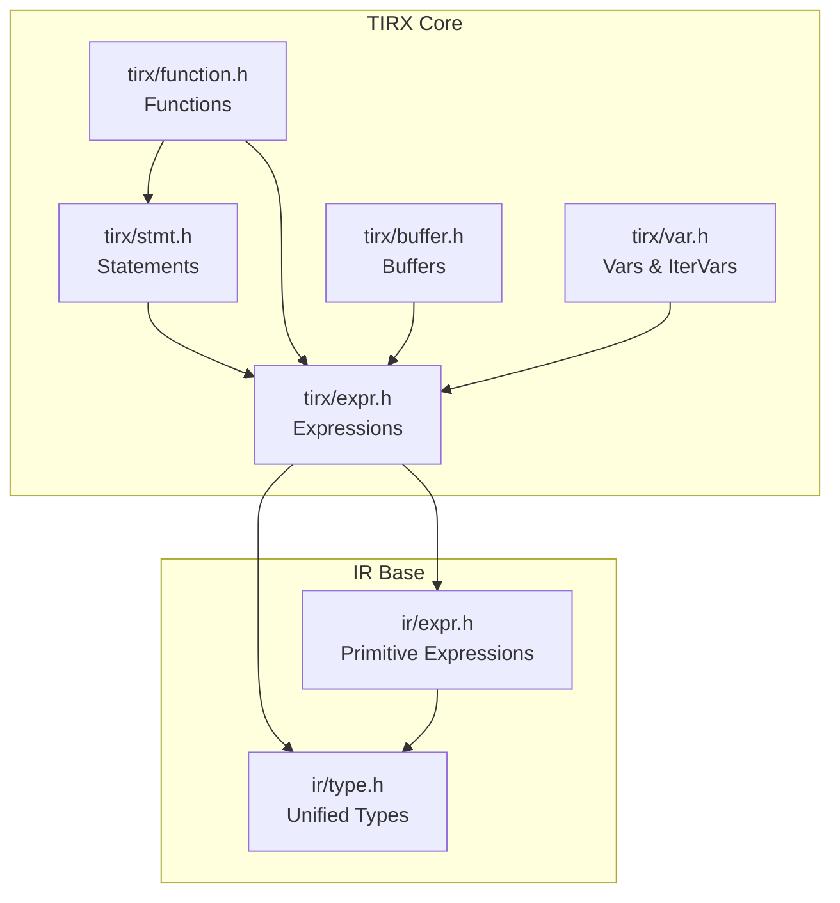

**Diagram sources**
- [expr.h:1-120](file://include/tvm/tirx/expr.h#L1-L120)
- [stmt.h:1-120](file://include/tvm/tirx/stmt.h#L1-L120)
- [function.h:1-120](file://include/tvm/tirx/function.h#L1-L120)
- [buffer.h:1-120](file://include/tvm/tirx/buffer.h#L1-L120)
- [var.h:1-120](file://include/tvm/tirx/var.h#L1-L120)
- [type.h:1-120](file://include/tvm/ir/type.h#L1-L120)
- [expr.h:1-120](file://include/tvm/ir/expr.h#L1-L120)

**Section sources**
- [expr.h:1-120](file://include/tvm/tirx/expr.h#L1-L120)
- [stmt.h:1-120](file://include/tvm/tirx/stmt.h#L1-L120)
- [function.h:1-120](file://include/tvm/tirx/function.h#L1-L120)
- [buffer.h:1-120](file://include/tvm/tirx/buffer.h#L1-L120)
- [var.h:1-120](file://include/tvm/tirx/var.h#L1-L120)
- [type.h:1-120](file://include/tvm/ir/type.h#L1-L120)
- [expr.h:1-120](file://include/tvm/ir/expr.h#L1-L120)

## Core Components
TensorIR’s core building blocks are:
- Expressions: scalar and vector operations, buffer access, let-bindings, reductions, and calls.
- Statements: control flow (loops, if-then-else), blocks, buffer allocation/deallocation, and evaluation.
- Functions: primitive functions (PrimFunc) with typed parameters, buffer maps, and bodies.
- Buffers: symbolic multi-dimensional arrays with shape, strides, offsets, and storage scope.
- Variables and iteration domains: typed variables, size variables, and iteration variables with domain ranges.

Key constructs and their roles:
- Expressions: arithmetic, logical, comparison, vector/ramp/broadcast, buffer load/store, let bindings, reductions, and calls.
- Statements: for loops (with kinds), while loops, if-then-else, sequence, evaluate, buffer store/decl/alloc, and blocks.
- Functions: PrimFunc with params, buffer_map, and body; attributes for kernel launch and aliasing.
- Buffers: shape, strides, elem_offset, axis_separators, and scope; helpers for slicing, vectorized load/store, and flattening.
- Variables: Var and SizeVar with optional type annotations; IterVar with domain and thread tags.

**Section sources**
- [expr.h:120-923](file://include/tvm/tirx/expr.h#L120-L923)
- [stmt.h:120-981](file://include/tvm/tirx/stmt.h#L120-L981)
- [function.h:40-351](file://include/tvm/tirx/function.h#L40-L351)
- [buffer.h:60-311](file://include/tvm/tirx/buffer.h#L60-L311)
- [var.h:40-367](file://include/tvm/tirx/var.h#L40-L367)

## Architecture Overview
TensorIR composes hierarchical nodes:
- PrimExpr hierarchy underpins scalar/vector computations and constants.
- Stmt hierarchy underpins control flow and memory operations.
- Function nodes encapsulate bodies and parameter-to-buffer mappings.
- Buffer nodes encapsulate memory layout and access patterns.
- Type system bridges runtime data types and structured types.

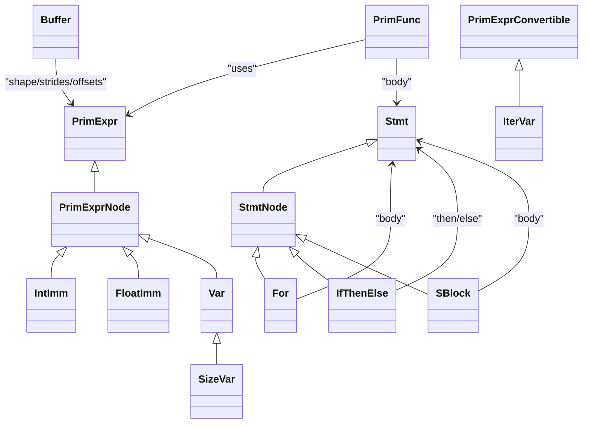

**Diagram sources**
- [expr.h:90-120](file://include/tvm/tirx/expr.h#L90-L120)
- [expr.h:490-558](file://include/tvm/tirx/expr.h#L490-L558)
- [var.h:47-126](file://include/tvm/tirx/var.h#L47-L126)
- [stmt.h:586-649](file://include/tvm/tirx/stmt.h#L586-L649)
- [stmt.h:515-546](file://include/tvm/tirx/stmt.h#L515-L546)
- [stmt.h:799-859](file://include/tvm/tirx/stmt.h#L799-L859)
- [function.h:49-156](file://include/tvm/tirx/function.h#L49-L156)
- [buffer.h:62-149](file://include/tvm/tirx/buffer.h#L62-L149)

## Detailed Component Analysis

### Expressions
TensorIR expressions include:
- Arithmetic/logical/comparison: Add, Sub, Mul, Div, Mod, FloorDiv, FloorMod, Min, Max, EQ, NE, LT, LE, GT, GE, And, Or, Not.
- Vectorization: Ramp (ramp indexing), Broadcast (broadcasting scalars), Shuffle (vector shuffles).
- Buffer access: BufferLoad and BufferStore with optional predicates.
- Control and binding: Let (local binding), Reduce (commutative reductions), CommReducer (reduction combiners).
- Calls: Call to intrinsics or other functions.

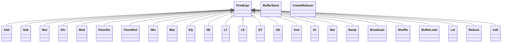

**Diagram sources**
- [expr.h:124-520](file://include/tvm/tirx/expr.h#L124-L520)
- [expr.h:626-784](file://include/tvm/tirx/expr.h#L626-L784)
- [expr.h:532-577](file://include/tvm/tirx/expr.h#L532-L577)
- [expr.h:840-883](file://include/tvm/tirx/expr.h#L840-L883)

**Section sources**
- [expr.h:124-520](file://include/tvm/tirx/expr.h#L124-L520)
- [expr.h:626-784](file://include/tvm/tirx/expr.h#L626-L784)
- [expr.h:532-577](file://include/tvm/tirx/expr.h#L532-L577)
- [expr.h:840-883](file://include/tvm/tirx/expr.h#L840-L883)

### Statements
TensorIR statements include:
- Control flow: For (with loop kinds), While, IfThenElse, SeqStmt (sequence), Evaluate (expression evaluation).
- Memory: BufferStore, DeclBuffer, AllocBuffer (with annotations), Bind (variable binding).
- Blocks: SBlock (with iter vars, reads/writes, allocations, matches, annotations, init, body), SBlockRealize (execution at bindings).
- Attributes: AttrStmt (auxiliary attributes), AssertStmt (assertions), and pragmas via attribute keys.

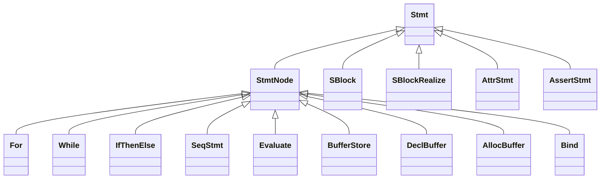

**Diagram sources**
- [stmt.h:39-68](file://include/tvm/tirx/stmt.h#L39-L68)
- [stmt.h:586-649](file://include/tvm/tirx/stmt.h#L586-L649)
- [stmt.h:661-687](file://include/tvm/tirx/stmt.h#L661-L687)
- [stmt.h:515-546](file://include/tvm/tirx/stmt.h#L515-L546)
- [stmt.h:311-434](file://include/tvm/tirx/stmt.h#L311-L434)
- [stmt.h:336-360](file://include/tvm/tirx/stmt.h#L336-L360)
- [stmt.h:191-235](file://include/tvm/tirx/stmt.h#L191-L235)
- [stmt.h:237-286](file://include/tvm/tirx/stmt.h#L237-L286)
- [stmt.h:70-103](file://include/tvm/tirx/stmt.h#L70-L103)
- [stmt.h:799-897](file://include/tvm/tirx/stmt.h#L799-L897)
- [stmt.h:864-897](file://include/tvm/tirx/stmt.h#L864-L897)
- [stmt.h:115-148](file://include/tvm/tirx/stmt.h#L115-L148)
- [stmt.h:159-189](file://include/tvm/tirx/stmt.h#L159-L189)

**Section sources**
- [stmt.h:586-649](file://include/tvm/tirx/stmt.h#L586-L649)
- [stmt.h:661-687](file://include/tvm/tirx/stmt.h#L661-L687)
- [stmt.h:515-546](file://include/tvm/tirx/stmt.h#L515-L546)
- [stmt.h:311-434](file://include/tvm/tirx/stmt.h#L311-L434)
- [stmt.h:336-360](file://include/tvm/tirx/stmt.h#L336-L360)
- [stmt.h:191-235](file://include/tvm/tirx/stmt.h#L191-L235)
- [stmt.h:237-286](file://include/tvm/tirx/stmt.h#L237-L286)
- [stmt.h:70-103](file://include/tvm/tirx/stmt.h#L70-L103)
- [stmt.h:799-897](file://include/tvm/tirx/stmt.h#L799-L897)
- [stmt.h:864-897](file://include/tvm/tirx/stmt.h#L864-L897)
- [stmt.h:115-148](file://include/tvm/tirx/stmt.h#L115-L148)
- [stmt.h:159-189](file://include/tvm/tirx/stmt.h#L159-L189)

### Functions
PrimFunc is the central function definition in TensorIR:
- params: typed parameters (often handles).
- buffer_map: maps parameters to Buffer objects to encode shapes and constraints.
- body: a Stmt forming the function body.
- attributes: function-level annotations (e.g., kernel launch params, noalias, entry/global/host flags).

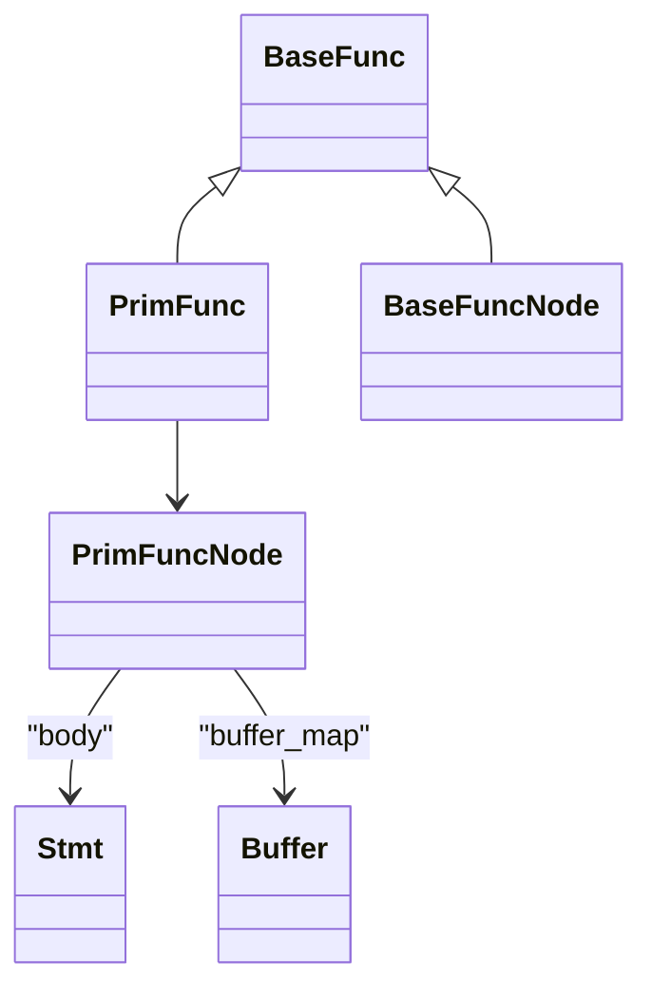

**Diagram sources**
- [function.h:49-156](file://include/tvm/tirx/function.h#L49-L156)

**Section sources**
- [function.h:49-156](file://include/tvm/tirx/function.h#L49-L156)

### Buffers and Memory Layout
Buffers are symbolic n-dimensional arrays with:
- data: base pointer variable.
- dtype: element data type.
- shape: symbolic extents.
- strides: optional strides; empty implies row-major contiguous.
- elem_offset: element offset (lanes considered).
- axis_separators: grouping of axes for flattened views.
- scope(): storage scope string.
- Helpers: MakeSlice, access_ptr, vload/vstore, GetFlattenedBuffer.

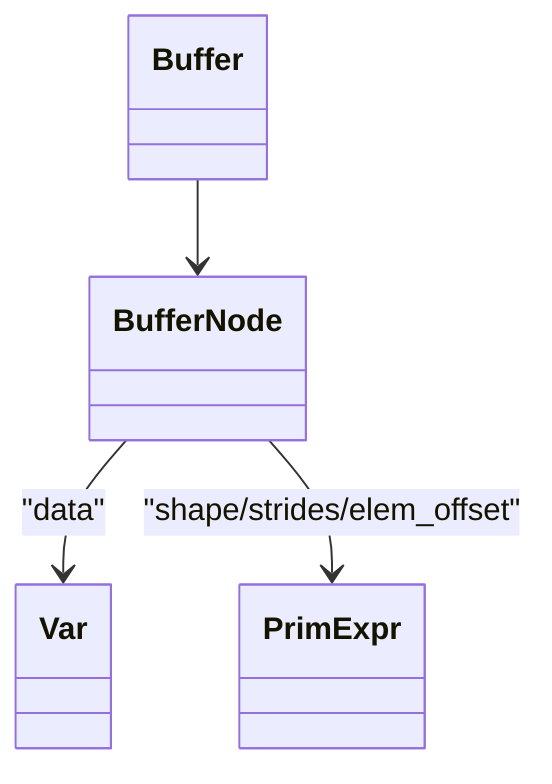

**Diagram sources**
- [buffer.h:62-230](file://include/tvm/tirx/buffer.h#L62-L230)

**Section sources**
- [buffer.h:62-230](file://include/tvm/tirx/buffer.h#L62-L230)

### Variables and Iteration Domains
- Var: typed variable with optional type annotation.
- SizeVar: a Var constrained to non-negative sizes.
- IterVar: iteration variable with domain Range, type (data-parallel, thread-index, reduction, etc.), and optional thread tag.

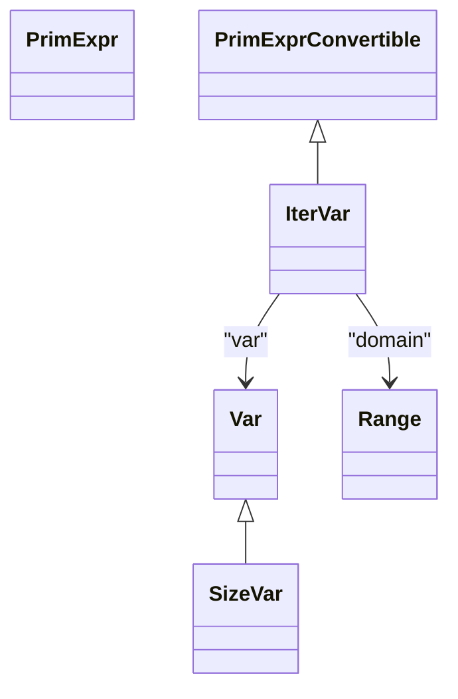

**Diagram sources**
- [var.h:47-126](file://include/tvm/tirx/var.h#L47-L126)
- [var.h:132-173](file://include/tvm/tirx/var.h#L132-L173)
- [var.h:253-307](file://include/tvm/tirx/var.h#L253-L307)

**Section sources**
- [var.h:47-126](file://include/tvm/tirx/var.h#L47-L126)
- [var.h:132-173](file://include/tvm/tirx/var.h#L132-L173)
- [var.h:253-307](file://include/tvm/tirx/var.h#L253-L307)

### Type System and Data Types
- PrimExpr carries a runtime::DataType (coarse-grained) and can be paired with a richer Type (fine-grained) via lazy inference.
- Type hierarchy includes PrimType, FuncType, TupleType, and PointerType with storage scopes.
- Unified type system bridges across IR dialects and supports polymorphic function types.

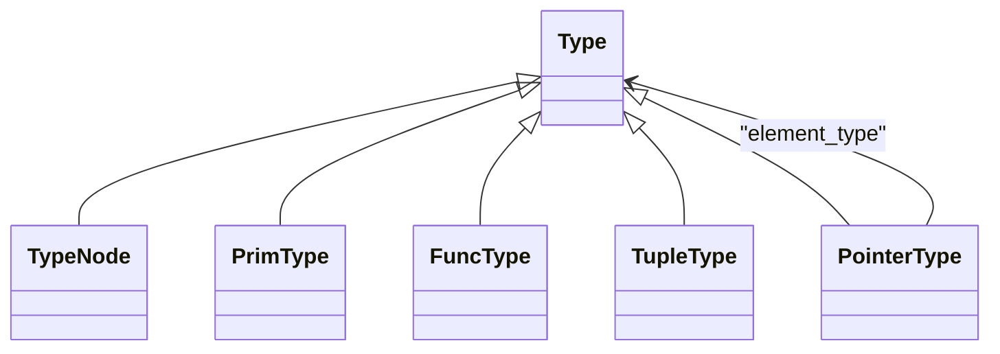

**Diagram sources**
- [type.h:74-310](file://include/tvm/ir/type.h#L74-L310)

**Section sources**
- [type.h:74-310](file://include/tvm/ir/type.h#L74-L310)
- [expr.h:93-149](file://include/tvm/ir/expr.h#L93-L149)

### Practical Construction and Transformation Patterns
Common IR patterns and transformations:
- Buffer load extraction and index consistency checks during compute inlining.
- Storage alignment annotations and scope setting on buffers inside blocks.
- Example usage of TensorIR constructs in tests (e.g., inplace take with sblock).

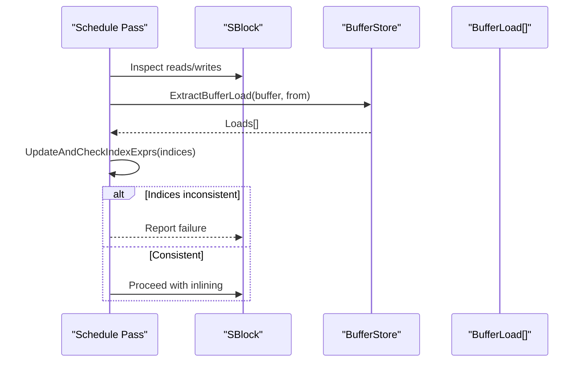

**Diagram sources**
- [computation.cc:829-865](file://src/s_tir/schedule/primitive/compute_inline.cc#L829-L865)

**Section sources**
- [computation.cc:829-865](file://src/s_tir/schedule/primitive/compute_inline.cc#L829-L865)

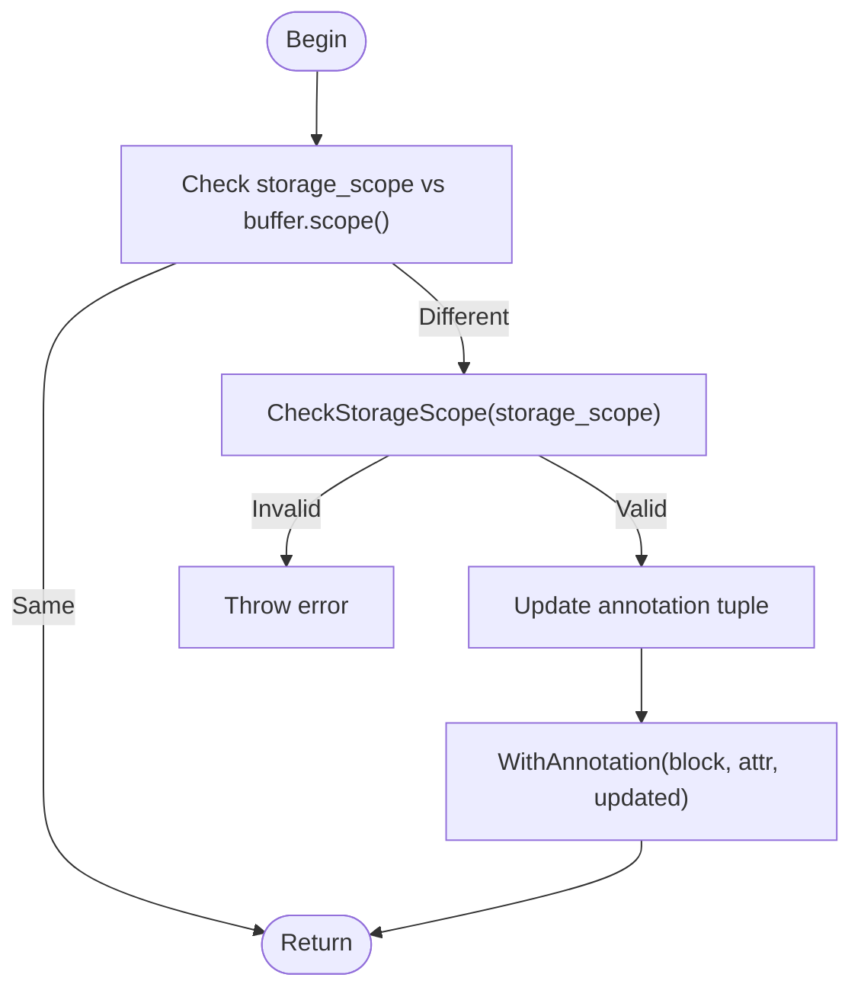

**Diagram sources**
- [block_annotate.cc:260-272](file://src/s_tir/schedule/primitive/block_annotate.cc#L260-L272)

**Section sources**
- [block_annotate.cc:260-272](file://src/s_tir/schedule/primitive/block_annotate.cc#L260-L272)

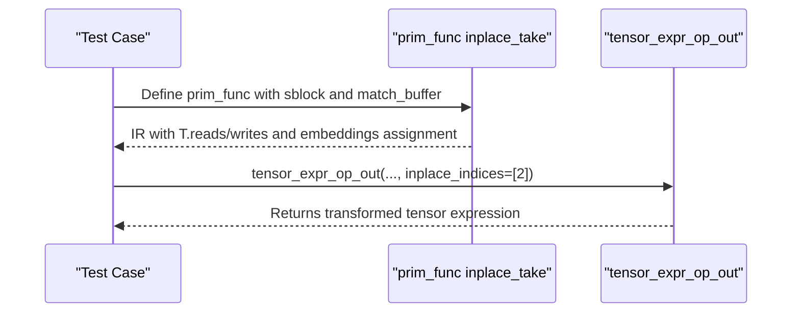

**Diagram sources**
- [frontend_nn_op.py:720-753](file://tests/python/relax/test_frontend_nn_op.py#L720-L753)

**Section sources**
- [frontend_nn_op.py:720-753](file://tests/python/relax/test_frontend_nn_op.py#L720-L753)

## Dependency Analysis
TensorIR components depend on each other as follows:
- Expressions depend on primitive expressions and types.
- Statements depend on expressions and can contain nested statements.
- Functions depend on expressions and statements and carry buffer maps.
- Buffers depend on expressions for shape/strides and variables for data pointers.
- Variables and iteration domains are used pervasively in expressions and statements.

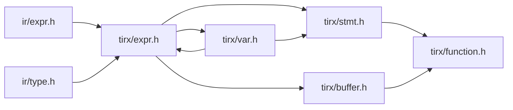

**Diagram sources**
- [expr.h:1-120](file://include/tvm/ir/expr.h#L1-L120)
- [type.h:1-120](file://include/tvm/ir/type.h#L1-L120)
- [expr.h:1-120](file://include/tvm/tirx/expr.h#L1-L120)
- [stmt.h:1-120](file://include/tvm/tirx/stmt.h#L1-L120)
- [buffer.h:1-120](file://include/tvm/tirx/buffer.h#L1-L120)
- [var.h:1-120](file://include/tvm/tirx/var.h#L1-L120)
- [function.h:1-120](file://include/tvm/tirx/function.h#L1-L120)

**Section sources**
- [expr.h:1-120](file://include/tvm/ir/expr.h#L1-L120)
- [type.h:1-120](file://include/tvm/ir/type.h#L1-L120)
- [expr.h:1-120](file://include/tvm/tirx/expr.h#L1-L120)
- [stmt.h:1-120](file://include/tvm/tirx/stmt.h#L1-L120)
- [buffer.h:1-120](file://include/tvm/tirx/buffer.h#L1-L120)
- [var.h:1-120](file://include/tvm/tirx/var.h#L1-L120)
- [function.h:1-120](file://include/tvm/tirx/function.h#L1-L120)

## Performance Considerations
- Loop kinds: ForKind controls serial, parallel, vectorized, unrolled, and thread-binding semantics; choose appropriately for target hardware.
- Vectorization: Use Ramp/Broadcast/Shuffle to enable SIMD-friendly access patterns.
- Buffer layout: Strides and axis_separators influence memory coalescing; contiguous layouts generally improve performance.
- Storage scope and alignment: Proper scope and storage_alignment annotations guide code generation and memory placement.
- Reductions: CommReducer and Reduce enable efficient fused reductions with proper combiners and identities.

[No sources needed since this section provides general guidance]

## Troubleshooting Guide
- Shape and dtype mismatches: Verify buffer_map and PrimFunc signatures; ensure dtype and shape compatibility in BufferLoad/BufferStore.
- Index consistency during inlining: When extracting loads, ensure indices are consistent across accesses; otherwise, inlining may fail.
- Storage scope errors: If attempting to change a buffer’s storage scope, validate against supported scopes; invalid scopes cause errors.
- Attribute misuse: Use AttrStmt and pragma keys carefully; incorrect keys or values can lead to unexpected behavior or code-gen failures.

**Section sources**
- [computation.cc:856-865](file://src/s_tir/schedule/primitive/compute_inline.cc#L856-L865)
- [block_annotate.cc:260-272](file://src/s_tir/schedule/primitive/block_annotate.cc#L260-L272)
- [stmt.h:900-948](file://include/tvm/tirx/stmt.h#L900-L948)

## Conclusion
TensorIR provides a precise, extensible representation for tensor computations, combining expressive primitive expressions, structured control flow, and rich buffer semantics. Its unified type system and attribute-driven annotations enable powerful transformations and optimizations. By understanding the core constructs and their interplay—variables, buffers, expressions, statements, and functions—developers can effectively build, analyze, and optimize low-level kernels for diverse hardware targets.