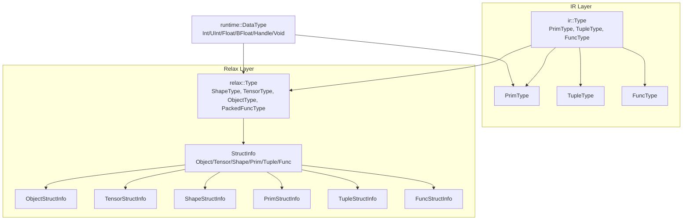
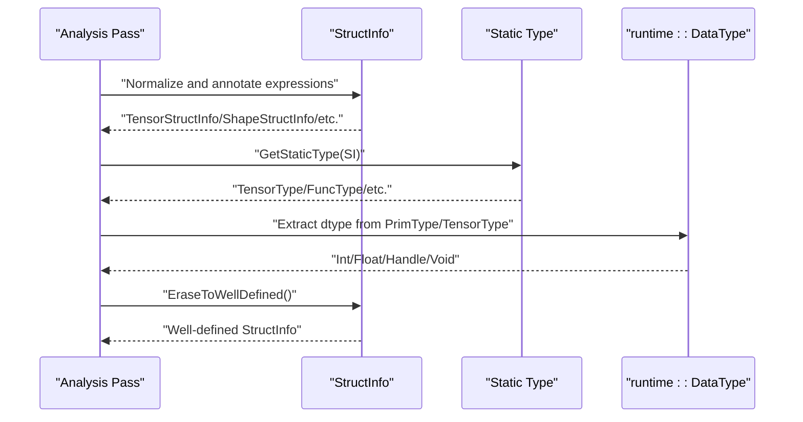
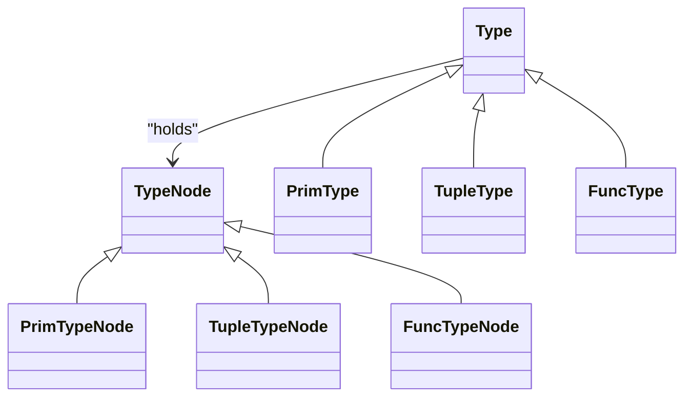
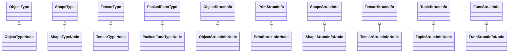
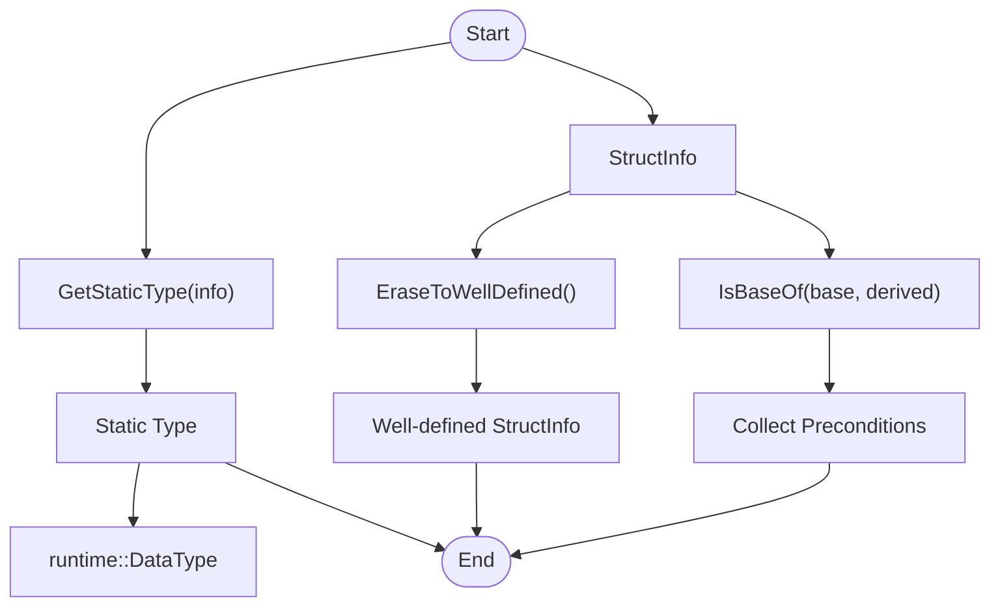
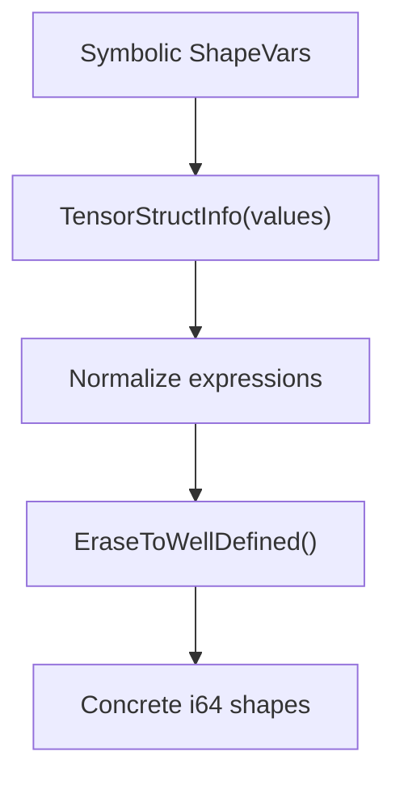
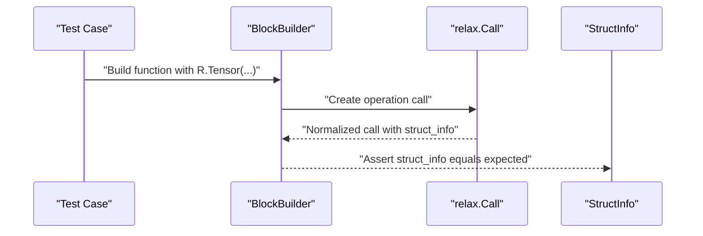
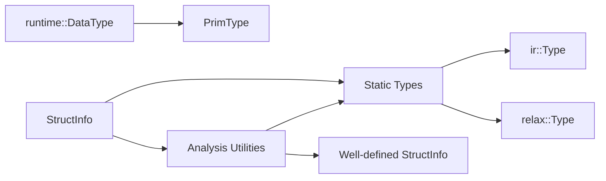

# Type System and Inference

<cite>
**Referenced Files in This Document**
- [type.h](file://include/tvm/ir/type.h)
- [type.cc](file://src/ir/type.cc)
- [data_type.h](file://include/tvm/runtime/data_type.h)
- [type.h](file://include/tvm/relax/type.h)
- [struct_info.h](file://include/tvm/relax/struct_info.h)
- [struct_info_analysis.cc](file://src/relax/analysis/struct_info_analysis.cc)
- [analysis.cc](file://src/ir/analysis.cc)
- [test_analysis_struct_info_analysis.py](file://tests/python/relax/test_analysis_struct_info_analysis.py)
- [test_analysis_computable_at_compile_time.py](file://tests/python/relax/test_analysis_computable_at_compile_time.py)
- [test_op_index.py](file://tests/python/relax/test_op_index.py)
- [test_frontend_from_exported_program.py](file://tests/python/relax/test_frontend_from_exported_program.py)
</cite>

## Table of Contents
1. [Introduction](#introduction)
2. [Project Structure](#project-structure)
3. [Core Components](#core-components)
4. [Architecture Overview](#architecture-overview)
5. [Detailed Component Analysis](#detailed-component-analysis)
6. [Dependency Analysis](#dependency-analysis)
7. [Performance Considerations](#performance-considerations)
8. [Troubleshooting Guide](#troubleshooting-guide)
9. [Conclusion](#conclusion)

## Introduction
This document explains TVM’s type system and inference mechanisms across the unified IR and the modern Relax dialect. It covers:
- The type hierarchy: PrimType, TensorType, TupleType, FuncType, and related types
- Relationship between static types and runtime values
- Type checking and inference procedures, including shape analysis
- Type coercion and promotion rules
- How type information flows through the compilation pipeline and supports optimizations
- Practical examples, common errors, and debugging techniques

## Project Structure
TVM’s type system spans both the unified IR and the Relax dialect:
- Unified IR types live under include/tvm/ir/type.h and implementation under src/ir/type.cc
- Runtime primitive types are defined in include/tvm/runtime/data_type.h
- Modern Relax types and structural information live under include/tvm/relax/type.h and include/tvm/relax/struct_info.h
- Structural information analysis and type conversion are implemented in src/relax/analysis/struct_info_analysis.cc
- IR-level analysis utilities are in src/ir/analysis.cc

**Diagram sources**
- [type.h:62-314](file://include/tvm/ir/type.h#L62-L314)
- [type.h:42-149](file://include/tvm/relax/type.h#L42-L149)
- [struct_info.h:39-425](file://include/tvm/relax/struct_info.h#L39-L425)
- [data_type.h:47-462](file://include/tvm/runtime/data_type.h#L47-L462)

**Section sources**
- [type.h:62-314](file://include/tvm/ir/type.h#L62-L314)
- [type.h:42-149](file://include/tvm/relax/type.h#L42-L149)
- [struct_info.h:39-425](file://include/tvm/relax/struct_info.h#L39-L425)
- [data_type.h:47-462](file://include/tvm/runtime/data_type.h#L47-L462)

## Core Components
- PrimType: Primitive scalar types used in low-level IR, backed by runtime::DataType
- TensorType: Dynamic tensor type in Relax with ndim and dtype
- TupleType: Product type for heterogeneous collections
- FuncType: Function signature type with argument and return types
- StructInfo: Rich structural information in Relax (TensorStructInfo, ShapeStructInfo, PrimStructInfo, TupleStructInfo, FuncStructInfo)
- runtime::DataType: Coarse-grained runtime type representation with lanes, bits, and vector/scalable support

Key relationships:
- GetStaticType converts StructInfo to static types (e.g., TensorStructInfo -> TensorType)
- StructInfoFromType converts static types back to StructInfo
- EraseToWellDefined removes symbolic uncertainty to produce well-defined structural information

**Section sources**
- [type.h:104-314](file://include/tvm/ir/type.h#L104-L314)
- [type.cc:38-105](file://src/ir/type.cc#L38-L105)
- [type.h:42-149](file://include/tvm/relax/type.h#L42-L149)
- [struct_info.h:39-425](file://include/tvm/relax/struct_info.h#L39-L425)
- [struct_info_analysis.cc:39-111](file://src/relax/analysis/struct_info_analysis.cc#L39-L111)

## Architecture Overview
The type system bridges static typing and runtime flexibility:
- Static types (ir::Type and relax::Type) capture structural and signature information
- StructInfo captures richer, possibly symbolic, shape and device information
- runtime::DataType provides concrete runtime type information for primitives and vectors
- Analysis passes convert between StructInfo and static types, enforce well-formedness, and compute preconditions

**Diagram sources**
- [struct_info_analysis.cc:39-111](file://src/relax/analysis/struct_info_analysis.cc#L39-L111)
- [struct_info_analysis.cc:258-292](file://src/relax/analysis/struct_info_analysis.cc#L258-L292)
- [type.h:104-314](file://include/tvm/ir/type.h#L104-L314)
- [data_type.h:47-462](file://include/tvm/runtime/data_type.h#L47-L462)

## Detailed Component Analysis

### IR Unified Type System
- TypeNode is the base for all types
- PrimType carries runtime::DataType and is used for low-level scalar and pointer-like types
- TupleType holds field types; VoidType is represented by an empty tuple
- FuncType captures signatures; polymorphic signatures are supported conceptually via higher-order constructs

**Diagram sources**
- [type.h:74-314](file://include/tvm/ir/type.h#L74-L314)
- [type.cc:38-105](file://src/ir/type.cc#L38-L105)

**Section sources**
- [type.h:74-314](file://include/tvm/ir/type.h#L74-L314)
- [type.cc:38-105](file://src/ir/type.cc#L38-L105)

### Relax Types and Structural Information
- ShapeType and TensorType represent shapes and tensors with ndim and dtype
- ObjectStructInfo, PrimStructInfo, ShapeStructInfo, TensorStructInfo, TupleStructInfo, FuncStructInfo capture detailed structural knowledge
- GetStaticType maps StructInfo to static types
- EraseToWellDefined removes symbolic uncertainty to produce well-defined forms

**Diagram sources**
- [type.h:42-149](file://include/tvm/relax/type.h#L42-L149)
- [struct_info.h:39-425](file://include/tvm/relax/struct_info.h#L39-L425)

**Section sources**
- [type.h:42-149](file://include/tvm/relax/type.h#L42-L149)
- [struct_info.h:39-425](file://include/tvm/relax/struct_info.h#L39-L425)

### Type Checking and Inference
- GetStaticType: Converts StructInfo to static types (e.g., TensorStructInfo -> TensorType)
- StructInfoFromType: Converts static types back to StructInfo
- EraseToWellDefined: Removes symbolic uncertainty and simplifies expressions to well-defined forms
- IsBaseOf and precondition collection: Determine subtype relationships and generate preconditions for shape and device compatibility

**Diagram sources**
- [struct_info_analysis.cc:39-111](file://src/relax/analysis/struct_info_analysis.cc#L39-L111)
- [struct_info_analysis.cc:258-292](file://src/relax/analysis/struct_info_analysis.cc#L258-L292)
- [struct_info_analysis.cc:597-624](file://src/relax/analysis/struct_info_analysis.cc#L597-L624)

**Section sources**
- [struct_info_analysis.cc:39-111](file://src/relax/analysis/struct_info_analysis.cc#L39-L111)
- [struct_info_analysis.cc:258-292](file://src/relax/analysis/struct_info_analysis.cc#L258-L292)
- [struct_info_analysis.cc:597-624](file://src/relax/analysis/struct_info_analysis.cc#L597-L624)

### Shape Analysis and Symbolic Variables
- ShapeStructInfo and TensorStructInfo carry symbolic shapes and ndim
- EraseToWellDefined replaces symbolic variables with concrete i64 expressions when possible
- Tests demonstrate inference of shapes and symbolic variables across operations like indexing

**Diagram sources**
- [struct_info.h:97-216](file://include/tvm/relax/struct_info.h#L97-L216)
- [struct_info_analysis.cc:258-292](file://src/relax/analysis/struct_info_analysis.cc#L258-L292)
- [test_op_index.py:40-67](file://tests/python/relax/test_op_index.py#L40-L67)

**Section sources**
- [struct_info.h:97-216](file://include/tvm/relax/struct_info.h#L97-L216)
- [struct_info_analysis.cc:258-292](file://src/relax/analysis/struct_info_analysis.cc#L258-L292)
- [test_op_index.py:40-67](file://tests/python/relax/test_op_index.py#L40-L67)

### Relationship Between Static Types and Runtime Values
- runtime::DataType provides coarse-grained type information (e.g., int32, float16, bfloat16, handles)
- PrimType embeds runtime::DataType for low-level expressions
- GetStaticType maps StructInfo to static types; StructInfoFromType maps static types back to StructInfo
- This dual representation enables fast checks at low-level stages and expressive typing at high-level stages

**Section sources**
- [data_type.h:47-462](file://include/tvm/runtime/data_type.h#L47-L462)
- [type.h:104-140](file://include/tvm/ir/type.h#L104-L140)
- [struct_info_analysis.cc:86-111](file://src/relax/analysis/struct_info_analysis.cc#L86-L111)

### Type Coercion, Promotion, and Safety Guarantees
- Promotion rules: Many operations promote integer or floating types according to runtime::DataType capabilities (e.g., int64 arithmetic, float32/float64 conversions)
- Coercion: StructInfo-based inference ensures compatible dtypes and shapes propagate through expressions
- Safety: Well-formedness checks prevent conflicting annotations; IsBaseOf enforces subtype relationships; EraseToWellDefined ensures deterministic shapes for code generation

Examples of promotion and coercion appear in tests where operations coerce int64 indices to float32 tensors for element-wise operations.

**Section sources**
- [test_frontend_from_exported_program.py:1469-1488](file://tests/python/relax/test_frontend_from_exported_program.py#L1469-L1488)

### Examples of Type Inference in Practice
- StructInfo to static type mapping is validated in tests for shapes, tensors, and tuples
- Compile-time computability tests show how symbolic variables are inferred and constrained

**Diagram sources**
- [test_analysis_struct_info_analysis.py:41-79](file://tests/python/relax/test_analysis_struct_info_analysis.py#L41-L79)
- [test_analysis_computable_at_compile_time.py:171-244](file://tests/python/relax/test_analysis_computable_at_compile_time.py#L171-L244)

**Section sources**
- [test_analysis_struct_info_analysis.py:41-79](file://tests/python/relax/test_analysis_struct_info_analysis.py#L41-L79)
- [test_analysis_computable_at_compile_time.py:171-244](file://tests/python/relax/test_analysis_computable_at_compile_time.py#L171-L244)

## Dependency Analysis
- IR types depend on runtime::DataType for primitive type semantics
- Relax types and StructInfo provide high-level, symbolic typing
- Analysis utilities convert between static types and StructInfo, and enforce well-formedness

**Diagram sources**
- [data_type.h:47-462](file://include/tvm/runtime/data_type.h#L47-L462)
- [type.h:104-314](file://include/tvm/ir/type.h#L104-L314)
- [type.h:42-149](file://include/tvm/relax/type.h#L42-L149)
- [struct_info.h:39-425](file://include/tvm/relax/struct_info.h#L39-L425)
- [struct_info_analysis.cc:39-111](file://src/relax/analysis/struct_info_analysis.cc#L39-L111)

**Section sources**
- [data_type.h:47-462](file://include/tvm/runtime/data_type.h#L47-L462)
- [type.h:104-314](file://include/tvm/ir/type.h#L104-L314)
- [type.h:42-149](file://include/tvm/relax/type.h#L42-L149)
- [struct_info.h:39-425](file://include/tvm/relax/struct_info.h#L39-L425)
- [struct_info_analysis.cc:39-111](file://src/relax/analysis/struct_info_analysis.cc#L39-L111)

## Performance Considerations
- Using runtime::DataType for quick checks avoids expensive structural comparisons at low-level stages
- EraseToWellDefined reduces symbolic complexity for downstream passes, improving optimization predictability
- StructInfoBaseCheck leverages arithmetic analyzer for shape equality, trading off correctness for performance in best-effort checks

[No sources needed since this section provides general guidance]

## Troubleshooting Guide
Common issues and debugging techniques:
- Conflicting StructInfo annotations: Use well-formedness checks to detect mismatches between annotated and inferred types
- Symbolic variable computability: Verify that symbolic variables can be inferred from compile-time bindings; otherwise, they remain unknown at compile-time
- Shape mismatch errors: Ensure shapes unify under EraseToWellDefined; otherwise, preconditions may fail
- Debugging tools: Utilize StructInfoBaseCheck and precondition collectors to inspect subtype relationships and generate preconditions

**Section sources**
- [test_analysis_well_formed.py:1216-1288](file://tests/python/relax/test_analysis_well_formed.py#L1216-L1288)
- [struct_info_analysis.cc:597-624](file://src/relax/analysis/struct_info_analysis.cc#L597-L624)
- [struct_info_analysis.cc:626-800](file://src/relax/analysis/struct_info_analysis.cc#L626-L800)

## Conclusion
TVM’s type system combines a unified IR type hierarchy with a rich Relax structural information model. Static types capture signatures and structures, while StructInfo encodes symbolic shapes and device placement. Analysis utilities convert between representations, enforce well-formedness, and support optimization decisions. Together, these mechanisms provide strong type safety and practical inference for modern AI compilation pipelines.