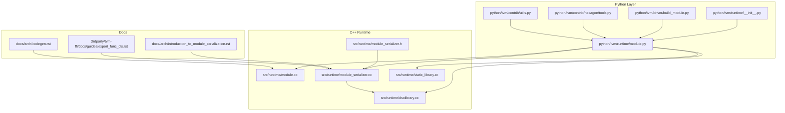
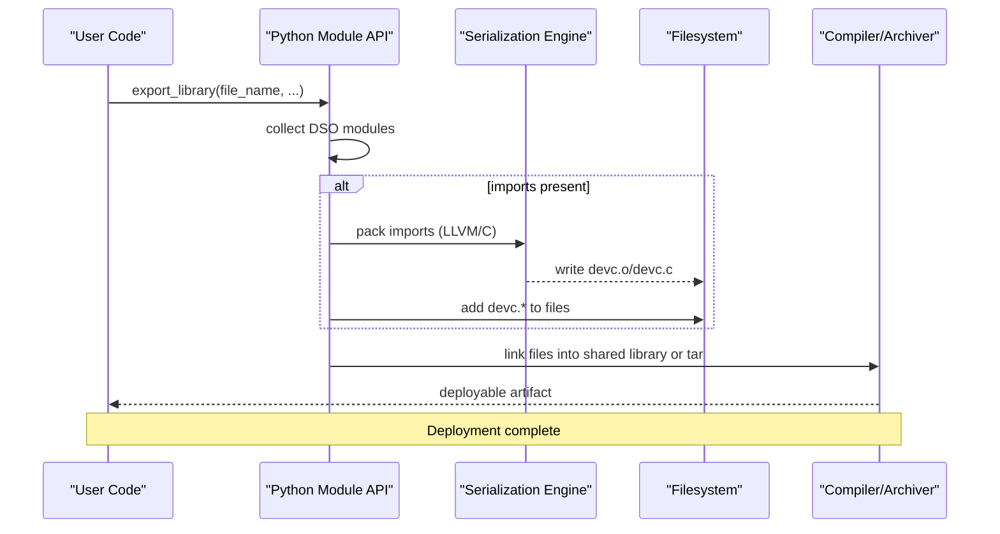
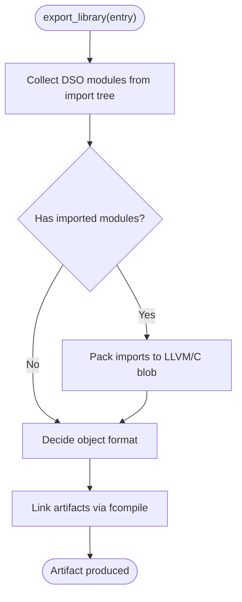
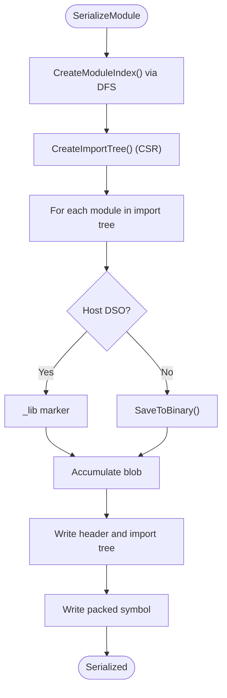
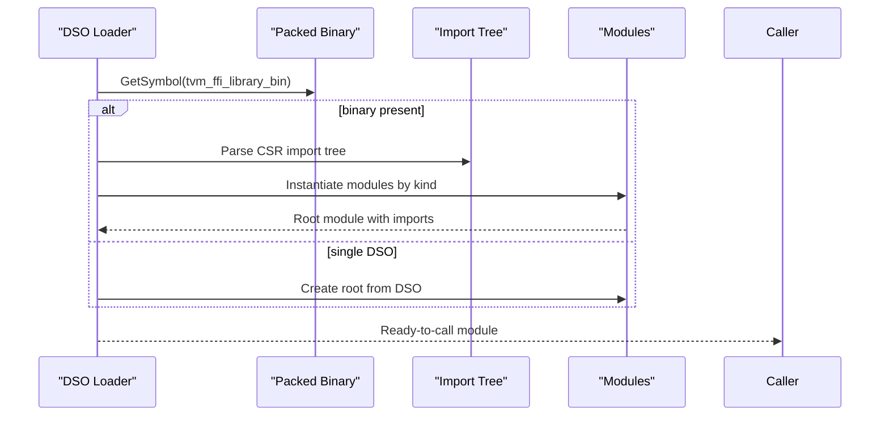
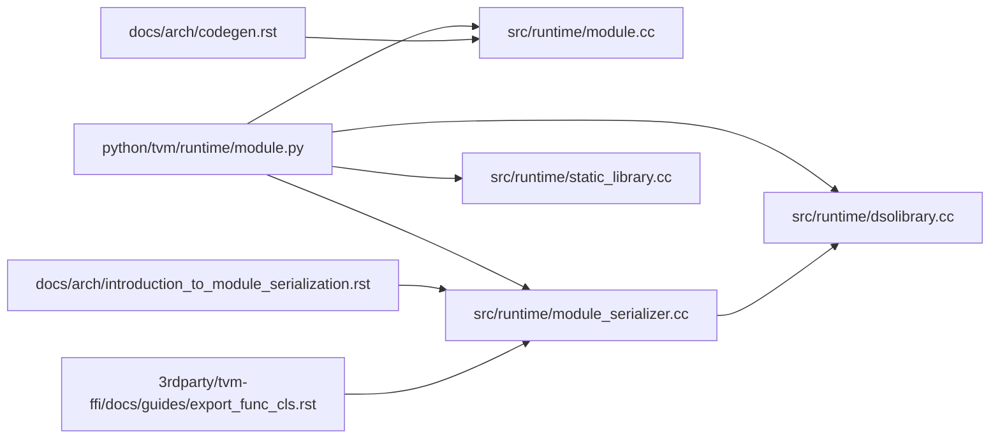

# Module Serialization and Deployment

<cite>
**Referenced Files in This Document**
- [module.py](file://python/tvm/runtime/module.py)
- [__init__.py](file://python/tvm/runtime/__init__.py)
- [build_module.py](file://python/tvm/driver/build_module.py)
- [module.cc](file://src/runtime/module.cc)
- [module_serializer.h](file://src/runtime/module_serializer.h)
- [module_serializer.cc](file://src/runtime/module_serializer.cc)
- [dsolibrary.cc](file://src/runtime/dsolibrary.cc)
- [static_library.cc](file://src/runtime/static_library.cc)
- [introduction_to_module_serialization.rst](file://docs/arch/introduction_to_module_serialization.rst)
- [codegen.rst](file://docs/arch/codegen.rst)
- [export_func_cls.rst](file://3rdparty/tvm-ffi/docs/guides/export_func_cls.rst)
- [tools.py](file://python/tvm/contrib/hexagon/tools.py)
- [utils.py](file://python/tvm/contrib/utils.py)
</cite>

## Table of Contents
1. [Introduction](#introduction)
2. [Project Structure](#project-structure)
3. [Core Components](#core-components)
4. [Architecture Overview](#architecture-overview)
5. [Detailed Component Analysis](#detailed-component-analysis)
6. [Dependency Analysis](#dependency-analysis)
7. [Performance Considerations](#performance-considerations)
8. [Troubleshooting Guide](#troubleshooting-guide)
9. [Conclusion](#conclusion)
10. [Appendices](#appendices)

## Introduction
This document explains TVM’s unified module format and deployment system. It covers how IR modules are compiled into runtime modules, how modules are serialized into a single dynamic library or archive, and how the resulting binary is loaded and executed across platforms. It also details the import tree construction, dependency resolution, and cross-platform packaging strategies that enable seamless deployment.

## Project Structure
At a high level, TVM’s module system spans:
- Python runtime API for building, exporting, and loading modules
- C++ runtime for module serialization, deserialization, and dynamic library generation
- Documentation that defines the unified serialization format and deployment workflows

**Diagram sources**
- [module.py:147-318](file://python/tvm/runtime/module.py#L147-L318)
- [module.cc:38-88](file://src/runtime/module.cc#L38-L88)
- [module_serializer.cc](file://src/runtime/module_serializer.cc)
- [dsolibrary.cc](file://src/runtime/dsolibrary.cc)
- [static_library.cc:48-140](file://src/runtime/static_library.cc#L48-L140)
- [introduction_to_module_serialization.rst:26-163](file://docs/arch/introduction_to_module_serialization.rst#L26-L163)
- [codegen.rst:228-266](file://docs/arch/codegen.rst#L228-L266)
- [export_func_cls.rst:136-169](file://3rdparty/tvm-ffi/docs/guides/export_func_cls.rst#L136-L169)

**Section sources**
- [module.py:147-318](file://python/tvm/runtime/module.py#L147-L318)
- [module.cc:38-88](file://src/runtime/module.cc#L38-L88)
- [introduction_to_module_serialization.rst:26-163](file://docs/arch/introduction_to_module_serialization.rst#L26-L163)

## Core Components
- Python runtime module API: Provides export_library, load_module, and helpers for collecting DSO modules and packing imports.
- C++ runtime module: Implements module properties, reflection, and runtime-enabled checks.
- Serialization engine: Builds an import tree, serializes module blobs, and writes a packed binary symbol into the dynamic library.
- Dynamic library loader: Loads the packed binary and reconstructs the module tree at runtime.
- Static library support: Allows linking prebuilt object files into the final shared library.
- Documentation: Defines the unified serialization format and deployment semantics.

Key responsibilities:
- Unified module format: A packed binary with an import tree and per-module blobs.
- Import tree: Parent-child relationships encoded as CSR arrays for reconstruction.
- Binary blob handling: Each module contributes a typed blob; host DSO modules contribute a special marker.
- Cross-platform packaging: Uses LLVM target triples and platform-aware compilers.

**Section sources**
- [module.py:108-318](file://python/tvm/runtime/module.py#L108-L318)
- [module.cc:38-88](file://src/runtime/module.cc#L38-L88)
- [introduction_to_module_serialization.rst:52-163](file://docs/arch/introduction_to_module_serialization.rst#L52-L163)
- [export_func_cls.rst:136-169](file://3rdparty/tvm-ffi/docs/guides/export_func_cls.rst#L136-L169)

## Architecture Overview
The unified module format is a packed binary stored under a well-known symbol in the dynamic library. It encodes:
- One or more module blobs (typed by kind)
- An import tree (CSR-encoded parent-child relationships)
- A header indicating total byte length and module kinds

At export, TVM collects DSO modules, optionally packs imported modules into a single artifact, and links everything into a shared library or tarball. At load, the runtime reads the packed symbol, reconstructs the import tree, and instantiates modules by kind.

**Diagram sources**
- [module.py:147-318](file://python/tvm/runtime/module.py#L147-L318)
- [introduction_to_module_serialization.rst:30-50](file://docs/arch/introduction_to_module_serialization.rst#L30-L50)

## Detailed Component Analysis

### Python Module API: Export and Load
- export_library: Collects DSO modules, writes them to object files, optionally packs imports into a C or LLVM blob, and invokes a compiler to produce a shared library or tarball. It supports system libraries, target-specific object formats, and includes header paths for C modules.
- load_module: Handles .o and .tar inputs by converting to a shared library when necessary, then delegates to the underlying loader.
- load_static_library: Loads a raw static library (.o) as a module without relinking.

**Diagram sources**
- [module.py:147-318](file://python/tvm/runtime/module.py#L147-L318)

**Section sources**
- [module.py:147-318](file://python/tvm/runtime/module.py#L147-L318)

### C++ Runtime: Module Properties and Reflection
- RuntimeEnabled: Determines whether a given target’s runtime is available by checking global functions for device APIs and optional runtimes.
- Static init block registers context functions and exposes RuntimeEnabled globally.

**Section sources**
- [module.cc:38-88](file://src/runtime/module.cc#L38-L88)

### Serialization Engine: Import Tree and Blob Packing
- Import tree construction: Performs a depth-first traversal to index modules and build a CSR-encoded parent-child structure.
- Blob format: Each module contributes a typed blob; host DSO modules contribute a special marker; device modules contribute serialized binaries.
- Packed symbol: The entire payload is written under a symbol recognized by the loader.

**Diagram sources**
- [introduction_to_module_serialization.rst:52-163](file://docs/arch/introduction_to_module_serialization.rst#L52-L163)

**Section sources**
- [introduction_to_module_serialization.rst:52-163](file://docs/arch/introduction_to_module_serialization.rst#L52-L163)

### Dynamic Library Loader: Reconstruction and Execution
- The loader reads the packed symbol from the dynamic library, reconstructs the import tree, and instantiates modules by kind. Custom module kinds must be available at load time (either embedded or preloaded).
- The loader handles the case where only a single DSO module exists (no import tree).

**Diagram sources**
- [introduction_to_module_serialization.rst:142-163](file://docs/arch/introduction_to_module_serialization.rst#L142-L163)
- [export_func_cls.rst:136-169](file://3rdparty/tvm-ffi/docs/guides/export_func_cls.rst#L136-L169)

**Section sources**
- [introduction_to_module_serialization.rst:142-163](file://docs/arch/introduction_to_module_serialization.rst#L142-L163)
- [export_func_cls.rst:136-169](file://3rdparty/tvm-ffi/docs/guides/export_func_cls.rst#L136-L169)

### Static Library Support
- StaticLibraryNode: Represents a raw object file with a list of exported function names. It supports SaveToBytes, LoadFromBytes, and WriteToFile, enabling it to be linked into the final shared library without relinking.

**Section sources**
- [static_library.cc:48-140](file://src/runtime/static_library.cc#L48-L140)

### Cross-Platform Packaging and Target Awareness
- Target triple detection and system library flags are integrated into the export pipeline. The Python API selects object formats and passes include paths for C modules, while the loader reconstructs the module tree regardless of platform specifics.
- Hexagon tools demonstrate packing imports to a tensor-backed binary for specialized deployments.

**Section sources**
- [module.py:277-318](file://python/tvm/runtime/module.py#L277-L318)
- [tools.py:314-338](file://python/tvm/contrib/hexagon/tools.py#L314-L338)

## Dependency Analysis
- Python runtime module API depends on:
  - C++ runtime module properties and reflection
  - Serialization engine for packing imports
  - Compiler/Archiver utilities for producing artifacts
- Serialization engine depends on:
  - Module import relationships
  - Module-specific serialization logic
- Loader depends on:
  - Packed binary symbol
  - Module kind registry for reconstruction

**Diagram sources**
- [module.py:147-318](file://python/tvm/runtime/module.py#L147-L318)
- [module.cc:38-88](file://src/runtime/module.cc#L38-L88)
- [module_serializer.cc](file://src/runtime/module_serializer.cc)
- [dsolibrary.cc](file://src/runtime/dsolibrary.cc)
- [static_library.cc:48-140](file://src/runtime/static_library.cc#L48-L140)
- [introduction_to_module_serialization.rst:52-163](file://docs/arch/introduction_to_module_serialization.rst#L52-L163)
- [codegen.rst:228-266](file://docs/arch/codegen.rst#L228-L266)
- [export_func_cls.rst:136-169](file://3rdparty/tvm-ffi/docs/guides/export_func_cls.rst#L136-L169)

**Section sources**
- [module.py:147-318](file://python/tvm/runtime/module.py#L147-L318)
- [module.cc:38-88](file://src/runtime/module.cc#L38-L88)
- [introduction_to_module_serialization.rst:52-163](file://docs/arch/introduction_to_module_serialization.rst#L52-L163)

## Performance Considerations
- Minimizing import tree depth reduces reconstruction overhead at load time.
- Prefer LLVM-based packing when available to reduce C code generation overhead.
- Use system libraries judiciously; they increase binary size but simplify deployment.
- For large device modules, ensure efficient serialization and avoid redundant copies during export.

## Troubleshooting Guide
- Cannot export in runtime-only mode: The export API raises an error when TVM is compiled in runtime-only mode.
- Missing runtime for target: Use the enabled function to check availability before export or deployment.
- Incorrect object format: Ensure the chosen format matches the compiler and target (e.g., nvcc for CUDA).
- Missing include paths for C modules: The API adds include paths automatically; verify options are passed correctly.
- Import tree reconstruction failures: Confirm that custom module kinds are available at load time or embedded in the library.

**Section sources**
- [module.py:209-210](file://python/tvm/runtime/module.py#L209-L210)
- [module.py:471-494](file://python/tvm/runtime/module.py#L471-L494)
- [module.py:309-317](file://python/tvm/runtime/module.py#L309-L317)

## Conclusion
TVM’s unified module format and deployment pipeline provide a robust, cross-platform solution for packaging and distributing compiled AI workloads. By serializing module trees and device-specific blobs into a single dynamic library, TVM enables seamless deployment across diverse targets while preserving the abstraction of runtime modules. The documented workflows and APIs make it straightforward to export, package, and load modules reliably.

## Appendices

### Example Workflows
- Exporting a module for deployment:
  - Build an IR module to a runtime executable
  - Call export_library with desired file name and target-specific options
  - Load the resulting artifact with load_module or system_lib APIs
- Loading and executing:
  - Use load_module to open a shared library or tarball
  - Access functions via the returned module’s GetFunction interface

**Section sources**
- [build_module.py:72-113](file://python/tvm/driver/build_module.py#L72-L113)
- [module.py:418-462](file://python/tvm/runtime/module.py#L418-L462)
- [codegen.rst:228-266](file://docs/arch/codegen.rst#L228-L266)