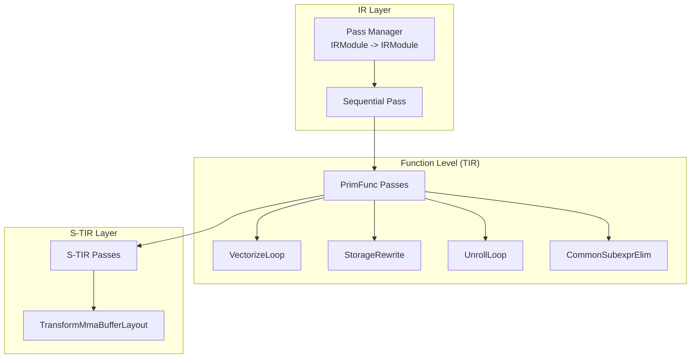
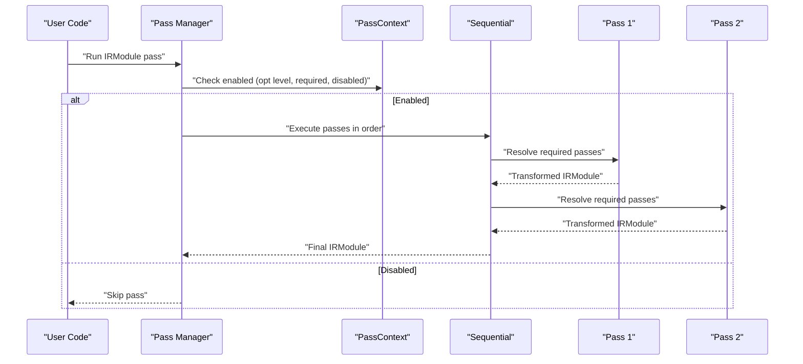
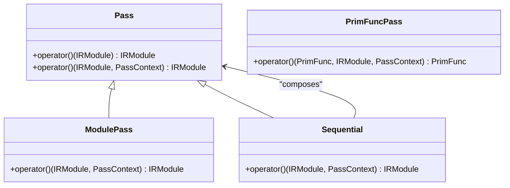
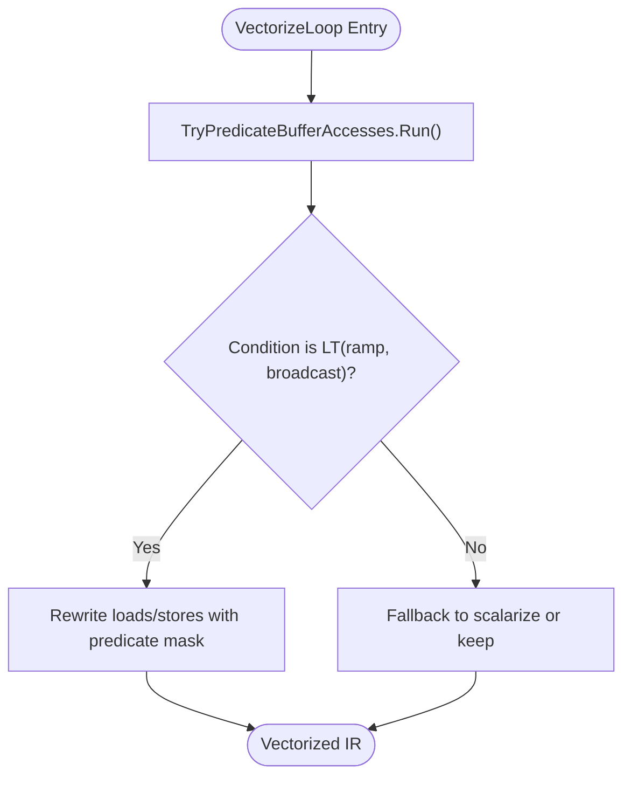
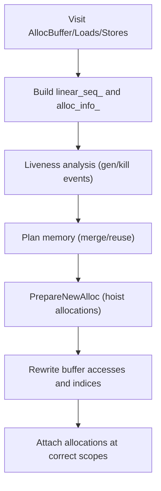
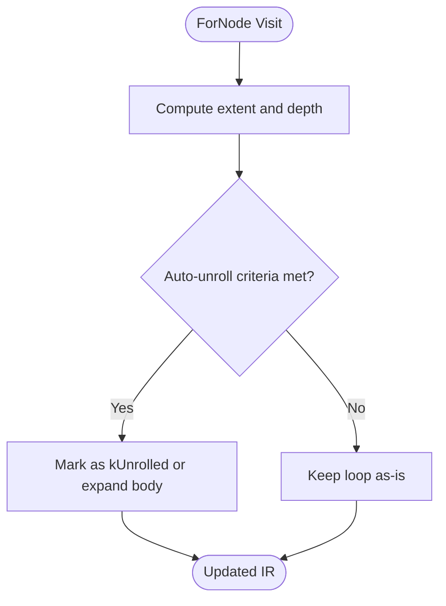
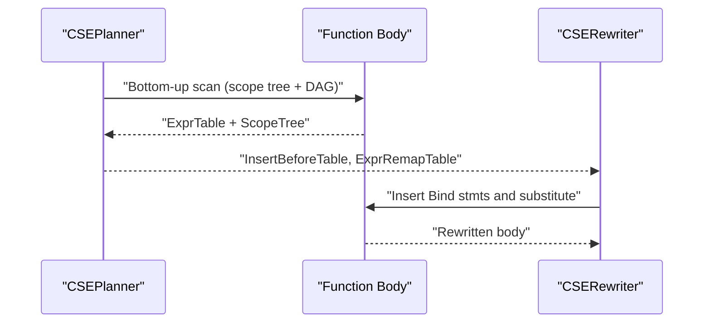
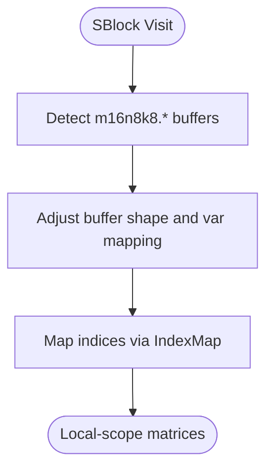
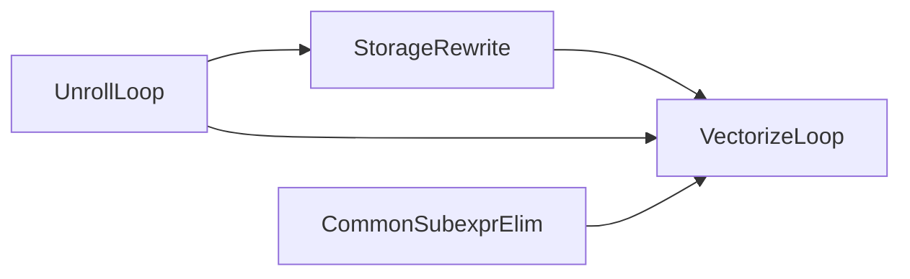

# Built-in Optimization Passes

<cite>
**Referenced Files in This Document**
- [ir/transform.h](file://include/tvm/ir/transform.h)
- [ir/transform.cc](file://src/ir/transform.cc)
- [ir/apply_pass_to_function.cc](file://src/ir/apply_pass_to_function.cc)
- [tirx/transform.h](file://include/tvm/tirx/transform.h)
- [tirx/transform/vectorize_loop.cc](file://src/tirx/transform/vectorize_loop.cc)
- [tirx/transform/storage_rewrite.cc](file://src/tirx/transform/storage_rewrite.cc)
- [tirx/transform/unroll_loop.cc](file://src/tirx/transform/unroll_loop.cc)
- [tirx/transform/common_subexpr_elim.cc](file://src/tirx/transform/common_subexpr_elim.cc)
- [s_tir/transform.h](file://include/tvm/s_tir/transform.h)
- [s_tir/transform/transform_mma_buffer_layout.cc](file://src/s_tir/transform/transform_mma_buffer_layout.cc)
</cite>

## Table of Contents
1. [Introduction](#introduction)
2. [Project Structure](#project-structure)
3. [Core Components](#core-components)
4. [Architecture Overview](#architecture-overview)
5. [Detailed Component Analysis](#detailed-component-analysis)
6. [Dependency Analysis](#dependency-analysis)
7. [Performance Considerations](#performance-considerations)
8. [Troubleshooting Guide](#troubleshooting-guide)
9. [Conclusion](#conclusion)

## Introduction
This document explains TVM’s built-in optimization passes across IR layers, focusing on:
- Module-level passes for global optimizations
- Function-level passes for intra-function improvements
- TensorIR-specific passes for vectorization, storage, loops, and memory optimization
- Pass categorization by optimization level
- Composition patterns, dependencies, ordering, and performance characteristics

It synthesizes the pass infrastructure, representative implementations, and their interactions to help users compose efficient compilation pipelines.

## Project Structure
TVM organizes passes around a unified pass manager with three primary layers:
- IR module-level passes: IRModule → IRModule transformations
- Function-level passes: PrimFunc transformations within a module
- TensorIR-specific passes: TIR-level transformations for scheduling and lowering

Representative headers and implementations:
- IR pass infrastructure: [ir/transform.h](file://include/tvm/ir/transform.h), [ir/transform.cc](file://src/ir/transform.cc)
- Function-level TIR passes: [tirx/transform.h](file://include/tvm/tirx/transform.h)
- Examples of TIR passes: vectorization, storage rewrite, loop unrolling, common subexpression elimination
- S-TIR passes: [s_tir/transform.h](file://include/tvm/s_tir/transform.h), MMA buffer layout transformer

**Diagram sources**
- [ir/transform.h:327-426](file://include/tvm/ir/transform.h#L327-L426)
- [ir/transform.cc:428-488](file://src/ir/transform.cc#L428-L488)
- [tirx/transform.h:38-61](file://include/tvm/tirx/transform.h#L38-L61)
- [s_tir/transform.h:46-370](file://include/tvm/s_tir/transform.h#L46-L370)

**Section sources**
- [ir/transform.h:327-426](file://include/tvm/ir/transform.h#L327-L426)
- [ir/transform.cc:428-488](file://src/ir/transform.cc#L428-L488)
- [tirx/transform.h:38-61](file://include/tvm/tirx/transform.h#L38-L61)
- [s_tir/transform.h:46-370](file://include/tvm/s_tir/transform.h#L46-L370)

## Core Components
- Pass manager and pass context
  - Passes are IRModule → IRModule transformations with metadata (opt level, name, required passes).
  - PassContext controls opt level, enabling/disabling passes, instrumentation, and configuration.
- Sequential pass composition
  - Compose multiple passes with dependency resolution and ordering enforcement.
- Function-level pass creation
  - PrimFunc passes operate on individual functions within a module.

Key APIs and behaviors:
- Pass creation and execution: [ir/transform.h:528-530](file://include/tvm/ir/transform.h#L528-L530), [ir/transform.cc:490-494](file://src/ir/transform.cc#L490-L494)
- Sequential pass execution and dependency resolution: [ir/transform.cc:470-488](file://src/ir/transform.cc#L470-L488)
- Pass context evaluation (enabled/disabled/required): [ir/transform.cc:94-104](file://src/ir/transform.cc#L94-L104)
- Apply a pass to specific functions by regex: [ir/apply_pass_to_function.cc:59-131](file://src/ir/apply_pass_to_function.cc#L59-L131)

**Section sources**
- [ir/transform.h:528-530](file://include/tvm/ir/transform.h#L528-L530)
- [ir/transform.cc:94-104](file://src/ir/transform.cc#L94-L104)
- [ir/transform.cc:470-488](file://src/ir/transform.cc#L470-L488)
- [ir/apply_pass_to_function.cc:59-131](file://src/ir/apply_pass_to_function.cc#L59-L131)

## Architecture Overview
The pass manager orchestrates module-level and sequential passes. Each pass consults PassContext to decide whether to run based on opt level and configured filters. Sequential passes enforce ordering and can resolve required dependencies before applying each pass.

**Diagram sources**
- [ir/transform.cc:290-311](file://src/ir/transform.cc#L290-L311)
- [ir/transform.cc:470-488](file://src/ir/transform.cc#L470-L488)
- [ir/transform.cc:94-104](file://src/ir/transform.cc#L94-L104)

**Section sources**
- [ir/transform.cc:290-311](file://src/ir/transform.cc#L290-L311)
- [ir/transform.cc:470-488](file://src/ir/transform.cc#L470-L488)

## Detailed Component Analysis

### Module-Level Passes
- Purpose: Global optimizations across the module (e.g., IPO-like transformations).
- Implementation: IRModule → IRModule pass with PassInfo metadata.
- Ordering: Sequential pass enforces order; resolves required passes before each pass.

Representative behaviors:
- Pass creation and info: [ir/transform.h:528-530](file://include/tvm/ir/transform.h#L528-L530), [ir/transform.cc:490-494](file://src/ir/transform.cc#L490-L494)
- Execution and diagnostics: [ir/transform.cc:395-426](file://src/ir/transform.cc#L395-L426)
- Sequential execution and dependency resolution: [ir/transform.cc:470-488](file://src/ir/transform.cc#L470-L488)

**Section sources**
- [ir/transform.h:528-530](file://include/tvm/ir/transform.h#L528-L530)
- [ir/transform.cc:395-426](file://src/ir/transform.cc#L395-L426)
- [ir/transform.cc:470-488](file://src/ir/transform.cc#L470-L488)

### Function-Level Passes (TIR)
Function-level passes operate on PrimFuncs and are created via a dedicated factory.

- Pass creation: [tirx/transform.h:58-60](file://include/tvm/tirx/transform.h#L58-L60)
- Representative passes:
  - Vectorization: [tirx/transform/vectorize_loop.cc:78-88](file://src/tirx/transform/vectorize_loop.cc#L78-L88)
  - Storage rewrite: [tirx/transform/storage_rewrite.cc:52-241](file://src/tirx/transform/storage_rewrite.cc#L52-L241)
  - Loop unrolling: [tirx/transform/unroll_loop.cc:120-164](file://src/tirx/transform/unroll_loop.cc#L120-L164)
  - Common subexpression elimination: [tirx/transform/common_subexpr_elim.cc:145-154](file://src/tirx/transform/common_subexpr_elim.cc#L145-L154)

**Diagram sources**
- [ir/transform.h:365-434](file://include/tvm/ir/transform.h#L365-L434)
- [ir/transform.cc:428-441](file://src/ir/transform.cc#L428-L441)
- [tirx/transform.h:58-60](file://include/tvm/tirx/transform.h#L58-L60)

**Section sources**
- [tirx/transform.h:58-60](file://include/tvm/tirx/transform.h#L58-L60)

### Vectorization (TIR)
Purpose: Vectorize loops and buffer accesses to leverage SIMD/VECs. Supports scalable vectors and predicate-based buffer access.

Key behaviors:
- Predicate buffer accesses when conditions match vectorized ramps: [tirx/transform/vectorize_loop.cc:124-147](file://src/tirx/transform/vectorize_loop.cc#L124-L147)
- Vectorized expression rewriting with broadcasting and lane handling: [tirx/transform/vectorize_loop.cc:292-451](file://src/tirx/transform/vectorize_loop.cc#L292-L451)
- Pass registration and configuration: [tirx/transform.h](file://include/tvm/tirx/transform.h#L69)

**Diagram sources**
- [tirx/transform/vectorize_loop.cc:124-147](file://src/tirx/transform/vectorize_loop.cc#L124-L147)
- [tirx/transform/vectorize_loop.cc:150-185](file://src/tirx/transform/vectorize_loop.cc#L150-L185)

**Section sources**
- [tirx/transform/vectorize_loop.cc:78-88](file://src/tirx/transform/vectorize_loop.cc#L78-L88)
- [tirx/transform/vectorize_loop.cc:124-147](file://src/tirx/transform/vectorize_loop.cc#L124-L147)
- [tirx/transform/vectorize_loop.cc:292-451](file://src/tirx/transform/vectorize_loop.cc#L292-L451)
- [tirx/transform.h](file://include/tvm/tirx/transform.h#L69)

### Storage Rewrite (TIR)
Purpose: Optimize memory allocation and sharing by analyzing liveness and access patterns.

Key behaviors:
- Linear access pattern finder and liveness analysis: [tirx/transform/storage_rewrite.cc:66-241](file://src/tirx/transform/storage_rewrite.cc#L66-L241)
- Storage plan rewriter and buffer remapping: [tirx/transform/storage_rewrite.cc:397-562](file://src/tirx/transform/storage_rewrite.cc#L397-L562)
- In-place verification and reuse heuristics: [tirx/transform/storage_rewrite.cc:269-387](file://src/tirx/transform/storage_rewrite.cc#L269-L387)

**Diagram sources**
- [tirx/transform/storage_rewrite.cc:66-241](file://src/tirx/transform/storage_rewrite.cc#L66-L241)
- [tirx/transform/storage_rewrite.cc:397-562](file://src/tirx/transform/storage_rewrite.cc#L397-L562)

**Section sources**
- [tirx/transform/storage_rewrite.cc:66-241](file://src/tirx/transform/storage_rewrite.cc#L66-L241)
- [tirx/transform/storage_rewrite.cc:397-562](file://src/tirx/transform/storage_rewrite.cc#L397-L562)

### Loop Unrolling (TIR)
Purpose: Unroll loops to reduce overhead and enable register-level optimizations, with configurable thresholds.

Key behaviors:
- Auto-unroll heuristics and explicit unroll pragmas: [tirx/transform/unroll_loop.cc:120-164](file://src/tirx/transform/unroll_loop.cc#L120-L164)
- Local memory access detection requiring unrolling: [tirx/transform/unroll_loop.cc:166-193](file://src/tirx/transform/unroll_loop.cc#L166-L193)
- Pass registration and configuration: [tirx/transform/unroll_loop.cc:281-292](file://src/tirx/transform/unroll_loop.cc#L281-L292)

**Diagram sources**
- [tirx/transform/unroll_loop.cc:120-164](file://src/tirx/transform/unroll_loop.cc#L120-L164)

**Section sources**
- [tirx/transform/unroll_loop.cc:120-164](file://src/tirx/transform/unroll_loop.cc#L120-L164)
- [tirx/transform/unroll_loop.cc:281-292](file://src/tirx/transform/unroll_loop.cc#L281-L292)

### Common Subexpression Elimination (TIR)
Purpose: Reduce redundant computations by introducing Bind variables and substituting repeated expressions.

Key behaviors:
- Planner phase: build scope tree and expression DAG, compute LCA and insertion points: [tirx/transform/common_subexpr_elim.cc:133-278](file://src/tirx/transform/common_subexpr_elim.cc#L133-L278)
- Rewriter phase: insert Bind statements and substitute expressions: [tirx/transform/common_subexpr_elim.cc:698-755](file://src/tirx/transform/common_subexpr_elim.cc#L698-L755)

**Diagram sources**
- [tirx/transform/common_subexpr_elim.cc:133-278](file://src/tirx/transform/common_subexpr_elim.cc#L133-L278)
- [tirx/transform/common_subexpr_elim.cc:698-755](file://src/tirx/transform/common_subexpr_elim.cc#L698-L755)

**Section sources**
- [tirx/transform/common_subexpr_elim.cc:133-278](file://src/tirx/transform/common_subexpr_elim.cc#L133-L278)
- [tirx/transform/common_subexpr_elim.cc:698-755](file://src/tirx/transform/common_subexpr_elim.cc#L698-L755)

### S-TIR Passes
S-TIR extends TIR with scheduling constructs and higher-level transformations.

Representative passes:
- Canonicalize loops, thread binding, buffer allocation planning, and block lowering: [s_tir/transform.h:56-156](file://include/tvm/s_tir/transform.h#L56-L156)
- MMA buffer layout transformation: [s_tir/transform/transform_mma_buffer_layout.cc:45-178](file://src/s_tir/transform/transform_mma_buffer_layout.cc#L45-L178)

**Diagram sources**
- [s_tir/transform/transform_mma_buffer_layout.cc:45-178](file://src/s_tir/transform/transform_mma_buffer_layout.cc#L45-L178)

**Section sources**
- [s_tir/transform.h:56-156](file://include/tvm/s_tir/transform.h#L56-L156)
- [s_tir/transform/transform_mma_buffer_layout.cc:45-178](file://src/s_tir/transform/transform_mma_buffer_layout.cc#L45-L178)

## Dependency Analysis
- Pass dependencies
  - Required passes are resolved before applying a pass in Sequential: [ir/transform.cc:480-483](file://src/ir/transform.cc#L480-L483)
  - Pass enabled/disabled/required evaluated via PassContext: [ir/transform.cc:94-104](file://src/ir/transform.cc#L94-L104)
- Interactions between passes
  - Vectorization often follows storage flattening and loop canonicalization to maximize vector lanes: [tirx/transform.h:309-310](file://include/tvm/tirx/transform.h#L309-L310)
  - Loop unrolling may be required for local memory access to become register-level: [tirx/transform/unroll_loop.cc:137-141](file://src/tirx/transform/unroll_loop.cc#L137-L141)
  - Storage rewrite precedes vectorization to ensure compatible shapes and indices: [tirx/transform/storage_rewrite.cc:422-437](file://src/tirx/transform/storage_rewrite.cc#L422-L437)

**Diagram sources**
- [tirx/transform/storage_rewrite.cc:422-437](file://src/tirx/transform/storage_rewrite.cc#L422-L437)
- [tirx/transform/vectorize_loop.cc:78-88](file://src/tirx/transform/vectorize_loop.cc#L78-L88)
- [tirx/transform/unroll_loop.cc:137-141](file://src/tirx/transform/unroll_loop.cc#L137-L141)
- [tirx/transform/common_subexpr_elim.cc:145-154](file://src/tirx/transform/common_subexpr_elim.cc#L145-L154)

**Section sources**
- [ir/transform.cc:480-483](file://src/ir/transform.cc#L480-L483)
- [ir/transform.cc:94-104](file://src/ir/transform.cc#L94-L104)
- [tirx/transform.h:309-310](file://include/tvm/tirx/transform.h#L309-L310)
- [tirx/transform/unroll_loop.cc:137-141](file://src/tirx/transform/unroll_loop.cc#L137-L141)
- [tirx/transform/storage_rewrite.cc:422-437](file://src/tirx/transform/storage_rewrite.cc#L422-L437)

## Performance Considerations
- Optimization level
  - Passes are gated by opt level; higher levels enable more aggressive optimizations: [ir/transform.cc:94-104](file://src/ir/transform.cc#L94-L104)
- Pass instrumentation
  - Optional instrumentation hooks for enter/exit contexts and per-pass callbacks: [ir/transform.cc:209-288](file://src/ir/transform.cc#L209-L288)
- Configurable thresholds
  - Vectorization and unrolling expose thresholds and pragmas to balance code size and throughput: [tirx/transform/vectorize_loop.cc:78-88](file://src/tirx/transform/vectorize_loop.cc#L78-L88), [tirx/transform/unroll_loop.cc:41-76](file://src/tirx/transform/unroll_loop.cc#L41-L76)
- Memory reuse
  - Storage rewrite reduces memory footprint and improves locality; may increase compile time: [tirx/transform/storage_rewrite.cc:397-420](file://src/tirx/transform/storage_rewrite.cc#L397-L420)

[No sources needed since this section provides general guidance]

## Troubleshooting Guide
- Pass disabled or not running
  - Verify opt level and required/disabled lists in PassContext: [ir/transform.cc:94-104](file://src/ir/transform.cc#L94-L104)
- Pass instrumentation failures
  - Instrumentation disables itself on failure; check logs for clearing and exiting contexts: [ir/transform.cc:185-206](file://src/ir/transform.cc#L185-L206), [ir/transform.cc:248-257](file://src/ir/transform.cc#L248-L257)
- Applying passes to specific functions
  - Use regex-based pass application to limit scope and avoid mutating unintended functions: [ir/apply_pass_to_function.cc:59-131](file://src/ir/apply_pass_to_function.cc#L59-L131)
- Immutable module assertion
  - Testing mode validates pass immutability; failures indicate unexpected mutations: [ir/transform.cc:313-325](file://src/ir/transform.cc#L313-L325)

**Section sources**
- [ir/transform.cc:94-104](file://src/ir/transform.cc#L94-L104)
- [ir/transform.cc:185-206](file://src/ir/transform.cc#L185-L206)
- [ir/transform.cc:248-257](file://src/ir/transform.cc#L248-L257)
- [ir/apply_pass_to_function.cc:59-131](file://src/ir/apply_pass_to_function.cc#L59-L131)
- [ir/transform.cc:313-325](file://src/ir/transform.cc#L313-L325)

## Conclusion
TVM’s pass infrastructure provides a robust, configurable framework for optimizing across IR layers. Module-level and sequential passes coordinate global transformations, while function-level TIR passes deliver targeted improvements such as vectorization, storage optimization, loop unrolling, and CSE. Proper ordering and configuration—guided by opt levels, required passes, and thresholds—are essential to achieving strong performance and predictable results.