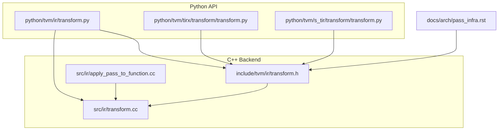
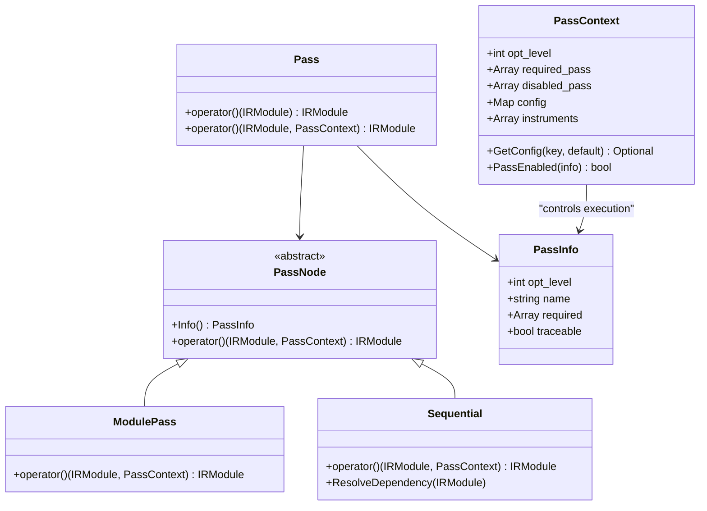
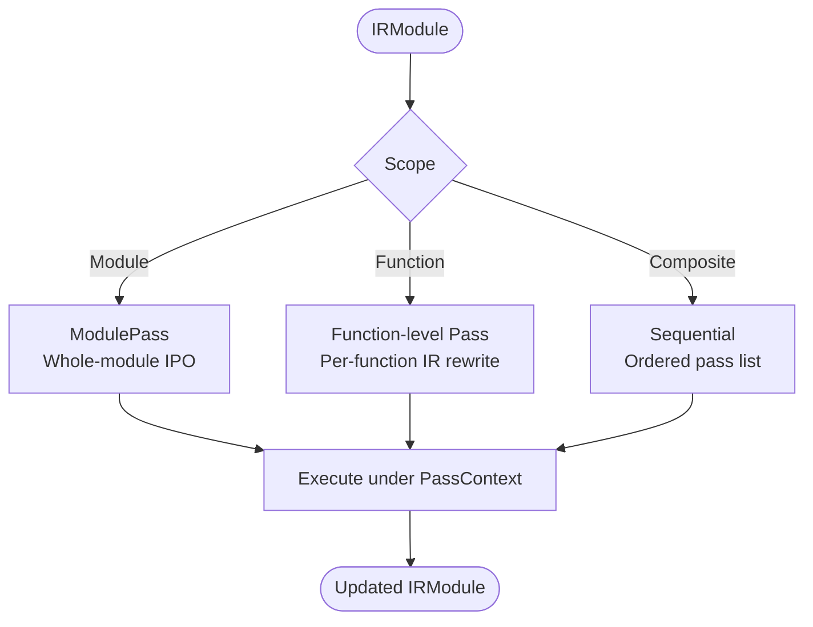
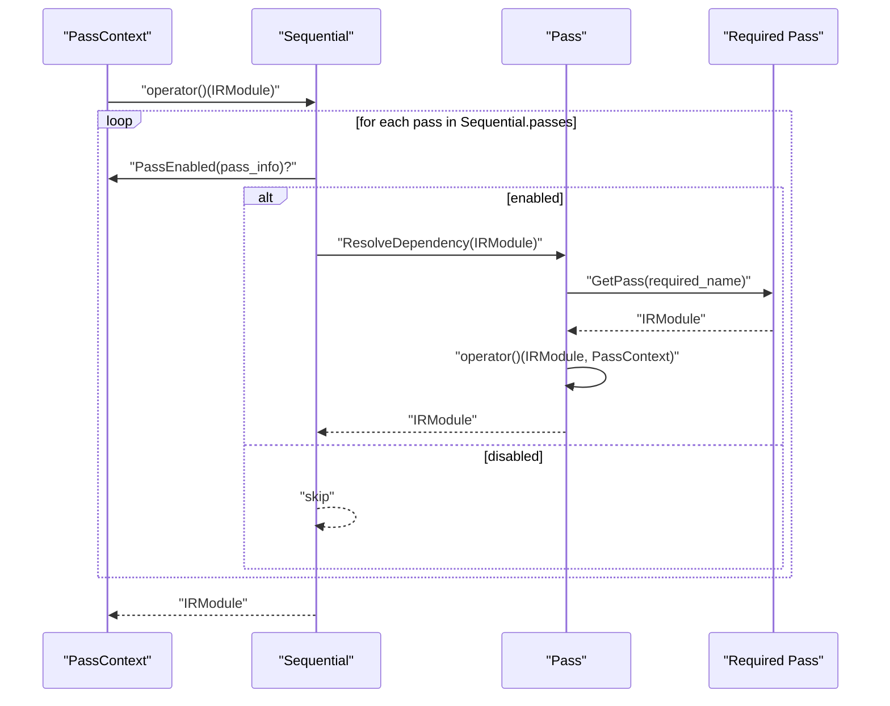
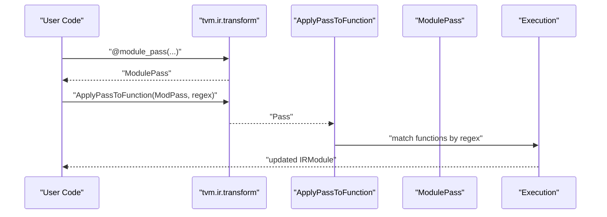
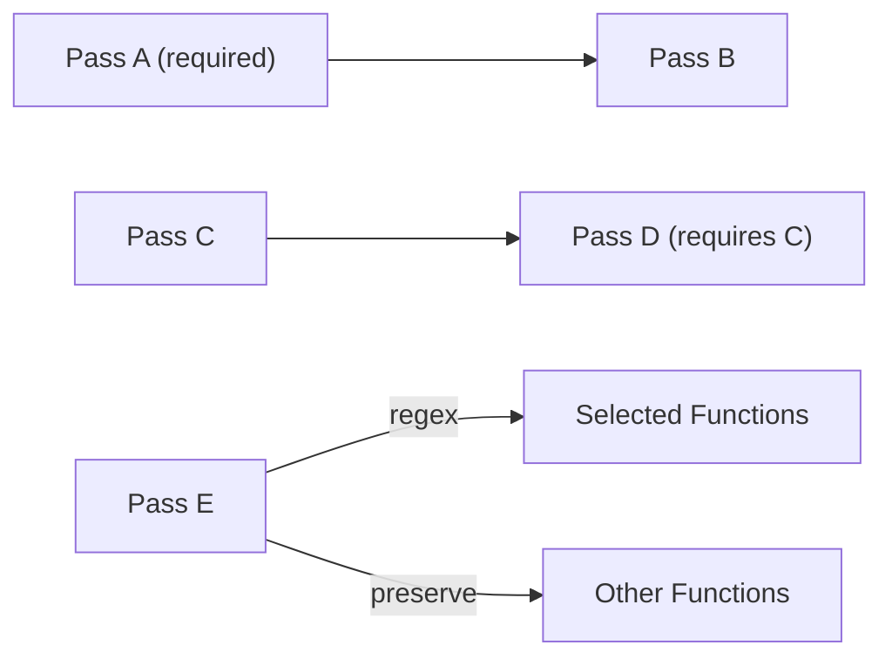

# Pass Categories and Classification

<cite>
**Referenced Files in This Document**
- [transform.cc](file://src/ir/transform.cc)
- [transform.h](file://include/tvm/ir/transform.h)
- [transform.py](file://python/tvm/ir/transform.py)
- [apply_pass_to_function.cc](file://src/ir/apply_pass_to_function.cc)
- [tirx_transform.py](file://python/tvm/tirx/transform/transform.py)
- [s_tir_transform.py](file://python/tvm/s_tir/transform/transform.py)
- [pass_infra.rst](file://docs/arch/pass_infra.rst)
</cite>

## Table of Contents
1. [Introduction](#introduction)
2. [Project Structure](#project-structure)
3. [Core Components](#core-components)
4. [Architecture Overview](#architecture-overview)
5. [Detailed Component Analysis](#detailed-component-analysis)
6. [Dependency Analysis](#dependency-analysis)
7. [Performance Considerations](#performance-considerations)
8. [Troubleshooting Guide](#troubleshooting-guide)
9. [Conclusion](#conclusion)

## Introduction
This document explains how TVM classifies and manages optimization passes across IR variants. It covers:
- Pass classification by scope (module-level vs function-level) and by effect (destructive vs non-destructive)
- Pass types by optimization intent (algebraic, structural, memory, parallel)
- Pass dependency relationships, ordering constraints, and composition patterns
- Configuration mechanisms, parameter tuning, and performance impact assessment
- Guidelines for selecting passes based on target hardware and workload
- Debugging and profiling techniques

## Project Structure
TVM’s pass infrastructure centers on a unified IRModule-to-IRModule transformation framework. Python wrappers expose pass APIs, while C++ backends implement pass execution, dependency resolution, and instrumentation.

**Diagram sources**
- [transform.py](file://python/tvm/ir/transform.py)
- [tirx_transform.py](file://python/tvm/tirx/transform/transform.py)
- [s_tir_transform.py](file://python/tvm/s_tir/transform/transform.py)
- [transform.h](file://include/tvm/ir/transform.h)
- [transform.cc](file://src/ir/transform.cc)
- [apply_pass_to_function.cc](file://src/ir/apply_pass_to_function.cc)
- [pass_infra.rst](file://docs/arch/pass_infra.rst)

**Section sources**
- [transform.h:74-398](file://include/tvm/ir/transform.h#L74-L398)
- [transform.cc:327-426](file://src/ir/transform.cc#L327-L426)
- [transform.py:30-224](file://python/tvm/ir/transform.py#L30-L224)
- [pass_infra.rst:124-252](file://docs/arch/pass_infra.rst#L124-L252)

## Core Components
- Pass and PassInfo: Metadata and execution contract for all passes.
- PassContext: Execution context controlling opt level, required/disabled passes, instrumentation, diagnostics, and configuration.
- ModulePass: Whole-module transformations (interprocedural/global).
- Sequential: Compose multiple passes with optional dependency resolution hooks.
- ApplyPassToFunction: Utility to apply a module pass to selected functions via regex.

Key capabilities:
- Pass filtering by opt level and required/disabled lists
- Instrumentation hooks before/after pass execution
- Immutable module assertion mode for safety
- Config registration and validation

**Section sources**
- [transform.h:319-363](file://include/tvm/ir/transform.h#L319-L363)
- [transform.h:79-138](file://include/tvm/ir/transform.h#L79-L138)
- [transform.cc:94-104](file://src/ir/transform.cc#L94-L104)
- [transform.cc:259-288](file://src/ir/transform.cc#L259-L288)
- [transform.cc:327-426](file://src/ir/transform.cc#L327-L426)
- [transform.cc:447-454](file://src/ir/transform.cc#L447-L454)
- [transform.cc:470-488](file://src/ir/transform.cc#L470-L488)
- [apply_pass_to_function.cc:59-131](file://src/ir/apply_pass_to_function.cc#L59-L131)

## Architecture Overview
The pass manager enforces a consistent interface across IR variants. Python constructs pass objects and pass pipelines; C++ backends execute them with context-aware filtering and instrumentation.

**Diagram sources**
- [transform.h:370-434](file://include/tvm/ir/transform.h#L370-L434)
- [transform.h:319-363](file://include/tvm/ir/transform.h#L319-L363)
- [transform.h:79-138](file://include/tvm/ir/transform.h#L79-L138)

**Section sources**
- [transform.h:370-434](file://include/tvm/ir/transform.h#L370-L434)
- [transform.cc:290-325](file://src/ir/transform.cc#L290-L325)
- [transform.cc:470-488](file://src/ir/transform.cc#L470-L488)

## Detailed Component Analysis

### Pass Scope Classification
- Module-level passes operate on the entire IRModule and can add/remove functions. They implement interprocedural/global optimizations.
- Function-level passes operate on individual functions within a module and cannot alter module-level structure.
- Sequential composes multiple passes and resolves required dependencies per pass.

**Diagram sources**
- [transform.h:207-244](file://include/tvm/ir/transform.h#L207-L244)
- [transform.cc:395-426](file://src/ir/transform.cc#L395-L426)
- [transform.cc:470-488](file://src/ir/transform.cc#L470-L488)

**Section sources**
- [transform.h:207-244](file://include/tvm/ir/transform.h#L207-L244)
- [transform.cc:395-426](file://src/ir/transform.cc#L395-L426)
- [pass_infra.rst:195-252](file://docs/arch/pass_infra.rst#L195-L252)

### Pass Effect Classification
- Destructive passes modify IR structure or semantics (e.g., dead code elimination, lowering intrinsics).
- Non-destructive passes transform IR without changing semantic equivalence (e.g., algebraic simplifications, layout rewrites).

Guidelines:
- Prefer non-destructive passes earlier to stabilize IR before destructive transformations.
- Use destructive passes to finalize lowering and device-specific code generation.

[No sources needed since this section provides general guidance]

### Pass Types by Optimization Intent
- Algebraic: Arithmetic simplifications, constant folding, and expression rewrites.
- Structural: Control-flow and block restructuring, SSA conversion, and opaque block handling.
- Memory: Storage allocation and access pattern rewrites, buffer compaction, and shared memory planning.
- Parallel: Loop transformations, thread binding, software pipelining, and synchronization insertion.

Examples exposed in Python APIs:
- Algebraic: Simplify, CommonSubexprElim, NarrowDataType
- Structural: ConvertBlocksToOpaque, LowerOpaqueBlock, FlattenBuffer
- Memory: StorageRewrite, CompactBufferAllocation, MergeSharedMemoryAllocations
- Parallel: InjectSoftwarePipeline, UnifyThreadBinding, ThreadSync

**Section sources**
- [tirx_transform.py:214-289](file://python/tvm/tirx/transform/transform.py#L214-L289)
- [tirx_transform.py:490-538](file://python/tvm/tirx/transform/transform.py#L490-L538)
- [s_tir_transform.py:25-505](file://python/tvm/s_tir/transform/transform.py#L25-L505)

### Pass Dependencies and Ordering Constraints
- PassInfo.required declares hard prerequisites for a pass.
- Sequential.ResolveDependency is reserved for future dependency graph construction; current execution resolves required passes by name before running each pass.
- Ordering is significant: algebraic simplifications often precede structural rewrites; memory optimizations often precede parallelization.

**Diagram sources**
- [transform.cc:447-454](file://src/ir/transform.cc#L447-L454)
- [transform.cc:470-488](file://src/ir/transform.cc#L470-L488)

**Section sources**
- [transform.cc:447-454](file://src/ir/transform.cc#L447-L454)
- [transform.cc:470-488](file://src/ir/transform.cc#L470-L488)

### Composition Patterns
- Decorators and builders construct ModulePass and Sequential with opt_level, name, required, and traceable flags.
- ApplyPassToFunction composes a module pass that selectively targets functions matching a regex, preserving others.

**Diagram sources**
- [transform.py:256-353](file://python/tvm/ir/transform.py#L256-L353)
- [apply_pass_to_function.cc:59-131](file://src/ir/apply_pass_to_function.cc#L59-L131)

**Section sources**
- [transform.py:256-353](file://python/tvm/ir/transform.py#L256-L353)
- [apply_pass_to_function.cc:59-131](file://src/ir/apply_pass_to_function.cc#L59-L131)

### Configuration Mechanisms and Parameter Tuning
- PassContext.config holds key-value pairs validated against registered types.
- PassContext.RegisterConfigOption registers typed configuration entries; ListConfigs enumerates available keys and types.
- PassContext.GetConfig retrieves typed values with defaults.

Common tuning knobs:
- Opt level thresholds to enable/disable passes
- Target-specific flags (e.g., vectorization enablement, buffer strictness)
- Instrumentation toggles for diagnostics and profiling

**Section sources**
- [transform.h:90-125](file://include/tvm/ir/transform.h#L90-L125)
- [transform.h:247-283](file://include/tvm/ir/transform.h#L247-L283)
- [transform.cc:106-180](file://src/ir/transform.cc#L106-L180)
- [transform.py:132-141](file://python/tvm/ir/transform.py#L132-L141)

### Performance Impact Assessment
- Instrumentation hooks allow ShouldRun, RunBeforePass, RunAfterPass decisions and side effects.
- Immutable module assertion mode detects unintended mutations during pass development.
- Built-in passes expose profiling intrinsics and bound-check instrumentation for performance analysis.

**Section sources**
- [transform.cc:209-288](file://src/ir/transform.cc#L209-L288)
- [transform.cc:313-325](file://src/ir/transform.cc#L313-L325)
- [s_tir_transform.py:313-343](file://python/tvm/s_tir/transform/transform.py#L313-L343)

## Dependency Analysis
- PassInfo.required encodes mandatory prerequisites.
- Sequential.ResolveDependency is reserved for future dependency graph building; current behavior executes required passes by name prior to each pass.
- ApplyPassToFunction dynamically selects functions and preserves non-target functions.

**Diagram sources**
- [transform.cc:447-454](file://src/ir/transform.cc#L447-L454)
- [transform.cc:470-488](file://src/ir/transform.cc#L470-L488)
- [apply_pass_to_function.cc:65-131](file://src/ir/apply_pass_to_function.cc#L65-L131)

**Section sources**
- [transform.cc:447-454](file://src/ir/transform.cc#L447-L454)
- [transform.cc:470-488](file://src/ir/transform.cc#L470-L488)
- [apply_pass_to_function.cc:65-131](file://src/ir/apply_pass_to_function.cc#L65-L131)

## Performance Considerations
- Prefer enabling passes with lower opt_level first to reduce overhead.
- Use selective application (regex) to minimize unnecessary work on large modules.
- Place memory optimizations before parallelization to maximize locality.
- Use profiling intrinsics and bound-check instrumentation to identify hotspots.

[No sources needed since this section provides general guidance]

## Troubleshooting Guide
- Use PrintIR to dump IR snapshots at key stages.
- Enable immutable module mode to catch unintended mutations.
- Inspect diagnostics and instrumentation logs for pass decisions.
- Validate configuration keys via ListConfigs and ensure types match expectations.

**Section sources**
- [transform.cc:640-646](file://src/ir/transform.cc#L640-L646)
- [transform.cc:313-325](file://src/ir/transform.cc#L313-L325)
- [transform.py:132-141](file://python/tvm/ir/transform.py#L132-L141)

## Conclusion
TVM’s pass infrastructure provides a robust, extensible framework for IR transformations. By combining module-level IPO, function-level rewrites, and compositional pipelines, developers can tailor optimization sequences to workload and target characteristics. Proper configuration, instrumentation, and selective application ensure predictable performance and maintainability.