# Relax Transform Passes

<cite>
**Referenced Files in This Document**
- [__init__.py](file://python/tvm/relax/transform/__init__.py)
- [transform.py](file://python/tvm/relax/transform/transform.py)
- [lambda_lift.cc](file://src/relax/transform/lambda_lift.cc)
- [convert_dataflow.cc](file://src/relax/transform/convert_dataflow.cc)
- [bind_params.cc](file://src/relax/transform/bind_params.cc)
- [fold_constant.cc](file://src/relax/transform/fold_constant.cc)
- [dead_code_elimination.cc](file://src/relax/transform/dead_code_elimination.cc)
- [fuse_ops.cc](file://src/relax/transform/fuse_ops.cc)
- [fuse_tir.cc](file://src/relax/transform/fuse_tir.cc)
- [to_mixed_precision.cc](file://src/relax/transform/to_mixed_precision.cc)
- [merge_composite_functions.cc](file://src/relax/transform/merge_composite_functions.cc)
- [gradient.cc](file://src/relax/transform/gradient.cc)
- [convert_layout.cc](file://src/relax/transform/convert_layout.cc)
- [legalize_ops/__init__.py](file://python/tvm/relax/transform/legalize_ops/__init__.py)
</cite>

## Table of Contents
1. [Introduction](#introduction)
2. [Project Structure](#project-structure)
3. [Core Components](#core-components)
4. [Architecture Overview](#architecture-overview)
5. [Detailed Component Analysis](#detailed-component-analysis)
6. [Dependency Analysis](#dependency-analysis)
7. [Performance Considerations](#performance-considerations)
8. [Troubleshooting Guide](#troubleshooting-guide)
9. [Conclusion](#conclusion)

## Introduction
This document describes the Relax IR transformation passes in the TVM codebase. It covers module-level passes (lambda lifting, dataflow conversion, parameter binding), function-level passes (constant folding, dead code elimination, operator fusion, layout transformations), and specialized passes (gradient computation, mixed precision conversion, composite function merging). For each pass, we explain implementation details, usage patterns, and performance implications, and we describe pass composition strategies and interaction effects.

## Project Structure
Relax transformation passes are organized into:
- Python entry points and pass factories in python/tvm/relax/transform
- Implementation in C++ under src/relax/transform
- Legalization helpers under python/tvm/relax/transform/legalize_ops

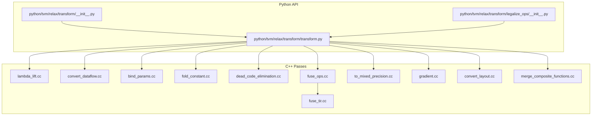

**Diagram sources**
- [transform.py](file://python/tvm/relax/transform/transform.py)
- [__init__.py](file://python/tvm/relax/transform/__init__.py)
- [legalize_ops/__init__.py](file://python/tvm/relax/transform/legalize_ops/__init__.py)
- [lambda_lift.cc](file://src/relax/transform/lambda_lift.cc)
- [convert_dataflow.cc](file://src/relax/transform/convert_dataflow.cc)
- [bind_params.cc](file://src/relax/transform/bind_params.cc)
- [fold_constant.cc](file://src/relax/transform/fold_constant.cc)
- [dead_code_elimination.cc](file://src/relax/transform/dead_code_elimination.cc)
- [fuse_ops.cc](file://src/relax/transform/fuse_ops.cc)
- [fuse_tir.cc](file://src/relax/transform/fuse_tir.cc)
- [to_mixed_precision.cc](file://src/relax/transform/to_mixed_precision.cc)
- [gradient.cc](file://src/relax/transform/gradient.cc)
- [convert_layout.cc](file://src/relax/transform/convert_layout.cc)
- [merge_composite_functions.cc](file://src/relax/transform/merge_composite_functions.cc)

**Section sources**
- [__init__.py](file://python/tvm/relax/transform/__init__.py)
- [transform.py](file://python/tvm/relax/transform/transform.py)

## Core Components
- Module-level passes operate on IRModule and often rewrite global function structure:
  - Lambda lifting: Lifts nested local functions to global scope, managing names and closures.
  - Dataflow conversion: Extracts sequences of pure operations into dataflow blocks.
  - Parameter binding: Binds function parameters to constants and normalizes shapes/types.
- Function-level passes operate on Relax Function bodies:
  - Constant folding: Evaluates constant expressions and call_tir into constants.
  - Dead code elimination: Removes unused variables/functions.
  - Operator fusion: Groups bindings into composite functions; followed by TIR fusion.
  - Layout transformations: Rewrites layouts and introduces layout transform ops.
- Specialized passes:
  - Gradient: Reverse-mode automatic differentiation with checkpointing.
  - Mixed precision: Automatic casting to improve throughput while preserving numerical stability.
  - Composite merging: Merges composite functions into backend-offloaded functions.

Usage patterns:
- Compose passes using the pass manager; many passes are designed to be chained.
- Some passes require dataflow blocks (e.g., constant folding, layout conversion).
- Certain passes depend on others (e.g., FuseOps followed by FuseTIR).

**Section sources**
- [transform.py](file://python/tvm/relax/transform/transform.py)
- [lambda_lift.cc](file://src/relax/transform/lambda_lift.cc)
- [convert_dataflow.cc](file://src/relax/transform/convert_dataflow.cc)
- [bind_params.cc](file://src/relax/transform/bind_params.cc)
- [fold_constant.cc](file://src/relax/transform/fold_constant.cc)
- [dead_code_elimination.cc](file://src/relax/transform/dead_code_elimination.cc)
- [fuse_ops.cc](file://src/relax/transform/fuse_ops.cc)
- [fuse_tir.cc](file://src/relax/transform/fuse_tir.cc)
- [to_mixed_precision.cc](file://src/relax/transform/to_mixed_precision.cc)
- [merge_composite_functions.cc](file://src/relax/transform/merge_composite_functions.cc)
- [gradient.cc](file://src/relax/transform/gradient.cc)
- [convert_layout.cc](file://src/relax/transform/convert_layout.cc)

## Architecture Overview
The transformation pipeline is layered:
- Python pass factories define pass semantics and dependencies.
- C++ implementations perform structural IR mutations using ExprMutator/ExprVisitor.
- Legalization converts high-level ops to call_tir, enabling downstream fusion and lowering.

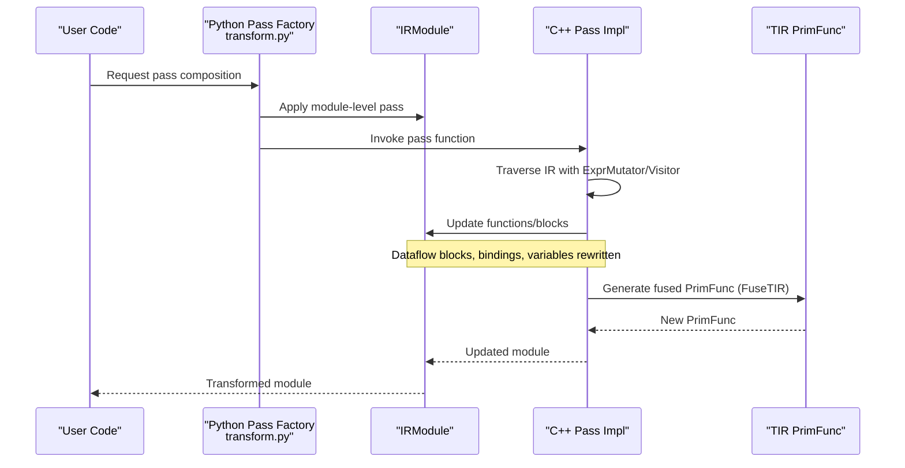

**Diagram sources**
- [transform.py](file://python/tvm/relax/transform/transform.py)
- [fuse_ops.cc](file://src/relax/transform/fuse_ops.cc)
- [fuse_tir.cc](file://src/relax/transform/fuse_tir.cc)

## Detailed Component Analysis

### Module-Level Passes

#### Lambda Lifting
Purpose:
- Lift nested local functions to global scope, handling closures and recursion.

Implementation highlights:
- Name collection with uniqueness and determinism across nested scopes.
- Closure detection and rewriting using make_closure/invoke_closure ops.
- Updates struct info and purity attributes for lifted functions.

Usage pattern:
- Run before passes that expect flat function structure.
- Useful for code generation and backend compatibility.

Performance implications:
- Adds function call indirection for closures.
- May increase module size due to additional globals.

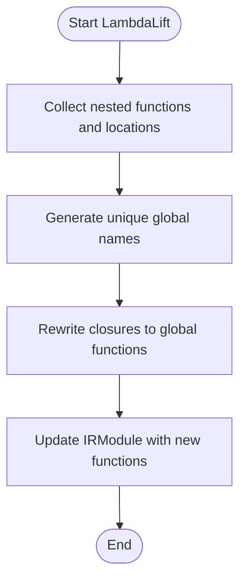

**Diagram sources**
- [lambda_lift.cc](file://src/relax/transform/lambda_lift.cc)

**Section sources**
- [lambda_lift.cc](file://src/relax/transform/lambda_lift.cc)
- [transform.py](file://python/tvm/relax/transform/transform.py)

#### Dataflow Conversion
Purpose:
- Convert sequences of pure bindings into dataflow blocks to enable downstream optimizations.

Implementation highlights:
- Extracts consecutive pure operations into DataflowBlock while preserving non-dataflow bindings.
- Enforces minimum block size and canonicalizes bindings afterward.

Usage pattern:
- Recommended before constant folding and layout conversions.

Performance implications:
- Improves locality and enables fusion.
- Can increase memory pressure if block sizes grow too large.

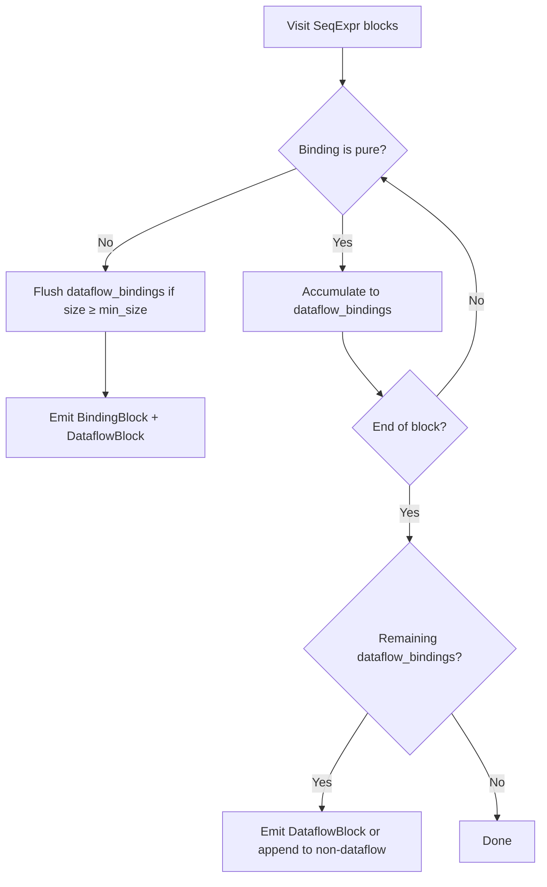

**Diagram sources**
- [convert_dataflow.cc](file://src/relax/transform/convert_dataflow.cc)

**Section sources**
- [convert_dataflow.cc](file://src/relax/transform/convert_dataflow.cc)
- [transform.py](file://python/tvm/relax/transform/transform.py)

#### Parameter Binding
Purpose:
- Bind function parameters to constants and normalize shapes/dtypes.

Implementation highlights:
- Validates dtype/ndim compatibility and matches shapes against symbolic variables.
- Supports binding by parameter name or Var, and by numpy arrays or TVM tensors.
- Applies Bind with a symbolic var map derived from the function’s structure.

Usage pattern:
- Run before folding and fusion to reduce dynamic work.

Performance implications:
- Reduces runtime parameter passing and can enable constant folding.
- Improper binding can cause type mismatches.

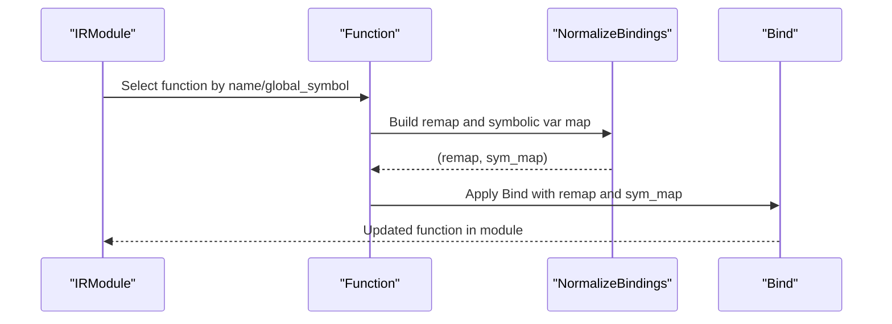

**Diagram sources**
- [bind_params.cc](file://src/relax/transform/bind_params.cc)

**Section sources**
- [bind_params.cc](file://src/relax/transform/bind_params.cc)
- [transform.py](file://python/tvm/relax/transform/transform.py)

### Function-Level Passes

#### Constant Folding
Purpose:
- Fold constant expressions and call_tir into constants to reduce runtime work.

Implementation highlights:
- Detects constant-shaped tensors and constant arguments.
- Builds and invokes CPU-targeted PrimFuncs for call_tir evaluation.
- Skips large constant creation ops to avoid excessive binary size.
- Handles single-tensor and tuple outputs for call_tir.

Usage pattern:
- Run after dataflow conversion and parameter binding.
- Often preceded by decomposition of composite ops.

Performance implications:
- Reduces kernel launches and memory traffic.
- Increases IR size for large constants; trade-off controlled by thresholds.

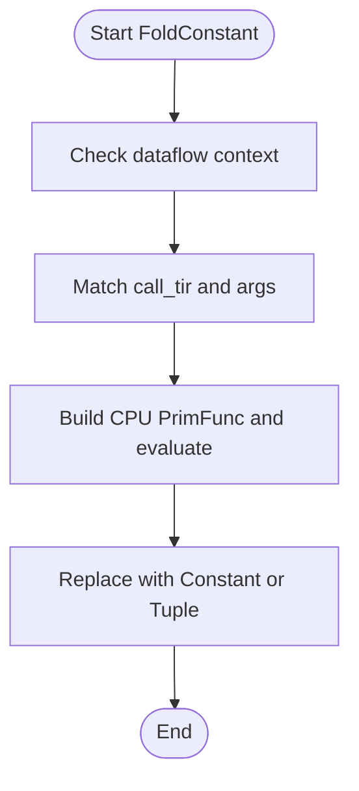

**Diagram sources**
- [fold_constant.cc](file://src/relax/transform/fold_constant.cc)

**Section sources**
- [fold_constant.cc](file://src/relax/transform/fold_constant.cc)
- [transform.py](file://python/tvm/relax/transform/transform.py)

#### Dead Code Elimination
Purpose:
- Remove unused variables and functions to reduce code size and improve clarity.

Implementation highlights:
- Computes call graph from entry functions and external linkage.
- Removes unused functions, then unused bindings per function.

Usage pattern:
- Run after passes that may leave dead code behind.

Performance implications:
- Reduces compilation and runtime overhead.
- Safe to run multiple times; later runs may clean up after earlier DCE.

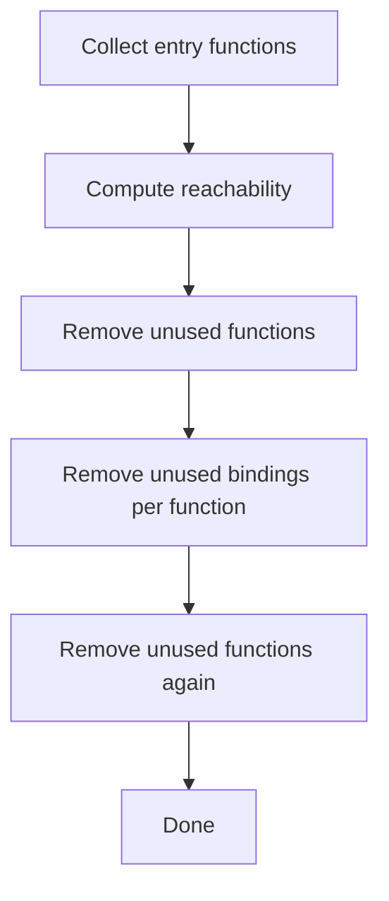

**Diagram sources**
- [dead_code_elimination.cc](file://src/relax/transform/dead_code_elimination.cc)

**Section sources**
- [dead_code_elimination.cc](file://src/relax/transform/dead_code_elimination.cc)
- [transform.py](file://python/tvm/relax/transform/transform.py)

#### Operator Fusion
Purpose:
- Group dataflow bindings into composite functions to enable efficient lowering.

Implementation highlights:
- Builds an indexed forward graph and computes post-dominators.
- Partitions nodes into groups respecting op patterns (injective, opaque, etc.).
- Emits grouped functions with parameters and arguments, handling tuple indexing.

Usage pattern:
- Typically followed by FuseTIR to generate TIR PrimFuncs.

Performance implications:
- Reduces kernel launch overhead and improves memory access patterns.
- Can increase compilation time; tuning max depth helps control complexity.

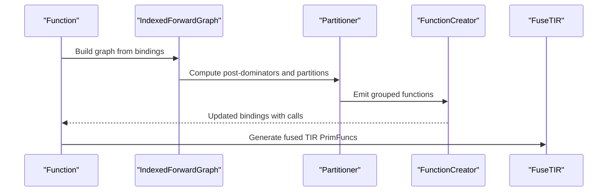

**Diagram sources**
- [fuse_ops.cc](file://src/relax/transform/fuse_ops.cc)
- [fuse_tir.cc](file://src/relax/transform/fuse_tir.cc)

**Section sources**
- [fuse_ops.cc](file://src/relax/transform/fuse_ops.cc)
- [fuse_tir.cc](file://src/relax/transform/fuse_tir.cc)
- [transform.py](file://python/tvm/relax/transform/transform.py)

#### Layout Transformations
Purpose:
- Convert tensor layouts (e.g., NCHW to NHWC) and insert layout transform ops.

Implementation highlights:
- Uses op-specific layout inference (FRelaxInferLayout) to determine desired layouts.
- Rewrites inputs/attrs and emits permute_dims or layout_transform ops.
- Maintains layout maps per variable for downstream decisions.

Usage pattern:
- Run after dataflow conversion; integrates with mixed precision.

Performance implications:
- Improves cache locality and matches hardware kernels.
- Extra transpose costs; beneficial when amortized across fused kernels.

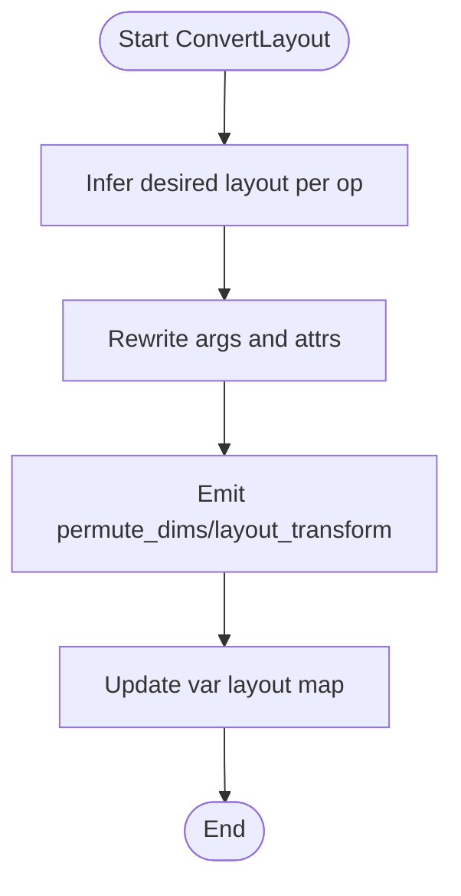

**Diagram sources**
- [convert_layout.cc](file://src/relax/transform/convert_layout.cc)

**Section sources**
- [convert_layout.cc](file://src/relax/transform/convert_layout.cc)
- [transform.py](file://python/tvm/relax/transform/transform.py)

### Specialized Passes

#### Gradient Computation
Purpose:
- Compute reverse-mode gradients for a specified function with checkpointing support.

Implementation highlights:
- Collects and removes start_checkpoint/end_checkpoint wrappers.
- Generates backward bindings by traversing forward dataflow in reverse.
- Supports call_tir_with_grad and registered primal gradients.

Usage pattern:
- Requires single dataflow block and scalar target.
- Often paired with dead code elimination and simplification.

Performance implications:
- Checkpointing trades memory for recomputation to reduce peak activation usage.
- Generates significant additional bindings; consider DCE afterward.

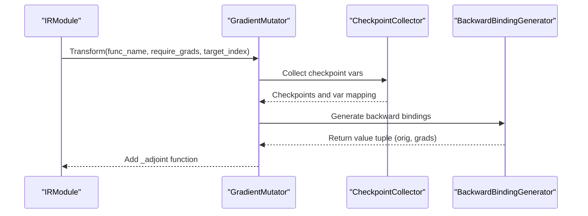

**Diagram sources**
- [gradient.cc](file://src/relax/transform/gradient.cc)

**Section sources**
- [gradient.cc](file://src/relax/transform/gradient.cc)
- [transform.py](file://python/tvm/relax/transform/transform.py)

#### Mixed Precision Conversion
Purpose:
- Automatically cast tensors to lower precision (e.g., FP16) to improve throughput.

Implementation highlights:
- Policy-driven casting (always, follow, never) per op.
- Backward pass determines which intermediates can stay in FP16.
- Rewrites args and outputs to appropriate dtypes; wraps parameters.

Usage pattern:
- Run after dataflow conversion; consider layout conversion afterward.

Performance implications:
- Reduces memory bandwidth and increases arithmetic intensity.
- Risk of numerical instability; policy selection is critical.

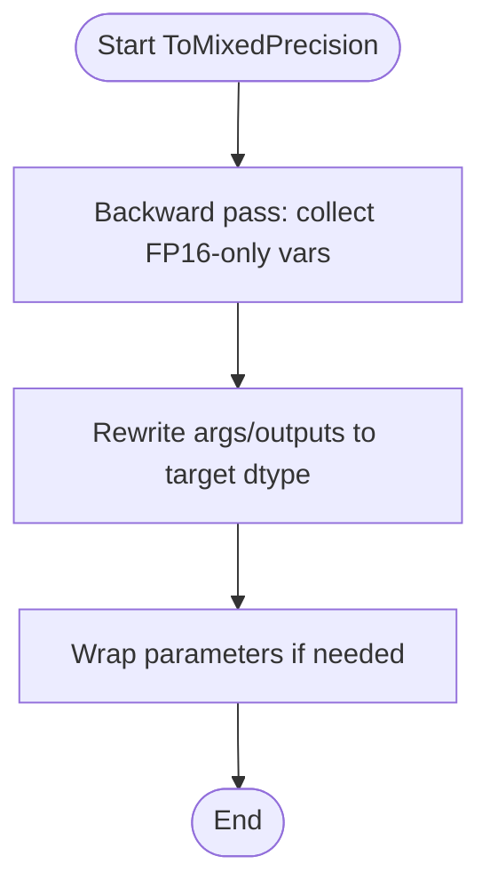

**Diagram sources**
- [to_mixed_precision.cc](file://src/relax/transform/to_mixed_precision.cc)

**Section sources**
- [to_mixed_precision.cc](file://src/relax/transform/to_mixed_precision.cc)
- [transform.py](file://python/tvm/relax/transform/transform.py)

#### Composite Function Merging
Purpose:
- Merge composite functions into backend-offloaded functions to reduce overhead.

Implementation highlights:
- Builds groups for each subexpression respecting dataflow.
- Merges compatible groups into a single function annotated for offloading.
- Inlines composite definitions and removes unused functions.

Usage pattern:
- Run after fusion and before backend codegen.

Performance implications:
- Reduces kernel launch overhead and improves throughput.
- Requires careful dependency handling to avoid cycles.

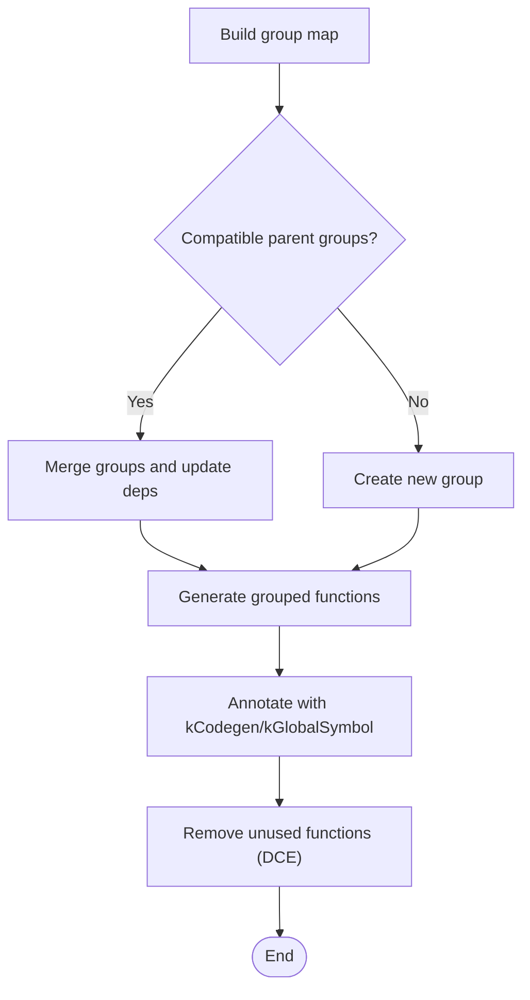

**Diagram sources**
- [merge_composite_functions.cc](file://src/relax/transform/merge_composite_functions.cc)

**Section sources**
- [merge_composite_functions.cc](file://src/relax/transform/merge_composite_functions.cc)
- [transform.py](file://python/tvm/relax/transform/transform.py)

## Dependency Analysis
Pass interplay and dependencies:
- Dataflow conversion is a prerequisite for constant folding and layout conversion.
- Parameter binding should precede constant folding to maximize folding opportunities.
- Operator fusion is typically followed by FuseTIR to generate TIR PrimFuncs.
- Mixed precision and layout conversion can be interleaved; both benefit from dataflow blocks.
- Gradient computation expects a single dataflow block and a scalar target; DCE and simplification follow.
- Composite merging depends on fusion and requires DCE to clean up.

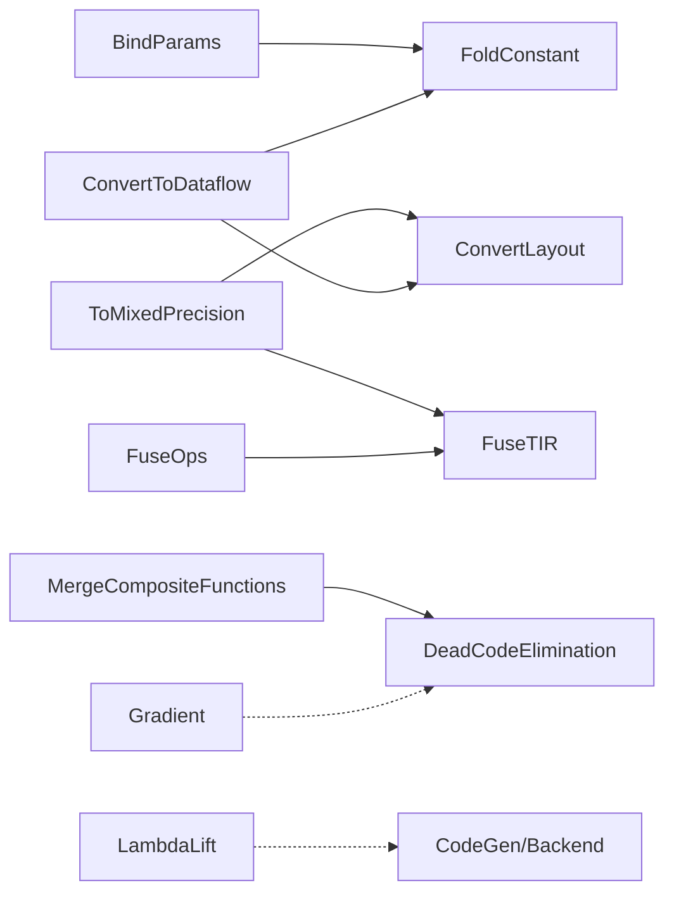

**Diagram sources**
- [convert_dataflow.cc](file://src/relax/transform/convert_dataflow.cc)
- [fold_constant.cc](file://src/relax/transform/fold_constant.cc)
- [convert_layout.cc](file://src/relax/transform/convert_layout.cc)
- [bind_params.cc](file://src/relax/transform/bind_params.cc)
- [fuse_ops.cc](file://src/relax/transform/fuse_ops.cc)
- [fuse_tir.cc](file://src/relax/transform/fuse_tir.cc)
- [to_mixed_precision.cc](file://src/relax/transform/to_mixed_precision.cc)
- [merge_composite_functions.cc](file://src/relax/transform/merge_composite_functions.cc)
- [dead_code_elimination.cc](file://src/relax/transform/dead_code_elimination.cc)
- [lambda_lift.cc](file://src/relax/transform/lambda_lift.cc)

**Section sources**
- [convert_dataflow.cc](file://src/relax/transform/convert_dataflow.cc)
- [fold_constant.cc](file://src/relax/transform/fold_constant.cc)
- [convert_layout.cc](file://src/relax/transform/convert_layout.cc)
- [bind_params.cc](file://src/relax/transform/bind_params.cc)
- [fuse_ops.cc](file://src/relax/transform/fuse_ops.cc)
- [fuse_tir.cc](file://src/relax/transform/fuse_tir.cc)
- [to_mixed_precision.cc](file://src/relax/transform/to_mixed_precision.cc)
- [merge_composite_functions.cc](file://src/relax/transform/merge_composite_functions.cc)
- [dead_code_elimination.cc](file://src/relax/transform/dead_code_elimination.cc)
- [lambda_lift.cc](file://src/relax/transform/lambda_lift.cc)

## Performance Considerations
- Prefer early dataflow conversion to enable aggressive optimizations.
- Tune fusion parameters (e.g., max depth) to balance compilation time and kernel count.
- Use mixed precision judiciously; validate numerical stability on target tasks.
- Leverage checkpointing in gradient computation to reduce memory footprint.
- Keep pass order consistent to minimize redundant work and improve effectiveness.

## Troubleshooting Guide
Common issues and remedies:
- Dataflow assumptions violated:
  - Symptom: Layout conversion or constant folding fails.
  - Fix: Run ConvertToDataflow before these passes.
- Type mismatches after parameter binding:
  - Symptom: Structural info or dtype errors.
  - Fix: Verify dtype/shape compatibility and run canonicalization.
- Excessive IR growth:
  - Symptom: Large binaries or long compilation times.
  - Fix: Limit constant folding sizes, prune with DCE, and tune fusion depth.
- Gradient failures:
  - Symptom: Unsupported op or non-scalar target.
  - Fix: Ensure single dataflow block and scalar target; register gradients for custom ops.

**Section sources**
- [fold_constant.cc](file://src/relax/transform/fold_constant.cc)
- [convert_layout.cc](file://src/relax/transform/convert_layout.cc)
- [bind_params.cc](file://src/relax/transform/bind_params.cc)
- [gradient.cc](file://src/relax/transform/gradient.cc)

## Conclusion
Relax transformation passes provide a comprehensive toolkit for optimizing and preparing models for backend execution. Effective composition—ensuring prerequisites are met and leveraging pass dependencies—yields significant improvements in performance and code quality. Careful selection and sequencing of passes, informed by task characteristics and hardware constraints, are key to successful deployment.