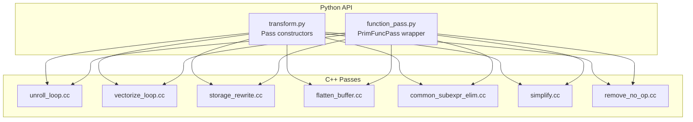
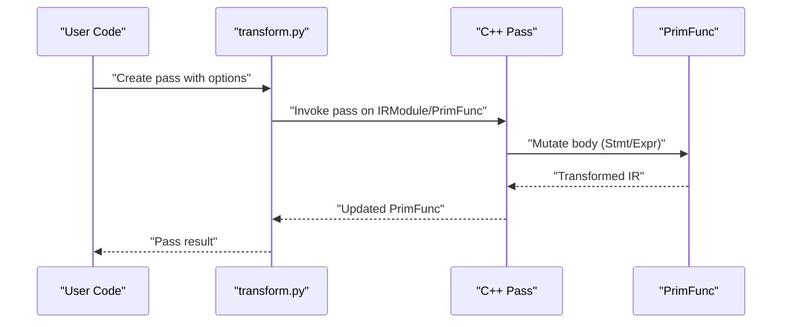
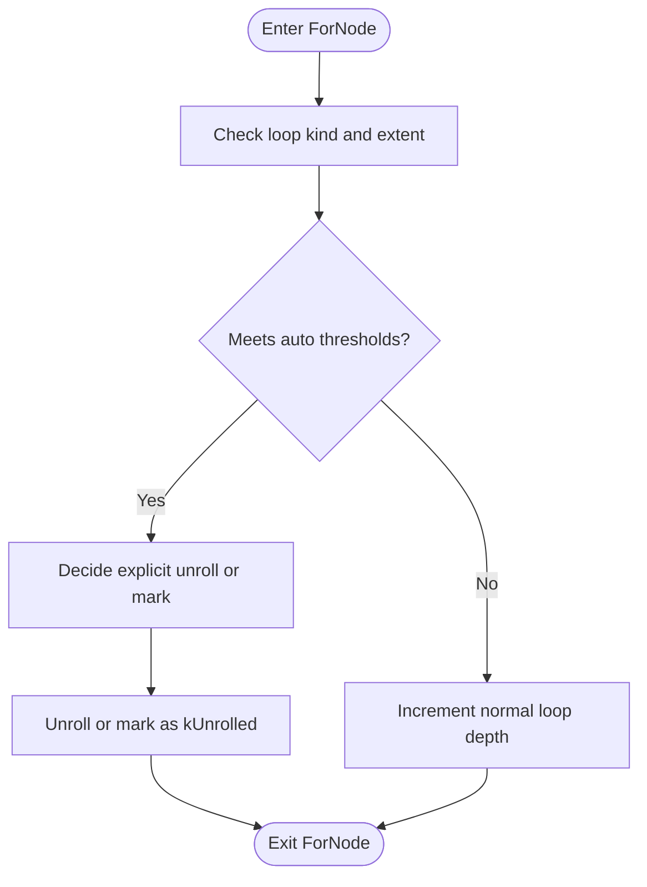
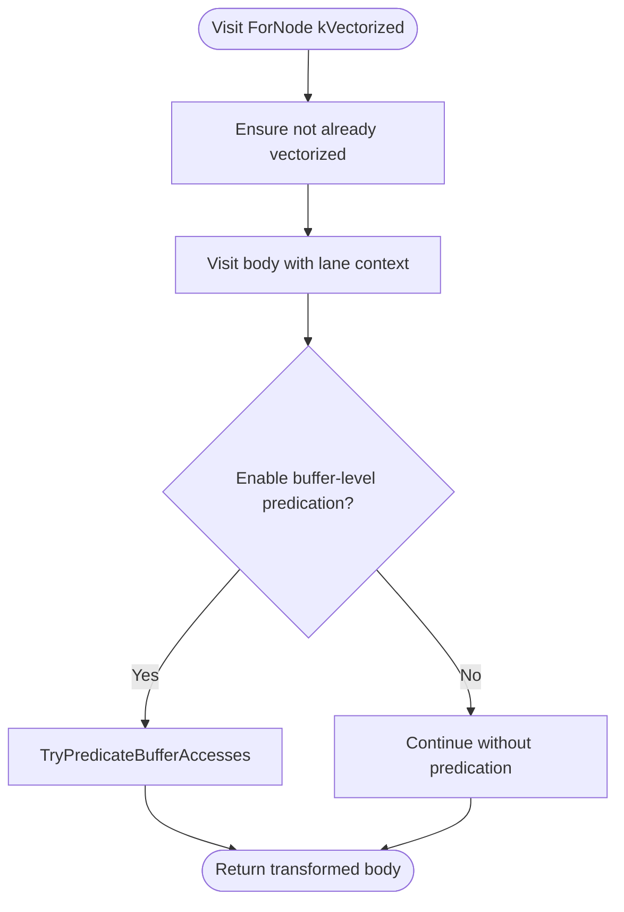
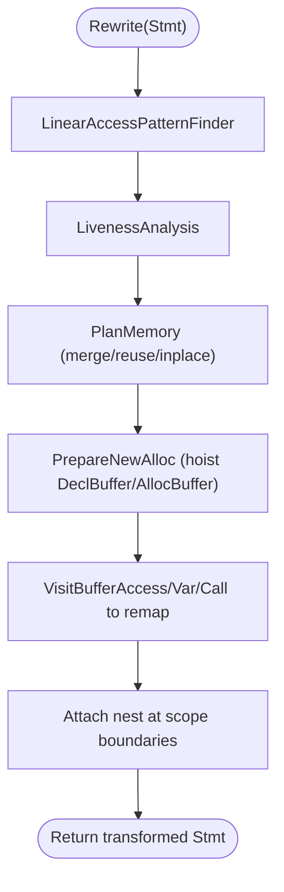
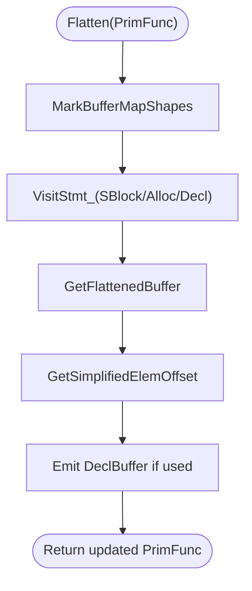
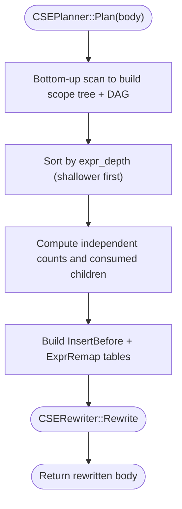
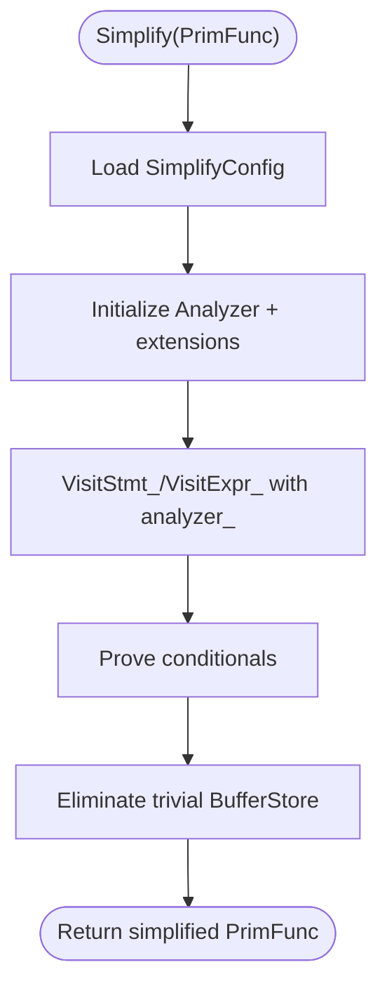
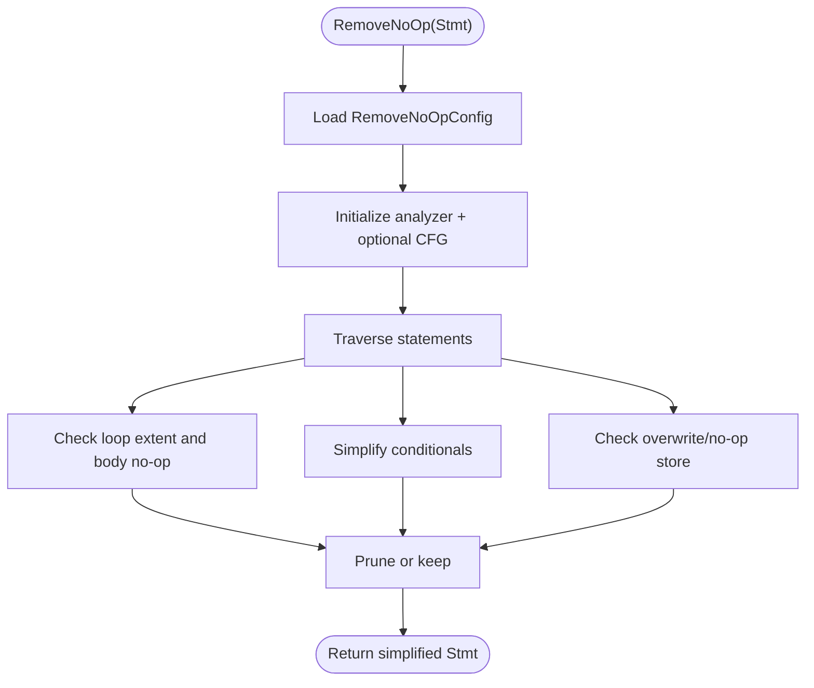
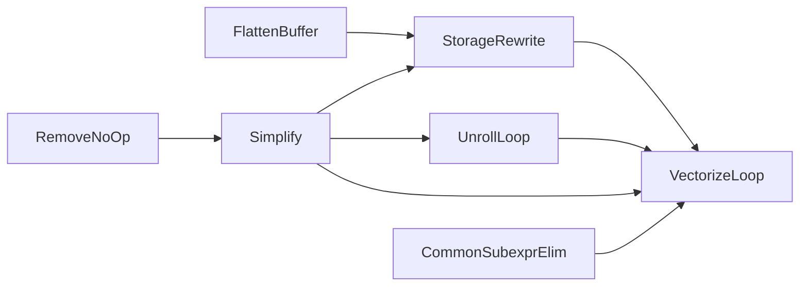

# TensorIR Transform Passes

<cite>
**Referenced Files in This Document**
- [transform.py](file://python/tvm/tirx/transform/transform.py)
- [function_pass.py](file://python/tvm/tirx/transform/function_pass.py)
- [unroll_loop.cc](file://src/tirx/transform/unroll_loop.cc)
- [vectorize_loop.cc](file://src/tirx/transform/vectorize_loop.cc)
- [storage_rewrite.cc](file://src/tirx/transform/storage_rewrite.cc)
- [flatten_buffer.cc](file://src/tirx/transform/flatten_buffer.cc)
- [common_subexpr_elim.cc](file://src/tirx/transform/common_subexpr_elim.cc)
- [simplify.cc](file://src/tirx/transform/simplify.cc)
- [remove_no_op.cc](file://src/tirx/transform/remove_no_op.cc)
</cite>

## Table of Contents
1. [Introduction](#introduction)
2. [Project Structure](#project-structure)
3. [Core Components](#core-components)
4. [Architecture Overview](#architecture-overview)
5. [Detailed Component Analysis](#detailed-component-analysis)
6. [Dependency Analysis](#dependency-analysis)
7. [Performance Considerations](#performance-considerations)
8. [Troubleshooting Guide](#troubleshooting-guide)
9. [Conclusion](#conclusion)
10. [Appendices](#appendices)

## Introduction
This document explains the TensorIR transformation passes in the TVM codebase, focusing on loop optimization (unrolling, vectorization), memory optimization (storage flattening, layout transformations, alias analysis), scheduling-related passes (parallelization, prefetching, cache optimization), and algebraic simplifications (constant folding, dead code elimination). It covers pass implementation details, configuration options, performance characteristics, and recommended pass ordering for optimal compilation results.

## Project Structure
The transformation infrastructure is implemented primarily in C++ under src/tirx/transform and exposed to Python via the tirx transform API. The Python API wraps FFI-backed passes and exposes pass constructors and configuration objects.

**Diagram sources**
- [transform.py:1-538](file://python/tvm/tirx/transform/transform.py#L1-L538)
- [function_pass.py:1-164](file://python/tvm/tirx/transform/function_pass.py#L1-L164)
- [unroll_loop.cc:1-303](file://src/tirx/transform/unroll_loop.cc#L1-L303)
- [vectorize_loop.cc:1-1021](file://src/tirx/transform/vectorize_loop.cc#L1-L1021)
- [storage_rewrite.cc:1-1768](file://src/tirx/transform/storage_rewrite.cc#L1-L1768)
- [flatten_buffer.cc:1-269](file://src/tirx/transform/flatten_buffer.cc#L1-L269)
- [common_subexpr_elim.cc:1-791](file://src/tirx/transform/common_subexpr_elim.cc#L1-L791)
- [simplify.cc:1-315](file://src/tirx/transform/simplify.cc#L1-L315)
- [remove_no_op.cc:1-317](file://src/tirx/transform/remove_no_op.cc#L1-L317)

**Section sources**
- [transform.py:1-538](file://python/tvm/tirx/transform/transform.py#L1-L538)
- [function_pass.py:1-164](file://python/tvm/tirx/transform/function_pass.py#L1-L164)

## Core Components
- Loop optimization
  - UnrollLoop: Automatic and explicit loop unrolling with thresholds and local-access rules.
  - VectorizeLoop: Vectorization of loops with lane broadcasting, ramp handling, and optional buffer-level predication.
- Memory optimization
  - StorageRewrite: Liveness-driven buffer reuse, allocation hoisting, and aliasing for memory sharing.
  - FlattenBuffer: Multi-dimensional buffer flattening to 1-D for device-friendly access.
- Algebraic simplifications
  - Simplify: Expression and statement simplification with configurable extensions.
  - CommonSubexprElim: Two-phase CSE with scope-aware insertion and deterministic plans.
  - RemoveNoOp: Dead code elimination with optional dataflow analysis and overwriting detection.
- Scheduling-related passes
  - These are typically provided by higher-level scheduling APIs (e.g., s-tir schedule) and are not implemented as standalone passes in this repository snapshot.

**Section sources**
- [unroll_loop.cc:1-303](file://src/tirx/transform/unroll_loop.cc#L1-L303)
- [vectorize_loop.cc:1-1021](file://src/tirx/transform/vectorize_loop.cc#L1-L1021)
- [storage_rewrite.cc:1-1768](file://src/tirx/transform/storage_rewrite.cc#L1-L1768)
- [flatten_buffer.cc:1-269](file://src/tirx/transform/flatten_buffer.cc#L1-L269)
- [common_subexpr_elim.cc:1-791](file://src/tirx/transform/common_subexpr_elim.cc#L1-L791)
- [simplify.cc:1-315](file://src/tirx/transform/simplify.cc#L1-L315)
- [remove_no_op.cc:1-317](file://src/tirx/transform/remove_no_op.cc#L1-L317)

## Architecture Overview
The passes operate on PrimFunc IR and are orchestrated via the Python API. Each pass is registered with a PassInfo and can be configured via pass-specific Attrs objects. The C++ implementations use IR visitors/mutators to transform statements and expressions.

**Diagram sources**
- [transform.py:1-538](file://python/tvm/tirx/transform/transform.py#L1-L538)
- [function_pass.py:1-164](file://python/tvm/tirx/transform/function_pass.py#L1-L164)
- [unroll_loop.cc:269-292](file://src/tirx/transform/unroll_loop.cc#L269-L292)
- [vectorize_loop.cc:292-301](file://src/tirx/transform/vectorize_loop.cc#L292-L301)
- [storage_rewrite.cc:402-420](file://src/tirx/transform/storage_rewrite.cc#L402-L420)
- [flatten_buffer.cc:42-71](file://src/tirx/transform/flatten_buffer.cc#L42-L71)
- [common_subexpr_elim.cc:771-781](file://src/tirx/transform/common_subexpr_elim.cc#L771-L781)
- [simplify.cc:297-305](file://src/tirx/transform/simplify.cc#L297-L305)
- [remove_no_op.cc:284-306](file://src/tirx/transform/remove_no_op.cc#L284-L306)

## Detailed Component Analysis

### Loop Unrolling Pass
Purpose: Unroll serial loops meeting automatic thresholds or marked for explicit unrolling. Honors pragmas and local-memory access rules.

Key behaviors:
- Thresholds: auto_max_step, auto_max_extent, auto_max_depth.
- Local access: unroll_local_access forces unrolling when loop variables are used as indices to local/warp memory.
- Explicit vs implicit: can unroll or mark as kUnrolled kind.
- SSA conversion after transformation.

Configuration options (registered attrs):
- auto_max_step
- auto_max_depth
- auto_max_extent
- explicit_unroll
- unroll_local_access

Implementation highlights:
- Visitor traverses ForNodes, computes loop extent, and decides unroll vs mark.
- Supports pragma overrides for per-scope tuning.
- Converts to SSA when changes are made.

**Diagram sources**
- [unroll_loop.cc:120-164](file://src/tirx/transform/unroll_loop.cc#L120-L164)
- [unroll_loop.cc:217-231](file://src/tirx/transform/unroll_loop.cc#L217-L231)

**Section sources**
- [unroll_loop.cc:41-77](file://src/tirx/transform/unroll_loop.cc#L41-L77)
- [unroll_loop.cc:76-77](file://src/tirx/transform/unroll_loop.cc#L76-L77)
- [unroll_loop.cc:92-267](file://src/tirx/transform/unroll_loop.cc#L92-L267)
- [unroll_loop.cc:269-292](file://src/tirx/transform/unroll_loop.cc#L269-L292)

### Loop Vectorization Pass
Purpose: Vectorize loops by broadcasting scalars to lanes, handling ramps, and optionally using buffer-level predication.

Key behaviors:
- Broadcast and lane alignment for arithmetic and select ops.
- Ramp handling and shuffle-based extraction.
- Optional buffer-level predication for vectorized accesses.
- Scalarization fallback for unsupported cases (e.g., scalable vectors in certain contexts).

Configuration options:
- Pass-level config controls buffer-level predication enablement via target inspection.

Implementation highlights:
- Vectorizer mutator transforms expressions and statements with lane-aware logic.
- VecAllocAccess adjusts buffer shapes/strides for vectorized allocations.
- TryPredicateBufferAccess attempts to remove explicit bounds checks by attaching predicates to loads/stores.

**Diagram sources**
- [vectorize_loop.cc:759-779](file://src/tirx/transform/vectorize_loop.cc#L759-L779)
- [vectorize_loop.cc:111-196](file://src/tirx/transform/vectorize_loop.cc#L111-L196)
- [vectorize_loop.cc:198-287](file://src/tirx/transform/vectorize_loop.cc#L198-L287)

**Section sources**
- [vectorize_loop.cc:47-88](file://src/tirx/transform/vectorize_loop.cc#L47-L88)
- [vectorize_loop.cc:292-800](file://src/tirx/transform/vectorize_loop.cc#L292-L800)
- [vectorize_loop.cc:800-1021](file://src/tirx/transform/vectorize_loop.cc#L800-L1021)

### Storage Rewriting Pass
Purpose: Optimize memory usage by merging allocations, hoisting declarations, and enabling in-place operations when safe.

Key behaviors:
- Linear access pattern discovery across scopes (For/If/AttrStmt/thread).
- Liveness analysis to determine free points within the same scope as allocation.
- Allocation merging for same-tagged special memories and reuse of flat buffers.
- Optional in-place detection for dst[index] = f(src[index]) patterns.
- Buffer remapping and index adjustment for reused allocations.

Configuration options:
- detect_inplace
- enable_reuse
- reuse_require_exact_matched_dtype

Implementation highlights:
- LinearAccessPatternFinder builds a linearized sequence of touches and scopes.
- StoragePlanRewriter computes attachment points, merges allocations, and remaps buffers.
- InplaceOpVerifier validates safety of in-place transformations.

**Diagram sources**
- [storage_rewrite.cc:402-420](file://src/tirx/transform/storage_rewrite.cc#L402-L420)
- [storage_rewrite.cc:789-814](file://src/tirx/transform/storage_rewrite.cc#L789-L814)
- [storage_rewrite.cc:839-933](file://src/tirx/transform/storage_rewrite.cc#L839-L933)
- [storage_rewrite.cc:1077-1158](file://src/tirx/transform/storage_rewrite.cc#L1077-L1158)

**Section sources**
- [storage_rewrite.cc:66-241](file://src/tirx/transform/storage_rewrite.cc#L66-L241)
- [storage_rewrite.cc:243-387](file://src/tirx/transform/storage_rewrite.cc#L243-L387)
- [storage_rewrite.cc:397-1075](file://src/tirx/transform/storage_rewrite.cc#L397-L1075)

### Buffer Flattening Pass
Purpose: Flatten multi-dimensional buffer accesses into 1-D for device-friendly IR.

Key behaviors:
- Flattens buffer shapes and indices, canonicalizes shapes.
- Handles boolean buffers by casting to int8 backing arrays.
- Emits DeclBuffer for buffers used in the function body.

Implementation highlights:
- BufferFlattener IR mutator transforms SBlocks, AllocBuffer/DeclBuffer, and BufferLoad/Store nodes.
- Uses IterMapSimplifyWithContext to derive flattened indices.

**Diagram sources**
- [flatten_buffer.cc:42-71](file://src/tirx/transform/flatten_buffer.cc#L42-L71)
- [flatten_buffer.cc:136-156](file://src/tirx/transform/flatten_buffer.cc#L136-L156)
- [flatten_buffer.cc:158-211](file://src/tirx/transform/flatten_buffer.cc#L158-L211)

**Section sources**
- [flatten_buffer.cc:38-71](file://src/tirx/transform/flatten_buffer.cc#L38-L71)
- [flatten_buffer.cc:136-237](file://src/tirx/transform/flatten_buffer.cc#L136-L237)
- [flatten_buffer.cc:250-269](file://src/tirx/transform/flatten_buffer.cc#L250-L269)

### Common Subexpression Elimination Pass
Purpose: Eliminate redundant computations by introducing Bind variables and replacing repeated expressions.

Key behaviors:
- Two-phase design: Planner builds scope tree and expression DAG; Rewriter inserts Bind and substitutes.
- Eligibility: Non-leaf, no side-effecting constructs, not Ramp/Broadcast.
- Deterministic plan: sorts by expression depth and propagates replacements.

Implementation highlights:
- CSEPlanner: bottom-up scan, records counts, LCA scopes, first-use locations, children.
- ComputePlan: computes independent counts, insertion points, and remap table.
- CSERewriter: mechanical insertion and substitution with SeqStmt flattening.

**Diagram sources**
- [common_subexpr_elim.cc:133-154](file://src/tirx/transform/common_subexpr_elim.cc#L133-L154)
- [common_subexpr_elim.cc:597-661](file://src/tirx/transform/common_subexpr_elim.cc#L597-L661)
- [common_subexpr_elim.cc:698-755](file://src/tirx/transform/common_subexpr_elim.cc#L698-L755)

**Section sources**
- [common_subexpr_elim.cc:24-59](file://src/tirx/transform/common_subexpr_elim.cc#L24-L59)
- [common_subexpr_elim.cc:133-278](file://src/tirx/transform/common_subexpr_elim.cc#L133-L278)
- [common_subexpr_elim.cc:597-755](file://src/tirx/transform/common_subexpr_elim.cc#L597-L755)
- [common_subexpr_elim.cc:771-781](file://src/tirx/transform/common_subexpr_elim.cc#L771-L781)

### Simplify Pass
Purpose: Arithmetic simplification of expressions/statements with configurable extensions.

Key behaviors:
- Uses RewriteSimplifier with optional extensions (transitive inequality proving, boolean decomposition).
- Condition simplification with optional dataflow propagation.
- Dead-store elimination for trivial BufferStore.

Configuration options (registered attrs):
- transitively_prove_inequalities
- propagate_knowns_to_prove_conditional
- propagate_knowns_to_simplify_expressions
- convert_boolean_to_and_of_ors
- apply_constraints_to_boolean_branches

Implementation highlights:
- StmtSimplifier extends IRMutatorWithAnalyzer, binds loop ranges, and simplifies in context.
- Optional ControlFlowGraph for known-value propagation.

**Diagram sources**
- [simplify.cc:108-125](file://src/tirx/transform/simplify.cc#L108-L125)
- [simplify.cc:168-213](file://src/tirx/transform/simplify.cc#L168-L213)
- [simplify.cc:231-243](file://src/tirx/transform/simplify.cc#L231-L243)

**Section sources**
- [simplify.cc:46-106](file://src/tirx/transform/simplify.cc#L46-L106)
- [simplify.cc:108-125](file://src/tirx/transform/simplify.cc#L108-L125)
- [simplify.cc:168-243](file://src/tirx/transform/simplify.cc#L168-L243)
- [simplify.cc:297-305](file://src/tirx/transform/simplify.cc#L297-L305)

### RemoveNoOp Pass
Purpose: Eliminate no-op statements and simplify control flow when provably redundant.

Key behaviors:
- Detects no-op For/If/Evaluate/BufferStore.
- Optional dataflow analysis to detect overwriting without effect.
- Pragmas and async attributes considered for skipping regions.

Configuration options (registered attrs):
- use_dataflow_analysis
- max_simplification_steps

Implementation highlights:
- NoOpRemover traverses and prunes redundant constructs.
- Uses analyzer_ and optional ControlFlowGraph for overwriting detection.

**Diagram sources**
- [remove_no_op.cc:76-83](file://src/tirx/transform/remove_no_op.cc#L76-L83)
- [remove_no_op.cc:148-162](file://src/tirx/transform/remove_no_op.cc#L148-L162)
- [remove_no_op.cc:174-227](file://src/tirx/transform/remove_no_op.cc#L174-L227)

**Section sources**
- [remove_no_op.cc:46-74](file://src/tirx/transform/remove_no_op.cc#L46-L74)
- [remove_no_op.cc:76-83](file://src/tirx/transform/remove_no_op.cc#L76-L83)
- [remove_no_op.cc:148-227](file://src/tirx/transform/remove_no_op.cc#L148-L227)
- [remove_no_op.cc:284-306](file://src/tirx/transform/remove_no_op.cc#L284-L306)

## Dependency Analysis
- Pass creation and registration:
  - Python wrappers call FFI to register passes and expose constructors.
  - PassInfo opt_level and required dependencies are attached to each pass.
- Pass ordering:
  - FlattenBuffer should generally precede vectorization to ensure 1-D addressing.
  - StorageRewrite typically follows flattening and before vectorization to maximize reuse.
  - Simplify and RemoveNoOp can be interleaved to reduce IR size before heavy passes.
  - UnrollLoop often runs early to remove small loops before vectorization.
  - CommonSubexprElim benefits from earlier simplifications.

**Diagram sources**
- [transform.py:490-499](file://python/tvm/tirx/transform/transform.py#L490-L499)
- [flatten_buffer.cc:254-259](file://src/tirx/transform/flatten_buffer.cc#L254-L259)
- [storage_rewrite.cc:402-420](file://src/tirx/transform/storage_rewrite.cc#L402-L420)
- [vectorize_loop.cc:292-301](file://src/tirx/transform/vectorize_loop.cc#L292-L301)
- [unroll_loop.cc:281-292](file://src/tirx/transform/unroll_loop.cc#L281-L292)
- [common_subexpr_elim.cc:771-781](file://src/tirx/transform/common_subexpr_elim.cc#L771-L781)
- [simplify.cc:297-305](file://src/tirx/transform/simplify.cc#L297-L305)
- [remove_no_op.cc:284-306](file://src/tirx/transform/remove_no_op.cc#L284-L306)

**Section sources**
- [function_pass.py:70-164](file://python/tvm/tirx/transform/function_pass.py#L70-L164)
- [transform.py:1-538](file://python/tvm/tirx/transform/transform.py#L1-L538)

## Performance Considerations
- Unrolling
  - Tune thresholds to balance register pressure and ILP; excessive unrolling increases code size.
  - Local memory access unrolling is essential for register promotion.
- Vectorization
  - Broadcasting and ramp handling add overhead; ensure vector lanes align with buffer access patterns.
  - Buffer-level predication reduces branches but may increase predicate traffic.
- Storage rewriting
  - Merging small allocations is discouraged to avoid register spills; threshold logic avoids small arrays.
  - In-place detection must preserve correctness; verifier enforces safety.
- Simplification and CSE
  - Extensions like transitive inequality proving can improve branch elimination but add analysis cost.
  - CSE depth-first processing prevents cascading substitutions and keeps complexity manageable.
- Dead code elimination
  - Dataflow analysis improves accuracy but increases compile time; use judiciously.

[No sources needed since this section provides general guidance]

## Troubleshooting Guide
- Vectorization fails or falls back to scalar
  - Check for scalable vectors in unsupported contexts; scalarization is triggered when necessary.
  - Ensure buffer-level predication is enabled for VLA targets if intended.
- Unexpected register pressure after unrolling
  - Reduce auto_max_extent or disable explicit_unroll for sensitive loops.
  - Consider enabling unroll_local_access for loops accessing local memory by loop vars.
- Storage reuse not happening
  - Verify buffer shapes and element types match; exact dtype matching can be enforced via config.
  - Small arrays are intentionally not reused; increase size or adjust thresholds.
- Incorrect in-place transformations
  - Confirm the inplace verifier conditions are met; avoid extern blocks and multi-write patterns.
- Over-aggressive simplification
  - Disable extensions like transitive inequality proving or boolean decomposition if they alter semantics unexpectedly.

**Section sources**
- [vectorize_loop.cc:760-769](file://src/tirx/transform/vectorize_loop.cc#L760-L769)
- [unroll_loop.cc:126-141](file://src/tirx/transform/unroll_loop.cc#L126-L141)
- [storage_rewrite.cc:976-978](file://src/tirx/transform/storage_rewrite.cc#L976-L978)
- [storage_rewrite.cc:864-890](file://src/tirx/transform/storage_rewrite.cc#L864-L890)
- [simplify.cc:82-96](file://src/tirx/transform/simplify.cc#L82-L96)

## Conclusion
The TensorIR transformation passes provide a robust toolkit for loop optimization, memory optimization, and algebraic simplification. Correct ordering and careful configuration are key to achieving optimal performance. FlattenBuffer and StorageRewrite lay the groundwork for efficient memory usage, while UnrollLoop and VectorizeLoop unlock ILP and SIMD throughput. Simplify, CommonSubexprElim, and RemoveNoOp reduce redundant computation and IR size, improving code quality and lowering runtime overhead.

[No sources needed since this section summarizes without analyzing specific files]

## Appendices

### Pass Configuration Reference
- UnrollLoopConfig
  - auto_max_step
  - auto_max_depth
  - auto_max_extent
  - explicit_unroll
  - unroll_local_access
- SimplifyConfig
  - transitively_prove_inequalities
  - propagate_knowns_to_prove_conditional
  - propagate_knowns_to_simplify_expressions
  - convert_boolean_to_and_of_ors
  - apply_constraints_to_boolean_branches
- RemoveNoOpConfig
  - use_dataflow_analysis
  - max_simplification_steps

**Section sources**
- [unroll_loop.cc:41-77](file://src/tirx/transform/unroll_loop.cc#L41-L77)
- [simplify.cc:46-106](file://src/tirx/transform/simplify.cc#L46-L106)
- [remove_no_op.cc:46-74](file://src/tirx/transform/remove_no_op.cc#L46-L74)