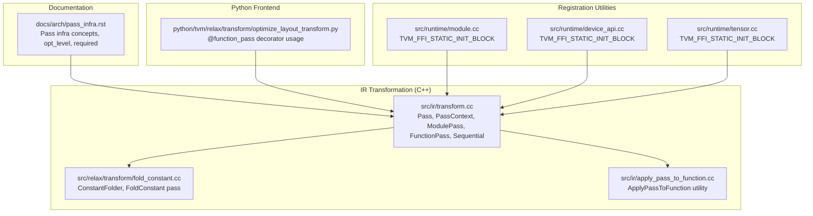
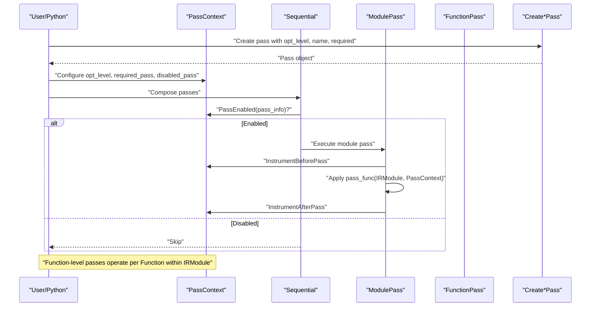
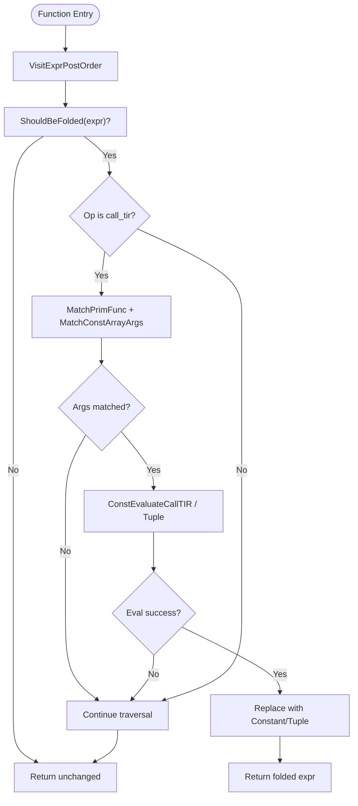
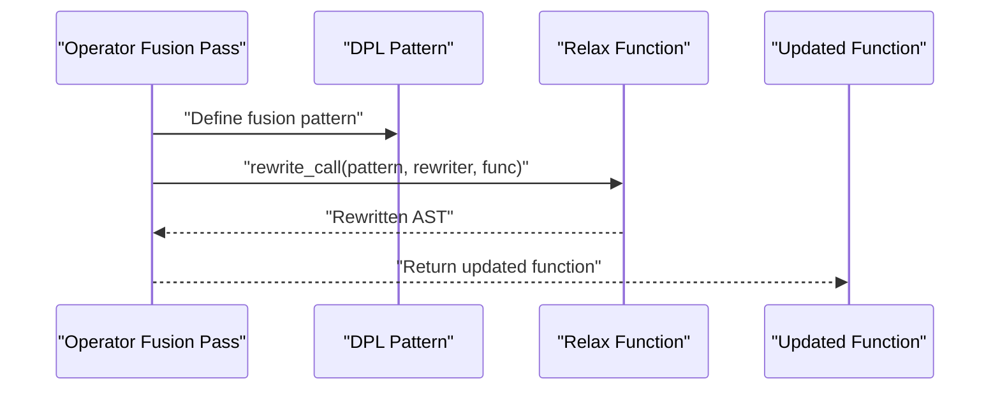
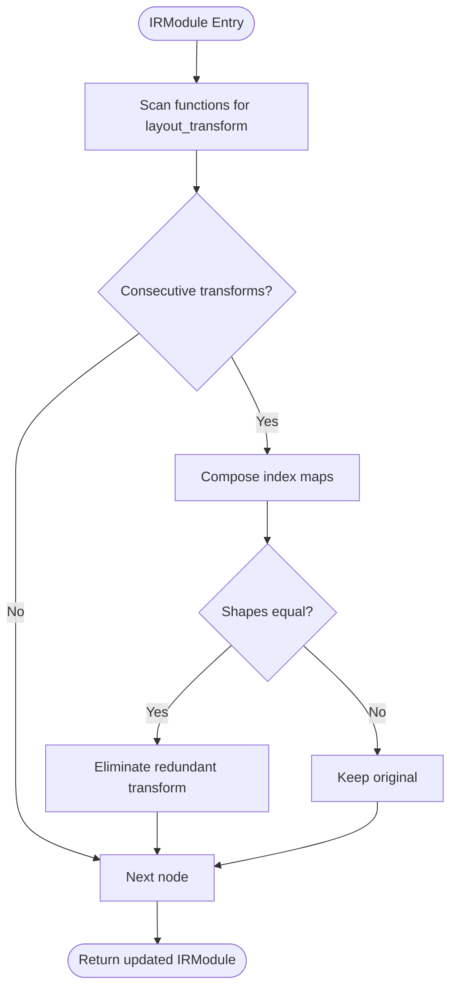
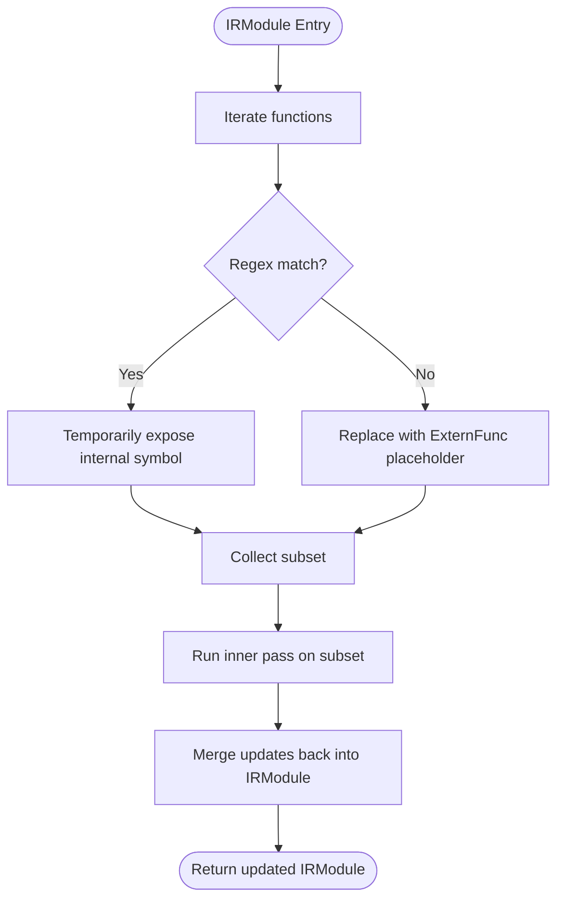
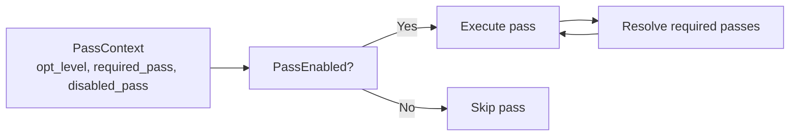

# Custom Pass Development

<cite>
**Referenced Files in This Document**
- [transform.cc](file://src/ir/transform.cc)
- [fold_constant.cc](file://src/relax/transform/fold_constant.cc)
- [apply_pass_to_function.cc](file://src/ir/apply_pass_to_function.cc)
- [pass_infra.rst](file://docs/arch/pass_infra.rst)
- [optimize_layout_transform.py](file://python/tvm/relax/transform/optimize_layout_transform.py)
- [module.cc](file://src/runtime/module.cc)
- [device_api.cc](file://src/runtime/device_api.cc)
- [tensor.cc](file://src/runtime/tensor.cc)
</cite>

## Table of Contents
1. [Introduction](#introduction)
2. [Project Structure](#project-structure)
3. [Core Components](#core-components)
4. [Architecture Overview](#architecture-overview)
5. [Detailed Component Analysis](#detailed-component-analysis)
6. [Dependency Analysis](#dependency-analysis)
7. [Performance Considerations](#performance-considerations)
8. [Troubleshooting Guide](#troubleshooting-guide)
9. [Conclusion](#conclusion)
10. [Appendices](#appendices)

## Introduction
This document explains how to develop custom optimization passes in TVM, from IR analysis to transformation implementation. It covers the pass creation helpers, registration mechanisms, pass context and error reporting, dependency management, and practical examples for common optimizations such as constant folding, operator fusion, and memory layout transformations. It also provides testing strategies, debugging techniques, and integration tips with the pass infrastructure.

## Project Structure
The pass infrastructure spans C++ backend components and Python frontends. The core pass execution engine resides in the IR transformation layer, while pass registration and helper APIs are exposed via FFI static initializers and Python decorators.

**Diagram sources**
- [transform.cc:327-426](file://src/ir/transform.cc#L327-L426)
- [fold_constant.cc:420-437](file://src/relax/transform/fold_constant.cc#L420-L437)
- [apply_pass_to_function.cc:59-131](file://src/ir/apply_pass_to_function.cc#L59-L131)
- [pass_infra.rst:54-167](file://docs/arch/pass_infra.rst#L54-L167)
- [optimize_layout_transform.py:29-87](file://python/tvm/relax/transform/optimize_layout_transform.py#L29-L87)
- [module.cc:75-93](file://src/runtime/module.cc#L75-L93)
- [device_api.cc:205-219](file://src/runtime/device_api.cc#L205-L219)
- [tensor.cc:242-253](file://src/runtime/tensor.cc#L242-L253)

**Section sources**
- [transform.cc:327-426](file://src/ir/transform.cc#L327-L426)
- [pass_infra.rst:54-167](file://docs/arch/pass_infra.rst#L54-L167)

## Core Components
- Pass and PassContext: orchestrate pass execution, enable/disable logic, and instrumentation hooks.
- ModulePass, FunctionPass, PrimFuncPass: pass types for module-level, function-level, and primitive function-level transformations.
- CreateModulePass, CreateFunctionPass, CreatePrimFuncPass: helper constructors for pass objects.
- Registration: exposes pass constructors and helpers via FFI static initializers and Python decorators.

Key responsibilities:
- Pass orchestration and dependency resolution.
- Pass context configuration (opt_level, required/disabled passes, diagnostics, instruments).
- Error reporting and immutability assertions for testing.
- Instrumentation hooks around pass execution.

**Section sources**
- [transform.cc:94-104](file://src/ir/transform.cc#L94-L104)
- [transform.cc:490-494](file://src/ir/transform.cc#L490-L494)
- [transform.cc:496-546](file://src/ir/transform.cc#L496-L546)
- [transform.cc:583-603](file://src/ir/transform.cc#L583-L603)
- [transform.cc:626-638](file://src/ir/transform.cc#L626-L638)
- [transform.cc:648-653](file://src/ir/transform.cc#L648-L653)
- [pass_infra.rst:102-167](file://docs/arch/pass_infra.rst#L102-L167)

## Architecture Overview
The pass execution flow integrates pass context, pass selection, and instrumentation. The pass manager resolves enabled passes, optionally runs required dependencies, and invokes the pass function with the current context.

**Diagram sources**
- [transform.cc:94-104](file://src/ir/transform.cc#L94-L104)
- [transform.cc:470-488](file://src/ir/transform.cc#L470-L488)
- [transform.cc:395-426](file://src/ir/transform.cc#L395-L426)
- [transform.cc:290-311](file://src/ir/transform.cc#L290-L311)
- [pass_infra.rst:419-427](file://docs/arch/pass_infra.rst#L419-L427)

## Detailed Component Analysis

### Pass Creation Helpers
- CreateFunctionPass(Function(Function, IRModule, PassContext), int, String, Array<String>, bool)
- CreatePrimFuncPass(Function(PrimFunc, IRModule, PassContext), int, String, Array<String>, bool)
- CreateModulePass(Function(IRModule, PassContext), int, String, Array<String>, bool)

Signature requirements:
- Function-level helpers receive a Function and the surrounding IRModule for context and diagnostics.
- Module-level helper receives the entire IRModule.
- PassInfo includes opt_level, name, required dependencies, and traceable flag.

Registration:
- FFI static initializers expose constructors and helpers globally, enabling discovery by name.

**Section sources**
- [transform.cc:315-334](file://src/ir/transform.cc#L315-L334)
- [transform.cc:490-494](file://src/ir/transform.cc#L490-L494)
- [transform.cc:533-546](file://src/ir/transform.cc#L533-L546)

### Pass Registration and Naming Conventions
- Passes are registered via TVM_FFI_STATIC_INIT_BLOCK blocks that define global packed functions.
- Naming convention: relax.transform.<PassName> for Relax passes; transform.<PassName> for general passes.
- Example: relax.transform.FoldConstant is registered to a global function.

Global function naming:
- Use a consistent prefix and suffix to avoid collisions.
- Expose both C++ constructors and Python decorators for usability.

**Section sources**
- [fold_constant.cc:429-432](file://src/relax/transform/fold_constant.cc#L429-L432)
- [transform.cc:533-546](file://src/ir/transform.cc#L533-L546)
- [module.cc:75-93](file://src/runtime/module.cc#L75-L93)
- [device_api.cc:205-219](file://src/runtime/device_api.cc#L205-L219)
- [tensor.cc:242-253](file://src/runtime/tensor.cc#L242-L253)

### Pass Context and Error Reporting
- PassContext holds opt_level, required_pass, disabled_pass, diagnostics, and instruments.
- PassEnabled evaluates user configuration and opt_level to decide execution.
- Diagnostics are attached to the module and rendered after pass execution.
- Immutable module assertion can be enabled to catch unintended mutations.

Best practices:
- Use PassContext::Current() to access the current context.
- Report errors via DiagnosticContext associated with the module.
- Enable immutable module mode during testing to detect accidental mutations.

**Section sources**
- [transform.cc:94-104](file://src/ir/transform.cc#L94-L104)
- [transform.cc:395-426](file://src/ir/transform.cc#L395-L426)
- [transform.cc:313-325](file://src/ir/transform.cc#L313-L325)
- [pass_infra.rst:102-167](file://docs/arch/pass_infra.rst#L102-L167)

### Pass Dependency Management
- required field lists dependencies that are executed before the pass.
- opt_level controls whether a pass runs based on the configured PassContext opt_level.
- Sequential pass resolves dependencies by executing required passes prior to the current pass.

Guidelines:
- Keep required dependencies minimal and explicit.
- Use opt_level to gate expensive or experimental passes.
- Prefer module-level passes for IPO; function-level passes for intra-procedure optimizations.

**Section sources**
- [transform.cc:470-488](file://src/ir/transform.cc#L470-L488)
- [pass_infra.rst:288-294](file://docs/arch/pass_infra.rst#L288-L294)

### Step-by-Step Examples

#### Example 1: Constant Folding (Function-level)
- Purpose: Fold call_tir and shape-related ops into constants when inputs are known.
- Implementation approach:
  - Walk expressions post-order.
  - Recognize call_tir with constant tensor arguments and legalizable ops.
  - Evaluate on CPU target via built function and replace with Constant nodes.
  - Handle tuple outputs and special ops like tensor_to_shape and shape_to_tensor.
- Registration: Expose as relax.transform.FoldConstant via FFI static initializer.

**Diagram sources**
- [fold_constant.cc:301-403](file://src/relax/transform/fold_constant.cc#L301-L403)
- [fold_constant.cc:194-293](file://src/relax/transform/fold_constant.cc#L194-L293)

**Section sources**
- [fold_constant.cc:420-437](file://src/relax/transform/fold_constant.cc#L420-L437)
- [fold_constant.cc:34-40](file://src/relax/transform/fold_constant.cc#L34-L40)

#### Example 2: Operator Fusion (Function-level)
- Purpose: Fuse compatible operators to reduce overhead and improve locality.
- Implementation approach:
  - Define a dataflow pattern that matches producer-consumer pairs.
  - Use rewrite rules to eliminate intermediate buffers or combine operations.
  - Preserve structural info and dtypes; validate shapes when possible.
- Registration: Wrap with @function_pass decorator and expose via Python frontend.

**Diagram sources**
- [optimize_layout_transform.py:48-87](file://python/tvm/relax/transform/optimize_layout_transform.py#L48-L87)

**Section sources**
- [optimize_layout_transform.py:29-87](file://python/tvm/relax/transform/optimize_layout_transform.py#L29-L87)

#### Example 3: Memory Layout Transformations (Module-level)
- Purpose: Remove redundant layout_transform ops and align memory access patterns.
- Implementation approach:
  - Traverse IRModule to identify layout_transform chains.
  - Simplify adjacent transforms and eliminate redundant conversions.
  - Validate shapes and dtypes to ensure correctness.
- Registration: Expose as a module pass via CreateModulePass and FFI initializer.

**Diagram sources**
- [optimize_layout_transform.py:48-87](file://python/tvm/relax/transform/optimize_layout_transform.py#L48-L87)

**Section sources**
- [optimize_layout_transform.py:29-87](file://python/tvm/relax/transform/optimize_layout_transform.py#L29-L87)

### Applying a Pass to a Subset of Functions
- Use ApplyPassToFunction to isolate and mutate a subset of functions matched by a regex.
- Internal functions are temporarily exposed to preserve call sites; originals are replaced with extern placeholders when not mutated.

**Diagram sources**
- [apply_pass_to_function.cc:59-131](file://src/ir/apply_pass_to_function.cc#L59-L131)

**Section sources**
- [apply_pass_to_function.cc:59-131](file://src/ir/apply_pass_to_function.cc#L59-L131)

## Dependency Analysis
- Pass selection depends on PassContext configuration and opt_level.
- Sequential pass resolves required dependencies by executing them before the current pass.
- ModulePass operates on the entire IRModule; FunctionPass operates on individual functions.

**Diagram sources**
- [transform.cc:94-104](file://src/ir/transform.cc#L94-L104)
- [transform.cc:470-488](file://src/ir/transform.cc#L470-L488)

**Section sources**
- [transform.cc:94-104](file://src/ir/transform.cc#L94-L104)
- [transform.cc:470-488](file://src/ir/transform.cc#L470-L488)

## Performance Considerations
- Gate expensive passes behind higher opt_level values.
- Minimize recomputation by caching results (e.g., build caches for PrimFunc).
- Prefer function-level passes for targeted optimizations to reduce overhead.
- Use immutable module assertions during testing to catch unintended mutations early.

[No sources needed since this section provides general guidance]

## Troubleshooting Guide
- Enable immutable module mode to detect mutations during pass execution.
- Use diagnostic context to report detailed errors and attach source maps.
- Leverage pass instrumentation to profile timing and inspect pass behavior.
- Validate pass dependencies and opt_level configuration to ensure expected execution order.

**Section sources**
- [transform.cc:313-325](file://src/ir/transform.cc#L313-L325)
- [transform.cc:395-426](file://src/ir/transform.cc#L395-L426)
- [pass_infra.rst:513-522](file://docs/arch/pass_infra.rst#L513-L522)

## Conclusion
Developing custom passes in TVM requires understanding the pass hierarchy, pass context configuration, and registration mechanisms. By leveraging CreateFunctionPass, CreatePrimFuncPass, and CreateModulePass, exposing passes via FFI static initializers, and carefully managing dependencies and opt_levels, you can implement robust and maintainable optimizations. Use the provided examples and testing strategies to validate correctness and performance.

[No sources needed since this section summarizes without analyzing specific files]

## Appendices

### Testing Strategies
- Use PassContext with testing.immutable_module enabled to assert pass immutability.
- Add PassInstrument instances to profile and observe pass execution.
- Compare IR before and after pass execution to validate transformations.

**Section sources**
- [transform.cc:49-53](file://src/ir/transform.cc#L49-L53)
- [transform.cc:648-653](file://src/ir/transform.cc#L648-L653)
- [pass_infra.rst:513-522](file://docs/arch/pass_infra.rst#L513-L522)

### Debugging Techniques
- Attach DiagnosticContext to the module to capture diagnostics.
- Use PrintIR pass to dump IR snapshots at key stages.
- Utilize Python’s with-pass context to manage instrumentation lifecycle.

**Section sources**
- [transform.cc:395-426](file://src/ir/transform.cc#L395-L426)
- [transform.cc:640-646](file://src/ir/transform.cc#L640-L646)