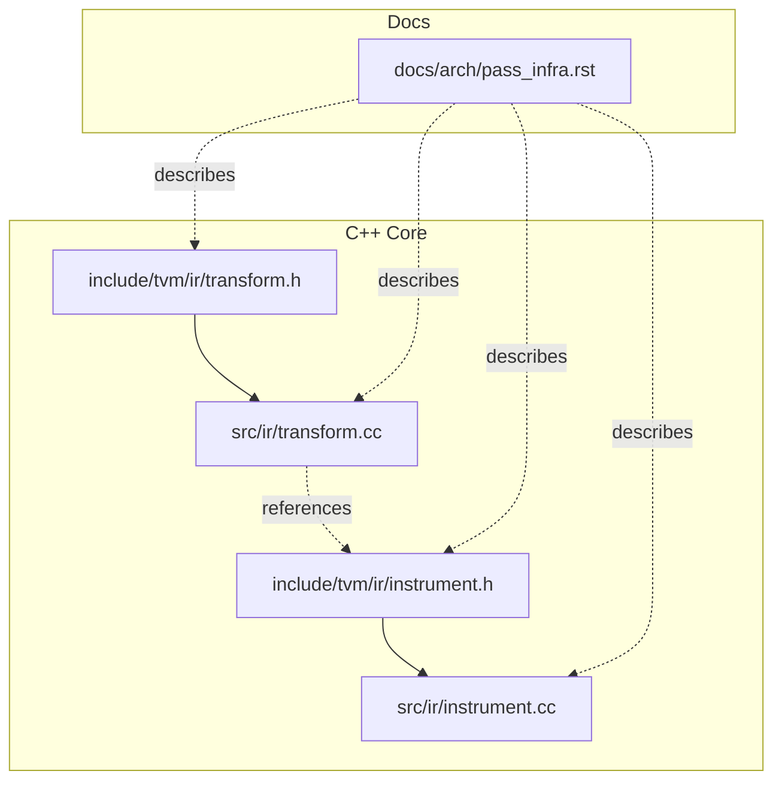
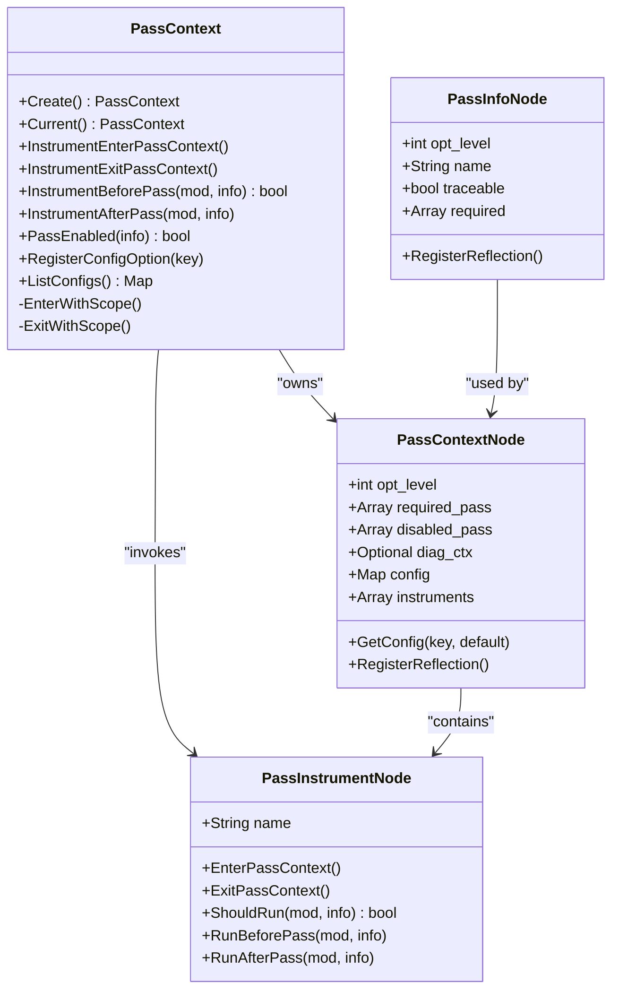
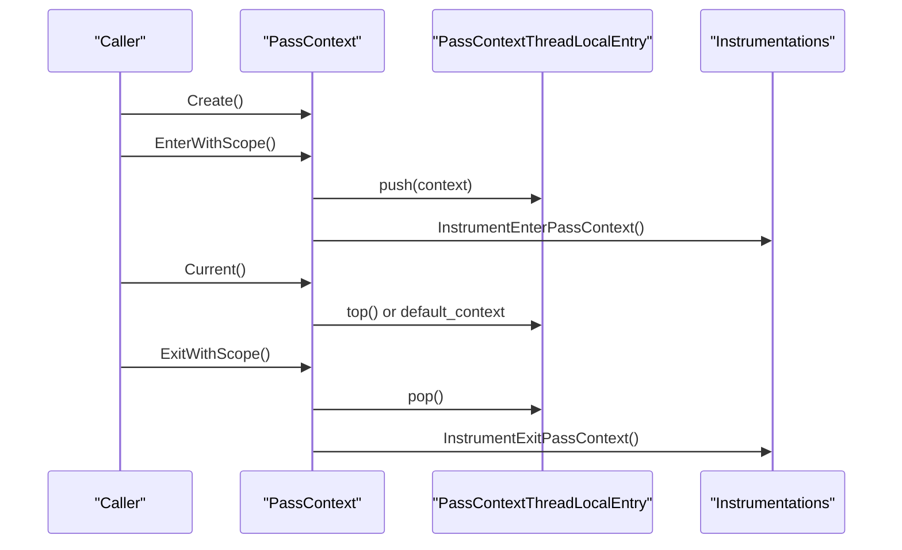
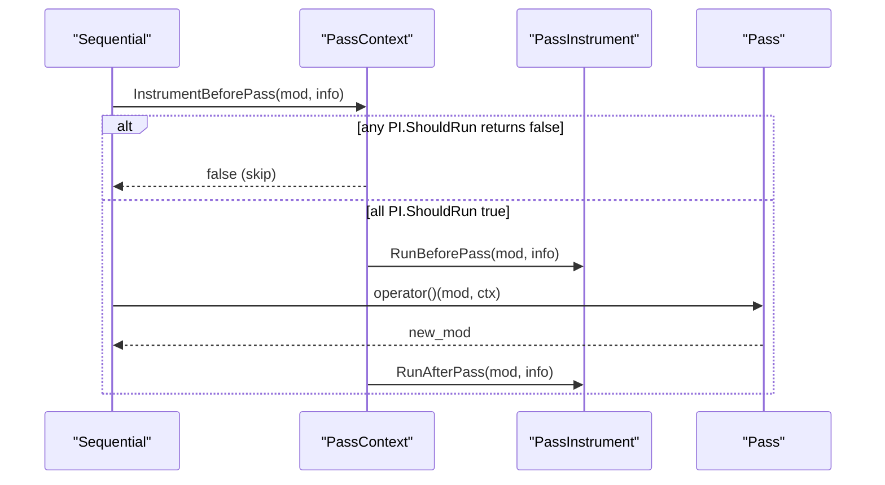
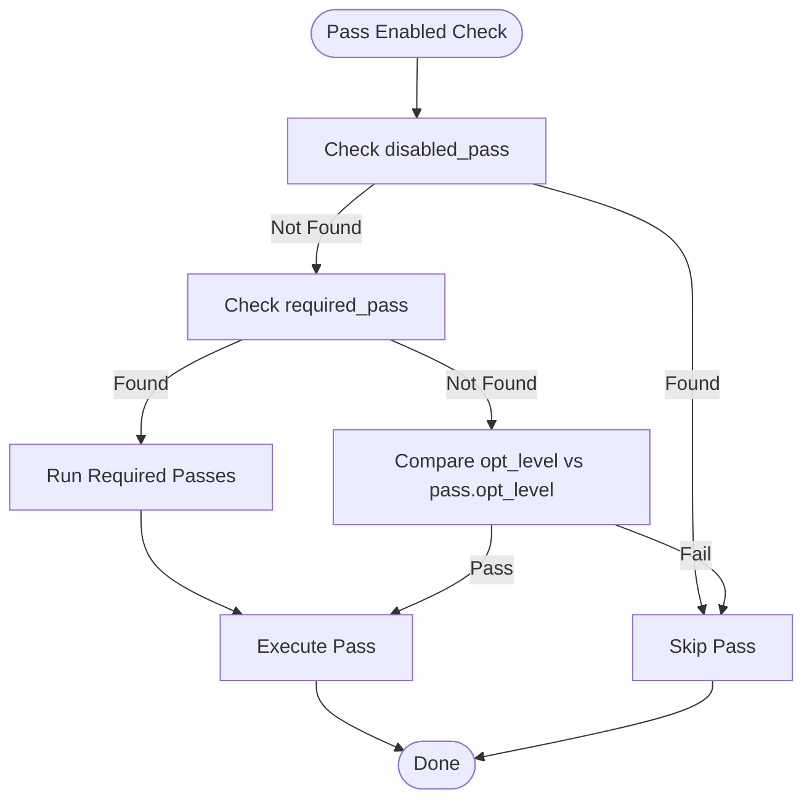
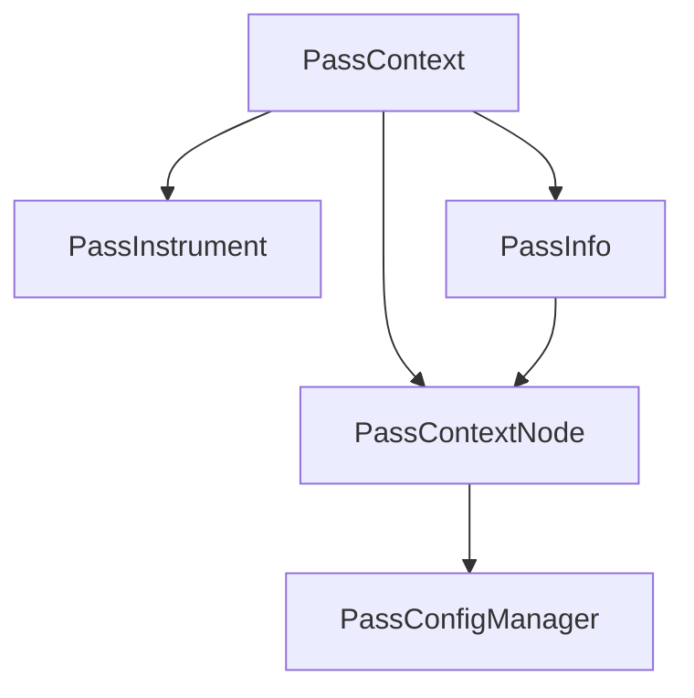

# Pass Context System

<cite>
**Referenced Files in This Document**
- [transform.h](file://include/tvm/ir/transform.h)
- [transform.cc](file://src/ir/transform.cc)
- [instrument.h](file://include/tvm/ir/instrument.h)
- [instrument.cc](file://src/ir/instrument.cc)
- [pass_infra.rst](file://docs/arch/pass_infra.rst)
</cite>

## Table of Contents
1. [Introduction](#introduction)
2. [Project Structure](#project-structure)
3. [Core Components](#core-components)
4. [Architecture Overview](#architecture-overview)
5. [Detailed Component Analysis](#detailed-component-analysis)
6. [Dependency Analysis](#dependency-analysis)
7. [Performance Considerations](#performance-considerations)
8. [Troubleshooting Guide](#troubleshooting-guide)
9. [Conclusion](#conclusion)
10. [Appendices](#appendices)

## Introduction
This document explains TVM’s pass context system, focusing on the PassContext class architecture, optimization levels, required/disabled pass lists, diagnostic contexts, configuration maps, and thread-local storage via PassContextThreadLocalStore. It covers how PassContext::Current() provides safe concurrent access, the Python frontend wrapper with with-statement support, and PassInstrument integration for pass lifecycle monitoring. It also documents pass configuration options registration using TVM_REGISTER_PASS_CONFIG_OPTION and provides practical guidance for pass context management and debugging workflows.

## Project Structure
The pass context system spans C++ headers and implementation files, plus documentation that describes the design and usage patterns. The core files are:
- PassContext and PassInfo declarations and APIs in the C++ header
- PassContext implementation, thread-local storage, instrumentation, and pass execution orchestration in the C++ implementation
- PassInstrument interfaces and base implementation for lifecycle hooks
- Architectural documentation describing the design and integration points

**Diagram sources**
- [transform.h:74-301](file://include/tvm/ir/transform.h#L74-L301)
- [transform.cc:43-59](file://src/ir/transform.cc#L43-L59)
- [instrument.h:45-154](file://include/tvm/ir/instrument.h#L45-L154)
- [instrument.cc:38-88](file://src/ir/instrument.cc#L38-L88)
- [pass_infra.rst:102-164](file://docs/arch/pass_infra.rst#L102-L164)

**Section sources**
- [transform.h:74-301](file://include/tvm/ir/transform.h#L74-L301)
- [transform.cc:43-59](file://src/ir/transform.cc#L43-L59)
- [instrument.h:45-154](file://include/tvm/ir/instrument.h#L45-L154)
- [instrument.cc:38-88](file://src/ir/instrument.cc#L38-L88)
- [pass_infra.rst:102-164](file://docs/arch/pass_infra.rst#L102-L164)

## Core Components
- PassContextNode: Holds configuration such as optimization level, required and disabled pass lists, diagnostic context, pass-specific configuration map, and instrumentation list. Provides typed config retrieval and reflection registration.
- PassContext: Public API for creating contexts, accessing the current context, enabling/disabling passes, and invoking instrumentation hooks. Exposes thread-local Current(), EnterWithScope(), ExitWithScope(), and instrumentation methods.
- PassInfo: Metadata for passes including opt_level, name, required dependencies, and traceability flag.
- PassInstrument: Lifecycle hook interface for pass monitoring with EnterPassContext, ExitPassContext, ShouldRun, RunBeforePass, RunAfterPass.
- PassContextThreadLocalEntry: Thread-local storage holding a default context and a stack of active contexts for nested scopes.
- PassConfigManager: Central registry and validator for pass configuration options, including type enforcement and metadata listing.

Key responsibilities:
- Manage pass execution scope and safety via thread-local storage and RAII-like with-scope semantics
- Gate pass execution using opt_level, required/disabled lists, and instrumentation decisions
- Provide diagnostic context propagation and rendering
- Enforce and validate pass configuration keys and types

**Section sources**
- [transform.h:79-138](file://include/tvm/ir/transform.h#L79-L138)
- [transform.h:153-301](file://include/tvm/ir/transform.h#L153-L301)
- [transform.h:319-344](file://include/tvm/ir/transform.h#L319-L344)
- [transform.cc:43-59](file://src/ir/transform.cc#L43-L59)
- [transform.cc:94-104](file://src/ir/transform.cc#L94-L104)
- [transform.cc:106-180](file://src/ir/transform.cc#L106-L180)
- [instrument.h:103-144](file://include/tvm/ir/instrument.h#L103-L144)
- [instrument.cc:38-88](file://src/ir/instrument.cc#L38-L88)

## Architecture Overview
The pass context system orchestrates pass execution with configurable behavior and instrumentation. The diagram below maps the primary classes and their relationships.

**Diagram sources**
- [transform.h:79-138](file://include/tvm/ir/transform.h#L79-L138)
- [transform.h:153-301](file://include/tvm/ir/transform.h#L153-L301)
- [transform.h:319-344](file://include/tvm/ir/transform.h#L319-L344)
- [instrument.h:103-144](file://include/tvm/ir/instrument.h#L103-L144)

## Detailed Component Analysis

### PassContextNode and PassContext
- Fields and capabilities:
  - Optimization level controls pass gating when not explicitly required/disabled
  - Required/disabled pass arrays determine pass inclusion/exclusion
  - Diagnostic context supports error reporting and rendering
  - Config map stores pass-specific options validated against registered keys
  - Instrumentation list enables lifecycle monitoring hooks
- Accessors:
  - GetConfig<T>() provides typed retrieval with optional default values
  - Reflection exposes opt_level, required_pass, disabled_pass, instruments, config, diag_ctx
- Static helpers:
  - Create() constructs a new context
  - ListConfigs() enumerates registered configuration keys and their types

Implementation highlights:
- PassEnabled(info) evaluates opt_level, required_pass, disabled_pass
- Instrumentation methods iterate instruments in order, short-circuiting on exceptions and ensuring cleanup

**Section sources**
- [transform.h:79-138](file://include/tvm/ir/transform.h#L79-L138)
- [transform.h:185-240](file://include/tvm/ir/transform.h#L185-L240)
- [transform.h:247-283](file://include/tvm/ir/transform.h#L247-L283)
- [transform.cc:94-104](file://src/ir/transform.cc#L94-L104)
- [transform.cc:209-288](file://src/ir/transform.cc#L209-L288)

### Thread-Local Storage and Scope Management
- PassContextThreadLocalEntry holds:
  - default_context initialized with a default PassContextNode
  - context_stack storing active contexts for nested scopes
- PassContext::Current() returns the top of the stack if present, otherwise the default context
- EnterWithScope() pushes the current context onto the stack and invokes InstrumentEnterPassContext()
- ExitWithScope() pops the stack and invokes InstrumentExitPassContext(), asserting stack integrity

This design ensures thread-safe, nested scoping for pass contexts and safe cleanup of instrumentation.

**Diagram sources**
- [transform.cc:61-84](file://src/ir/transform.cc#L61-L84)
- [transform.cc:209-257](file://src/ir/transform.cc#L209-L257)

**Section sources**
- [transform.cc:43-59](file://src/ir/transform.cc#L43-L59)
- [transform.cc:61-84](file://src/ir/transform.cc#L61-L84)
- [transform.cc:209-257](file://src/ir/transform.cc#L209-L257)

### PassInstrument Integration
- Lifecycle hooks:
  - EnterPassContext(): Called once per context entry
  - ExitPassContext(): Called once per context exit
  - ShouldRun(mod, info): Called per pass; pass proceeds only if all instruments return true
  - RunBeforePass(mod, info): Called per pass before execution
  - RunAfterPass(mod, info): Called per pass after execution
- Ordering and exception safety:
  - Hooks are invoked in the order of instruments
  - Exceptions abort remaining calls; cleanup ensures ExitPassContext is called for previously succeeded entries
- BasePassInstrument provides a convenience implementation backed by typed callbacks

**Diagram sources**
- [transform.cc:259-288](file://src/ir/transform.cc#L259-L288)
- [instrument.h:103-144](file://include/tvm/ir/instrument.h#L103-L144)
- [instrument.cc:144-177](file://src/ir/instrument.cc#L144-L177)

**Section sources**
- [instrument.h:103-144](file://include/tvm/ir/instrument.h#L103-L144)
- [instrument.cc:38-88](file://src/ir/instrument.cc#L38-L88)
- [transform.cc:209-288](file://src/ir/transform.cc#L209-L288)

### Pass Configuration Options Registration
- TVM_REGISTER_PASS_CONFIG_OPTION(Key, ValueType) registers a configuration option with type validation
- PassContext::RegisterConfigOption<ValueType>() supports both ObjectRef-derived types (with reflection) and primitive types
- PassConfigManager validates and legalizes values, raising meaningful errors for invalid keys or mismatched types
- ListConfigs() returns metadata (type) for registered options

Usage example references:
- A built-in registration for a testing immutable module option
- Documentation shows registering a TIR-specific loop unrolling configuration

**Section sources**
- [transform.h:303-314](file://include/tvm/ir/transform.h#L303-L314)
- [transform.h:247-283](file://include/tvm/ir/transform.h#L247-L283)
- [transform.cc:106-180](file://src/ir/transform.cc#L106-L180)
- [transform.cc:41-42](file://src/ir/transform.cc#L41-L42)
- [pass_infra.rst:576-584](file://docs/arch/pass_infra.rst#L576-L584)

### Pass Execution and Gating
- PassEnabled(info) determines whether a pass runs based on:
  - Explicitly disabled
  - Explicitly required
  - opt_level threshold comparison
- SequentialNode resolves required passes before each pass and applies enabled gating
- Pass::operator() integrates instrumentation and optional immutability checks

**Diagram sources**
- [transform.cc:94-104](file://src/ir/transform.cc#L94-L104)
- [transform.cc:470-488](file://src/ir/transform.cc#L470-L488)

**Section sources**
- [transform.cc:94-104](file://src/ir/transform.cc#L94-L104)
- [transform.cc:470-488](file://src/ir/transform.cc#L470-L488)

### Python Frontend Wrapper and With-Statement Support
- The C++ With<PassContext> integration enables Python-style with-statement semantics
- PassContext::Current() is exposed to Python for retrieving the active context
- OverrideInstruments allows updating instrumentation sets for the current context
- The documentation describes the Python-side lifecycle and decorators for implementing PassInstrument

Practical notes:
- Use PassContext(...) with instruments and config to create scoped contexts
- Retrieve current context via PassContext.current() for ad-hoc instrumentation overrides
- Combine with-statement for automatic cleanup and consistent instrumentation

**Section sources**
- [transform.h:153-301](file://include/tvm/ir/transform.h#L153-L301)
- [transform.cc:619-638](file://src/ir/transform.cc#L619-L638)
- [pass_infra.rst:564-571](file://docs/arch/pass_infra.rst#L564-L571)
- [pass_infra.rst:624-641](file://docs/arch/pass_infra.rst#L624-L641)

## Dependency Analysis
The pass context system exhibits clear separation of concerns:
- PassContext depends on PassInfo for gating and on PassInstrument for lifecycle hooks
- PassContextNode aggregates diagnostics and configuration maps
- PassConfigManager centralizes option validation independent of PassContext
- Instrumentation is decoupled and invoked through PassContext methods

**Diagram sources**
- [transform.h:79-138](file://include/tvm/ir/transform.h#L79-L138)
- [transform.h:153-301](file://include/tvm/ir/transform.h#L153-L301)
- [transform.h:319-344](file://include/tvm/ir/transform.h#L319-L344)
- [transform.cc:106-180](file://src/ir/transform.cc#L106-L180)

**Section sources**
- [transform.h:79-138](file://include/tvm/ir/transform.h#L79-L138)
- [transform.h:153-301](file://include/tvm/ir/transform.h#L153-L301)
- [transform.cc:106-180](file://src/ir/transform.cc#L106-L180)

## Performance Considerations
- Instrumentation overhead: Each hook invocation adds per-pass overhead; minimize expensive operations in ShouldRun and RunBeforePass/RunAfterPass
- Configuration validation: Legalization occurs during PassContext construction; batch-register frequently used options to avoid repeated validation costs
- Immutable module assertion: Enabling the testing.immutable_module config verifies pass purity but adds structural hashing overhead; use selectively for debugging
- Thread-local storage: Access to Current() and context stacks is O(1); nesting depth affects memory footprint but not lookup cost

[No sources needed since this section provides general guidance]

## Troubleshooting Guide
Common issues and remedies:
- Invalid configuration keys: PassConfigManager reports candidates and mismatches; ensure keys are registered via TVM_REGISTER_PASS_CONFIG_OPTION or similar registration mechanisms
- Instrumentation failures: If EnterPassContext or any hook throws, instrumentation is cleared and ExitPassContext is called for successful entries; review instrument implementations and logs
- Pass skipping unexpectedly: Verify opt_level thresholds, required/disabled lists, and instrument ShouldRun decisions
- Diagnostics not rendering: Ensure a diagnostic context is present and not overridden by nested passes; inspect diag_ctx propagation in module passes

**Section sources**
- [transform.cc:118-147](file://src/ir/transform.cc#L118-L147)
- [transform.cc:209-257](file://src/ir/transform.cc#L209-L257)
- [transform.cc:396-425](file://src/ir/transform.cc#L396-L425)

## Conclusion
The pass context system provides a robust, thread-safe mechanism for configuring and monitoring TVM optimization passes. Through PassContext, PassInfo, and PassInstrument, it enables fine-grained control over pass execution, diagnostics, and instrumentation. The thread-local storage and with-scope semantics ensure safe concurrent usage, while configuration registration and validation maintain type safety and discoverability. Together, these components form a flexible foundation for building reliable and observable compilation pipelines.

[No sources needed since this section summarizes without analyzing specific files]

## Appendices

### Practical Guidance and Examples
- Creating a scoped pass context:
  - Use PassContext.Create() and set opt_level, required_pass, disabled_pass, config, and instruments
  - Wrap operations with the context to enforce configuration and instrumentation
- Overriding instruments for the current context:
  - Retrieve current context via PassContext.Current() and call override methods to update instrumentation sets
- Debugging workflows:
  - Enable pass timing instrumentation to profile pass durations
  - Use diagnostic contexts to capture and render pass-related errors
  - Enable immutable module checks to detect unintended mutations during passes

**Section sources**
- [transform.cc:586-603](file://src/ir/transform.cc#L586-L603)
- [transform.cc:632-637](file://src/ir/transform.cc#L632-L637)
- [instrument.cc:319-339](file://src/ir/instrument.cc#L319-L339)
- [pass_infra.rst:518-521](file://docs/arch/pass_infra.rst#L518-L521)
- [pass_infra.rst:564-571](file://docs/arch/pass_infra.rst#L564-L571)