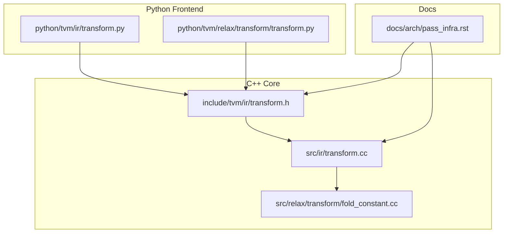
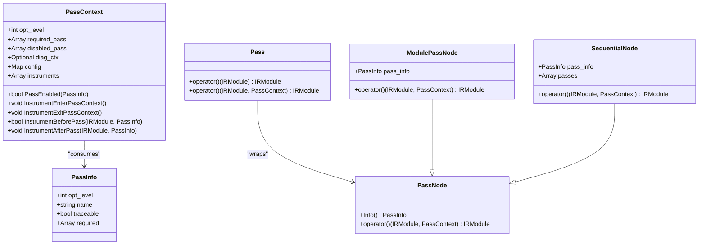
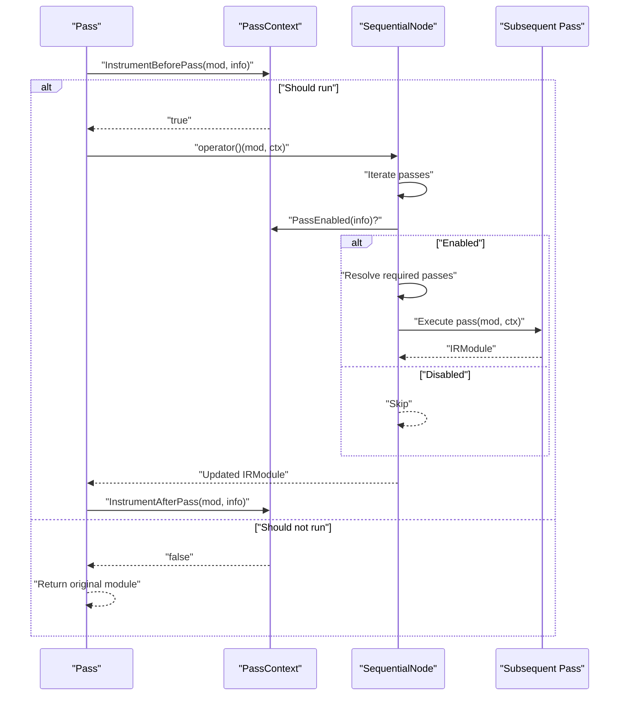
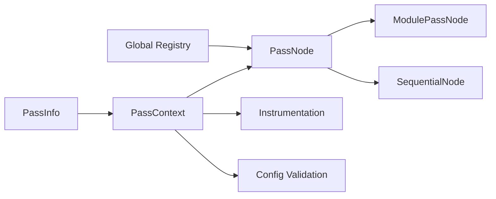

# Pass Framework Design

<cite>
**Referenced Files in This Document**
- [pass_infra.rst](file://docs/arch/pass_infra.rst)
- [transform.h](file://include/tvm/ir/transform.h)
- [transform.cc](file://src/ir/transform.cc)
- [fold_constant.cc](file://src/relax/transform/fold_constant.cc)
- [transform.py](file://python/tvm/ir/transform.py)
- [relax_transform.py](file://python/tvm/relax/transform/transform.py)
</cite>

## Table of Contents
1. [Introduction](#introduction)
2. [Project Structure](#project-structure)
3. [Core Components](#core-components)
4. [Architecture Overview](#architecture-overview)
5. [Detailed Component Analysis](#detailed-component-analysis)
6. [Dependency Analysis](#dependency-analysis)
7. [Performance Considerations](#performance-considerations)
8. [Troubleshooting Guide](#troubleshooting-guide)
9. [Conclusion](#conclusion)
10. [Appendices](#appendices)

## Introduction
This document explains TVM’s pass framework design, which is inspired by LLVM’s hierarchical pass manager and modern deep learning frameworks’ block-style composition. The framework organizes IR transformations as module-to-module passes, enabling global optimizations and a consistent, extensible pipeline. It defines a base pass abstraction, specialized pass types, metadata-driven scheduling, and a global registry for pass discovery and invocation.

## Project Structure
The pass framework spans C++ headers and implementations, Python frontends, and pass examples:
- C++ core: pass base classes, pass info/context, pass execution, and registry integration
- Python frontends: user-facing APIs for constructing and composing passes
- Pass examples: concrete passes demonstrating registration and usage

**Diagram sources**
- [transform.h:71-568](file://include/tvm/ir/transform.h#L71-L568)
- [transform.cc:1-657](file://src/ir/transform.cc#L1-L657)
- [fold_constant.cc:1-438](file://src/relax/transform/fold_constant.cc#L1-L438)
- [transform.py:1-411](file://python/tvm/ir/transform.py#L1-L411)
- [relax_transform.py:1-200](file://python/tvm/relax/transform/transform.py#L1-L200)
- [pass_infra.rst:1-671](file://docs/arch/pass_infra.rst#L1-L671)

**Section sources**
- [transform.h:20-56](file://include/tvm/ir/transform.h#L20-L56)
- [transform.cc:20-40](file://src/ir/transform.cc#L20-L40)
- [transform.py:18-28](file://python/tvm/ir/transform.py#L18-L28)
- [relax_transform.py:19-41](file://python/tvm/relax/transform/transform.py#L19-L41)
- [pass_infra.rst:20-56](file://docs/arch/pass_infra.rst#L20-L56)

## Core Components
- PassNode: Base class for all passes, defining the pass interface and requiring Info() and operator()(IRModule, PassContext).
- PassInfo: Metadata container for pass name, optimization level, required dependencies, and traceability flag.
- PassContext: Runtime configuration carrying opt_level, required/disabled passes, diagnostics, config map, and instrumentation hooks.
- Pass: Managed reference wrapper around PassNode, delegating execution to backend with instrumentation and immutability checks.
- ModulePassNode: Module-level pass that transforms an entire IRModule.
- SequentialNode: Composite pass that runs a list of passes in order, resolving dependencies and honoring opt levels.

These components collectively enable a consistent, hierarchical pass system across Relax and TensorIR.

**Section sources**
- [transform.h:319-398](file://include/tvm/ir/transform.h#L319-L398)
- [transform.cc:333-426](file://src/ir/transform.cc#L333-L426)
- [transform.cc:444-488](file://src/ir/transform.cc#L444-L488)

## Architecture Overview
The pass framework follows a module-to-module transformation model. All passes operate on IRModule and return IRModule, enabling global optimizations. Passes are composed hierarchically:
- Base: PassNode
- Specializations: ModulePassNode, SequentialNode
- Execution: Pass delegates to PassNode::operator() with PassContext instrumentation and config validation

**Diagram sources**
- [transform.h:319-516](file://include/tvm/ir/transform.h#L319-L516)
- [transform.cc:333-488](file://src/ir/transform.cc#L333-L488)

## Detailed Component Analysis

### PassNode and PassInfo
- PassNode defines the contract for all passes: Info() returns metadata, operator() applies the transformation under a PassContext.
- PassInfo encapsulates opt_level, name, required dependencies, and traceability. It is used by PassContext to decide pass enablement and by instrumentation.

Implementation highlights:
- PassNode::operator() is overloaded to accept a module and optional context.
- PassInfo is constructed with opt_level, name, required, and traceable.

**Section sources**
- [transform.h:366-398](file://include/tvm/ir/transform.h#L366-L398)
- [transform.h:319-363](file://include/tvm/ir/transform.h#L319-L363)

### PassContext
- Holds opt_level, required_pass, disabled_pass, diag_ctx, config, and instruments.
- Provides PassEnabled() to determine whether a pass should run based on user configuration and opt_level.
- Instruments allow pre/post pass hooks and context lifecycle hooks.

Execution flow:
- Enter/exit pass context triggers instrument EnterPassContext/ExitPassContext.
- Before/after pass execution invokes InstrumentBeforePass/InstrumentAfterPass.
- Config validation ensures only registered keys are accepted.

**Section sources**
- [transform.h:79-138](file://include/tvm/ir/transform.h#L79-L138)
- [transform.cc:94-104](file://src/ir/transform.cc#L94-L104)
- [transform.cc:209-288](file://src/ir/transform.cc#L209-L288)
- [transform.cc:106-180](file://src/ir/transform.cc#L106-L180)

### ModulePassNode
- Implements module-level transformations that can add/remove functions and operate globally.
- Uses a packed function pass_func to implement the transformation.
- Integrates with diagnostics and rendering.

Key behaviors:
- Validates input module and return value.
- Renders diagnostics captured during pass execution.

**Section sources**
- [transform.h:436-489](file://include/tvm/ir/transform.h#L436-L489)
- [transform.cc:333-426](file://src/ir/transform.cc#L333-L426)

### SequentialNode
- Composes multiple passes and executes them in order.
- Resolves dependencies by executing required passes before each pass.
- Honors opt_level and disabled lists via PassContext::PassEnabled.

**Diagram sources**
- [transform.cc:470-488](file://src/ir/transform.cc#L470-L488)
- [transform.cc:294-311](file://src/ir/transform.cc#L294-L311)

**Section sources**
- [transform.cc:444-488](file://src/ir/transform.cc#L444-L488)

### Pass Registration and Packed Function System
- Passes are registered in a global function registry with namespaced endpoints (e.g., relax.transform.FoldConstant).
- The registry exposes a GetGlobal() mechanism to retrieve pass constructors by name.
- Python frontends wrap backend constructors to expose user-friendly decorators and classes.

Registration example:
- A pass function FoldConstant() returns a CreateFunctionPass(...) with metadata.
- The pass is registered under "relax.transform.FoldConstant" via GlobalDef().
- Backend GetPass() resolves pass names to registered constructors.

**Section sources**
- [pass_infra.rst:299-307](file://docs/arch/pass_infra.rst#L299-L307)
- [fold_constant.cc:422-432](file://src/relax/transform/fold_constant.cc#L422-L432)
- [transform.cc:456-465](file://src/ir/transform.cc#L456-L465)

### Python Frontend APIs
- PassInfo, PassContext, Pass, ModulePass, Sequential are exposed to Python via tvm_ffi.
- Python decorators like module_pass and function_pass construct passes with metadata and wrap backend constructors.
- ApplyPassToFunction restricts module-level passes to specific functions via regex.

**Section sources**
- [transform.py:30-141](file://python/tvm/ir/transform.py#L30-L141)
- [relax_transform.py:43-200](file://python/tvm/relax/transform/transform.py#L43-L200)

## Dependency Analysis
The pass framework relies on a few key dependencies:
- FFI reflection and global registry for pass discovery
- Diagnostic context for error reporting
- Instrumentation subsystem for timing and tracing
- Config validation for safe pass configuration

**Diagram sources**
- [transform.h:79-138](file://include/tvm/ir/transform.h#L79-L138)
- [transform.cc:106-180](file://src/ir/transform.cc#L106-L180)
- [transform.cc:333-426](file://src/ir/transform.cc#L333-L426)
- [transform.cc:444-488](file://src/ir/transform.cc#L444-L488)

**Section sources**
- [transform.h:59-66](file://include/tvm/ir/transform.h#L59-L66)
- [transform.cc:106-180](file://src/ir/transform.cc#L106-L180)

## Performance Considerations
- Immutable module assertion: When enabled via config, the pass framework validates that modules remain unchanged, catching unintended mutations during development.
- Opt level gating: Passes are only executed when opt_level meets or exceeds the configured threshold, reducing unnecessary work.
- Dependency resolution: Sequential passes resolve required passes before execution, avoiding redundant recomputation.

[No sources needed since this section provides general guidance]

## Troubleshooting Guide
Common issues and remedies:
- Pass not found: Ensure the pass is registered under the expected namespace and name. Use GetPass() or the backend’s registry lookup.
- Pass disabled: Verify disabled_pass list and opt_level thresholds in PassContext.
- Instrumentation failures: Instrumentation is cleared on exceptions; review EnterPassContext/ExitPassContext logs.
- Config validation errors: Only registered config keys are accepted; use ListConfigs() to discover valid keys.

**Section sources**
- [transform.cc:456-465](file://src/ir/transform.cc#L456-L465)
- [transform.cc:94-104](file://src/ir/transform.cc#L94-L104)
- [transform.cc:209-288](file://src/ir/transform.cc#L209-L288)
- [transform.cc:178-180](file://src/ir/transform.cc#L178-L180)

## Conclusion
TVM’s pass framework provides a robust, hierarchical system for IR transformations. By modeling passes as module-to-module transformations and leveraging metadata-driven scheduling, it enables global optimizations while remaining extensible and user-friendly. The combination of a global registry, pass context configuration, and instrumentation makes it practical to develop, compose, and debug complex optimization pipelines.

[No sources needed since this section summarizes without analyzing specific files]

## Appendices

### Pass Hierarchy Construction and Pipeline Composition
- Build a pipeline by composing passes into a Sequential pass with metadata (opt_level, name, required).
- Use ApplyPassToFunction to restrict module-level passes to specific functions.
- Leverage decorators in Python to quickly define passes with metadata and registration.

**Section sources**
- [transform.py:185-224](file://python/tvm/ir/transform.py#L185-L224)
- [transform.py:370-411](file://python/tvm/ir/transform.py#L370-L411)
- [relax_transform.py:256-353](file://python/tvm/relax/transform/transform.py#L256-L353)