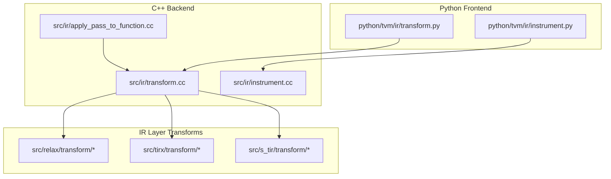
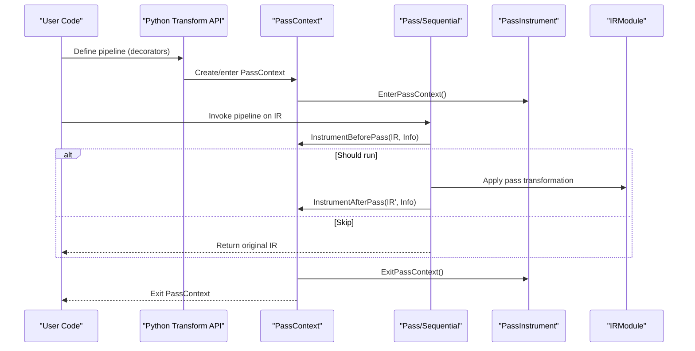
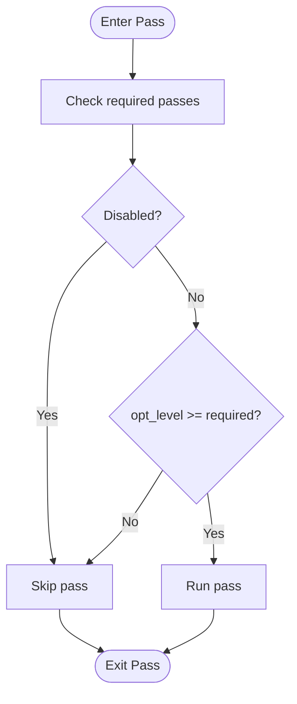
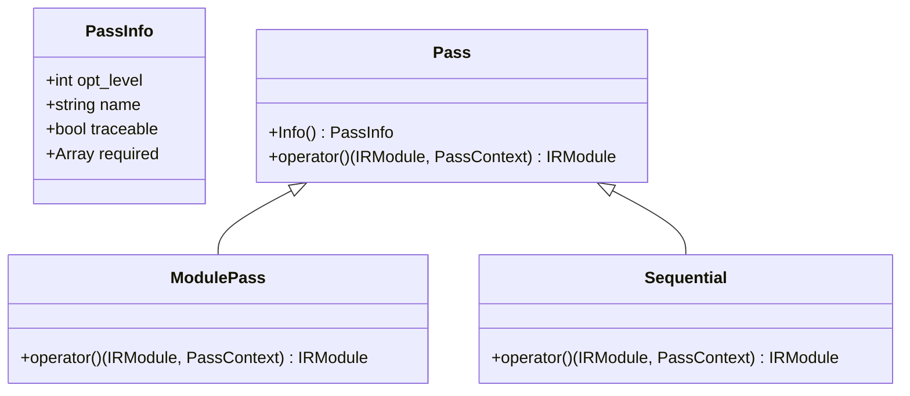
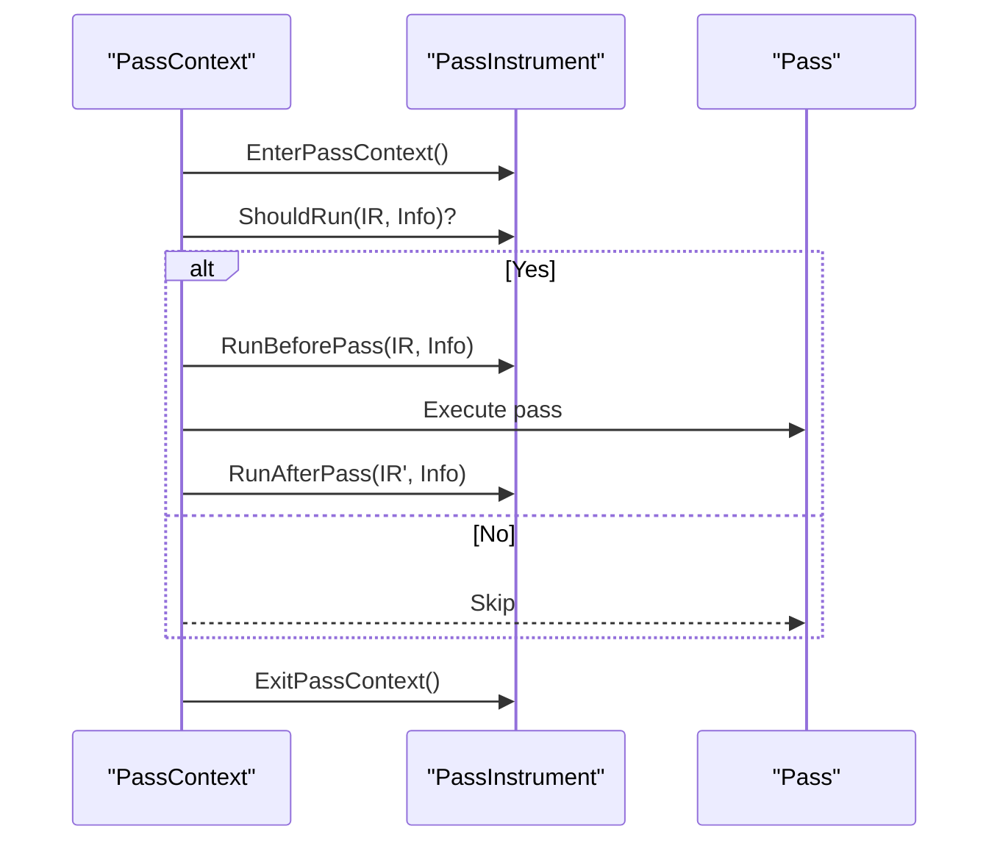
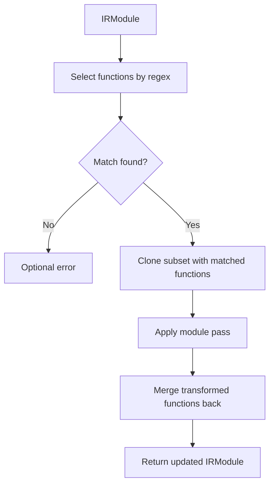
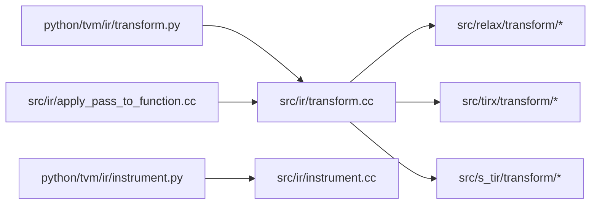

# Pass Infrastructure

<cite>
**Referenced Files in This Document**
- [transform.cc](file://src/ir/transform.cc)
- [instrument.cc](file://src/ir/instrument.cc)
- [apply_pass_to_function.cc](file://src/ir/apply_pass_to_function.cc)
- [transform.py](file://python/tvm/ir/transform.py)
- [instrument.py](file://python/tvm/ir/instrument.py)
- [pass_infra.rst](file://docs/arch/pass_infra.rst)
- [fold_constant.cc](file://src/relax/transform/fold_constant.cc)
- [unroll_loop.cc](file://src/tirx/transform/unroll_loop.cc)
- [tir_transform.py](file://python/tvm/tirx/transform/transform.py)
- [relax_transform.py](file://python/tvm/relax/transform/transform.py)
- [test_pass_instrument.py](file://tests/python/ir/test_pass_instrument.py)
</cite>

## Table of Contents
1. [Introduction](#introduction)
2. [Project Structure](#project-structure)
3. [Core Components](#core-components)
4. [Architecture Overview](#architecture-overview)
5. [Detailed Component Analysis](#detailed-component-analysis)
6. [Dependency Analysis](#dependency-analysis)
7. [Performance Considerations](#performance-considerations)
8. [Troubleshooting Guide](#troubleshooting-guide)
9. [Conclusion](#conclusion)
10. [Appendices](#appendices)

## Introduction
This document explains TVM’s pass infrastructure: the pass framework architecture, pass registration mechanisms, transformation pipeline design, pass context system, instrumentation, and debugging capabilities. It covers built-in optimization passes across IR layers (Relax, TIR, S-TIR, and TIRx), guidance for developing custom passes, examples of pass composition and conditional execution, and strategies for performance optimization. It also clarifies how passes integrate into the overall compilation pipeline and provides practical guidance for testing and integrating passes.

## Project Structure
The pass infrastructure spans C++ backend and Python frontend layers:
- C++ backend defines pass abstractions, pass context, instrumentation hooks, and built-in passes.
- Python frontend exposes user-friendly decorators and APIs to compose and run passes.
- Documentation outlines design principles and usage patterns.

**Diagram sources**
- [transform.py](file://python/tvm/ir/transform.py)
- [instrument.py](file://python/tvm/ir/instrument.py)
- [transform.cc](file://src/ir/transform.cc)
- [instrument.cc](file://src/ir/instrument.cc)
- [apply_pass_to_function.cc](file://src/ir/apply_pass_to_function.cc)

**Section sources**
- [pass_infra.rst](file://docs/arch/pass_infra.rst)

## Core Components
- PassInfo: Metadata for passes including optimization level, name, required dependencies, and traceability.
- PassContext: Execution context carrying opt level, required/disabled pass lists, diagnostics, configuration, and instrumentation.
- Pass: Base class for all passes; supports module-level passes and sequential compositions.
- Instrumentation: PassInstrument interface and built-in instruments for timing, printing, and dumping IR.
- ApplyPassToFunction: Utility to apply a module pass to a subset of functions selected by regex.

Key implementation references:
- PassInfo and PassContext definitions and lifecycle in [transform.cc](file://src/ir/transform.cc).
- Pass and Sequential execution logic in [transform.cc](file://src/ir/transform.cc).
- Instrumentation hooks and built-ins in [instrument.cc](file://src/ir/instrument.cc) and [instrument.py](file://python/tvm/ir/instrument.py).
- ApplyPassToFunction utility in [apply_pass_to_function.cc](file://src/ir/apply_pass_to_function.cc).

**Section sources**
- [transform.cc](file://src/ir/transform.cc)
- [instrument.cc](file://src/ir/instrument.cc)
- [apply_pass_to_function.cc](file://src/ir/apply_pass_to_function.cc)
- [transform.py](file://python/tvm/ir/transform.py)
- [instrument.py](file://python/tvm/ir/instrument.py)

## Architecture Overview
The pass infrastructure follows a layered design:
- Python decorators and APIs construct pass objects and pipelines.
- C++ backend executes passes under a PassContext, honoring opt levels, required/disabled lists, and instrumentation.
- Built-in passes operate at module or function granularity across IR layers.

**Diagram sources**
- [transform.cc](file://src/ir/transform.cc)
- [instrument.cc](file://src/ir/instrument.cc)
- [transform.py](file://python/tvm/ir/transform.py)
- [instrument.py](file://python/tvm/ir/instrument.py)

## Detailed Component Analysis

### Pass Context System
- Thread-local storage maintains a stack of contexts; EnterWithScope/ExitWithScope manage scope.
- PassEnabled evaluates opt level, required, and disabled lists.
- Instrument hooks wrap pass execution to allow conditional skipping and pre/post actions.

**Diagram sources**
- [transform.cc](file://src/ir/transform.cc)

**Section sources**
- [transform.cc](file://src/ir/transform.cc)
- [transform.py](file://python/tvm/ir/transform.py)

### Pass Registration and Composition
- PassInfo carries metadata; passes are registered via global function registry entries.
- module_pass decorator constructs ModulePass with PassInfo and wraps transform functions or classes.
- Sequential composes multiple passes; resolves required passes before each step.

**Diagram sources**
- [transform.cc](file://src/ir/transform.cc)
- [transform.py](file://python/tvm/ir/transform.py)

**Section sources**
- [transform.cc](file://src/ir/transform.cc)
- [transform.py](file://python/tvm/ir/transform.py)

### Instrumentation and Debugging
- PassInstrument defines EnterPassContext, ExitPassContext, ShouldRun, RunBeforePass, RunAfterPass.
- Built-in instruments include timing, printing before/after passes, and dumping IR to files.
- PassContext coordinates instrumentation lifecycle and handles failures by disabling instrumentation.

**Diagram sources**
- [instrument.cc](file://src/ir/instrument.cc)
- [instrument.py](file://python/tvm/ir/instrument.py)
- [transform.cc](file://src/ir/transform.cc)

**Section sources**
- [instrument.cc](file://src/ir/instrument.cc)
- [instrument.py](file://python/tvm/ir/instrument.py)
- [transform.cc](file://src/ir/transform.cc)

### ApplyPassToFunction Utility
- Applies a module pass to a subset of functions matched by a regex.
- Temporarily marks internal functions to preserve call-sites and replaces unmatched functions with extern placeholders.

**Diagram sources**
- [apply_pass_to_function.cc](file://src/ir/apply_pass_to_function.cc)

**Section sources**
- [apply_pass_to_function.cc](file://src/ir/apply_pass_to_function.cc)

### Built-in Optimization Passes Across IR Layers
- Relax: normalization, constant folding, layout transforms, operator fusion, dead code elimination, and more.
- TIRx: dtype conversions, storage rewrites, vectorization, loop unrolling, simplifications, and host/device splitting.
- S-TIR: scheduling and memory-related transformations.
- TIRx loop unrolling demonstrates pass configuration registration via TVM_REGISTER_PASS_CONFIG_OPTION.

Examples of IR-layer transforms:
- Relax: [fold_constant.cc](file://src/relax/transform/fold_constant.cc)
- TIRx: [unroll_loop.cc](file://src/tirx/transform/unroll_loop.cc)
- Python frontends for convenience: [tir_transform.py](file://python/tvm/tirx/transform/transform.py), [relax_transform.py](file://python/tvm/relax/transform/transform.py)

**Section sources**
- [fold_constant.cc](file://src/relax/transform/fold_constant.cc)
- [unroll_loop.cc](file://src/tirx/transform/unroll_loop.cc)
- [tir_transform.py](file://python/tvm/tirx/transform/transform.py)
- [relax_transform.py](file://python/tvm/relax/transform/transform.py)

### Developing Custom Passes
- Use module_pass decorator to define module-level passes with opt level, name, and required dependencies.
- Wrap a Python function or a class with a transform_module method.
- Register pass configuration keys using TVM_REGISTER_PASS_CONFIG_OPTION in C++ and fetch via PassContext.GetConfig in pass bodies.

Practical steps:
- Define transform function/class and wrap with module_pass decorator.
- Optionally register configuration options and read them in the pass.
- Compose passes using Sequential or pass decorators.

**Section sources**
- [transform.py](file://python/tvm/ir/transform.py)
- [transform.cc](file://src/ir/transform.cc)
- [unroll_loop.cc](file://src/tirx/transform/unroll_loop.cc)

### Pass Composition, Conditional Execution, and Performance Strategies
- Composition: Use Sequential to chain passes; required dependencies are resolved automatically.
- Conditional execution: Use PassInstrument.should_run to selectively skip passes; PassContext.disabled_pass and opt_level control inclusion.
- Performance: Use PassTimingInstrument to profile pass durations; leverage PassContext.testing.immutable_module to catch unintended mutations.

**Section sources**
- [transform.cc](file://src/ir/transform.cc)
- [instrument.cc](file://src/ir/instrument.cc)
- [instrument.py](file://python/tvm/ir/instrument.py)
- [transform.py](file://python/tvm/ir/transform.py)

## Dependency Analysis
- Python frontend depends on C++ backend via FFI bindings.
- Passes depend on PassContext for configuration and instrumentation.
- Built-in passes depend on IR-layer transformation implementations.

**Diagram sources**
- [transform.py](file://python/tvm/ir/transform.py)
- [instrument.py](file://python/tvm/ir/instrument.py)
- [transform.cc](file://src/ir/transform.cc)
- [instrument.cc](file://src/ir/instrument.cc)
- [apply_pass_to_function.cc](file://src/ir/apply_pass_to_function.cc)

**Section sources**
- [transform.cc](file://src/ir/transform.cc)
- [instrument.cc](file://src/ir/instrument.cc)
- [apply_pass_to_function.cc](file://src/ir/apply_pass_to_function.cc)

## Performance Considerations
- Use PassTimingInstrument to measure per-pass overhead and identify bottlenecks.
- Tune opt_level to include/exclude passes based on target device and latency requirements.
- Prefer targeted transformations using ApplyPassToFunction to limit IR changes to hotspots.
- Keep pass composition minimal and avoid redundant recomputation by leveraging pass dependencies and traceability flags.

[No sources needed since this section provides general guidance]

## Troubleshooting Guide
- Instrumentation failures: PassContext disables instrumentation upon exceptions and exits successfully entered instruments in reverse order.
- Verifying pass execution: Use PrintIR or PassPrintingInstrument to inspect IR before/after specific passes.
- Dumping IR: Use DumpIR to persist IR snapshots for regression analysis.
- Testing instrumentation: See [test_pass_instrument.py](file://tests/python/ir/test_pass_instrument.py) for examples of instrument behavior in tests.

**Section sources**
- [instrument.cc](file://src/ir/instrument.cc)
- [instrument.py](file://python/tvm/ir/instrument.py)
- [test_pass_instrument.py](file://tests/python/ir/test_pass_instrument.py)

## Conclusion
TVM’s pass infrastructure provides a robust, extensible framework for composing and executing IR transformations across multiple layers. The combination of PassContext, PassInstrument, and module/function-level passes enables precise control over optimization pipelines, strong debugging capabilities, and efficient performance tuning. By leveraging built-in passes and the provided APIs, developers can rapidly prototype, test, and integrate custom optimizations into the compilation workflow.

[No sources needed since this section summarizes without analyzing specific files]

## Appendices

### Practical Guidance: Creating and Running a Pipeline
- Define passes using module_pass decorator with opt_level and required dependencies.
- Compose passes with Sequential or pass decorators.
- Run under a PassContext with desired opt level, disabled passes, and instrumentation.

**Section sources**
- [transform.py](file://python/tvm/ir/transform.py)
- [transform.cc](file://src/ir/transform.cc)

### Relationship to Compilation Pipeline
- Passes operate on IRModule and are orchestrated by PassContext.
- Built-in passes in Relax/TIRx/S-TIR layers implement IPO and intraprocedural optimizations.
- ApplyPassToFunction targets specific functions to reduce scope and risk.

**Section sources**
- [pass_infra.rst](file://docs/arch/pass_infra.rst)
- [apply_pass_to_function.cc](file://src/ir/apply_pass_to_function.cc)