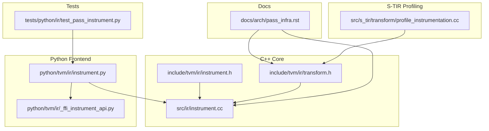
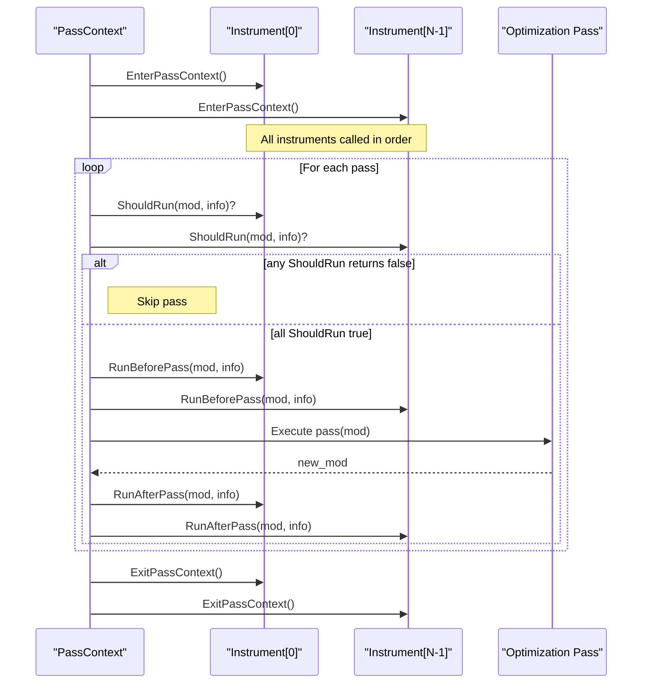
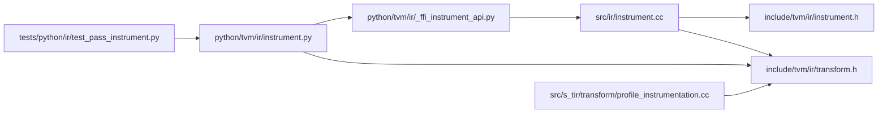
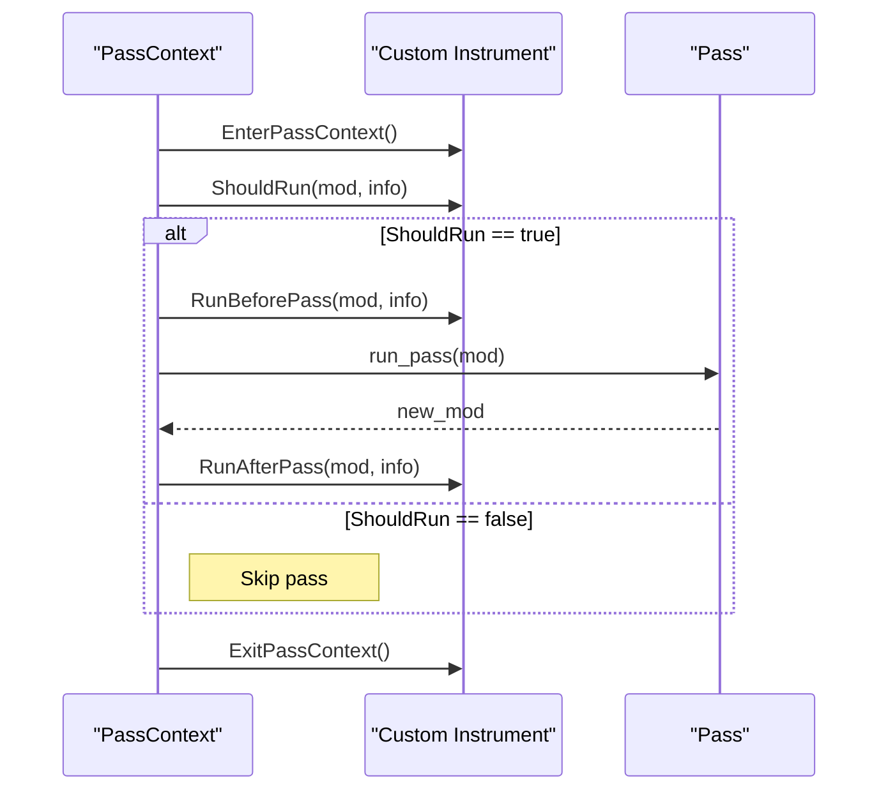

# Pass Instrumentation and Debugging

<cite>
**Referenced Files in This Document**
- [instrument.h](file://include/tvm/ir/instrument.h)
- [instrument.cc](file://src/ir/instrument.cc)
- [transform.h](file://include/tvm/ir/transform.h)
- [instrument.py](file://python/tvm/ir/instrument.py)
- [_ffi_instrument_api.py](file://python/tvm/ir/_ffi_instrument_api.py)
- [test_pass_instrument.py](file://tests/python/ir/test_pass_instrument.py)
- [profile_instrumentation.cc](file://src/s_tir/transform/profile_instrumentation.cc)
- [pass_infra.rst](file://docs/arch/pass_infra.rst)
</cite>

## Table of Contents
1. [Introduction](#introduction)
2. [Project Structure](#project-structure)
3. [Core Components](#core-components)
4. [Architecture Overview](#architecture-overview)
5. [Detailed Component Analysis](#detailed-component-analysis)
6. [Dependency Analysis](#dependency-analysis)
7. [Performance Considerations](#performance-considerations)
8. [Troubleshooting Guide](#troubleshooting-guide)
9. [Conclusion](#conclusion)
10. [Appendices](#appendices)

## Introduction
This document explains TVM’s pass instrumentation and debugging capabilities. It covers the PassInstrument interface, built-in instruments for performance profiling and IR inspection, pass lifecycle monitoring via PassContext, dynamic instrument replacement, and practical workflows for debugging and performance analysis. It also provides guidance for developing custom instruments and integrating them into TVM’s pass pipeline.

## Project Structure
The pass instrumentation system spans C++ core headers and implementations, Python frontends, and documentation. Key locations:
- C++ interface and base implementation: include/tvm/ir/instrument.h, src/ir/instrument.cc
- PassContext and pass lifecycle hooks: include/tvm/ir/transform.h
- Python instrumentation frontends: python/tvm/ir/instrument.py, python/tvm/ir/_ffi_instrument_api.py
- Built-in instruments and tests: python/tvm/ir/instrument.py, tests/python/ir/test_pass_instrument.py
- Additional profiling instrumentation for S-TIR: src/s_tir/transform/profile_instrumentation.cc
- Architecture and lifecycle documentation: docs/arch/pass_infra.rst

**Diagram sources**
- [instrument.h:45-157](file://include/tvm/ir/instrument.h#L45-L157)
- [instrument.cc:34-343](file://src/ir/instrument.cc#L34-L343)
- [transform.h:74-301](file://include/tvm/ir/transform.h#L74-L301)
- [instrument.py:33-342](file://python/tvm/ir/instrument.py#L33-L342)
- [_ffi_instrument_api.py:17-22](file://python/tvm/ir/_ffi_instrument_api.py#L17-L22)
- [test_pass_instrument.py:18-64](file://tests/python/ir/test_pass_instrument.py#L18-L64)
- [profile_instrumentation.cc:23-304](file://src/s_tir/transform/profile_instrumentation.cc#L23-L304)
- [pass_infra.rst:124-641](file://docs/arch/pass_infra.rst#L124-L641)

**Section sources**
- [instrument.h:20-160](file://include/tvm/ir/instrument.h#L20-L160)
- [instrument.cc:1-343](file://src/ir/instrument.cc#L1-L343)
- [transform.h:56-568](file://include/tvm/ir/transform.h#L56-L568)
- [instrument.py:1-342](file://python/tvm/ir/instrument.py#L1-L342)
- [_ffi_instrument_api.py:1-22](file://python/tvm/ir/_ffi_instrument_api.py#L1-L22)
- [test_pass_instrument.py:1-64](file://tests/python/ir/test_pass_instrument.py#L1-L64)
- [profile_instrumentation.cc:1-304](file://src/s_tir/transform/profile_instrumentation.cc#L1-L304)
- [pass_infra.rst:124-641](file://docs/arch/pass_infra.rst#L124-L641)

## Core Components
- PassInstrument interface: Defines EnterPassContext, ExitPassContext, ShouldRun, RunBeforePass, and RunAfterPass. Multiple instruments can be chained in a PassContext and are executed in order.
- BasePassInstrument: A default implementation that wraps typed callbacks for each hook.
- PassContext: Manages pass execution context, including instrumentation lifecycle and per-pass hooks.
- Built-in instruments (Python):
  - PassTimingInstrument: Performance profiling using a C++-implemented timing instrument.
  - PassPrintingInstrument: Conditional printing before/after specific passes.
  - PrintBeforeAll, PrintAfterAll: Print IR before/after every pass.
  - DumpIR: Save IR scripts to disk after each pass.
- S-TIR profiling intrinsics: Loop-level and function-level profiling intrinsics inserted into PrimFunc bodies.

**Section sources**
- [instrument.h:103-157](file://include/tvm/ir/instrument.h#L103-L157)
- [instrument.cc:42-191](file://src/ir/instrument.cc#L42-L191)
- [transform.h:79-301](file://include/tvm/ir/transform.h#L79-L301)
- [instrument.py:33-342](file://python/tvm/ir/instrument.py#L33-L342)
- [profile_instrumentation.cc:23-304](file://src/s_tir/transform/profile_instrumentation.cc#L23-L304)

## Architecture Overview
The pass lifecycle integrates instrumentation hooks around pass execution. PassContext coordinates Enter/Exit and Before/After hooks, invoking each instrument in order. Built-in instruments provide common debugging and profiling behaviors.

**Diagram sources**
- [pass_infra.rst:419-426](file://docs/arch/pass_infra.rst#L419-L426)
- [instrument.h:51-91](file://include/tvm/ir/instrument.h#L51-L91)
- [instrument.cc:144-177](file://src/ir/instrument.cc#L144-L177)
- [transform.h:199-232](file://include/tvm/ir/transform.h#L199-L232)

## Detailed Component Analysis

### PassInstrument Interface
- Purpose: Provide hooks into the pass lifecycle for debugging, profiling, and IR inspection.
- Methods:
  - EnterPassContext(): Called once when entering a PassContext.
  - ExitPassContext(): Called once when exiting a PassContext.
  - ShouldRun(mod, info): Decide whether to run a specific pass.
  - RunBeforePass(mod, info): Called before a pass executes.
  - RunAfterPass(mod, info): Called after a pass executes.

Implementation notes:
- Instruments are executed in the order provided to PassContext.
- Exceptions during Enter/Before/After/Pass cause ExitPassContext to run for previously succeeded instruments, and the instrument list is cleared.

**Section sources**
- [instrument.h:103-157](file://include/tvm/ir/instrument.h#L103-L157)
- [pass_infra.rst:480-490](file://docs/arch/pass_infra.rst#L480-L490)

### BasePassInstrument (C++)
- Wraps typed callbacks for each hook and constructs a managed PassInstrument object.
- Provides a factory via reflection to create instruments from Python.

**Section sources**
- [instrument.cc:42-191](file://src/ir/instrument.cc#L42-L191)

### PassContext Lifecycle and Hooks
- PassContext holds a list of instruments and exposes:
  - InstrumentEnterPassContext()
  - InstrumentExitPassContext()
  - InstrumentBeforePass(mod, info)
  - InstrumentAfterPass(mod, info)
- Pass execution flow checks InstrumentBeforePass and proceeds if true.

**Section sources**
- [transform.h:79-301](file://include/tvm/ir/transform.h#L79-L301)
- [pass_infra.rst:419-426](file://docs/arch/pass_infra.rst#L419-L426)

### Built-in Instruments (Python)

#### PassTimingInstrument
- Creates a timing instrument implemented in C++.
- Exposes a render() method to print aggregated pass durations.

Usage pattern:
- Instantiate PassTimingInstrument.
- Wrap pass execution with a PassContext that includes the instrument.
- Call render() after exiting the context to print profiles.

**Section sources**
- [instrument.py:233-259](file://python/tvm/ir/instrument.py#L233-L259)
- [instrument.cc:319-339](file://src/ir/instrument.cc#L319-L339)

#### PassPrintingInstrument
- Prints IR before/after specific passes by name.

**Section sources**
- [instrument.py:262-278](file://python/tvm/ir/instrument.py#L262-L278)

#### PrintBeforeAll, PrintAfterAll
- Print IR before/after every pass.

**Section sources**
- [instrument.py:280-296](file://python/tvm/ir/instrument.py#L280-L296)

#### DumpIR
- Saves IR scripts to disk after each pass with a counter and sanitized pass names.

**Section sources**
- [instrument.py:298-342](file://python/tvm/ir/instrument.py#L298-L342)

### S-TIR Profile Intrinsics
- Adds profiling intrinsics around loops and at function boundaries in PrimFunc.
- Configurable via PassContext settings (e.g., max depth, min height, sibling-only instrumentation).
- Designed for codegen-time profiling and cycle counting.

**Section sources**
- [profile_instrumentation.cc:23-304](file://src/s_tir/transform/profile_instrumentation.cc#L23-L304)

### Override Instruments in Current PassContext
- PassContext supports override_instruments to dynamically replace the current instrument set.
- On override, existing instruments’ ExitPassContext runs, then new instruments’ EnterPassContext runs.

**Section sources**
- [pass_infra.rst:622-641](file://docs/arch/pass_infra.rst#L622-L641)

## Dependency Analysis
The instrumentation system connects Python frontends to C++ implementations and integrates with the pass manager.

**Diagram sources**
- [instrument.py:30-31](file://python/tvm/ir/instrument.py#L30-L31)
- [_ffi_instrument_api.py:17-22](file://python/tvm/ir/_ffi_instrument_api.py#L17-L22)
- [instrument.cc:34-36](file://src/ir/instrument.cc#L34-L36)
- [instrument.h:29-34](file://include/tvm/ir/instrument.h#L29-L34)
- [transform.h:64-66](file://include/tvm/ir/transform.h#L64-L66)
- [test_pass_instrument.py:20-25](file://tests/python/ir/test_pass_instrument.py#L20-L25)
- [profile_instrumentation.cc:27-32](file://src/s_tir/transform/profile_instrumentation.cc#L27-L32)

**Section sources**
- [instrument.py:30-31](file://python/tvm/ir/instrument.py#L30-L31)
- [_ffi_instrument_api.py:17-22](file://python/tvm/ir/_ffi_instrument_api.py#L17-L22)
- [instrument.cc:34-36](file://src/ir/instrument.cc#L34-L36)
- [instrument.h:29-34](file://include/tvm/ir/instrument.h#L29-L34)
- [transform.h:64-66](file://include/tvm/ir/transform.h#L64-L66)
- [test_pass_instrument.py:20-25](file://tests/python/ir/test_pass_instrument.py#L20-L25)
- [profile_instrumentation.cc:27-32](file://src/s_tir/transform/profile_instrumentation.cc#L27-L32)

## Performance Considerations
- Timing overhead: Use PassTimingInstrument judiciously; rendering profiles is O(N) over recorded passes and prints aggregated timings.
- IR dumping: DumpIR writes to disk after each pass; ensure sufficient storage and consider selective dumping by pass name.
- S-TIR intrinsics: InstrumentProfileIntrinsics adds profiling calls around loops/functions; tune max depth and min height to avoid excessive instrumentation.

[No sources needed since this section provides general guidance]

## Troubleshooting Guide
Common issues and remedies:
- Instrument exceptions during Enter/Before/After/Pass: PassContext clears instruments and still invokes ExitPassContext for previously succeeded instruments. Wrap sensitive logic with proper error handling.
- Empty or missing profiles: Ensure PassTimingInstrument is active during the PassContext and call render() after exiting the context.
- IR dumping failures: DumpIR catches broad exceptions and logs warnings; verify write permissions and directory cleanup logic.

**Section sources**
- [pass_infra.rst:480-490](file://docs/arch/pass_infra.rst#L480-L490)
- [instrument.cc:266-274](file://src/ir/instrument.cc#L266-L274)
- [instrument.py:332-341](file://python/tvm/ir/instrument.py#L332-L341)

## Conclusion
TVM’s pass instrumentation system provides a robust framework for debugging, profiling, and auditing IR transformations. The PassInstrument interface cleanly integrates with PassContext, enabling ordered execution of multiple instruments. Built-in instruments simplify common tasks like timing, printing, and dumping IR. Advanced profiling can leverage S-TIR intrinsics for codegen-level insights. Dynamic instrument replacement further enhances flexibility for targeted diagnostics.

[No sources needed since this section summarizes without analyzing specific files]

## Appendices

### Practical Workflows

- Performance analysis with PassTimingInstrument:
  - Create a PassTimingInstrument instance.
  - Wrap pass execution with a PassContext that includes the instrument.
  - After exiting the context, call render() to print pass durations.

- IR inspection with PrintBeforeAll/PrintAfterAll:
  - Use these instruments to print IR before/after every pass within a PassContext.

- Selective IR printing with PassPrintingInstrument:
  - Provide lists of pass names to print before/after.

- IR dumping with DumpIR:
  - Initialize DumpIR with a directory and optional refresh behavior.
  - IR scripts are saved after each pass with sanitized names.

- S-TIR profiling:
  - Use InstrumentProfileIntrinsics pass with configurable options to insert profiling intrinsics around loops and functions.

**Section sources**
- [instrument.py:233-259](file://python/tvm/ir/instrument.py#L233-L259)
- [instrument.py:262-278](file://python/tvm/ir/instrument.py#L262-L278)
- [instrument.py:280-296](file://python/tvm/ir/instrument.py#L280-L296)
- [instrument.py:298-342](file://python/tvm/ir/instrument.py#L298-L342)
- [profile_instrumentation.cc:260-298](file://src/s_tir/transform/profile_instrumentation.cc#L260-L298)

### Example: Custom Instrument Development
- Define a Python class decorated with pass_instrument and implement desired hooks (enter_pass_ctx, exit_pass_ctx, should_run, run_before_pass, run_after_pass).
- Instantiate the instrument and pass it to PassContext.instruments.

**Section sources**
- [instrument.py:154-231](file://python/tvm/ir/instrument.py#L154-L231)

### Sequence: Pass Execution with Instrumentation

**Diagram sources**
- [instrument.h:110-138](file://include/tvm/ir/instrument.h#L110-L138)
- [instrument.cc:144-177](file://src/ir/instrument.cc#L144-L177)
- [pass_infra.rst:419-426](file://docs/arch/pass_infra.rst#L419-L426)