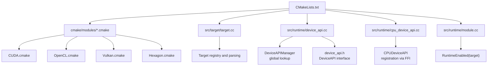
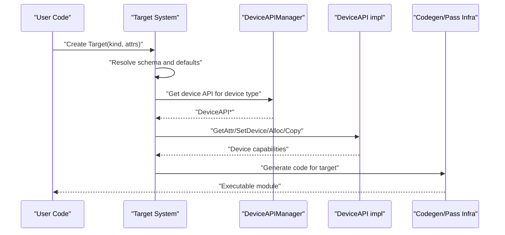
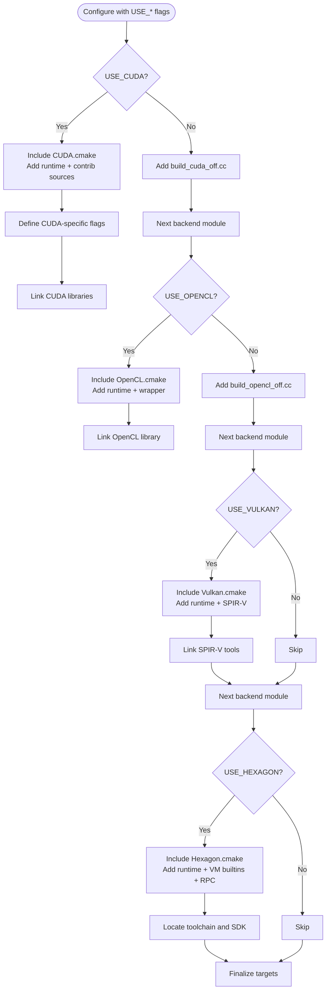
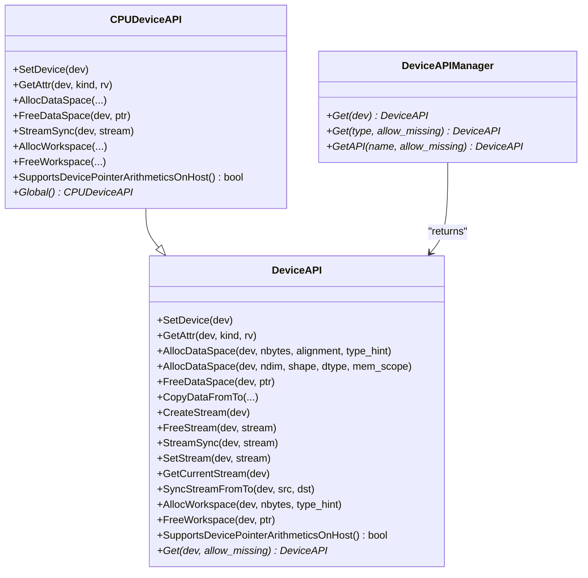
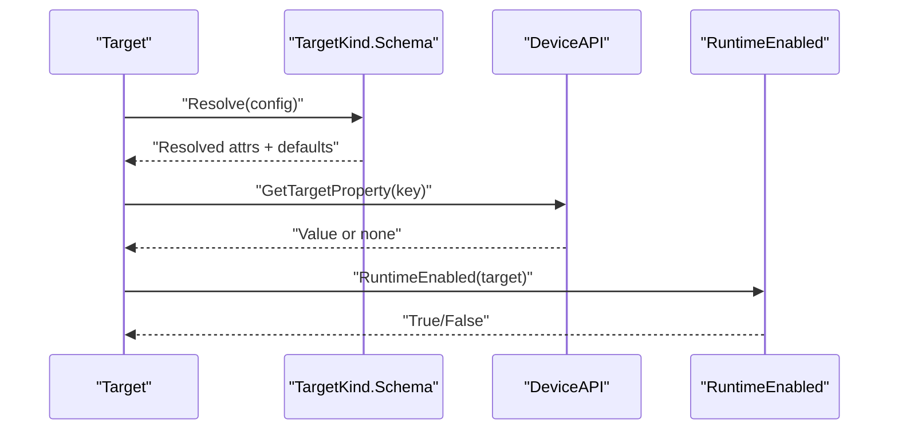
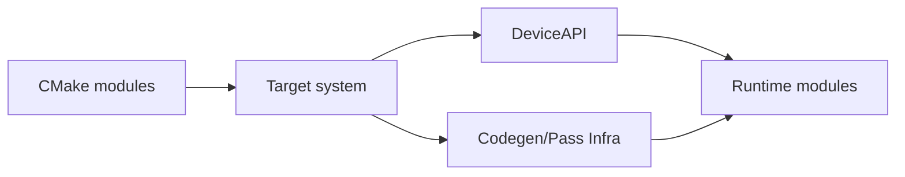

# Backend Integration and Customization

<cite>
**Referenced Files in This Document**
- [CMakeLists.txt](file://CMakeLists.txt)
- [CUDA.cmake](file://cmake/modules/CUDA.cmake)
- [OpenCL.cmake](file://cmake/modules/OpenCL.cmake)
- [Vulkan.cmake](file://cmake/modules/Vulkan.cmake)
- [Hexagon.cmake](file://cmake/modules/Hexagon.cmake)
- [device_api.h](file://include/tvm/runtime/device_api.h)
- [device_api.cc](file://src/runtime/device_api.cc)
- [cpu_device_api.cc](file://src/runtime/cpu_device_api.cc)
- [module.cc](file://src/runtime/module.cc)
- [target.cc](file://src/target/target.cc)
- [pass_infra.rst](file://docs/arch/pass_infra.rst)
</cite>

## Table of Contents
1. [Introduction](#introduction)
2. [Project Structure](#project-structure)
3. [Core Components](#core-components)
4. [Architecture Overview](#architecture-overview)
5. [Detailed Component Analysis](#detailed-component-analysis)
6. [Dependency Analysis](#dependency-analysis)
7. [Performance Considerations](#performance-considerations)
8. [Troubleshooting Guide](#troubleshooting-guide)
9. [Conclusion](#conclusion)
10. [Appendices](#appendices)

## Introduction
This document explains how to integrate new hardware backends into TVM. It covers the backend registration model, the code generation and pass infrastructure, runtime integration, CMake module configuration, device API implementation, and testing/benchmarking practices. It also provides step-by-step recipes for creating custom backends, modifying existing ones, and extending capabilities safely.

## Project Structure
At a high level, TVM’s backend integration spans:
- CMake modules that conditionally include runtime and codegen sources for specific devices.
- A device abstraction layer that exposes a uniform API for memory, streams, and attributes.
- A target system that encodes device selection and configuration.
- Pass infrastructure that orchestrates transformations and optimizations.

**Diagram sources**
- [CMakeLists.txt:1-800](file://CMakeLists.txt#L1-L800)
- [CUDA.cmake:1-143](file://cmake/modules/CUDA.cmake#L1-L143)
- [OpenCL.cmake:1-86](file://cmake/modules/OpenCL.cmake#L1-L86)
- [Vulkan.cmake:1-39](file://cmake/modules/Vulkan.cmake#L1-L39)
- [Hexagon.cmake:1-344](file://cmake/modules/Hexagon.cmake#L1-L344)
- [target.cc:1-497](file://src/target/target.cc#L1-L497)
- [device_api.h:1-411](file://include/tvm/runtime/device_api.h#L1-L411)
- [device_api.cc:1-99](file://src/runtime/device_api.cc#L1-L99)
- [cpu_device_api.cc:1-167](file://src/runtime/cpu_device_api.cc#L1-L167)
- [module.cc:30-69](file://src/runtime/module.cc#L30-L69)

**Section sources**
- [CMakeLists.txt:1-800](file://CMakeLists.txt#L1-L800)
- [target.cc:1-497](file://src/target/target.cc#L1-L497)

## Core Components
- Device API abstraction: Defines the contract for device memory, streams, attributes, and workspace management. See [device_api.h:128-310](file://include/tvm/runtime/device_api.h#L128-L310).
- Device API manager: Provides global lookup of device implementations by device type or name. See [device_api.cc:49-95](file://src/runtime/device_api.cc#L49-L95).
- CPU device implementation: Demonstrates registration via FFI and implements a minimal device API. See [cpu_device_api.cc:158-164](file://src/runtime/cpu_device_api.cc#L158-L164).
- Target system: Parses target strings and configurations, resolves device kinds and attributes, and supports device property queries. See [target.cc:254-423](file://src/target/target.cc#L254-L423).
- Runtime availability: Determines whether a given target’s runtime is enabled at build time. See [module.cc:38-69](file://src/runtime/module.cc#L38-L69).

**Section sources**
- [device_api.h:128-310](file://include/tvm/runtime/device_api.h#L128-L310)
- [device_api.cc:49-95](file://src/runtime/device_api.cc#L49-L95)
- [cpu_device_api.cc:158-164](file://src/runtime/cpu_device_api.cc#L158-L164)
- [target.cc:254-423](file://src/target/target.cc#L254-L423)
- [module.cc:38-69](file://src/runtime/module.cc#L38-L69)

## Architecture Overview
The backend integration pipeline connects user-specified targets to device-specific runtime and codegen components through CMake modules and the device API.

**Diagram sources**
- [target.cc:254-423](file://src/target/target.cc#L254-L423)
- [device_api.cc:49-95](file://src/runtime/device_api.cc#L49-L95)
- [device_api.h:128-310](file://include/tvm/runtime/device_api.h#L128-L310)

## Detailed Component Analysis

### CMake Backend Modules and Build Configuration
TVM uses a modular CMake system to include device-specific runtime and codegen sources. Each module:
- Detects presence of SDK/toolchains.
- Adds device runtime sources to the runtime object library.
- Links required libraries.
- Defines preprocessor flags for device features.

Key modules:
- CUDA: Adds CUDA runtime sources, cuDNN/cuBLAS contributions, Thrust, cuRAND, and NVTX support. See [CUDA.cmake:27-143](file://cmake/modules/CUDA.cmake#L27-L143).
- OpenCL: Adds OpenCL runtime sources and optional wrapper discovery. See [OpenCL.cmake:18-86](file://cmake/modules/OpenCL.cmake#L18-L86).
- Vulkan: Adds Vulkan runtime and SPIR-V codegen sources and links SPIRV tools. See [Vulkan.cmake:21-39](file://cmake/modules/Vulkan.cmake#L21-L39).
- Hexagon: Adds Hexagon runtime, VM builtins, RPC skeleton/server, and external libraries. See [Hexagon.cmake:123-344](file://cmake/modules/Hexagon.cmake#L123-L344).

Build flags and toggles are centralized in the top-level CMake file. See [CMakeLists.txt:29-101](file://CMakeLists.txt#L29-L101).

**Diagram sources**
- [CMakeLists.txt:432-453](file://CMakeLists.txt#L432-L453)
- [CUDA.cmake:27-143](file://cmake/modules/CUDA.cmake#L27-L143)
- [OpenCL.cmake:18-86](file://cmake/modules/OpenCL.cmake#L18-L86)
- [Vulkan.cmake:21-39](file://cmake/modules/Vulkan.cmake#L21-L39)
- [Hexagon.cmake:123-344](file://cmake/modules/Hexagon.cmake#L123-L344)

**Section sources**
- [CMakeLists.txt:29-101](file://CMakeLists.txt#L29-L101)
- [CMakeLists.txt:432-453](file://CMakeLists.txt#L432-L453)
- [CUDA.cmake:27-143](file://cmake/modules/CUDA.cmake#L27-L143)
- [OpenCL.cmake:18-86](file://cmake/modules/OpenCL.cmake#L18-L86)
- [Vulkan.cmake:21-39](file://cmake/modules/Vulkan.cmake#L21-L39)
- [Hexagon.cmake:123-344](file://cmake/modules/Hexagon.cmake#L123-L344)

### Device API Implementation and Registration
Device backends implement the DeviceAPI interface and register themselves globally so the runtime can discover them by device type or name.

Key elements:
- DeviceAPI interface defines methods for device selection, attribute queries, memory/workspace management, and stream operations. See [device_api.h:128-310](file://include/tvm/runtime/device_api.h#L128-L310).
- DeviceAPIManager resolves a DeviceAPI by device type or device name via a global registry keyed by "device_api.<name>". See [device_api.cc:49-95](file://src/runtime/device_api.cc#L49-L95).
- CPUDeviceAPI demonstrates registration via a static initializer that binds the "device_api.cpu" global to a singleton CPU device implementation. See [cpu_device_api.cc:158-164](file://src/runtime/cpu_device_api.cc#L158-L164).

**Diagram sources**
- [device_api.h:128-310](file://include/tvm/runtime/device_api.h#L128-L310)
- [device_api.cc:49-95](file://src/runtime/device_api.cc#L49-L95)
- [cpu_device_api.cc:52-164](file://src/runtime/cpu_device_api.cc#L52-L164)

**Section sources**
- [device_api.h:128-310](file://include/tvm/runtime/device_api.h#L128-L310)
- [device_api.cc:49-95](file://src/runtime/device_api.cc#L49-L95)
- [cpu_device_api.cc:52-164](file://src/runtime/cpu_device_api.cc#L52-L164)

### Target System and Runtime Availability
The Target system parses target strings and configurations, validates them against a kind-specific schema, and can query device properties at runtime. It also determines whether a target’s runtime is enabled.

Highlights:
- Target creation from string/config and schema resolution. See [target.cc:254-423](file://src/target/target.cc#L254-L423).
- Device property query via DeviceAPI.GetTargetProperty. See [target.cc:425-459](file://src/target/target.cc#L425-L459).
- RuntimeEnabled checks target strings against registered runtime factories. See [module.cc:38-69](file://src/runtime/module.cc#L38-L69).

**Diagram sources**
- [target.cc:254-423](file://src/target/target.cc#L254-L423)
- [target.cc:425-459](file://src/target/target.cc#L425-L459)
- [module.cc:38-69](file://src/runtime/module.cc#L38-L69)

**Section sources**
- [target.cc:254-423](file://src/target/target.cc#L254-L423)
- [target.cc:425-459](file://src/target/target.cc#L425-L459)
- [module.cc:38-69](file://src/runtime/module.cc#L38-L69)

### Pass Infrastructure Integration
TVM’s pass infrastructure enables composing and instrumenting transformations. Backends can integrate by:
- Defining passes that operate on IR modules for device-specific lowering.
- Using PassInstrument hooks to profile or log pass execution.
- Leveraging the frontend Python APIs to construct pipelines programmatically.

See [pass_infra.rst:54-456](file://docs/arch/pass_infra.rst#L54-L456) for the design and instrumentation interfaces.

**Section sources**
- [pass_infra.rst:54-456](file://docs/arch/pass_infra.rst#L54-L456)

## Dependency Analysis
The backend integration depends on:
- CMake modules to include device sources and link libraries.
- DeviceAPI to provide runtime services.
- Target system to select and configure devices.
- Pass infrastructure to transform and lower code.

[No sources needed since this diagram shows conceptual relationships]

## Performance Considerations
- Prefer aligned allocations and reuse workspaces to minimize overhead. DeviceAPI defines alignment constants and workspace helpers. See [device_api.h:103-123](file://include/tvm/runtime/device_api.h#L103-L123).
- Use streams for asynchronous transfers and synchronize only when necessary. See [device_api.h:201-247](file://include/tvm/runtime/device_api.h#L201-L247).
- Enable backend-specific optimizations via CMake flags (e.g., cuDNN, cuBLAS, Thrust, NVTX). See [CUDA.cmake:68-135](file://cmake/modules/CUDA.cmake#L68-L135).
- Validate runtime availability to avoid unnecessary fallbacks. See [module.cc:38-69](file://src/runtime/module.cc#L38-L69).

[No sources needed since this section provides general guidance]

## Troubleshooting Guide
Common issues and remedies:
- Device not found: Ensure the device runtime is enabled at build time and the device name matches the registry key. See [device_api.cc:85-94](file://src/runtime/device_api.cc#L85-L94).
- Target runtime disabled: Confirm the target string maps to an enabled runtime factory. See [module.cc:38-69](file://src/runtime/module.cc#L38-L69).
- Property queries fail: Verify the device supports GetTargetProperty and the property key is valid. See [target.cc:425-459](file://src/target/target.cc#L425-L459).
- CMake configuration errors: Check USE_* flags and required SDK paths for the backend module. See [CMakeLists.txt:29-101](file://CMakeLists.txt#L29-L101) and module files.

**Section sources**
- [device_api.cc:85-94](file://src/runtime/device_api.cc#L85-L94)
- [module.cc:38-69](file://src/runtime/module.cc#L38-L69)
- [target.cc:425-459](file://src/target/target.cc#L425-L459)
- [CMakeLists.txt:29-101](file://CMakeLists.txt#L29-L101)

## Conclusion
Integrating a new backend into TVM requires:
- Adding a CMake module to include device sources and link libraries.
- Implementing a DeviceAPI subclass and registering it under the appropriate device_api.<name> key.
- Ensuring the Target system can resolve the backend kind and query device properties.
- Optionally leveraging pass infrastructure for device-specific lowering and instrumentation.
Testing and benchmarking should validate correctness, performance, and runtime availability across configurations.

[No sources needed since this section summarizes without analyzing specific files]

## Appendices

### Step-by-Step: Creating a Custom Backend
- Define a new CMake module under cmake/modules/<YourBackend>.cmake that:
  - Detects SDK/toolchain and sets include/link flags.
  - Adds runtime sources to RUNTIME_SRCS and codegen sources to COMPILER_SRCS.
  - Links required libraries and defines backend-specific flags.
  - Include the module in the main CMakeLists.txt include list near other backends.
- Implement a DeviceAPI subclass in src/runtime/<backend>_device_api.cc:
  - Implement SetDevice, GetAttr, AllocDataSpace, FreeDataSpace, CopyDataFromTo, stream APIs, AllocWorkspace, FreeWorkspace.
  - Register a global factory under "device_api.<your_backend>" via a static initializer similar to CPUDeviceAPI.
- Extend the Target kind:
  - Add a TargetKind and schema for your backend in the target registry and schema.
  - Ensure the kind’s default_device_type and default keys are set appropriately.
- Validate:
  - Build with USE_<YOUR_BACKEND>=ON and confirm runtime availability.
  - Test target parsing and device property queries.
  - Run backend-specific unit tests if available.

**Section sources**
- [CMakeLists.txt:432-453](file://CMakeLists.txt#L432-L453)
- [CUDA.cmake:27-143](file://cmake/modules/CUDA.cmake#L27-L143)
- [OpenCL.cmake:18-86](file://cmake/modules/OpenCL.cmake#L18-L86)
- [Vulkan.cmake:21-39](file://cmake/modules/Vulkan.cmake#L21-L39)
- [Hexagon.cmake:123-344](file://cmake/modules/Hexagon.cmake#L123-L344)
- [cpu_device_api.cc:158-164](file://src/runtime/cpu_device_api.cc#L158-L164)
- [device_api.h:128-310](file://include/tvm/runtime/device_api.h#L128-L310)
- [target.cc:254-423](file://src/target/target.cc#L254-L423)

### Step-by-Step: Modifying an Existing Backend
- Adjust the CMake module to toggle optional components (e.g., add/remove contrib libraries).
- Update DeviceAPI methods to expose new device capabilities or improve memory/stream handling.
- Extend Target kind schema to support new attributes and validate them during creation.
- Add pass infrastructure steps if the backend needs specialized lowering.

**Section sources**
- [CUDA.cmake:68-135](file://cmake/modules/CUDA.cmake#L68-L135)
- [device_api.h:128-310](file://include/tvm/runtime/device_api.h#L128-L310)
- [target.cc:254-423](file://src/target/target.cc#L254-L423)

### Backend Testing Strategies
- Unit tests: Use CMake’s test discovery and add tests under tests/cpp-runtime/<backend> when applicable.
- Integration tests: Build with USE_<BACKEND>=ON and run end-to-end pipelines.
- RuntimeEnabled checks: Validate that RuntimeEnabled(target) returns true for your backend.
- Property queries: Confirm DeviceAPI.GetTargetProperty returns expected values for your backend.

**Section sources**
- [module.cc:38-69](file://src/runtime/module.cc#L38-L69)
- [OpenCL.cmake:38-67](file://cmake/modules/OpenCL.cmake#L38-L67)
- [Hexagon.cmake:144-154](file://cmake/modules/Hexagon.cmake#L144-L154)

### Performance Benchmarking and Debugging Techniques
- Benchmarking: Use TVM’s profiling and timing utilities to compare kernels and memory transfers across backends.
- Debugging: Enable pass instrumentation and logging to inspect transformations and runtime behavior.
- Validation: Compare outputs against reference CPU implementations and assert numerical tolerances.

**Section sources**
- [pass_infra.rst:54-456](file://docs/arch/pass_infra.rst#L54-L456)