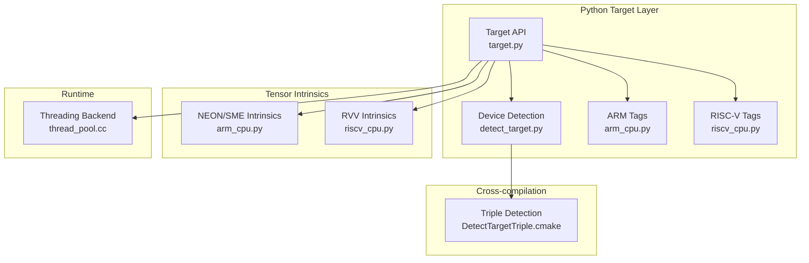
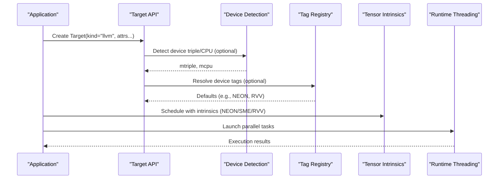
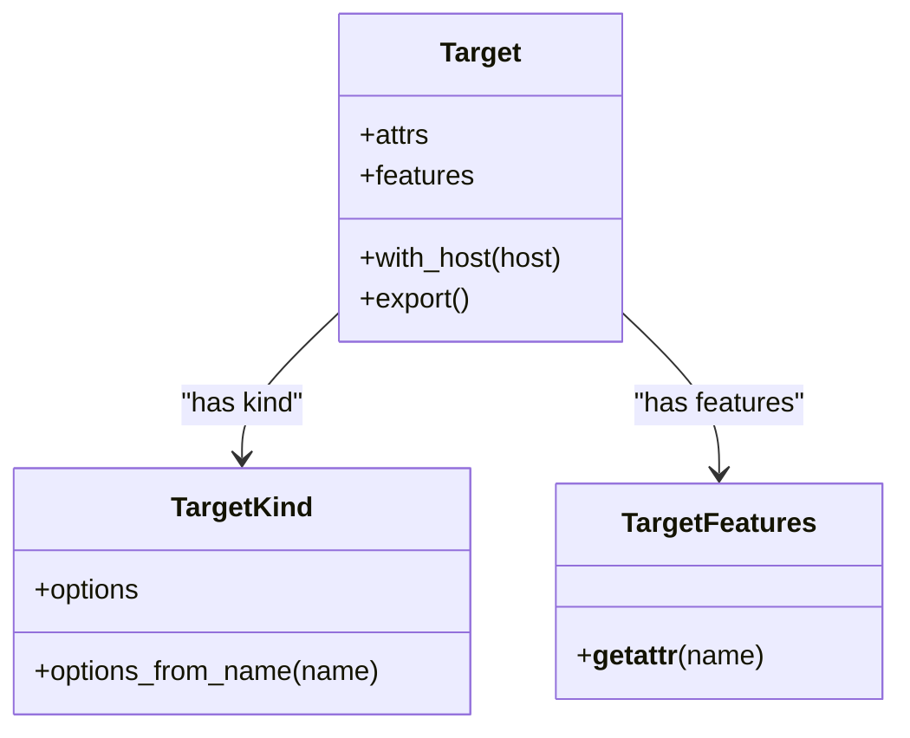
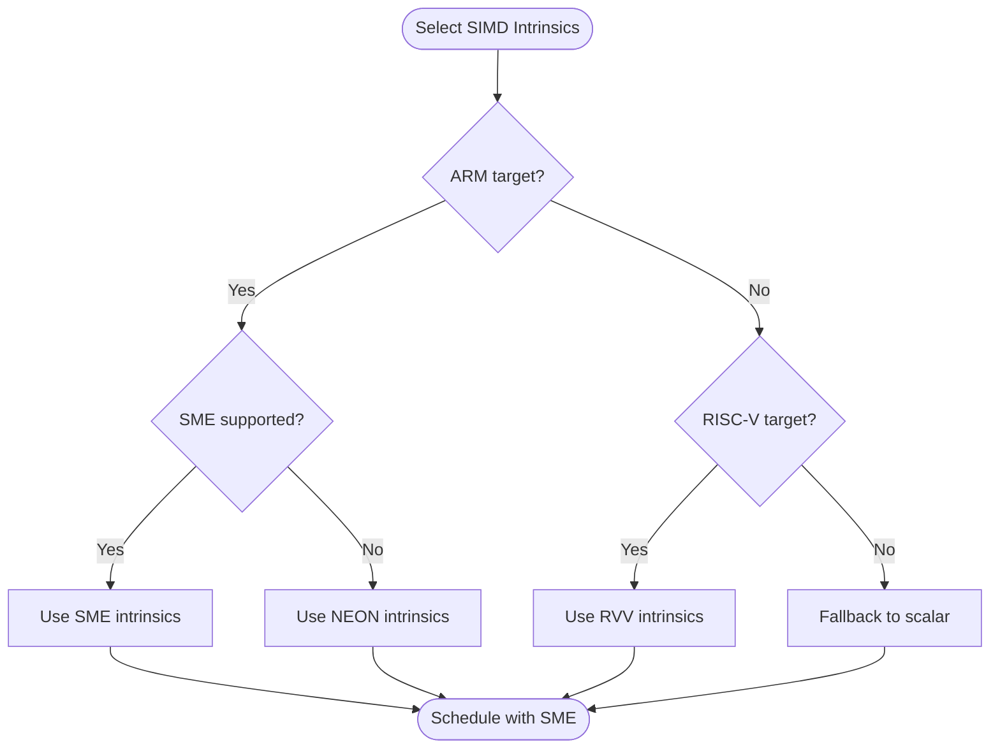
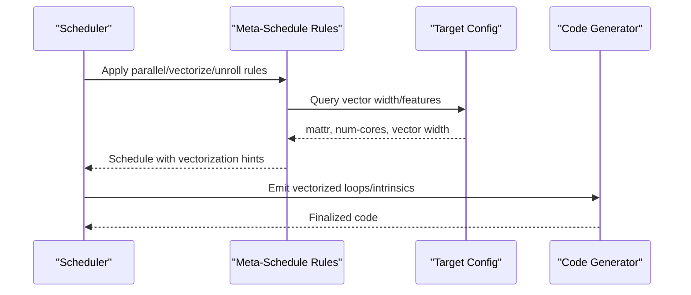
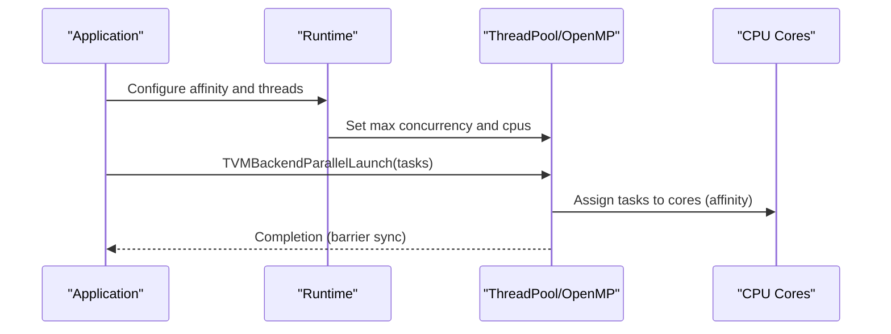
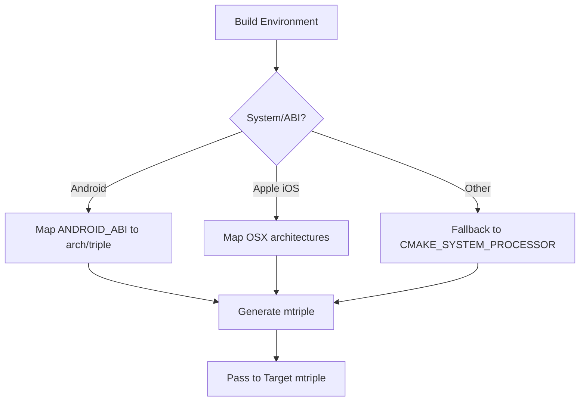
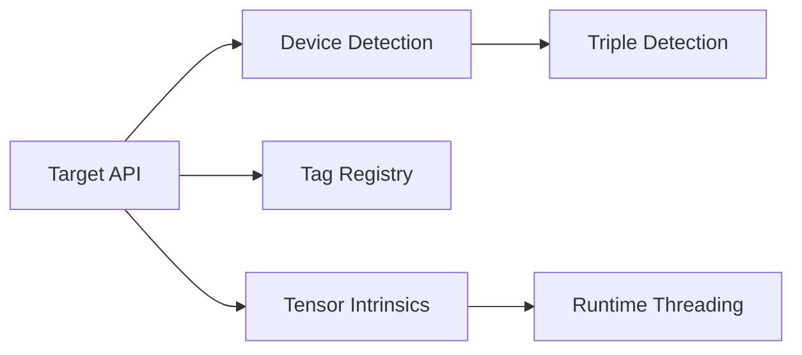

# CPU Backends

<cite>
**Referenced Files in This Document**
- [target.py](file://python/tvm/target/target.py)
- [detect_target.py](file://python/tvm/target/detect_target.py)
- [arm_cpu.py](file://python/tvm/target/tag_registry/arm_cpu.py)
- [riscv_cpu.py](file://python/tvm/target/tag_registry/riscv_cpu.py)
- [arm_cpu.py](file://python/tvm/s_tir/tensor_intrin/arm_cpu.py)
- [riscv_cpu.py](file://python/tvm/s_tir/tensor_intrin/riscv_cpu.py)
- [thread_pool.cc](file://src/runtime/thread_pool.cc)
- [threading_backend_test.cc](file://tests/cpp/threading_backend_test.cc)
- [DetectTargetTriple.cmake](file://3rdparty/tvm-ffi/cmake/Utils/DetectTargetTriple.cmake)
- [test_target_codegen_llvm.py](file://tests/python/codegen/test_target_codegen_llvm.py)
- [test_target_codegen_aarch64.py](file://tests/python/codegen/test_target_codegen_aarch64.py)
- [test_target_codegen_arm.py](file://tests/python/codegen/test_target_codegen_arm.py)
- [test_meta_schedule_post_order_apply.py](file://tests/python/s_tir/meta_schedule/test_meta_schedule_post_order_apply.py)
</cite>

## Table of Contents
1. [Introduction](#introduction)
2. [Project Structure](#project-structure)
3. [Core Components](#core-components)
4. [Architecture Overview](#architecture-overview)
5. [Detailed Component Analysis](#detailed-component-analysis)
6. [Dependency Analysis](#dependency-analysis)
7. [Performance Considerations](#performance-considerations)
8. [Troubleshooting Guide](#troubleshooting-guide)
9. [Conclusion](#conclusion)

## Introduction
This document explains TVM’s CPU backend implementations across major architectures and vector instruction sets. It covers CPU target specification, SIMD optimizations (NEON on ARM/ARM64 and RVV on RISC-V), vectorization strategies, multi-threading support, backend registration, capability detection, and performance tuning. Cross-compilation workflows, OpenMP integration, and CPU-specific tuning parameters are included, along with limitations, debugging approaches, and profiling methods.

## Project Structure
The CPU backend spans Python APIs for target configuration and tensor intrinsics, C++ runtime threading, and CMake utilities for cross-compilation triple generation. Key areas:
- Target definition and detection: Python target API and device auto-detection
- Tag registry for ARM and RISC-V CPU targets
- Tensor intrinsics for NEON and SME (ARM) and RVV (RISC-V)
- Threading backend and OpenMP integration
- Cross-compilation triple detection
- Tests validating target codegen and intrinsics selection

**Diagram sources**
- [target.py:1-233](file://python/tvm/target/target.py#L1-L233)
- [detect_target.py:1-148](file://python/tvm/target/detect_target.py#L1-L148)
- [arm_cpu.py:1-117](file://python/tvm/target/tag_registry/arm_cpu.py#L1-L117)
- [riscv_cpu.py:1-74](file://python/tvm/target/tag_registry/riscv_cpu.py#L1-L74)
- [arm_cpu.py:1-778](file://python/tvm/s_tir/tensor_intrin/arm_cpu.py#L1-L778)
- [riscv_cpu.py:1-242](file://python/tvm/s_tir/tensor_intrin/riscv_cpu.py#L1-L242)
- [thread_pool.cc:1-529](file://src/runtime/thread_pool.cc#L1-L529)
- [DetectTargetTriple.cmake:81-268](file://3rdparty/tvm-ffi/cmake/Utils/DetectTargetTriple.cmake#L81-L268)

**Section sources**
- [target.py:1-233](file://python/tvm/target/target.py#L1-L233)
- [detect_target.py:1-148](file://python/tvm/target/detect_target.py#L1-L148)
- [arm_cpu.py:1-117](file://python/tvm/target/tag_registry/arm_cpu.py#L1-L117)
- [riscv_cpu.py:1-74](file://python/tvm/target/tag_registry/riscv_cpu.py#L1-L74)
- [arm_cpu.py:1-778](file://python/tvm/s_tir/tensor_intrin/arm_cpu.py#L1-L778)
- [riscv_cpu.py:1-242](file://python/tvm/s_tir/tensor_intrin/riscv_cpu.py#L1-L242)
- [thread_pool.cc:1-529](file://src/runtime/thread_pool.cc#L1-L529)
- [DetectTargetTriple.cmake:81-268](file://3rdparty/tvm-ffi/cmake/Utils/DetectTargetTriple.cmake#L81-L268)

## Core Components
- Target specification: CPU targets are configured via a “kind” set to “llvm”, with optional “mtriple”, “mcpu”, “mattr”, and “num-cores”. Host/target separation is supported for cross-compilation scenarios.
- Device detection: Auto-detection for CPU devices infers the default target triple and host CPU name.
- Tag registry: Predefined tags for ARM and RISC-V devices encapsulate architecture-specific defaults (e.g., NEON on ARM, RVV on RISC-V).
- SIMD intrinsics: NEON and SME intrinsics for ARM; RVV intrinsics for RISC-V vector dot products and reductions.
- Multi-threading: Runtime threading backend integrates with OpenMP when enabled, with CPU affinity configuration and parallel launch primitives.

**Section sources**
- [target.py:78-159](file://python/tvm/target/target.py#L78-L159)
- [detect_target.py:92-106](file://python/tvm/target/detect_target.py#L92-L106)
- [arm_cpu.py:42-117](file://python/tvm/target/tag_registry/arm_cpu.py#L42-L117)
- [riscv_cpu.py:22-74](file://python/tvm/target/tag_registry/riscv_cpu.py#L22-L74)
- [arm_cpu.py:111-163](file://python/tvm/s_tir/tensor_intrin/arm_cpu.py#L111-L163)
- [riscv_cpu.py:174-242](file://python/tvm/s_tir/tensor_intrin/riscv_cpu.py#L174-L242)
- [thread_pool.cc:470-509](file://src/runtime/thread_pool.cc#L470-L509)

## Architecture Overview
The CPU backend pipeline:
- Application defines a Target (CPU) with desired features.
- Device detection or explicit configuration supplies triple and CPU name.
- Tag registry provides architecture defaults.
- Tensor intrinsics are selected based on target capabilities (NEON/SME for ARM; RVV for RISC-V).
- Runtime executes with threading backend and optional OpenMP.

**Diagram sources**
- [target.py:78-159](file://python/tvm/target/target.py#L78-L159)
- [detect_target.py:92-106](file://python/tvm/target/detect_target.py#L92-L106)
- [arm_cpu.py:42-117](file://python/tvm/target/tag_registry/arm_cpu.py#L42-L117)
- [riscv_cpu.py:22-74](file://python/tvm/target/tag_registry/riscv_cpu.py#L22-L74)
- [arm_cpu.py:111-163](file://python/tvm/s_tir/tensor_intrin/arm_cpu.py#L111-L163)
- [riscv_cpu.py:174-242](file://python/tvm/s_tir/tensor_intrin/riscv_cpu.py#L174-L242)
- [thread_pool.cc:470-509](file://src/runtime/thread_pool.cc#L470-L509)

## Detailed Component Analysis

### CPU Target Specification and Registration
- Target construction accepts a dictionary with keys for kind, device, keys, libs, system-lib, mcpu, model, runtime, mtriple, mattr, mfloat-abi, mabi, and host.
- Device auto-detection for CPU infers the default target triple and host CPU name via global functions.
- Tag registry defines device-specific defaults for ARM and RISC-V, including mtriple, mcpu, and mattr lists.

**Diagram sources**
- [target.py:52-233](file://python/tvm/target/target.py#L52-L233)

**Section sources**
- [target.py:78-159](file://python/tvm/target/target.py#L78-L159)
- [detect_target.py:92-106](file://python/tvm/target/detect_target.py#L92-L106)
- [arm_cpu.py:42-117](file://python/tvm/target/tag_registry/arm_cpu.py#L42-L117)
- [riscv_cpu.py:22-74](file://python/tvm/target/tag_registry/riscv_cpu.py#L22-L74)

### SIMD Optimizations: NEON, SME (ARM), and RVV (RISC-V)
- ARM NEON: Intrinsics define 4x4 dot products for int8 and uint8 with NEON, including sdot/udot variants for ARMv8.2a+.
- ARM SME: Scalable Matrix Extension intrinsics include transpose-interleave and interleaved GEMM using outer-product-with-accumulate (mopa).
- RISC-V RVV: Vector dot product intrinsics register templates for multiple data/weight/output type combinations, leveraging vector extension features.

**Diagram sources**
- [arm_cpu.py:111-163](file://python/tvm/s_tir/tensor_intrin/arm_cpu.py#L111-L163)
- [arm_cpu.py:217-342](file://python/tvm/s_tir/tensor_intrin/arm_cpu.py#L217-L342)
- [riscv_cpu.py:174-242](file://python/tvm/s_tir/tensor_intrin/riscv_cpu.py#L174-L242)

**Section sources**
- [arm_cpu.py:111-163](file://python/tvm/s_tir/tensor_intrin/arm_cpu.py#L111-L163)
- [arm_cpu.py:217-342](file://python/tvm/s_tir/tensor_intrin/arm_cpu.py#L217-L342)
- [arm_cpu.py:751-778](file://python/tvm/s_tir/tensor_intrin/arm_cpu.py#L751-L778)
- [riscv_cpu.py:174-242](file://python/tvm/s_tir/tensor_intrin/riscv_cpu.py#L174-L242)

### Vectorization Strategies and Meta-Schedule Integration
- Vectorization strategies are applied during scheduling and code generation. Tests demonstrate target-aware selection of tensor intrinsics (e.g., NEON, SDOT/UDOT) depending on mattr flags.
- Meta-schedule rules and post-processing steps include parallel/vectorize/unroll strategies that interact with CPU vector widths and threading.

**Diagram sources**
- [test_meta_schedule_post_order_apply.py:432-474](file://tests/python/s_tir/meta_schedule/test_meta_schedule_post_order_apply.py#L432-L474)

**Section sources**
- [test_meta_schedule_post_order_apply.py:432-474](file://tests/python/s_tir/meta_schedule/test_meta_schedule_post_order_apply.py#L432-L474)

### Multi-threading Support and OpenMP Integration
- Runtime threading backend supports configuring CPU affinity and parallel execution. When OpenMP is enabled, thread pools delegate to OpenMP primitives; otherwise, a native thread pool is used.
- Tests validate parallel launch, barrier synchronization, and CPU affinity configuration.

**Diagram sources**
- [thread_pool.cc:470-509](file://src/runtime/thread_pool.cc#L470-L509)
- [threading_backend_test.cc:120-194](file://tests/cpp/threading_backend_test.cc#L120-L194)

**Section sources**
- [thread_pool.cc:411-459](file://src/runtime/thread_pool.cc#L411-L459)
- [thread_pool.cc:470-509](file://src/runtime/thread_pool.cc#L470-L509)
- [threading_backend_test.cc:120-194](file://tests/cpp/threading_backend_test.cc#L120-L194)

### Cross-compilation for Different CPU Architectures
- Triple detection resolves canonical triples for Android and generic platforms, mapping common processor names to standard triple forms.
- Tests validate code generation for x86_64, ARM, and AArch64 targets.

**Diagram sources**
- [DetectTargetTriple.cmake:81-268](file://3rdparty/tvm-ffi/cmake/Utils/DetectTargetTriple.cmake#L81-L268)
- [test_target_codegen_llvm.py:1-200](file://tests/python/codegen/test_target_codegen_llvm.py)
- [test_target_codegen_arm.py:1-200](file://tests/python/codegen/test_target_codegen_arm.py)
- [test_target_codegen_aarch64.py:1-200](file://tests/python/codegen/test_target_codegen_aarch64.py)

**Section sources**
- [DetectTargetTriple.cmake:81-268](file://3rdparty/tvm-ffi/cmake/Utils/DetectTargetTriple.cmake#L81-L268)
- [test_target_codegen_llvm.py:1-200](file://tests/python/codegen/test_target_codegen_llvm.py)
- [test_target_codegen_arm.py:1-200](file://tests/python/codegen/test_target_codegen_arm.py)
- [test_target_codegen_aarch64.py:1-200](file://tests/python/codegen/test_target_codegen_aarch64.py)

## Dependency Analysis
- Target API depends on device detection and tag registry for defaults.
- Tensor intrinsics depend on target capabilities (e.g., NEON/SME flags, RVV presence).
- Runtime threading backend integrates with OpenMP when enabled and coordinates with parallel launch primitives.
- Cross-compilation relies on CMake utilities to derive target triples.

**Diagram sources**
- [target.py:78-159](file://python/tvm/target/target.py#L78-L159)
- [detect_target.py:92-106](file://python/tvm/target/detect_target.py#L92-L106)
- [arm_cpu.py:42-117](file://python/tvm/target/tag_registry/arm_cpu.py#L42-L117)
- [riscv_cpu.py:22-74](file://python/tvm/target/tag_registry/riscv_cpu.py#L22-L74)
- [arm_cpu.py:111-163](file://python/tvm/s_tir/tensor_intrin/arm_cpu.py#L111-L163)
- [riscv_cpu.py:174-242](file://python/tvm/s_tir/tensor_intrin/riscv_cpu.py#L174-L242)
- [thread_pool.cc:470-509](file://src/runtime/thread_pool.cc#L470-L509)
- [DetectTargetTriple.cmake:81-268](file://3rdparty/tvm-ffi/cmake/Utils/DetectTargetTriple.cmake#L81-L268)

**Section sources**
- [target.py:78-159](file://python/tvm/target/target.py#L78-L159)
- [detect_target.py:92-106](file://python/tvm/target/detect_target.py#L92-L106)
- [arm_cpu.py:42-117](file://python/tvm/target/tag_registry/arm_cpu.py#L42-L117)
- [riscv_cpu.py:22-74](file://python/tvm/target/tag_registry/riscv_cpu.py#L22-L74)
- [arm_cpu.py:111-163](file://python/tvm/s_tir/tensor_intrin/arm_cpu.py#L111-L163)
- [riscv_cpu.py:174-242](file://python/tvm/s_tir/tensor_intrin/riscv_cpu.py#L174-L242)
- [thread_pool.cc:470-509](file://src/runtime/thread_pool.cc#L470-L509)
- [DetectTargetTriple.cmake:81-268](file://3rdparty/tvm-ffi/cmake/Utils/DetectTargetTriple.cmake#L81-L268)

## Performance Considerations
- Vectorization: Prefer NEON/SME on ARM and RVV on RISC-V when available; ensure mattr reflects hardware capabilities to enable intrinsics.
- Parallelism: Tune num-cores and thread affinity to avoid oversubscription; leverage OpenMP when appropriate for heterogeneous workloads.
- Memory: Align data to vector register boundaries; use vectorized loads/stores to reduce overhead.
- Intrinsics: Select the most efficient intrinsic for the data type and reduction pattern (e.g., dot product vs. wider accumulators).
- Cross-compilation: Match mtriple and mcpu to the deployment platform to avoid runtime feature checks and fallbacks.

[No sources needed since this section provides general guidance]

## Troubleshooting Guide
- Target mismatch: Verify mtriple and mcpu match the deployment environment; use device detection or explicit configuration.
- Missing intrinsics: Ensure mattr includes NEON/SME or RVV; confirm LLVM version compatibility for SME intrinsics.
- Threading issues: Validate CPU affinity configuration and thread count; test with single-threaded runs to isolate contention.
- Cross-compilation: Confirm the CMake triple mapping aligns with the target ABI and API level.

**Section sources**
- [detect_target.py:92-106](file://python/tvm/target/detect_target.py#L92-L106)
- [arm_cpu.py:772-778](file://python/tvm/s_tir/tensor_intrin/arm_cpu.py#L772-L778)
- [threading_backend_test.cc:120-194](file://tests/cpp/threading_backend_test.cc#L120-L194)
- [DetectTargetTriple.cmake:81-268](file://3rdparty/tvm-ffi/cmake/Utils/DetectTargetTriple.cmake#L81-L268)

## Conclusion
TVM’s CPU backends provide robust configuration and optimization across x86/x64, ARM/ARM64, and RISC-V. Targets are specified via the Target API with optional device detection and tag defaults. SIMD intrinsics (NEON/SME on ARM; RVV on RISC-V) enable high-performance vectorization. Multi-threading integrates with OpenMP and a native thread pool, while CMake utilities facilitate cross-compilation. Proper tuning of mattr, vectorization strategies, and threading configuration yields significant performance gains.