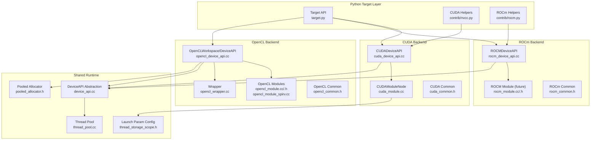
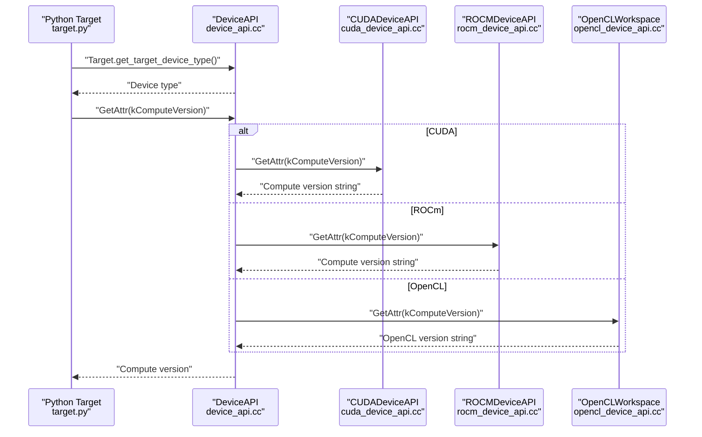
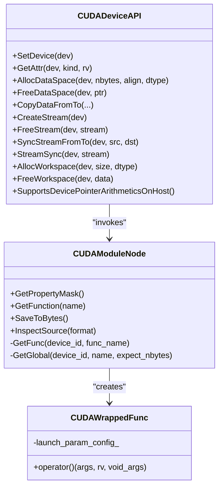
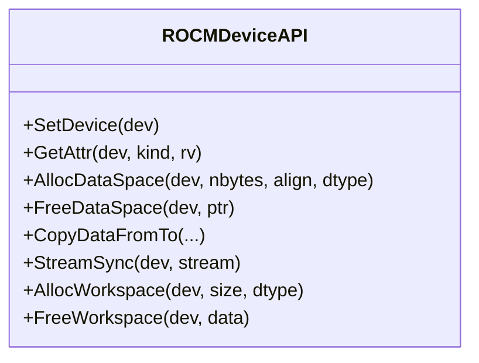
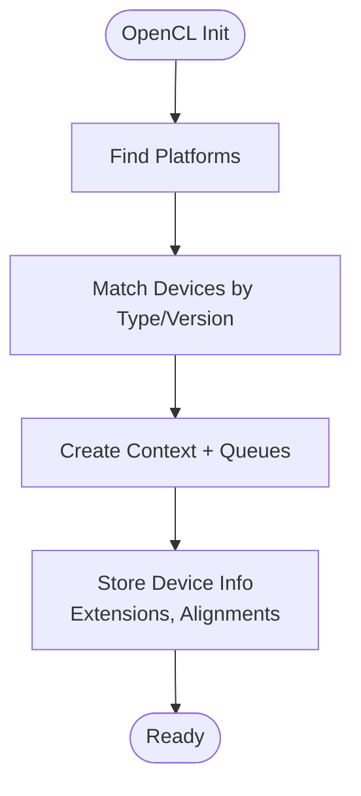
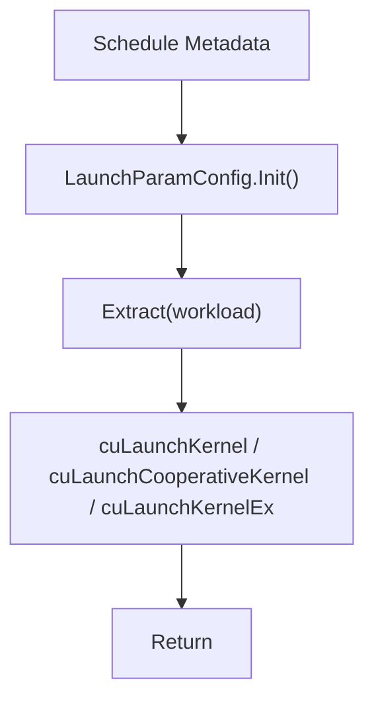
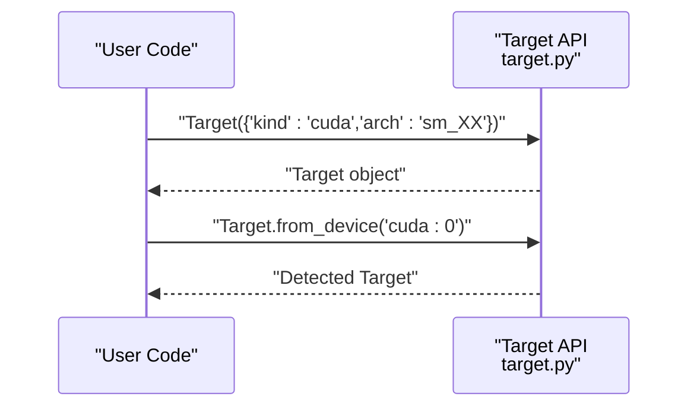
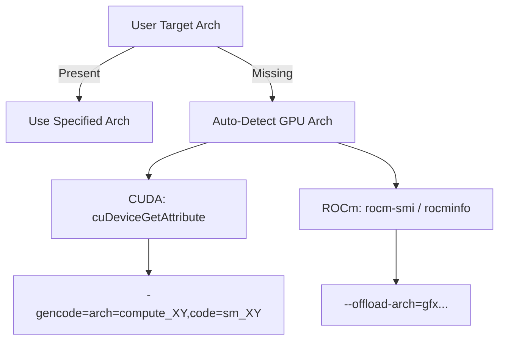
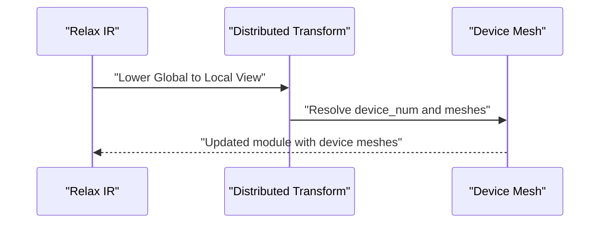
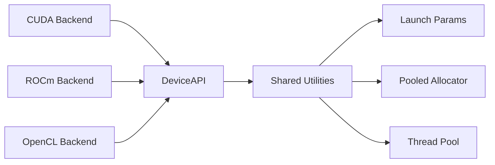

# GPU Backends

<cite>
**Referenced Files in This Document**
- [cuda_device_api.cc](file://src/runtime/cuda/cuda_device_api.cc)
- [cuda_module.cc](file://src/runtime/cuda/cuda_module.cc)
- [rocm_device_api.cc](file://src/runtime/rocm/rocm_device_api.cc)
- [opencl_device_api.cc](file://src/runtime/opencl/opencl_device_api.cc)
- [thread_storage_scope.h](file://src/runtime/thread_storage_scope.h)
- [device_api.cc](file://src/runtime/device_api.cc)
- [target.py](file://python/tvm/target/target.py)
- [nvcc.py](file://python/tvm/contrib/nvcc.py)
- [rocm.py](file://python/tvm/contrib/rocm.py)
- [nvrtc.py](file://3rdparty/tvm-ffi/python/tvm_ffi/cpp/nvrtc.py)
- [nvrtc extension](file://3rdparty/tvm-ffi/python/tvm_ffi/cpp/extension.py)
- [device_target_interactions.rst](file://docs/arch/device_target_interactions.rst)
- [opencl_wrapper.cc](file://src/runtime/opencl/opencl_wrapper/opencl_wrapper.cc)
- [opencl_module.cc](file://src/runtime/opencl/opencl_module.cc)
- [opencl_module.h](file://src/runtime/opencl/opencl_module.h)
- [opencl_module_spirv.cc](file://src/runtime/opencl/opencl_module_spirv.cc)
- [cuda_common.h](file://src/runtime/cuda/cuda_common.h)
- [rocm_common.h](file://src/runtime/rocm/rocm_common.h)
- [opencl_common.h](file://src/runtime/opencl/opencl_common.h)
- [pooled_allocator.h](file://src/runtime/memory/pooled_allocator.h)
- [thread_pool.cc](file://src/runtime/thread_pool.cc)
- [test_distributed_transform_lower_global_to_local_view.py](file://tests/python/relax/distributed/test_distributed_transform_lower_global_to_local_view.py)
</cite>

## Table of Contents
1. [Introduction](#introduction)
2. [Project Structure](#project-structure)
3. [Core Components](#core-components)
4. [Architecture Overview](#architecture-overview)
5. [Detailed Component Analysis](#detailed-component-analysis)
6. [Dependency Analysis](#dependency-analysis)
7. [Performance Considerations](#performance-considerations)
8. [Troubleshooting Guide](#troubleshooting-guide)
9. [Conclusion](#conclusion)
10. [Appendices](#appendices)

## Introduction
This document explains TVM’s GPU backend ecosystem across CUDA, ROCm/HIP, and OpenCL. It covers GPU target configuration, memory management, kernel launch parameters, compute capability detection, backend capabilities, optimization strategies, hardware-specific features, cross-compilation, performance tuning, limitations, debugging, profiling, and multi-GPU/distributed execution patterns. The goal is to help users configure, deploy, and optimize GPU workloads reliably across NVIDIA, AMD, and heterogeneous OpenCL environments.

## Project Structure
TVM organizes GPU backends under runtime modules for each vendor, with shared abstractions for device attributes, streams, timers, and memory management. The Python target layer provides declarative configuration and detection helpers for GPU backends.

**Diagram sources**
- [target.py:1-233](file://python/tvm/target/target.py#L1-L233)
- [cuda_device_api.cc:1-591](file://src/runtime/cuda/cuda_device_api.cc#L1-L591)
- [cuda_module.cc:1-348](file://src/runtime/cuda/cuda_module.cc#L1-L348)
- [rocm_device_api.cc:1-311](file://src/runtime/rocm/rocm_device_api.cc#L1-L311)
- [opencl_device_api.cc:1-913](file://src/runtime/opencl/opencl_device_api.cc#L1-L913)
- [opencl_module.cc:1-200](file://src/runtime/opencl/opencl_module.cc#L1-L200)
- [opencl_module.h:1-200](file://src/runtime/opencl/opencl_module.h#L1-L200)
- [opencl_module_spirv.cc:1-200](file://src/runtime/opencl/opencl_module_spirv.cc#L1-L200)
- [opencl_wrapper.cc:1-200](file://src/runtime/opencl/opencl_wrapper/opencl_wrapper.cc#L1-L200)
- [device_api.cc:97-122](file://src/runtime/device_api.cc#L97-L122)
- [thread_storage_scope.h:222-256](file://src/runtime/thread_storage_scope.h#L222-L256)
- [pooled_allocator.h:1-200](file://src/runtime/memory/pooled_allocator.h#L1-L200)
- [thread_pool.cc:67-111](file://src/runtime/thread_pool.cc#L67-L111)

**Section sources**
- [target.py:1-233](file://python/tvm/target/target.py#L1-L233)
- [cuda_device_api.cc:1-591](file://src/runtime/cuda/cuda_device_api.cc#L1-L591)
- [cuda_module.cc:1-348](file://src/runtime/cuda/cuda_module.cc#L1-L348)
- [rocm_device_api.cc:1-311](file://src/runtime/rocm/rocm_device_api.cc#L1-L311)
- [opencl_device_api.cc:1-913](file://src/runtime/opencl/opencl_device_api.cc#L1-L913)

## Core Components
- Device API abstraction: Provides unified attribute queries, memory allocation, copying, and stream synchronization across backends.
- CUDA backend: Implements device queries, memory management, kernel launch via driver API, timers, and CUDA-specific features.
- ROCm backend: Implements HIP-based device queries, memory management, kernel launch, timers, and ROCm-specific attributes.
- OpenCL backend: Implements OpenCL context/device selection, memory allocation (buffers/images), copying, and command queues.
- Target configuration: Declarative target creation, detection from device, and feature access.
- Kernel launch parameters: Extracted from scheduling metadata and applied to driver launches.

Key responsibilities:
- Attribute queries: device existence, compute capability, warp size, max threads/block, L2 cache size, total/global memory, API/driver versions.
- Memory management: data space vs workspace, pooled allocation for OpenCL, host/device allocations, and alignment constraints.
- Streams and synchronization: per-backend stream creation, synchronization, and inter-stream events.
- Kernel invocation: extracting launch parameters, dynamic shared memory, cooperative launches, and error reporting.

**Section sources**
- [device_api.cc:97-122](file://src/runtime/device_api.cc#L97-L122)
- [cuda_device_api.cc:42-135](file://src/runtime/cuda/cuda_device_api.cc#L42-L135)
- [rocm_device_api.cc:41-148](file://src/runtime/rocm/rocm_device_api.cc#L41-L148)
- [opencl_device_api.cc:137-244](file://src/runtime/opencl/opencl_device_api.cc#L137-L244)
- [thread_storage_scope.h:222-256](file://src/runtime/thread_storage_scope.h#L222-L256)

## Architecture Overview
The GPU backends follow a layered design:
- Python target layer configures targets and detects device capabilities.
- Device API provides a uniform interface for memory, attributes, and streams.
- Vendor-specific modules implement device queries, memory, and kernel launch.
- Shared utilities handle launch parameter extraction, pooled allocation, and thread pools.

**Diagram sources**
- [target.py:216-218](file://python/tvm/target/target.py#L216-L218)
- [cuda_device_api.cc:64-72](file://src/runtime/cuda/cuda_device_api.cc#L64-L72)
- [rocm_device_api.cc:69-78](file://src/runtime/rocm/rocm_device_api.cc#L69-L78)
- [opencl_device_api.cc:172-174](file://src/runtime/opencl/opencl_device_api.cc#L172-L174)

## Detailed Component Analysis

### CUDA Backend
- Device attributes: compute capability, warp size, max threads per block, L2 cache size, total/global memory, API version.
- Memory management: device/host allocations, alignment constraints, freeing with guard against sticky errors, workspace pooling.
- Streams and synchronization: stream creation, destroy, synchronize, event-based synchronization between streams.
- Kernel launch: driver API function retrieval, dynamic shared memory configuration, cooperative launch, and programmatic stream serialization.
- Timers: CUDA events for precise timing.
- CUDA-specific features: cuTensorMap encode wrapper for tiled tensor maps.

**Diagram sources**
- [cuda_device_api.cc:39-274](file://src/runtime/cuda/cuda_device_api.cc#L39-L274)
- [cuda_module.cc:51-308](file://src/runtime/cuda/cuda_module.cc#L51-L308)

**Section sources**
- [cuda_device_api.cc:42-135](file://src/runtime/cuda/cuda_device_api.cc#L42-L135)
- [cuda_device_api.cc:136-180](file://src/runtime/cuda/cuda_device_api.cc#L136-L180)
- [cuda_device_api.cc:223-258](file://src/runtime/cuda/cuda_device_api.cc#L223-L258)
- [cuda_module.cc:176-270](file://src/runtime/cuda/cuda_module.cc#L176-L270)
- [cuda_module.cc:296-308](file://src/runtime/cuda/cuda_module.cc#L296-L308)

### ROCm/HIP Backend
- Device attributes: compute capability, warp size, max threads per block, L2 cache size, total/global memory, GCN arch string.
- Memory management: host/device allocations via HIP, workspace pooling.
- Streams and synchronization: HIP stream operations and synchronization.
- Timers: HIP events for timing.

**Diagram sources**
- [rocm_device_api.cc:38-239](file://src/runtime/rocm/rocm_device_api.cc#L38-L239)

**Section sources**
- [rocm_device_api.cc:41-148](file://src/runtime/rocm/rocm_device_api.cc#L41-L148)
- [rocm_device_api.cc:149-170](file://src/runtime/rocm/rocm_device_api.cc#L149-L170)
- [rocm_device_api.cc:212-223](file://src/runtime/rocm/rocm_device_api.cc#L212-L223)

### OpenCL Backend
- Device selection and initialization: platform/device discovery, context/queue creation, supported extensions and image alignment.
- Memory management: 1D buffers, 2D images with optional backing buffers, texture-like scopes, pooled allocator integration.
- Copies: buffer-to-buffer, buffer-to-image, image-to-buffer, image-to-image, with origin/region calculations.
- Attributes: max threads per block, shared memory, compute version, device name, clock rate, compute units, max thread dimensions, L2 cache size, total/global memory, image pitch alignment.

**Diagram sources**
- [opencl_device_api.cc:673-763](file://src/runtime/opencl/opencl_device_api.cc#L673-L763)

**Section sources**
- [opencl_device_api.cc:137-244](file://src/runtime/opencl/opencl_device_api.cc#L137-L244)
- [opencl_device_api.cc:258-303](file://src/runtime/opencl/opencl_device_api.cc#L258-L303)
- [opencl_device_api.cc:508-586](file://src/runtime/opencl/opencl_device_api.cc#L508-L586)
- [opencl_device_api.cc:765-800](file://src/runtime/opencl/opencl_device_api.cc#L765-L800)

### Kernel Launch Parameters and Scheduling
Launch parameters are derived from scheduling metadata and applied to driver launches. The configuration supports:
- Grid/block dimensions
- Dynamic shared memory
- Programmatic stream serialization
- Cooperative launch

**Diagram sources**
- [thread_storage_scope.h:222-256](file://src/runtime/thread_storage_scope.h#L222-L256)
- [cuda_module.cc:189-255](file://src/runtime/cuda/cuda_module.cc#L189-L255)

**Section sources**
- [thread_storage_scope.h:222-256](file://src/runtime/thread_storage_scope.h#L222-L256)
- [cuda_module.cc:189-255](file://src/runtime/cuda/cuda_module.cc#L189-L255)

### Target Configuration and Detection
- Targets can be configured via dictionaries, tags, or kinds.
- Device detection infers target from a device identifier.
- Feature access exposes target-specific attributes.

**Diagram sources**
- [target.py:52-233](file://python/tvm/target/target.py#L52-L233)

**Section sources**
- [target.py:52-233](file://python/tvm/target/target.py#L52-L233)

### Cross-Compilation and Compute Capability
- CUDA: helpers detect compute capability, FP16/INT8/TensorCore support, and cuDevice-based arch detection.
- ROCm: helper to detect AMD GPU architecture via ROCm tooling.
- Environment-driven arch lists for CUDA and ROCm.

**Diagram sources**
- [nvcc.py:881-1017](file://python/tvm/contrib/nvcc.py#L881-L1017)
- [rocm.py:232-294](file://python/tvm/contrib/rocm.py#L232-L294)
- [nvrtc.py:88-121](file://3rdparty/tvm-ffi/python/tvm_ffi/cpp/nvrtc.py#L88-L121)
- [nvrtc extension:161-269](file://3rdparty/tvm-ffi/python/tvm_ffi/cpp/extension.py#L161-L269)

**Section sources**
- [nvcc.py:881-1017](file://python/tvm/contrib/nvcc.py#L881-L1017)
- [rocm.py:232-294](file://python/tvm/contrib/rocm.py#L232-L294)
- [nvrtc.py:88-121](file://3rdparty/tvm-ffi/python/tvm_ffi/cpp/nvrtc.py#L88-L121)
- [nvrtc extension:161-269](file://3rdparty/tvm-ffi/python/tvm_ffi/cpp/extension.py#L161-L269)

### Distributed GPU Execution Patterns
- Relax distributed primitives enable DTensor-style distributed transformations and device mesh configuration.
- Tests demonstrate multi-device module attributes and device mesh globals.

**Diagram sources**
- [test_distributed_transform_lower_global_to_local_view.py:96-124](file://tests/python/relax/distributed/test_distributed_transform_lower_global_to_local_view.py#L96-L124)

**Section sources**
- [test_distributed_transform_lower_global_to_local_view.py:96-124](file://tests/python/relax/distributed/test_distributed_transform_lower_global_to_local_view.py#L96-L124)

## Dependency Analysis
- CUDA backend depends on CUDA runtime/driver headers and exposes device API registration.
- ROCm backend depends on HIP runtime and HSA initialization.
- OpenCL backend depends on OpenCL headers and manages contexts/queues per platform.
- All backends rely on the DeviceAPI abstraction and share utilities like pooled allocators and thread pools.

**Diagram sources**
- [cuda_device_api.cc:24-34](file://src/runtime/cuda/cuda_device_api.cc#L24-L34)
- [rocm_device_api.cc:24-33](file://src/runtime/rocm/rocm_device_api.cc#L24-L33)
- [opencl_device_api.cc:23-31](file://src/runtime/opencl/opencl_device_api.cc#L23-L31)
- [device_api.cc:97-122](file://src/runtime/device_api.cc#L97-L122)
- [thread_storage_scope.h:222-256](file://src/runtime/thread_storage_scope.h#L222-L256)
- [pooled_allocator.h:1-200](file://src/runtime/memory/pooled_allocator.h#L1-L200)
- [thread_pool.cc:67-111](file://src/runtime/thread_pool.cc#L67-L111)

**Section sources**
- [cuda_device_api.cc:24-34](file://src/runtime/cuda/cuda_device_api.cc#L24-L34)
- [rocm_device_api.cc:24-33](file://src/runtime/rocm/rocm_device_api.cc#L24-L33)
- [opencl_device_api.cc:23-31](file://src/runtime/opencl/opencl_device_api.cc#L23-L31)
- [device_api.cc:97-122](file://src/runtime/device_api.cc#L97-L122)

## Performance Considerations
- Compute capability detection: use helpers to select optimal kernels and features (FP16, INT8, TensorCore).
- Dynamic shared memory: configure via launch parameter tags to avoid recomputation overhead.
- Cooperative launches: enable when supported to improve synchronization and throughput.
- Memory layouts: leverage texture/image scopes on OpenCL for bandwidth/latency improvements.
- Pooled allocation: reduces fragmentation and improves reuse for temporary buffers.
- Stream utilization: overlap copies and compute using separate streams and events.

[No sources needed since this section provides general guidance]

## Troubleshooting Guide
- CUDA memory errors: guard against sticky errors during teardown; check free memory before allocation.
- CUDA launch failures: inspect grid/block dimensions and dynamic shared memory limits; review error messages from driver API.
- ROCm device detection: ensure HSA initialization succeeds and device count matches expectations.
- OpenCL device availability: verify supported OpenCL version and platform/device matching; fallback to CPU OpenCL if needed.
- Debugging tools: use backend-specific timers and environment-provided streams; query device attributes for validation.

**Section sources**
- [cuda_device_api.cc:153-180](file://src/runtime/cuda/cuda_device_api.cc#L153-L180)
- [cuda_module.cc:238-254](file://src/runtime/cuda/cuda_module.cc#L238-L254)
- [rocm_device_api.cc:44-53](file://src/runtime/rocm/rocm_device_api.cc#L44-L53)
- [opencl_device_api.cc:726-734](file://src/runtime/opencl/opencl_device_api.cc#L726-L734)

## Conclusion
TVM’s GPU backends provide a robust, extensible foundation for deploying optimized kernels across CUDA, ROCm/HIP, and OpenCL. By leveraging unified device APIs, configurable targets, and vendor-specific optimizations, users can achieve portable, high-performance GPU execution. Proper configuration of compute capability, memory management, and kernel launch parameters, combined with profiling and debugging practices, ensures reliable deployment and tuning across diverse hardware ecosystems.

[No sources needed since this section summarizes without analyzing specific files]

## Appendices

### Appendix A: Device Attribute Queries
- CUDA: compute version, warp size, max threads per block, L2 cache size, total/global memory, API version.
- ROCm: compute version, warp size, max threads per block, L2 cache size, total/global memory, GCN arch.
- OpenCL: compute version, max threads per block, shared memory, device name, clock rate, compute units, max thread dimensions, L2 cache size, total/global memory, image pitch alignment.

**Section sources**
- [cuda_device_api.cc:42-135](file://src/runtime/cuda/cuda_device_api.cc#L42-L135)
- [rocm_device_api.cc:41-148](file://src/runtime/rocm/rocm_device_api.cc#L41-L148)
- [opencl_device_api.cc:137-244](file://src/runtime/opencl/opencl_device_api.cc#L137-L244)

### Appendix B: Memory Management Highlights
- CUDA: aligned allocations, host/device variants, workspace pooling, and guarded freeing.
- ROCm: HIP-based allocations and workspace pooling.
- OpenCL: 1D buffers and 2D images with optional backing buffers; pooled allocator integration; compatibility views.

**Section sources**
- [cuda_device_api.cc:136-180](file://src/runtime/cuda/cuda_device_api.cc#L136-L180)
- [rocm_device_api.cc:149-170](file://src/runtime/rocm/rocm_device_api.cc#L149-L170)
- [opencl_device_api.cc:258-303](file://src/runtime/opencl/opencl_device_api.cc#L258-L303)
- [opencl_device_api.cc:305-349](file://src/runtime/opencl/opencl_device_api.cc#L305-L349)

### Appendix C: Kernel Launch Strategies
- Extract launch parameters from scheduling metadata.
- Configure dynamic shared memory and cooperative launch flags.
- Use programmatic stream serialization when required.

**Section sources**
- [thread_storage_scope.h:222-256](file://src/runtime/thread_storage_scope.h#L222-L256)
- [cuda_module.cc:189-255](file://src/runtime/cuda/cuda_module.cc#L189-L255)