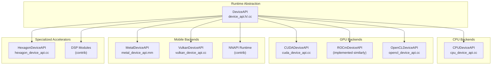
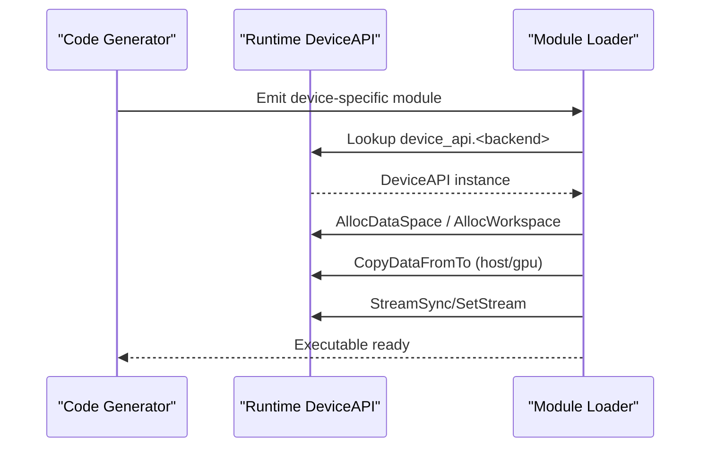
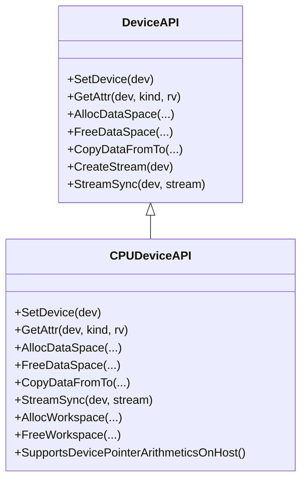
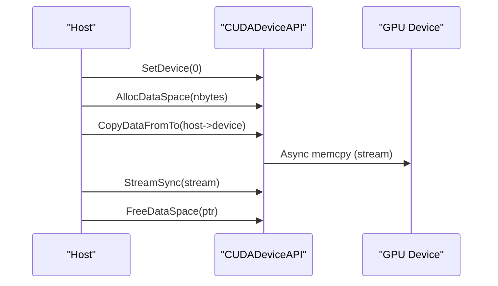
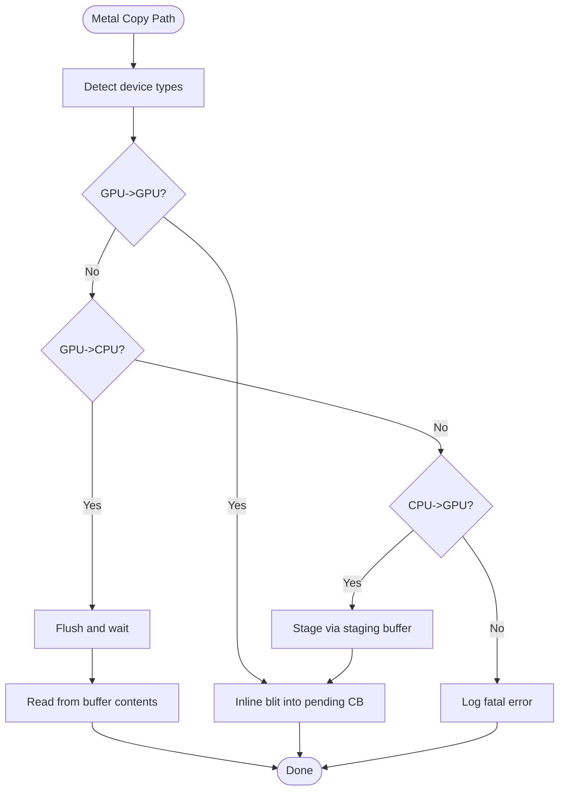
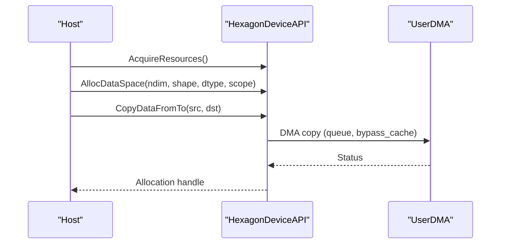
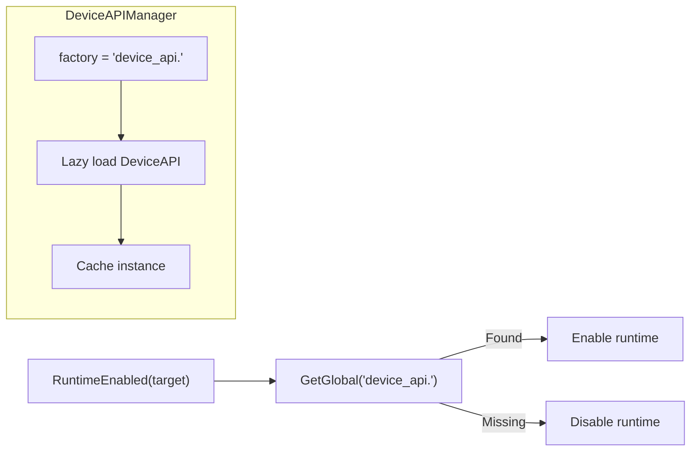

# Hardware Backend Support

<cite>
**Referenced Files in This Document**
- [module.cc](file://src/runtime/module.cc)
- [device_api.h](file://include/tvm/runtime/device_api.h)
- [device_api.cc](file://src/runtime/device_api.cc)
- [cpu_device_api.cc](file://src/runtime/cpu_device_api.cc)
- [cuda_device_api.cc](file://src/runtime/cuda/cuda_device_api.cc)
- [opencl_device_api.cc](file://src/runtime/opencl/opencl_device_api.cc)
- [metal_device_api.mm](file://src/runtime/metal/metal_device_api.mm)
- [vulkan_device_api.cc](file://src/runtime/vulkan/vulkan_device_api.cc)
- [hexagon_device_api.cc](file://src/runtime/hexagon/hexagon_device_api.cc)
- [dlpack.h](file://3rdparty/tvm-ffi/3rdparty/dlpack/include/dlpack/dlpack.h)
- [device_target_interactions.rst](file://docs/arch/device_target_interactions.rst)
- [DetectTargetTriple.cmake](file://3rdparty/tvm-ffi/cmake/Utils/DetectTargetTriple.cmake)
- [cc.py](file://python/tvm/contrib/cc.py)
</cite>

## Table of Contents
1. [Introduction](#introduction)
2. [Project Structure](#project-structure)
3. [Core Components](#core-components)
4. [Architecture Overview](#architecture-overview)
5. [Detailed Component Analysis](#detailed-component-analysis)
6. [Dependency Analysis](#dependency-analysis)
7. [Performance Considerations](#performance-considerations)
8. [Troubleshooting Guide](#troubleshooting-guide)
9. [Conclusion](#conclusion)
10. [Appendices](#appendices)

## Introduction
This document explains TVM’s hardware backend architecture and supported platforms. It covers CPU backends (x86, ARM, RISC-V), GPU backends (CUDA, ROCm, OpenCL), mobile backends (Metal, Vulkan, NNAPI), and specialized accelerators (Hexagon, DSP). It details backend capabilities, feature support, optimization strategies, backend registration, capability detection, runtime selection, and the relationship between hardware backends and code generation modules. Practical guidance is included for backend configuration, cross-compilation setup, and platform-specific optimizations.

## Project Structure
TVM organizes runtime backends under a unified DeviceAPI abstraction. Each hardware backend implements a DeviceAPI subclass and registers itself via a global registry. Targets and code generation modules produce executables that rely on the runtime to allocate memory, manage streams, and copy data across devices.

**Diagram sources**
- [device_api.h:128-310](file://include/tvm/runtime/device_api.h#L128-L310)
- [device_api.cc:49-95](file://src/runtime/device_api.cc#L49-L95)
- [cpu_device_api.cc:52-139](file://src/runtime/cpu_device_api.cc#L52-L139)
- [cuda_device_api.cc:39-274](file://src/runtime/cuda/cuda_device_api.cc#L39-L274)
- [opencl_device_api.cc:137-244](file://src/runtime/opencl/opencl_device_api.cc#L137-L244)
- [metal_device_api.mm:44-102](file://src/runtime/metal/metal_device_api.mm#L44-L102)
- [vulkan_device_api.cc:96-180](file://src/runtime/vulkan/vulkan_device_api.cc#L96-L180)
- [hexagon_device_api.cc:46-50](file://src/runtime/hexagon/hexagon_device_api.cc#L46-L50)

**Section sources**
- [device_api.h:128-310](file://include/tvm/runtime/device_api.h#L128-L310)
- [device_api.cc:49-95](file://src/runtime/device_api.cc#L49-L95)

## Core Components
- DeviceAPI: Abstract interface for device operations (allocation, copying, streams, attributes). Implemented per backend and registered globally.
- DeviceAPIManager: Singleton that lazily loads and caches DeviceAPI instances by device type.
- DLDeviceType: Enumerates supported device types, including CPU, CUDA, OpenCL, Metal, Vulkan, ROCm, Hexagon, and others.

Key responsibilities:
- Attribute queries (e.g., memory size, compute capability, device name)
- Memory allocation and workspace management
- Cross-device copy semantics
- Stream creation/synchronization
- Target property expansion for code generation

**Section sources**
- [device_api.h:83-101](file://include/tvm/runtime/device_api.h#L83-L101)
- [device_api.h:128-310](file://include/tvm/runtime/device_api.h#L128-L310)
- [device_api.cc:49-95](file://src/runtime/device_api.cc#L49-L95)
- [dlpack.h:72-123](file://3rdparty/tvm-ffi/3rdparty/dlpack/include/dlpack/dlpack.h#L72-L123)

## Architecture Overview
The backend architecture separates concerns between:
- Target and code generation: Define the device and instruction set for kernels.
- Runtime DeviceAPI: Provide device-specific memory/stream/copy operations.
- Module loading and dispatch: Resolve device APIs and execute functions.

**Diagram sources**
- [device_target_interactions.rst:28-79](file://docs/arch/device_target_interactions.rst#L28-L79)
- [module.cc:38-69](file://src/runtime/module.cc#L38-L69)
- [device_api.cc:85-94](file://src/runtime/device_api.cc#L85-L94)

## Detailed Component Analysis

### CPU Backends (x86, ARM, RISC-V)
Capabilities:
- Host memory allocation with proper alignment
- Attribute queries for total/global memory
- Host-side pointer arithmetic support
- Thread-local workspace pools

Optimization strategies:
- Platform-specific alignment and allocation paths
- Use of aligned_alloc or platform equivalents
- Minimal overhead for small allocations

**Diagram sources**
- [device_api.h:128-310](file://include/tvm/runtime/device_api.h#L128-L310)
- [cpu_device_api.cc:52-139](file://src/runtime/cpu_device_api.cc#L52-L139)

**Section sources**
- [cpu_device_api.cc:52-139](file://src/runtime/cpu_device_api.cc#L52-L139)

### GPU Backends (CUDA, ROCm, OpenCL)
Capabilities:
- Device selection, attributes (threads per block, warp size, memory sizes)
- Asynchronous memory copies across host/device and peer-to-peer
- Stream creation and synchronization
- Specialized timers and profiling hooks

Optimization strategies:
- Stream-based asynchronous execution
- Peer-to-peer copies when devices share PCIe
- Proper alignment and staging buffers for transfers
- Device-side copy barriers and pipeline state transitions

**Diagram sources**
- [cuda_device_api.cc:41-250](file://src/runtime/cuda/cuda_device_api.cc#L41-L250)

**Section sources**
- [cuda_device_api.cc:41-250](file://src/runtime/cuda/cuda_device_api.cc#L41-L250)
- [opencl_device_api.cc:137-244](file://src/runtime/opencl/opencl_device_api.cc#L137-L244)

### Mobile Backends (Metal, Vulkan, NNAPI)
Capabilities:
- Metal: Per-device streams, blit encoders, staging buffers, and profile counters
- Vulkan: Multi-device selection, target property queries, staging buffers, and memory barriers
- NNAPI: Contrib integration for Android inference deployment

Optimization strategies:
- Metal: Minimize flushes, reuse staging buffers, and avoid unnecessary syncs
- Vulkan: Coalesce transfers, use push descriptors when available, and leverage dedicated allocations
- NNAPI: Integrate with Android NNAPI delegates for on-device acceleration

**Diagram sources**
- [metal_device_api.mm:226-309](file://src/runtime/metal/metal_device_api.mm#L226-L309)

**Section sources**
- [metal_device_api.mm:44-102](file://src/runtime/metal/metal_device_api.mm#L44-L102)
- [metal_device_api.mm:226-309](file://src/runtime/metal/metal_device_api.mm#L226-L309)
- [vulkan_device_api.cc:96-180](file://src/runtime/vulkan/vulkan_device_api.cc#L96-L180)
- [vulkan_device_api.cc:335-442](file://src/runtime/vulkan/vulkan_device_api.cc#L335-L442)

### Specialized Accelerators (Hexagon, DSP)
Capabilities:
- Hexagon: Static allocations for global memory, VTCM allocations, DMA copy helpers, and workspace pools
- DSP: Contrib modules for DSP-specific libraries and integrations

Optimization strategies:
- Hexagon: Indirect tensor format for multi-region allocations, DMA queues for high-throughput transfers, and VTCM-aware memory scopes

**Diagram sources**
- [hexagon_device_api.cc:46-50](file://src/runtime/hexagon/hexagon_device_api.cc#L46-L50)
- [hexagon_device_api.cc:203-321](file://src/runtime/hexagon/hexagon_device_api.cc#L203-L321)

**Section sources**
- [hexagon_device_api.cc:46-50](file://src/runtime/hexagon/hexagon_device_api.cc#L46-L50)
- [hexagon_device_api.cc:203-321](file://src/runtime/hexagon/hexagon_device_api.cc#L203-L321)

## Dependency Analysis
Backend registration and discovery:
- DeviceAPIManager resolves device_api.<backend> factories from the global registry
- RuntimeEnabled determines whether a target runtime is available by checking device API availability

**Diagram sources**
- [module.cc:38-69](file://src/runtime/module.cc#L38-L69)
- [device_api.cc:85-94](file://src/runtime/device_api.cc#L85-L94)

**Section sources**
- [module.cc:38-69](file://src/runtime/module.cc#L38-L69)
- [device_api.cc:49-95](file://src/runtime/device_api.cc#L49-L95)

## Performance Considerations
- Asynchronous execution: Use streams to overlap compute and transfers; minimize synchronization points.
- Alignment and staging: Ensure allocations meet backend alignment requirements; use staging buffers for host-GPU transfers.
- Peer-to-peer and blits: Prefer direct GPU->GPU copies and blit encoders where supported.
- Property-driven tuning: Use target property queries to enable backend-specific features (e.g., storage buffers, push descriptors).
- Workspace pooling: Reuse thread-local workspace pools to reduce allocation overhead.

[No sources needed since this section provides general guidance]

## Troubleshooting Guide
Common issues and remedies:
- Device not found: Verify backend availability via RuntimeEnabled and ensure device_api.<backend> is registered.
- Excessive synchronization: Reduce StreamSync calls; batch operations within streams.
- Memory errors: Confirm alignment and size calculations; check for illegal address errors during cleanup.
- Cross-device copies: Some backends restrict device-to-device transfers; route via host or use supported paths.

**Section sources**
- [module.cc:38-69](file://src/runtime/module.cc#L38-L69)
- [cuda_device_api.cc:153-180](file://src/runtime/cuda/cuda_device_api.cc#L153-L180)
- [metal_device_api.mm:226-309](file://src/runtime/metal/metal_device_api.mm#L226-L309)
- [vulkan_device_api.cc:335-442](file://src/runtime/vulkan/vulkan_device_api.cc#L335-L442)

## Conclusion
TVM’s backend architecture centers on a unified DeviceAPI abstraction with per-backend implementations and a global registry for discovery. This design enables flexible code generation targeting diverse hardware while providing consistent memory management, streaming, and copy semantics. By leveraging target property queries and backend-specific optimizations, applications can achieve high performance across CPUs, GPUs, mobile platforms, and specialized accelerators.

[No sources needed since this section summarizes without analyzing specific files]

## Appendices

### Backend Registration and Capability Detection
- Register a backend by exporting a global function named device_api.<backend>.
- Use RuntimeEnabled to probe whether a target runtime is present.
- DeviceAPIManager lazily instantiates and caches DeviceAPI instances.

**Section sources**
- [device_api.cc:85-94](file://src/runtime/device_api.cc#L85-L94)
- [module.cc:38-69](file://src/runtime/module.cc#L38-L69)

### Relationship Between Hardware Backends and Code Generation
- Targets describe device capabilities and instruction sets.
- Code generation produces modules that rely on runtime DeviceAPI for execution.
- Target property queries enable backend-specific lowering and kernel selection.

**Section sources**
- [device_target_interactions.rst:28-79](file://docs/arch/device_target_interactions.rst#L28-L79)

### Backend Configuration Examples
- CPU: Use target alias "cpu"; relies on CPUDeviceAPI for host memory and attributes.
- CUDA: Use target alias "cuda" or "gpu"; leverages CUDADeviceAPI for device memory and streams.
- ROCm: Use target alias "rocm"; similar to CUDA with HIP runtime.
- OpenCL: Use target alias "opencl" or "cl"; uses OpenCLDeviceAPI for buffers and images.
- Metal: Use target alias "metal" or "mtl"; uses MetalDeviceAPI for MTLBuffer and streams.
- Vulkan: Use target alias "vulkan"; uses VulkanDeviceAPI for buffers and memory barriers.
- Hexagon: Use target alias "hexagon"; uses HexagonDeviceAPI for static/global allocations and DMA.

**Section sources**
- [module.cc:38-69](file://src/runtime/module.cc#L38-L69)
- [dlpack.h:72-123](file://3rdparty/tvm-ffi/3rdparty/dlpack/include/dlpack/dlpack.h#L72-L123)

### Cross-Compilation Setup
- Derive target triple from toolchain or environment variables.
- Use cross_compiler to specialize compilation for target architectures (x86, ARM, RISC-V).
- Configure platform-specific flags and SDK paths for mobile and accelerator backends.

**Section sources**
- [DetectTargetTriple.cmake:81-303](file://3rdparty/tvm-ffi/cmake/Utils/DetectTargetTriple.cmake#L81-L303)
- [cc.py:262-333](file://python/tvm/contrib/cc.py#L262-L333)