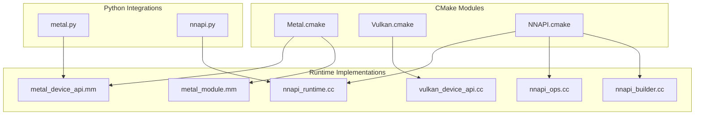
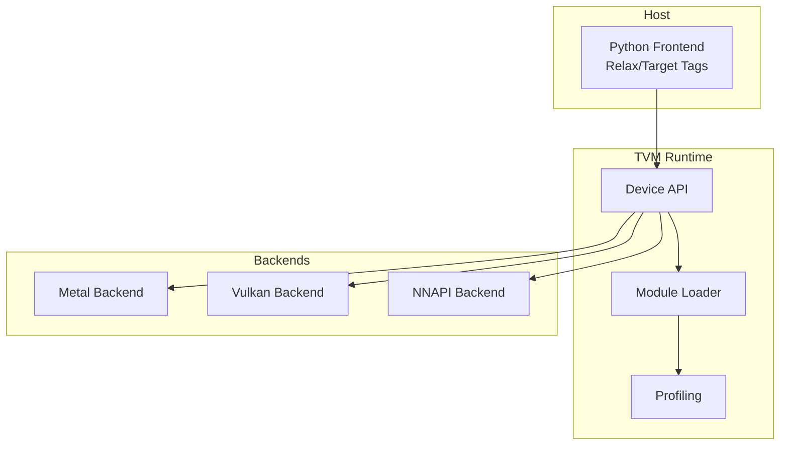
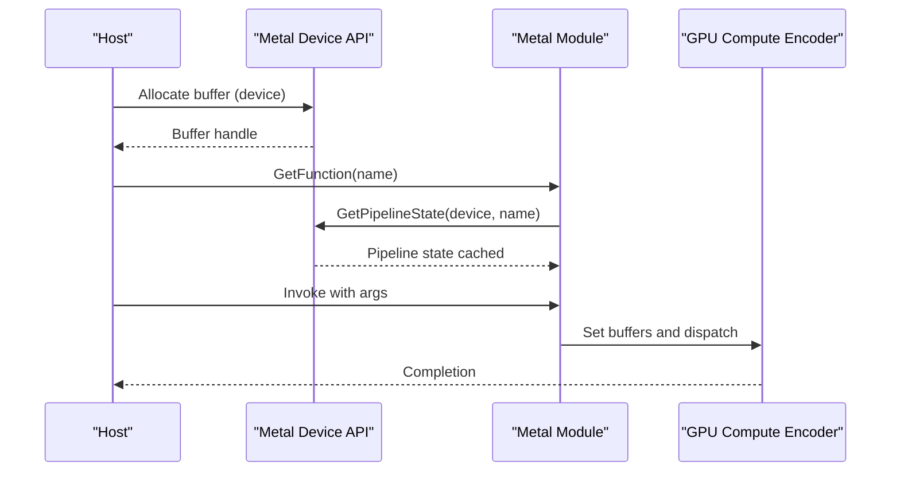
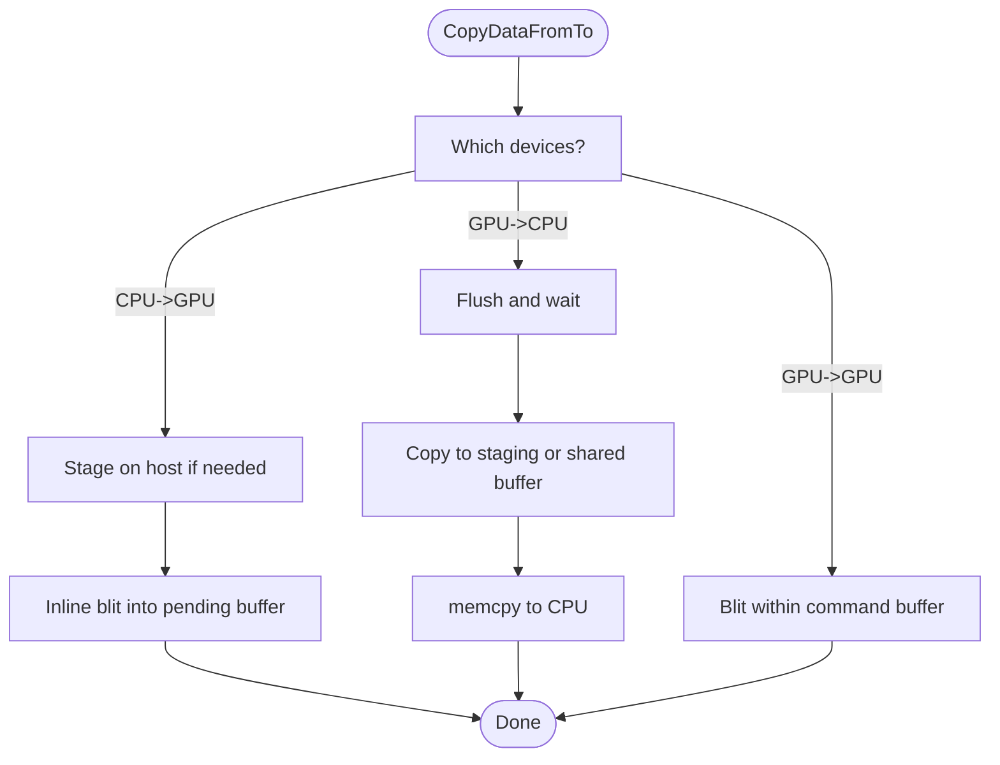
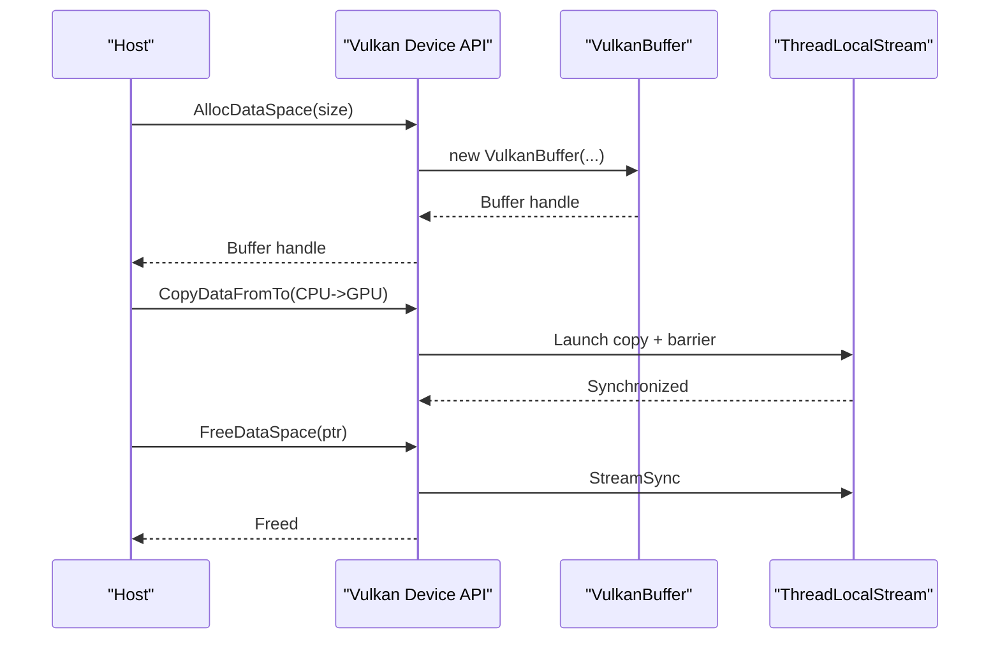
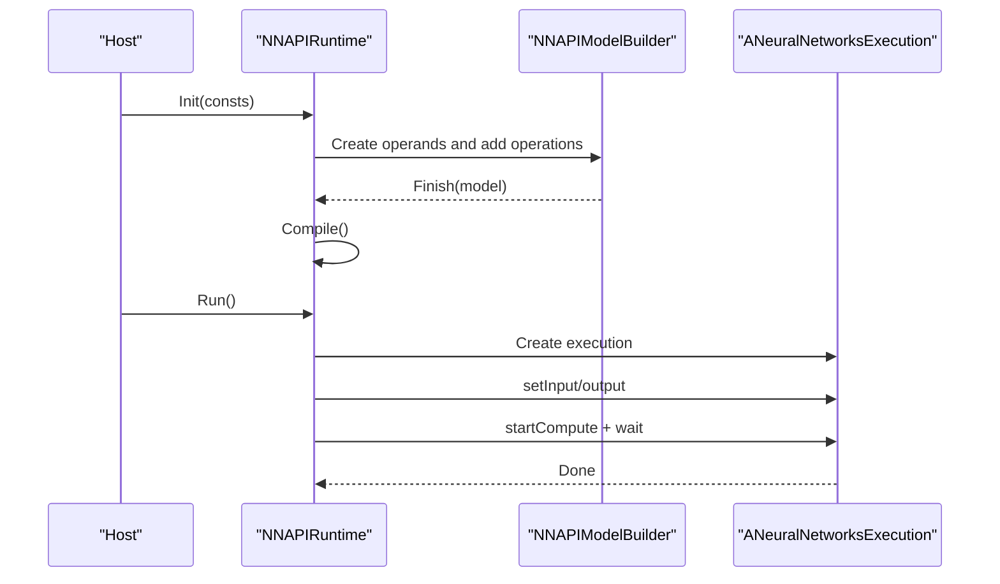
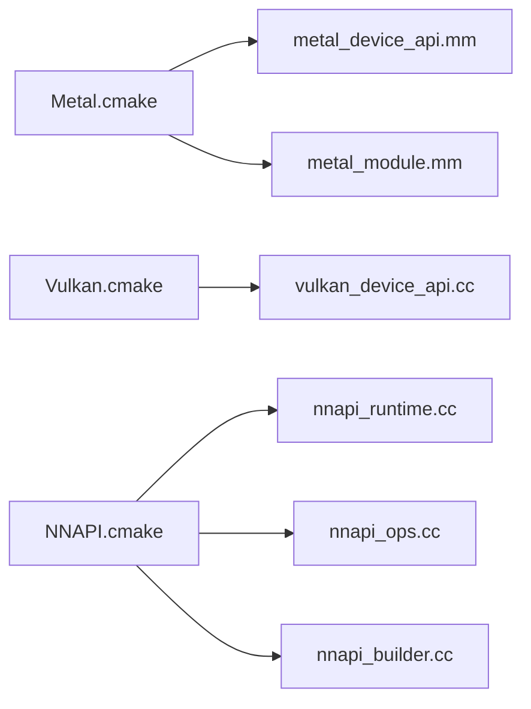

# Mobile and Edge Backends

<cite>
**Referenced Files in This Document**
- [Metal.cmake](file://cmake/modules/Metal.cmake)
- [Vulkan.cmake](file://cmake/modules/Vulkan.cmake)
- [NNAPI.cmake](file://cmake/modules/contrib/NNAPI.cmake)
- [metal_device_api.mm](file://src/runtime/metal/metal_device_api.mm)
- [metal_module.mm](file://src/runtime/metal/metal_module.mm)
- [metal.py](file://python/tvm/target/tag_registry/metal.py)
- [vulkan_device_api.cc](file://src/runtime/vulkan/vulkan_device_api.cc)
- [nnapi_runtime.cc](file://src/runtime/contrib/nnapi/nnapi_runtime.cc)
- [nnapi_ops.cc](file://src/runtime/contrib/nnapi/nnapi_ops.cc)
- [nnapi_builder.cc](file://src/runtime/contrib/nnapi/nnapi_builder.cc)
- [nnapi.py](file://python/tvm/relax/backend/contrib/nnapi.py)
- [android_rpc README](file://apps/android_rpc/README.md)
- [ios_rpc README](file://apps/ios_rpc/README.md)
</cite>

## Table of Contents
1. [Introduction](#introduction)
2. [Project Structure](#project-structure)
3. [Core Components](#core-components)
4. [Architecture Overview](#architecture-overview)
5. [Detailed Component Analysis](#detailed-component-analysis)
6. [Dependency Analysis](#dependency-analysis)
7. [Performance Considerations](#performance-considerations)
8. [Troubleshooting Guide](#troubleshooting-guide)
9. [Conclusion](#conclusion)
10. [Appendices](#appendices)

## Introduction
This document explains TVM’s mobile and edge platform backends for Apple Metal, cross-platform Vulkan, and Android NNAPI. It covers platform-specific runtime implementations, memory and power considerations, backend configuration for iOS, Android, and embedded Linux, deployment strategies, profiling, limitations, and debugging approaches. The goal is to help developers configure, optimize, and deploy TVM workloads efficiently on constrained and heterogeneous edge devices.

## Project Structure
TVM organizes mobile and edge backends across:
- CMake modules enabling/disabling and linking backend components
- Runtime implementations for Metal, Vulkan, and NNAPI
- Python-side tag registries and pattern tables for target selection and operator offloading
- Application samples for Android and iOS RPC deployments

**Diagram sources**
- [Metal.cmake:18-28](file://cmake/modules/Metal.cmake#L18-L28)
- [Vulkan.cmake:19-38](file://cmake/modules/Vulkan.cmake#L19-L38)
- [NNAPI.cmake:18-39](file://cmake/modules/contrib/NNAPI.cmake#L18-L39)
- [metal_device_api.mm:160-175](file://src/runtime/metal/metal_device_api.mm#L160-L175)
- [metal_module.mm:52-176](file://src/runtime/metal/metal_module.mm#L52-L176)
- [vulkan_device_api.cc:46-77](file://src/runtime/vulkan/vulkan_device_api.cc#L46-L77)
- [nnapi_runtime.cc:51-78](file://src/runtime/contrib/nnapi/nnapi_runtime.cc#L51-L78)
- [nnapi_ops.cc:552-589](file://src/runtime/contrib/nnapi/nnapi_ops.cc#L552-L589)
- [nnapi_builder.cc:133-228](file://src/runtime/contrib/nnapi/nnapi_builder.cc#L133-L228)
- [metal.py:22-42](file://python/tvm/target/tag_registry/metal.py#L22-L42)
- [nnapi.py:164-175](file://python/tvm/relax/backend/contrib/nnapi.py#L164-L175)

**Section sources**
- [Metal.cmake:18-28](file://cmake/modules/Metal.cmake#L18-L28)
- [Vulkan.cmake:19-38](file://cmake/modules/Vulkan.cmake#L19-L38)
- [NNAPI.cmake:18-39](file://cmake/modules/contrib/NNAPI.cmake#L18-L39)

## Core Components
- Metal backend (Apple)
  - Device API initializes GPU devices, manages attributes, streams, and synchronization
  - Module compiles and caches pipeline states per device
  - Tag registry defines target capabilities for Apple GPUs
- Vulkan backend (cross-platform)
  - Device API enumerates physical devices, selects discrete GPU by default, exposes device properties
  - Handles CPU/GPU transfers with staging buffers and memory barriers
- NNAPI backend (Android)
  - Graph executor runtime compiles and executes models via Android Neural Networks API
  - Pattern table maps Relax ops to NNAPI operations and partitions supported subgraphs

**Section sources**
- [metal_device_api.mm:44-102](file://src/runtime/metal/metal_device_api.mm#L44-L102)
- [metal_module.mm:87-150](file://src/runtime/metal/metal_module.mm#L87-L150)
- [metal.py:22-42](file://python/tvm/target/tag_registry/metal.py#L22-L42)
- [vulkan_device_api.cc:46-77](file://src/runtime/vulkan/vulkan_device_api.cc#L46-L77)
- [nnapi_runtime.cc:51-78](file://src/runtime/contrib/nnapi/nnapi_runtime.cc#L51-L78)
- [nnapi_ops.cc:552-589](file://src/runtime/contrib/nnapi/nnapi_ops.cc#L552-L589)

## Architecture Overview
The backends integrate with TVM’s runtime and device abstraction. Each backend provides:
- Device API: device enumeration, attributes, allocation, copying, synchronization
- Module: function discovery, argument packing, kernel dispatch
- Profiling: timers and counters exposed to the runtime

[No sources needed since this diagram shows conceptual workflow, not actual code structure]

## Detailed Component Analysis

### Metal Backend (Apple)
- Device initialization and attributes
  - Enumerates devices, sets warp size, and exposes device memory limits
  - Uses per-thread default streams and pools for staging buffers
- Memory and synchronization
  - GPU memory allocation with appropriate storage modes
  - CPU-to-GPU and GPU-to-CPU copies with staging buffers and blit encoders
  - Synchronization ensures safe buffer reuse and avoids crashes
- Module execution
  - Compiles Metal kernels from source or binary, caches pipeline states
  - Packs arguments and dispatches compute encoders with configured launch parameters
- Target tags
  - Registers Apple GPU tags with thread limits and architecture hints

**Diagram sources**
- [metal_device_api.mm:181-217](file://src/runtime/metal/metal_device_api.mm#L181-L217)
- [metal_module.mm:198-234](file://src/runtime/metal/metal_module.mm#L198-L234)

**Diagram sources**
- [metal_device_api.mm:226-309](file://src/runtime/metal/metal_device_api.mm#L226-L309)

**Section sources**
- [metal_device_api.mm:160-175](file://src/runtime/metal/metal_device_api.mm#L160-L175)
- [metal_device_api.mm:181-217](file://src/runtime/metal/metal_device_api.mm#L181-L217)
- [metal_device_api.mm:226-309](file://src/runtime/metal/metal_device_api.mm#L226-L309)
- [metal_module.mm:87-150](file://src/runtime/metal/metal_module.mm#L87-L150)
- [metal_module.mm:198-234](file://src/runtime/metal/metal_module.mm#L198-L234)
- [metal.py:22-42](file://python/tvm/target/tag_registry/metal.py#L22-L42)

### Vulkan Backend (Cross-Platform)
- Device enumeration and selection
  - Discovers physical devices and prioritizes discrete GPUs
  - Exposes device properties such as max threads, shared memory, and feature flags
- Memory and transfers
  - Allocates buffers with transfer and storage usage flags
  - CPU-to-GPU and GPU-to-CPU copies with staging buffers and memory barriers
  - Synchronizes streams to ensure visibility and safety
- Execution model
  - Single-stream device API; synchronization is a no-op except when freeing buffers

**Diagram sources**
- [vulkan_device_api.cc:284-294](file://src/runtime/vulkan/vulkan_device_api.cc#L284-L294)
- [vulkan_device_api.cc:397-437](file://src/runtime/vulkan/vulkan_device_api.cc#L397-L437)

**Section sources**
- [vulkan_device_api.cc:46-77](file://src/runtime/vulkan/vulkan_device_api.cc#L46-L77)
- [vulkan_device_api.cc:182-282](file://src/runtime/vulkan/vulkan_device_api.cc#L182-L282)
- [vulkan_device_api.cc:335-442](file://src/runtime/vulkan/vulkan_device_api.cc#L335-L442)

### NNAPI Backend (Android)
- Runtime compilation and execution
  - Builds an NNAPI model from graph JSON, compiles it, and executes via ANeuralNetworks APIs
  - Supports inputs/outputs mapping and execution events
- Operator coverage and mapping
  - Pattern table maps Relax ops to NNAPI operations and supports feature-level filtering
  - Converter implementations translate TVM graph nodes to NNAPI operands and operations

**Diagram sources**
- [nnapi_runtime.cc:73-78](file://src/runtime/contrib/nnapi/nnapi_runtime.cc#L73-L78)
- [nnapi_runtime.cc:122-128](file://src/runtime/contrib/nnapi/nnapi_runtime.cc#L122-L128)
- [nnapi_runtime.cc:130-178](file://src/runtime/contrib/nnapi/nnapi_runtime.cc#L130-L178)
- [nnapi_builder.cc:133-228](file://src/runtime/contrib/nnapi/nnapi_builder.cc#L133-L228)

**Section sources**
- [nnapi_runtime.cc:51-78](file://src/runtime/contrib/nnapi/nnapi_runtime.cc#L51-L78)
- [nnapi_runtime.cc:180-184](file://src/runtime/contrib/nnapi/nnapi_runtime.cc#L180-L184)
- [nnapi_ops.cc:552-589](file://src/runtime/contrib/nnapi/nnapi_ops.cc#L552-L589)
- [nnapi_builder.cc:133-228](file://src/runtime/contrib/nnapi/nnapi_builder.cc#L133-L228)
- [nnapi.py:164-175](file://python/tvm/relax/backend/contrib/nnapi.py#L164-L175)

## Dependency Analysis
- Build-time toggles
  - Metal: enables linking against Metal and Foundation frameworks
  - Vulkan: finds Vulkan SDK, adds SPIR-V tools, and defines feature macros
  - NNAPI: conditionally builds codegen and/or runtime, links Android NN libs
- Runtime dependencies
  - Metal depends on Apple Metal framework and device availability
  - Vulkan depends on Vulkan loader and driver compatibility
  - NNAPI depends on Android NN API presence and feature level

**Diagram sources**
- [Metal.cmake:18-28](file://cmake/modules/Metal.cmake#L18-L28)
- [Vulkan.cmake:19-38](file://cmake/modules/Vulkan.cmake#L19-L38)
- [NNAPI.cmake:18-39](file://cmake/modules/contrib/NNAPI.cmake#L18-L39)

**Section sources**
- [Metal.cmake:18-28](file://cmake/modules/Metal.cmake#L18-L28)
- [Vulkan.cmake:19-38](file://cmake/modules/Vulkan.cmake#L19-L38)
- [NNAPI.cmake:18-39](file://cmake/modules/contrib/NNAPI.cmake#L18-L39)

## Performance Considerations
- Metal
  - Prefer shared/private storage modes depending on CPU/GPU access patterns; minimize blit operations
  - Batch compute dispatches into pending command buffers to reduce overhead
  - Use staging buffers judiciously; reset pools after synchronization to reuse memory
- Vulkan
  - Discrete GPU selection improves throughput; ensure driver compatibility
  - Use staging buffers with proper flush/invalidation for coherent/non-coherent memory
  - Apply memory barriers to guarantee visibility across stages
- NNAPI
  - Partition supported subgraphs early using pattern tables to maximize acceleration
  - Respect feature levels to avoid unsupported operations on older devices
- Power efficiency
  - Minimize GPU busy/idle transitions; coalesce small kernels into larger grids
  - Avoid unnecessary CPU-GPU copies; keep tensors resident on device when possible
  - Use appropriate data types (e.g., FP16 when supported) to reduce bandwidth

[No sources needed since this section provides general guidance]

## Troubleshooting Guide
- Metal
  - Crashes on buffer release: ensure pending work is flushed before freeing buffers
  - Unexpected device attributes: verify device enumeration and warp-size assumptions
- Vulkan
  - Driver incompatibility errors: confirm Vulkan SDK presence and driver version
  - Cross-device copies: the runtime does not support device-to-device copies
- NNAPI
  - Runtime not enabled: build with NNAPI runtime flag; otherwise fallback to error
  - Unsupported operations: check feature level and pattern coverage
- Android/iOS RPC
  - Android: verify NDK toolchain and tracker connectivity; OpenCL/Vulkan availability varies by device
  - iOS: use custom dlopen plugin for JIT loading; ensure signing and trust settings

**Section sources**
- [metal_device_api.mm:201-217](file://src/runtime/metal/metal_device_api.mm#L201-L217)
- [vulkan_device_api.cc:346-350](file://src/runtime/vulkan/vulkan_device_api.cc#L346-L350)
- [nnapi_runtime.cc:232-241](file://src/runtime/contrib/nnapi/nnapi_runtime.cc#L232-L241)
- [android_rpc README:161-171](file://apps/android_rpc/README.md#L161-L171)
- [ios_rpc README:34-66](file://apps/ios_rpc/README.md#L34-L66)

## Conclusion
TVM’s mobile and edge backends provide robust, portable acceleration across Apple, Android, and cross-platform environments. By leveraging Metal, Vulkan, and NNAPI, developers can achieve high performance while respecting device constraints. Proper configuration, memory management, and profiling are essential for reliable deployment. The included Python integrations and RPC samples offer practical pathways to validate and optimize workloads on real devices.

[No sources needed since this section summarizes without analyzing specific files]

## Appendices

### Backend Configuration Quick Reference
- Metal
  - Enable via build flag; links Metal and Foundation frameworks
  - Targets: Apple GPU tags define thread limits and architecture
- Vulkan
  - Enable via build flag; requires Vulkan SDK and compatible driver
  - Targets: device properties and feature flags exposed to runtime
- NNAPI
  - Enable codegen/runtime via flags; links Android NN and log libraries
  - Targets: pattern table and feature-level gating for operator coverage

**Section sources**
- [Metal.cmake:18-28](file://cmake/modules/Metal.cmake#L18-L28)
- [Vulkan.cmake:19-38](file://cmake/modules/Vulkan.cmake#L19-L38)
- [NNAPI.cmake:18-39](file://cmake/modules/contrib/NNAPI.cmake#L18-L39)
- [metal.py:22-42](file://python/tvm/target/tag_registry/metal.py#L22-L42)
- [nnapi.py:164-175](file://python/tvm/relax/backend/contrib/nnapi.py#L164-L175)

### Mobile Deployment Strategies
- iOS
  - Build runtime dylib and RPC app; use standalone/proxy/tracker modes
  - Leverage Metal for GPU acceleration; use RPC to upload and execute compiled modules
- Android
  - Build APK with RPC server; connect via tracker or proxy
  - Test CPU, OpenCL, and Vulkan targets; validate driver support

**Section sources**
- [ios_rpc README:51-66](file://apps/ios_rpc/README.md#L51-L66)
- [ios_rpc README:105-141](file://apps/ios_rpc/README.md#L105-L141)
- [android_rpc README:100-138](file://apps/android_rpc/README.md#L100-L138)