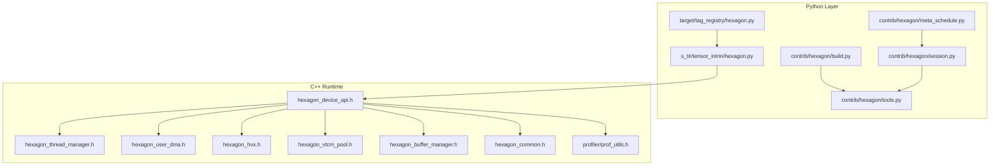
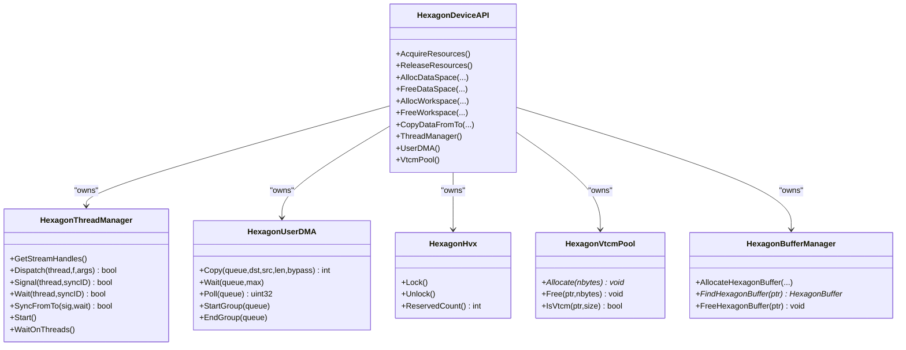
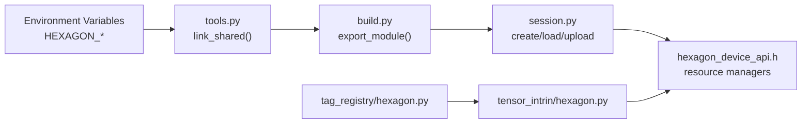

# Specialized Accelerators

<cite>
**Referenced Files in This Document**
- [apps/hexagon_api/README.md](file://apps/hexagon_api/README.md)
- [apps/hexagon_launcher/README.md](file://apps/hexagon_launcher/README.md)
- [python/tvm/contrib/hexagon/build.py](file://python/tvm/contrib/hexagon/build.py)
- [python/tvm/contrib/hexagon/meta_schedule.py](file://python/tvm/contrib/hexagon/meta_schedule.py)
- [python/tvm/contrib/hexagon/session.py](file://python/tvm/contrib/hexagon/session.py)
- [python/tvm/contrib/hexagon/tools.py](file://python/tvm/contrib/hexagon/tools.py)
- [python/tvm/s_tir/tensor_intrin/hexagon.py](file://python/tvm/s_tir/tensor_intrin/hexagon.py)
- [python/tvm/target/tag_registry/hexagon.py](file://python/tvm/target/tag_registry/hexagon.py)
- [src/runtime/hexagon/hexagon_common.h](file://src/runtime/hexagon/hexagon_common.h)
- [src/runtime/hexagon/hexagon_device_api.h](file://src/runtime/hexagon/hexagon_device_api.h)
- [src/runtime/hexagon/hexagon_hvx.h](file://src/runtime/hexagon/hexagon_hvx.h)
- [src/runtime/hexagon/hexagon_thread_manager.h](file://src/runtime/hexagon/hexagon_thread_manager.h)
- [src/runtime/hexagon/hexagon_user_dma.h](file://src/runtime/hexagon/hexagon_user_dma.h)
- [src/runtime/hexagon/hexagon_vtcm_pool.h](file://src/runtime/hexagon/hexagon_vtcm_pool.h)
- [src/runtime/hexagon/hexagon_buffer_manager.h](file://src/runtime/hexagon/hexagon_buffer_manager.h)
- [src/runtime/hexagon/profiler/prof_utils.h](file://src/runtime/hexagon/profiler/prof_utils.h)
</cite>

## Table of Contents
1. [Introduction](#introduction)
2. [Project Structure](#project-structure)
3. [Core Components](#core-components)
4. [Architecture Overview](#architecture-overview)
5. [Detailed Component Analysis](#detailed-component-analysis)
6. [Dependency Analysis](#dependency-analysis)
7. [Performance Considerations](#performance-considerations)
8. [Troubleshooting Guide](#troubleshooting-guide)
9. [Conclusion](#conclusion)
10. [Appendices](#appendices)

## Introduction
This document explains TVM’s specialized accelerator backends for Qualcomm Hexagon DSP, focusing on the programming model, memory hierarchy, and performance optimization strategies. It covers backend configuration, SDK integration, and deployment workflows for Android and simulator targets. It also provides guidance on accelerator utilization, performance tuning, debugging, limitations, compatibility, and migration from general-purpose backends.

## Project Structure
The specialized Hexagon backend spans Python APIs for tooling and sessions, S-TIR tensor intrinsics, and a C++ runtime subsystem that manages device memory, DMA, HVX vector units, VTCM, and threading.

**Diagram sources**
- [python/tvm/contrib/hexagon/build.py](file://python/tvm/contrib/hexagon/build.py)
- [python/tvm/contrib/hexagon/tools.py](file://python/tvm/contrib/hexagon/tools.py)
- [python/tvm/contrib/hexagon/session.py](file://python/tvm/contrib/hexagon/session.py)
- [python/tvm/contrib/hexagon/meta_schedule.py](file://python/tvm/contrib/hexagon/meta_schedule.py)
- [python/tvm/target/tag_registry/hexagon.py](file://python/tvm/target/tag_registry/hexagon.py)
- [python/tvm/s_tir/tensor_intrin/hexagon.py](file://python/tvm/s_tir/tensor_intrin/hexagon.py)
- [src/runtime/hexagon/hexagon_device_api.h](file://src/runtime/hexagon/hexagon_device_api.h)
- [src/runtime/hexagon/hexagon_thread_manager.h](file://src/runtime/hexagon/hexagon_thread_manager.h)
- [src/runtime/hexagon/hexagon_user_dma.h](file://src/runtime/hexagon/hexagon_user_dma.h)
- [src/runtime/hexagon/hexagon_hvx.h](file://src/runtime/hexagon/hexagon_hvx.h)
- [src/runtime/hexagon/hexagon_vtcm_pool.h](file://src/runtime/hexagon/hexagon_vtcm_pool.h)
- [src/runtime/hexagon/hexagon_buffer_manager.h](file://src/runtime/hexagon/hexagon_buffer_manager.h)
- [src/runtime/hexagon/hexagon_common.h](file://src/runtime/hexagon/hexagon_common.h)
- [src/runtime/hexagon/profiler/prof_utils.h](file://src/runtime/hexagon/profiler/prof_utils.h)

**Section sources**
- [apps/hexagon_api/README.md](file://apps/hexagon_api/README.md)
- [apps/hexagon_launcher/README.md](file://apps/hexagon_launcher/README.md)

## Core Components
- Target tags and CPU/arch configuration for Hexagon variants.
- Toolchain and linking utilities for building shared libraries with the Hexagon toolchain.
- Session management for RPC connectivity to Android devices or simulator.
- Meta-schedule integration for Hexagon-aware local builders.
- S-TIR tensor intrinsics for DMA loads and vector dot products.
- Runtime device API and resource managers for VTCM, DMA, HVX, threads, and buffers.

Key responsibilities:
- Tag registry defines per-Hexagon-version attributes such as VTCM capacity, ISA attributes, and LLVM options.
- Tools resolve environment variables for SDK/toolchain and provide linkers and clng++ wrappers.
- Session encapsulates RPC parameters and workspace handling for remote execution.
- Intrinsics expose DMA copy and vector dot-product patterns to the scheduling pipeline.
- Runtime device API orchestrates resource acquisition, memory allocation, copying, and exposes managers for DMA/HVX/VTCM/threading.

**Section sources**
- [python/tvm/target/tag_registry/hexagon.py](file://python/tvm/target/tag_registry/hexagon.py)
- [python/tvm/contrib/hexagon/tools.py](file://python/tvm/contrib/hexagon/tools.py)
- [python/tvm/contrib/hexagon/session.py](file://python/tvm/contrib/hexagon/session.py)
- [python/tvm/contrib/hexagon/meta_schedule.py](file://python/tvm/contrib/hexagon/meta_schedule.py)
- [python/tvm/s_tir/tensor_intrin/hexagon.py](file://python/tvm/s_tir/tensor_intrin/hexagon.py)
- [src/runtime/hexagon/hexagon_device_api.h](file://src/runtime/hexagon/hexagon_device_api.h)

## Architecture Overview
The Hexagon backend integrates Python tooling and sessions with a C++ runtime subsystem. The runtime provides:
- Device memory management and workspace allocation
- DMA engine for efficient transfers
- HVX vector unit locking and reservation
- VTCM pool for high-bandwidth on-device memory
- Thread manager for asynchronous command submission and synchronization

**Diagram sources**
- [src/runtime/hexagon/hexagon_device_api.h](file://src/runtime/hexagon/hexagon_device_api.h)
- [src/runtime/hexagon/hexagon_thread_manager.h](file://src/runtime/hexagon/hexagon_thread_manager.h)
- [src/runtime/hexagon/hexagon_user_dma.h](file://src/runtime/hexagon/hexagon_user_dma.h)
- [src/runtime/hexagon/hexagon_hvx.h](file://src/runtime/hexagon/hexagon_hvx.h)
- [src/runtime/hexagon/hexagon_vtcm_pool.h](file://src/runtime/hexagon/hexagon_vtcm_pool.h)
- [src/runtime/hexagon/hexagon_buffer_manager.h](file://src/runtime/hexagon/hexagon_buffer_manager.h)

## Detailed Component Analysis

### Target Tags and Compatibility Matrix
- Tag registry defines per-Hexagon version configurations including ISA attributes, number of cores, and VTCM capacity.
- Versions include v65, v66, v68, v69, v73, v75.
- LLVM options may be set per version (e.g., forcing HVX float behavior on v68).

Practical impact:
- Selecting the correct tag ensures proper CPU/mattr/ISA flags and VTCM limits.
- Migration across versions should consider VTCM capacity and feature flags.

**Section sources**
- [python/tvm/target/tag_registry/hexagon.py](file://python/tvm/target/tag_registry/hexagon.py)

### Toolchain and Linking
- Environment variables drive toolchain and SDK discovery.
- Linker selection supports platform-specific behavior (Linux/macOS) and Docker-based linking on macOS.
- Shared library creation uses the Hexagon toolchain and target-specific libraries.

Operational guidance:
- Ensure HEXAGON_TOOLCHAIN and HEXAGON_SDK_ROOT are set.
- Use the registered link function for deterministic linker resolution.
- On macOS, the Docker-based flow can be used to avoid local toolchain mismatches.

**Section sources**
- [python/tvm/contrib/hexagon/tools.py](file://python/tvm/contrib/hexagon/tools.py)

### Session Management and RPC
- Session encapsulates workspace, RPC tracker/server key, serial number (device or simulator), and buffer sizes.
- Provides upload, load module, and remote execution helpers.
- Integrates with meta-schedule for automated builder and evaluator workflows.

Usage tips:
- Configure remote stack size and receive buffer size according to workload.
- Use “simulator” as serial number for simulation.

**Section sources**
- [python/tvm/contrib/hexagon/session.py](file://python/tvm/contrib/hexagon/session.py)

### Meta-Schedule Integration
- Local builder adapts pass context and skips certain layout rewrite blocks during export.
- Worker function uploads artifacts, loads modules, allocates arguments, and runs evaluators.
- Supports repeat allocation and default evaluator configuration.

Best practices:
- Wrap build within a pass context to stabilize schedules.
- Reuse default evaluator and argument allocation helpers for reproducible measurements.

**Section sources**
- [python/tvm/contrib/hexagon/meta_schedule.py](file://python/tvm/contrib/hexagon/meta_schedule.py)

### S-TIR Tensor Intrinsics
- DMA load intrinsics for aligned transfers from global memory to VTCM.
- Vector dot-product intrinsics for vrmpy/vdmpy patterns with explicit vectorized loads and LLVM intrinsics.
- Intrinsics are registered under names for scheduling use.

Optimization notes:
- Prefer VTCM-scoped buffers for compute-heavy kernels to reduce off-chip traffic.
- Use vectorized intrinsics to exploit HVX width and reduce loop overhead.

**Section sources**
- [python/tvm/s_tir/tensor_intrin/hexagon.py](file://python/tvm/s_tir/tensor_intrin/hexagon.py)

### Runtime Device API and Memory Hierarchy
- Device API acquires and releases resource managers: power, VTCM pool, buffer manager, thread manager, and user DMA.
- Allocation honors memory scopes; copying supports shape-aware transfers.
- Alignment constants and safe-call macros standardize error handling.

Memory hierarchy:
- Host-visible global memory
- VTCM (high-bandwidth, on-chip) with pool management and bounds checking
- Per-thread command buffers and semaphores for synchronization

**Section sources**
- [src/runtime/hexagon/hexagon_device_api.h](file://src/runtime/hexagon/hexagon_device_api.h)
- [src/runtime/hexagon/hexagon_common.h](file://src/runtime/hexagon/hexagon_common.h)

### VTCM Pool
- Allocates and frees from a contiguous VTCM region.
- Tracks allocations and free segments, guarded by a mutex.
- Provides capability checks to verify pointers reside in VTCM.

Guidance:
- Place hot tensors in VTCM to minimize DMA overhead.
- Monitor allocated bytes to avoid overcommitting VTCM.

**Section sources**
- [src/runtime/hexagon/hexagon_vtcm_pool.h](file://src/runtime/hexagon/hexagon_vtcm_pool.h)

### User DMA Engine
- Provides synchronous and asynchronous copy operations with queue management.
- Supports grouping operations and polling in-flight transfers.
- Bypass-cache option controls cache behavior for DMA.

Tuning:
- Group small copies to amortize descriptor overhead.
- Use polling to coalesce completion checks.

**Section sources**
- [src/runtime/hexagon/hexagon_user_dma.h](file://src/runtime/hexagon/hexagon_user_dma.h)

### HVX Locking
- Thread-local locking mechanism reserves HVX units for compute.
- Prevents concurrent use conflicts and tracks reserved count.

Usage:
- Lock before compute kernels that rely on HVX.
- Unlock after completion to allow reuse.

**Section sources**
- [src/runtime/hexagon/hexagon_hvx.h](file://src/runtime/hexagon/hexagon_hvx.h)

### Thread Manager
- Spawns multiple threads with configurable stack and pipe sizes.
- Dispatches functions, signals, waits, and cross-thread synchronization.
- Maintains per-thread pipes and semaphores.

Patterns:
- Use Start to unblock workers.
- Use SyncFromTo to coordinate producer-consumer pairs across threads.

**Section sources**
- [src/runtime/hexagon/hexagon_thread_manager.h](file://src/runtime/hexagon/hexagon_thread_manager.h)

### Buffer Manager
- Tracks HexagonBuffer instances and supports lookup and freeing.
- Guards map updates with a mutex.

Lifecycle:
- Allocate via manager and keep pointer for lifetime management.
- Free using manager to erase from map.

**Section sources**
- [src/runtime/hexagon/hexagon_buffer_manager.h](file://src/runtime/hexagon/hexagon_buffer_manager.h)

### Profiling Utilities
- Lightweight profiling (LWP) output writer for cycle-level metrics.
- Launcher supports dumping LWP JSON for post-run analysis.

Workflow:
- Enable LWP instrumentation during codegen.
- Dump JSON and pull from device for analysis.

**Section sources**
- [src/runtime/hexagon/profiler/prof_utils.h](file://src/runtime/hexagon/profiler/prof_utils.h)
- [apps/hexagon_launcher/README.md](file://apps/hexagon_launcher/README.md)

## Dependency Analysis
The Python tooling depends on environment variables and the Hexagon SDK/toolchain. Sessions depend on RPC connectivity and workspace layout. The runtime device API composes multiple managers and exposes them to scheduling and execution.

**Diagram sources**
- [python/tvm/contrib/hexagon/tools.py](file://python/tvm/contrib/hexagon/tools.py)
- [python/tvm/contrib/hexagon/build.py](file://python/tvm/contrib/hexagon/build.py)
- [python/tvm/contrib/hexagon/session.py](file://python/tvm/contrib/hexagon/session.py)
- [python/tvm/target/tag_registry/hexagon.py](file://python/tvm/target/tag_registry/hexagon.py)
- [python/tvm/s_tir/tensor_intrin/hexagon.py](file://python/tvm/s_tir/tensor_intrin/hexagon.py)
- [src/runtime/hexagon/hexagon_device_api.h](file://src/runtime/hexagon/hexagon_device_api.h)

**Section sources**
- [python/tvm/contrib/hexagon/tools.py](file://python/tvm/contrib/hexagon/tools.py)
- [python/tvm/contrib/hexagon/build.py](file://python/tvm/contrib/hexagon/build.py)
- [python/tvm/contrib/hexagon/session.py](file://python/tvm/contrib/hexagon/session.py)
- [python/tvm/target/tag_registry/hexagon.py](file://python/tvm/target/tag_registry/hexagon.py)
- [python/tvm/s_tir/tensor_intrin/hexagon.py](file://python/tvm/s_tir/tensor_intrin/hexagon.py)
- [src/runtime/hexagon/hexagon_device_api.h](file://src/runtime/hexagon/hexagon_device_api.h)

## Performance Considerations
- Memory placement
  - Place compute-intensive tensors in VTCM to reduce DRAM bandwidth.
  - Use DMA intrinsics to stage data efficiently; align transfers to vector widths.
- Vectorization
  - Exploit VRMPY/VDMpy intrinsics to maximize HVX throughput.
  - Keep data in VTCM to avoid cache miss penalties.
- Concurrency
  - Use thread manager to overlap producers/consumers; synchronize with semaphores.
  - Group DMA operations to amortize descriptor overhead.
- Version-specific tuning
  - v68+ enables HVX QFloat and optional LLVM float behavior; validate numerical behavior.
  - Larger VTCM on v69+/v73+/v75+ allows larger on-device buffers.

[No sources needed since this section provides general guidance]

## Troubleshooting Guide
Common issues and remedies:
- Toolchain/sdk not found
  - Verify HEXAGON_TOOLCHAIN and HEXAGON_SDK_ROOT; ensure hexagon-clang/hexagon-link are executable.
- Link failures on macOS
  - Use Docker-based linking flow; confirm SDK image environment variables.
- RPC connection problems
  - Confirm serial number (device vs. “simulator”), tracker/server key, and workspace paths.
- Out-of-memory in VTCM
  - Reduce tensor sizes or increase VTCM capacity by selecting a newer Hexagon version tag.
- HVX contention
  - Ensure proper locking/unlocking around compute kernels; avoid nested locks in compute paths.
- DMA stalls
  - Group operations and poll in-flight transfers; avoid excessive small copies.

**Section sources**
- [python/tvm/contrib/hexagon/tools.py](file://python/tvm/contrib/hexagon/tools.py)
- [python/tvm/contrib/hexagon/session.py](file://python/tvm/contrib/hexagon/session.py)
- [src/runtime/hexagon/hexagon_vtcm_pool.h](file://src/runtime/hexagon/hexagon_vtcm_pool.h)
- [src/runtime/hexagon/hexagon_hvx.h](file://src/runtime/hexagon/hexagon_hvx.h)
- [src/runtime/hexagon/hexagon_user_dma.h](file://src/runtime/hexagon/hexagon_user_dma.h)

## Conclusion
TVM’s Hexagon backend combines robust Python tooling and sessions with a capable C++ runtime to deliver efficient DSP execution. By leveraging VTCM, DMA, HVX, and multi-threading, developers can achieve strong performance on Qualcomm SoCs. Correct target tagging, toolchain configuration, and careful memory/vectorization strategies are essential for optimal results.

[No sources needed since this section summarizes without analyzing specific files]

## Appendices

### Deployment Workflow (Android and Simulator)
- Build runtime and RPC server for Android; build RPC skeleton for Hexagon.
- Prepare device with required binaries and model artifacts.
- Launch the graph launcher to execute the model and optionally dump LWP JSON for profiling.

**Section sources**
- [apps/hexagon_api/README.md](file://apps/hexagon_api/README.md)
- [apps/hexagon_launcher/README.md](file://apps/hexagon_launcher/README.md)

### Migration from General-Purpose Backends
- Replace generic CPU/GPU targets with a Hexagon tag (e.g., qcom/hexagon-v68).
- Adjust memory scopes to use VTCM where beneficial.
- Introduce tensor intrinsics for vectorized operations and DMA staging.
- Validate numerical behavior across versions, especially around floating-point modes.

**Section sources**
- [python/tvm/target/tag_registry/hexagon.py](file://python/tvm/target/tag_registry/hexagon.py)
- [python/tvm/s_tir/tensor_intrin/hexagon.py](file://python/tvm/s_tir/tensor_intrin/hexagon.py)