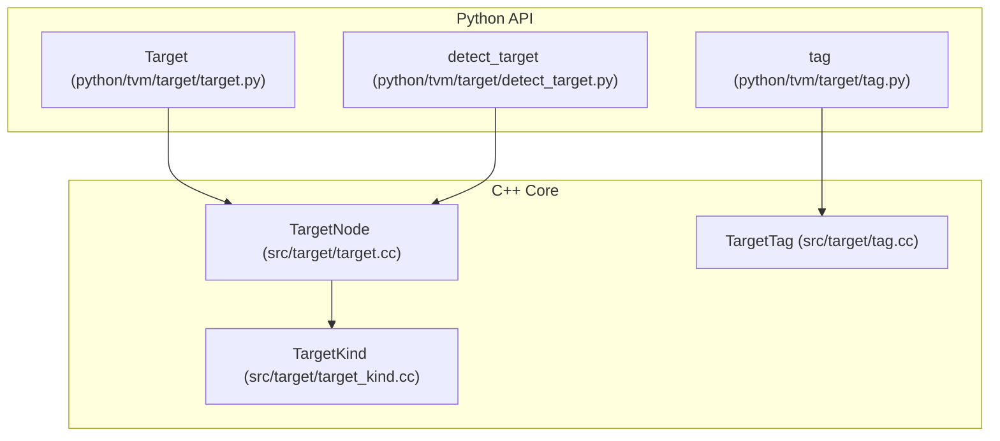
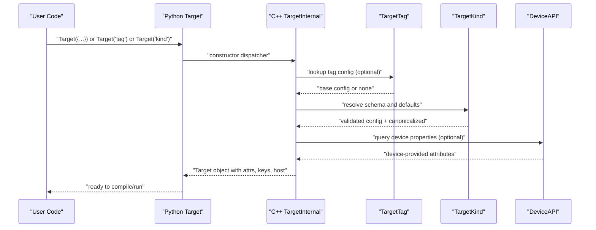
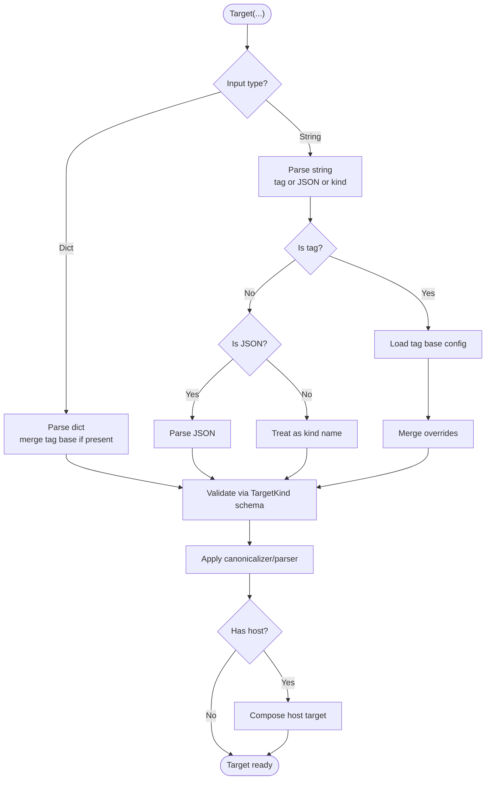
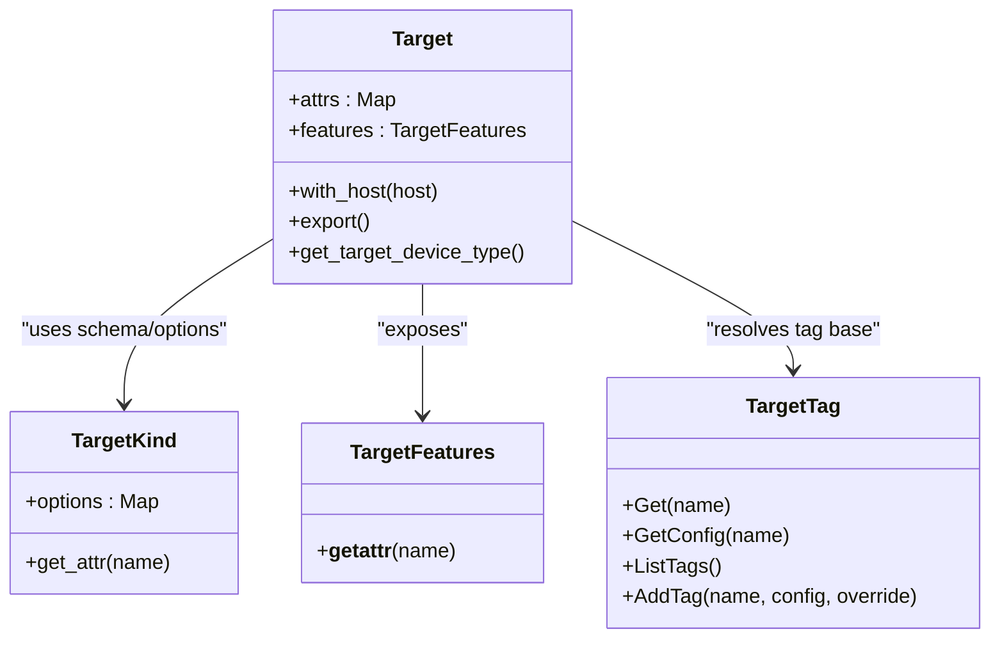

# Target Configuration and Properties

<cite>
**Referenced Files in This Document**
- [target.py](file://python/tvm/target/target.py)
- [target.cc](file://src/target/target.cc)
- [target_kind.cc](file://src/target/target_kind.cc)
- [detect_target.py](file://python/tvm/target/detect_target.py)
- [tag.py](file://python/tvm/target/tag.py)
- [tag.cc](file://src/target/tag.cc)
- [_kernel_common.py](file://python/tvm/relax/frontend/nn/llm/_kernel_common.py)
- [nvcc.py](file://python/tvm/contrib/nvcc.py)
- [target_test.cc](file://tests/cpp/target_test.cc)
- [test_target_codegen.py](file://tests/python/codegen/test_target_codegen.py)
</cite>

## Table of Contents
1. [Introduction](#introduction)
2. [Project Structure](#project-structure)
3. [Core Components](#core-components)
4. [Architecture Overview](#architecture-overview)
5. [Detailed Component Analysis](#detailed-component-analysis)
6. [Dependency Analysis](#dependency-analysis)
7. [Performance Considerations](#performance-considerations)
8. [Troubleshooting Guide](#troubleshooting-guide)
9. [Conclusion](#conclusion)
10. [Appendices](#appendices)

## Introduction
This document explains TVM’s target configuration system: how targets are represented, configured via JSON-like dictionaries, and accessed programmatically. It covers:
- Target string format and JSON-based configuration
- Target property system and attribute access
- Construction methods: dictionary-based, tag-based, and kind-based
- Key attributes such as arch, max_num_threads, mcpu, libs, and device-specific properties
- Target validation, device auto-detection, and host-target composition
- Practical examples for common hardware scenarios

## Project Structure
The target system spans Python APIs and C++ core logic:
- Python API exposes Target, TargetKind, and helpers for device detection and tag registration
- C++ core implements target parsing, validation, canonicalization, and device property queries
- Tests demonstrate configuration, validation, and feature extraction

**Diagram sources**
- [target.py:51-233](file://python/tvm/target/target.py#L51-L233)
- [target.cc:101-176](file://src/target/target.cc#L101-L176)
- [target_kind.cc:301-506](file://src/target/target_kind.cc#L301-L506)
- [detect_target.py:109-147](file://python/tvm/target/detect_target.py#L109-L147)
- [tag.py:17-22](file://python/tvm/target/tag.py#L17-L22)
- [tag.cc:44-85](file://src/target/tag.cc#L44-L85)

**Section sources**
- [target.py:51-233](file://python/tvm/target/target.py#L51-L233)
- [target.cc:101-176](file://src/target/target.cc#L101-L176)
- [target_kind.cc:301-506](file://src/target/target_kind.cc#L301-L506)
- [detect_target.py:109-147](file://python/tvm/target/detect_target.py#L109-L147)
- [tag.py:17-22](file://python/tvm/target/tag.py#L17-L22)
- [tag.cc:44-85](file://src/target/tag.cc#L44-L85)

## Core Components
- Target: The primary configuration object representing a compilation target and optional host. It supports construction from strings, JSON dicts, tags, and kind names. It exposes attributes via a mapping and provides feature access and device-type resolution.
- TargetKind: Defines the schema and options for a target kind (e.g., llvm, cuda, rocm). It registers options and optional canonicalizers/parsers.
- TargetTag: Provides named tags that resolve to base configurations; user-provided overrides are merged atop tag-defined defaults.
- Device Detection: Helpers to auto-detect target parameters from a live device.

Key capabilities:
- Construction from JSON-like dict or tag string
- Attribute access via target.attrs
- Feature access via target.features
- Host composition via with_host
- Current target context and scope management

**Section sources**
- [target.py:51-233](file://python/tvm/target/target.py#L51-L233)
- [target.cc:101-176](file://src/target/target.cc#L101-L176)
- [target_kind.cc:301-506](file://src/target/target_kind.cc#L301-L506)
- [detect_target.py:109-147](file://python/tvm/target/detect_target.py#L109-L147)

## Architecture Overview
End-to-end flow for target creation and validation:

**Diagram sources**
- [target.py:78-145](file://python/tvm/target/target.py#L78-L145)
- [target.cc:254-423](file://src/target/target.cc#L254-L423)
- [tag.cc:52-67](file://src/target/tag.cc#L52-L67)
- [target_kind.cc:301-506](file://src/target/target_kind.cc#L301-L506)

## Detailed Component Analysis

### Target Construction Methods
- Dictionary-based: Pass a dict containing kind, tag, keys, device, host, libs, and other attributes. Schema validation ensures types and defaults are applied.
- Tag-based: Provide a tag string or a dict with tag and optional overrides. The tag resolves to a base config; overrides are merged.
- Kind-based: Provide a bare kind name (e.g., "cuda", "llvm"). Validation enforces required fields and applies defaults.
- Device auto-detection: Use Target.from_device to infer target parameters from a live device.

**Diagram sources**
- [target.cc:254-423](file://src/target/target.cc#L254-L423)
- [target_kind.cc:301-506](file://src/target/target_kind.cc#L301-L506)
- [detect_target.py:109-147](file://python/tvm/target/detect_target.py#L109-L147)

**Section sources**
- [target.py:78-145](file://python/tvm/target/target.py#L78-L145)
- [target.cc:254-423](file://src/target/target.cc#L254-L423)
- [detect_target.py:109-147](file://python/tvm/target/detect_target.py#L109-L147)

### Target Attributes and Properties
- Attributes: Accessible via target.attrs mapping. Includes arch, mcpu, max_num_threads, thread_warp_size, device-specific limits, and more depending on kind.
- Keys: Derived from keys, device, and kind defaults; deduplicated and used for dispatch.
- Device type: Determined by target kind or explicit attribute.
- Features: Accessible via target.features; stored internally as feature.<name> keys.

Examples of attributes per kind (selected):
- CUDA: arch, max_shared_memory_per_block, max_threads_per_block, thread_warp_size, l2_cache_size_bytes, max_num_threads
- ROCm: mcpu, mtriple, thread_warp_size, max_num_threads, max_threads_per_block, max_shared_memory_per_block
- Vulkan: supports_* flags, max_* limits, device info, thread_warp_size
- Metal: max_num_threads, max_threads_per_block, max_shared_memory_per_block, thread_warp_size
- OpenCL: max_num_threads, max_threads_per_block, max_shared_memory_per_block, thread_warp_size, limits
- LLVM/C: mcpu, mtriple, fast-math flags, opt-level, vector-width, jit, cl-opt

Access patterns:
- Attribute access: target.attrs["key"]
- Feature access: target.features.some_feature
- Device type: target.get_target_device_type()

**Section sources**
- [target_kind.cc:301-506](file://src/target/target_kind.cc#L301-L506)
- [target.py:197-218](file://python/tvm/target/target.py#L197-L218)

### Target Validation and Canonicalization
- Schema validation: Each TargetKind declares allowed options and types; unknown or mismatched keys cause errors.
- Defaults: Kinds define default values and keys; missing values are filled during resolution.
- Canonicalizers/parsers: Some kinds provide custom logic to derive or normalize attributes (e.g., CUDA/ROCm arch inference).
- Device queries: Optional from_device parameter merges device-reported properties when available.

Common validation failures:
- Unknown keys
- Type mismatches
- Missing required fields
- Unsupported combinations

**Section sources**
- [target.cc:352-423](file://src/target/target.cc#L352-L423)
- [target_kind.cc:165-287](file://src/target/target_kind.cc#L165-L287)
- [target_test.cc:106-170](file://tests/cpp/target_test.cc#L106-L170)

### Virtual Devices and Target Composition
- Host composition: A target can carry a host target (e.g., cross-compilation). Use with_host or Target(..., host=...) to attach.
- Nested reconstruction: Exported configs preserve nested host and feature.* metadata.
- Scope management: Target.enter_scope and Target.exit_scope manage a thread-local current target.

Practical usage:
- Cross-compilation: target.with_host(host_target)
- Current target: Target.current()

**Section sources**
- [target.cc:47-69](file://src/target/target.cc#L47-L69)
- [target.py:147-158](file://python/tvm/target/target.py#L147-L158)
- [target_test.cc:251-270](file://tests/cpp/target_test.cc#L251-L270)

### Device Auto-Detection
- Supported devices: cuda, metal, rocm, vulkan, opencl, cpu
- Detection flow: Validates device existence and driver availability, then constructs a target with inferred attributes
- CPU detection: Uses LLVM triple and CPU name from codegen globals

**Section sources**
- [detect_target.py:109-147](file://python/tvm/target/detect_target.py#L109-L147)

## Dependency Analysis
Relationships among core components:

**Diagram sources**
- [target.py:28-233](file://python/tvm/target/target.py#L28-L233)
- [target_kind.cc:301-528](file://src/target/target_kind.cc#L301-L528)
- [tag.cc:52-85](file://src/target/tag.cc#L52-L85)

**Section sources**
- [target.py:28-233](file://python/tvm/target/target.py#L28-L233)
- [target_kind.cc:301-528](file://src/target/target_kind.cc#L301-L528)
- [tag.cc:52-85](file://src/target/tag.cc#L52-L85)

## Performance Considerations
- Attribute access: Use target.attrs for O(1) lookup; avoid repeated recomputation.
- Thread limits: Respect max_num_threads and max_threads_per_block to prevent oversubscription.
- WebGPU constraints: Some targets impose stricter limits (e.g., max workgroup size).
- Host composition: Prefer minimal host configuration to reduce overhead.

[No sources needed since this section provides general guidance]

## Troubleshooting Guide
Common issues and resolutions:
- Unknown or invalid keys: Ensure keys match the target kind’s schema; refer to TargetKind options.
- Type mismatches: Confirm types align with schema expectations (e.g., strings vs integers).
- Missing kind: Provide kind or tag; bare strings without spaces are treated as kind names.
- Device not detected: Verify device exists and TVM is compiled with the appropriate driver.
- Cross-compilation: Attach a compatible host target via with_host.

Validation references:
- Schema validation and error messages
- Device query fallback behavior
- Feature.* preservation across exports

**Section sources**
- [target.cc:254-423](file://src/target/target.cc#L254-L423)
- [target_test.cc:106-170](file://tests/cpp/target_test.cc#L106-L170)

## Conclusion
TVM’s target configuration system offers a robust, schema-driven way to describe compilation targets. It supports flexible construction (dict, tag, kind), strong validation, device-aware canonicalization, and convenient attribute access. By leveraging tags, kinds, and device detection, developers can quickly assemble accurate targets for diverse hardware backends.

[No sources needed since this section summarizes without analyzing specific files]

## Appendices

### Practical Examples

- Dictionary-based configuration
  - Example path: [target.py:74-76](file://python/tvm/target/target.py#L74-L76)
  - Notes: Provide kind and attributes; optional host and libs.

- Tag-based configuration with overrides
  - Example path: [target.py:71-72](file://python/tvm/target/target.py#L71-L72)
  - Notes: Supply tag and override fields; tag base is merged with user overrides.

- Kind-based configuration
  - Example path: [target.py:75-76](file://python/tvm/target/target.py#L75-L76)
  - Notes: Bare kind name; schema defaults apply.

- Attribute access
  - Example path: [target.py:62-62](file://python/tvm/target/target.py#L62-L62)
  - Notes: Use target.attrs["key"] for attributes.

- Target validation
  - Example path: [target_test.cc:106-170](file://tests/cpp/target_test.cc#L106-L170)
  - Notes: Unknown keys and type mismatches trigger errors.

- Device auto-detection
  - Example path: [detect_target.py:109-147](file://python/tvm/target/detect_target.py#L109-L147)
  - Notes: Supported devices include cuda, metal, rocm, vulkan, opencl, cpu.

- Host composition
  - Example path: [target.py:157-158](file://python/tvm/target/target.py#L157-L158)
  - Notes: Use with_host to attach a host target.

- Feature access
  - Example path: [target.py:197-218](file://python/tvm/target/target.py#L197-L218)
  - Notes: Access via target.features.<feature>.

- Thread limits and WebGPU specifics
  - Example path: [_kernel_common.py:57-89](file://python/tvm/relax/frontend/nn/llm/_kernel_common.py#L57-L89)
  - Notes: Compute effective thread limits and enforce WebGPU constraints.

- CUDA architecture parsing
  - Example path: [nvcc.py:881-923](file://python/tvm/contrib/nvcc.py#L881-L923)
  - Notes: Derive compute capability from target or device.

- Vulkan device property retrieval
  - Example path: [detect_target.py:72-89](file://python/tvm/target/detect_target.py#L72-L89)
  - Notes: Query supports_* flags from Vulkan device.

**Section sources**
- [target.py:51-233](file://python/tvm/target/target.py#L51-L233)
- [target.cc:101-176](file://src/target/target.cc#L101-L176)
- [target_kind.cc:301-506](file://src/target/target_kind.cc#L301-L506)
- [detect_target.py:109-147](file://python/tvm/target/detect_target.py#L109-L147)
- [_kernel_common.py:57-89](file://python/tvm/relax/frontend/nn/llm/_kernel_common.py#L57-L89)
- [nvcc.py:881-923](file://python/tvm/contrib/nvcc.py#L881-L923)
- [target_test.cc:106-170](file://tests/cpp/target_test.cc#L106-L170)