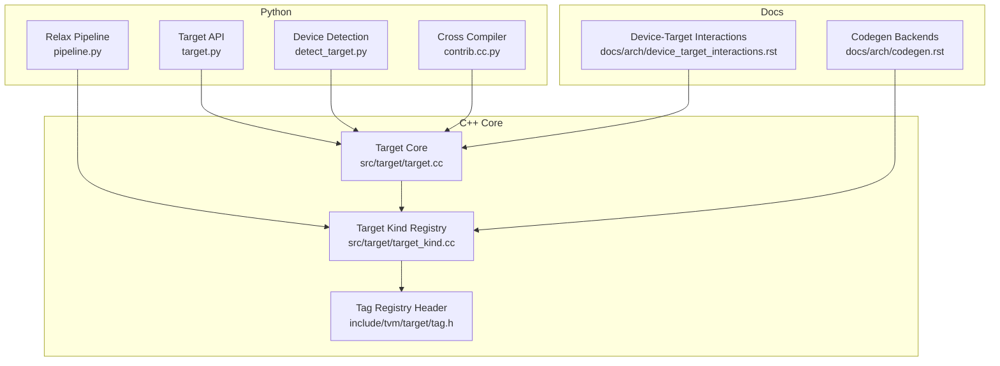
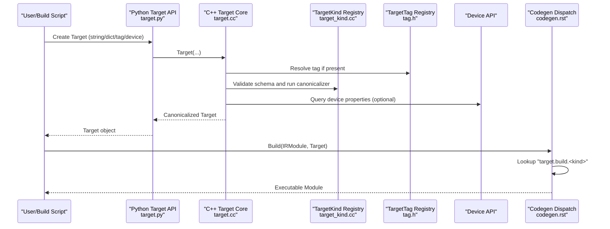
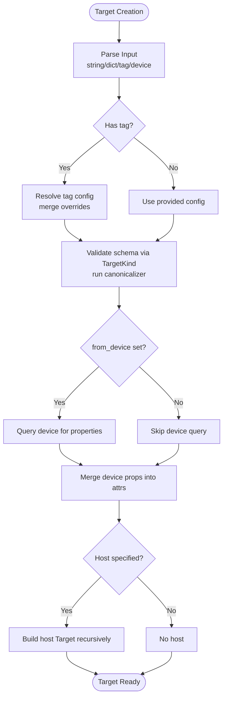
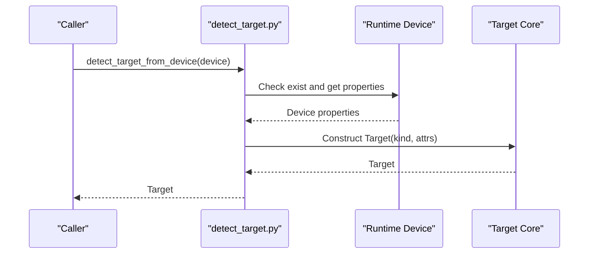
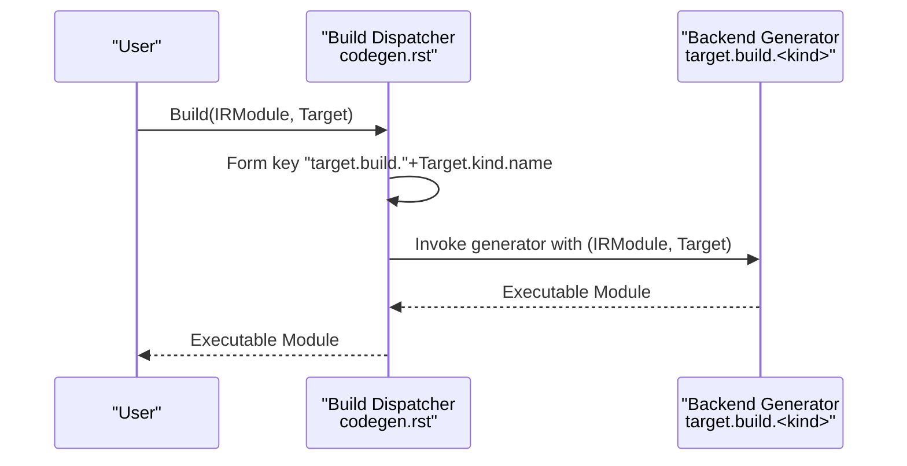
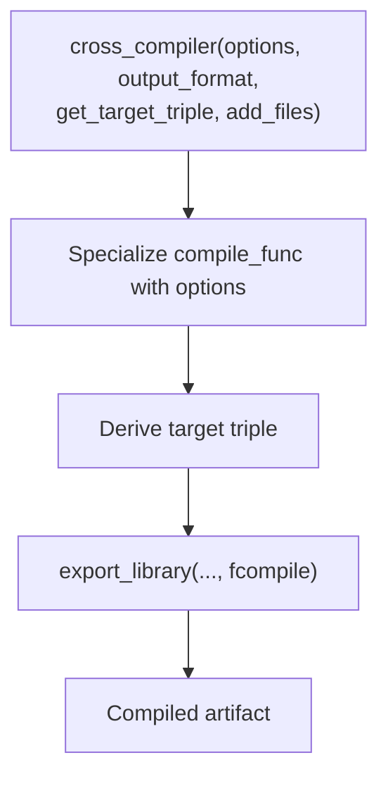
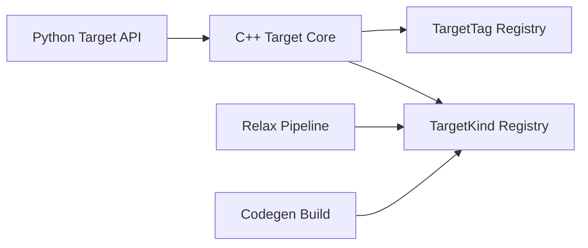

# Target System and Hardware Backends

<cite>
**Referenced Files in This Document**
- [target.py](file://python/tvm/target/target.py)
- [target.cc](file://src/target/target.cc)
- [target_kind.cc](file://src/target/target_kind.cc)
- [detect_target.py](file://python/tvm/target/detect_target.py)
- [tag.h](file://include/tvm/target/tag.h)
- [device_target_interactions.rst](file://docs/arch/device_target_interactions.rst)
- [codegen.rst](file://docs/arch/codegen.rst)
- [pipeline.py](file://python/tvm/relax/pipeline.py)
- [cc.py](file://python/tvm/contrib/cc.py)
- [DetectTargetTriple.cmake](file://3rdparty/tvm-ffi/cmake/Utils/DetectTargetTriple.cmake)
- [target_test.cc](file://tests/cpp/target_test.cc)
</cite>

## Table of Contents
1. [Introduction](#introduction)
2. [Project Structure](#project-structure)
3. [Core Components](#core-components)
4. [Architecture Overview](#architecture-overview)
5. [Detailed Component Analysis](#detailed-component-analysis)
6. [Dependency Analysis](#dependency-analysis)
7. [Performance Considerations](#performance-considerations)
8. [Troubleshooting Guide](#troubleshooting-guide)
9. [Conclusion](#conclusion)
10. [Appendices](#appendices)

## Introduction
This document explains TVM’s target system and hardware backend architecture. It covers how targets are configured, how hardware capabilities are detected, how backends are selected, and how the target string format and properties relate to code generation backends. It also documents supported hardware backends (CPU, GPU, mobile, and specialized accelerators), provides examples of target configuration and cross-compilation, and gives guidance for developing new hardware backends and integrating them with existing ones.

## Project Structure
The target system spans Python APIs, C++ core logic, and documentation. Key areas include:
- Python target API and device auto-detection
- C++ target construction, canonicalization, and device property queries
- Target kind registry and attribute schemas
- Tag registry for named target profiles
- Documentation on code generation backends and dispatch
- Cross-compilation utilities and platform triple detection

**Diagram sources**
- [target.py](file://python/tvm/target/target.py)
- [detect_target.py](file://python/tvm/target/detect_target.py)
- [pipeline.py](file://python/tvm/relax/pipeline.py)
- [cc.py](file://python/tvm/contrib/cc.py)
- [target.cc](file://src/target/target.cc)
- [target_kind.cc](file://src/target/target_kind.cc)
- [tag.h](file://include/tvm/target/tag.h)
- [codegen.rst](file://docs/arch/codegen.rst)
- [device_target_interactions.rst](file://docs/arch/device_target_interactions.rst)

**Section sources**
- [target.py](file://python/tvm/target/target.py)
- [target.cc](file://src/target/target.cc)
- [target_kind.cc](file://src/target/target_kind.cc)
- [detect_target.py](file://python/tvm/target/detect_target.py)
- [tag.h](file://include/tvm/target/tag.h)
- [codegen.rst](file://docs/arch/codegen.rst)
- [device_target_interactions.rst](file://docs/arch/device_target_interactions.rst)
- [pipeline.py](file://python/tvm/relax/pipeline.py)
- [cc.py](file://python/tvm/contrib/cc.py)

## Core Components
- Target object: Encapsulates target kind, keys, attributes, and host target. Provides constructors from strings, JSON, tags, and device detection.
- TargetKind registry: Defines valid target kinds (e.g., llvm, cuda, rocm, metal, vulkan, opencl, webgpu, hexagon), their schemas, default keys, and canonicalizers.
- TargetTag registry: Named profiles that resolve to concrete target configurations.
- Device auto-detection: Builds a Target from a runtime Device by querying device properties.
- Code generation dispatch: Selects backend build functions based on target kind.

Key responsibilities:
- Target configuration and validation
- Hardware capability detection and attribute propagation
- Backend selection and code generation integration
- Cross-compilation and platform triple handling

**Section sources**
- [target.py](file://python/tvm/target/target.py)
- [target.cc](file://src/target/target.cc)
- [target_kind.cc](file://src/target/target_kind.cc)
- [detect_target.py](file://python/tvm/target/detect_target.py)
- [tag.h](file://include/tvm/target/tag.h)

## Architecture Overview
The target system orchestrates target creation, canonicalization, and backend selection:

**Diagram sources**
- [target.py](file://python/tvm/target/target.py)
- [target.cc](file://src/target/target.cc)
- [target_kind.cc](file://src/target/target_kind.cc)
- [tag.h](file://include/tvm/target/tag.h)
- [codegen.rst](file://docs/arch/codegen.rst)

## Detailed Component Analysis

### Target Construction and Validation
- Accepts:
  - Literal target string (kind only)
  - JSON configuration string or dict
  - Tag name with optional overrides
  - Device-based detection
- Supports nested host target specification
- Validates against TargetKind schema and runs canonicalizer
- Optionally queries device for properties and merges into attributes

**Diagram sources**
- [target.cc](file://src/target/target.cc)
- [target_kind.cc](file://src/target/target_kind.cc)

**Section sources**
- [target.cc](file://src/target/target.cc)
- [target_test.cc](file://tests/cpp/target_test.cc)

### TargetKind Registry and Attributes
- Registers target kinds with:
  - Default device type
  - Attribute schema (typed options)
  - Default keys (e.g., "cpu", "gpu", "cuda", "metal", "vulkan", "opencl", "hexagon")
  - Target canonicalizer (e.g., CUDA/ROCm/NVPTX version inference)
- Provides:
  - List of available kinds
  - List of kind options and types
  - Kind attribute accessors

Examples of registered kinds and attributes:
- llvm: CPU LLVM backend with fast math flags, opt-level, vector-width, mattr, mcpu, mtriple, mfloat-abi, mabi, jit
- cuda: NVIDIA GPU with arch/sm, thread_warp_size, shared memory, registers, l2 cache, max threads
- rocm: AMD GPU with gfx arch, mtriple, mattr, warp size, limits
- metal: Apple GPU with thread limits and max_function_args
- vulkan/webgpu: GPU with feature flags, limits, and device info
- hexagon: Qualcomm DSP with mattr, mcpu, vtcm-capacity
- opencl: Generic OpenCL with thread limits and image/textures limits

**Section sources**
- [target_kind.cc](file://src/target/target_kind.cc)

### Target Tags
- Named profiles that resolve to concrete target configurations
- Registered via macros and exposed through a registry
- Useful for standardizing device profiles (e.g., vendor/model-specific targets)

**Section sources**
- [tag.h](file://include/tvm/target/tag.h)

### Device Auto-Detection
- Detects target from a runtime Device by:
  - Validating device existence
  - Querying device-specific attributes (e.g., max_threads_per_block, warp_size, arch/version)
  - Returning a Target with kind-specific attributes
- Supported devices: cuda, metal, rocm, vulkan, opencl, cpu

**Diagram sources**
- [detect_target.py](file://python/tvm/target/detect_target.py)
- [target.cc](file://src/target/target.cc)

**Section sources**
- [detect_target.py](file://python/tvm/target/detect_target.py)

### Code Generation Backends and Dispatch
- Build dispatch key: "target.build.<kind>"
- Example backends:
  - llvm → CodeGenCPU (LLVM IR → native)
  - cuda → CodeGenCUDA (CUDA C → PTX/cubin)
  - rocm → CodeGenAMDGPU (LLVM IR → AMDGPU ISA)
  - nvptx → CodeGenNVPTX (LLVM IR → PTX)
  - metal → CodeGenMetal (Metal Shading Language)
  - opencl → CodeGenOpenCL (OpenCL C)
  - vulkan → CodeGenSPIRV (SPIR-V)
  - webgpu → CodeGenWebGPU (WGSL)
  - c → CodeGenCHost (C source)
- Code generators receive the IRModule and Target; they must not query device directly but rely on Target attributes.

**Diagram sources**
- [codegen.rst](file://docs/arch/codegen.rst)

**Section sources**
- [codegen.rst](file://docs/arch/codegen.rst)
- [device_target_interactions.rst](file://docs/arch/device_target_interactions.rst)

### Relax Compilation Pipeline and Backend Selection
- The Relax pipeline selects backend-specific passes and default pipelines based on Target.kind.name and keys (e.g., "adreno" for OpenCL).
- CPU and GPU generics are used when specific backends are not matched.

**Section sources**
- [pipeline.py](file://python/tvm/relax/pipeline.py)

### Cross-Compilation Setup
- Cross compiler helper constructs specialized compilation functions with options and target triples
- Platform triple detection logic handles Android, iOS, Windows, Linux, and FreeBSD

**Diagram sources**
- [cc.py](file://python/tvm/contrib/cc.py)
- [DetectTargetTriple.cmake](file://3rdparty/tvm-ffi/cmake/Utils/DetectTargetTriple.cmake)

**Section sources**
- [cc.py](file://python/tvm/contrib/cc.py)
- [DetectTargetTriple.cmake](file://3rdparty/tvm-ffi/cmake/Utils/DetectTargetTriple.cmake)

## Dependency Analysis
- Python Target API depends on C++ Target core for construction, canonicalization, and device queries
- TargetKind registry defines schemas and canonicalizers that validate and enrich target attributes
- Tag registry enables named target profiles that resolve to concrete configurations
- Code generation backends register build functions keyed by target kind
- Relax pipeline depends on target kind and keys to select backend passes

**Diagram sources**
- [target.py](file://python/tvm/target/target.py)
- [target.cc](file://src/target/target.cc)
- [target_kind.cc](file://src/target/target_kind.cc)
- [tag.h](file://include/tvm/target/tag.h)
- [pipeline.py](file://python/tvm/relax/pipeline.py)
- [codegen.rst](file://docs/arch/codegen.rst)

**Section sources**
- [target.py](file://python/tvm/target/target.py)
- [target.cc](file://src/target/target.cc)
- [target_kind.cc](file://src/target/target_kind.cc)
- [tag.h](file://include/tvm/target/tag.h)
- [pipeline.py](file://python/tvm/relax/pipeline.py)
- [codegen.rst](file://docs/arch/codegen.rst)

## Performance Considerations
- Prefer using target tags or device auto-detection to avoid manual tuning and reduce misconfiguration risk.
- Use canonicalizers to infer device-specific attributes (e.g., CUDA arch, ROCm gfx) to enable optimal code generation.
- For CPU targets, leverage vector-width and fast-math flags judiciously to balance accuracy and performance.
- For GPU targets, set thread_warp_size, max_threads_per_block, and shared memory limits aligned with the device to improve occupancy and memory throughput.
- Avoid querying device properties at build time; rely on Target attributes to keep builds deterministic and portable.

## Troubleshooting Guide
Common issues and resolutions:
- Unknown target kind: Ensure the kind is registered and spelled correctly; use Target.list_kinds() to enumerate available kinds.
- Invalid target JSON: Validate the configuration against the kind’s schema; canonicalizers may reject unsupported combinations.
- Device not detected: Confirm the device exists and drivers are installed; TVM must be compiled with the corresponding runtime.
- Missing backend build function: Verify that a generator is registered under "target.build.<kind>".
- Cross-compilation triple mismatch: Ensure the target triple matches the target platform; use cross_compiler helpers and platform triple detection.

**Section sources**
- [target.cc](file://src/target/target.cc)
- [target_kind.cc](file://src/target/target_kind.cc)
- [detect_target.py](file://python/tvm/target/detect_target.py)
- [target_test.cc](file://tests/cpp/target_test.cc)

## Conclusion
TVM’s target system provides a robust, extensible framework for configuring targets, detecting hardware capabilities, and selecting appropriate backends. By leveraging target kinds, tags, canonicalizers, and device auto-detection, developers can reliably compile high-performance kernels across diverse hardware backends. The documented patterns for cross-compilation and backend integration enable seamless deployment from CPU to specialized accelerators.

## Appendices

### Target String Format and Properties
- Target kinds: llvm, cuda, rocm, metal, vulkan, opencl, webgpu, hexagon, c, composite, ext_dev, test
- Common attributes:
  - llvm: mattr, mcpu, mtriple, mfloat-abi, mabi, opt-level, fast-math*, jit, vector-width
  - cuda: arch/sm, thread_warp_size, max_threads_per_block, max_shared_memory_per_block, registers_per_block, l2_cache_size_bytes
  - rocm: mcpu, mtriple, mattr, thread_warp_size, max_threads_per_block, max_shared_memory_per_block
  - metal: max_threads_per_block, max_shared_memory_per_block, thread_warp_size, max_function_args
  - vulkan/webgpu: feature flags, limits, device info, thread_warp_size
  - hexagon: mattr, mcpu, mtriple, llvm-options, num-cores, vtcm-capacity
  - c: mcpu, march, alignment attributes
- Keys: default keys per kind (e.g., "cpu","gpu","cuda","metal","vulkan","opencl","hexagon")

**Section sources**
- [target_kind.cc](file://src/target/target_kind.cc)
- [target.py](file://python/tvm/target/target.py)

### Supported Hardware Backends
- CPU: llvm (x86, ARM, RISC-V), c host
- GPU: cuda, rocm, metal, vulkan, opencl, webgpu
- Mobile/DSP: hexagon
- Composite/External: composite, ext_dev

**Section sources**
- [target_kind.cc](file://src/target/target_kind.cc)
- [codegen.rst](file://docs/arch/codegen.rst)

### Examples of Target Configuration
- From tag with overrides: use a tag profile and override attributes (e.g., changing l2 cache size)
- From device: detect target from a runtime Device to capture device-specific properties
- From JSON: provide a structured configuration with kind, keys, and attributes
- With host: specify a separate host target for cross-compilation scenarios

**Section sources**
- [target.py](file://python/tvm/target/target.py)
- [detect_target.py](file://python/tvm/target/detect_target.py)

### Cross-Compilation Setup
- Use cross_compiler to specialize compilation with options and target triples
- Derive platform triple using platform-specific logic for Android/iOS/Windows/Linux/FreeBSD

**Section sources**
- [cc.py](file://python/tvm/contrib/cc.py)
- [DetectTargetTriple.cmake](file://3rdparty/tvm-ffi/cmake/Utils/DetectTargetTriple.cmake)

### Developing New Hardware Backends
- Register a new target kind with schema and default keys
- Implement a target canonicalizer to infer device-specific attributes
- Register a codegen build function under "target.build.<kind>"
- Integrate with Relax pipeline by extending backend selection logic if needed

**Section sources**
- [target_kind.cc](file://src/target/target_kind.cc)
- [codegen.rst](file://docs/arch/codegen.rst)
- [device_target_interactions.rst](file://docs/arch/device_target_interactions.rst)