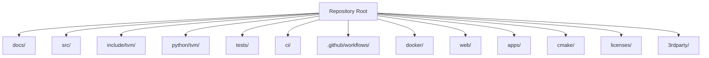
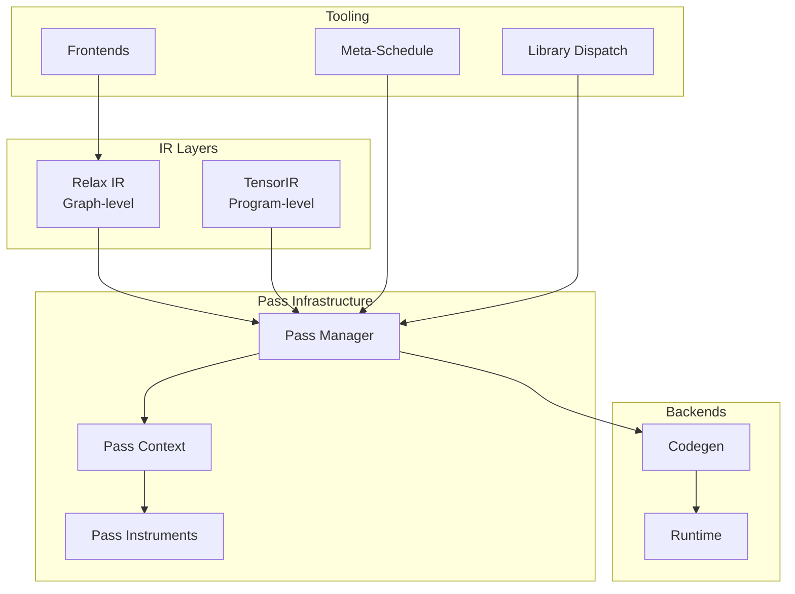
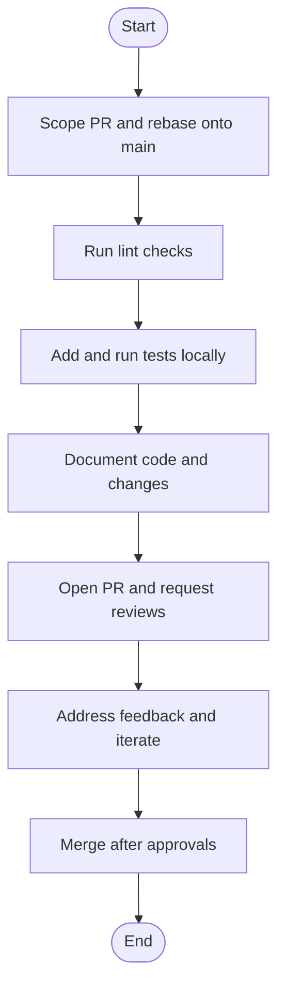
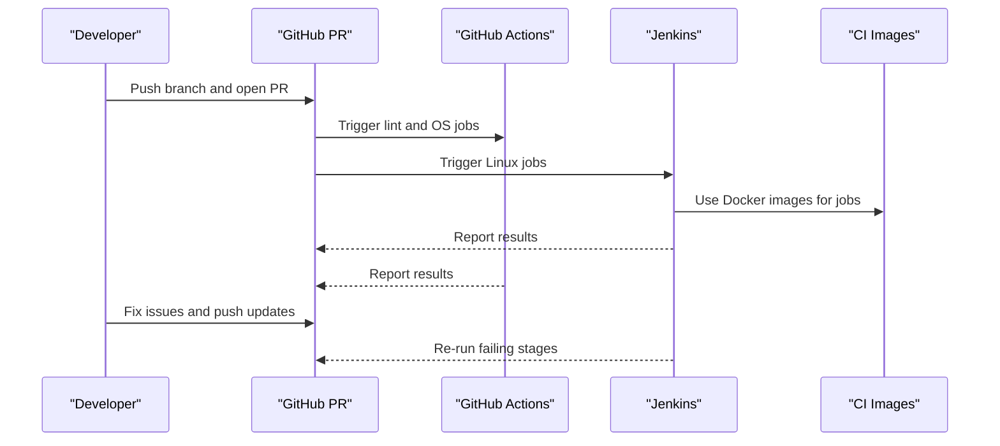
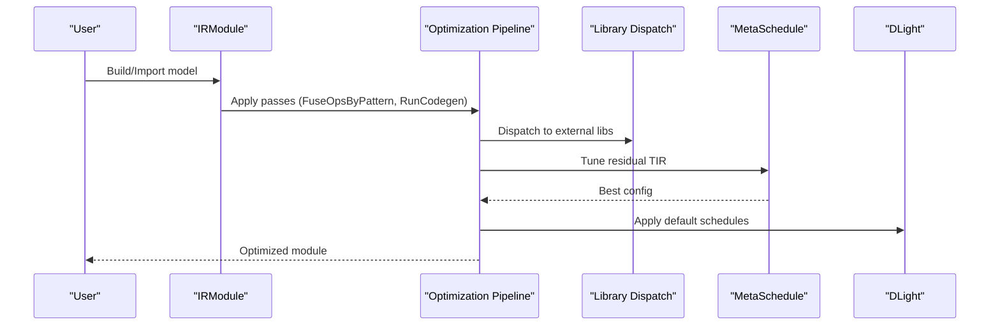
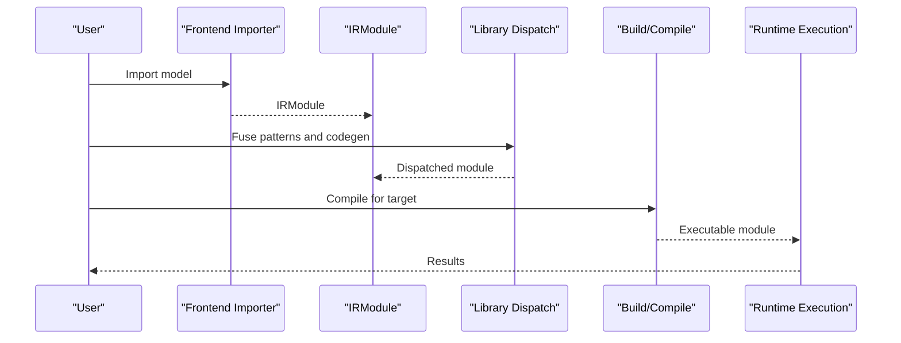
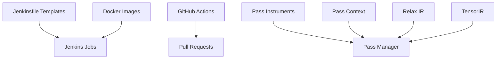

# Development Guide

<cite>
**Referenced Files in This Document**
- [README.md](file://README.md)
- [CONTRIBUTORS.md](file://CONTRIBUTORS.md)
- [docs/contribute/index.rst](file://docs/contribute/index.rst)
- [docs/contribute/git_howto.rst](file://docs/contribute/git_howto.rst)
- [docs/contribute/code_review.rst](file://docs/contribute/code_review.rst)
- [docs/contribute/pull_request.rst](file://docs/contribute/pull_request.rst)
- [docs/contribute/ci.rst](file://docs/contribute/ci.rst)
- [ci/README.md](file://ci/README.md)
- [.github/workflows/lint.yml](file://.github/workflows/lint.yml)
- [docs/arch/pass_infra.rst](file://docs/arch/pass_infra.rst)
- [docs/how_to/tutorials/customize_opt.py](file://docs/how_to/tutorials/customize_opt.py)
- [docs/how_to/tutorials/import_model.py](file://docs/how_to/tutorials/import_model.py)
- [docs/deep_dive/tensor_ir/learning.rst](file://docs/deep_dive/tensor_ir/learning.rst)
- [docs/deep_dive/relax/learning.rst](file://docs/deep_dive/relax/learning.rst)
</cite>

## Table of Contents
1. [Introduction](#introduction)
2. [Project Structure](#project-structure)
3. [Core Components](#core-components)
4. [Architecture Overview](#architecture-overview)
5. [Detailed Component Analysis](#detailed-component-analysis)
6. [Dependency Analysis](#dependency-analysis)
7. [Performance Considerations](#performance-considerations)
8. [Troubleshooting Guide](#troubleshooting-guide)
9. [Conclusion](#conclusion)
10. [Appendices](#appendices)

## Introduction
This development guide provides a comprehensive, contributor-centric roadmap for working on Apache TVM. It covers contribution workflow, code review processes, development environment setup, pass development framework, custom optimization creation, target backend development, testing strategies, continuous integration, quality assurance, debugging and profiling, performance analysis, and deep dive tutorials for understanding TVM internals. Practical examples are included to implement custom passes, extend the IR system, and add new hardware backends.

## Project Structure
TVM is organized as a multi-language, multi-component project with:
- Documentation and tutorials under docs/, covering contribution guidelines, architecture, deep dives, and how-to guides.
- Source code under src/ and include/tvm/ for core compiler internals.
- Python bindings under python/tvm/.
- Runtime implementations under src/runtime/.
- Tests under tests/ and CI under ci/ and .github/workflows/.



[No sources needed since this diagram shows conceptual structure, not direct code mapping]

## Core Components
- Contribution and governance: Community structure, committer model, and contributor recognition.
- Contribution workflow: Git usage tips, PR lifecycle, commit message guidelines, and testing prerequisites.
- Code review: Principles, quality factors, consensus building, and reviewer responsibilities.
- Continuous integration: Jenkins and GitHub Actions, Docker-based environments, and CI maintenance.
- Pass infrastructure: Pass manager design, pass context, pass instruments, and Python/C++ APIs.
- IR system deep dive: Relax and TensorIR abstractions, TVMScript, and cross-level optimization.

**Section sources**
- [README.md:18-44](file://README.md#L18-L44)
- [CONTRIBUTORS.md:18-244](file://CONTRIBUTORS.md#L18-L244)
- [docs/contribute/index.rst:18-53](file://docs/contribute/index.rst#L18-L53)

## Architecture Overview
The TVM architecture centers on composable IR modules and passes:
- IR layers: Relax (graph-level) and TensorIR (program-level) with TVMScript dialects.
- Pass infrastructure: Hierarchical pass managers (module/function/sequential) with pass context and instrumentation.
- Backends: Target-specific code generation and runtime integration.
- Tooling: Frontends for model import, meta-scheduling, and library dispatch.



**Diagram sources**
- [docs/arch/pass_infra.rst:20-120](file://docs/arch/pass_infra.rst#L20-L120)
- [docs/deep_dive/relax/learning.rst:20-80](file://docs/deep_dive/relax/learning.rst#L20-L80)
- [docs/deep_dive/tensor_ir/learning.rst:20-85](file://docs/deep_dive/tensor_ir/learning.rst#L20-L85)

**Section sources**
- [docs/arch/pass_infra.rst:20-120](file://docs/arch/pass_infra.rst#L20-L120)
- [docs/deep_dive/relax/learning.rst:20-80](file://docs/deep_dive/relax/learning.rst#L20-L80)
- [docs/deep_dive/tensor_ir/learning.rst:20-85](file://docs/deep_dive/tensor_ir/learning.rst#L20-L85)

## Detailed Component Analysis

### Contribution Workflow and Code Review
- Git usage: Resolve conflicts with main, squash commits, reset to main, recover commits, and understand force push implications.
- PR lifecycle: Scope PRs, rebase onto main, pass lint checks, add tests, document changes, request reviews, and follow commit message guidelines.
- Code review: Trust, respectful communication, architectural consistency, test coverage, API documentation, readability, and consensus building.



**Diagram sources**
- [docs/contribute/git_howto.rst:30-144](file://docs/contribute/git_howto.rst#L30-L144)
- [docs/contribute/pull_request.rst:25-173](file://docs/contribute/pull_request.rst#L25-L173)
- [docs/contribute/code_review.rst:28-222](file://docs/contribute/code_review.rst#L28-L222)

**Section sources**
- [docs/contribute/git_howto.rst:30-144](file://docs/contribute/git_howto.rst#L30-L144)
- [docs/contribute/pull_request.rst:25-173](file://docs/contribute/pull_request.rst#L25-L173)
- [docs/contribute/code_review.rst:28-222](file://docs/contribute/code_review.rst#L28-L222)

### Continuous Integration and Testing
- CI systems: Jenkins for Linux (merge-blocking) and GitHub Actions for linting and OS-specific jobs.
- Local reproduction: Use tests/scripts/ci.py to replicate CI environments and run unit tests.
- Docker images: Nightly builds and staging promotion for CI images; update tags and validate via PRs.
- Flakiness handling: Report issues, mark tests xfail when necessary, and follow maintainer runbooks.



**Diagram sources**
- [docs/contribute/ci.rst:26-52](file://docs/contribute/ci.rst#L26-L52)
- [ci/README.md:50-99](file://ci/README.md#L50-L99)
- [.github/workflows/lint.yml](file://.github/workflows/lint.yml)

**Section sources**
- [docs/contribute/ci.rst:26-250](file://docs/contribute/ci.rst#L26-L250)
- [ci/README.md:50-99](file://ci/README.md#L50-L99)

### Pass Development Framework
- Pass manager design: PassInfo, PassContext, and hierarchical pass constructs (module, function, sequential).
- Pass instruments: Timing, printing, and dumping IR for debugging and profiling.
- Python/C++ APIs: Create and register passes, configure pass context, and instrument pass execution.

```mermaid
classDiagram
class PassInfoNode {
+int opt_level
+string name
+bool traceable
+Array<string> required
}
class PassContextNode {
+int opt_level
+Array<string> required_pass
+Array<string> disabled_pass
+Optional<DiagnosticContext> diag_ctx
+Map<string, Any> config
+Array<instrument : : PassInstrument> instruments
}
class PassNode {
+Info() PassInfo
+operator()(Module, PassContext) Module
}
class ModulePassNode {
+PassInfo pass_info
+function<Module(Module, PassContext)> pass_func
}
class FunctionPassNode {
+PassInfo pass_info
+function<Function(Function, Module, PassContext)> pass_func
}
class SequentialPassNode {
+PassInfo pass_info
+Array<Pass> passes
}
PassNode <|-- ModulePassNode
PassNode <|-- FunctionPassNode
PassNode <|-- SequentialPassNode
PassContextNode --> PassNode : "controls execution"
```

**Diagram sources**
- [docs/arch/pass_infra.rst:70-337](file://docs/arch/pass_infra.rst#L70-L337)

**Section sources**
- [docs/arch/pass_infra.rst:70-337](file://docs/arch/pass_infra.rst#L70-L337)

### Custom Optimization Creation
- Compose IRModule optimizations with existing pipelines.
- Dispatch library kernels (e.g., CUBLAS) via pattern fusion and codegen.
- Tune residual computation with MetaSchedule and apply default schedules via DLight.



**Diagram sources**
- [docs/how_to/tutorials/customize_opt.py:120-205](file://docs/how_to/tutorials/customize_opt.py#L120-L205)

**Section sources**
- [docs/how_to/tutorials/customize_opt.py:120-205](file://docs/how_to/tutorials/customize_opt.py#L120-L205)

### Extending the IR System
- Relax abstraction: High-level graph-level operations, dataflow blocks, and destination-passing calls to TensorIR.
- TensorIR abstraction: Low-level loops, buffers, and sblocks with axis semantics for correctness and scheduling.


**Diagram sources**
- [docs/deep_dive/relax/learning.rst:160-277](file://docs/deep_dive/relax/learning.rst#L160-L277)
- [docs/deep_dive/tensor_ir/learning.rst:60-256](file://docs/deep_dive/tensor_ir/learning.rst#L60-L256)

**Section sources**
- [docs/deep_dive/relax/learning.rst:160-277](file://docs/deep_dive/relax/learning.rst#L160-L277)
- [docs/deep_dive/tensor_ir/learning.rst:60-256](file://docs/deep_dive/tensor_ir/learning.rst#L60-L256)

### Adding New Hardware Backends
- Frontend import: Import models from PyTorch, ONNX, and TFLite with verification.
- Backend dispatch: Fuse patterns and run codegen to dispatch to external libraries (e.g., CUDA/CUBLAS).
- Scheduling: Apply default schedules via DLight rules for GPU kernels.



**Diagram sources**
- [docs/how_to/tutorials/import_model.py:42-208](file://docs/how_to/tutorials/import_model.py#L42-L208)
- [docs/how_to/tutorials/customize_opt.py:120-205](file://docs/how_to/tutorials/customize_opt.py#L120-L205)

**Section sources**
- [docs/how_to/tutorials/import_model.py:42-208](file://docs/how_to/tutorials/import_model.py#L42-L208)
- [docs/how_to/tutorials/customize_opt.py:120-205](file://docs/how_to/tutorials/customize_opt.py#L120-L205)

## Dependency Analysis
- CI dependencies: Jenkins templates, Docker images, and GitHub Actions workflows.
- Pass infrastructure: Pass manager, pass context, and pass instruments integrate across Python and C++.
- IR system: Relax and TensorIR share common transformation and instrumentation mechanisms.



**Diagram sources**
- [ci/README.md:50-99](file://ci/README.md#L50-L99)
- [docs/arch/pass_infra.rst:102-155](file://docs/arch/pass_infra.rst#L102-L155)

**Section sources**
- [ci/README.md:50-99](file://ci/README.md#L50-L99)
- [docs/arch/pass_infra.rst:102-155](file://docs/arch/pass_infra.rst#L102-L155)

## Performance Considerations
- Use pass instruments for timing and IR inspection to identify bottlenecks.
- Apply DLight default schedules for balanced compilation time and performance.
- Leverage MetaSchedule tuning for target-specific kernels.
- Prefer vectorized operations and minimize redundant memory copies.

[No sources needed since this section provides general guidance]

## Troubleshooting Guide
- CI failures: Inspect Jenkins logs, reproduce with local CI scripts, and report issues with links to jobs and commits.
- Flaky tests: Use xfail with strict=False and link to issues; maintainers coordinate re-enabling.
- Docker image updates: Follow nightly builds and staging promotion; update tags and validate via PRs.

**Section sources**
- [docs/contribute/ci.rst:54-250](file://docs/contribute/ci.rst#L54-L250)
- [ci/README.md:65-99](file://ci/README.md#L65-L99)

## Conclusion
This guide consolidates TVM’s contribution workflow, pass infrastructure, IR abstractions, and CI practices into a practical blueprint for contributors. By following the documented processes—scope PRs, adhere to code review principles, leverage pass instruments, and utilize CI—you can efficiently develop and ship high-quality contributions that align with TVM’s architecture and community standards.

[No sources needed since this section summarizes without analyzing specific files]

## Appendices

### Appendix A: Quick Reference for Contributors
- Contribution index: [docs/contribute/index.rst](file://docs/contribute/index.rst)
- Git how-to: [docs/contribute/git_howto.rst](file://docs/contribute/git_howto.rst)
- Code review: [docs/contribute/code_review.rst](file://docs/contribute/code_review.rst)
- Pull request: [docs/contribute/pull_request.rst](file://docs/contribute/pull_request.rst)
- CI guide: [docs/contribute/ci.rst](file://docs/contribute/ci.rst)
- CI overview: [ci/README.md](file://ci/README.md)
- Pass infra: [docs/arch/pass_infra.rst](file://docs/arch/pass_infra.rst)
- IR learning (Relax): [docs/deep_dive/relax/learning.rst](file://docs/deep_dive/relax/learning.rst)
- IR learning (TensorIR): [docs/deep_dive/tensor_ir/learning.rst](file://docs/deep_dive/tensor_ir/learning.rst)
- Custom optimization tutorial: [docs/how_to/tutorials/customize_opt.py](file://docs/how_to/tutorials/customize_opt.py)
- Model import tutorial: [docs/how_to/tutorials/import_model.py](file://docs/how_to/tutorials/import_model.py)