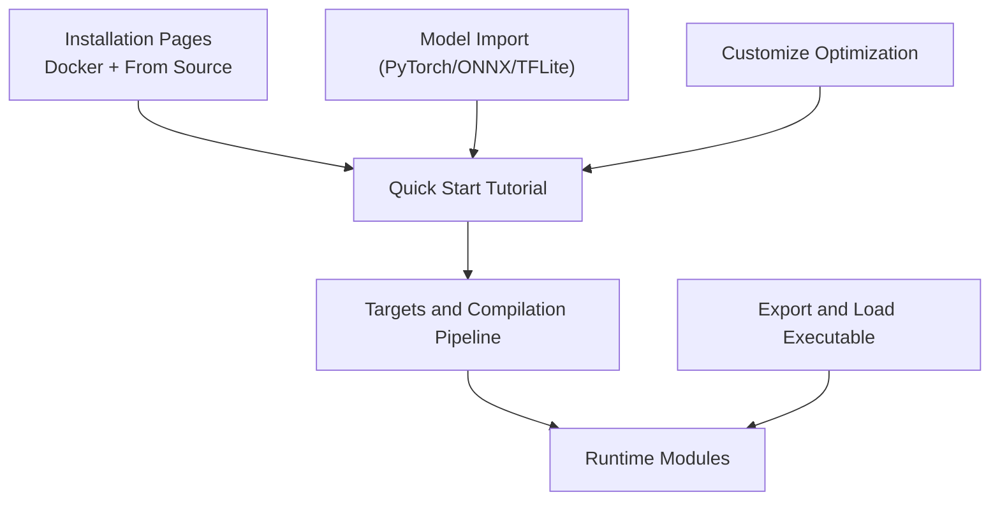
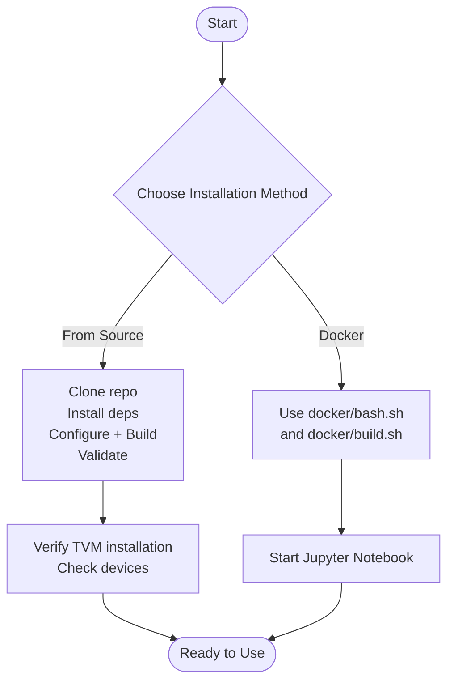
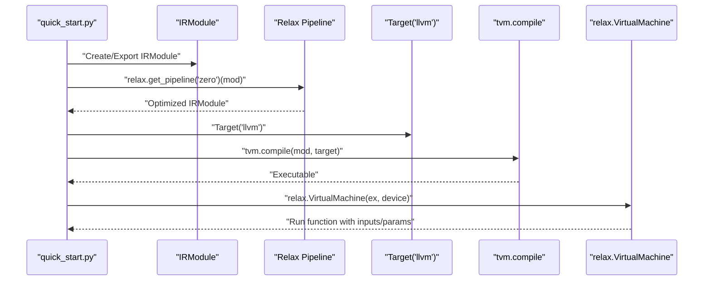
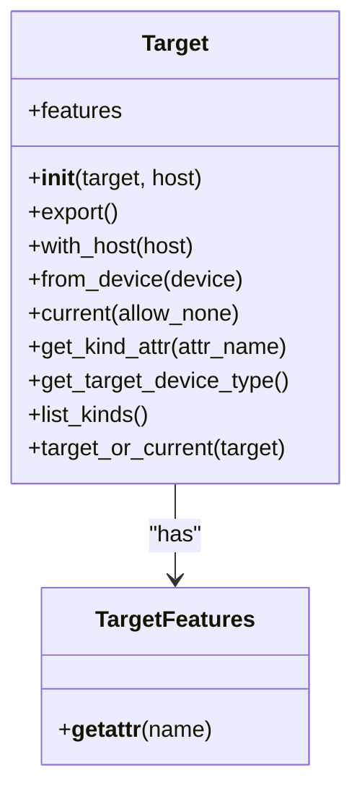
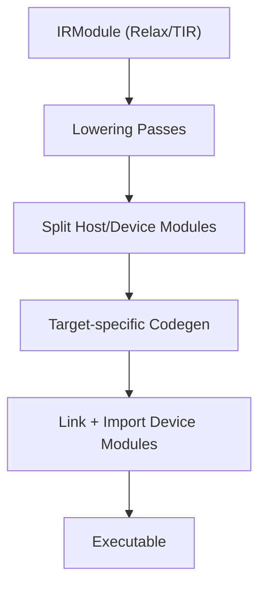
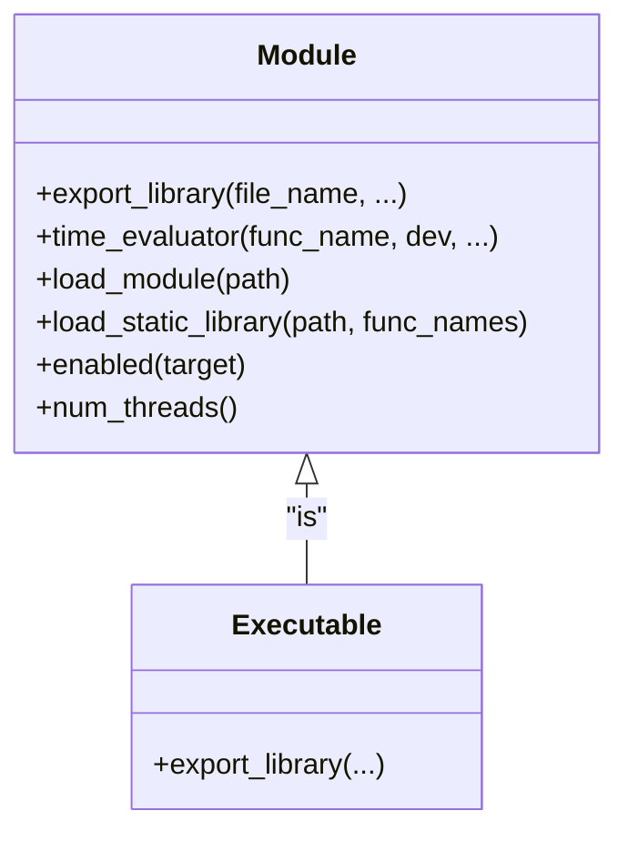
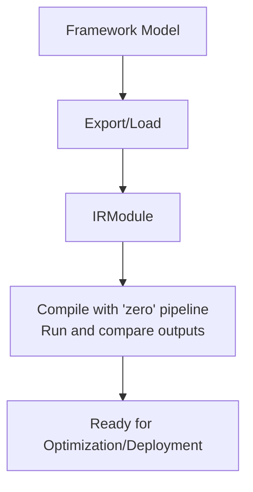
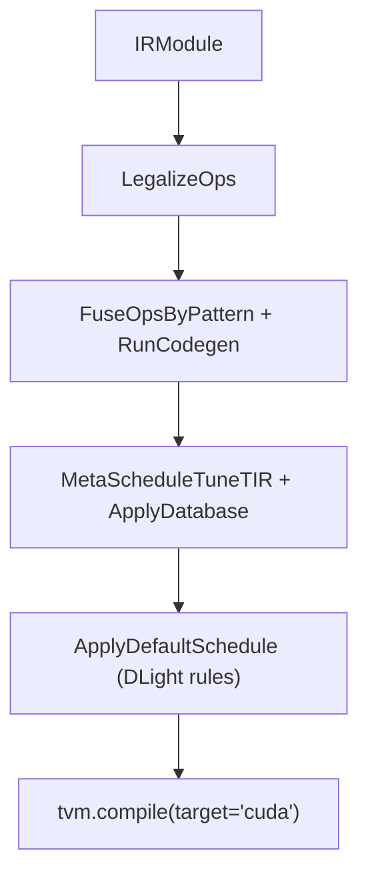
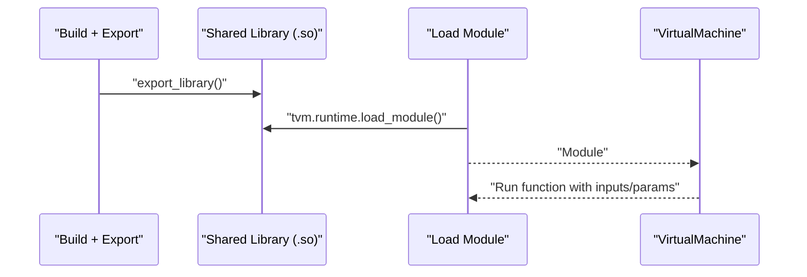
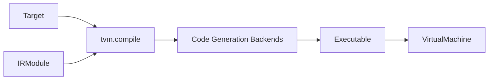

# Getting Started

<cite>
**Referenced Files in This Document**
- [README.md](file://README.md)
- [docs/get_started/overview.rst](file://docs/get_started/overview.rst)
- [docs/get_started/tutorials/quick_start.py](file://docs/get_started/tutorials/quick_start.py)
- [docs/install/index.rst](file://docs/install/index.rst)
- [docs/install/docker.rst](file://docs/install/docker.rst)
- [docs/install/from_source.rst](file://docs/install/from_source.rst)
- [python/tvm/target/__init__.py](file://python/tvm/target/__init__.py)
- [python/tvm/target/target.py](file://python/tvm/target/target.py)
- [python/tvm/driver/build_module.py](file://python/tvm/driver/build_module.py)
- [python/tvm/runtime/module.py](file://python/tvm/runtime/module.py)
- [docs/arch/codegen.rst](file://docs/arch/codegen.rst)
- [docs/arch/runtime.rst](file://docs/arch/runtime.rst)
- [docs/how_to/tutorials/import_model.py](file://docs/how_to/tutorials/import_model.py)
- [docs/how_to/tutorials/customize_opt.py](file://docs/how_to/tutorials/customize_opt.py)
- [docs/how_to/tutorials/export_and_load_executable.py](file://docs/how_to/tutorials/export_and_load_executable.py)
</cite>

## Table of Contents
1. [Introduction](#introduction)
2. [Project Structure](#project-structure)
3. [Core Components](#core-components)
4. [Architecture Overview](#architecture-overview)
5. [Detailed Component Analysis](#detailed-component-analysis)
6. [Dependency Analysis](#dependency-analysis)
7. [Performance Considerations](#performance-considerations)
8. [Troubleshooting Guide](#troubleshooting-guide)
9. [Conclusion](#conclusion)
10. [Appendices](#appendices)

## Introduction
This guide helps new users install Apache TVM, understand the basic workflow from model import to deployment, and learn essential concepts such as targets, compilation pipeline, and runtime modules. It includes step-by-step installation instructions across Linux, macOS, Windows, Docker, and build-from-source, plus practical examples from the quick start tutorial and related how-to guides.

## Project Structure
This getting started guide focuses on:
- Installation pages for Docker and building from source
- Quick start tutorial demonstrating end-to-end compilation and execution
- Concepts documentation for targets, compilation pipeline, and runtime modules
- Practical how-to tutorials for model import, optimization customization, and exporting executables



[No sources needed since this diagram shows conceptual workflow, not actual code structure]

**Section sources**
- [README.md:35-39](file://README.md#L35-L39)
- [docs/get_started/overview.rst:42-66](file://docs/get_started/overview.rst#L42-L66)

## Core Components
- Targets: Describe device kinds, attributes, and configuration for compilation and runtime dispatch.
- Compilation pipeline: Transforms IRModules via Relax/TIR passes and code generation to produce runtime executables.
- Runtime modules: Loaded into a virtual machine for execution across devices and languages.

Key references:
- Target construction and attributes: [python/tvm/target/__init__.py:20-32](file://python/tvm/target/__init__.py#L20-L32), [python/tvm/target/target.py:51-159](file://python/tvm/target/target.py#L51-L159)
- Unified compilation entrypoint: [python/tvm/driver/build_module.py:72-113](file://python/tvm/driver/build_module.py#L72-L113)
- Runtime module and VM: [python/tvm/runtime/module.py:107-113](file://python/tvm/runtime/module.py#L107-L113), [python/tvm/runtime/module.py:418-462](file://python/tvm/runtime/module.py#L418-L462)

**Section sources**
- [python/tvm/target/__init__.py:20-32](file://python/tvm/target/__init__.py#L20-L32)
- [python/tvm/target/target.py:51-159](file://python/tvm/target/target.py#L51-L159)
- [python/tvm/driver/build_module.py:72-113](file://python/tvm/driver/build_module.py#L72-L113)
- [python/tvm/runtime/module.py:107-113](file://python/tvm/runtime/module.py#L107-L113)

## Architecture Overview
The TVM compilation and execution pipeline integrates model import, optimization, code generation, and runtime execution.

```mermaid
sequenceDiagram
    participant User as "User Script"
    participant Import as "Model Import"
    participant Opt as "Optimization Pipeline"
    participant Build as "Compilation (tvm.compile)"
    participant Codegen as "Code Generation"
    participant RT as "Runtime Module"
    participant VM as "Virtual Machine"
    
    User->>Import: "Create/Import IRModule"
    Import-->>User: "IRModule"
    User->>Opt: "Apply passes (Relax/TIR)"
    Opt-->>User: "Optimized IRModule"
    User->>Build: "tvm.compile(mod, target)"
    Build->>Codegen: "Lower + Target-specific codegen"
    Codegen-->>Build: "Executable"
    Build-->>RT: "Runtime Module"
    User->>VM: "relax.VirtualMachine(ex, device)"
    VM-->>User: "Execute functions"
```

**Diagram sources**
- [docs/arch/codegen.rst:33-62](file://docs/arch/codegen.rst#L33-L62)
- [python/tvm/driver/build_module.py:72-113](file://python/tvm/driver/build_module.py#L72-L113)
- [python/tvm/runtime/module.py:107-113](file://python/tvm/runtime/module.py#L107-L113)

**Section sources**
- [docs/arch/codegen.rst:33-62](file://docs/arch/codegen.rst#L33-L62)
- [docs/get_started/overview.rst:42-66](file://docs/get_started/overview.rst#L42-L66)

## Detailed Component Analysis

### Installation Options
Choose one of the following installation paths:
- Docker: Use provided scripts to run a development environment with optional Jupyter notebooks.
- Build from source: Configure dependencies, build TVM, and validate installation.



**Diagram sources**
- [docs/install/docker.rst:35-83](file://docs/install/docker.rst#L35-L83)
- [docs/install/from_source.rst:83-228](file://docs/install/from_source.rst#L83-L228)

**Section sources**
- [docs/install/docker.rst:20-83](file://docs/install/docker.rst#L20-L83)
- [docs/install/from_source.rst:20-353](file://docs/install/from_source.rst#L20-L353)

### Quick Start Workflow
Follow the quick start tutorial to import a model, optimize, build, and run on a target device.



**Diagram sources**
- [docs/get_started/tutorials/quick_start.py:105-148](file://docs/get_started/tutorials/quick_start.py#L105-L148)

**Section sources**
- [docs/get_started/tutorials/quick_start.py:75-148](file://docs/get_started/tutorials/quick_start.py#L75-L148)

### Targets and Target Configuration
Targets describe device kinds, attributes, and host/target combinations. They are used to select code generation backends and control compilation.



**Diagram sources**
- [python/tvm/target/target.py:51-233](file://python/tvm/target/target.py#L51-L233)
- [python/tvm/target/__init__.py:20-32](file://python/tvm/target/__init__.py#L20-L32)

**Section sources**
- [python/tvm/target/target.py:51-159](file://python/tvm/target/target.py#L51-L159)
- [python/tvm/target/__init__.py:20-32](file://python/tvm/target/__init__.py#L20-L32)

### Compilation Pipeline and Code Generation
TVM lowers and compiles IRModules to runtime modules via target-specific code generation.



**Diagram sources**
- [docs/arch/codegen.rst:42-62](file://docs/arch/codegen.rst#L42-L62)

**Section sources**
- [docs/arch/codegen.rst:20-307](file://docs/arch/codegen.rst#L20-L307)

### Runtime Modules and Virtual Machines
Runtime modules encapsulate compiled code and expose callable functions. The virtual machine loads executables and runs functions with inputs and parameters.



**Diagram sources**
- [python/tvm/runtime/module.py:107-113](file://python/tvm/runtime/module.py#L107-L113)
- [python/tvm/runtime/module.py:418-462](file://python/tvm/runtime/module.py#L418-L462)

**Section sources**
- [python/tvm/runtime/module.py:107-113](file://python/tvm/runtime/module.py#L107-L113)
- [python/tvm/runtime/module.py:418-462](file://python/tvm/runtime/module.py#L418-L462)

### Model Import and Verification
Import models from PyTorch, ONNX, or TFLite, verify outputs against the original framework, and prepare for optimization and deployment.



**Diagram sources**
- [docs/how_to/tutorials/import_model.py:86-208](file://docs/how_to/tutorials/import_model.py#L86-L208)

**Section sources**
- [docs/how_to/tutorials/import_model.py:42-208](file://docs/how_to/tutorials/import_model.py#L42-L208)

### Custom Optimization and Scheduling
Compose passes for library dispatch, auto-tuning, and DLight scheduling to optimize performance.



**Diagram sources**
- [docs/how_to/tutorials/customize_opt.py:121-204](file://docs/how_to/tutorials/customize_opt.py#L121-L204)

**Section sources**
- [docs/how_to/tutorials/customize_opt.py:96-204](file://docs/how_to/tutorials/customize_opt.py#L96-L204)

### Exporting and Loading Executables
Export compiled executables to shared libraries, load them at runtime, and run inference with parameters.



**Diagram sources**
- [docs/how_to/tutorials/export_and_load_executable.py:116-187](file://docs/how_to/tutorials/export_and_load_executable.py#L116-L187)

**Section sources**
- [docs/how_to/tutorials/export_and_load_executable.py:110-310](file://docs/how_to/tutorials/export_and_load_executable.py#L110-L310)

## Dependency Analysis
High-level dependencies among core components:



**Diagram sources**
- [python/tvm/driver/build_module.py:72-113](file://python/tvm/driver/build_module.py#L72-L113)
- [docs/arch/codegen.rst:64-115](file://docs/arch/codegen.rst#L64-L115)
- [python/tvm/runtime/module.py:107-113](file://python/tvm/runtime/module.py#L107-L113)

**Section sources**
- [python/tvm/driver/build_module.py:72-113](file://python/tvm/driver/build_module.py#L72-L113)
- [docs/arch/codegen.rst:64-115](file://docs/arch/codegen.rst#L64-L115)
- [python/tvm/runtime/module.py:107-113](file://python/tvm/runtime/module.py#L107-L113)

## Performance Considerations
- Choose appropriate targets and host configurations for your device.
- Use DLight scheduling rules for fast compilation and balanced performance.
- Leverage auto-tuning for device-specific kernels when targeting GPUs.
- Export executables with parameters separated for flexibility and faster reconfiguration.

[No sources needed since this section provides general guidance]

## Troubleshooting Guide
Common installation and setup issues:
- Docker networking on macOS: Bind Jupyter to 0.0.0.0 and replace container hostname with localhost when opening the notebook URL.
- macOS Docker bridge network: Port 8888 is exposed; ensure the URL uses localhost.
- Build-from-source validation: Confirm TVM Python package location, library linkage, build options, and device detection.
- Windows-specific notes: Use forward slashes in paths and ensure Visual Studio and Python are on PATH.

**Section sources**
- [docs/install/docker.rst:57-66](file://docs/install/docker.rst#L57-L66)
- [docs/install/from_source.rst:179-228](file://docs/install/from_source.rst#L179-L228)
- [docs/install/from_source.rst:258-324](file://docs/install/from_source.rst#L258-L324)

## Conclusion
You have learned how to install TVM via Docker or build-from-source, how to import and verify models, how to optimize and compile them using targets and pipelines, and how to run them with runtime modules and virtual machines. Use the quick start tutorial and related how-to guides to explore advanced optimization and deployment strategies.

[No sources needed since this section summarizes without analyzing specific files]

## Appendices

### Quick Start: Step-by-Step
- Import or construct a model to form an IRModule.
- Apply a pipeline (e.g., zero) for optimization.
- Build with a target (e.g., llvm).
- Load into a virtual machine and run with inputs and parameters.

**Section sources**
- [docs/get_started/tutorials/quick_start.py:75-148](file://docs/get_started/tutorials/quick_start.py#L75-L148)

### Essential Concepts Glossary
- Target: Describes device kind, attributes, and host/target pairing for compilation.
- Pipeline: A sequence of passes transforming IRModules for graph and tensor program optimizations.
- Executable/Runtime Module: A compiled artifact exposing callable functions for execution.
- Virtual Machine: A runtime interface to load executables and invoke functions.

**Section sources**
- [python/tvm/target/target.py:51-159](file://python/tvm/target/target.py#L51-L159)
- [python/tvm/driver/build_module.py:72-113](file://python/tvm/driver/build_module.py#L72-L113)
- [python/tvm/runtime/module.py:107-113](file://python/tvm/runtime/module.py#L107-L113)