# Backend Development

<cite>
**Referenced Files in This Document**
- [device_api.h](file://include/tvm/runtime/device_api.h)
- [device_api.cc](file://src/runtime/device_api.cc)
- [cpu_device_api.cc](file://src/runtime/cpu_device_api.cc)
- [cuda_device_api.cc](file://src/runtime/cuda/cuda_device_api.cc)
- [opencl_device_api.cc](file://src/runtime/opencl/opencl_device_api.cc)
- [workspace_pool.h](file://src/runtime/workspace_pool.h)
- [workspace_pool.cc](file://src/runtime/workspace_pool.cc)
- [module.h](file://include/tvm/runtime/module.h)
- [module.cc](file://src/runtime/module.cc)
- [__init__.py](file://python/tvm/runtime/__init__.py)
- [support.py](file://python/tvm/support.py)
- [test_transform_lower_gpu_ipc_alloc_storage.py](file://tests/python/relax/test_transform_lower_gpu_ipc_alloc_storage.py)
- [rpc_endpoint.h](file://src/runtime/rpc/rpc_endpoint.h)
- [server.py](file://python/tvm/rpc/server.py)
- [logging_test.cc](file://tests/cpp/runtime/logging_test.cc)
</cite>

## Table of Contents
1. [Introduction](#introduction)
2. [Project Structure](#project-structure)
3. [Core Components](#core-components)
4. [Architecture Overview](#architecture-overview)
5. [Detailed Component Analysis](#detailed-component-analysis)
6. [Dependency Analysis](#dependency-analysis)
7. [Performance Considerations](#performance-considerations)
8. [Troubleshooting Guide](#troubleshooting-guide)
9. [Conclusion](#conclusion)
10. [Appendices](#appendices)

## Introduction
This document explains how to develop custom TVM backends by detailing the DeviceAPI interface, backend registration mechanisms, runtime integration patterns, lifecycle management, memory allocation strategies, function dispatch, plugin architecture, dynamic loading, and inter-backend communication. It includes step-by-step guidance for implementing a new device backend, testing strategies, performance optimization techniques, common pitfalls, debugging approaches, and best practices.

## Project Structure
TVM organizes backend functionality primarily under:
- Runtime headers and core implementations for device abstraction and module system
- Device-specific implementations for CPU, CUDA, OpenCL, and others
- Workspace pooling utilities for efficient temporary allocations
- Python runtime bindings and helpers for module loading and function exposure

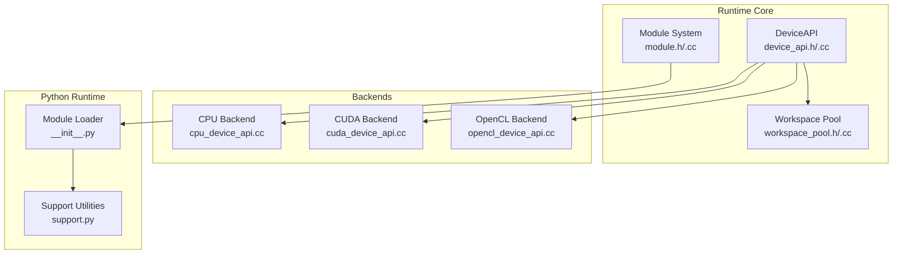

**Diagram sources**
- [device_api.h](file://include/tvm/runtime/device_api.h)
- [device_api.cc](file://src/runtime/device_api.cc)
- [cpu_device_api.cc](file://src/runtime/cpu_device_api.cc)
- [cuda_device_api.cc](file://src/runtime/cuda/cuda_device_api.cc)
- [opencl_device_api.cc](file://src/runtime/opencl/opencl_device_api.cc)
- [workspace_pool.h](file://src/runtime/workspace_pool.h)
- [workspace_pool.cc](file://src/runtime/workspace_pool.cc)
- [module.h](file://include/tvm/runtime/module.h)
- [module.cc](file://src/runtime/module.cc)
- [__init__.py](file://python/tvm/runtime/__init__.py)
- [support.py](file://python/tvm/support.py)

**Section sources**
- [device_api.h](file://include/tvm/runtime/device_api.h)
- [device_api.cc](file://src/runtime/device_api.cc)
- [cpu_device_api.cc](file://src/runtime/cpu_device_api.cc)
- [cuda_device_api.cc](file://src/runtime/cuda/cuda_device_api.cc)
- [opencl_device_api.cc](file://src/runtime/opencl/opencl_device_api.cc)
- [workspace_pool.h](file://src/runtime/workspace_pool.h)
- [workspace_pool.cc](file://src/runtime/workspace_pool.cc)
- [module.h](file://include/tvm/runtime/module.h)
- [module.cc](file://src/runtime/module.cc)
- [__init__.py](file://python/tvm/runtime/__init__.py)
- [support.py](file://python/tvm/support.py)

## Core Components
- DeviceAPI: Abstract interface for device memory management, attributes, streams, and workspace allocation. It defines the contract that all backends must implement.
- DeviceAPIManager: Central registry that resolves a Device to a DeviceAPI instance via global function lookup keyed by device type.
- WorkspacePool: Thread-local pooling utility to efficiently allocate and reuse temporary buffers aligned to page boundaries.
- Module System: Provides runtime module loading, function dispatch, and packed function wrappers for cross-language interoperability.
- Python Runtime Bindings: Expose device creation, module loading, and runtime utilities to Python.

Key responsibilities:
- Lifecycle: Device selection, attribute queries, allocation/free, stream management, synchronization.
- Memory: Data space allocation with alignment/type hints, workspace pooling, and scoped memory layouts (e.g., OpenCL textures).
- Dispatch: Global function registry for backend registration and packed function invocation.

**Section sources**
- [device_api.h](file://include/tvm/runtime/device_api.h)
- [device_api.cc](file://src/runtime/device_api.cc)
- [workspace_pool.h](file://src/runtime/workspace_pool.h)
- [workspace_pool.cc](file://src/runtime/workspace_pool.cc)
- [module.h](file://include/tvm/runtime/module.h)
- [module.cc](file://src/runtime/module.cc)
- [__init__.py](file://python/tvm/runtime/__init__.py)

## Architecture Overview
The backend architecture centers on a pluggable DeviceAPI that is discovered via a global registry. Backends register themselves by exporting a global function named by a convention, allowing the runtime to fetch the appropriate DeviceAPI implementation for a given device type. Modules expose functions to Python and C/C++ through the packed function interface.

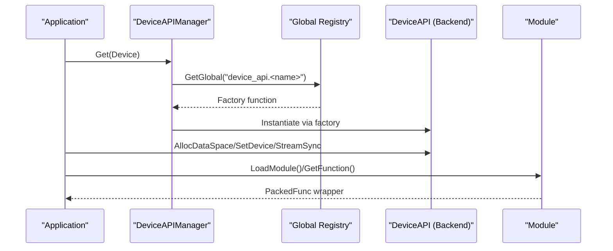

**Diagram sources**
- [device_api.cc](file://src/runtime/device_api.cc)
- [module.h](file://include/tvm/runtime/module.h)
- [module.cc](file://src/runtime/module.cc)

## Detailed Component Analysis

### DeviceAPI Interface
DeviceAPI defines the contract for device backends:
- Device selection and attribute queries
- Data space allocation/free with alignment/type hints
- Stream creation/sync and cross-stream synchronization
- Workspace allocation/free optimized for temporary buffers
- Copy operations supporting shape-aware layouts and cross-device transfers

Implementation patterns:
- Attribute queries return typed values or strings depending on the attribute kind.
- Allocation honors alignment and type hints; some backends require specific alignments.
- Streams enable asynchronous operations; synchronization ensures correctness.
- Workspace pooling reduces overhead for frequent small allocations.

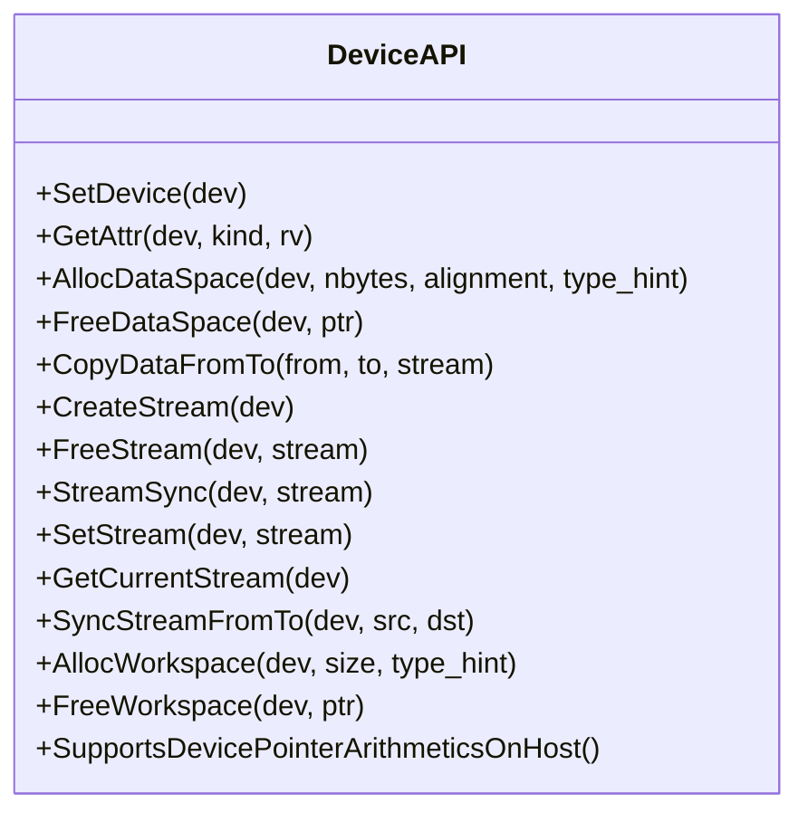

**Diagram sources**
- [device_api.h](file://include/tvm/runtime/device_api.h)

**Section sources**
- [device_api.h](file://include/tvm/runtime/device_api.h)

### Backend Registration Mechanisms
Backends register themselves by exporting a global function named according to a convention. The DeviceAPIManager looks up this function and instantiates the backend’s DeviceAPI.

- Convention: global function name "device_api.<lowercase_device_name>"
- Example registrations:
  - CPU: "device_api.cpu"
  - CUDA: "device_api.cuda" and "device_api.cuda_host"
  - OpenCL: "device_api.opencl" plus specialized allocation helpers

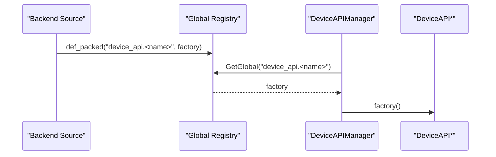

**Diagram sources**
- [cpu_device_api.cc](file://src/runtime/cpu_device_api.cc)
- [cuda_device_api.cc](file://src/runtime/cuda/cuda_device_api.cc)
- [opencl_device_api.cc](file://src/runtime/opencl/opencl_device_api.cc)
- [device_api.cc](file://src/runtime/device_api.cc)

**Section sources**
- [cpu_device_api.cc](file://src/runtime/cpu_device_api.cc)
- [cuda_device_api.cc](file://src/runtime/cuda/cuda_device_api.cc)
- [opencl_device_api.cc](file://src/runtime/opencl/opencl_device_api.cc)
- [device_api.cc](file://src/runtime/device_api.cc)

### Runtime Integration Patterns
- Module loading and function dispatch:
  - Python runtime exposes module loading and function retrieval.
  - Packed functions wrap C/C++ callable objects for cross-language use.
- Python support utilities:
  - Helpers to add functions to modules and manage entry names.

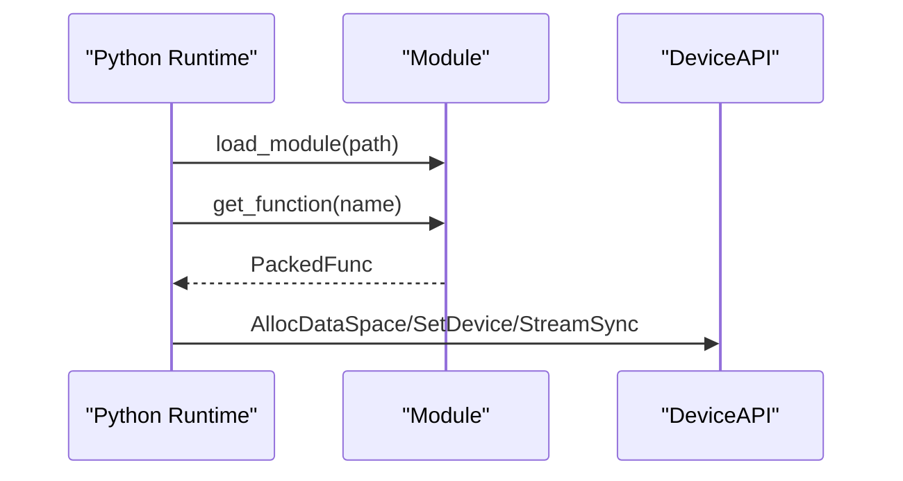

**Diagram sources**
- [module.h](file://include/tvm/runtime/module.h)
- [module.cc](file://src/runtime/module.cc)
- [__init__.py](file://python/tvm/runtime/__init__.py)
- [support.py](file://python/tvm/support.py)

**Section sources**
- [module.h](file://include/tvm/runtime/module.h)
- [module.cc](file://src/runtime/module.cc)
- [__init__.py](file://python/tvm/runtime/__init__.py)
- [support.py](file://python/tvm/support.py)

### Backend Lifecycle Management
Lifecycle encompasses device selection, attribute discovery, allocation, streaming, and cleanup:
- Device selection: SetDevice selects the target device context.
- Attributes: GetAttr queries device capabilities and properties.
- Streams: CreateStream, SetStream, GetCurrentStream, StreamSync, SyncStreamFromTo manage asynchronous execution.
- Cleanup: FreeDataSpace and FreeWorkspace release resources.

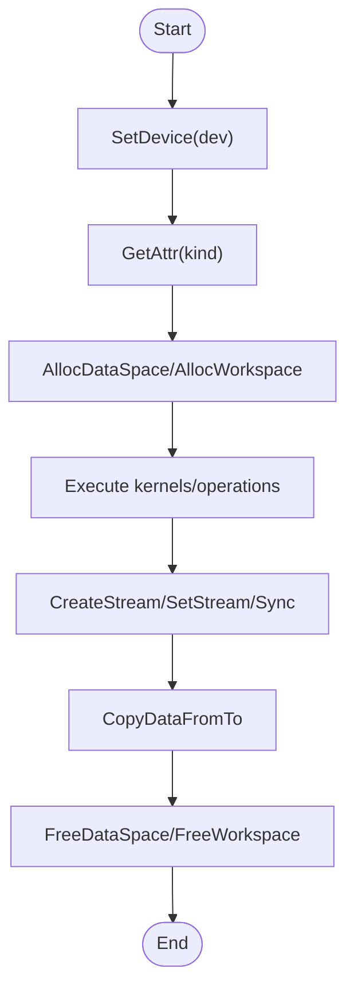

**Diagram sources**
- [device_api.h](file://include/tvm/runtime/device_api.h)

**Section sources**
- [device_api.h](file://include/tvm/runtime/device_api.h)

### Memory Allocation Strategies
- Data space allocation:
  - Backends honor alignment and type hints; some enforce specific alignments (e.g., CUDA).
  - Shape-aware backends (e.g., OpenCL) compute sizes considering memory scopes and layouts.
- Workspace pooling:
  - Page-aligned allocation with a free list and smallest-fit policy.
  - Thread-local pools reduce contention and accelerate repeated allocations.
- Scoped memory:
  - OpenCL supports texture-backed images with row pitch and alignment considerations.

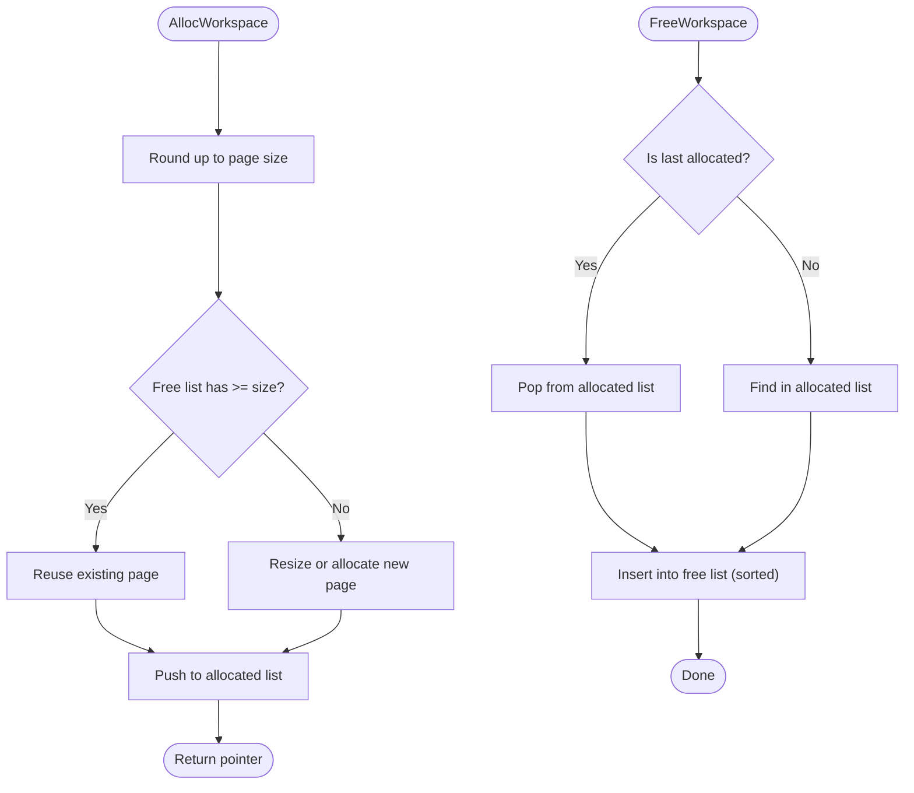

**Diagram sources**
- [workspace_pool.cc](file://src/runtime/workspace_pool.cc)
- [workspace_pool.h](file://src/runtime/workspace_pool.h)
- [opencl_device_api.cc](file://src/runtime/opencl/opencl_device_api.cc)

**Section sources**
- [workspace_pool.cc](file://src/runtime/workspace_pool.cc)
- [workspace_pool.h](file://src/runtime/workspace_pool.h)
- [opencl_device_api.cc](file://src/runtime/opencl/opencl_device_api.cc)

### Function Dispatch Mechanisms
- Global function registry:
  - Backends register factories and utilities under global names.
  - Runtime resolves functions by name and invokes them via packed function wrappers.
- Module vtable:
  - Modules expose functions via a vtable mechanism that adapts member function calls to packed signatures.

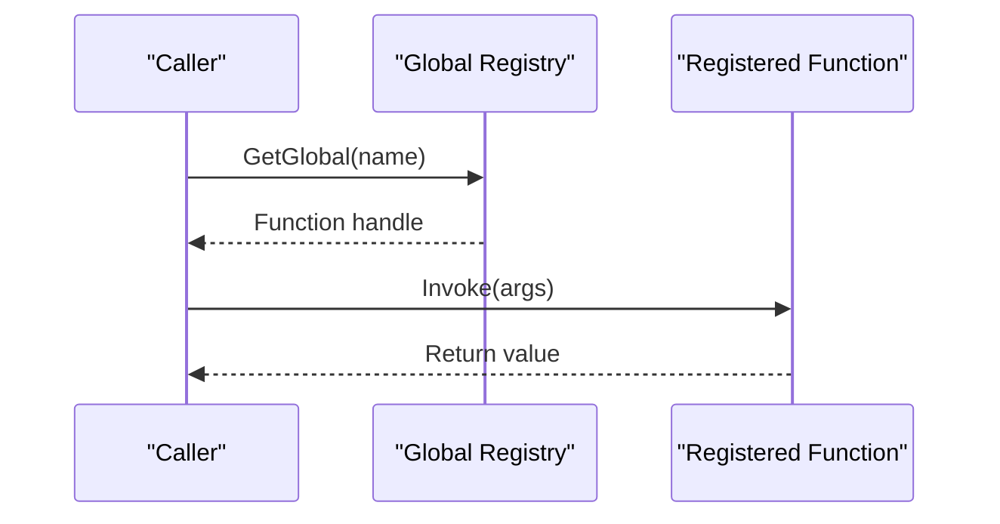

**Diagram sources**
- [device_api.cc](file://src/runtime/device_api.cc)
- [module.h](file://include/tvm/runtime/module.h)
- [module.cc](file://src/runtime/module.cc)

**Section sources**
- [device_api.cc](file://src/runtime/device_api.cc)
- [module.h](file://include/tvm/runtime/module.h)
- [module.cc](file://src/runtime/module.cc)

### Plugin Architecture and Dynamic Loading
- Plugin discovery:
  - Backends register via global functions; the runtime locates them automatically.
- JIT/dynamic library:
  - Some components integrate with JIT systems for dynamic symbol resolution and lifecycle management.
- Python module loading:
  - Python runtime loads modules and exposes device and tensor constructors.

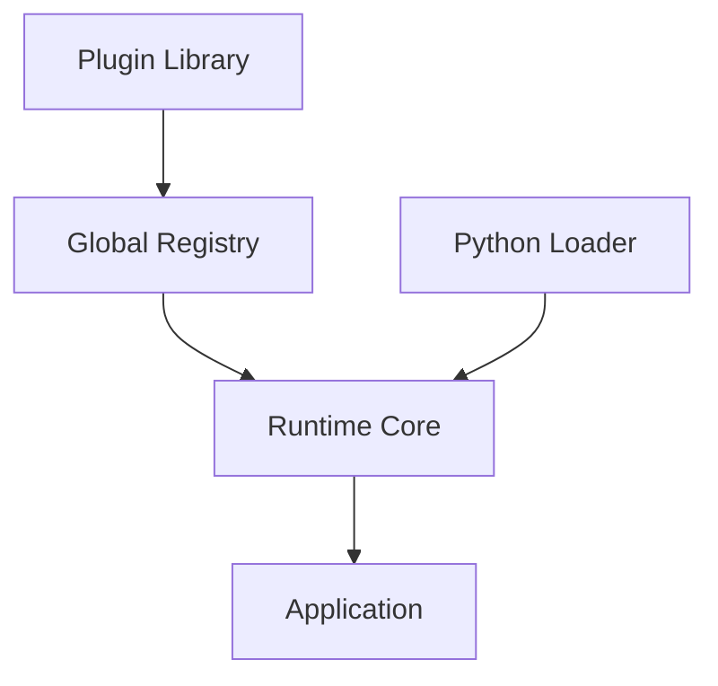

**Diagram sources**
- [device_api.cc](file://src/runtime/device_api.cc)
- [module.cc](file://src/runtime/module.cc)
- [__init__.py](file://python/tvm/runtime/__init__.py)

**Section sources**
- [device_api.cc](file://src/runtime/device_api.cc)
- [module.cc](file://src/runtime/module.cc)
- [__init__.py](file://python/tvm/runtime/__init__.py)

### Inter-Backend Communication
- Cross-device copies:
  - DeviceAPI supports copying between devices and hosts, with backend-specific implementations (e.g., CUDA peer-to-peer, OpenCL buffer/image conversions).
- Stream synchronization:
  - SyncStreamFromTo creates events to synchronize between streams of the same device type.
- RPC integration:
  - Remote devices are represented with masks; RPC endpoints translate device handles across sessions.

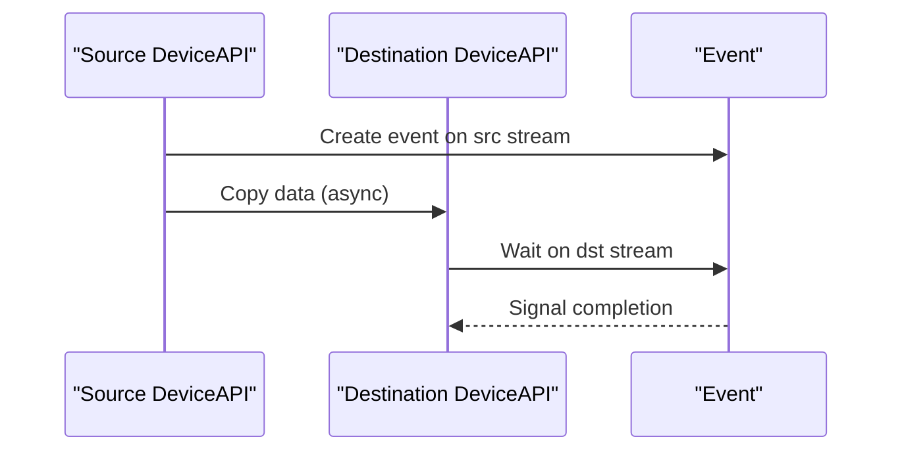

**Diagram sources**
- [device_api.h](file://include/tvm/runtime/device_api.h)
- [cuda_device_api.cc](file://src/runtime/cuda/cuda_device_api.cc)
- [opencl_device_api.cc](file://src/runtime/opencl/opencl_device_api.cc)
- [rpc_endpoint.h](file://src/runtime/rpc/rpc_endpoint.h)

**Section sources**
- [device_api.h](file://include/tvm/runtime/device_api.h)
- [cuda_device_api.cc](file://src/runtime/cuda/cuda_device_api.cc)
- [opencl_device_api.cc](file://src/runtime/opencl/opencl_device_api.cc)
- [rpc_endpoint.h](file://src/runtime/rpc/rpc_endpoint.h)

### Step-by-Step Guide: Implementing a New Device Backend
1. Define a class derived from DeviceAPI and implement required methods:
   - SetDevice, GetAttr, AllocDataSpace, FreeDataSpace, CopyDataFromTo
   - Stream management: CreateStream, FreeStream, StreamSync, SetStream, GetCurrentStream, SyncStreamFromTo
   - Workspace: AllocWorkspace, FreeWorkspace
2. Register the backend:
   - Export a global function named "device_api.<lowercase_device_name>" that returns a DeviceAPI instance.
3. Integrate with the module system:
   - Optionally register packed functions for runtime utilities.
4. Test:
   - Verify device existence and attributes via GetAttr.
   - Exercise allocation, copy, and stream synchronization.
   - Validate workspace pooling behavior.
5. Optimize:
   - Align allocations to backend-specific boundaries.
   - Use workspace pooling for temporary buffers.
   - Minimize stream synchronization overhead.

**Section sources**
- [device_api.h](file://include/tvm/runtime/device_api.h)
- [cpu_device_api.cc](file://src/runtime/cpu_device_api.cc)
- [cuda_device_api.cc](file://src/runtime/cuda/cuda_device_api.cc)
- [opencl_device_api.cc](file://src/runtime/opencl/opencl_device_api.cc)

### Testing Strategies
- Unit-level:
  - Validate attribute queries and device existence.
  - Test allocation/free round trips and alignment constraints.
  - Verify stream synchronization semantics.
- Integration-level:
  - Cross-device copy correctness and performance.
  - Module loading and function dispatch through Python runtime.
- Regression-level:
  - Use existing tests as references for expected behavior (e.g., GPU IPC storage lowering).

**Section sources**
- [logging_test.cc](file://tests/cpp/runtime/logging_test.cc)
- [test_transform_lower_gpu_ipc_alloc_storage.py](file://tests/python/relax/test_transform_lower_gpu_ipc_alloc_storage.py)

### Performance Optimization Techniques
- Prefer workspace pooling for frequent small allocations.
- Align allocations to page boundaries and backend-specific alignment requirements.
- Minimize host-device synchronization; batch operations where possible.
- Use streams for concurrency; synchronize only when necessary.
- Leverage backend-specific features (e.g., CUDA managed memory, OpenCL images) for specialized layouts.

[No sources needed since this section provides general guidance]

## Dependency Analysis
The following diagram shows key dependencies among core components:

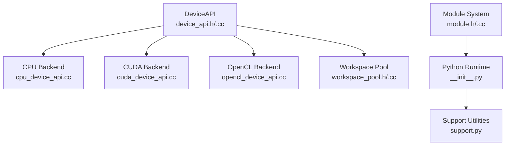

**Diagram sources**
- [device_api.h](file://include/tvm/runtime/device_api.h)
- [device_api.cc](file://src/runtime/device_api.cc)
- [cpu_device_api.cc](file://src/runtime/cpu_device_api.cc)
- [cuda_device_api.cc](file://src/runtime/cuda/cuda_device_api.cc)
- [opencl_device_api.cc](file://src/runtime/opencl/opencl_device_api.cc)
- [workspace_pool.h](file://src/runtime/workspace_pool.h)
- [workspace_pool.cc](file://src/runtime/workspace_pool.cc)
- [module.h](file://include/tvm/runtime/module.h)
- [module.cc](file://src/runtime/module.cc)
- [__init__.py](file://python/tvm/runtime/__init__.py)
- [support.py](file://python/tvm/support.py)

**Section sources**
- [device_api.h](file://include/tvm/runtime/device_api.h)
- [device_api.cc](file://src/runtime/device_api.cc)
- [cpu_device_api.cc](file://src/runtime/cpu_device_api.cc)
- [cuda_device_api.cc](file://src/runtime/cuda/cuda_device_api.cc)
- [opencl_device_api.cc](file://src/runtime/opencl/opencl_device_api.cc)
- [workspace_pool.h](file://src/runtime/workspace_pool.h)
- [workspace_pool.cc](file://src/runtime/workspace_pool.cc)
- [module.h](file://include/tvm/runtime/module.h)
- [module.cc](file://src/runtime/module.cc)
- [__init__.py](file://python/tvm/runtime/__init__.py)
- [support.py](file://python/tvm/support.py)

## Performance Considerations
- Use workspace pooling to amortize allocation costs and reduce fragmentation.
- Align buffers to page boundaries and backend-specific alignment requirements.
- Prefer asynchronous operations with streams; minimize synchronization points.
- Choose memory scopes and layouts suited to the backend (e.g., OpenCL images) to exploit hardware features.

[No sources needed since this section provides general guidance]

## Troubleshooting Guide
Common issues and remedies:
- Device not found or attribute unavailable:
  - Confirm backend registration and that the device exists.
  - Use GetAttr with kExist to probe availability.
- Allocation failures:
  - Check alignment and type hints; ensure sufficient memory.
  - For CUDA, verify device selection and free memory.
- Stream synchronization problems:
  - Ensure proper event creation and wait semantics.
  - Use SyncStreamFromTo to synchronize streams on the same device type.
- Logging and diagnostics:
  - Use runtime logs to capture device and memory state.
- RPC device mismatches:
  - Verify device masks and session indices when working across RPC boundaries.

**Section sources**
- [logging_test.cc](file://tests/cpp/runtime/logging_test.cc)
- [device_api.cc](file://src/runtime/device_api.cc)
- [cuda_device_api.cc](file://src/runtime/cuda/cuda_device_api.cc)
- [opencl_device_api.cc](file://src/runtime/opencl/opencl_device_api.cc)
- [rpc_endpoint.h](file://src/runtime/rpc/rpc_endpoint.h)

## Conclusion
Developing a TVM backend hinges on implementing the DeviceAPI contract, registering a global factory, integrating with the module system, and leveraging workspace pooling and streams for performance. By following the patterns demonstrated by CPU, CUDA, and OpenCL backends, you can build robust, testable, and efficient device integrations that plug seamlessly into TVM’s runtime.

## Appendices
- Backend registration examples:
  - CPU: "device_api.cpu"
  - CUDA: "device_api.cuda", "device_api.cuda_host"
  - OpenCL: "device_api.opencl" plus allocation helpers
- Python runtime integration:
  - Module loading and function retrieval
  - Device constructors and tensor creation

**Section sources**
- [cpu_device_api.cc](file://src/runtime/cpu_device_api.cc)
- [cuda_device_api.cc](file://src/runtime/cuda/cuda_device_api.cc)
- [opencl_device_api.cc](file://src/runtime/opencl/opencl_device_api.cc)
- [module.h](file://include/tvm/runtime/module.h)
- [module.cc](file://src/runtime/module.cc)
- [__init__.py](file://python/tvm/runtime/__init__.py)