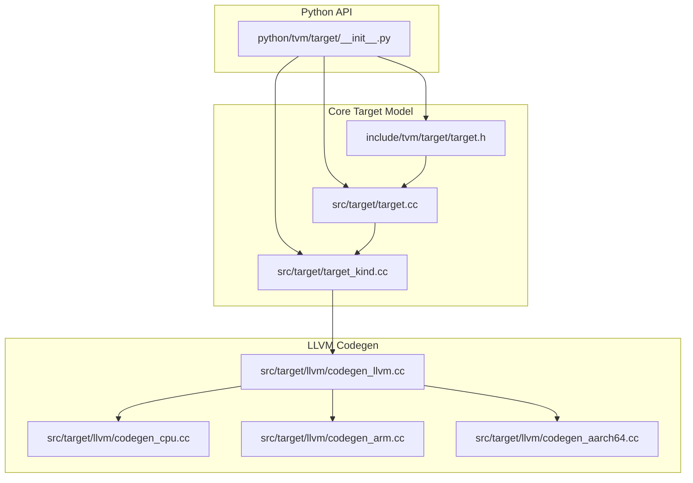
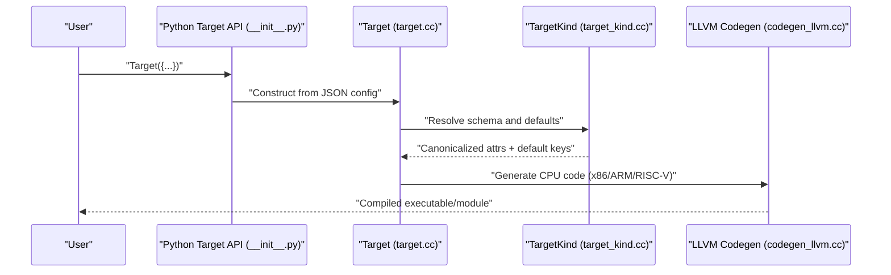
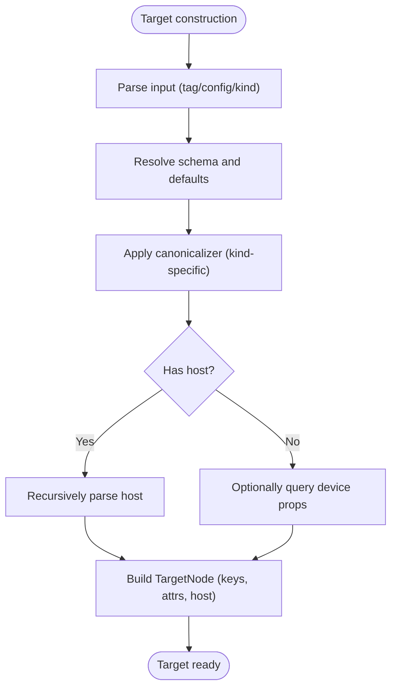
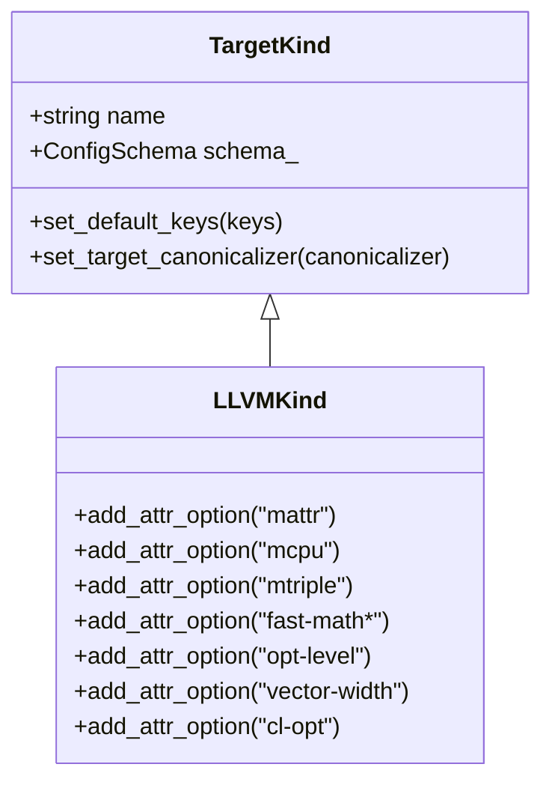
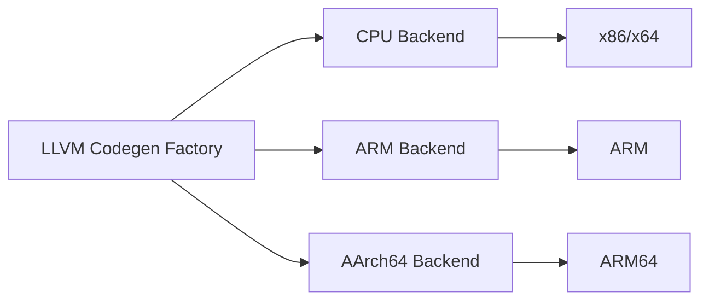
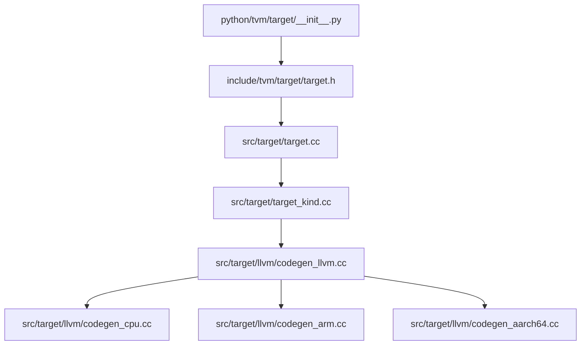

# CPU Targets

<cite>
**Referenced Files in This Document**
- [target.h](file://include/tvm/target/target.h)
- [target.cc](file://src/target/target.cc)
- [target_kind.cc](file://src/target/target_kind.cc)
- [__init__.py](file://python/tvm/target/__init__.py)
- [codegen_llvm.cc](file://src/target/llvm/codegen_llvm.cc)
- [codegen_cpu.cc](file://src/target/llvm/codegen_cpu.cc)
- [codegen_arm.cc](file://src/target/llvm/codegen_arm.cc)
- [codegen_aarch64.cc](file://src/target/llvm/codegen_aarch64.cc)
- [threading_backend.cc](file://src/runtime/threading_backend.cc)
- [llvm_codegen_registry_test.cc](file://tests/cpp/llvm_codegen_registry_test.cc)
- [target_test.cc](file://tests/cpp/target_test.cc)
- [test_meta_schedule_post_order_apply.py](file://tests/python/s_tir/meta_schedule/test_meta_schedule_post_order_apply.py)
</cite>

## Table of Contents
1. [Introduction](#introduction)
2. [Project Structure](#project-structure)
3. [Core Components](#core-components)
4. [Architecture Overview](#architecture-overview)
5. [Detailed Component Analysis](#detailed-component-analysis)
6. [Dependency Analysis](#dependency-analysis)
7. [Performance Considerations](#performance-considerations)
8. [Troubleshooting Guide](#troubleshooting-guide)
9. [Conclusion](#conclusion)
10. [Appendices](#appendices)

## Introduction
This document explains CPU target configuration and optimization in TVM with a focus on LLVM-based code generation for major CPU architectures: x86/x64, ARM/ARM64, and RISC-V. It covers target string syntax, CPU feature detection, optimization flags, vectorization strategies, and multi-threading support. Practical examples demonstrate compiling for different CPU architectures, tuning performance parameters, and performing cross-compilation. CPU-specific optimizations such as SIMD instruction selection, loop unrolling, and memory access patterns are documented alongside deployment considerations for various CPU vendors and instruction set extensions.

## Project Structure
TVM’s CPU target system centers around a JSON-based target configuration model, a target kind registry, and architecture-specific LLVM code generators. The Python API exposes Target construction and tag registration, while the C++ runtime handles target parsing, canonicalization, and device property queries.

**Diagram sources**
- [__init__.py:18-32](file://python/tvm/target/__init__.py#L18-L32)
- [target.h:46-129](file://include/tvm/target/target.h#L46-L129)
- [target.cc:110-132](file://src/target/target.cc#L110-L132)
- [target_kind.cc:301-327](file://src/target/target_kind.cc#L301-L327)
- [codegen_llvm.cc](file://src/target/llvm/codegen_llvm.cc)
- [codegen_cpu.cc](file://src/target/llvm/codegen_cpu.cc)
- [codegen_arm.cc](file://src/target/llvm/codegen_arm.cc)
- [codegen_aarch64.cc](file://src/target/llvm/codegen_aarch64.cc)

**Section sources**
- [__init__.py:18-32](file://python/tvm/target/__init__.py#L18-L32)
- [target.h:46-129](file://include/tvm/target/target.h#L46-L129)
- [target.cc:110-132](file://src/target/target.cc#L110-L132)
- [target_kind.cc:301-327](file://src/target/target_kind.cc#L301-L327)

## Core Components
- Target: A managed object representing a compilation target with kind, host, tag, keys, and attributes. It supports JSON export and retrieval of attributes by key.
- TargetKind: Registry for target kinds (e.g., llvm, cuda, rocm). Each kind defines configurable attributes and default keys.
- LLVM Target Attributes: For CPU targets (kind llvm), attributes include CPU model (-mcpu), target triple (-mtriple), CPU features (-mattr), fast math flags, optimization level, vector width, and LLVM command-line options (-cl-opt).
- Device Property Queries: Targets can query device properties (e.g., vendor/arch) to populate attributes automatically.

Key capabilities:
- JSON-based target configuration supports both tag-based and direct config forms.
- Attribute canonicalization enforces types and applies defaults.
- Feature flags are stored under "feature.<name>" keys and can be accessed via helpers.

**Section sources**
- [target.h:46-129](file://include/tvm/target/target.h#L46-L129)
- [target.cc:151-164](file://src/target/target.cc#L151-L164)
- [target.cc:254-271](file://src/target/target.cc#L254-L271)
- [target.cc:286-423](file://src/target/target.cc#L286-L423)
- [target_kind.cc:301-327](file://src/target/target_kind.cc#L301-L327)
- [target_kind.cc:128-144](file://src/target/target_kind.cc#L128-L144)

## Architecture Overview
The CPU target pipeline converts a user-provided target specification into a canonicalized configuration, then generates optimized CPU code via LLVM.

**Diagram sources**
- [__init__.py:18-32](file://python/tvm/target/__init__.py#L18-L32)
- [target.cc:286-423](file://src/target/target.cc#L286-L423)
- [target_kind.cc:301-327](file://src/target/target_kind.cc#L301-L327)
- [codegen_llvm.cc](file://src/target/llvm/codegen_llvm.cc)

## Detailed Component Analysis

### Target Construction and Parsing
- Accepts JSON config dictionaries, tag names, or kind names.
- Supports host embedding and recursive parsing of nested targets.
- Validates attributes against the target kind’s schema and applies canonicalization.

**Diagram sources**
- [target.cc:254-271](file://src/target/target.cc#L254-L271)
- [target.cc:286-423](file://src/target/target.cc#L286-L423)
- [target_kind.cc:128-144](file://src/target/target_kind.cc#L128-L144)

**Section sources**
- [target.cc:254-271](file://src/target/target.cc#L254-L271)
- [target.cc:286-423](file://src/target/target.cc#L286-L423)
- [target_kind.cc:128-144](file://src/target/target_kind.cc#L128-L144)

### TargetKind Registration and CPU Attributes
- The llvm kind defines CPU-oriented attributes such as -mcpu, -mtriple, -mattr, fast math flags, opt-level, vector-width, and -cl-opt.
- Default keys include "cpu" for CPU targets.
- Canonicalizer ensures consistent attribute handling.

**Diagram sources**
- [target_kind.cc:301-327](file://src/target/target_kind.cc#L301-L327)

**Section sources**
- [target_kind.cc:301-327](file://src/target/target_kind.cc#L301-L327)

### CPU-Specific Code Generation
- CPU code generation is dispatched through the LLVM code generator. Tests confirm factory availability for CPU-related targets.
- Architecture-specific generators exist for x86, ARM, and AArch64.

**Diagram sources**
- [llvm_codegen_registry_test.cc:34-51](file://tests/cpp/llvm_codegen_registry_test.cc#L34-L51)
- [codegen_cpu.cc](file://src/target/llvm/codegen_cpu.cc)
- [codegen_arm.cc](file://src/target/llvm/codegen_arm.cc)
- [codegen_aarch64.cc](file://src/target/llvm/codegen_aarch64.cc)

**Section sources**
- [llvm_codegen_registry_test.cc:34-51](file://tests/cpp/llvm_codegen_registry_test.cc#L34-L51)
- [codegen_cpu.cc](file://src/target/llvm/codegen_cpu.cc)
- [codegen_arm.cc](file://src/target/llvm/codegen_arm.cc)
- [codegen_aarch64.cc](file://src/target/llvm/codegen_aarch64.cc)

### SIMD Instructions and Vectorization
- CPU targets support vectorization via the vector-width attribute and CPU feature flags via -mattr.
- Tests demonstrate selecting NEON/SVE/DotProd variants by enabling appropriate features in -mattr.

Practical guidance:
- Use -mattr to enable SIMD extensions (e.g., NEON, SVE, VFP, ASIMD, dotprod).
- Adjust vector-width to control vector register utilization.
- Meta-schedule tests show automatic selection of specialized kernels (e.g., neon, sdot, udot) based on -mattr and data types.

**Section sources**
- [target_kind.cc:301-327](file://src/target/target_kind.cc#L301-L327)
- [test_meta_schedule_post_order_apply.py:432-474](file://tests/python/s_tir/meta_schedule/test_meta_schedule_post_order_apply.py#L432-L474)

### Loop Unrolling and Optimization Flags
- The -cl-opt attribute accepts LLVM command-line options. Examples include loop unrolling thresholds and related flags.
- fast-math flags enable aggressive floating-point optimizations.

Best practices:
- Tune opt-level and fast-math flags for accuracy/performance trade-offs.
- Use -cl-opt to pass architecture-specific LLVM flags (e.g., unroll thresholds) when needed.

**Section sources**
- [target_kind.cc:316-348](file://src/target/target_kind.cc#L316-L348)

### Multi-threading and CPU Affinity
- TVM’s runtime initializes thread pools and can set CPU affinity for threads. This affects scheduling and NUMA locality for CPU workloads.
- Thread counts reflect hardware concurrency; platform-specific adjustments are applied.

**Section sources**
- [threading_backend.cc:301-328](file://src/runtime/threading_backend.cc#L301-L328)

### Cross-Compilation Workflows
- Use -mtriple to select the target triple for cross-compilation (e.g., aarch64-linux-gnu).
- Combine -mcpu and -mattr to target specific CPUs and enable features.
- For ARM/ARM64, -mtriple and -mattr are commonly used to select ABI and instruction sets.

**Section sources**
- [target_kind.cc:301-327](file://src/target/target_kind.cc#L301-L327)
- [test_meta_schedule_post_order_apply.py:432-474](file://tests/python/s_tir/meta_schedule/test_meta_schedule_post_order_apply.py#L432-L474)

### Deployment Considerations
- Vendor-specific instruction sets: NEON, SVE, dotprod, VFP, ASIMD.
- Ensure -mcpu matches deployed hardware for optimal performance.
- Validate -mattr combinations supported by the target platform.

**Section sources**
- [target_kind.cc:301-327](file://src/target/target_kind.cc#L301-L327)
- [test_meta_schedule_post_order_apply.py:432-474](file://tests/python/s_tir/meta_schedule/test_meta_schedule_post_order_apply.py#L432-L474)

## Dependency Analysis
The CPU target system exhibits clear separation of concerns:
- Python API constructs targets from JSON.
- Target parsing resolves schema and canonicalizes attributes.
- TargetKind registry defines attributes and default keys.
- LLVM code generator emits architecture-specific CPU code.

**Diagram sources**
- [__init__.py:18-32](file://python/tvm/target/__init__.py#L18-L32)
- [target.h:46-129](file://include/tvm/target/target.h#L46-L129)
- [target.cc:286-423](file://src/target/target.cc#L286-L423)
- [target_kind.cc:301-327](file://src/target/target_kind.cc#L301-L327)
- [codegen_llvm.cc](file://src/target/llvm/codegen_llvm.cc)
- [codegen_cpu.cc](file://src/target/llvm/codegen_cpu.cc)
- [codegen_arm.cc](file://src/target/llvm/codegen_arm.cc)
- [codegen_aarch64.cc](file://src/target/llvm/codegen_aarch64.cc)

**Section sources**
- [__init__.py:18-32](file://python/tvm/target/__init__.py#L18-L32)
- [target.h:46-129](file://include/tvm/target/target.h#L46-L129)
- [target.cc:286-423](file://src/target/target.cc#L286-L423)
- [target_kind.cc:301-327](file://src/target/target_kind.cc#L301-L327)

## Performance Considerations
- Optimize vectorization: choose -mcpu and -mattr to match target SIMD capabilities; adjust vector-width accordingly.
- Control floating-point precision: use fast-math flags judiciously.
- Tune loop transformations: leverage -cl-opt for architecture-specific unrolling and cost thresholds.
- Multi-threading: align thread pool sizing with physical cores and NUMA topology.

[No sources needed since this section provides general guidance]

## Troubleshooting Guide
Common issues and resolutions:
- Invalid target string: CLI-style target strings are deprecated; use JSON config dictionaries.
- Unknown target kind: Ensure the kind is registered (e.g., "llvm").
- Invalid attribute values: Canonicalizer validates types and values; fix mismatched types or unsupported values.
- Device queries unavailable: If device APIs are not compiled in, defaults are used; enable required device APIs for dynamic queries.

**Section sources**
- [target.cc:263-269](file://src/target/target.cc#L263-L269)
- [target.cc:314-323](file://src/target/target.cc#L314-L323)
- [target.cc:425-459](file://src/target/target.cc#L425-L459)

## Conclusion
TVM’s CPU target system provides a robust, extensible framework for configuring and optimizing code generation across x86/x64, ARM/ARM64, and RISC-V. By leveraging JSON-based target configuration, schema-driven canonicalization, and LLVM-backed code generation, developers can precisely control CPU features, vectorization, and performance characteristics. Proper use of -mcpu, -mtriple, -mattr, vector-width, and -cl-opt enables high-performance deployments across diverse CPU vendors and instruction set extensions.

## Appendices

### Practical Examples and Patterns
- Constructing a CPU target with JSON config:
  - Use {"kind": "llvm", "mcpu": "...", "mattr": [...]}.
- Enabling SIMD:
  - Add -mattr entries for NEON, SVE, dotprod, etc.
- Cross-compilation:
  - Set -mtriple to the target triple (e.g., aarch64-linux-gnu).
- Tuning performance:
  - Adjust opt-level and fast-math flags; use -cl-opt for LLVM-specific controls.

[No sources needed since this section summarizes usage patterns without analyzing specific files]