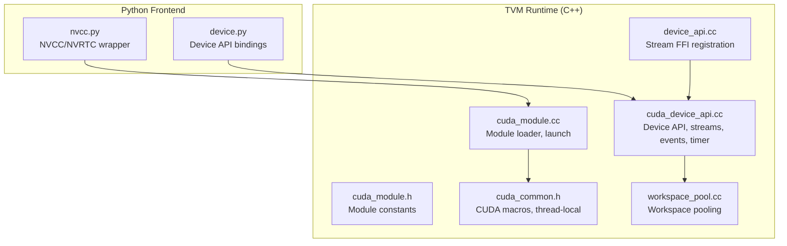
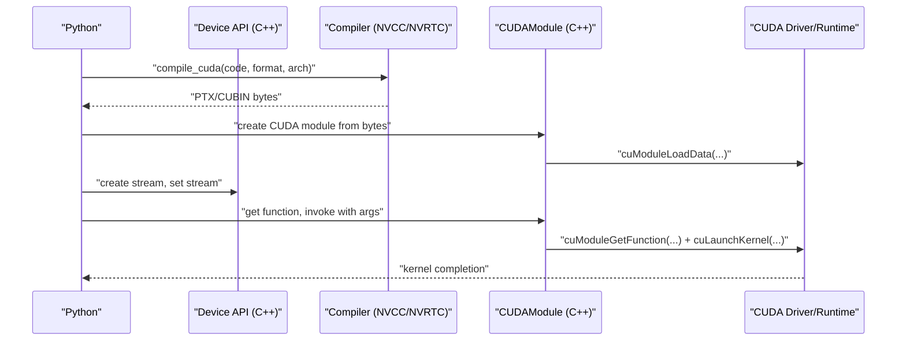
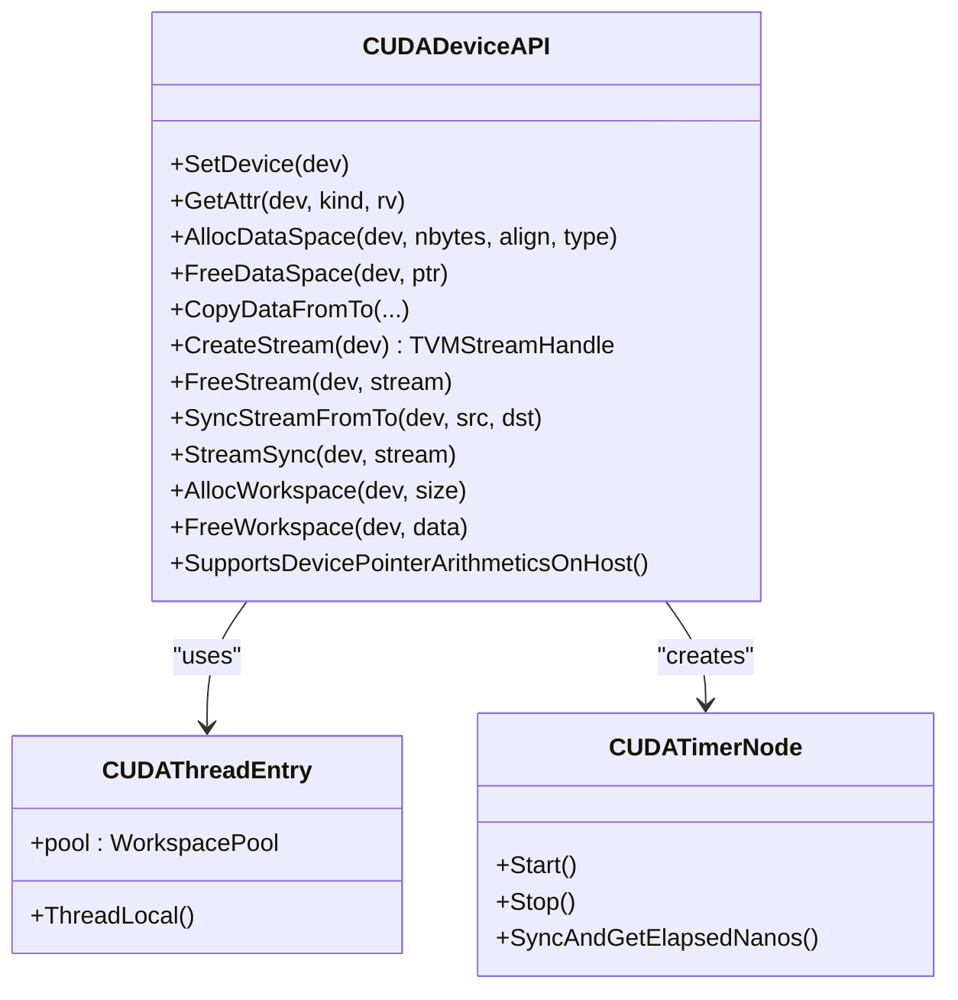
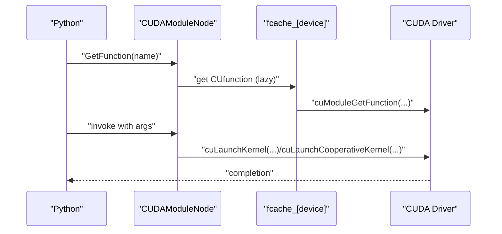
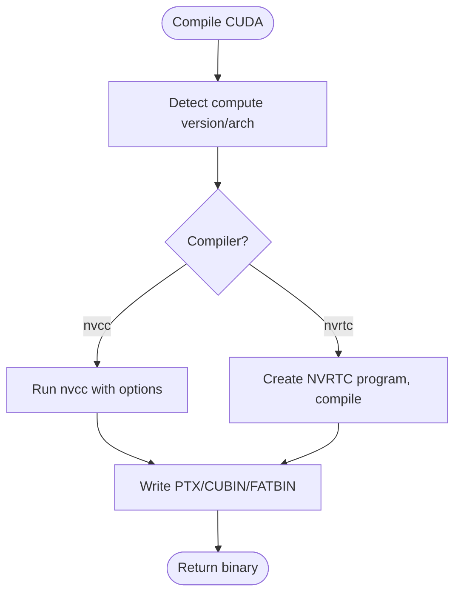
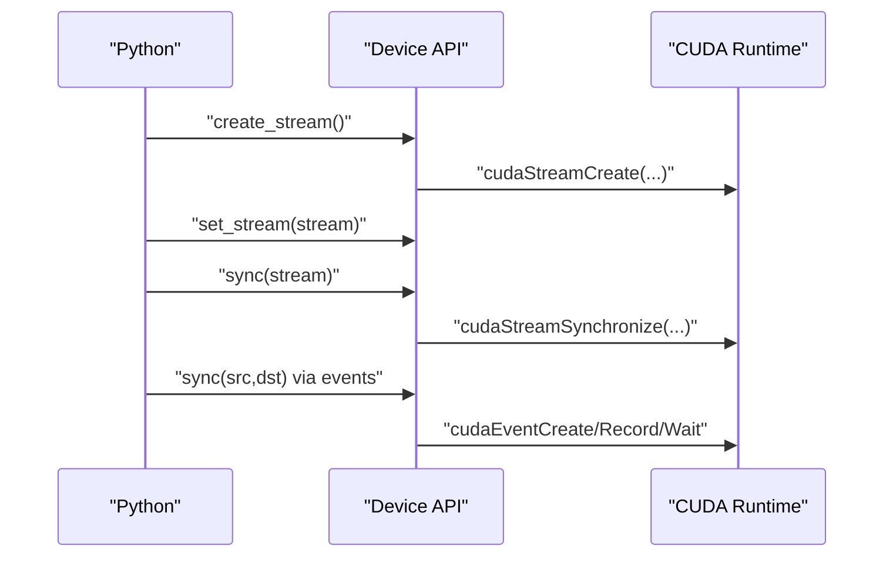
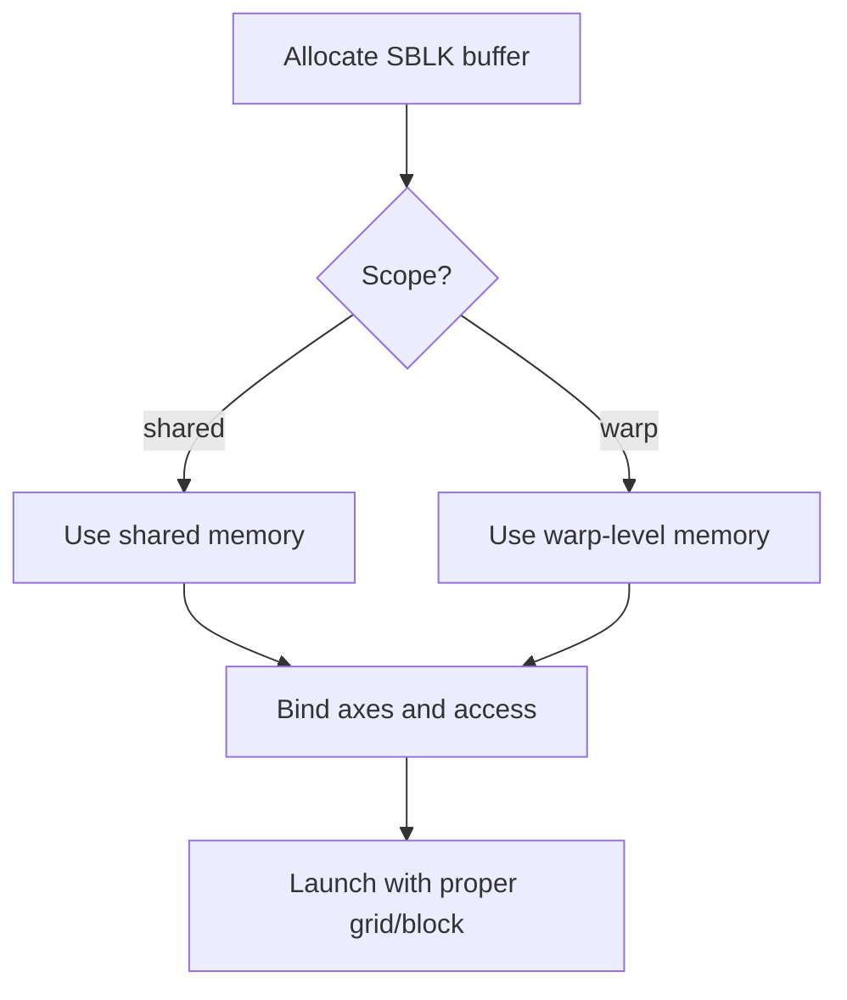
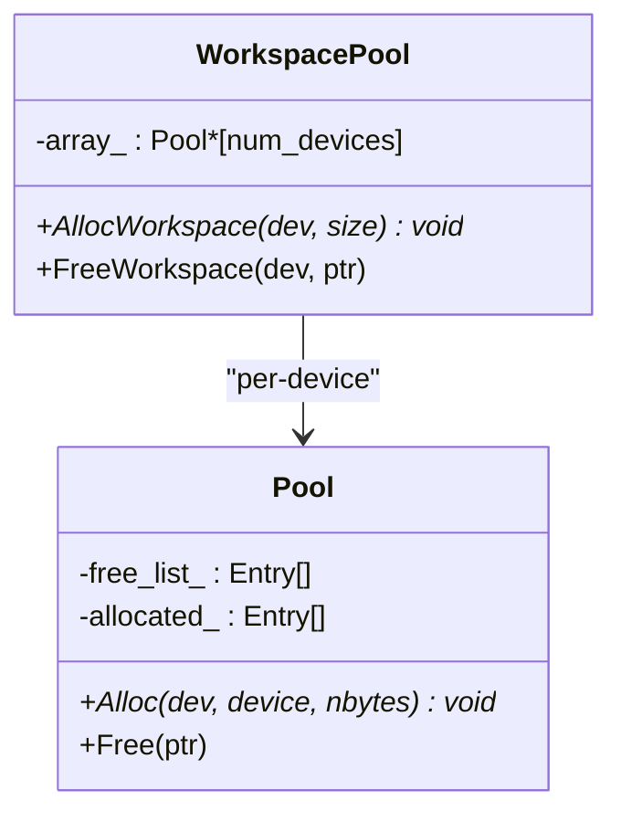
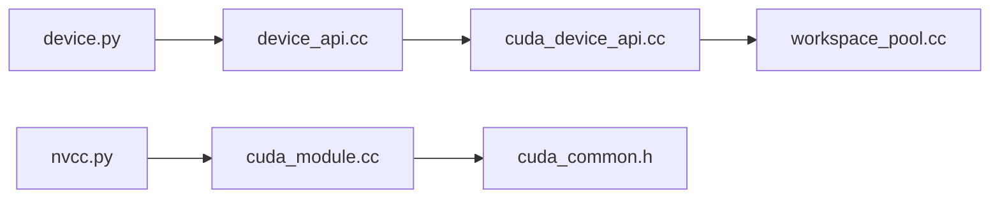

# CUDA Backend

<cite>
**Referenced Files in This Document**
- [cuda_device_api.cc](file://src/runtime/cuda/cuda_device_api.cc)
- [cuda_module.cc](file://src/runtime/cuda/cuda_module.cc)
- [cuda_module.h](file://src/runtime/cuda/cuda_module.h)
- [cuda_common.h](file://src/runtime/cuda/cuda_common.h)
- [workspace_pool.cc](file://src/runtime/workspace_pool.cc)
- [nvcc.py](file://python/tvm/contrib/nvcc.py)
- [device.py](file://python/tvm/runtime/device.py)
- [device_api.cc](file://src/runtime/device_api.cc)
- [test_tir_schedule_state_cached_flags.py](file://tests/python/s_tir/schedule/test_tir_schedule_state_cached_flags.py)
</cite>

## Table of Contents
1. [Introduction](#introduction)
2. [Project Structure](#project-structure)
3. [Core Components](#core-components)
4. [Architecture Overview](#architecture-overview)
5. [Detailed Component Analysis](#detailed-component-analysis)
6. [Dependency Analysis](#dependency-analysis)
7. [Performance Considerations](#performance-considerations)
8. [Troubleshooting Guide](#troubleshooting-guide)
9. [Conclusion](#conclusion)
10. [Appendices](#appendices)

## Introduction
This document explains the CUDA backend implementation in TVM, focusing on device initialization, context management, memory allocation, kernel compilation, PTX/SASS generation, compute capability targeting, CUDA-specific optimizations (shared memory, warp-level scopes, occupancy), stream management, event synchronization, multi-stream execution, practical compilation and transfer examples, profiling, driver requirements, version compatibility, and troubleshooting.

## Project Structure
The CUDA backend spans runtime and Python-side compilation utilities:
- Runtime: device API, module loader, streams/events, timers, workspace pooling
- Compilation: NVCC/NVRTC wrappers for PTX/CUBIN/FATBIN generation
- Python runtime device interface: attributes, streams, synchronization

**Diagram sources**
- [device.py:1-331](file://python/tvm/runtime/device.py#L1-L331)
- [nvcc.py:1-200](file://python/tvm/contrib/nvcc.py#L1-L200)
- [cuda_device_api.cc:1-591](file://src/runtime/cuda/cuda_device_api.cc#L1-L591)
- [cuda_module.cc:1-348](file://src/runtime/cuda/cuda_module.cc#L1-L348)
- [cuda_module.h:1-54](file://src/runtime/cuda/cuda_module.h#L1-L54)
- [cuda_common.h:1-70](file://src/runtime/cuda/cuda_common.h#L1-L70)
- [workspace_pool.cc:1-169](file://src/runtime/workspace_pool.cc#L1-L169)
- [device_api.cc:176-202](file://src/runtime/device_api.cc#L176-L202)

**Section sources**
- [cuda_device_api.cc:1-591](file://src/runtime/cuda/cuda_device_api.cc#L1-L591)
- [cuda_module.cc:1-348](file://src/runtime/cuda/cuda_module.cc#L1-L348)
- [cuda_module.h:1-54](file://src/runtime/cuda/cuda_module.h#L1-L54)
- [cuda_common.h:1-70](file://src/runtime/cuda/cuda_common.h#L1-L70)
- [workspace_pool.cc:1-169](file://src/runtime/workspace_pool.cc#L1-L169)
- [nvcc.py:1-200](file://python/tvm/contrib/nvcc.py#L1-L200)
- [device.py:1-331](file://python/tvm/runtime/device.py#L1-L331)
- [device_api.cc:176-202](file://src/runtime/device_api.cc#L176-L202)

## Core Components
- CUDA Device API: device attributes, allocation/free, peer-to-peer copies, streams, events, timer
- CUDA Module Loader: loads PTX/CUBIN/FATBIN, resolves functions/globals, launches kernels
- CUDA Common Utilities: CUDA/NVCC error macros, thread-local workspace
- Workspace Pool: page-aligned temporary allocations
- Python Device Interface: exposes device attributes and stream APIs
- Compilation Utilities: NVCC/NVRTC integration for PTX/CUBIN/FATBIN

Key responsibilities:
- Device initialization and attributes via CUDA runtime and driver APIs
- Memory allocation aligned to 256 bytes, host/device, and peer copies
- Stream creation/synchronization and event-based pipeline control
- Kernel launch with cooperative and programmatic serialization modes
- PTX/SASS generation and compute capability targeting
- Shared memory and warp-level scopes via SBLK/TIR constructs

**Section sources**
- [cuda_device_api.cc:39-274](file://src/runtime/cuda/cuda_device_api.cc#L39-L274)
- [cuda_module.cc:51-174](file://src/runtime/cuda/cuda_module.cc#L51-L174)
- [cuda_common.h:37-65](file://src/runtime/cuda/cuda_common.h#L37-L65)
- [workspace_pool.cc:34-134](file://src/runtime/workspace_pool.cc#L34-L134)
- [device.py:29-331](file://python/tvm/runtime/device.py#L29-L331)
- [nvcc.py:35-80](file://python/tvm/contrib/nvcc.py#L35-L80)

## Architecture Overview
End-to-end flow from Python to GPU execution:
- Python code requests a CUDA device and creates streams
- TVM compiles CUDA kernels to PTX/CUBIN via NVCC/NVRTC
- TVM loads the module and retrieves CUfunction/CUdeviceptr
- Kernel launched with grid/block dims, dynamic shared memory, and current stream
- Streams and events coordinate multi-stream execution

**Diagram sources**
- [nvcc.py:35-80](file://python/tvm/contrib/nvcc.py#L35-L80)
- [cuda_module.cc:116-135](file://src/runtime/cuda/cuda_module.cc#L116-L135)
- [cuda_device_api.cc:223-250](file://src/runtime/cuda/cuda_device_api.cc#L223-L250)

## Detailed Component Analysis

### CUDA Device API
Responsibilities:
- Device attributes: existence, max threads/block, warp size, shared memory, compute version, device name, clock rate, multiprocessors, max thread dimensions, registers, L2 cache, total/global memory, available memory
- Memory management: host/device allocation with 256-byte alignment, host/device free
- Peer-to-peer copies between GPUs, host-to-device, device-to-host
- Stream lifecycle: create, destroy, synchronize, stream-to-stream sync via events
- Timers: CUDA events for profiling on the current device stream

Notable behaviors:
- Uses CUDA runtime and driver APIs for attributes and device selection
- Uses CUDA events for timing and stream synchronization
- Thread-local workspace pool for temporary allocations

**Diagram sources**
- [cuda_device_api.cc:39-274](file://src/runtime/cuda/cuda_device_api.cc#L39-L274)
- [cuda_common.h:56-65](file://src/runtime/cuda/cuda_common.h#L56-L65)

**Section sources**
- [cuda_device_api.cc:41-135](file://src/runtime/cuda/cuda_device_api.cc#L41-L135)
- [cuda_device_api.cc:136-180](file://src/runtime/cuda/cuda_device_api.cc#L136-L180)
- [cuda_device_api.cc:182-220](file://src/runtime/cuda/cuda_device_api.cc#L182-L220)
- [cuda_device_api.cc:223-250](file://src/runtime/cuda/cuda_device_api.cc#L223-L250)
- [cuda_device_api.cc:297-332](file://src/runtime/cuda/cuda_device_api.cc#L297-L332)
- [cuda_common.h:56-65](file://src/runtime/cuda/cuda_common.h#L56-L65)

### CUDA Module Loader and Kernel Launch
Responsibilities:
- Load PTX/CUBIN/FATBIN modules per device (lazy initialization)
- Resolve functions and globals per device
- Launch kernels with grid/block dims, dynamic shared memory, cooperative or programmatic serialization
- Support for NVSHMEM module hook

Key behaviors:
- Per-GPU module caching and lazy load
- Dynamic shared memory attribute set on CUfunction when needed
- Launch via cuLaunchKernelEx, cuLaunchCooperativeKernel, or cuLaunchKernel
- Source inspection for diagnostics

**Diagram sources**
- [cuda_module.cc:116-135](file://src/runtime/cuda/cuda_module.cc#L116-L135)
- [cuda_module.cc:189-255](file://src/runtime/cuda/cuda_module.cc#L189-L255)

**Section sources**
- [cuda_module.cc:51-174](file://src/runtime/cuda/cuda_module.cc#L51-L174)
- [cuda_module.cc:189-255](file://src/runtime/cuda/cuda_module.cc#L189-L255)
- [cuda_module.h:38-50](file://src/runtime/cuda/cuda_module.h#L38-L50)

### CUDA Compilation and Compute Capability Targeting
Compilation pipeline:
- NVCC: generates PTX/CUBIN/FATBIN, supports multiple gencode entries
- NVRTC: JIT compilation via cuda-python
- Automatic compute capability detection from current Target
- Optional NVSHMEM support with separate stages

Targeting:
- Architecture derived from target compute version
- Options passed to nvcc (e.g., -arch, -gencode)
- Output directory configurable via pass context

**Diagram sources**
- [nvcc.py:122-133](file://python/tvm/contrib/nvcc.py#L122-L133)
- [nvcc.py:163-187](file://python/tvm/contrib/nvcc.py#L163-L187)
- [nvcc.py:378-385](file://python/tvm/contrib/nvcc.py#L378-L385)

**Section sources**
- [nvcc.py:35-80](file://python/tvm/contrib/nvcc.py#L35-L80)
- [nvcc.py:122-133](file://python/tvm/contrib/nvcc.py#L122-L133)
- [nvcc.py:163-187](file://python/tvm/contrib/nvcc.py#L163-L187)
- [nvcc.py:378-385](file://python/tvm/contrib/nvcc.py#L378-L385)

### CUDA Streams, Events, and Multi-Stream Execution
- Create/destroy streams per device
- Synchronize streams or wait for events across streams
- Use CUDA events for precise timing and pipeline coordination
- Python Device API exposes stream creation, setting, and synchronization

**Diagram sources**
- [cuda_device_api.cc:223-250](file://src/runtime/cuda/cuda_device_api.cc#L223-L250)
- [device_api.cc:176-202](file://src/runtime/device_api.cc#L176-L202)
- [device.py:280-320](file://python/tvm/runtime/device.py#L280-L320)

**Section sources**
- [cuda_device_api.cc:223-250](file://src/runtime/cuda/cuda_device_api.cc#L223-L250)
- [device_api.cc:176-202](file://src/runtime/device_api.cc#L176-L202)
- [device.py:280-320](file://python/tvm/runtime/device.py#L280-L320)

### CUDA-Specific Optimizations: Shared Memory and Warp-Level Scopes
- Shared memory: allocate buffers scoped to "shared" in TIR/SBLK
- Warp-level memory: allocate buffers scoped to "warp" for lane-level operations
- Axis remapping and sblock constructs enable efficient shared/warp buffers

**Diagram sources**
- [test_tir_schedule_state_cached_flags.py:264-317](file://tests/python/s_tir/schedule/test_tir_schedule_state_cached_flags.py#L264-L317)

**Section sources**
- [test_tir_schedule_state_cached_flags.py:264-317](file://tests/python/s_tir/schedule/test_tir_schedule_state_cached_flags.py#L264-L317)

### Memory Allocation Patterns and Workspace Pooling
- 256-byte alignment enforced for CUDA allocations
- Host/device allocation handled distinctly
- Workspace pool reuses page-aligned buffers per device to reduce allocation overhead

**Diagram sources**
- [workspace_pool.cc:136-165](file://src/runtime/workspace_pool.cc#L136-L165)
- [workspace_pool.cc:34-134](file://src/runtime/workspace_pool.cc#L34-L134)

**Section sources**
- [cuda_device_api.cc:136-151](file://src/runtime/cuda/cuda_device_api.cc#L136-L151)
- [workspace_pool.cc:34-134](file://src/runtime/workspace_pool.cc#L34-L134)

### Practical Examples Index
- CUDA kernel compilation: see NVCC/NVRTC invocation and compute capability targeting
- Memory transfer: host-to-device, device-to-host, peer-to-peer copies
- Multi-stream execution: create streams, synchronize, and coordinate via events
- Profiling: CUDA events via timer node and Python device sync

Paths to review:
- [nvcc.py:35-80](file://python/tvm/contrib/nvcc.py#L35-L80)
- [cuda_device_api.cc:182-220](file://src/runtime/cuda/cuda_device_api.cc#L182-L220)
- [cuda_device_api.cc:223-250](file://src/runtime/cuda/cuda_device_api.cc#L223-L250)
- [cuda_device_api.cc:297-332](file://src/runtime/cuda/cuda_device_api.cc#L297-L332)
- [device.py:280-320](file://python/tvm/runtime/device.py#L280-L320)

**Section sources**
- [nvcc.py:35-80](file://python/tvm/contrib/nvcc.py#L35-L80)
- [cuda_device_api.cc:182-220](file://src/runtime/cuda/cuda_device_api.cc#L182-L220)
- [cuda_device_api.cc:223-250](file://src/runtime/cuda/cuda_device_api.cc#L223-L250)
- [cuda_device_api.cc:297-332](file://src/runtime/cuda/cuda_device_api.cc#L297-L332)
- [device.py:280-320](file://python/tvm/runtime/device.py#L280-L320)

## Dependency Analysis
- Python device interface depends on runtime FFI for device attributes and stream operations
- CUDA Device API depends on CUDA runtime and driver libraries
- CUDA Module Loader depends on CUDA Driver APIs and per-GPU module caching
- Compilation utilities depend on NVCC/NVRTC and target compute version

**Diagram sources**
- [device.py:1-331](file://python/tvm/runtime/device.py#L1-L331)
- [device_api.cc:176-202](file://src/runtime/device_api.cc#L176-L202)
- [cuda_device_api.cc:1-591](file://src/runtime/cuda/cuda_device_api.cc#L1-L591)
- [nvcc.py:1-200](file://python/tvm/contrib/nvcc.py#L1-L200)
- [cuda_module.cc:1-348](file://src/runtime/cuda/cuda_module.cc#L1-L348)
- [cuda_common.h:1-70](file://src/runtime/cuda/cuda_common.h#L1-L70)
- [workspace_pool.cc:1-169](file://src/runtime/workspace_pool.cc#L1-L169)

**Section sources**
- [device.py:1-331](file://python/tvm/runtime/device.py#L1-L331)
- [device_api.cc:176-202](file://src/runtime/device_api.cc#L176-L202)
- [cuda_device_api.cc:1-591](file://src/runtime/cuda/cuda_device_api.cc#L1-L591)
- [nvcc.py:1-200](file://python/tvm/contrib/nvcc.py#L1-L200)
- [cuda_module.cc:1-348](file://src/runtime/cuda/cuda_module.cc#L1-L348)
- [cuda_common.h:1-70](file://src/runtime/cuda/cuda_common.h#L1-L70)
- [workspace_pool.cc:1-169](file://src/runtime/workspace_pool.cc#L1-L169)

## Performance Considerations
- Occupancy: choose grid/block sizes and dynamic shared memory to maximize SM utilization
- Shared memory: prefer shared/warp-scoped buffers for data reuse and reduced global memory bandwidth
- Streams: overlap computation and transfers; synchronize only when necessary
- Workspace pooling: reduces frequent allocations and improves locality
- Timing: use CUDA events for accurate kernel timings on the current device stream

[No sources needed since this section provides general guidance]

## Troubleshooting Guide
Common issues and remedies:
- CUDA context deinitialized: driver APIs may return deinitialized errors; code guards against repeated API calls during stack unwinding
- Memory errors: sticky illegal address errors during exception unwinding are ignored to prevent cascading failures
- Module load failures: cuModuleGetFunction errors are surfaced with error names; inspect source via InspectSource
- Stream synchronization: ensure streams are created on the correct device and synchronized appropriately
- Compute capability mismatch: verify target arch matches device compute capability

**Section sources**
- [cuda_device_api.cc:154-170](file://src/runtime/cuda/cuda_device_api.cc#L154-L170)
- [cuda_module.cc:127-133](file://src/runtime/cuda/cuda_module.cc#L127-L133)
- [cuda_module.cc:238-254](file://src/runtime/cuda/cuda_module.cc#L238-L254)

## Conclusion
TVM’s CUDA backend integrates tightly with CUDA runtime and driver APIs to provide robust device management, memory allocation, kernel compilation, and execution. It supports modern CUDA features including multi-GPU, streams/events, shared/warp-level memory, and profiling. The design emphasizes safety, performance, and flexibility across compute capabilities.

[No sources needed since this section summarizes without analyzing specific files]

## Appendices

### Driver Requirements and Version Compatibility
- CUDA runtime and driver APIs are used for device attributes, memory, and kernel launches
- CUDA version macro exposed for API checks
- Compute capability attributes retrieved via device attributes

**Section sources**
- [cuda_device_api.cc:64-72](file://src/runtime/cuda/cuda_device_api.cc#L64-L72)
- [cuda_device_api.cc:105-108](file://src/runtime/cuda/cuda_device_api.cc#L105-L108)