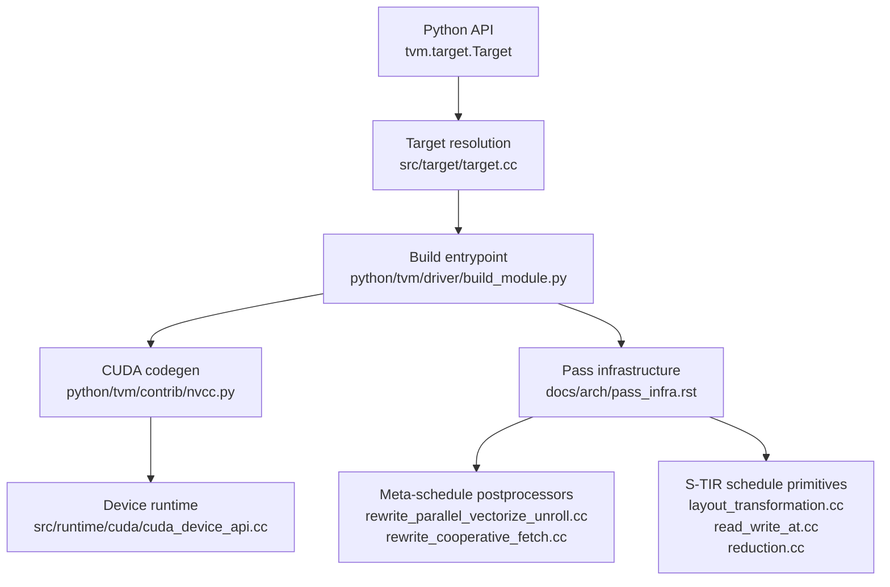
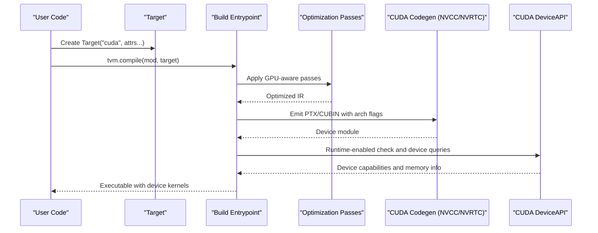
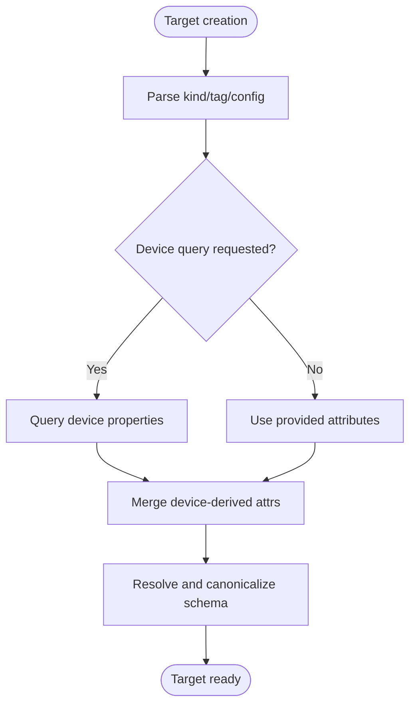
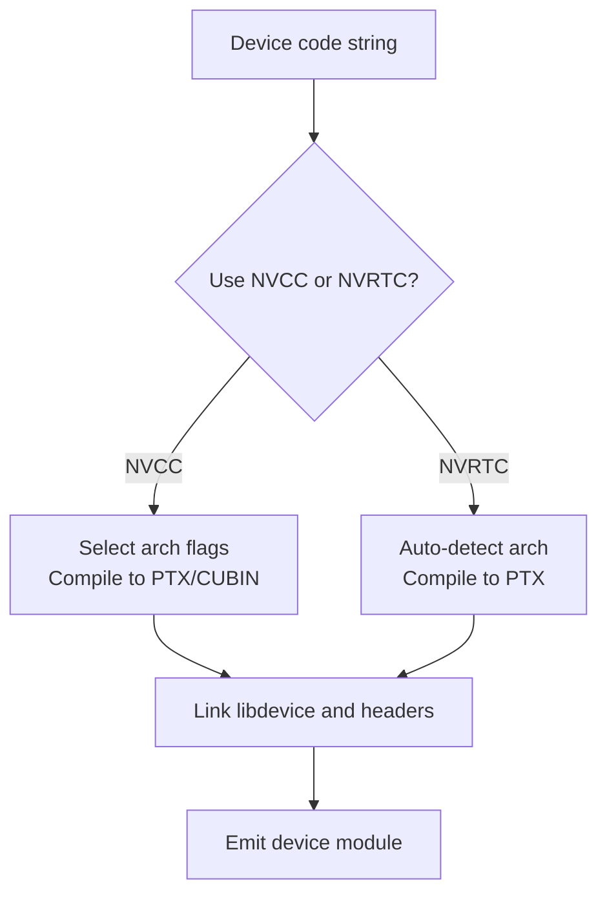
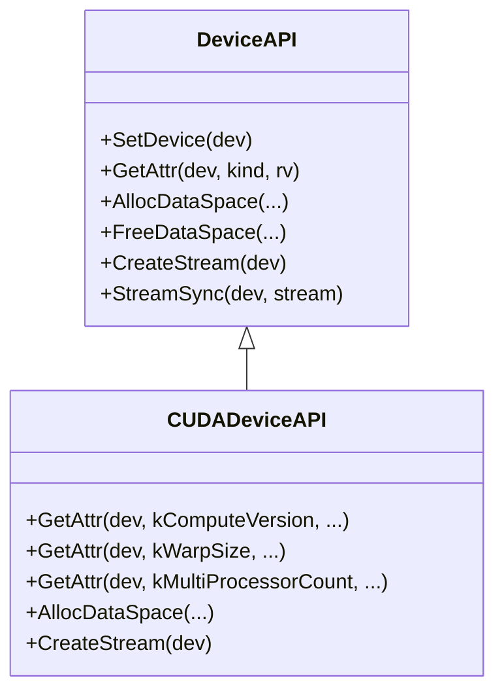
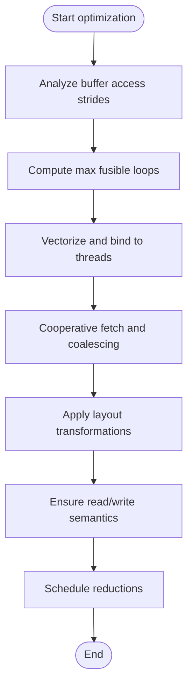
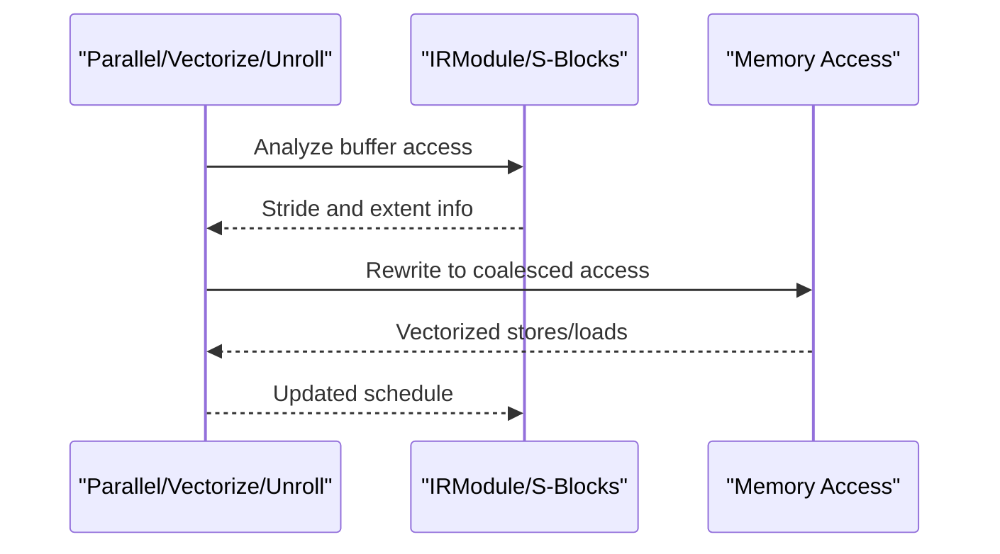
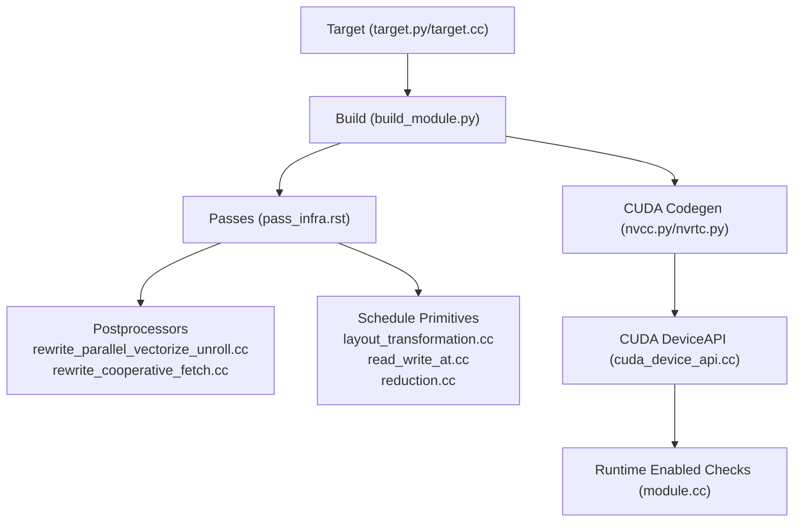

# GPU Compilation Workflows

<cite>
**Referenced Files in This Document**
- [target.py](file://python/tvm/target/target.py)
- [target.cc](file://src/target/target.cc)
- [build_module.py](file://python/tvm/driver/build_module.py)
- [nvcc.py](file://python/tvm/contrib/nvcc.py)
- [nvrtc.py](file://3rdparty/tvm-ffi/python/tvm_ffi/cpp/nvrtc.py)
- [cuda_device_api.cc](file://src/runtime/cuda/cuda_device_api.cc)
- [module.cc](file://src/runtime/module.cc)
- [device_target_interactions.rst](file://docs/arch/device_target_interactions.rst)
- [pass_infra.rst](file://docs/arch/pass_infra.rst)
- [rewrite_parallel_vectorize_unroll.cc](file://src/s_tir/meta_schedule/postproc/rewrite_parallel_vectorize_unroll.cc)
- [rewrite_cooperative_fetch.cc](file://src/s_tir/meta_schedule/postproc/rewrite_cooperative_fetch.cc)
- [layout_transformation.cc](file://src/s_tir/schedule/primitive/layout_transformation.cc)
- [read_write_at.cc](file://src/s_tir/schedule/primitive/read_write_at.cc)
- [reduction.cc](file://src/s_tir/schedule/primitive/reduction.cc)
- [gemm_operation.py](file://python/tvm/contrib/cutlass/gemm_operation.py)
- [test_meta_schedule_mma_tensorize.py](file://tests/python/s_tir/meta_schedule/test_meta_schedule_mma_tensorize.py)
- [_decode_kernels.py](file://python/tvm/relax/frontend/nn/llm/_decode_kernels.py)
- [test_runtime_builtin_kv_cache_transfer_kernel.py](file://tests/python/relax/nvshmem/test_runtime_builtin_kv_cache_transfer_kernel.py)
- [test_transform_rewrite_cuda_graph.py](file://tests/python/relax/test_transform_rewrite_cuda_graph.py)
</cite>

## Table of Contents
1. [Introduction](#introduction)
2. [Project Structure](#project-structure)
3. [Core Components](#core-components)
4. [Architecture Overview](#architecture-overview)
5. [Detailed Component Analysis](#detailed-component-analysis)
6. [Dependency Analysis](#dependency-analysis)
7. [Performance Considerations](#performance-considerations)
8. [Troubleshooting Guide](#troubleshooting-guide)
9. [Conclusion](#conclusion)
10. [Appendices](#appendices)

## Introduction
This document explains GPU-specific compilation workflows in TVM, focusing on the end-to-end pipeline from high-level IR to GPU kernel code generation. It covers GPU-aware optimization passes (loop transformations, memory access pattern optimization, register allocation), compute capability targeting and architecture-specific code generation, fallback mechanisms, kernel fusion strategies, memory coalescing, occupancy maximization, practical tuning examples, profiling integration, debugging, multi-GPU compilation, distributed memory optimization, and cross-architecture portability.

## Project Structure
At a high level, TVM’s GPU compilation pipeline integrates:
- Target specification and device property discovery
- Pass infrastructure for optimization
- Code generation via NVCC/NVRTC for CUDA
- Runtime device APIs for CUDA and other accelerators
- Meta-schedule postprocessors and S-TIR primitives for GPU-specific transformations

**Diagram sources**
- [target.py:1-233](file://python/tvm/target/target.py#L1-L233)
- [target.cc:1-497](file://src/target/target.cc#L1-L497)
- [build_module.py:72-113](file://python/tvm/driver/build_module.py#L72-L113)
- [nvcc.py:122-385](file://python/tvm/contrib/nvcc.py#L122-L385)
- [cuda_device_api.cc:39-274](file://src/runtime/cuda/cuda_device_api.cc#L39-L274)
- [pass_infra.rst:1-80](file://docs/arch/pass_infra.rst#L1-L80)
- [rewrite_parallel_vectorize_unroll.cc:209-278](file://src/s_tir/meta_schedule/postproc/rewrite_parallel_vectorize_unroll.cc#L209-L278)
- [rewrite_cooperative_fetch.cc:183-209](file://src/s_tir/meta_schedule/postproc/rewrite_cooperative_fetch.cc#L183-L209)
- [layout_transformation.cc:112-834](file://src/s_tir/schedule/primitive/layout_transformation.cc#L112-L834)
- [read_write_at.cc:171-202](file://src/s_tir/schedule/primitive/read_write_at.cc#L171-L202)
- [reduction.cc:560-576](file://src/s_tir/schedule/primitive/reduction.cc#L560-L576)

**Section sources**
- [target.py:1-233](file://python/tvm/target/target.py#L1-L233)
- [target.cc:1-497](file://src/target/target.cc#L1-L497)
- [build_module.py:72-113](file://python/tvm/driver/build_module.py#L72-L113)

## Core Components
- Target and device property discovery: The Target object encapsulates device kind, attributes, and keys. It can query device properties and resolve configuration, including compute capability and device-specific features.
- Build entrypoints: Unified compilation routes to Relax/TIR pipelines depending on module type.
- CUDA code generation: NVCC/NVRTC integration compiles device code to PTX/CUBIN with architecture flags and includes device-side headers/libraries.
- Device runtime: CUDA runtime exposes device attributes (compute capability, warp size, SM count, memory sizes) and manages streams and memory.
- Pass infrastructure: Optimizations operate on IR modules and schedules, enabling GPU-aware transformations.
- GPU-specific postprocessors and schedule primitives: Provide memory coalescing, vectorization, cooperative fetching, layout transformations, and reduction scheduling.

**Section sources**
- [target.py:52-233](file://python/tvm/target/target.py#L52-L233)
- [target.cc:178-459](file://src/target/target.cc#L178-L459)
- [build_module.py:72-113](file://python/tvm/driver/build_module.py#L72-L113)
- [nvcc.py:122-385](file://python/tvm/contrib/nvcc.py#L122-L385)
- [nvrtc.py:88-121](file://3rdparty/tvm-ffi/python/tvm_ffi/cpp/nvrtc.py#L88-L121)
- [cuda_device_api.cc:42-135](file://src/runtime/cuda/cuda_device_api.cc#L42-L135)
- [module.cc:38-69](file://src/runtime/module.cc#L38-L69)

## Architecture Overview
The GPU compilation pipeline proceeds as follows:
1. Target specification: Construct a Target with kind “cuda” and attributes such as compute capability and keys.
2. Module routing: Route to Relax or TIR build depending on IR type.
3. Optimization passes: Apply GPU-aware passes (vectorization, cooperative fetch, layout transforms, fusion).
4. Code generation: Emit CUDA device code via NVCC or NVRTC, selecting architecture flags and linking device libraries.
5. Runtime integration: Use CUDA DeviceAPI for device queries, memory management, and stream synchronization.

**Diagram sources**
- [target.py:52-233](file://python/tvm/target/target.py#L52-L233)
- [build_module.py:72-113](file://python/tvm/driver/build_module.py#L72-L113)
- [nvcc.py:122-385](file://python/tvm/contrib/nvcc.py#L122-L385)
- [nvrtc.py:88-121](file://3rdparty/tvm-ffi/python/tvm_ffi/cpp/nvrtc.py#L88-L121)
- [cuda_device_api.cc:42-135](file://src/runtime/cuda/cuda_device_api.cc#L42-L135)
- [module.cc:38-69](file://src/runtime/module.cc#L38-L69)

## Detailed Component Analysis

### Target and Compute Capability Resolution
- Target construction supports JSON configuration, tags, and device-derived attributes. It can query device properties and populate target attributes accordingly.
- Compute capability can be derived from target attributes, current target context, or GPU device detection.

**Diagram sources**
- [target.cc:286-423](file://src/target/target.cc#L286-L423)
- [target.py:78-233](file://python/tvm/target/target.py#L78-L233)

**Section sources**
- [target.cc:286-423](file://src/target/target.cc#L286-L423)
- [target.py:78-233](file://python/tvm/target/target.py#L78-L233)

### Build Entrypoints and Pipeline Routing
- The unified compile function routes to Relax or TIR build depending on module type, exposing configurable pipelines for both.

**Section sources**
- [build_module.py:72-113](file://python/tvm/driver/build_module.py#L72-L113)

### CUDA Code Generation (NVCC/NVRTC)
- NVCC path: Compiles to PTX/CUBIN with architecture flags, optional NVSHMEM support, and device library discovery.
- NVRTC path: Compiles device code to PTX at runtime with architecture detection and device library inclusion.

**Diagram sources**
- [nvcc.py:122-385](file://python/tvm/contrib/nvcc.py#L122-L385)
- [nvcc.py:860-923](file://python/tvm/contrib/nvcc.py#L860-L923)
- [nvrtc.py:88-121](file://3rdparty/tvm-ffi/python/tvm_ffi/cpp/nvrtc.py#L88-L121)

**Section sources**
- [nvcc.py:122-385](file://python/tvm/contrib/nvcc.py#L122-L385)
- [nvcc.py:860-923](file://python/tvm/contrib/nvcc.py#L860-L923)
- [nvrtc.py:88-121](file://3rdparty/tvm-ffi/python/tvm_ffi/cpp/nvrtc.py#L88-L121)

### CUDA Device Runtime and Attributes
- DeviceAPI exposes device attributes (compute capability, warp size, SM count, memory sizes) and manages streams and memory.
- Runtime-enabled checks determine whether device APIs are available for a given target.

**Diagram sources**
- [cuda_device_api.cc:39-274](file://src/runtime/cuda/cuda_device_api.cc#L39-L274)
- [module.cc:38-69](file://src/runtime/module.cc#L38-L69)

**Section sources**
- [cuda_device_api.cc:42-135](file://src/runtime/cuda/cuda_device_api.cc#L42-L135)
- [module.cc:38-69](file://src/runtime/module.cc#L38-L69)

### GPU-Aware Optimization Passes
- Parallel/vectorize/unroll rewrite: Determines fusible loops based on stride analysis and applies vectorization and binding to threads.
- Cooperative fetch rewrite: Rewrites memory access to maximize coalescing and vector lane selection, with safeguards for data types and extents.
- Layout transformation: Rewrites buffer layouts and access patterns to improve locality and memory throughput.
- Read-write access transformation and reduction scheduling: Enforce loop properties and block-level read/write semantics for reductions.

**Diagram sources**
- [rewrite_parallel_vectorize_unroll.cc:209-278](file://src/s_tir/meta_schedule/postproc/rewrite_parallel_vectorize_unroll.cc#L209-L278)
- [rewrite_cooperative_fetch.cc:183-209](file://src/s_tir/meta_schedule/postproc/rewrite_cooperative_fetch.cc#L183-L209)
- [layout_transformation.cc:112-834](file://src/s_tir/schedule/primitive/layout_transformation.cc#L112-L834)
- [read_write_at.cc:171-202](file://src/s_tir/schedule/primitive/read_write_at.cc#L171-L202)
- [reduction.cc:560-576](file://src/s_tir/schedule/primitive/reduction.cc#L560-L576)

**Section sources**
- [rewrite_parallel_vectorize_unroll.cc:209-278](file://src/s_tir/meta_schedule/postproc/rewrite_parallel_vectorize_unroll.cc#L209-L278)
- [rewrite_cooperative_fetch.cc:183-209](file://src/s_tir/meta_schedule/postproc/rewrite_cooperative_fetch.cc#L183-L209)
- [layout_transformation.cc:112-834](file://src/s_tir/schedule/primitive/layout_transformation.cc#L112-L834)
- [read_write_at.cc:171-202](file://src/s_tir/schedule/primitive/read_write_at.cc#L171-L202)
- [reduction.cc:560-576](file://src/s_tir/schedule/primitive/reduction.cc#L560-L576)

### Kernel Fusion Strategies and Memory Coalescing
- Fusion decisions are driven by stride analysis to ensure contiguous memory access along fused axes.
- Cooperative fetch and vectorization increase bandwidth utilization and reduce register pressure.
- CUTLASS GEMM operation instantiation demonstrates architecture-specific kernel generation with warp shapes and threadblock configurations.

**Diagram sources**
- [rewrite_parallel_vectorize_unroll.cc:209-278](file://src/s_tir/meta_schedule/postproc/rewrite_parallel_vectorize_unroll.cc#L209-L278)
- [rewrite_cooperative_fetch.cc:183-209](file://src/s_tir/meta_schedule/postproc/rewrite_cooperative_fetch.cc#L183-L209)
- [gemm_operation.py:202-227](file://python/tvm/contrib/cutlass/gemm_operation.py#L202-L227)

**Section sources**
- [rewrite_parallel_vectorize_unroll.cc:209-278](file://src/s_tir/meta_schedule/postproc/rewrite_parallel_vectorize_unroll.cc#L209-L278)
- [rewrite_cooperative_fetch.cc:183-209](file://src/s_tir/meta_schedule/postproc/rewrite_cooperative_fetch.cc#L183-L209)
- [gemm_operation.py:202-227](file://python/tvm/contrib/cutlass/gemm_operation.py#L202-L227)

### Occupancy Maximization and Register Allocation
- Occupancy is influenced by block size, shared memory usage, and register usage. GPU device attributes expose warp size and SM counts to guide scheduling.
- Vectorization and cooperative fetch reduce register pressure by increasing ILP and coalescing memory transactions.

**Section sources**
- [cuda_device_api.cc:55-102](file://src/runtime/cuda/cuda_device_api.cc#L55-L102)
- [rewrite_cooperative_fetch.cc:183-209](file://src/s_tir/meta_schedule/postproc/rewrite_cooperative_fetch.cc#L183-L209)

### Practical Examples and Tuning
- Meta-schedule MMA tensorization test demonstrates compilation and correctness checking on CUDA targets.
- CUTLASS GEMM operation instantiation shows architecture-specific kernel generation.
- NVSHMEM runtime tests demonstrate multi-GPU communication and memory transfer patterns.

**Section sources**
- [test_meta_schedule_mma_tensorize.py:68-93](file://tests/python/s_tir/meta_schedule/test_meta_schedule_mma_tensorize.py#L68-L93)
- [gemm_operation.py:202-227](file://python/tvm/contrib/cutlass/gemm_operation.py#L202-L227)
- [test_runtime_builtin_kv_cache_transfer_kernel.py:212-242](file://tests/python/relax/nvshmem/test_runtime_builtin_kv_cache_transfer_kernel.py#L212-L242)

### Profiling Integration and Debugging
- CUDA timer integration measures kernel execution time using CUDA events.
- Runtime-enabled checks ensure device APIs are available before attempting device operations.
- Debugging aids include kernel output directory configuration and line info emission.

**Section sources**
- [cuda_device_api.cc:297-338](file://src/runtime/cuda/cuda_device_api.cc#L297-L338)
- [module.cc:38-69](file://src/runtime/module.cc#L38-L69)
- [nvcc.py:143-167](file://python/tvm/contrib/nvcc.py#L143-L167)

### Multi-GPU Compilation and Distributed Memory
- NVSHMEM integration enables multi-GPU communication and shared memory across workers.
- CUDA graph rewriting merges allocations and improves IPC memory usage across functions.

**Section sources**
- [test_runtime_builtin_kv_cache_transfer_kernel.py:212-242](file://tests/python/relax/nvshmem/test_runtime_builtin_kv_cache_transfer_kernel.py#L212-L242)
- [test_transform_rewrite_cuda_graph.py:875-906](file://tests/python/relax/test_transform_rewrite_cuda_graph.py#L875-L906)

### Cross-Architecture Portability
- Target feature queries enable runtime checks for device capabilities.
- DeviceAPI registry supports pluggable device backends (CUDA, ROCm, Vulkan, etc.).

**Section sources**
- [target.py:43-49](file://python/tvm/target/target.py#L43-L49)
- [module.cc:38-69](file://src/runtime/module.cc#L38-L69)

## Dependency Analysis
The following diagram highlights key dependencies among components involved in GPU compilation.

**Diagram sources**
- [target.py:52-233](file://python/tvm/target/target.py#L52-L233)
- [target.cc:178-459](file://src/target/target.cc#L178-L459)
- [build_module.py:72-113](file://python/tvm/driver/build_module.py#L72-L113)
- [pass_infra.rst:1-80](file://docs/arch/pass_infra.rst#L1-L80)
- [rewrite_parallel_vectorize_unroll.cc:209-278](file://src/s_tir/meta_schedule/postproc/rewrite_parallel_vectorize_unroll.cc#L209-L278)
- [rewrite_cooperative_fetch.cc:183-209](file://src/s_tir/meta_schedule/postproc/rewrite_cooperative_fetch.cc#L183-L209)
- [layout_transformation.cc:112-834](file://src/s_tir/schedule/primitive/layout_transformation.cc#L112-L834)
- [read_write_at.cc:171-202](file://src/s_tir/schedule/primitive/read_write_at.cc#L171-L202)
- [reduction.cc:560-576](file://src/s_tir/schedule/primitive/reduction.cc#L560-L576)
- [nvcc.py:122-385](file://python/tvm/contrib/nvcc.py#L122-L385)
- [nvrtc.py:88-121](file://3rdparty/tvm-ffi/python/tvm_ffi/cpp/nvrtc.py#L88-L121)
- [cuda_device_api.cc:39-274](file://src/runtime/cuda/cuda_device_api.cc#L39-L274)
- [module.cc:38-69](file://src/runtime/module.cc#L38-L69)

**Section sources**
- [target.py:52-233](file://python/tvm/target/target.py#L52-L233)
- [target.cc:178-459](file://src/target/target.cc#L178-L459)
- [build_module.py:72-113](file://python/tvm/driver/build_module.py#L72-L113)
- [nvcc.py:122-385](file://python/tvm/contrib/nvcc.py#L122-L385)
- [nvrtc.py:88-121](file://3rdparty/tvm-ffi/python/tvm_ffi/cpp/nvrtc.py#L88-L121)
- [cuda_device_api.cc:39-274](file://src/runtime/cuda/cuda_device_api.cc#L39-L274)
- [module.cc:38-69](file://src/runtime/module.cc#L38-L69)

## Performance Considerations
- Choose compute capability matching the deployment GPU to avoid downclocking or incompatibility.
- Prefer vectorization and coalesced access patterns to maximize memory throughput.
- Tune block/grid sizes and shared memory to balance occupancy and resource usage.
- Use meta-schedule postprocessors to adapt to target architectures dynamically.
- Profile with CUDA timers to identify bottlenecks and validate optimizations.

## Troubleshooting Guide
- Compute capability detection failures: Ensure device drivers are installed and visible to TVM; fallback to explicit arch flags if auto-detection fails.
- Missing CUDA headers or libdevice: Verify CUDA installation paths and include device library discovery.
- Runtime-enabled checks failing: Confirm device API registration for the target kind is available.
- NVSHMEM compilation issues: Enable device code compilation and include NVSHMEM headers appropriately.

**Section sources**
- [nvcc.py:384-419](file://python/tvm/contrib/nvcc.py#L384-L419)
- [nvcc.py:860-923](file://python/tvm/contrib/nvcc.py#L860-L923)
- [nvrtc.py:88-121](file://3rdparty/tvm-ffi/python/tvm_ffi/cpp/nvrtc.py#L88-L121)
- [module.cc:38-69](file://src/runtime/module.cc#L38-L69)

## Conclusion
TVM’s GPU compilation workflow integrates robust target specification, GPU-aware optimization passes, and flexible code generation paths (NVCC/NVRTC) with strong runtime support. By leveraging compute capability targeting, memory coalescing, fusion strategies, and occupancy-aware scheduling, developers can achieve high-performance GPU kernels across diverse architectures and deployment scenarios.

## Appendices
- Device target interactions overview: Provides conceptual understanding of how targets, device APIs, and code generators interact.

**Section sources**
- [device_target_interactions.rst:28-79](file://docs/arch/device_target_interactions.rst#L28-L79)