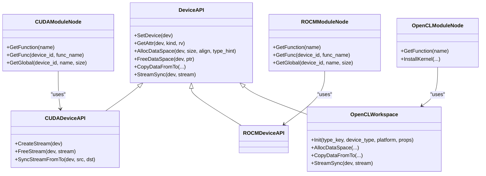
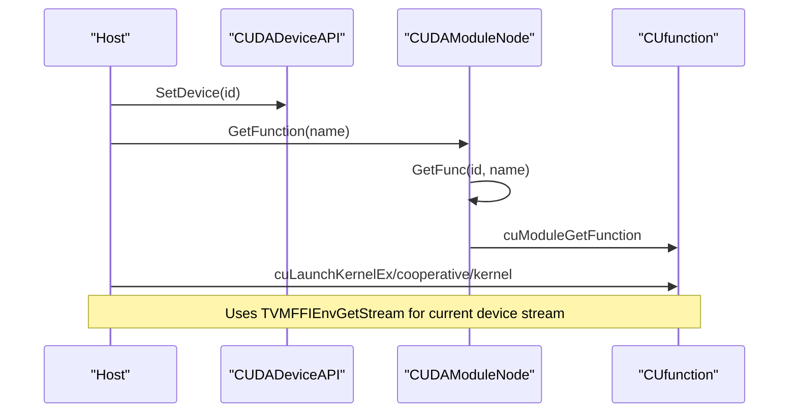
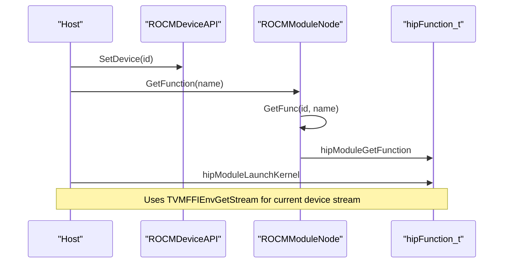
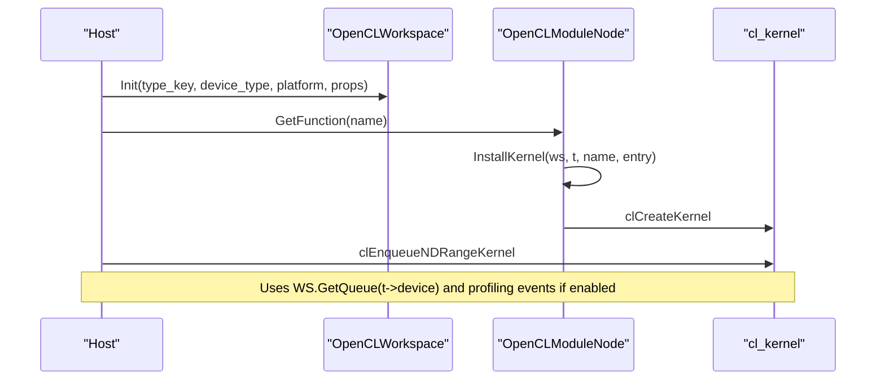
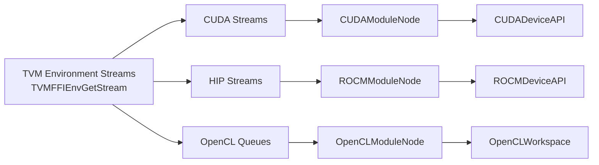

# GPU Targets

<cite>
**Referenced Files in This Document**
- [cuda_device_api.cc](file://src/runtime/cuda/cuda_device_api.cc)
- [cuda_module.cc](file://src/runtime/cuda/cuda_module.cc)
- [cuda_common.h](file://src/runtime/cuda/cuda_common.h)
- [rocm_device_api.cc](file://src/runtime/rocm/rocm_device_api.cc)
- [rocm_module.cc](file://src/runtime/rocm/rocm_module.cc)
- [rocm_common.h](file://src/runtime/rocm/rocm_common.h)
- [opencl_device_api.cc](file://src/runtime/opencl/opencl_device_api.cc)
- [opencl_module.cc](file://src/runtime/opencl/opencl_module.cc)
- [opencl_common.h](file://src/runtime/opencl/opencl_common.h)
- [test_target_codegen_cuda.py](file://tests/python/codegen/test_target_codegen_cuda.py)
- [test_target_codegen_rocm.py](file://tests/python/codegen/test_target_codegen_rocm.py)
- [test_target_codegen_opencl.py](file://tests/python/codegen/test_target_codegen_opencl.py)
</cite>

## Table of Contents
1. [Introduction](#introduction)
2. [Project Structure](#project-structure)
3. [Core Components](#core-components)
4. [Architecture Overview](#architecture-overview)
5. [Detailed Component Analysis](#detailed-component-analysis)
6. [Dependency Analysis](#dependency-analysis)
7. [Performance Considerations](#performance-considerations)
8. [Troubleshooting Guide](#troubleshooting-guide)
9. [Conclusion](#conclusion)
10. [Appendices](#appendices)

## Introduction
This document explains TVM’s GPU backend support for CUDA, ROCm (OpenCL/HIP), and OpenCL. It covers device initialization, memory management, kernel launch mechanisms, and stream handling. It also documents GPU-specific optimizations (memory coalescing, occupancy, register usage), compilation workflows for different GPU architectures, compute capability targeting, driver requirements, and practical examples for kernel compilation, memory transfers, and performance profiling. Multi-GPU support, peer-to-peer access, and distributed GPU computing scenarios are included.

## Project Structure
TVM organizes GPU backends under the runtime directory by vendor:
- CUDA: device API, module loader, and common utilities
- ROCm: device API, module loader, and common utilities
- OpenCL: device API, module loader, and common utilities

```mermaid
graph TB
subgraph "CUDA Backend"
CDAPI["CUDA Device API<br/>cuda_device_api.cc"]
CMOD["CUDA Module Loader<br/>cuda_module.cc"]
CCMM["CUDA Common Utilities<br/>cuda_common.h"]
end
subgraph "ROCm Backend"
RDAPI["ROCm Device API<br/>rocm_device_api.cc"]
RMOD["ROCm Module Loader<br/>rocm_module.cc"]
RCMM["ROCm Common Utilities<br/>rocm_common.h"]
end
subgraph "OpenCL Backend"
ODAPI["OpenCL Device API<br/>opencl_device_api.cc"]
OMOD["OpenCL Module Loader<br/>opencl_module.cc"]
OCMM["OpenCL Common Utilities<br/>opencl_common.h"]
end
CDAPI --> CMOD
RDAPI --> RMOD
ODAPI --> OMOD
CCMM --> CDAPI
RCMM --> RDAPI
OCMM --> ODAPI
```

**Diagram sources**
- [cuda_device_api.cc:39-274](file://src/runtime/cuda/cuda_device_api.cc#L39-L274)
- [cuda_module.cc:51-174](file://src/runtime/cuda/cuda_module.cc#L51-L174)
- [cuda_common.h:57-65](file://src/runtime/cuda/cuda_common.h#L57-L65)
- [rocm_device_api.cc:38-239](file://src/runtime/rocm/rocm_device_api.cc#L38-L239)
- [rocm_module.cc:50-151](file://src/runtime/rocm/rocm_module.cc#L50-L151)
- [rocm_common.h:54-64](file://src/runtime/rocm/rocm_common.h#L54-L64)
- [opencl_device_api.cc:123-393](file://src/runtime/opencl/opencl_device_api.cc#L123-L393)
- [opencl_module.cc:39-110](file://src/runtime/opencl/opencl_module.cc#L39-L110)
- [opencl_common.h:240-393](file://src/runtime/opencl/opencl_common.h#L240-L393)

**Section sources**
- [cuda_device_api.cc:39-274](file://src/runtime/cuda/cuda_device_api.cc#L39-L274)
- [rocm_device_api.cc:38-239](file://src/runtime/rocm/rocm_device_api.cc#L38-L239)
- [opencl_device_api.cc:123-393](file://src/runtime/opencl/opencl_device_api.cc#L123-L393)

## Core Components
- Device API: Provides device selection, attributes, memory allocation/free, and stream synchronization for each backend.
- Module Loader: Loads compiled binaries (PTX/CUBIN for CUDA; HSACO/HIP for ROCm; .cl/.bin for OpenCL) and exposes callable functions.
- Common Utilities: Shared thread-local workspace pools and error-handling macros.

Key responsibilities:
- CUDA: device selection, attributes via CUDA runtime/device API, host/device memory allocation, peer-to-peer copies, streams/events, timers, and kernel launch wrappers.
- ROCm: device selection, attributes via HIP, host/device memory allocation, peer-to-peer copies, streams, timers, and kernel launch wrappers.
- OpenCL: platform/device discovery, context/queue creation, buffer/image allocation, NDRange kernel launches, and profiling via events.

**Section sources**
- [cuda_device_api.cc:42-135](file://src/runtime/cuda/cuda_device_api.cc#L42-L135)
- [cuda_device_api.cc:136-180](file://src/runtime/cuda/cuda_device_api.cc#L136-L180)
- [cuda_device_api.cc:182-220](file://src/runtime/cuda/cuda_device_api.cc#L182-L220)
- [cuda_device_api.cc:222-250](file://src/runtime/cuda/cuda_device_api.cc#L222-L250)
- [cuda_module.cc:115-135](file://src/runtime/cuda/cuda_module.cc#L115-L135)
- [cuda_module.cc:188-255](file://src/runtime/cuda/cuda_module.cc#L188-L255)
- [rocm_device_api.cc:39-148](file://src/runtime/rocm/rocm_device_api.cc#L39-L148)
- [rocm_device_api.cc:149-170](file://src/runtime/rocm/rocm_device_api.cc#L149-L170)
- [rocm_device_api.cc:172-210](file://src/runtime/rocm/rocm_device_api.cc#L172-L210)
- [rocm_device_api.cc:212-215](file://src/runtime/rocm/rocm_device_api.cc#L212-L215)
- [rocm_module.cc:105-120](file://src/runtime/rocm/rocm_module.cc#L105-L120)
- [rocm_module.cc:165-184](file://src/runtime/rocm/rocm_module.cc#L165-L184)
- [opencl_device_api.cc:137-244](file://src/runtime/opencl/opencl_device_api.cc#L137-L244)
- [opencl_device_api.cc:258-306](file://src/runtime/opencl/opencl_device_api.cc#L258-L306)
- [opencl_device_api.cc:508-586](file://src/runtime/opencl/opencl_device_api.cc#L508-L586)
- [opencl_device_api.cc:588-592](file://src/runtime/opencl/opencl_device_api.cc#L588-L592)
- [opencl_module.cc:54-93](file://src/runtime/opencl/opencl_module.cc#L54-L93)
- [opencl_module.cc:226-277](file://src/runtime/opencl/opencl_module.cc#L226-L277)

## Architecture Overview
The runtime architecture separates device abstraction from module loading and kernel invocation. Each backend implements a DeviceAPI subclass and a ModuleNode subclass. Modules are lazily loaded per device and cached to avoid repeated driver calls.

**Diagram sources**
- [cuda_device_api.cc:39-274](file://src/runtime/cuda/cuda_device_api.cc#L39-L274)
- [rocm_device_api.cc:38-239](file://src/runtime/rocm/rocm_device_api.cc#L38-L239)
- [opencl_device_api.cc:240-393](file://src/runtime/opencl/opencl_device_api.cc#L240-L393)
- [cuda_module.cc:51-174](file://src/runtime/cuda/cuda_module.cc#L51-L174)
- [rocm_module.cc:50-151](file://src/runtime/rocm/rocm_module.cc#L50-L151)
- [opencl_module.cc:465-542](file://src/runtime/opencl/opencl_module.cc#L465-L542)

## Detailed Component Analysis

### CUDA Backend
- Device initialization and attributes: device existence, max threads/block, warp size, shared memory, compute capability, device name, clock rate, multiprocessor count, max thread dimensions, registers per block, L2 cache size, total/global memory, and available memory.
- Memory management: host pinned memory for host allocations, device memory, and alignment constraints; workspace pooling via thread-local storage.
- Streams and events: non-blocking streams, stream synchronization, event-based synchronization between streams, and timers using CUDA events.
- Kernel launch: lazy per-device module loading, dynamic shared memory configuration, cooperative launch variants, and programmatic stream serialization.
- Peer-to-peer: device-to-device copies across GPUs using peer copies when devices differ.

**Diagram sources**
- [cuda_device_api.cc:41-41](file://src/runtime/cuda/cuda_device_api.cc#L41-L41)
- [cuda_module.cc:188-255](file://src/runtime/cuda/cuda_module.cc#L188-L255)

**Section sources**
- [cuda_device_api.cc:42-135](file://src/runtime/cuda/cuda_device_api.cc#L42-L135)
- [cuda_device_api.cc:136-180](file://src/runtime/cuda/cuda_device_api.cc#L136-L180)
- [cuda_device_api.cc:182-220](file://src/runtime/cuda/cuda_device_api.cc#L182-L220)
- [cuda_device_api.cc:222-250](file://src/runtime/cuda/cuda_device_api.cc#L222-L250)
- [cuda_module.cc:115-135](file://src/runtime/cuda/cuda_module.cc#L115-L135)
- [cuda_module.cc:188-255](file://src/runtime/cuda/cuda_module.cc#L188-L255)
- [cuda_common.h:57-65](file://src/runtime/cuda/cuda_common.h#L57-L65)

### ROCm Backend
- Device initialization and attributes: device existence, max threads/block, warp size, shared memory, compute capability, device name, clock rate, multiprocessor count, max thread dimensions, registers per block, L2 cache size, total/global memory.
- Memory management: host/host-pinned allocations, device allocations, and workspace pooling.
- Streams and events: stream synchronization and timers using HIP events.
- Kernel launch: lazy per-device module loading and kernel launch via HIP APIs.

**Diagram sources**
- [rocm_device_api.cc:40-40](file://src/runtime/rocm/rocm_device_api.cc#L40-L40)
- [rocm_module.cc:165-184](file://src/runtime/rocm/rocm_module.cc#L165-L184)

**Section sources**
- [rocm_device_api.cc:41-147](file://src/runtime/rocm/rocm_device_api.cc#L41-L147)
- [rocm_device_api.cc:149-170](file://src/runtime/rocm/rocm_device_api.cc#L149-L170)
- [rocm_device_api.cc:172-210](file://src/runtime/rocm/rocm_device_api.cc#L172-L210)
- [rocm_module.cc:105-120](file://src/runtime/rocm/rocm_module.cc#L105-L120)
- [rocm_module.cc:165-184](file://src/runtime/rocm/rocm_module.cc#L165-L184)
- [rocm_common.h:54-64](file://src/runtime/rocm/rocm_common.h#L54-L64)

### OpenCL Backend
- Platform/device discovery and initialization: builds contexts/queues per platform, validates device OpenCL version, and stores device capabilities.
- Memory management: buffers and images with optional host pointer mapping; texture-like memory scopes; compatibility views between buffers and images.
- Streams and events: command queues, profiling events, and timer node that aggregates event durations.
- Kernel launch: per-thread kernel table, program creation/build per device, NDRange kernel enqueue, and argument binding.

**Diagram sources**
- [opencl_device_api.cc:673-763](file://src/runtime/opencl/opencl_device_api.cc#L673-L763)
- [opencl_module.cc:226-277](file://src/runtime/opencl/opencl_module.cc#L226-L277)
- [opencl_common.h:544-604](file://src/runtime/opencl/opencl_common.h#L544-L604)

**Section sources**
- [opencl_device_api.cc:137-244](file://src/runtime/opencl/opencl_device_api.cc#L137-L244)
- [opencl_device_api.cc:258-306](file://src/runtime/opencl/opencl_device_api.cc#L258-L306)
- [opencl_device_api.cc:508-586](file://src/runtime/opencl/opencl_device_api.cc#L508-L586)
- [opencl_device_api.cc:588-592](file://src/runtime/opencl/opencl_device_api.cc#L588-L592)
- [opencl_module.cc:54-93](file://src/runtime/opencl/opencl_module.cc#L54-L93)
- [opencl_module.cc:226-277](file://src/runtime/opencl/opencl_module.cc#L226-L277)
- [opencl_common.h:240-393](file://src/runtime/opencl/opencl_common.h#L240-L393)
- [opencl_common.h:544-604](file://src/runtime/opencl/opencl_common.h#L544-L604)

### Memory Coalescing, Occupancy, and Register Usage
- Memory coalescing: CUDA and ROCm backends rely on coalesced access patterns in generated kernels; TVM schedules and vectorizes memory accesses to maximize bandwidth utilization.
- Occupancy optimization: CUDA backends can configure dynamic shared memory per kernel launch to balance occupancy and shared memory usage; cooperative launches can improve throughput on newer architectures.
- Register usage: Backends expose register limits via device attributes; TVM’s codegen selects register-friendly schedules and limits register pressure where necessary.

[No sources needed since this section provides general guidance]

### Compilation Workflows and Compute Capability Targeting
- CUDA: compile to PTX or CUBIN; modules can be saved/loaded; inspect source via module inspection; compute capability is exposed via device attributes.
- ROCm: compile to HSACO/HIP; modules can be saved/loaded; inspect source via module inspection; GCN architecture exposed via device attributes.
- OpenCL: compile to .cl or precompiled binaries (.bin/xclbin/awsxclbin/aocx); program build per device; inspect source via module inspection.

**Section sources**
- [cuda_module.cc:82-113](file://src/runtime/cuda/cuda_module.cc#L82-L113)
- [rocm_module.cc:74-103](file://src/runtime/rocm/rocm_module.cc#L74-L103)
- [opencl_module.cc:163-187](file://src/runtime/opencl/opencl_module.cc#L163-L187)
- [opencl_module.cc:279-318](file://src/runtime/opencl/opencl_module.cc#L279-L318)

### Driver Requirements
- CUDA: CUDA runtime and driver; device attributes queried via CUDA runtime/device API; cuTensorMap support gated by CUDA version.
- ROCm: HIP runtime and HSA; device attributes queried via HIP; GCN architecture exposed.
- OpenCL: OpenCL platform and device; device version checked against target version; command queues and events used for synchronization and profiling.

**Section sources**
- [cuda_device_api.cc:64-71](file://src/runtime/cuda/cuda_device_api.cc#L64-L71)
- [rocm_device_api.cc:114-118](file://src/runtime/rocm/rocm_device_api.cc#L114-L118)
- [opencl_device_api.cc:699-718](file://src/runtime/opencl/opencl_device_api.cc#L699-L718)

### Practical Examples
- Kernel compilation and execution:
  - CUDA: load PTX/CUBIN module, get function, and launch with configured grid/block sizes and dynamic shared memory.
  - ROCm: load HSACO/HIP module, get function, and launch via HIP APIs.
  - OpenCL: load .cl or binary module, install kernel per device, and enqueue NDRange kernel.
- Memory transfer patterns:
  - CUDA: host/device/device-to-device copies, peer-to-peer copies across GPUs, and host pinned memory for faster transfers.
  - ROCm: host/device/device-to-device copies, peer-to-peer copies across GPUs.
  - OpenCL: buffer-to-buffer, buffer-to-image, image-to-buffer, and image-to-image copies; profiling events for timing.
- Performance profiling:
  - CUDA: timers using CUDA events; device memory queries; device attributes for capacity.
  - ROCm: timers using HIP events; device memory queries; device attributes for capacity.
  - OpenCL: timers using event profiling; queue profiling toggled dynamically.

**Section sources**
- [cuda_module.cc:188-255](file://src/runtime/cuda/cuda_module.cc#L188-L255)
- [rocm_module.cc:165-184](file://src/runtime/rocm/rocm_module.cc#L165-L184)
- [opencl_module.cc:54-93](file://src/runtime/opencl/opencl_module.cc#L54-L93)
- [cuda_device_api.cc:182-220](file://src/runtime/cuda/cuda_device_api.cc#L182-L220)
- [rocm_device_api.cc:172-210](file://src/runtime/rocm/rocm_device_api.cc#L172-L210)
- [opencl_device_api.cc:508-586](file://src/runtime/opencl/opencl_device_api.cc#L508-L586)
- [cuda_device_api.cc:297-338](file://src/runtime/cuda/cuda_device_api.cc#L297-L338)
- [rocm_device_api.cc:262-295](file://src/runtime/rocm/rocm_device_api.cc#L262-L295)
- [opencl_common.h:544-604](file://src/runtime/opencl/opencl_common.h#L544-L604)

### Multi-GPU Support, Peer-to-Peer Access, and Distributed Scenarios
- Multi-GPU: CUDA and ROCm backends maintain per-device modules and caches; device selection via SetDevice; streams per device.
- Peer-to-peer: CUDA and ROCm backends support device-to-device copies without host bounce; OpenCL uses device-to-device copies when supported.
- Distributed GPU computing: TVM’s runtime integrates with RPC and Disco for distributed execution; peer-to-peer and NCCL/RDMA integrations are available in extended components.

**Section sources**
- [cuda_device_api.cc:204-210](file://src/runtime/cuda/cuda_device_api.cc#L204-L210)
- [rocm_device_api.cc:193-200](file://src/runtime/rocm/rocm_device_api.cc#L193-L200)
- [opencl_device_api.cc:515-541](file://src/runtime/opencl/opencl_device_api.cc#L515-L541)

## Dependency Analysis
The backends share common abstractions (DeviceAPI, ModuleNode) and leverage TVM’s environment stream mechanism to route kernel launches to the correct device stream.

**Diagram sources**
- [cuda_module.cc:207-207](file://src/runtime/cuda/cuda_module.cc#L207-L207)
- [rocm_module.cc:174-174](file://src/runtime/rocm/rocm_module.cc#L174-L174)
- [opencl_module.cc:79-79](file://src/runtime/opencl/opencl_module.cc#L79-L79)
- [cuda_device_api.cc:222-228](file://src/runtime/cuda/cuda_device_api.cc#L222-L228)
- [rocm_device_api.cc:212-215](file://src/runtime/rocm/rocm_device_api.cc#L212-L215)
- [opencl_device_api.cc:286-292](file://src/runtime/opencl/opencl_device_api.cc#L286-L292)

**Section sources**
- [cuda_module.cc:188-255](file://src/runtime/cuda/cuda_module.cc#L188-L255)
- [rocm_module.cc:165-184](file://src/runtime/rocm/rocm_module.cc#L165-L184)
- [opencl_module.cc:54-93](file://src/runtime/opencl/opencl_module.cc#L54-L93)

## Performance Considerations
- Memory transfers: minimize host-device copies; prefer pinned host memory for faster transfers; use peer-to-peer copies when devices are connected.
- Kernel launch overhead: batch workloads; reuse modules and streams; avoid excessive synchronization.
- Occupancy: tune block sizes and dynamic shared memory to balance occupancy and shared memory usage.
- Register usage: avoid excessive register pressure; TVM’s codegen selects register-friendly schedules.
- Profiling: use backend-specific timers and events to identify bottlenecks.

[No sources needed since this section provides general guidance]

## Troubleshooting Guide
- CUDA launch failures: check error codes from driver API and CUDA runtime; review grid/block dimensions and dynamic shared memory configuration.
- ROCm launch failures: verify HIP module load and kernel retrieval; ensure device is set before launch.
- OpenCL build failures: inspect build logs and device capabilities; ensure correct format and target version.
- Memory errors: verify alignment constraints; ensure proper free paths for host and device allocations; handle sticky CUDA errors during exception unwinding.

**Section sources**
- [cuda_device_api.cc:154-170](file://src/runtime/cuda/cuda_device_api.cc#L154-L170)
- [cuda_module.cc:238-254](file://src/runtime/cuda/cuda_module.cc#L238-L254)
- [rocm_module.cc:114-118](file://src/runtime/rocm/rocm_module.cc#L114-L118)
- [opencl_module.cc:255-267](file://src/runtime/opencl/opencl_module.cc#L255-L267)

## Conclusion
TVM’s GPU backends provide robust device initialization, memory management, kernel launch, and stream handling across CUDA, ROCm, and OpenCL. The modular design enables efficient multi-GPU and distributed execution, while device attributes and timers support performance optimization and profiling. Compilation workflows target specific architectures and compute capabilities, and practical examples demonstrate kernel compilation, memory transfers, and performance measurement.

## Appendices
- Example tests for target codegen:
  - CUDA: [test_target_codegen_cuda.py](file://tests/python/codegen/test_target_codegen_cuda.py)
  - ROCm: [test_target_codegen_rocm.py](file://tests/python/codegen/test_target_codegen_rocm.py)
  - OpenCL: [test_target_codegen_opencl.py](file://tests/python/codegen/test_target_codegen_opencl.py)

[No sources needed since this section lists references without analysis]