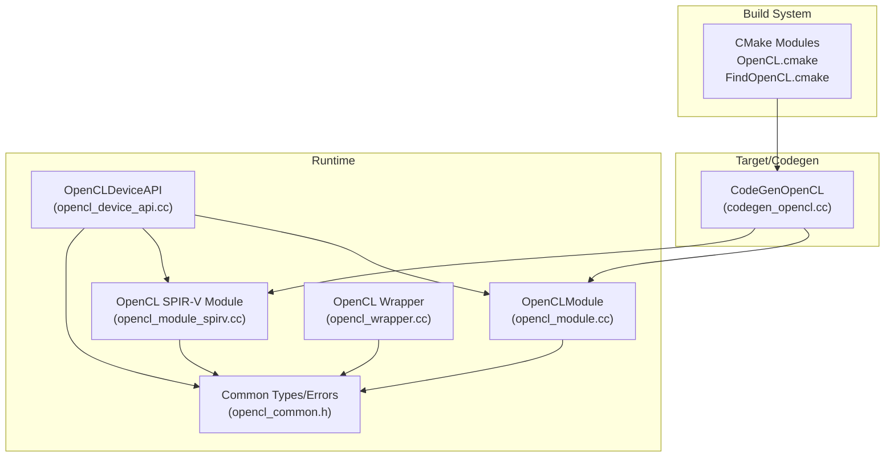
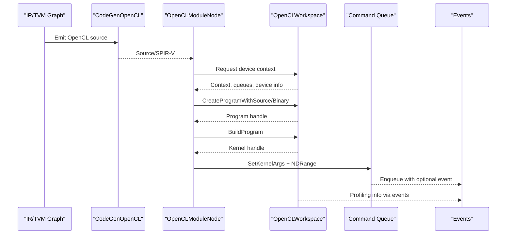
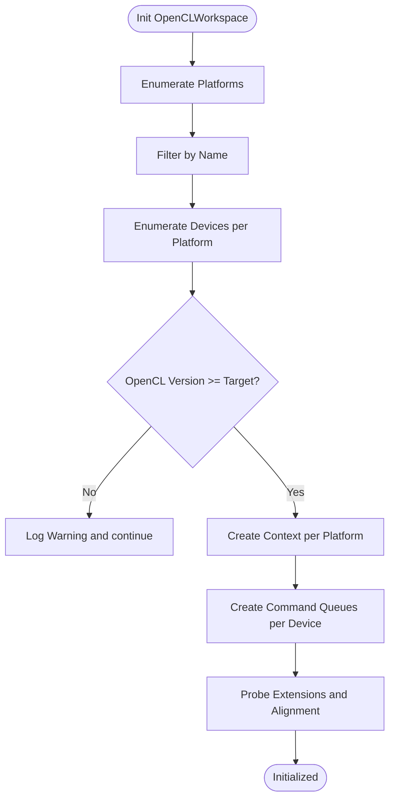
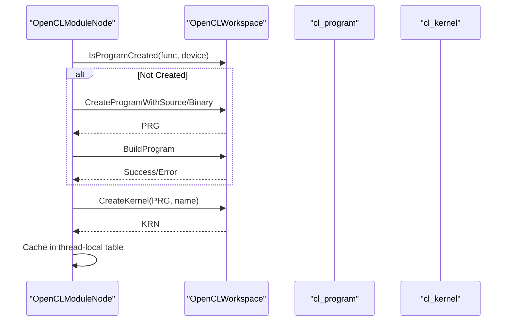
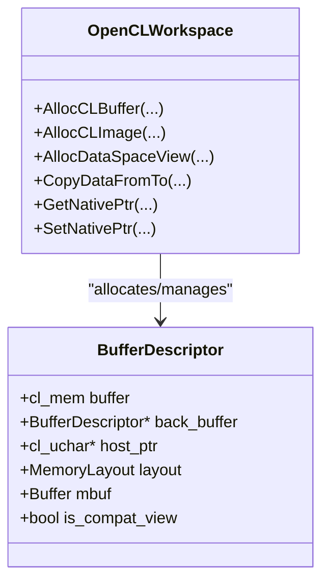
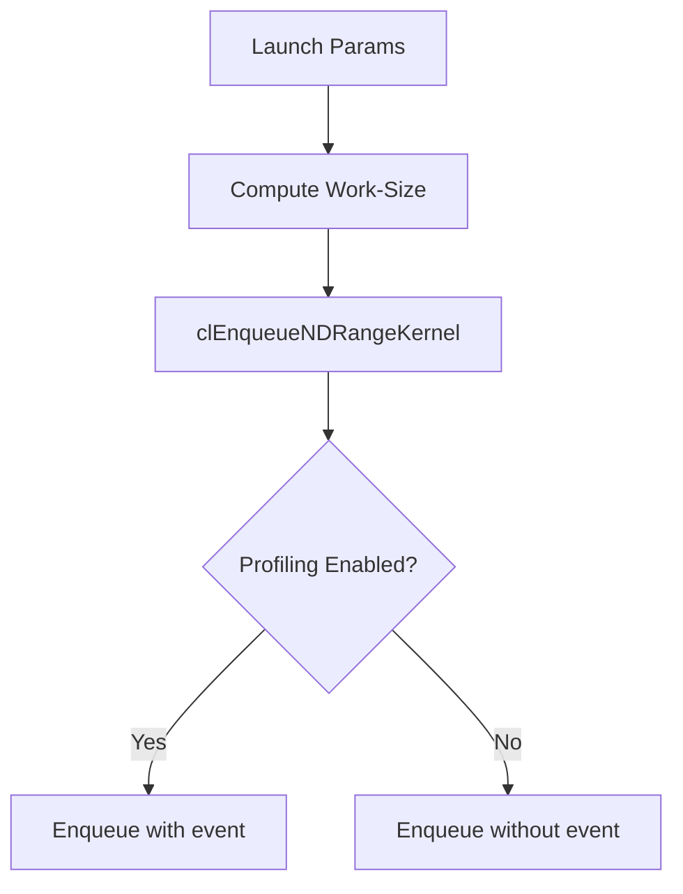
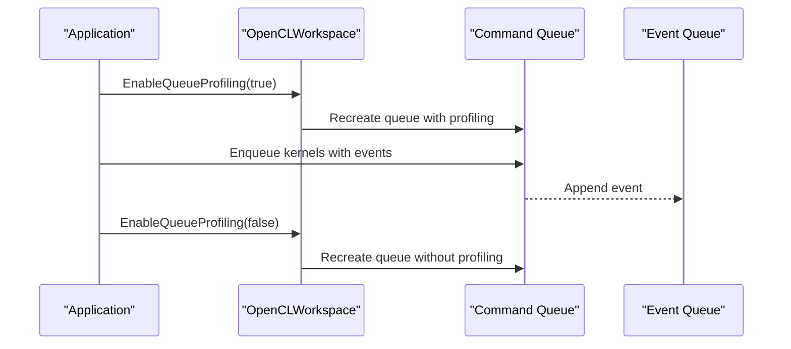
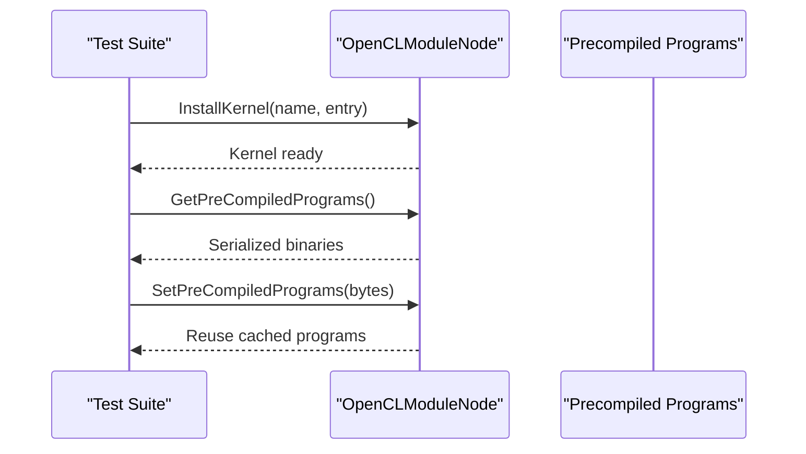
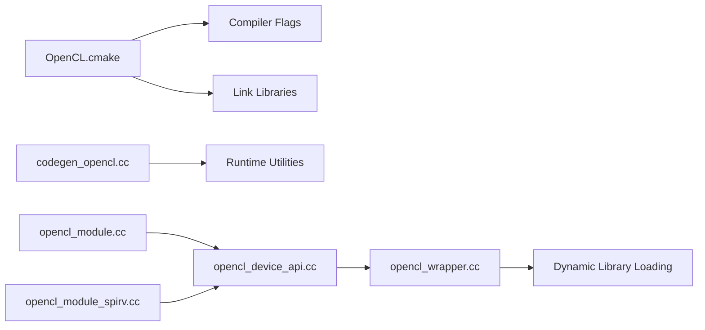

# OpenCL Backend

<cite>
**Referenced Files in This Document**
- [opencl_common.h](file://src/runtime/opencl/opencl_common.h)
- [opencl_device_api.cc](file://src/runtime/opencl/opencl_device_api.cc)
- [opencl_module.h](file://src/runtime/opencl/opencl_module.h)
- [opencl_module.cc](file://src/runtime/opencl/opencl_module.cc)
- [opencl_module_spirv.cc](file://src/runtime/opencl/opencl_module_spirv.cc)
- [opencl_wrapper.cc](file://src/runtime/opencl/opencl_wrapper/opencl_wrapper.cc)
- [OpenCL.cmake](file://cmake/modules/OpenCL.cmake)
- [FindOpenCL.cmake](file://cmake/utils/FindOpenCL.cmake)
- [codegen_opencl.cc](file://src/target/source/codegen_opencl.cc)
- [build_opencl_off.cc](file://src/target/opt/build_opencl_off.cc)
- [opencl_compile_to_bin.cc](file://tests/cpp-runtime/opencl/opencl_compile_to_bin.cc)
- [opencl_nativeptr.cc](file://tests/cpp-runtime/opencl/opencl_nativeptr.cc)
- [test_target_codegen_opencl.py](file://tests/python/codegen/test_target_codegen_opencl.py)
</cite>

## Table of Contents
1. [Introduction](#introduction)
2. [Project Structure](#project-structure)
3. [Core Components](#core-components)
4. [Architecture Overview](#architecture-overview)
5. [Detailed Component Analysis](#detailed-component-analysis)
6. [Dependency Analysis](#dependency-analysis)
7. [Performance Considerations](#performance-considerations)
8. [Troubleshooting Guide](#troubleshooting-guide)
9. [Conclusion](#conclusion)
10. [Appendices](#appendices)

## Introduction
This document explains the OpenCL backend implementation in TVM. It covers platform detection, device enumeration, and context creation; kernel compilation via program creation and build configuration; OpenCL-specific optimizations such as work-group sizing, local memory usage, and global memory access patterns; command queue management, event-based synchronization, and out-of-order execution; and practical examples for kernel compilation, buffer management across heterogeneous devices, and performance profiling. It also documents driver requirements, vendor-specific considerations, and cross-platform compatibility challenges.

## Project Structure
The OpenCL backend spans runtime, target/source, and CMake build integration:
- Runtime: device API, module loading, and kernel invocation
- Target/source: OpenCL code generation and intrinsics
- Build: CMake modules for locating and linking OpenCL libraries

**Diagram sources**
- [OpenCL.cmake:18-86](file://cmake/modules/OpenCL.cmake#L18-L86)
- [FindOpenCL.cmake:37-73](file://cmake/utils/FindOpenCL.cmake#L37-L73)
- [codegen_opencl.cc:1-200](file://src/target/source/codegen_opencl.cc#L1-L200)
- [opencl_device_api.cc:1-200](file://src/runtime/opencl/opencl_device_api.cc#L1-L200)
- [opencl_module.cc:1-200](file://src/runtime/opencl/opencl_module.cc#L1-L200)
- [opencl_module_spirv.cc:1-142](file://src/runtime/opencl/opencl_module_spirv.cc#L1-L142)
- [opencl_wrapper.cc:1-200](file://src/runtime/opencl/opencl_wrapper/opencl_wrapper.cc#L1-L200)
- [opencl_common.h:1-200](file://src/runtime/opencl/opencl_common.h#L1-L200)

**Section sources**
- [OpenCL.cmake:18-86](file://cmake/modules/OpenCL.cmake#L18-L86)
- [FindOpenCL.cmake:37-73](file://cmake/utils/FindOpenCL.cmake#L37-L73)
- [codegen_opencl.cc:1-200](file://src/target/source/codegen_opencl.cc#L1-L200)
- [opencl_device_api.cc:643-763](file://src/runtime/opencl/opencl_device_api.cc#L643-L763)
- [opencl_module.cc:189-277](file://src/runtime/opencl/opencl_module.cc#L189-L277)
- [opencl_module_spirv.cc:93-130](file://src/runtime/opencl/opencl_module_spirv.cc#L93-L130)
- [opencl_wrapper.cc:103-138](file://src/runtime/opencl/opencl_wrapper/opencl_wrapper.cc#L103-L138)
- [opencl_common.h:240-393](file://src/runtime/opencl/opencl_common.h#L240-L393)

## Core Components
- OpenCLWorkspace: central runtime for platform/device discovery, context creation, command queues, memory allocation, and kernel lifecycle
- OpenCLModuleNode and OpenCLSPIRVModuleNode: compile-time program creation, kernel installation, and runtime invocation
- CodeGenOpenCL: generates OpenCL kernels, handles texture scopes, and injects vendor-specific pragmas
- OpenCL wrapper: dynamic loading of OpenCL libraries for portability across platforms
- CMake integration: finds OpenCL SDK/library and enables optional features

Key responsibilities:
- Platform detection and device enumeration
- Context and command queue creation per device
- Program creation from source/binary and kernel build
- Event-based profiling and synchronization
- Buffer/image allocation and transfers
- Vendor-specific extensions and compatibility

**Section sources**
- [opencl_common.h:240-393](file://src/runtime/opencl/opencl_common.h#L240-L393)
- [opencl_device_api.cc:643-763](file://src/runtime/opencl/opencl_device_api.cc#L643-L763)
- [opencl_module.cc:226-277](file://src/runtime/opencl/opencl_module.cc#L226-L277)
- [opencl_module_spirv.cc:93-130](file://src/runtime/opencl/opencl_module_spirv.cc#L93-L130)
- [codegen_opencl.cc:40-181](file://src/target/source/codegen_opencl.cc#L40-L181)
- [opencl_wrapper.cc:103-138](file://src/runtime/opencl/opencl_wrapper/opencl_wrapper.cc#L103-L138)
- [OpenCL.cmake:18-86](file://cmake/modules/OpenCL.cmake#L18-L86)

## Architecture Overview
End-to-end flow from IR to execution on OpenCL devices:

**Diagram sources**
- [codegen_opencl.cc:106-181](file://src/target/source/codegen_opencl.cc#L106-L181)
- [opencl_module.cc:226-277](file://src/runtime/opencl/opencl_module.cc#L226-L277)
- [opencl_device_api.cc:740-763](file://src/runtime/opencl/opencl_device_api.cc#L740-L763)

## Detailed Component Analysis

### Platform Detection, Device Enumeration, and Context Creation
- Platform enumeration: retrieves platform IDs and filters by platform name
- Device enumeration: lists devices per platform by type (GPU/CPU/Accelerator)
- Version gating: only devices meeting the target OpenCL version are considered
- Context creation: creates a context per platform with discovered devices
- Command queue creation: one queue per device; stores queues and device info
- Extension probing: checks for image-from-buffer support and alignment

**Diagram sources**
- [opencl_device_api.cc:643-763](file://src/runtime/opencl/opencl_device_api.cc#L643-L763)

**Section sources**
- [opencl_device_api.cc:643-763](file://src/runtime/opencl/opencl_device_api.cc#L643-L763)
- [opencl_common.h:301-346](file://src/runtime/opencl/opencl_common.h#L301-L346)

### Kernel Compilation, Program Creation, and Build Configuration
- Source vs Binary: supports building from source or loading precompiled binaries
- Program creation: source via clCreateProgramWithSource or binary via clCreateProgramWithBinary
- Build configuration: clBuildProgram invoked per device; logs and errors surfaced
- Kernel installation: lazy creation and caching per thread-local kernel table
- Precompiled program caching: serialize/deserialize binaries to accelerate repeated builds

**Diagram sources**
- [opencl_module.cc:226-277](file://src/runtime/opencl/opencl_module.cc#L226-L277)
- [opencl_module.cc:279-346](file://src/runtime/opencl/opencl_module.cc#L279-L346)

**Section sources**
- [opencl_module.cc:226-277](file://src/runtime/opencl/opencl_module.cc#L226-L277)
- [opencl_module.cc:279-346](file://src/runtime/opencl/opencl_module.cc#L279-L346)
- [opencl_module_spirv.cc:93-130](file://src/runtime/opencl/opencl_module_spirv.cc#L93-L130)

### Buffer/Image Management and Memory Access Patterns
- Buffer allocation: clCreateBuffer with configurable flags; optional host pointer mapping
- Image allocation: clCreateImage with formats and descriptors; supports image-from-buffer when available
- View conversion: compatible views between buffers and images; fallback when unsupported
- Copy operations: buffer-to-buffer, buffer-to-image, image-to-buffer, image-to-image
- Native pointer access: optional host pointer mapping for direct CPU access

**Diagram sources**
- [opencl_common.h:426-458](file://src/runtime/opencl/opencl_common.h#L426-L458)
- [opencl_device_api.cc:258-586](file://src/runtime/opencl/opencl_device_api.cc#L258-L586)

**Section sources**
- [opencl_device_api.cc:258-586](file://src/runtime/opencl/opencl_device_api.cc#L258-L586)
- [opencl_common.h:426-458](file://src/runtime/opencl/opencl_common.h#L426-L458)

### Work-Group Sizing, Local Memory, and Global Access
- Work-group sizing: derived from launch parameters; global/local sizes adjusted before enqueue
- Local memory: configured via kernel arguments; managed through thread-local kernel table
- Global access patterns: optimized via image2d usage and texture scopes; sampler selection handled by codegen

**Diagram sources**
- [opencl_module.cc:55-93](file://src/runtime/opencl/opencl_module.cc#L55-L93)

**Section sources**
- [opencl_module.cc:55-93](file://src/runtime/opencl/opencl_module.cc#L55-L93)
- [codegen_opencl.cc:95-104](file://src/target/source/codegen_opencl.cc#L95-L104)

### Command Queue Management, Event-Based Synchronization, and Out-of-Order Execution
- Queue properties: queues created with or without profiling flags; can be recreated to toggle profiling
- Event-based profiling: collect CL_PROFILING_COMMAND_START/END; accumulate durations
- Synchronization: clFinish for device synchronization; clWaitForEvents for fine-grained waits
- Out-of-order execution: command queues support out-of-order semantics; events track completion

**Diagram sources**
- [opencl_common.h:544-599](file://src/runtime/opencl/opencl_common.h#L544-L599)
- [opencl_device_api.cc:322-340](file://src/runtime/opencl/opencl_device_api.cc#L322-L340)

**Section sources**
- [opencl_common.h:544-599](file://src/runtime/opencl/opencl_common.h#L544-L599)
- [opencl_device_api.cc:322-340](file://src/runtime/opencl/opencl_device_api.cc#L322-L340)

### Practical Examples
- Kernel compilation performance: precompiled program caching reduces build time
- Native pointer access: direct CPU access to OpenCL buffers when supported
- Python codegen tests: verifying OpenCL code generation and device execution

**Diagram sources**
- [opencl_compile_to_bin.cc:177-212](file://tests/cpp-runtime/opencl/opencl_compile_to_bin.cc#L177-L212)
- [opencl_module.cc:279-346](file://src/runtime/opencl/opencl_module.cc#L279-L346)

**Section sources**
- [opencl_compile_to_bin.cc:177-212](file://tests/cpp-runtime/opencl/opencl_compile_to_bin.cc#L177-L212)
- [opencl_nativeptr.cc:31-75](file://tests/cpp-runtime/opencl/opencl_nativeptr.cc#L31-L75)
- [test_target_codegen_opencl.py:28-200](file://tests/python/codegen/test_target_codegen_opencl.py#L28-L200)

## Dependency Analysis
- Build-time dependencies: CMake locates OpenCL SDK/library and defines compile-time flags
- Runtime dependencies: dynamic OpenCL loader supports multiple platforms; wrapper resolves function pointers
- Codegen dependencies: CodeGenOpenCL depends on runtime texture and thread storage scope utilities

**Diagram sources**
- [OpenCL.cmake:18-86](file://cmake/modules/OpenCL.cmake#L18-L86)
- [opencl_wrapper.cc:103-138](file://src/runtime/opencl/opencl_wrapper/opencl_wrapper.cc#L103-L138)
- [codegen_opencl.cc:1-200](file://src/target/source/codegen_opencl.cc#L1-L200)
- [opencl_device_api.cc:1-200](file://src/runtime/opencl/opencl_device_api.cc#L1-L200)
- [opencl_module.cc:1-200](file://src/runtime/opencl/opencl_module.cc#L1-L200)
- [opencl_module_spirv.cc:1-142](file://src/runtime/opencl/opencl_module_spirv.cc#L1-L142)

**Section sources**
- [OpenCL.cmake:18-86](file://cmake/modules/OpenCL.cmake#L18-L86)
- [FindOpenCL.cmake:37-73](file://cmake/utils/FindOpenCL.cmake#L37-L73)
- [opencl_wrapper.cc:103-138](file://src/runtime/opencl/opencl_wrapper/opencl_wrapper.cc#L103-L138)
- [codegen_opencl.cc:1-200](file://src/target/source/codegen_opencl.cc#L1-L200)
- [opencl_device_api.cc:1-200](file://src/runtime/opencl/opencl_device_api.cc#L1-L200)
- [opencl_module.cc:1-200](file://src/runtime/opencl/opencl_module.cc#L1-L200)
- [opencl_module_spirv.cc:1-142](file://src/runtime/opencl/opencl_module_spirv.cc#L1-L142)

## Performance Considerations
- Precompiled program caching: dramatically reduces repeated build times by serializing and reloading binaries
- Event-based profiling: minimal overhead when profiling is toggled around measurement windows
- Image2D usage: leverages texture samplers and pitch alignment for efficient global memory access
- Host pointer mapping: direct CPU access avoids extra copies when supported by the device
- Work-group sizing: align global/local sizes with device capabilities for optimal occupancy

[No sources needed since this section provides general guidance]

## Troubleshooting Guide
- No OpenCL platform/device found: verify platform filtering and device version compatibility
- Build failures: inspect build log retrieval and error messages from program build info
- Profiling not available: ensure queue is recreated with profiling flags and events are queried correctly
- Cross-platform issues: use the dynamic OpenCL wrapper to resolve platform-specific library paths

**Section sources**
- [opencl_device_api.cc:643-763](file://src/runtime/opencl/opencl_device_api.cc#L643-L763)
- [opencl_module.cc:256-267](file://src/runtime/opencl/opencl_module.cc#L256-L267)
- [opencl_common.h:544-599](file://src/runtime/opencl/opencl_common.h#L544-L599)
- [opencl_wrapper.cc:103-138](file://src/runtime/opencl/opencl_wrapper/opencl_wrapper.cc#L103-L138)

## Conclusion
TVM’s OpenCL backend integrates platform/device discovery, context and queue management, robust kernel compilation with precompiled program caching, and event-based profiling. It supports flexible memory layouts including images/textures, and provides mechanisms for vendor-specific extensions and cross-platform compatibility through a dynamic OpenCL loader.

## Appendices

### Driver Requirements and Compatibility
- Minimum OpenCL version target is configurable; devices must meet or exceed the target version
- Vendor-specific extensions: image-from-buffer support and vendor pragmas for half/double precision
- Dynamic library loading: wrapper supports multiple platform-specific OpenCL libraries

**Section sources**
- [opencl_common.h:54-56](file://src/runtime/opencl/opencl_common.h#L54-L56)
- [opencl_device_api.cc:699-718](file://src/runtime/opencl/opencl_device_api.cc#L699-L718)
- [opencl_wrapper.cc:42-68](file://src/runtime/opencl/opencl_wrapper/opencl_wrapper.cc#L42-L68)
- [codegen_opencl.cc:107-128](file://src/target/source/codegen_opencl.cc#L107-L128)

### Build-Time Configuration
- CMake: automatic or custom OpenCL SDK path; optional GoogleTest for OpenCL tests; host pointer and vendor flags

**Section sources**
- [OpenCL.cmake:18-86](file://cmake/modules/OpenCL.cmake#L18-L86)
- [FindOpenCL.cmake:37-73](file://cmake/utils/FindOpenCL.cmake#L37-L73)