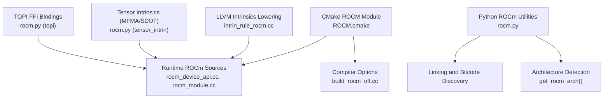
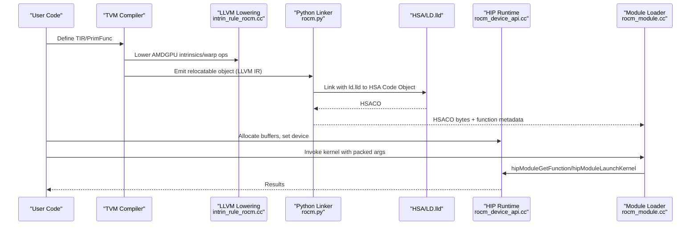
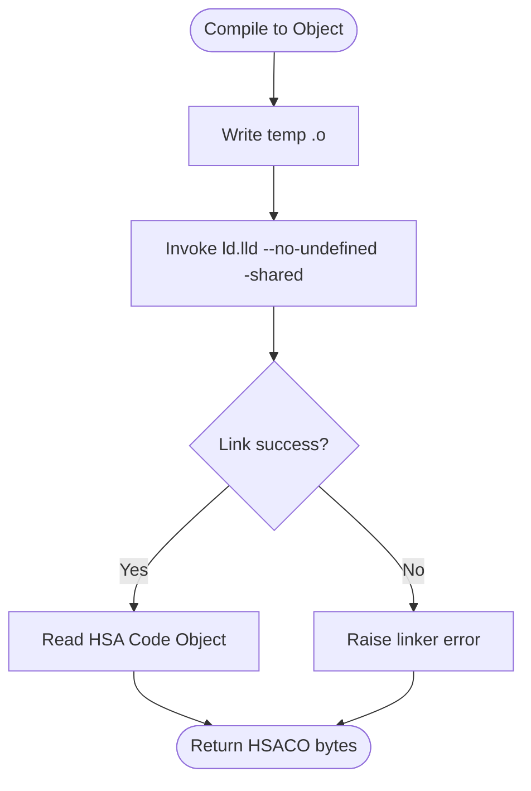
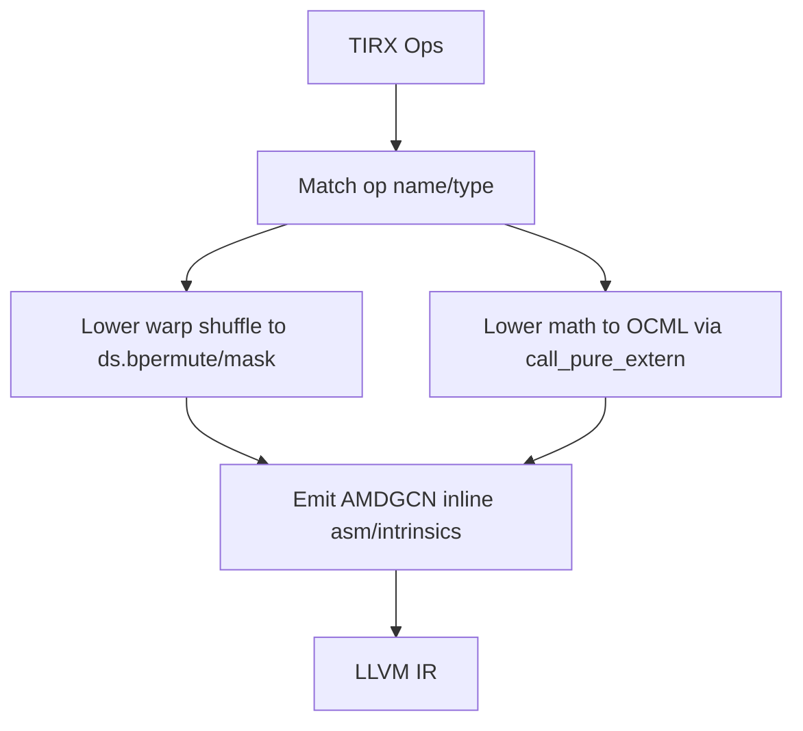
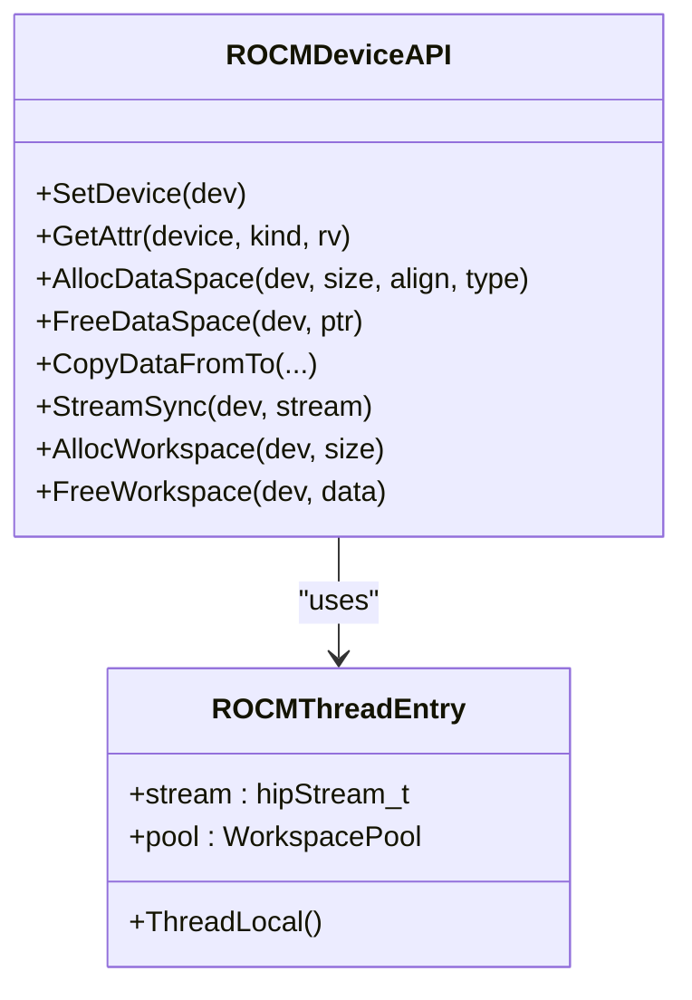
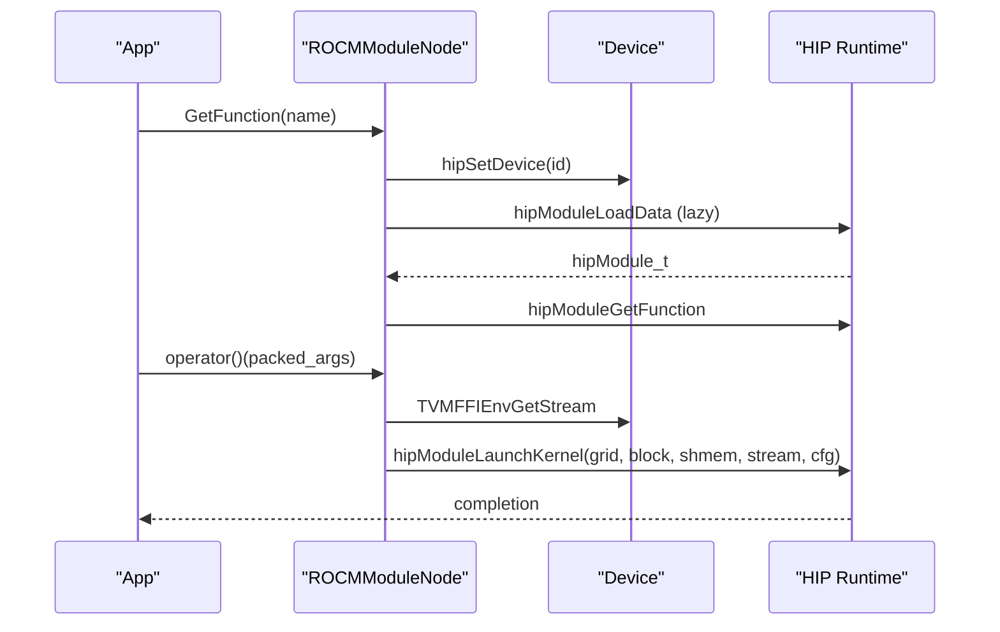
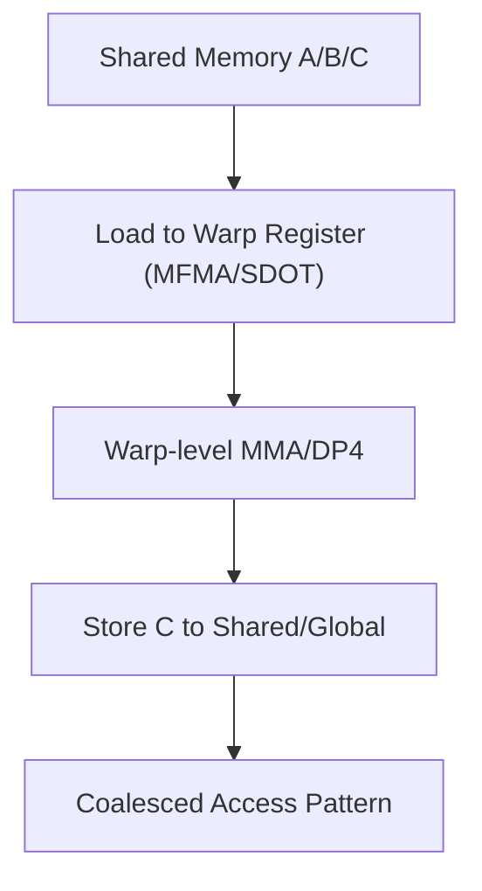
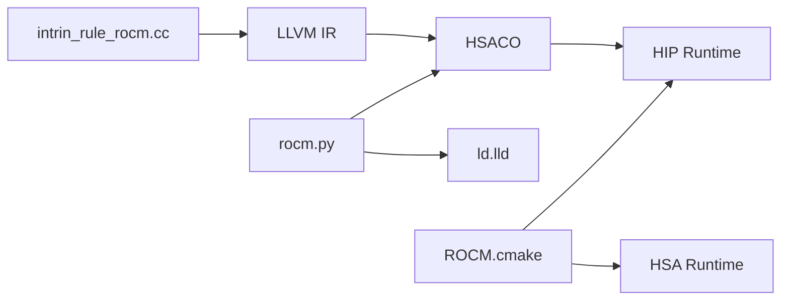

# ROCm Backend

<cite>
**Referenced Files in This Document**
- [ROCM.cmake](file://cmake/modules/ROCM.cmake)
- [rocm.py](file://python/tvm/contrib/rocm.py)
- [intrin_rule_rocm.cc](file://src/target/llvm/intrin_rule_rocm.cc)
- [rocm_common.h](file://src/runtime/rocm/rocm_common.h)
- [rocm_device_api.cc](file://src/runtime/rocm/rocm_device_api.cc)
- [rocm_module.cc](file://src/runtime/rocm/rocm_module.cc)
- [rocm_module.h](file://src/runtime/rocm/rocm_module.h)
- [build_rocm_off.cc](file://src/target/opt/build_rocm_off.cc)
- [rocm.py (tensor intrinsics)](file://python/tvm/s_tir/tensor_intrin/rocm.py)
- [rocm.py (TOPI FFI)](file://python/tvm/topi/cpp/rocm.py)
- [test_target_codegen_rocm.py](file://tests/python/codegen/test_target_codegen_rocm.py)
</cite>

## Table of Contents
1. [Introduction](#introduction)
2. [Project Structure](#project-structure)
3. [Core Components](#core-components)
4. [Architecture Overview](#architecture-overview)
5. [Detailed Component Analysis](#detailed-component-analysis)
6. [Dependency Analysis](#dependency-analysis)
7. [Performance Considerations](#performance-considerations)
8. [Troubleshooting Guide](#troubleshooting-guide)
9. [Conclusion](#conclusion)
10. [Appendices](#appendices)

## Introduction
This document explains the ROCm backend implementation in TVM, focusing on device initialization, HIP runtime integration, AMD GPU memory management, kernel compilation and HSACO generation, AMD GPU architecture targeting, ROCm-specific optimizations, stream and synchronization management, multi-device coordination, and practical examples. It also covers ROCm driver requirements, compatibility considerations, and troubleshooting steps.

## Project Structure
The ROCm backend spans build configuration, Python utilities, LLVM IR lowering, HIP runtime integration, and device-side execution. Key areas:
- Build and discovery: CMake module sets up ROCm and HSA/HIP libraries and defines build flags.
- Python utilities: Helpers for linking, bitcode discovery, architecture detection, and ROCm path resolution.
- Target lowering: AMDGPU intrinsics and warp shuffle lowering for ROCm.
- Runtime: HIP device API, module loading, and stream/event-based timers.
- Intrinsics and schedules: Tensor intrinsics for MFMA and SDOT-like operations.

**Diagram sources**
- [ROCM.cmake:18-72](file://cmake/modules/ROCM.cmake#L18-L72)
- [rocm.py:104-178](file://python/tvm/contrib/rocm.py#L104-L178)
- [intrin_rule_rocm.cc:1-217](file://src/target/llvm/intrin_rule_rocm.cc#L1-L217)
- [rocm_device_api.cc:38-311](file://src/runtime/rocm/rocm_device_api.cc#L38-L311)
- [rocm_module.cc:46-249](file://src/runtime/rocm/rocm_module.cc#L46-L249)
- [rocm.py (tensor intrinsics):1-478](file://python/tvm/s_tir/tensor_intrin/rocm.py#L1-L478)
- [rocm.py (TOPI FFI):1-22](file://python/tvm/topi/cpp/rocm.py#L1-L22)

**Section sources**
- [ROCM.cmake:18-72](file://cmake/modules/ROCM.cmake#L18-L72)
- [rocm.py:104-178](file://python/tvm/contrib/rocm.py#L104-L178)

## Core Components
- ROCm build configuration and discovery:
  - Uses CMake to locate ROCm and define platform macros and link libraries.
  - Supports optional HIPBLAS and rocThrust integration.
- Python linking and bitcode discovery:
  - Provides a linker callback to convert relocatable object files to HSA Code Objects via ld.lld.
  - Discovers ROCm device library bitcodes for math and ISA features.
  - Detects AMD GPU architecture via rocminfo or defaults to a baseline.
- Target lowering for AMDGPU:
  - Lowers TIRX warp shuffle and common math intrinsics to AMDGCN LLVM intrinsics.
- Runtime HIP device API:
  - Exposes device attributes, memory allocation/free, peer-to-peer copies, and stream synchronization.
  - Implements timer events and integrates with TVM’s stream model.
- ROCm module loader:
  - Loads HSACO binaries per device, caches functions, and launches kernels with packed args.
- Tensor intrinsics:
  - Registers MFMA and SDOT-style tensor intrinsics for efficient MMA on AMD architectures.

**Section sources**
- [ROCM.cmake:18-72](file://cmake/modules/ROCM.cmake#L18-L72)
- [rocm.py:66-178](file://python/tvm/contrib/rocm.py#L66-L178)
- [intrin_rule_rocm.cc:40-217](file://src/target/llvm/intrin_rule_rocm.cc#L40-L217)
- [rocm_device_api.cc:38-311](file://src/runtime/rocm/rocm_device_api.cc#L38-L311)
- [rocm_module.cc:46-249](file://src/runtime/rocm/rocm_module.cc#L46-L249)
- [rocm.py (tensor intrinsics):30-478](file://python/tvm/s_tir/tensor_intrin/rocm.py#L30-L478)

## Architecture Overview
End-to-end flow from TIR to runnable HSACO on AMD GPUs:

**Diagram sources**
- [intrin_rule_rocm.cc:40-217](file://src/target/llvm/intrin_rule_rocm.cc#L40-L217)
- [rocm.py:66-126](file://python/tvm/contrib/rocm.py#L66-L126)
- [rocm_device_api.cc:163-210](file://src/runtime/rocm/rocm_device_api.cc#L163-L210)
- [rocm_module.cc:105-184](file://src/runtime/rocm/rocm_module.cc#L105-L184)

## Detailed Component Analysis

### ROCm Build and Discovery
- CMake module locates ROCm, adds platform definitions, and links HIP/HSA libraries.
- Optional HIPBLAS and rocThrust support are gated by flags and require hipcc for compilation.
- When ROCm is disabled, a fallback source module is returned.

**Section sources**
- [ROCM.cmake:18-72](file://cmake/modules/ROCM.cmake#L18-L72)
- [build_rocm_off.cc:29-40](file://src/target/opt/build_rocm_off.cc#L29-L40)

### Python Linker and Bitcode Discovery
- Linker callback writes temporary object and invokes ld.lld with shared and no-undefined flags to produce a HSA Code Object.
- Bitcode discovery enumerates required AMDGCN bitcodes (math, ISA features, wavefront size) and validates presence.
- Architecture detection uses rocminfo to infer the target GCN arch; falls back to a default if unavailable.

**Diagram sources**
- [rocm.py:66-126](file://python/tvm/contrib/rocm.py#L66-L126)

**Section sources**
- [rocm.py:66-178](file://python/tvm/contrib/rocm.py#L66-L178)

### Target Lowering for AMDGPU Intrinsics
- Warp shuffle and related operations are lowered to AMDGCN LLVM intrinsics.
- Math intrinsics (exp, log, sqrt, etc.) are dispatched to OCML via pure extern calls.
- This ensures kernels target AMD hardware efficiently.

**Diagram sources**
- [intrin_rule_rocm.cc:40-217](file://src/target/llvm/intrin_rule_rocm.cc#L40-L217)

**Section sources**
- [intrin_rule_rocm.cc:40-217](file://src/target/llvm/intrin_rule_rocm.cc#L40-L217)

### HIP Runtime Device API
- Device attributes: max threads/block, warp size, shared memory, compute version, device name, multiprocessor count, L2 cache size, total/global memory.
- Memory management: host/device allocations with proper alignment; peer-to-peer copies; CPU<->GPU copies.
- Streams and synchronization: per-thread stream retrieval, stream sync, event-based timing.

**Diagram sources**
- [rocm_device_api.cc:38-311](file://src/runtime/rocm/rocm_device_api.cc#L38-L311)
- [rocm_common.h:54-64](file://src/runtime/rocm/rocm_common.h#L54-L64)

**Section sources**
- [rocm_device_api.cc:38-311](file://src/runtime/rocm/rocm_device_api.cc#L38-L311)
- [rocm_common.h:54-64](file://src/runtime/rocm/rocm_common.h#L54-L64)

### ROCm Module Loader and Kernel Launch
- Per-GPU module caching: lazily loads HSACO into device contexts.
- Function retrieval and kernel launch with packed arguments and dynamic shared memory.
- Multi-device support with per-device caches and locks.

**Diagram sources**
- [rocm_module.cc:105-184](file://src/runtime/rocm/rocm_module.cc#L105-L184)
- [rocm_module.h:38-51](file://src/runtime/rocm/rocm_module.h#L38-L51)

**Section sources**
- [rocm_module.cc:46-249](file://src/runtime/rocm/rocm_module.cc#L46-L249)
- [rocm_module.h:38-51](file://src/runtime/rocm/rocm_module.h#L38-L51)

### ROCm-Specific Optimizations
- Warp-level operations: shuffle variants lowered to AMDGCN ds.bpermute sequences.
- Tensor intrinsics:
  - SDOT-like 4-wide dot-product intrinsic for int8 accumulators.
  - MFMA intrinsics for float16/f32/int8 on 16x16 tiles with k=4/16 configurations.
  - Index maps for efficient shared-to-warp and warp-to-global transfers.
- LDS usage and coalescing: tensor intrinsics coordinate shared memory layouts and warp-level register mapping to maximize throughput.

**Diagram sources**
- [rocm.py (tensor intrinsics):30-478](file://python/tvm/s_tir/tensor_intrin/rocm.py#L30-L478)

**Section sources**
- [rocm.py (tensor intrinsics):30-478](file://python/tvm/s_tir/tensor_intrin/rocm.py#L30-L478)
- [intrin_rule_rocm.cc:63-104](file://src/target/llvm/intrin_rule_rocm.cc#L63-L104)

### Stream Management, Synchronization, and Timing
- Stream retrieval from TVM environment per device.
- Stream synchronization and event-based timers for performance measurement.
- Multi-device coordination via per-device streams and module caches.

**Section sources**
- [rocm_device_api.cc:212-215](file://src/runtime/rocm/rocm_device_api.cc#L212-L215)
- [rocm_device_api.cc:262-295](file://src/runtime/rocm/rocm_device_api.cc#L262-L295)
- [rocm_module.cc:174-184](file://src/runtime/rocm/rocm_module.cc#L174-L184)

### Practical Examples
- Compiling and running kernels with ROCm target, verifying inf/nan handling, vectorized arithmetic, and warp shuffle semantics.
- These tests demonstrate end-to-end compilation, linking, and execution on ROCm devices.

**Section sources**
- [test_target_codegen_rocm.py:26-155](file://tests/python/codegen/test_target_codegen_rocm.py#L26-L155)

## Dependency Analysis
- Build-time dependencies:
  - ROCm toolkit, HSA runtime, HIP runtime, and optionally HIPBLAS/rocThrust.
  - ld.lld for linking relocatable objects into HSACO.
- Runtime dependencies:
  - HIP runtime for device APIs, module loading, and kernel launches.
  - HSA for agent enumeration and code object loading (via HIP).
- Target lowering depends on LLVM IR emission and AMDGCN intrinsics.

**Diagram sources**
- [ROCM.cmake:18-72](file://cmake/modules/ROCM.cmake#L18-L72)
- [rocm.py:66-126](file://python/tvm/contrib/rocm.py#L66-L126)
- [intrin_rule_rocm.cc:40-217](file://src/target/llvm/intrin_rule_rocm.cc#L40-L217)

**Section sources**
- [ROCM.cmake:18-72](file://cmake/modules/ROCM.cmake#L18-L72)
- [rocm.py:66-126](file://python/tvm/contrib/rocm.py#L66-L126)

## Performance Considerations
- Prefer vectorized memory access and coalesced LDS layouts to maximize bandwidth.
- Use warp shuffle and MFMA/SDOT intrinsics to exploit wavefront-level parallelism and specialized MAC units.
- Tune grid/block dimensions to utilize occupancy targets and avoid register spills.
- Minimize host-device transfers and overlap computation with data movement using streams.
- Validate math function lowering to OCML to ensure accurate and fast math on AMD GPUs.

## Troubleshooting Guide
- ROCm not found during build:
  - Ensure ROCm is installed and visible to CMake; the build will fail if USE_ROCM is enabled but ROCM is not found.
- Linker failures when generating HSACO:
  - Verify ld.lld availability and version compatibility; the linker checks for undefined symbols and reports detailed errors.
- Missing bitcode files:
  - Confirm the presence of required AMDGCN bitcodes (e.g., oclc_* and ISA version files) in the ROCm bitcode directory.
- Architecture detection issues:
  - If rocminfo is not available, the system falls back to a default architecture; set the appropriate offload arch manually if needed.
- Runtime errors:
  - Use HIP error macros to diagnose HIP API failures; check device attributes and memory alignment requirements.

**Section sources**
- [ROCM.cmake:30-34](file://cmake/modules/ROCM.cmake#L30-L34)
- [rocm.py:66-102](file://python/tvm/contrib/rocm.py#L66-L102)
- [rocm.py:128-178](file://python/tvm/contrib/rocm.py#L128-L178)
- [rocm.py:232-273](file://python/tvm/contrib/rocm.py#L232-L273)

## Conclusion
The ROCm backend in TVM integrates HIP runtime, HSA, and LLVM lowering to compile and execute efficient kernels on AMD GPUs. It provides robust device management, stream-based execution, and ROCm-specific optimizations including warp-level operations and tensor intrinsics. With proper ROCm toolchain setup and architecture targeting, developers can achieve high-performance execution of TIR/TVM programs on AMD hardware.

## Appendices

### ROCm Driver Requirements and Compatibility
- Toolchain:
  - ROCm SDK with HIP runtime and HSA runtime.
  - ld.lld for linking relocatable objects into HSACO.
- Architecture targeting:
  - Automatic detection via rocminfo; fallback to default architecture if unavailable.
  - Manual override via environment variables when automatic detection fails.

**Section sources**
- [ROCM.cmake:18-27](file://cmake/modules/ROCM.cmake#L18-L27)
- [rocm.py:232-273](file://python/tvm/contrib/rocm.py#L232-L273)

### Practical Example References
- Kernel compilation and execution on ROCm devices:
  - Tests covering inf/nan handling, vectorized arithmetic, and warp shuffle behavior.

**Section sources**
- [test_target_codegen_rocm.py:26-155](file://tests/python/codegen/test_target_codegen_rocm.py#L26-L155)