# Hardware Backends

<cite>
**Referenced Files in This Document**
- [device.py](file://python/tvm/runtime/device.py)
- [target.py](file://python/tvm/target/target.py)
- [detect_target.py](file://python/tvm/target/detect_target.py)
- [device_api.cc](file://src/runtime/device_api.cc)
- [cpu_device_api.cc](file://src/runtime/cpu_device_api.cc)
- [dlpack.h](file://3rdparty/tvm-ffi/3rdparty/dlpack/include/dlpack/dlpack.h)
- [CUDA.cmake](file://cmake/modules/CUDA.cmake)
- [ROCm.cmake](file://cmake/modules/ROCm.cmake)
- [Metal.cmake](file://cmake/modules/Metal.cmake)
- [Vulkan.cmake](file://cmake/modules/Vulkan.cmake)
- [Hexagon.cmake](file://cmake/modules/Hexagon.cmake)
- [README.md](file://apps/hexagon_api/README.md)
- [launcher_main.cc](file://apps/hexagon_launcher/launcher_main.cc)
- [README.md](file://apps/ios_rpc/README.md)
- [README.md](file://apps/android_rpc/README.md)
</cite>

## Table of Contents
1. [Introduction](#introduction)
2. [Project Structure](#project-structure)
3. [Core Components](#core-components)
4. [Architecture Overview](#architecture-overview)
5. [Detailed Component Analysis](#detailed-component-analysis)
6. [Dependency Analysis](#dependency-analysis)
7. [Performance Considerations](#performance-considerations)
8. [Troubleshooting Guide](#troubleshooting-guide)
9. [Conclusion](#conclusion)
10. [Appendices](#appendices)

## Introduction
This document explains TVM’s hardware backend system comprehensively. It covers target support across CPU architectures (x86, ARM, RISC-V), GPU backends (CUDA, ROCm, OpenCL), mobile platforms (Metal, Vulkan, NNAPI), and specialized accelerators (Hexagon DSP). It documents the backend registration system, device API abstractions, and memory management across hardware types. It also describes target configuration, capability detection, optimization strategies, practical compilation examples, performance tuning, debugging techniques, the plugin architecture for extending backends, cross-compilation workflows, deployment considerations, runtime selection, and performance characteristics.

## Project Structure
TVM organizes backend support across Python APIs, C++ runtime, and CMake modules:
- Python runtime exposes device capabilities and streams.
- Python target constructs and detects targets from devices.
- C++ runtime implements device abstraction and memory management.
- CMake modules integrate optional backends (CUDA, ROCm, Metal, Vulkan, Hexagon) and external libraries.

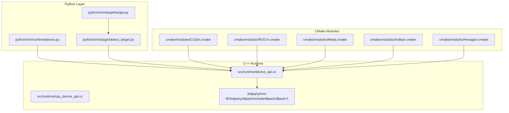

**Diagram sources**
- [device.py:1-331](file://python/tvm/runtime/device.py#L1-L331)
- [target.py:1-233](file://python/tvm/target/target.py#L1-L233)
- [detect_target.py:1-148](file://python/tvm/target/detect_target.py#L1-L148)
- [device_api.cc:1-278](file://src/runtime/device_api.cc#L1-L278)
- [cpu_device_api.cc:1-167](file://src/runtime/cpu_device_api.cc#L1-L167)
- [dlpack.h:68-136](file://3rdparty/tvm-ffi/3rdparty/dlpack/include/dlpack/dlpack.h#L68-L136)
- [CUDA.cmake:1-143](file://cmake/modules/CUDA.cmake#L1-L143)
- [ROCm.cmake:1-73](file://cmake/modules/ROCm.cmake#L1-L73)
- [Metal.cmake:1-29](file://cmake/modules/Metal.cmake#L1-L29)
- [Vulkan.cmake:1-39](file://cmake/modules/Vulkan.cmake#L1-L39)
- [Hexagon.cmake:1-344](file://cmake/modules/Hexagon.cmake#L1-L344)

**Section sources**
- [device.py:1-331](file://python/tvm/runtime/device.py#L1-L331)
- [target.py:1-233](file://python/tvm/target/target.py#L1-L233)
- [detect_target.py:1-148](file://python/tvm/target/detect_target.py#L1-L148)
- [device_api.cc:1-278](file://src/runtime/device_api.cc#L1-L278)
- [cpu_device_api.cc:1-167](file://src/runtime/cpu_device_api.cc#L1-L167)
- [dlpack.h:68-136](file://3rdparty/tvm-ffi/3rdparty/dlpack/include/dlpack/dlpack.h#L68-L136)
- [CUDA.cmake:1-143](file://cmake/modules/CUDA.cmake#L1-L143)
- [ROCm.cmake:1-73](file://cmake/modules/ROCm.cmake#L1-L73)
- [Metal.cmake:1-29](file://cmake/modules/Metal.cmake#L1-L29)
- [Vulkan.cmake:1-39](file://cmake/modules/Vulkan.cmake#L1-L39)
- [Hexagon.cmake:1-344](file://cmake/modules/Hexagon.cmake#L1-L344)

## Core Components
- Device API Abstraction: Centralized manager resolves the correct backend DeviceAPI by device type and exposes attributes and streams.
- Target System: Constructs targets from strings, dictionaries, tags, and device detection; exposes features and attributes.
- Capability Detection: Auto-detects target kinds and parameters from live devices.
- Memory Management: Provides unified allocation, alignment, and workspace pooling across backends.
- Backend Registration: Uses global registry functions keyed by device_api.<backend> to bind runtime implementations.

Key responsibilities:
- Device API Manager locates backend implementations and caches them.
- CPU backend provides host memory allocation and attributes.
- Python device wrapper surfaces device capabilities and stream controls.
- CMake modules conditionally include and link backend-specific sources and libraries.

**Section sources**
- [device_api.cc:49-95](file://src/runtime/device_api.cc#L49-L95)
- [cpu_device_api.cc:50-139](file://src/runtime/cpu_device_api.cc#L50-L139)
- [device.py:29-331](file://python/tvm/runtime/device.py#L29-L331)
- [target.py:51-233](file://python/tvm/target/target.py#L51-L233)
- [detect_target.py:109-148](file://python/tvm/target/detect_target.py#L109-L148)

## Architecture Overview
The backend architecture separates concerns between Python configuration and capability queries, and C++ runtime execution and memory management. The DeviceAPIManager dynamically loads backend implementations via global registry functions. CMake integrates optional backends and external libraries.

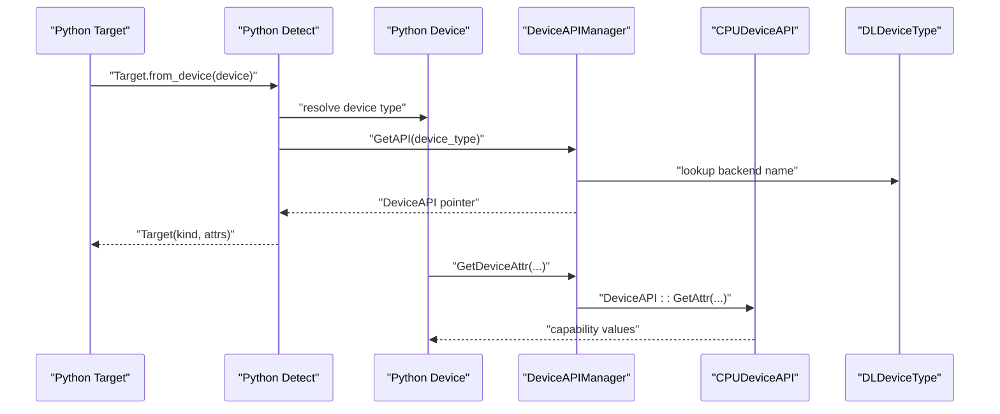

**Diagram sources**
- [detect_target.py:109-148](file://python/tvm/target/detect_target.py#L109-L148)
- [device_api.cc:49-95](file://src/runtime/device_api.cc#L49-L95)
- [cpu_device_api.cc:50-94](file://src/runtime/cpu_device_api.cc#L50-L94)
- [device.py:32-331](file://python/tvm/runtime/device.py#L32-L331)

**Section sources**
- [device_api.cc:49-95](file://src/runtime/device_api.cc#L49-L95)
- [cpu_device_api.cc:50-94](file://src/runtime/cpu_device_api.cc#L50-L94)
- [device.py:29-331](file://python/tvm/runtime/device.py#L29-L331)
- [detect_target.py:109-148](file://python/tvm/target/detect_target.py#L109-L148)

## Detailed Component Analysis

### Device API Abstraction
- DeviceAPIManager: Resolves backend DeviceAPI instances by device type or RPC, with lazy initialization and caching. It uses global registry functions named device_api.<backend>.
- DeviceAPI base: Defines workspace/data allocation, copying, stream creation/freeing, synchronization, and attribute retrieval.
- CPUDeviceAPI: Implements host memory allocation, attribute queries (e.g., total/global memory), and stream sync stubs.

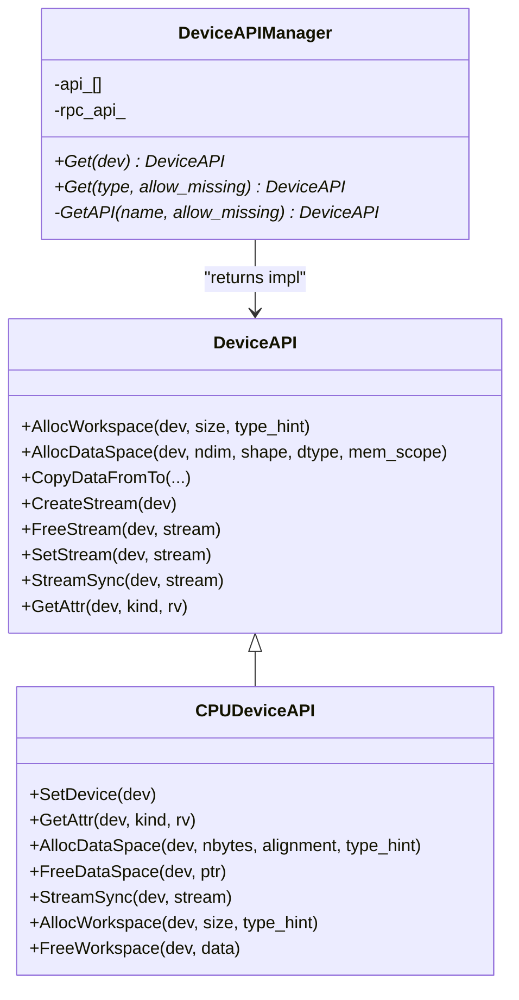

**Diagram sources**
- [device_api.cc:49-202](file://src/runtime/device_api.cc#L49-L202)
- [cpu_device_api.cc:50-164](file://src/runtime/cpu_device_api.cc#L50-L164)

**Section sources**
- [device_api.cc:49-202](file://src/runtime/device_api.cc#L49-L202)
- [cpu_device_api.cc:50-164](file://src/runtime/cpu_device_api.cc#L50-L164)

### Target System and Capability Detection
- Target: Encapsulates compilation configuration (kind, arch, mtriple, mcpu, host, libs, etc.) and exposes features and attributes. It supports construction from strings, dicts, tags, and device detection.
- TargetFeatures: Dynamic feature access via target-specific getters.
- detect_target_from_device: Maps live devices to target configurations, auto-filling backend-specific attributes (e.g., warp size, shared memory, compute/arch).

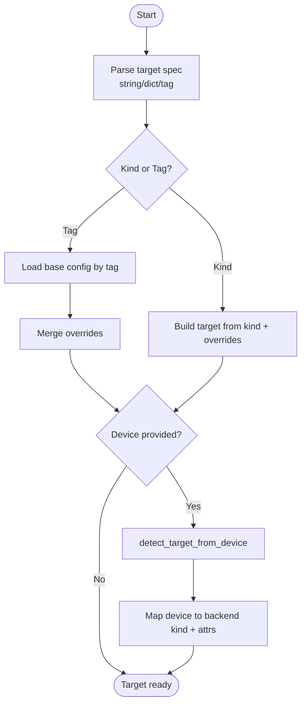

**Diagram sources**
- [target.py:51-233](file://python/tvm/target/target.py#L51-L233)
- [detect_target.py:109-148](file://python/tvm/target/detect_target.py#L109-L148)

**Section sources**
- [target.py:51-233](file://python/tvm/target/target.py#L51-L233)
- [detect_target.py:109-148](file://python/tvm/target/detect_target.py#L109-L148)

### Memory Management Across Backends
- Unified allocation: DeviceAPI::AllocDataSpace computes size and alignment from tensor shapes and dtype, delegating to backend-specific AllocDataSpace.
- Workspace pools: CPUDeviceAPI uses a thread-local pool for temporary allocations.
- Copy semantics: CopyDataFromTo validates contiguity and size equality, then delegates to backend-specific CopyDataFromTo.

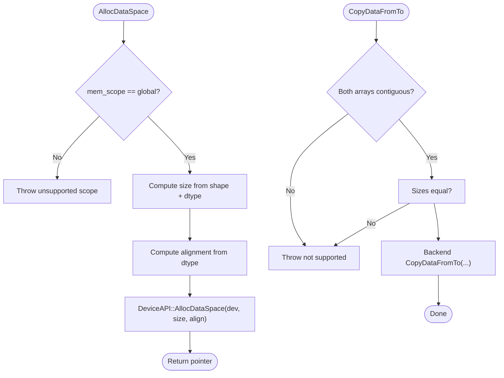

**Diagram sources**
- [device_api.cc:111-154](file://src/runtime/device_api.cc#L111-L154)
- [cpu_device_api.cc:95-117](file://src/runtime/cpu_device_api.cc#L95-L117)

**Section sources**
- [device_api.cc:111-154](file://src/runtime/device_api.cc#L111-L154)
- [cpu_device_api.cc:95-117](file://src/runtime/cpu_device_api.cc#L95-L117)

### Backend Registration and CMake Integration
- Backend registration: Global registry functions named device_api.<backend> are resolved by DeviceAPIManager to bind runtime implementations.
- CMake modules:
  - CUDA: Adds CUDA runtime sources, links CUDA libraries, optionally cuDNN/cuBLAS/Thrust/curand/NVTX.
  - ROCm: Adds ROCm runtime sources, links HIP/HSA/hipBLAS, optional rocThrust.
  - Metal: Links Metal/Foundation frameworks and adds Metal runtime sources.
  - Vulkan: Finds Vulkan, enables SPIR-V, adds Vulkan runtime and SPIR-V compiler sources.
  - Hexagon: Integrates SDK/toolchain, builds RPC server/simulator variants, adds DSP ops and QHL support.

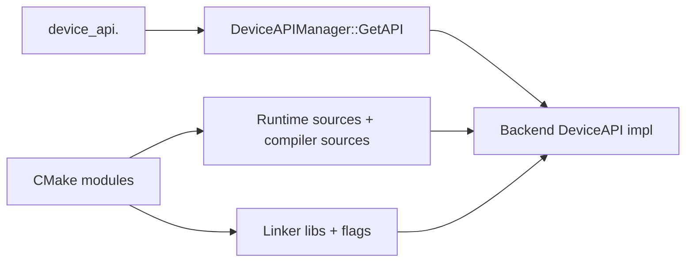

**Diagram sources**
- [device_api.cc:85-94](file://src/runtime/device_api.cc#L85-L94)
- [CUDA.cmake:53-142](file://cmake/modules/CUDA.cmake#L53-L142)
- [ROCm.cmake:35-72](file://cmake/modules/ROCm.cmake#L35-L72)
- [Metal.cmake:22-28](file://cmake/modules/Metal.cmake#L22-L28)
- [Vulkan.cmake:31-38](file://cmake/modules/Vulkan.cmake#L31-L38)
- [Hexagon.cmake:123-344](file://cmake/modules/Hexagon.cmake#L123-L344)

**Section sources**
- [device_api.cc:85-94](file://src/runtime/device_api.cc#L85-L94)
- [CUDA.cmake:53-142](file://cmake/modules/CUDA.cmake#L53-L142)
- [ROCm.cmake:35-72](file://cmake/modules/ROCm.cmake#L35-L72)
- [Metal.cmake:22-28](file://cmake/modules/Metal.cmake#L22-L28)
- [Vulkan.cmake:31-38](file://cmake/modules/Vulkan.cmake#L31-L38)
- [Hexagon.cmake:123-344](file://cmake/modules/Hexagon.cmake#L123-L344)

### Specialized Accelerators: Hexagon DSP
- Toolchain and SDK discovery, architecture flags, and selective inclusion of HVX ops and QHL math libraries.
- RPC server variants for Android and simulator, plus hardware-specific RPC skeleton for Hexagon targets.
- External libraries integration via fetch and compile flags.

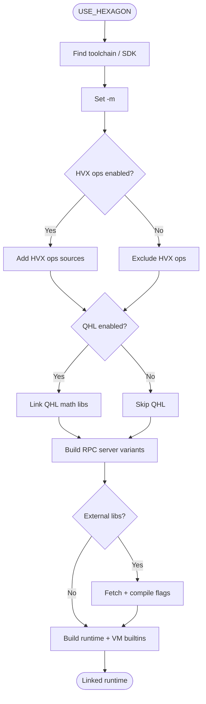

**Diagram sources**
- [Hexagon.cmake:23-344](file://cmake/modules/Hexagon.cmake#L23-L344)

**Section sources**
- [Hexagon.cmake:23-344](file://cmake/modules/Hexagon.cmake#L23-L344)
- [README.md](file://apps/hexagon_api/README.md)
- [launcher_main.cc](file://apps/hexagon_launcher/launcher_main.cc)

### Mobile Platforms: Metal, Vulkan, NNAPI
- Metal: CMake links Metal/Foundation and compiles Metal runtime sources for Apple platforms.
- Vulkan: CMake finds Vulkan, enables SPIR-V, and adds Vulkan runtime and SPIR-V compiler sources.
- NNAPI: Contrib modules and CMake flags indicate optional integration points for Android NNAPI.

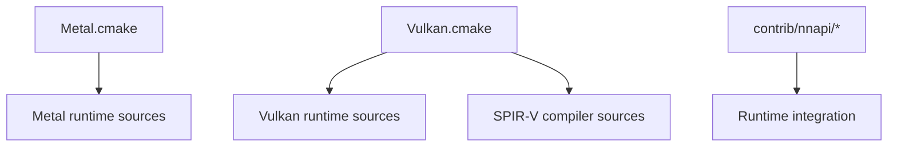

**Diagram sources**
- [Metal.cmake:18-28](file://cmake/modules/Metal.cmake#L18-L28)
- [Vulkan.cmake:18-38](file://cmake/modules/Vulkan.cmake#L18-L38)

**Section sources**
- [Metal.cmake:18-28](file://cmake/modules/Metal.cmake#L18-L28)
- [Vulkan.cmake:18-38](file://cmake/modules/Vulkan.cmake#L18-L38)

### GPU Backends: CUDA, ROCm, OpenCL
- CUDA: CMake adds CUDA runtime sources and links CUDA libraries; optional cuDNN/cuBLAS/Thrust/curand/NVTX integrations.
- ROCm: CMake adds ROCm runtime sources and links HIP/HSA/hipBLAS; optional rocThrust.
- OpenCL: Device attributes and runtime sources are integrated; capability detection is supported.

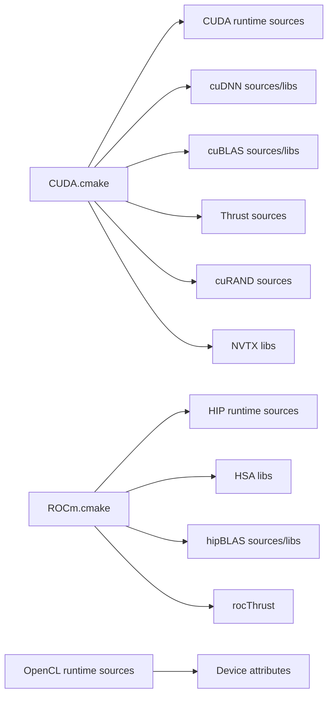

**Diagram sources**
- [CUDA.cmake:53-142](file://cmake/modules/CUDA.cmake#L53-L142)
- [ROCm.cmake:35-72](file://cmake/modules/ROCm.cmake#L35-L72)

**Section sources**
- [CUDA.cmake:53-142](file://cmake/modules/CUDA.cmake#L53-L142)
- [ROCm.cmake:35-72](file://cmake/modules/ROCm.cmake#L35-L72)

### CPU Architectures: x86, ARM, RISC-V
- LLVM-based CPU target: The target kind “llvm” is used for CPU backends. Device detection for CPU returns an llvm target with mtriple and mcpu derived from the host.
- Host memory management: CPUDeviceAPI provides aligned host allocations and attributes.

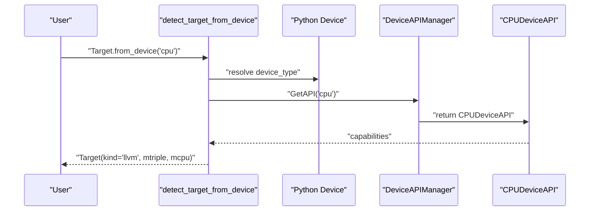

**Diagram sources**
- [detect_target.py:92-106](file://python/tvm/target/detect_target.py#L92-L106)
- [device_api.cc:85-94](file://src/runtime/device_api.cc#L85-L94)
- [cpu_device_api.cc:50-94](file://src/runtime/cpu_device_api.cc#L50-L94)

**Section sources**
- [detect_target.py:92-106](file://python/tvm/target/detect_target.py#L92-L106)
- [cpu_device_api.cc:50-94](file://src/runtime/cpu_device_api.cc#L50-L94)

## Dependency Analysis
- Python runtime depends on C++ runtime for device attributes and streams.
- Target detection depends on Python device wrapper and C++ DeviceAPIManager.
- Backend-specific CMake modules depend on external SDKs/libraries and inject sources and linker flags into the build.

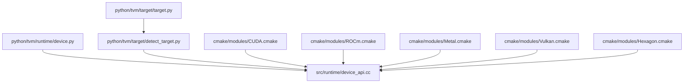

**Diagram sources**
- [device.py:1-331](file://python/tvm/runtime/device.py#L1-L331)
- [target.py:1-233](file://python/tvm/target/target.py#L1-L233)
- [detect_target.py:1-148](file://python/tvm/target/detect_target.py#L1-L148)
- [device_api.cc:1-278](file://src/runtime/device_api.cc#L1-L278)
- [CUDA.cmake:1-143](file://cmake/modules/CUDA.cmake#L1-L143)
- [ROCm.cmake:1-73](file://cmake/modules/ROCm.cmake#L1-L73)
- [Metal.cmake:1-29](file://cmake/modules/Metal.cmake#L1-L29)
- [Vulkan.cmake:1-39](file://cmake/modules/Vulkan.cmake#L1-L39)
- [Hexagon.cmake:1-344](file://cmake/modules/Hexagon.cmake#L1-L344)

**Section sources**
- [device.py:1-331](file://python/tvm/runtime/device.py#L1-L331)
- [target.py:1-233](file://python/tvm/target/target.py#L1-L233)
- [detect_target.py:1-148](file://python/tvm/target/detect_target.py#L1-L148)
- [device_api.cc:1-278](file://src/runtime/device_api.cc#L1-L278)
- [CUDA.cmake:1-143](file://cmake/modules/CUDA.cmake#L1-L143)
- [ROCm.cmake:1-73](file://cmake/modules/ROCm.cmake#L1-L73)
- [Metal.cmake:1-29](file://cmake/modules/Metal.cmake#L1-L29)
- [Vulkan.cmake:1-39](file://cmake/modules/Vulkan.cmake#L1-L39)
- [Hexagon.cmake:1-344](file://cmake/modules/Hexagon.cmake#L1-L344)

## Performance Considerations
- Attribute-driven tuning: Use device attributes exposed by the Python device wrapper (e.g., warp size, shared memory, max threads per block, compute version) to guide kernel launch parameters and buffer sizes.
- Memory alignment: DeviceAPI computes alignment from dtype; ensure tensors are aligned to improve bandwidth and reduce padding overhead.
- Streams and synchronization: Create and manage streams per device to overlap transfers and compute; synchronize streams explicitly where needed.
- Backend-specific features: For Vulkan, leverage feature flags (e.g., float16/int8/int16 support) to select optimized kernels; for CUDA, derive arch from compute version to target the correct SM architecture.
- Workspace pooling: CPUDeviceAPI uses thread-local pools to amortize allocation costs for temporary buffers.

[No sources needed since this section provides general guidance]

## Troubleshooting Guide
- Device existence and attributes: If a device reports non-existent or zero attributes, verify drivers and that TVM was compiled with backend support. Use the Python device wrapper to query attributes and existence.
- Capability detection errors: When detecting targets from a device, ensure the device exists and drivers are installed; otherwise, an error is raised.
- Backend registration failures: If a backend is not enabled, DeviceAPIManager will fail to resolve device_api.<backend>; confirm CMake configuration and environment variables for the backend.
- Cross-compilation and RPC: For mobile and embedded targets, use RPC servers and app bundles (Android/iOS) to deploy compiled modules; ensure the RPC tracker and server are configured correctly.

**Section sources**
- [device.py:32-51](file://python/tvm/runtime/device.py#L32-L51)
- [detect_target.py:124-137](file://python/tvm/target/detect_target.py#L124-L137)
- [device_api.cc:85-94](file://src/runtime/device_api.cc#L85-L94)

## Conclusion
TVM’s hardware backend system provides a robust, extensible framework for targeting diverse hardware. The Python target and device APIs offer a clean interface for configuration and capability queries, while the C++ DeviceAPIManager and backend-specific implementations deliver efficient runtime execution. CMake modules integrate optional backends and external libraries, enabling performance-tuned builds for CUDA, ROCm, Metal, Vulkan, and Hexagon. With proper target configuration, capability detection, and memory/stream management, developers can compile, optimize, and deploy AI workloads across CPUs, GPUs, mobile platforms, and accelerators.

[No sources needed since this section summarizes without analyzing specific files]

## Appendices

### Practical Compilation and Deployment Examples
- Compile for CPU (LLVM): Construct a target with kind “llvm” and appropriate mtriple/mcpu, then build the module.
- Compile for CUDA: Construct a target with kind “cuda”, infer arch from device compute version, and enable CUDA libraries via CMake.
- Compile for Metal/Vulkan: Enable Metal/Vulkan modules in CMake and construct targets accordingly; use device attributes for tuning.
- Compile for Hexagon: Configure SDK/toolchain, set architecture flags, and build runtime with RPC server variants for Android/simulator.
- Deploy with RPC: Use Android/iOS RPC apps to run compiled modules remotely; ensure RPC tracker and server are reachable.

[No sources needed since this section provides general guidance]

### Plugin Architecture for New Backends
- Implement a DeviceAPI subclass and register it via a global registry function named device_api.<backend>.
- Add CMake logic to include backend sources and link required libraries.
- Expose device attributes and streams through the DeviceAPI interface to integrate with TVM’s runtime.

**Section sources**
- [device_api.cc:85-94](file://src/runtime/device_api.cc#L85-L94)
- [CUDA.cmake:53-142](file://cmake/modules/CUDA.cmake#L53-L142)
- [ROCm.cmake:35-72](file://cmake/modules/ROCm.cmake#L35-L72)
- [Metal.cmake:22-28](file://cmake/modules/Metal.cmake#L22-L28)
- [Vulkan.cmake:31-38](file://cmake/modules/Vulkan.cmake#L31-L38)
- [Hexagon.cmake:123-344](file://cmake/modules/Hexagon.cmake#L123-L344)

### Cross-Compilation Workflows
- Use Target.with_host to specify a host target for cross-compilation.
- For mobile/embedded, build runtime with backend modules and deploy via RPC bundles.
- For Hexagon, build RPC server variants and integrate with launcher apps.

**Section sources**
- [target.py:157-158](file://python/tvm/target/target.py#L157-L158)
- [Hexagon.cmake:250-344](file://cmake/modules/Hexagon.cmake#L250-L344)
- [README.md](file://apps/android_rpc/README.md)
- [README.md](file://apps/ios_rpc/README.md)