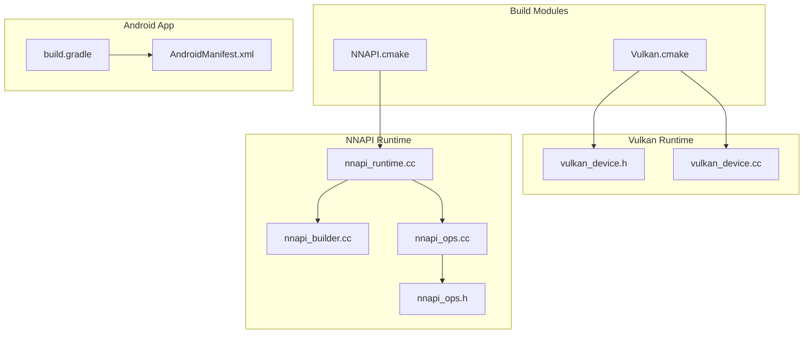
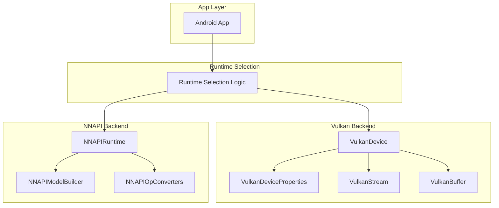
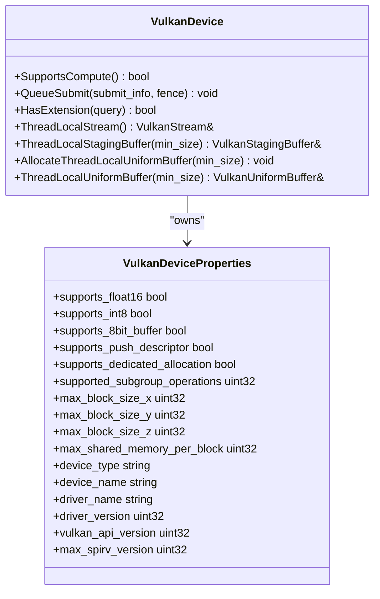
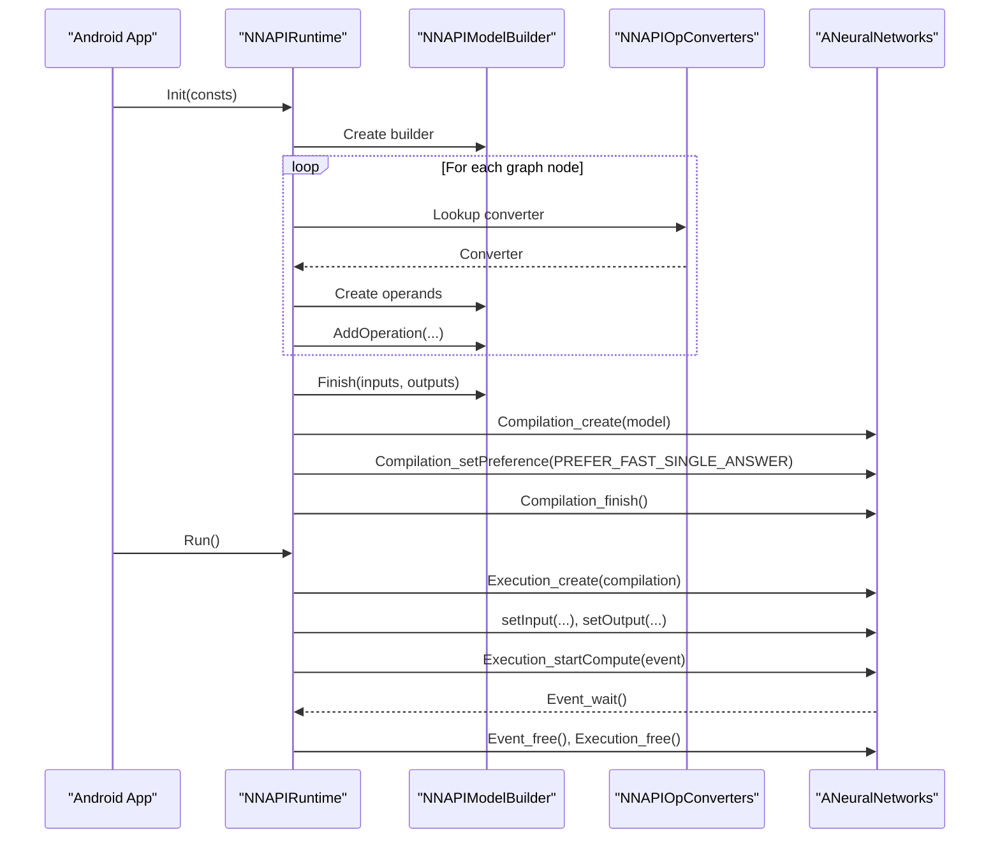
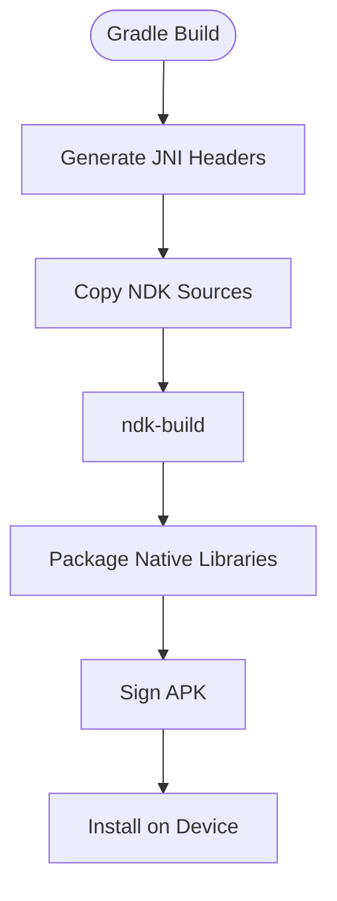
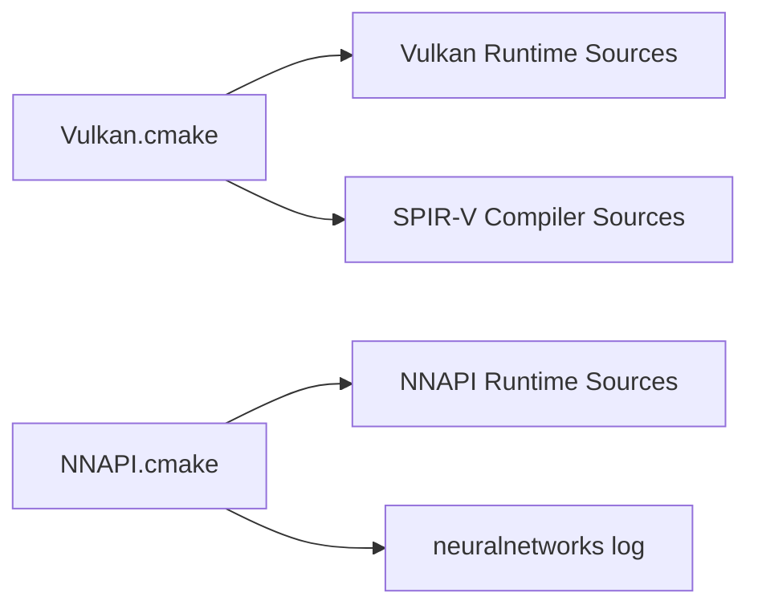

# Android Vulkan and NNAPI

<cite>
**Referenced Files in This Document**
- [Vulkan.cmake](file://cmake/modules/Vulkan.cmake)
- [NNAPI.cmake](file://cmake/modules/contrib/NNAPI.cmake)
- [vulkan_device.cc](file://src/runtime/vulkan/vulkan_device.cc)
- [vulkan_device.h](file://src/runtime/vulkan/vulkan_device.h)
- [nnapi_runtime.cc](file://src/runtime/contrib/nnapi/nnapi_runtime.cc)
- [nnapi_ops.cc](file://src/runtime/contrib/nnapi/nnapi_ops.cc)
- [nnapi_ops.h](file://src/runtime/contrib/nnapi/nnapi_ops.h)
- [nnapi_builder.cc](file://src/runtime/contrib/nnapi/nnapi_builder.cc)
- [AndroidManifest.xml](file://apps/android_rpc/app/src/main/AndroidManifest.xml)
- [build.gradle](file://apps/android_rpc/app/build.gradle)
</cite>

## Table of Contents
1. [Introduction](#introduction)
2. [Project Structure](#project-structure)
3. [Core Components](#core-components)
4. [Architecture Overview](#architecture-overview)
5. [Detailed Component Analysis](#detailed-component-analysis)
6. [Dependency Analysis](#dependency-analysis)
7. [Performance Considerations](#performance-considerations)
8. [Troubleshooting Guide](#troubleshooting-guide)
9. [Conclusion](#conclusion)
10. [Appendices](#appendices)

## Introduction
This document explains Android platform support in the TVM runtime via Vulkan and NNAPI backends. It covers the Vulkan runtime implementation, shader compilation pipeline, NNAPI integration for automatic backend selection, Android-specific considerations (power-aware scheduling, thermal throttling, and Android version compatibility), deployment strategies for APK integration, runtime selection logic, performance profiling, JNI bindings for model execution, and debugging techniques for GPU drivers. It also addresses Android security model implications, permission requirements, and sandbox restrictions for ML inference.

## Project Structure
The Android support spans build configuration, runtime components, and Android app integration:
- Build modules enable Vulkan and NNAPI at compile time.
- Vulkan runtime implements device enumeration, capability queries, and resource management.
- NNAPI runtime compiles and executes models using Android’s Neural Networks API.
- Android app demonstrates APK integration, JNI generation, and packaging.

**Diagram sources**
- [Vulkan.cmake:18-38](file://cmake/modules/Vulkan.cmake#L18-L38)
- [NNAPI.cmake:19-39](file://cmake/modules/contrib/NNAPI.cmake#L19-L39)
- [vulkan_device.h:117-316](file://src/runtime/vulkan/vulkan_device.h#L117-L316)
- [vulkan_device.cc:250-464](file://src/runtime/vulkan/vulkan_device.cc#L250-L464)
- [nnapi_runtime.cc:51-242](file://src/runtime/contrib/nnapi/nnapi_runtime.cc#L51-L242)
- [nnapi_builder.cc:133-228](file://src/runtime/contrib/nnapi/nnapi_builder.cc#L133-L228)
- [nnapi_ops.cc:552-589](file://src/runtime/contrib/nnapi/nnapi_ops.cc#L552-L589)
- [AndroidManifest.xml:22-57](file://apps/android_rpc/app/src/main/AndroidManifest.xml#L22-L57)
- [build.gradle:61-91](file://apps/android_rpc/app/build.gradle#L61-L91)

**Section sources**
- [Vulkan.cmake:18-38](file://cmake/modules/Vulkan.cmake#L18-L38)
- [NNAPI.cmake:19-39](file://cmake/modules/contrib/NNAPI.cmake#L19-L39)
- [vulkan_device.h:117-316](file://src/runtime/vulkan/vulkan_device.h#L117-L316)
- [vulkan_device.cc:250-464](file://src/runtime/vulkan/vulkan_device.cc#L250-L464)
- [nnapi_runtime.cc:51-242](file://src/runtime/contrib/nnapi/nnapi_runtime.cc#L51-L242)
- [nnapi_builder.cc:133-228](file://src/runtime/contrib/nnapi/nnapi_builder.cc#L133-L228)
- [nnapi_ops.cc:552-589](file://src/runtime/contrib/nnapi/nnapi_ops.cc#L552-L589)
- [AndroidManifest.xml:22-57](file://apps/android_rpc/app/src/main/AndroidManifest.xml#L22-L57)
- [build.gradle:61-91](file://apps/android_rpc/app/build.gradle#L61-L91)

## Core Components
- Vulkan runtime: Device initialization, capability discovery, memory type selection, and thread-local stream management.
- NNAPI runtime: Graph executor backed by Android Neural Networks API, model building, compilation, and execution.
- Build modules: Feature toggles for enabling Vulkan and NNAPI at build time.

Key responsibilities:
- Vulkan runtime exposes device properties, selects compute-capable queue families, enables optional extensions, and manages staging/uniform buffers per thread.
- NNAPI runtime converts graph nodes to NNAPI operations, constructs a model, compiles it, and runs inference with event-driven synchronization.

**Section sources**
- [vulkan_device.cc:37-221](file://src/runtime/vulkan/vulkan_device.cc#L37-L221)
- [vulkan_device.h:74-109](file://src/runtime/vulkan/vulkan_device.h#L74-L109)
- [nnapi_runtime.cc:51-184](file://src/runtime/contrib/nnapi/nnapi_runtime.cc#L51-L184)
- [nnapi_ops.cc:43-84](file://src/runtime/contrib/nnapi/nnapi_ops.cc#L43-L84)

## Architecture Overview
The Android runtime integrates two execution backends:
- Vulkan: Uses SPIR-V compilation and runtime buffers for compute.
- NNAPI: Converts supported ops into Android Neural Networks API operations and compiles them into a runnable model.

**Diagram sources**
- [vulkan_device.h:117-316](file://src/runtime/vulkan/vulkan_device.h#L117-L316)
- [vulkan_device.cc:250-464](file://src/runtime/vulkan/vulkan_device.cc#L250-L464)
- [nnapi_runtime.cc:51-184](file://src/runtime/contrib/nnapi/nnapi_runtime.cc#L51-L184)
- [nnapi_builder.cc:133-228](file://src/runtime/contrib/nnapi/nnapi_builder.cc#L133-L228)
- [nnapi_ops.cc:552-589](file://src/runtime/contrib/nnapi/nnapi_ops.cc#L552-L589)

## Detailed Component Analysis

### Vulkan Runtime Implementation
The Vulkan runtime encapsulates device creation, capability queries, and resource management:
- Capability queries include driver properties, subgroup operations, 8-bit/16-bit storage features, and optional extensions.
- Device selection prefers compute-only queue families for better system responsiveness.
- Thread-local streams and buffers are cached per thread to reduce overhead.
- Optional extensions guarded by environment variables allow disabling push descriptors or dedicated allocations when needed.

**Diagram sources**
- [vulkan_device.h:117-316](file://src/runtime/vulkan/vulkan_device.h#L117-L316)
- [vulkan_device.cc:37-221](file://src/runtime/vulkan/vulkan_device.cc#L37-L221)

**Section sources**
- [vulkan_device.cc:37-221](file://src/runtime/vulkan/vulkan_device.cc#L37-L221)
- [vulkan_device.h:74-109](file://src/runtime/vulkan/vulkan_device.h#L74-L109)

### NNAPI Integration and Automatic Backend Selection
The NNAPI runtime compiles a graph into an Android Neural Networks model and executes it:
- Builds inputs, operations, and outputs from the graph JSON.
- Converts supported operators to NNAPI operations with operand types and attributes.
- Compiles the model with a preference optimized for single-answer latency.
- Executes asynchronously and waits on completion events.

**Diagram sources**
- [nnapi_runtime.cc:73-184](file://src/runtime/contrib/nnapi/nnapi_runtime.cc#L73-L184)
- [nnapi_builder.cc:133-228](file://src/runtime/contrib/nnapi/nnapi_builder.cc#L133-L228)
- [nnapi_ops.cc:552-589](file://src/runtime/contrib/nnapi/nnapi_ops.cc#L552-L589)

**Section sources**
- [nnapi_runtime.cc:51-184](file://src/runtime/contrib/nnapi/nnapi_runtime.cc#L51-L184)
- [nnapi_builder.cc:133-228](file://src/runtime/contrib/nnapi/nnapi_builder.cc#L133-L228)
- [nnapi_ops.cc:43-84](file://src/runtime/contrib/nnapi/nnapi_ops.cc#L43-L84)

### Android APK Integration and JNI Bindings
The Android app integrates TVM through:
- Gradle tasks to generate JNI headers from Java and build native libraries with NDK.
- Packaging native libraries and dependencies into the APK.
- Manifest permissions for network access and optional native library hints.

**Diagram sources**
- [build.gradle:20-49](file://apps/android_rpc/app/build.gradle#L20-L49)
- [AndroidManifest.xml:22-57](file://apps/android_rpc/app/src/main/AndroidManifest.xml#L22-L57)

**Section sources**
- [build.gradle:20-49](file://apps/android_rpc/app/build.gradle#L20-L49)
- [AndroidManifest.xml:22-57](file://apps/android_rpc/app/src/main/AndroidManifest.xml#L22-L57)

## Dependency Analysis
Build-time dependencies:
- Vulkan: Requires Vulkan SDK and enables SPIR-V compilation and runtime sources.
- NNAPI: Links against Android Neural Networks API and adds definitions for graph executor integration.

**Diagram sources**
- [Vulkan.cmake:18-38](file://cmake/modules/Vulkan.cmake#L18-L38)
- [NNAPI.cmake:19-39](file://cmake/modules/contrib/NNAPI.cmake#L19-L39)

**Section sources**
- [Vulkan.cmake:18-38](file://cmake/modules/Vulkan.cmake#L18-L38)
- [NNAPI.cmake:19-39](file://cmake/modules/contrib/NNAPI.cmake#L19-L39)

## Performance Considerations
- Power-aware scheduling and thermal throttling:
  - Prefer compute-only queue families when available to minimize interference with graphics workloads.
  - Use immediate submission paths (when supported) to reduce CPU overhead.
  - Limit push descriptor usage if disabled via environment variables to improve compatibility.
- Memory management:
  - Select host-coherent staging buffers to avoid explicit flushes.
  - Choose device-local memory for compute buffers to reduce PCIe traffic.
- NNAPI preferences:
  - Compilation preference set to optimize for single-answer latency on mobile devices.

**Section sources**
- [vulkan_device.cc:420-438](file://src/runtime/vulkan/vulkan_device.cc#L420-L438)
- [vulkan_device.cc:340-353](file://src/runtime/vulkan/vulkan_device.cc#L340-L353)
- [nnapi_builder.cc:219-228](file://src/runtime/contrib/nnapi/nnapi_builder.cc#L219-L228)

## Troubleshooting Guide
- Vulkan device selection fails:
  - Ensure the device supports compute queues; otherwise, the device cannot be used.
  - Verify required extensions are present and enabled.
- NNAPI runtime disabled:
  - Build with NNAPI runtime enabled; otherwise, initialization and execution will throw an error.
- JNI build failures:
  - Confirm JNI header generation task completes and NDK build succeeds.
  - Ensure native libraries are packaged under the correct ABI folders.

**Section sources**
- [vulkan_device.cc:437-438](file://src/runtime/vulkan/vulkan_device.cc#L437-L438)
- [nnapi_runtime.cc:232-240](file://src/runtime/contrib/nnapi/nnapi_runtime.cc#L232-L240)
- [build.gradle:20-49](file://apps/android_rpc/app/build.gradle#L20-L49)

## Conclusion
TVM’s Android support combines a robust Vulkan runtime for low-level GPU compute and an NNAPI-backed graph executor for high-level operator fusion. Build modules enable selective inclusion of these backends, while the Android app demonstrates JNI integration and APK packaging. Proper device capability detection, memory management, and NNAPI compilation preferences help achieve reliable performance across diverse Android devices and OS versions.

## Appendices

### Android Version Compatibility
- Minimum SDK level configured in the Android app indicates baseline compatibility.
- NNAPI availability depends on the device’s Android version and vendor implementation.

**Section sources**
- [build.gradle:65-66](file://apps/android_rpc/app/build.gradle#L65-L66)

### Security Model and Permissions
- Network permission included for remote RPC scenarios.
- Native library hints indicate optional OpenCL support.

**Section sources**
- [AndroidManifest.xml:24-34](file://apps/android_rpc/app/src/main/AndroidManifest.xml#L24-L34)