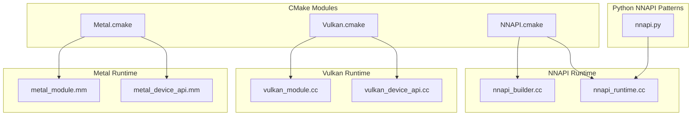
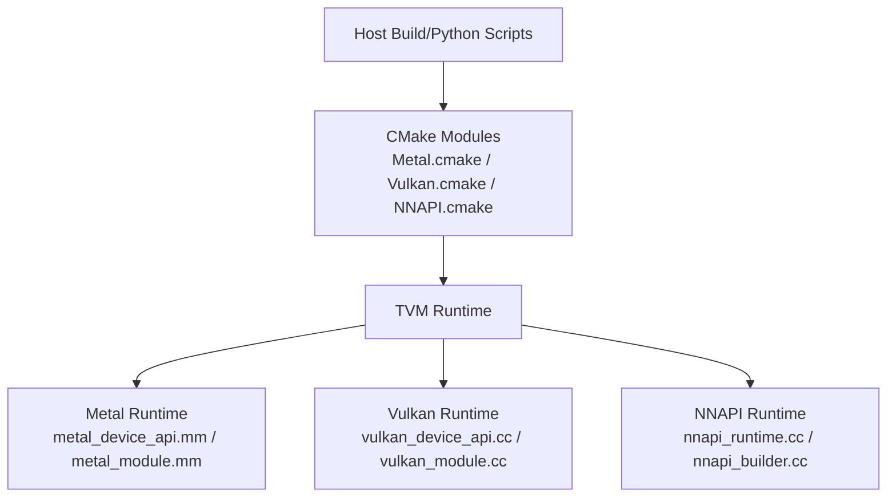
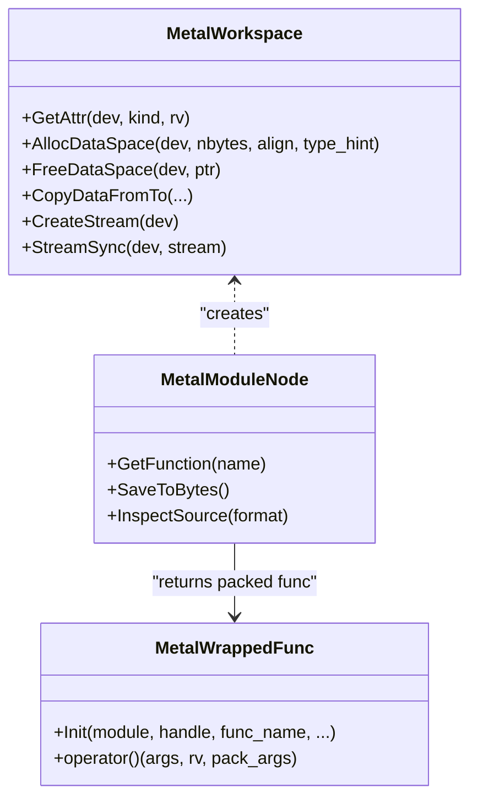
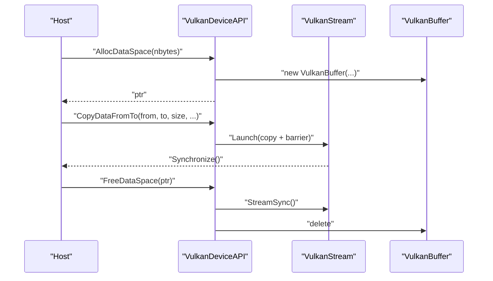
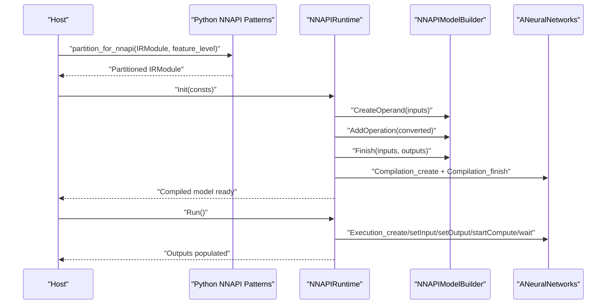
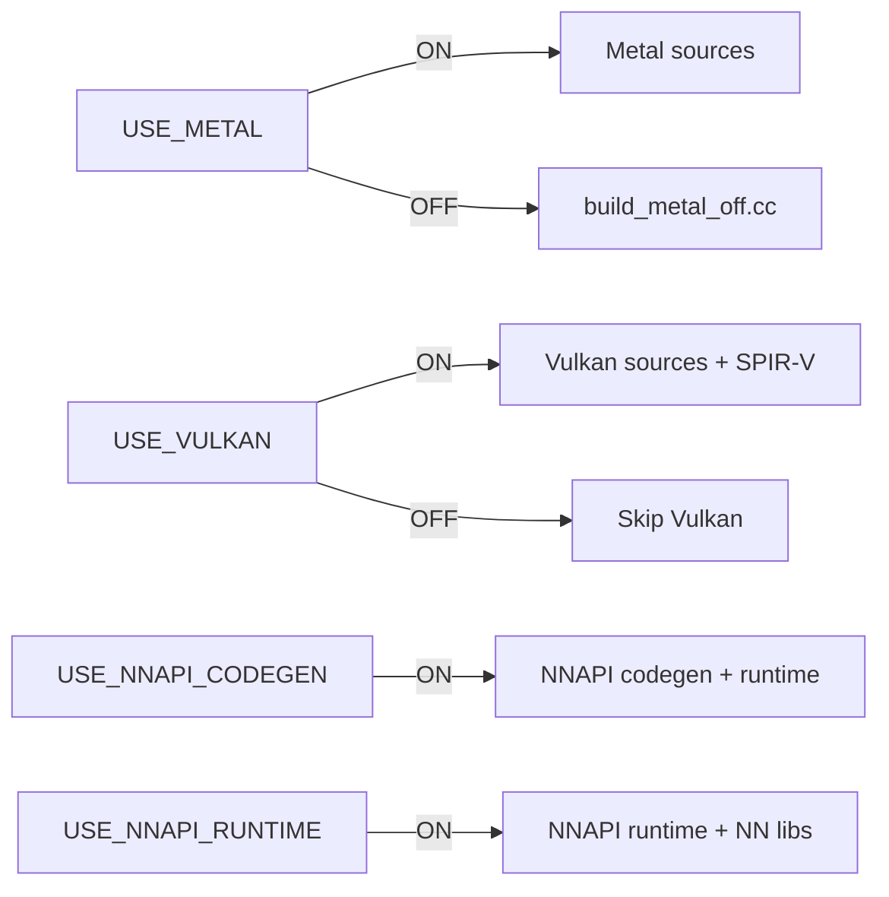

# Mobile Platforms

<cite>
**Referenced Files in This Document**
- [Metal.cmake](file://cmake/modules/Metal.cmake)
- [Vulkan.cmake](file://cmake/modules/Vulkan.cmake)
- [NNAPI.cmake](file://cmake/modules/contrib/NNAPI.cmake)
- [metal_device_api.mm](file://src/runtime/metal/metal_device_api.mm)
- [metal_module.mm](file://src/runtime/metal/metal_module.mm)
- [vulkan_device_api.cc](file://src/runtime/vulkan/vulkan_device_api.cc)
- [vulkan_module.cc](file://src/runtime/vulkan/vulkan_module.cc)
- [nnapi_runtime.cc](file://src/runtime/contrib/nnapi/nnapi_runtime.cc)
- [nnapi_builder.cc](file://src/runtime/contrib/nnapi/nnapi_builder.cc)
- [nnapi.py](file://python/tvm/relax/backend/contrib/nnapi.py)
- [android_rpc README](file://apps/android_rpc/README.md)
- [ios_rpc README](file://apps/ios_rpc/README.md)
</cite>

## Table of Contents
1. [Introduction](#introduction)
2. [Project Structure](#project-structure)
3. [Core Components](#core-components)
4. [Architecture Overview](#architecture-overview)
5. [Detailed Component Analysis](#detailed-component-analysis)
6. [Dependency Analysis](#dependency-analysis)
7. [Performance Considerations](#performance-considerations)
8. [Troubleshooting Guide](#troubleshooting-guide)
9. [Conclusion](#conclusion)
10. [Appendices](#appendices)

## Introduction
This document explains how TVM supports mobile and embedded platforms with a focus on:
- Metal backend for iOS/macOS
- Vulkan backend for Android/Linux
- NNAPI integration for Android deployment

It covers platform-specific considerations (power efficiency, memory constraints, thermal management), compilation targets, runtime selection strategies, deployment pipelines, examples of integrating with mobile apps, performance optimization for battery life, debugging techniques, and security/sandbox considerations.

## Project Structure
TVM’s mobile support spans CMake modules for enabling backends, runtime implementations for Metal and Vulkan, and NNAPI runtime and builder components. Python-side NNAPI pattern registration and partitioning logic complement the backend implementations.

**Diagram sources**
- [Metal.cmake:18-28](file://cmake/modules/Metal.cmake#L18-L28)
- [Vulkan.cmake:19-38](file://cmake/modules/Vulkan.cmake#L19-L38)
- [NNAPI.cmake:19-39](file://cmake/modules/contrib/NNAPI.cmake#L19-L39)
- [metal_device_api.mm:160-175](file://src/runtime/metal/metal_device_api.mm#L160-L175)
- [metal_module.mm:44-176](file://src/runtime/metal/metal_module.mm#L44-L176)
- [vulkan_device_api.cc:46-77](file://src/runtime/vulkan/vulkan_device_api.cc#L46-L77)
- [vulkan_module.cc:34-73](file://src/runtime/vulkan/vulkan_module.cc#L34-L73)
- [nnapi_runtime.cc:51-78](file://src/runtime/contrib/nnapi/nnapi_runtime.cc#L51-L78)
- [nnapi_builder.cc:133-228](file://src/runtime/contrib/nnapi/nnapi_builder.cc#L133-L228)
- [nnapi.py:164-175](file://python/tvm/relax/backend/contrib/nnapi.py#L164-L175)

**Section sources**
- [Metal.cmake:18-28](file://cmake/modules/Metal.cmake#L18-L28)
- [Vulkan.cmake:19-38](file://cmake/modules/Vulkan.cmake#L19-L38)
- [NNAPI.cmake:19-39](file://cmake/modules/contrib/NNAPI.cmake#L19-L39)

## Core Components
- Metal runtime for iOS/macOS:
  - Device API and stream management, memory allocation, and copy semantics
  - Module creation and kernel dispatch via pipeline state caching
- Vulkan runtime for Android/Linux:
  - Multi-device discovery, property queries, and stream synchronization
  - Buffer staging and transfers between CPU and GPU
- NNAPI runtime for Android:
  - Graph executor runtime backed by Android Neural Networks API
  - Model builder and operation converters
  - Python-side pattern registry and partitioning for NNAPI offload

**Section sources**
- [metal_device_api.mm:44-102](file://src/runtime/metal/metal_device_api.mm#L44-L102)
- [metal_module.mm:87-150](file://src/runtime/metal/metal_module.mm#L87-L150)
- [vulkan_device_api.cc:96-180](file://src/runtime/vulkan/vulkan_device_api.cc#L96-L180)
- [vulkan_module.cc:34-73](file://src/runtime/vulkan/vulkan_module.cc#L34-L73)
- [nnapi_runtime.cc:51-78](file://src/runtime/contrib/nnapi/nnapi_runtime.cc#L51-L78)
- [nnapi_builder.cc:133-228](file://src/runtime/contrib/nnapi/nnapi_builder.cc#L133-L228)
- [nnapi.py:164-175](file://python/tvm/relax/backend/contrib/nnapi.py#L164-L175)

## Architecture Overview
The mobile architecture integrates backend-specific runtime modules with TVM’s device abstraction and module loading. For Android, Vulkan and NNAPI can be used depending on device capabilities and OS support. For iOS, Metal is the primary backend.

**Diagram sources**
- [Metal.cmake:18-28](file://cmake/modules/Metal.cmake#L18-L28)
- [Vulkan.cmake:19-38](file://cmake/modules/Vulkan.cmake#L19-L38)
- [NNAPI.cmake:19-39](file://cmake/modules/contrib/NNAPI.cmake#L19-L39)
- [metal_device_api.mm:394-424](file://src/runtime/metal/metal_device_api.mm#L394-L424)
- [vulkan_device_api.cc:455-468](file://src/runtime/vulkan/vulkan_device_api.cc#L455-L468)
- [nnapi_runtime.cc:250-255](file://src/runtime/contrib/nnapi/nnapi_runtime.cc#L250-L255)

## Detailed Component Analysis

### Metal Backend (iOS/macOS)
- Device enumeration and attributes:
  - Initializes devices, sets warp size heuristics, and exposes device properties
- Memory and copy semantics:
  - Allocates GPU-only buffers with appropriate storage modes
  - Supports CPU-to-GPU, GPU-to-CPU, and GPU-to-GPU copies with staging and blit encoders
- Module and dispatch:
  - Compiles Metal kernels from source or binary, caches pipeline states per device
  - Packs function arguments and launches compute encoders with configured grid/block sizes

**Diagram sources**
- [metal_device_api.mm:44-102](file://src/runtime/metal/metal_device_api.mm#L44-L102)
- [metal_module.mm:52-176](file://src/runtime/metal/metal_module.mm#L52-L176)
- [metal_module.mm:179-254](file://src/runtime/metal/metal_module.mm#L179-L254)

**Section sources**
- [metal_device_api.mm:160-175](file://src/runtime/metal/metal_device_api.mm#L160-L175)
- [metal_device_api.mm:181-309](file://src/runtime/metal/metal_device_api.mm#L181-L309)
- [metal_module.mm:87-150](file://src/runtime/metal/metal_module.mm#L87-L150)
- [metal_module.mm:179-254](file://src/runtime/metal/metal_module.mm#L179-L254)

### Vulkan Backend (Android/Linux)
- Device discovery and preferences:
  - Enumerates physical devices and prioritizes discrete GPUs by default
- Property queries and capability checks:
  - Exposes device properties such as max threads per block, shared memory, and supported data types
- Memory and copy pipeline:
  - Uses staging buffers for host-visible transfers and ensures memory barriers for safety
- Module loading:
  - Loads SPIR-V modules from files or bytes and resolves function metadata

**Diagram sources**
- [vulkan_device_api.cc:284-315](file://src/runtime/vulkan/vulkan_device_api.cc#L284-L315)
- [vulkan_device_api.cc:335-442](file://src/runtime/vulkan/vulkan_device_api.cc#L335-L442)
- [vulkan_module.cc:34-73](file://src/runtime/vulkan/vulkan_module.cc#L34-L73)

**Section sources**
- [vulkan_device_api.cc:46-77](file://src/runtime/vulkan/vulkan_device_api.cc#L46-L77)
- [vulkan_device_api.cc:96-180](file://src/runtime/vulkan/vulkan_device_api.cc#L96-L180)
- [vulkan_device_api.cc:335-442](file://src/runtime/vulkan/vulkan_device_api.cc#L335-L442)
- [vulkan_module.cc:34-73](file://src/runtime/vulkan/vulkan_module.cc#L34-L73)

### NNAPI Integration (Android)
- Runtime composition:
  - Builds an NNAPI model from JSON graph nodes, compiles it, and executes via ANeuralNetworks APIs
- Builder and operand management:
  - Creates operands with proper shapes, types, and optional quantization parameters
- Python pattern registry:
  - Provides pattern tables to fuse Relax ops into NNAPI-supported subgraphs and partitions the graph accordingly

**Diagram sources**
- [nnapi.py:301-321](file://python/tvm/relax/backend/contrib/nnapi.py#L301-L321)
- [nnapi_runtime.cc:73-128](file://src/runtime/contrib/nnapi/nnapi_runtime.cc#L73-L128)
- [nnapi_runtime.cc:130-184](file://src/runtime/contrib/nnapi/nnapi_runtime.cc#L130-L184)
- [nnapi_builder.cc:133-228](file://src/runtime/contrib/nnapi/nnapi_builder.cc#L133-L228)

**Section sources**
- [nnapi_runtime.cc:51-78](file://src/runtime/contrib/nnapi/nnapi_runtime.cc#L51-L78)
- [nnapi_runtime.cc:80-128](file://src/runtime/contrib/nnapi/nnapi_runtime.cc#L80-L128)
- [nnapi_runtime.cc:180-184](file://src/runtime/contrib/nnapi/nnapi_runtime.cc#L180-L184)
- [nnapi_builder.cc:133-228](file://src/runtime/contrib/nnapi/nnapi_builder.cc#L133-L228)
- [nnapi.py:164-175](file://python/tvm/relax/backend/contrib/nnapi.py#L164-L175)
- [nnapi.py:301-321](file://python/tvm/relax/backend/contrib/nnapi.py#L301-L321)

## Dependency Analysis
- Build-time toggles:
  - Metal: conditionally included when enabled; otherwise compiler stubs are added
  - Vulkan: requires Vulkan SDK; adds SPIR-V tooling and runtime sources
  - NNAPI: can build codegen and/or runtime; runtime links against Android NN libs
- Runtime linkage:
  - Metal links against Metal and Foundation frameworks
  - Vulkan links against Vulkan loader and SPIR-V tools
  - NNAPI runtime links against Android NN and log libraries

**Diagram sources**
- [Metal.cmake:18-28](file://cmake/modules/Metal.cmake#L18-L28)
- [Vulkan.cmake:19-38](file://cmake/modules/Vulkan.cmake#L19-L38)
- [NNAPI.cmake:19-39](file://cmake/modules/contrib/NNAPI.cmake#L19-L39)

**Section sources**
- [Metal.cmake:18-28](file://cmake/modules/Metal.cmake#L18-L28)
- [Vulkan.cmake:19-38](file://cmake/modules/Vulkan.cmake#L19-L38)
- [NNAPI.cmake:19-39](file://cmake/modules/contrib/NNAPI.cmake#L19-L39)

## Performance Considerations
- Power efficiency and thermal management:
  - Prefer GPU backends (Metal/Vulkan/NNAPI) for compute-heavy tasks to reduce CPU on-battery work
  - Use asynchronous transfers and staging buffers to overlap compute and memory operations
  - Minimize buffer churn and synchronize only when necessary to avoid prolonged GPU busy periods
- Memory constraints:
  - Choose appropriate data types (e.g., FP16 where supported) and leverage device capabilities exposed via target property queries
  - Reuse staging buffers and reset pools after synchronization to limit peak allocations
- Scheduling and kernel launch:
  - Tune grid/block dimensions to respect device limits and occupancy
  - Avoid cross-device copies; stage through CPU only when unavoidable
- Android-specific:
  - NNAPI can offload supported subgraphs to the system’s accelerator; ensure feature level compatibility and prefer NNAPI for common ops when available

[No sources needed since this section provides general guidance]

## Troubleshooting Guide
- Metal
  - Device initialization and attribute retrieval: verify device count and properties are correctly exposed
  - Copy semantics: ensure staging buffers are flushed when switching between CPU and GPU paths
  - Pipeline state caching: recompile kernels if device capabilities change or if cached states become invalid
- Vulkan
  - Driver compatibility: handle incompatible drivers gracefully; fall back to CPU or other backends when initialization fails
  - Memory barriers and staging: confirm proper flush/invalidate sequences for host-coherent vs non-coherent memory
- NNAPI
  - Feature level mismatches: restrict patterns to supported feature levels
  - Operation coverage: unsupported ops will cause partitioning failures; adjust model or fallback path
- Mobile app integration
  - Android RPC: ensure RPC tracker connectivity and correct standalone toolchain configuration
  - iOS RPC: work around sandbox restrictions by bundling prebuilt libraries or using custom DSO loader in debug builds

**Section sources**
- [vulkan_device_api.cc:46-77](file://src/runtime/vulkan/vulkan_device_api.cc#L46-L77)
- [vulkan_device_api.cc:335-442](file://src/runtime/vulkan/vulkan_device_api.cc#L335-L442)
- [nnapi_runtime.cc:231-241](file://src/runtime/contrib/nnapi/nnapi_runtime.cc#L231-L241)
- [android_rpc README:161-171](file://apps/android_rpc/README.md#L161-L171)
- [ios_rpc README:93-104](file://apps/ios_rpc/README.md#L93-L104)

## Conclusion
TVM’s mobile stack provides robust, backend-agnostic execution across iOS (Metal), Android/Linux (Vulkan), and Android (NNAPI). By leveraging platform-specific strengths—GPU compute, system accelerators, and efficient memory pathways—applications can achieve strong performance while respecting power and thermal constraints. Proper build configuration, runtime selection, and deployment pipelines are essential for reliable mobile inference.

[No sources needed since this section summarizes without analyzing specific files]

## Appendices

### Platform-specific considerations
- iOS
  - Metal is the primary backend; device memory modes differ between iPhone and macOS hosts
  - Sandboxing restrictions require bundling binaries or using debug-time JIT mechanisms
- Android
  - Vulkan offers broad GPU support; NNAPI enables system-accelerated execution for supported ops
  - Feature level determines which NNAPI operations are available
- Linux
  - Vulkan runtime is available for desktop-class devices; ensure driver compatibility

[No sources needed since this section provides general guidance]

### Compilation and deployment pipelines
- iOS
  - Build libtvm_runtime dylib and integrate with the iOS RPC app; enable Metal via build flags
  - Use Xcode project initialization and device provisioning
- Android
  - Build APK with RPC server; configure standalone toolchain and RPC tracker/proxy
  - Test vector addition across CPU, OpenCL, and Vulkan targets

**Section sources**
- [ios_rpc README:51-66](file://apps/ios_rpc/README.md#L51-L66)
- [ios_rpc README:68-92](file://apps/ios_rpc/README.md#L68-L92)
- [android_rpc README:25-82](file://apps/android_rpc/README.md#L25-L82)
- [android_rpc README:83-138](file://apps/android_rpc/README.md#L83-L138)

### Security and sandbox restrictions
- iOS
  - Dynamic library loading is restricted; use debug-time custom dlopen or bundle prebuilt modules
  - Network access depends on app entitlements; RPC modes (standalone, proxy, tracker) must respect device networking
- Android
  - NNAPI runtime requires linking against Android NN libraries; ensure correct permissions and feature availability
  - RPC APK must be signed; manage keystore and signing steps carefully

**Section sources**
- [ios_rpc README:93-104](file://apps/ios_rpc/README.md#L93-L104)
- [ios_rpc README:105-114](file://apps/ios_rpc/README.md#L105-L114)
- [ios_rpc README:216-256](file://apps/ios_rpc/README.md#L216-L256)
- [android_rpc README:55-74](file://apps/android_rpc/README.md#L55-L74)
- [NNAPI.cmake:36-38](file://cmake/modules/contrib/NNAPI.cmake#L36-L38)